# backend-jvm-learning

[TOC]

JVM：

上篇+中篇+下篇一部分：

https://www.bilibili.com/video/BV1PJ411n7xZ?spm_id_from=333.788.player.switch&vd_source=b850b3a29a70c8eb888ce7dff776a5d1&p=381

下篇第二部分：

https://www.bilibili.com/video/BV1Dz4y1A7FB/?spm_id_from=333.788.recommend_more_video.0&vd_source=b850b3a29a70c8eb888ce7dff776a5d1  （尚硅谷JVM精讲与GC调优教程（宋红康主讲，含jvm面试真题））

https://weread.qq.com/web/reader/30932dd0813ab8194g0175fdk8e232ec02198e296a067180（剑指JVM）

JDK8文档：https://docs.oracle.com/javase/8/docs

JDK下载：https://www.oracle.com/java/technologies/downloads/

Java语言文档：https://docs.oracle.com/en/java/javase/

Java语言规范与虚拟机规范：https://docs.oracle.com/javase/specs/index.html

编程语言排行榜：https://www.tiobe.com/tiobe-index/

JDK工具官方文档：https://docs.oracle.com/en/java/javase/11/tools/tools-and-command-reference.html#JSWOR-GUID-55DE52DF-5774-4AAB-B334-E026FBAE6F34

[jvm参数列表](https://docs.oracle.com/javase/8/docs/technotes/tools/unix/java.html)

为什么移除永久代：https://openjdk.org/jeps/122

字符串常量池调整的官方声明：https://www.oracle.com/java/technologies/javase/jdk7-relnotes.html#jdk7changes

**熟悉GC常用算法，熟悉常见垃圾收集器，具有实际JVM调优实战经验。**

# 前言篇

## 开发人员如何看待上层框架

​	<span style="color:#ec2b24;font-weight:bold;font-size:18px;">一些有一定工作经验的开发人员，打心眼儿里觉得SSM、微服务等上层技术才是重点，基础技术并不重要，这其实是一种本末倒置的“病态”。</span>

​	<span style="color:#ec2b24;font-weight:bold;font-size:18px;">如果我们把核心类库的API比作数学公式的话，那么Java虚拟机的知识就好比公式的推到过程。</span>

## 跨平台的语言Java与跨语言的平台JVM

<span style="color:blue;font-weight:bold;">Java不是最强大的语言，但JVM是最强大的虚拟机。</span>


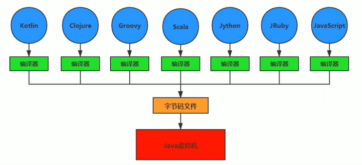

## 准备

- idea上安装 jclasslib Bytecode Viewer 插件

# 第1章 JVM与Java体系结构

## 1.1 为什么要学习JVM

​	开发者都有找工作的经历，随着互联网门槛越来越高，JVM知识也是中高级程序员求职面试时经常被问到的话题。所以如果想要通过面试，JVM知识是必备技能之一。除去面试，在程序开发的时候也会出现一些比较棘手的问题，比如：

1. 处于运行状态的线上系统突然卡死，造成系统无法访问，甚至直接内存溢出异常（Out Of Memory Error 简称：OOM）。

2. 希望解决线上JVM垃圾回收的相关问题，但却无从下手。

3. 新项目上线，对各种JVM参数设置一脸茫然，选择系统默认设置，最后系统宕机。

​	以上问题都与JVM有关，学会JVM后这些问题便迎刃而解。

​	大部分Java开发人员，会在项目中使用与Java平台相关的各种集成技术，但是对于Java技术的核心JVM却了解甚少。当然也有一些有一定工作经验的开发人员，心里一直认为SSM、微服务等技术才是重点，基础技术并不重要，这其实是一种本末倒置的“病态”。如果我们把核心类库的API比作数学公式的话，那么JVM的知识就好比公式的推导过程。对于一位合格的开发者来说，JVM中的一些知识也是必须掌握的。

<span style="color:red;font-weight:bold;">你用惯了那么多框架（Tomcat/Spring/MyBatis/Dubbo/Kafka......），可有一款能深入理解，更不用说开发一个框架。</span>

<span style="color:red;font-weight:bold;">底层技术多年来变化甚少，应用层框架枝繁叶茂。</span>

<span style="color:red;font-weight:bold;">打好地基，才能建造高楼大厦！！！</span>

​	JVM中的垃圾收集机制为我们整合了很多烦琐的工作，大大提高了开发的效率。垃圾收集也不是万能的，知悉JVM内存结构和工作机制也是Java工程师进阶的必备能力，它是设计高扩展性应用和诊断程序运行时问题的基础。深入了解JVM，有利于开发人员对项目做性能优化、保证平台性能和稳定性、优化项目架构、分析系统潜在风险以及解决系统瓶颈问题。

## 1.2 Java及JVM的简介

### 1.2.1 TIOBE编程语言排行榜

编程语言排行榜：https://www.tiobe.com/tiobe-index/

<div style="text-align:center;font-weight:bold;">TIOBE编程语言排行榜（20241102 17:12:37）</div>


### 1.2.2 Java：跨平台的语言

​	随着Java以及Java社区的不断壮大，Java也早已不再是简简单单的一门计算机语言了，它更是一个开放的平台、一种共享的文化、一个庞大的社区。

<div style="text-align:center;font-weight:bold;">Java语言的跨平台性</div>


​	按照技术所服务的领域来划分，Java技术体系可以分为以下四条主要的产品线。

1. Java SE(Standard Edition)：支持面向桌面级应用（如Windows下的应用程序）的Java平台，提供了完整的Java核心API，这条产品线在JDK 6以前被称为J2SE。
2. Java EE(Enterprise Edition)：支持使用多层架构的企业应用（如ERP、MIS、CRM应用）的Java平台，除了提供Java SE API外，还对其做了大量有针对性的扩充，并提供了相关的部署支持，这条产品线在JDK 6以前被称为J2EE，在JDK 10以后被Oracle放弃，捐献给Eclipse基金会管理，此后被称为Jakarta EE。
3. Java ME(Micro Edition)：支持Java程序运行在移动终端（手机、PDA）上的平台，对Java API有所精简，并加入了移动终端的针对性支持，这条产品线在JDK 6以前被称为J2ME。有一点读者请勿混淆，现在在智能手机上非常流行的、主要使用Java语言开发程序的Android并不属于Java ME。

4. Java Card：支持Java小程序(Applets)运行在小内存设备（如智能卡）上的平台。

### 1.2.3 JVM：跨语言的平台

​	这里所述的JVM与Java SE 8平台相互兼容，如果说Java是跨平台的语言，那JVM就是跨语言的平台。首先，看一下[JVM官方文档](https://docs.oracle.com/javase/specs/jvms/se8/html/jvms-1.html#jvms-1.2)

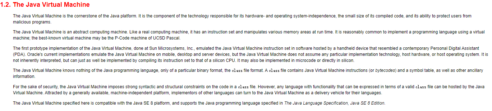

​	JVM是整个Java平台的基石，是Java技术用于实现硬件无关与操作系统无关的关键部分，是Java语言生成出极小体积的编译代码的运行平台，是保障用户机器免于恶意代码损害的屏障。

​	JVM与Java语言并没有必然的联系，它只与特定的二进制文件格式——class文件格式所关联。class文件包含JVM指令集［或者称为字节码(Bytecode)］和符号表，以及其他一些辅助信息。

​	基于安全方面的考虑，JVM在class文件中施加了许多强制性的语法和结构化约束，凡是能用class文件正确表达出来的编程语言，都可以放在JVM里面执行。由于它是一个通用的、与机器无关的执行平台，所以其他语言的实现者都可以考虑将JVM作为那些语言的交付媒介。

​	随着Java 7的正式发布，JVM的设计者通过JSR-292规范基本实现了在JVM平台上运行非Java语言编写的程序，如图1-4所示。不同的编译器，可以编译出相同的字节码文件，字节码文件也可以在不同的JVM上运行。

<div style="text-align:center;font-weight:bold;">JVM跨平台的语言</div>


​	JVM根本不关心运行在其内部的程序到底是使用何种编程语言编写的，它只关心“字节码”文件。也就是说JVM拥有语言无关性，并不会单纯地与Java语言“终身绑定”，只要其他编程语言的编译结果满足并包含JVM的内部指令集、符号表以及其他的辅助信息，它就是一个有效的字节码文件，就能够被虚拟机所识别并装载运行。现在开发语言越来越多，虽然Java语言并不是最强大的语言，但JVM可以说是业内公认的最强大的虚拟机。

​	我们平时说的Java字节码，指的是用Java语言编译成的字节码。准确地说，任何能在JVM平台上执行的字节码格式都是一样的。所以应该统称为“JVM字节码”。

​	Java平台上的多语言混合编程正在成为主流，通过特定领域的语言去解决特定领域的问题是当前软件开发应对日趋复杂的项目需求的一个方向。

​	试想一下，在一个项目之中，并行处理使用Clojure语言，展示层使用JRuby/Rails语言，中间层则使用Java语言，每个应用层都使用不同的编程语言来完成。而且，接口对每一层的开发者都是透明的，各种语言之间的交互不存在任何困难，就像使用自己语言的原生API一样方便，因为它们最终都运行在一个虚拟机上。

​	对这些运行于JVM之上、Java之外的语言，来自系统级的、底层的支持正在迅速增强，<span style="color:#9400D3;">以JSR-292为核心的一系列项目和功能改进（如DaVinci Machine项目、Nashorn引擎、InvokeDynamic指令、java.lang.invoke包等），推动JVM从“Java语言的虚拟机”向“多语言虚拟机”的方向发展</span>。

### 1.2.4 JVM的位置

<div style="text-align:center;font-weight:bold;">JVM运行在操作系统之上</div>

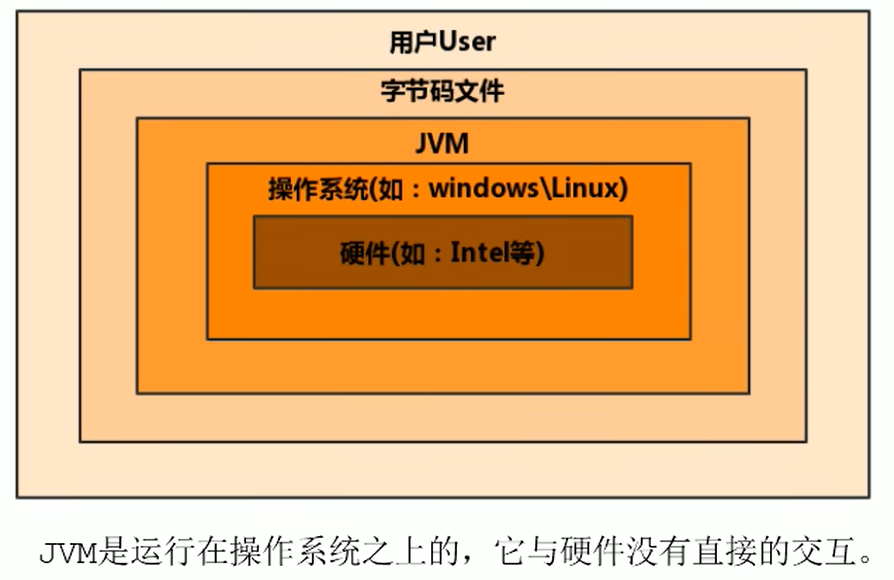

如下图所示：JDK包含了JRE,JRE包含了JVM。

<div style="text-align:center;font-weight:bold;">JVM在整个JDK体系中的位置</div>

[Java Platform Standard Edition 8 Documentation](https://docs.oracle.com/javase/8/docs/)

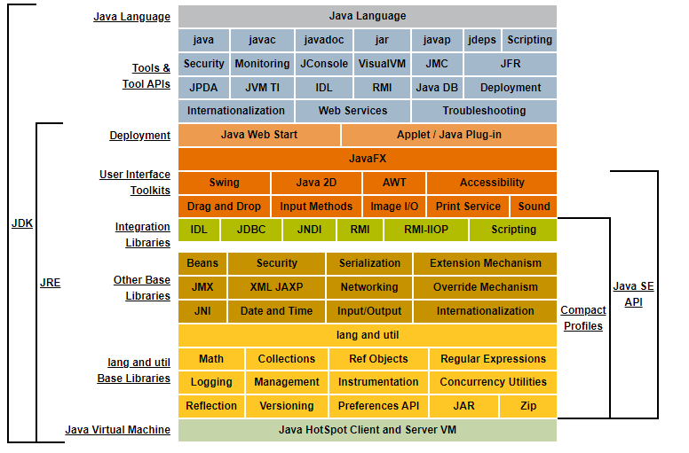

## 1.3 Java发展的重大事件

- 1991年，在Sun计算机公司中，由Patrick Naughton、MikeSheridan及James Gosling领导的小组Green Team开发出了新的程序语言，命名为Oak，后期命名为Java。
- 1995年，Sun正式发布Java和HotJava产品，Java首次公开亮相。
- 1996年1月23日，Sun发布了JDK 1.0。
-  1998年，JDK 1.2版本发布。同时，Sun发布了JSP/Servlet、EJB规范，以及将Java分成了J2EE、J2SE和J2ME。这表明了Java开始向企业、桌面应用和移动设备应用三大领域挺进。
- 2000年，JDK 1.3发布，Java HotSpot Virtual Machine正式发布，成为Java的默认虚拟机。
- 2002年，JDK 1.4发布，古老的Classic虚拟机退出历史舞台。
- 2003年年底，Java平台的Scala正式发布，同年Groovy也加入了Java阵营。
- 2004年，JDK 1.5发布。同时JDK 1.5改名为JavaSE 5.0。
- 2006年，JDK 6发布。同年，Java开源并建立了Open JDK。顺理成章，HotSpot虚拟机也成为了Open JDK中的默认虚拟机。
- 2007年，Java平台迎来了新伙伴Clojure。
- 2008年，Oracle收购了BEA，得到了JRockit虚拟机。
- 2009年，Twitter宣布把后台大部分程序从Ruby迁移到Scala，这是Java平台的又一次大规模应用。
- 2009年4月，Oracle收购了Sun，获得Java商标和最具价值的HotSpot虚拟机。此时，Oracle拥有市场占用率最高的两款虚拟机HotSpot和JRockit，并计划在未来对它们进行整合，成为HotRockit。
- 2011年，JDK 7发布。在JDK 1.7u4中，正式启用了新的垃圾回收器G1。
- 2014年，JDK 8发布。JDK 8是继JDK 5后改革最大的一个版本，添加了很多新特性，如Lambda表达式、Stream API以及函数式编程等。
- 2017年，JDK 9发布。将G1设置为默认GC，替代CMS。
- 2017年，IBM的J9开源，形成了现在的Open J9社区。
- 2018年，Android的Java侵权案判决，Google赔偿Oracle计88亿美元。
- 2018年，Oracle宣告JavaEE成为历史名词，JDBC、JMS、Servlet赠予Eclipse基金会。
- 2018年，JDK 11发布，LTS版本的JDK，发布革命性的ZGC，调整JDK授权许可。
- 2019年，JDK 12发布，加入RedHat领导开发的Shenandoah GC。
- 2020年，JDK 15发布，ZGC转正，支持的平台包括Linux、Windows和macOS。同时，Shenandoah垃圾回收算法终于从实验特性转变为产品特性。

## 1.4 Open JDK和Oracle JDK

​	在调整JDK授权许可之后，每次发布JDK的新版本的时候都会同时发布两个新的Open JDK版本和Oracle JDK版本。两个版本的主要区别是基于的协议不同，Open JDK基于GPL协议，Oracle JDK基于OTN的协议。Open JDK的维护期间为半年，即半年更新一个版本，一旦出现问题就需要更新JDK的版本。Oracle JDK的维护期为3年，但是商业使用需要付费。两者之间还有很多代码实现是一样的，例如JDBC、javac、core libraries等。

<div style="text-align:center;font-weight:bold;">Open JDK和Oracle JDK之间的关系</div>

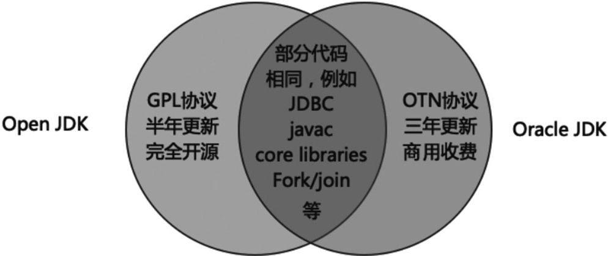

​	在JDK 11之前，Oracle JDK中还会存在一些Open JDK中没有的、闭源的功能。但在JDK 11中，我们可以认为Open JDK和Oracle JDK代码实质上已经完全一致。

## 1.5 JVM的整体结构

​	HotSpot VM是目前市面上高性能虚拟机的代表作之一，它采用解释器与即时编译器并存的架构。在今天，Java程序的运行性能早已脱胎换骨，已经达到了可以和C/C++程序一较高下的地步。

<div style="text-align:center;font-weight:bold;">HotSpot VM整体结构图</div>

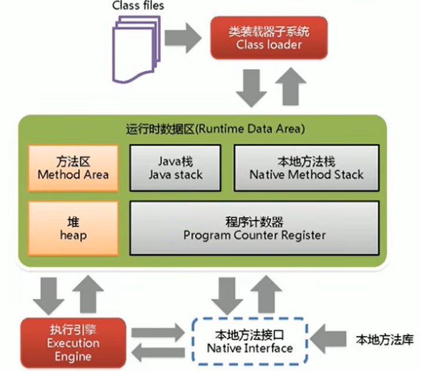

该架构可以分成三层：

<span style="color:#FFA500;font-weight:bold;">最上层</span>：类装载器子系统。javac编译器将编译好的字节码文件，通过Java类装载器执行机制，把对象或字节码文件存放在JVM内存划分区域。中间层：运行时数据区(Runtime Data Area)。主要是在Java代码运行时用于存放数据的区域，包括方法区、堆、Java栈、程序计数器、本地方法栈。

<span style="color:#FFA500;font-weight:bold;">中间层</span>：运行时数据区(Runtime Data Area)。主要是在Java代码运行时用于存放数据的区域，包括方法区、堆、Java栈、程序计数器、本地方法栈。

<span style="color:#FFA500;font-weight:bold;">最下层</span>：执行引擎层。执行引擎包含解释器、JIT(Just In Time)编译器和垃圾回收器(Garbage Collection,GC)，在后续章节会进行详细的介绍。

## 1.6 Java代码执行流程

​	Java源文件经过编译器的词法分析、语法分析、语义分析、字节码生成器等一系列过程生成以“.class”为后缀的字节码文件。Java编译器编译过程中，任何一个节点执行失败都会造成编译失败。字节码文件再经过JVM的类加载器、字节码校验器、翻译字节码（解释执行）或JIT编译器（编译执行）的过程编译成机器指令，提供给操作系统进行执行。

​	JVM的主要任务就是将字节码装载到其内部，解释／编译为对应平台上的机器指令执行。JVM使用类加载器(Class Loader)装载class文件，虽然各个平台的JVM内部实现细节不尽相同，但是它们共同执行的字节码内容却是一样的。类加载完成之后，会进行字节码校验，字节码校验通过，JVM解释器会把字节码翻译成机器码交由操作系统执行。

​	早期，我们说Java是一门解释型语言，因为在Java刚诞生，即JDK1.0的时候，Java的定位是一门解释型语言，也就是将Java程序编写好之后，先通过javac将源码编译为字节码，再对生成的字节码进行逐行解释执行。

​	<span style="color:#9400D3;">现在我们提到Java，更多地认为其是一门半编译半解释型的语言，因为Java为了解决性能问题，采用了一种叫作JIT即时编译的技术，也就是将执行比较频繁的整个方法或代码块直接编译成本地机器码，以后执行这些方法或代码时，直接执行生成的机器码即可</span>。

​	换句话说，在HotSpot VM内部，即时编译器与解释器是并存的，通过编译器与解释器的协同工作，既可以保证程序的响应时间，同时还能够提高程序的执行性能。目前市面上大多数主流虚拟机都采用此架构。

<div style="text-align:center;font-weight:bold;">Java代码执行流程</div>

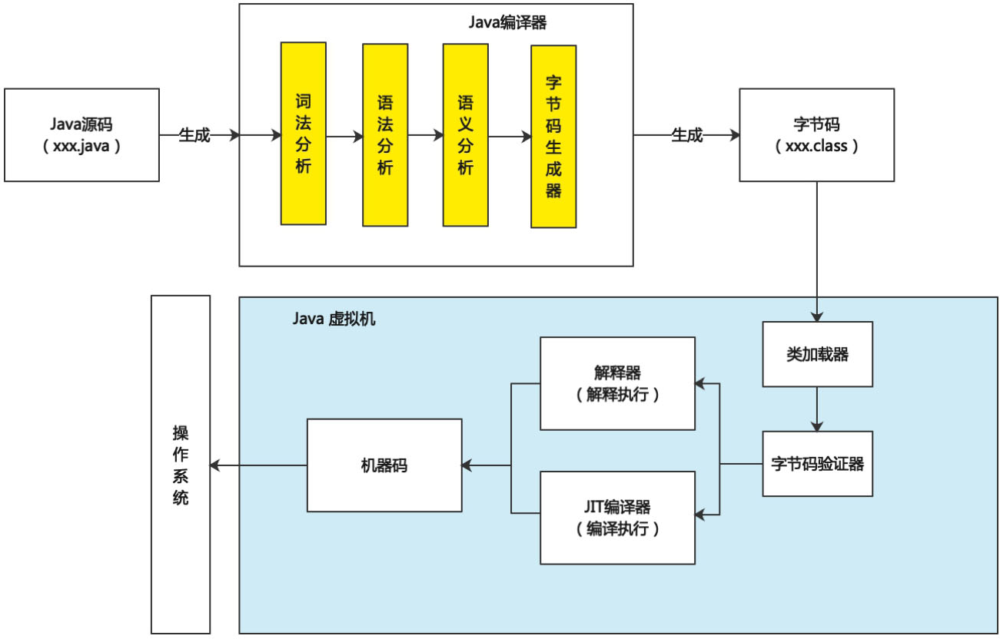

<div style="text-align:center;font-weight:bold;">Java代码执行详细流程</div>


## 1.7 JVM的架构模型

​	Java编译器输入的指令流是一种基于栈的指令集架构，另外一种指令集架构则是基于寄存器的指令集架构。具体来说，这两种架构之间的区别如下。

<font style="color:red">栈：跨平台性、指令集小、指令多；执行性能比寄存器差。</font>

### 1 基于栈式架构的特点

1. 设计和实现更简单，适用于资源受限的系统。比如机顶盒、打印机等嵌入式设备。
2. 避开了寄存器的分配难题，使用零地址指令方式分配，只针对栈顶元素操作。
3. 指令流中的指令大部分是零地址指令，其执行过程依赖操作栈。指令集更小，编译器更容易实现。
4. 不需要硬件支持，可移植性更好，可以更好地实现跨平台。

<span style="color:#FFA500;">什么是零地址指令？</span>

零地址指令是机器指令的一种，指令系统中不设地址字段的指令，只有操作码，没有操作数。

<span style="color:#40E0D0;">案例1：</span>

- 代码

```java
public static void main(String[] args) {
    int i = 2;
    int j = 3;
    int k = i + j;
}
```

- 基于栈的计算流程

```
0 iconst_2	// 常量2入栈
1 istore_1	
2 iconst_3	// 常量3入栈
3 istore_2
4 iload_1
5 iload_2
6 iadd		// 常量2、3出栈，执行相加操作
7 istore_3	// 执行结果5存入局部变量表索引3的位置
8 return
```

### 2 基于寄存器架构的特点

1. 典型的应用是x86的二进制指令集。比如传统的PC以及Android的Davlik虚拟机。
2. 指令集架构则完全依赖硬件，可移植性差。
3. 指令直接由CPU来执行，性能优秀和执行更高效。
4. 花费更少的指令去完成一项操作。
5. 在大部分情况下，基于寄存器架构的指令集往往都以一地址指令、二地址指令和三地址指令为主，而基于栈式架构的指令集却是以零地址指令为主。

## 1.8 JVM的生命周期

​	JVM的生命周期包含三个状态：JVM的启动、JVM的执行和JVM的退出。

​	JVM可以通过Java命令启动，接着通过引导类加载器(Bootstrap ClassLoader)加载类文件，最后找到程序中的main()方法，去执行Java应用程序。

​	JVM的执行表示一个已经启动的JVM开始执行Java程序。JVM通过main()方法开始执行程序，程序结束时JVM就停止。执行一个Java程序的时候，真正在执行的是一个叫作JVM的进程，通常情况下，一个Java程序对应一个JVM进程。

​	JVM的退出有如下几种情况。

1. Java应用程序正常执行结束，即当所有的非守护线程执行结束
2. Java应用程序在执行过程中遇到了异常或错误而异常终止，比如发生内存溢出导致程序结束。

3. 由于操作系统出现错误而导致JVM进程终止，比如机器宕机。
4. 用户手动强制关闭JVM，比如使用kill命令。
5. 某线程调用Runtime类或System类的exit()方法。

## 1.9 JVM的发展历程

### 1.9.1 Sun Classic VM

​	早在1996年Java 1.0版本的时候，Sun公司发布了一款名为Sun ClassicVM的JVM，它同时也是世界上第一款商用JVM,JDK 1.4时完全被淘汰。

​	这款虚拟机内部只提供解释器。如果使用JIT编译器，就需要进行外挂，但是一旦使用了JIT编译器，JIT就会接管虚拟机的执行系统，解释器就不再工作。Sun Classic VM虚拟机无法使解释器和编译器协同工作，其执行效率也和传统的C/C++程序有很大的差距，“Java语言很慢”的印象就是在这个阶段开始在用户心中树立起来的。

### 1.9.2 Exact VM

​	为了解决Classic虚拟机所面临的各种问题，提升运行效率，在JDK 1.2时，Sun公司提供了Exact VM虚拟机。

​	  Exact VM因使用准确式内存管理（Exact Memory Management，也可以叫Non-Conserv ative/Accurate Memory Management）而得名。准确式内存管理是指虚拟机可以知道内存中的某个位置的数据具体是什么类型。Exact VM已经具有热点探测的功能，采用了编译器与解释器混合工作的模式。虽然Exact VM的技术相对Classic VM来说进步了很多，但是它只在Solaris平台短暂使用，很快就被HotSpot VM所取代。

### 1.9.3 <span style="color:red;font-weight:bold;">HotSpot VM</span>

​	相信很多Java程序员都听说过HotSpot虚拟机，它是Sun/Oracle JDK和Open JDK中的默认虚拟机，也是目前使用范围最广的JVM。然而HotSpot虚拟机最初由一家名为Longview Technologies的小公司设计，这款虚拟机在即时编译等方面有着优秀的理念和实际成果，Sun公司在1997年收购了Longview Technologies公司，从而获得了HotSpot虚拟机。2009年，Sun公司被Oracle公司收购，<span style="color:red;">在JDK 1.3中HotSpotVM成为默认虚拟机</span>。

​	HotSpot VM继承了Sun之前两款商用虚拟机的优点，也有许多自己新的技术优势，比如它的热点代码探测技术。程序执行过程中，一个被多次调用的方法，或者一个方法体内部循环次数较多的循环体都可以被称为“热点代码”，探测到热点代码后，通知即时编译器以方法为单位触发<span style="color:red;">标准即时编译和栈上替换编译(On-Stack Replacement,OSR)</span>。此外，HotSpot VM是编译器与解释器同时存在的，当程序启动后，解释器可以马上发挥作用，省去编译的时间，立即执行。编译器把代码编译成机器码，需要一定的执行时间，但编译为机器码后，执行效率高。通过编译器与解释器恰当地协同工作，可以在最优的程序响应时间与最佳的执行性能中取得平衡，而且无须等待本地代码输出再执行程序，即时编译的时间压力也相对减小。<span style="color:red;">不管是仍在广泛使用的JDK 6，还是使用 比例较高的JDK 8中，默认的虚拟机都是HotSpot</span>。

​	<span style="color:red;font-weight:bold;">这里默认介绍的虚拟机都是HotSpot，相关GC机制也主要是指HotSpot的GC机制</span>。对于HotSpot虚拟机从服务器、桌面到移动端、嵌入式都有应用。得益于Sun/Oracle JDK在Java应用中的统治地位，HotSpot理所当然地成为全世界使用最广泛的JVM，是虚拟机家族中毫无争议的“武林盟主”。

### 1.9.4 <span style="color:#9400D3;font-weight:bold;">BEA的JRockit</span>

​	JRockit虚拟机曾号称是“世界上速度最快的JVM”，它是BEA在2002年从Appeal Virtual Machines公司收购获得的JVM。BEA将其发展为一款专门为服务器硬件和服务端应用场景高度优化的虚拟机，由于专注于服务端应用，它可以不太关注于程序启动速度，因此JRockit内部不包含解释器实现，全部代码都靠即时编译器编译后执行。除此之外，JRockit的垃圾收集器和Java Mission Control故障处理套件等部分的实现，在当时众多的JVM中也处于领先水平。JRockit随着BEA被Oracle收购，现已不再继续发展，永远停留在R28版本，这是JDK 6版JRockit的代号。

​	使用JRockit产品，客户已经体验到了显著的性能提高（一些超过了70%）和硬件成本的减少（达50%）。JRockit面向延迟敏感型应用的解决方案JRockit Real Time提供了毫秒级或微秒级的JVM响应时间，适合财务、军事指挥、电信网络的需要。MissionControl服务套件是一组以极低的开销来监控、管理和分析生产环境中的应用程序的工具。2008年BEA被Oracle收购后，Oracle表达了整合两大优秀虚拟机的工作，大致在JDK 8中完成。整合的方式是在HotSpot的基础上，移植JRockit的优秀特性。

### 1.9.5 <span style="color:#9400D3;font-weight:bold;">IBM的J9</span>

​	IBM J9虚拟机并不是IBM公司唯一的JVM，不过目前IBM主力发展无疑就是J9。J9这个名字最初只是内部开发代号而已，开始选定的正式名称是“IBM Technology for Java Virtual Machine”，简称IT4J，内部代号J9。

### 1.9.6 KVM和CDC/CLDC HotSpot

​	KVM中的K是“Kilobyte”的意思，它强调简单、轻量、高度可移植，但是运行速度比较慢。在Android、iOS等智能手机操作系统出现前曾经在手机平台上得到非常广泛应用。KVM目前在智能控制器、传感器、老人手机、经济欠发达地区的功能手机还有应用。

​	2019年，传音手机的出货量超过小米、OPPO、vivo等智能手机巨头，仅次于华为（含荣耀品牌）排行全国第二。传音手机做的是功能机，销售市场主要在非洲，上面仍然用着Java ME的KVM。

​	Oracle在Java ME产品线上的两款虚拟机为CDC HotSpotImplementation VM和CLDCHotSpot Implementation VM。其中CDC全称是Connected Device Configuration,CLDC全称是Connected Limited Device Configuration。CDC和CLDC虚拟机希望能够在手机、电子书、PDA等移动设备上建立统一的Java编程接口。面向更低端设备的CLDC倒是在智能控制器、传感器等领域有自己的一片市场，现在也还在继续发展，但前途并不乐观。

### 1.9.7 Azul VM

​	我们平时所提及的“高性能JVM”一般是指HotSpot、JRockit、J9这类在通用平台上运行的商用虚拟机。Azul VM是Azul Systems公司在HotSpot基础上进行大量改进，与特定硬件平台绑定、软硬件结合的专有虚拟机，可以理解为定制版虚拟机，主要应用于Azul Systems公司的专有硬件Vega系统上。每个Azul VM实例都可以管理至少数十个CPU和 数百GB内存的硬件资源，并提供在巨大内存范围内停顿时间可控的垃圾收集器（即业内赫赫有名的PGC和C4收集器）。2010年起，Azul公司的重心逐渐开始从硬件转向软件，发布了自己的Zing虚拟机，可以在通用x86平台上提供接近于Vega系统的性能和一致的功能特性。

### 1.9.8 Liquid VM

​	Liquid VM和Azul VM一样，也是与特定硬件平台绑定、软硬件配合的专有虚拟机。Liquid VM是BEA公司开发的可以直接运行在自家Hypervisor系统上的JRockit虚拟机的虚拟化版本。正常情况下，运行Java代码时，需要先调用JVM，再通过JVM调用操作系统，而LiquidVM不需要操作系统的支持，或者说它本身实现了一个专用操作系统的必要功能，如线程调度、文件系统、网络支持等。由虚拟机越过通用操作系统直接控制硬件可以获得很多好处，如在线程调度时，不需要再进行内核态／用户态的切换，这样可以最大限度地发挥硬件的能力，提升Java程序的执行性能。随着JRockit虚拟机终止开发，Liquid VM项目也停止了。

### 1.9.9 Apache Harmony

​	Apache Harmony是一个Apache软件基金会旗下以Apache License协议开源的实际兼容于JDK 5和JDK 6的Java程序运行平台，它含有自己的虚拟机和Java类库API，用户可以在上面运行Eclipse、Tomcat、Maven等常用的Java程序。但是，它并没有通过TCK(TechnologyCompatibility Kit)认证。如果一个公司要宣称自己的运行平台“兼容于Java技术体系”，那该运行平台就必须要通过TCK的兼容性测试，Apache基金会曾要求当时的Sun公司提供TCK的使用授权，但是一直遭到各种理由的拖延和搪塞，直到Oracle收购了Sun公司之后，双方关系越闹越僵，最终导致Apache基金会愤然退出JCP组织，<span style="color:#9400D3;">这是Java社区有史以来最严重的分裂事件之一</span>。

### 1.9.10 Microsoft JVM

​	微软为了在Internet Explorer 3浏览器中支持Java Applets应用而开发了自己的JVM。这款JVM和其他JVM相比，在Windows系统下性能最好，它提供了一种安全的环境，可以防止恶意代码的执行，并且可以检测和阻止恶意代码的传播。它在1997年和1998年连续获得了PCMagazine杂志的“编辑选择奖”。1997年10月，Sun公司正式以侵犯商标、不正当竞争等罪名控告微软，官司的结果是微软向Sun公司赔偿2000万美元。此外，微软最终因垄断赔偿给Sun公司的总金额高达10亿美元，承诺终止该JVM的发展，并逐步在产品中移除JVM相关功能。现在Windows上安装的JDK都是HotSpot。

### 1.9.11 Taobao JVM

​	Taobao JVM由Ali JVM团队发布。阿里巴巴是国内使用Java最强大的公司，覆盖云计算、金融、物流、电商等众多领域，需要解决高并发、高可用、分布式的复合问题，有大量的开源产品。Ali JVM团队基于OpenJDK开发了自己的定制版本Alibaba JDK，简称AJDK。它是整个阿里Java体系的基石，也是基于OpenJDK HotSpot VM发布的国内第一个优化、深度定制且开源的高性能服务器版JVM。

​	其中创新的GCIH(GC Invisible Heap)技术实现了off-heap，即将生命   周期较长的Java对象从heap之中移到heap之外，并且GC不能管理GCIH内部的Java对象，以此达到降低GC的回收频率和提升GC的回收效率的目的。同时GCIH中的对象还能够在多个JVM进程中实现共享。Taobao JVM中使用crc32指令实现JVM intrinsic降低JNI的调用开销，提供了PMU hardware的Java profiling tool和诊断协助功能，以及专门针对大数据场景的ZenGC。

​	Taobao JVM应用在阿里巴巴产品上性能高，硬件严重依赖Intel的CPU，损失了兼容性，但提高了性能。目前已经在淘宝、天猫上线，把Oracle官方JVM版本全部替换了。

### 1.9.12 Dalvik VM/ART VM

​	Dalvik虚拟机曾经是Android平台的核心组成部分之一，它是一个由Google开发的轻量级Java虚拟机，用于在Android系统上运行Java应用程序。它是一个基于Java虚拟机规范的虚拟机，但是它的实现和标准的Java虚拟机有很大的不同。它使用一种叫作Dalvik Executable(DEX)的文件格式来存储应用程序的字节码，而不是标准的Java字节码，但是DEX文件可以通过class文件转化而来。它还使用一种叫作Register-based的指令集，而不是标准的Stack-based指令集。Dalvik虚拟机的设计目标是为了在移动设备上运行，因此它能够节省内存和电量，以及提高性能。

​	在Android发展的早期，Dalvik虚拟机随着Android的成功迅速流行，在Android 2.2中开始提供即时编译器实现，执行性能又有了进一步提高。不过到了Android 4.4时代，支持提前编译(Ahead of TimeCompilation,AOT)的ART虚拟机迅速崛起，在当时性能还不算特别强大的移动设备上，提前编译要比即时编译更容易获得高性能，所以在Android 5.0里ART就全面代替了Dalvik虚拟机。

### 1.9.13 Graal VM

​	2018年4月，Oracle Labs新公开了一项黑科技：Graal VM，如图1-17所示。从它的口号“Run Programs Faster Anywhere”就能感觉到一颗蓬勃的野心，这句话显然是与1995年Java刚诞生时的“WriteOnce,Run Anywhere”遥相呼应。

​	Graal VM被官方称为“Universal VM”和“Polyglot VM”，这是一个在HotSpot虚拟机基础上增强而成的跨语言全栈虚拟机，可以作为“任何语言”的运行平台使用，这里“任何语言”包括了Java、Scala、Groovy、Kotlin等基于JVM之上的语言，还包括了C、C++、Rust等基于LLVM的语言，同时支持其他如JavaScript、Ruby、Python和R语言等。Graal VM可以无额外开销地混合使用这些编程语言，支持不同语言中混用对方的接口和对象，也能够支持这些语言使用已经编写好的本地库文件。

<div style="text-align:center;font-weight:bold;">Graal VM</div>

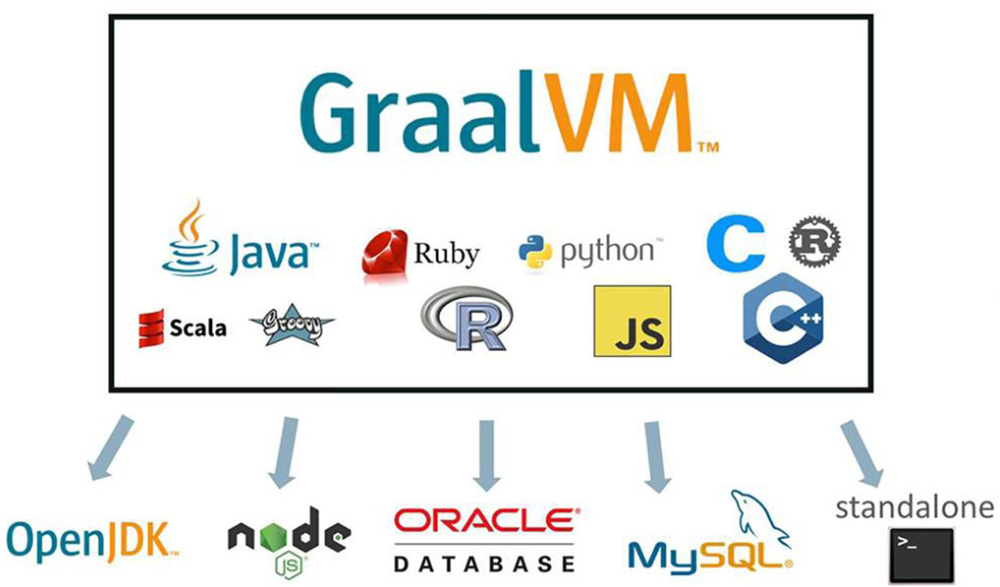

### 1.9.14 其他JVM

​	其他的JVM有Java Card VM、Squawk VM、JavaInJava、MaxineVM、Jikes RVM、IKVM.NET、Jam VM、Cacao VM、Sable VM、  Kaffe、Jelatine JVM、Nano VM、MRP、Moxie JVM等。

​	具体JVM的内存结构，其实取决于其实现，不同厂商的虚拟机，或者同一厂商发布的不同版本，都有可能存在一定差异。本书主要以OracleHotSpot虚拟机来展开学习。

# 第1篇 运行时数据区篇

| 运行时数据区子模块                     | Error | GC   |
| -------------------------------------- | ----- | ---- |
| 方法区（Method Area）                  | 有    | 有   |
| 堆（Heap）                             | 有    | 有   |
| 程序计数器（Program Counter Register） | 无    | 无   |
| 本地方法栈（Native Method Stack）      | 有    | 无   |
| 虚拟机栈（Java Virtual Machine Stack） | 有    | 无   |

# 第2章 运行时数据区及线程概述

​	内存是非常重要的系统资源，是硬盘和CPU的中间仓库及桥梁，承载着操作系统和应用程序的实时运行。JVM在程序执行期间把它所管理的内存分为若干个不同的数据区域。这些不同的数据区域可以分为两种类型：一种是在JVM启动时创建，仅在JVM退出时才被销毁，这种可以理解为线程共享的，另外一种数据区是针对每个线程的，是在创建线程时创建的，并在线程退出时销毁，这种可以理解为线程私有的。这里将从线程的角度出发讲述JVM内存区域的划分。

## 2.1 运行时数据区概述

​	运行时数据区可简单分为Native Method Stack（本地方法栈）、Program Counter Register（程序计数器）、Java VirtualMachine Stack（虚拟机栈）、Heap（堆区）和Method Area（方法区）。如下图所示：

<div style="text-align:center;font-weight:bold;">JVM内存结构（布局）</div>


​	其中虚拟机栈是以栈帧为基本单位构成的，栈帧包括局部变量表、操作数栈、动态链接、方法返回地址和一些附加信息。堆区分为Young区（新生代）、Old区（老年代），这里讲解的是基于“经典分代”的HotSpot虚拟机内存布局。方法区分为常量池、方法元信息、klass类元信息。如下图所示：

<div style="text-align:center;font-weight:bold;">JVM内存详细结构（布局）</div>

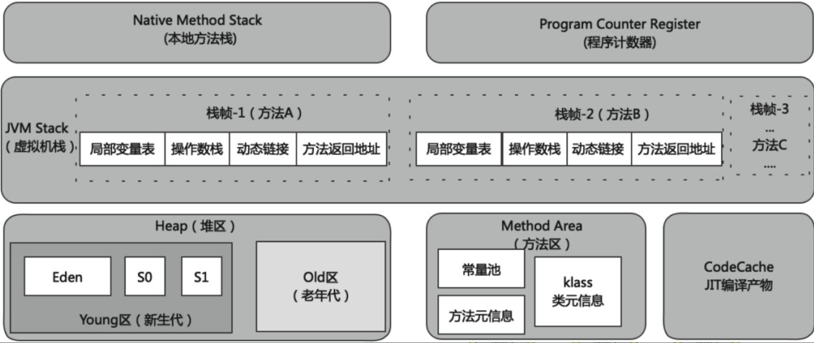

​	JVM定义了若干种程序运行期间会使用到的运行时数据区，其中有一些会随着虚拟机启动而创建，随着虚拟机退出而销毁。另外一些则是与线程一一对应的，这些与线程对应的数据区域会随着线程开始和结束而创建和销毁。如下图所示，浅色的区域为单个线程私有，深色的区域为多个线程共享。

1. 线程私有的区域包括程序计数器(Program Counter Register,PCRegister)、虚拟机栈(Virtual Machine Stack,VMS)和本地方法栈(Native Method Stack,NMS）。

2. 线程间共享的区域包括堆区(Heap)、方法区(Method Area)。

<div style="text-align:center;font-weight:bold;">线程共享和私有的结构图</div>

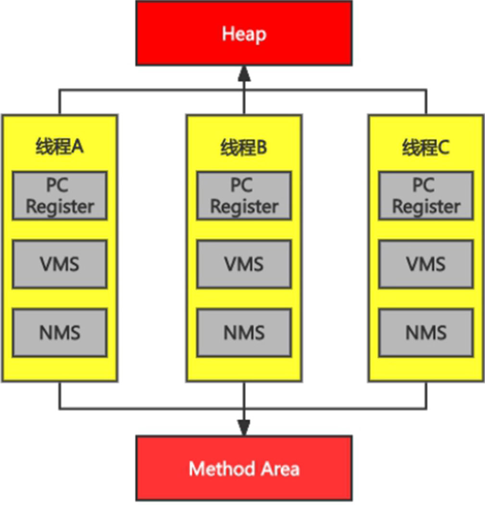

# 第3章 程序计数器

## 3.1 程序计数器介绍

​	JVM中的程序计数器英文全称是Program Counter Register，其中Register的命名源于CPU的寄存器，寄存器用于存储指令相关的现场信息，CPU只有把数据装载到寄存器才能够运行。

​	程序计数器中的寄存器并非是广义上所指的物理寄存器，或许将其翻译为指令计数器会更加贴切（也称为程序钩子），并且也可以避免一些不必要的误会，为了使用习惯，这里还是使用程序计数器来表示ProgramCounter Register。<span style="color:#9400D3;">JVM中的程序计数器是对物理寄存器的一种抽象模拟</span>。

​	程序计数器是一块较小的内存空间，属于运行时数据区的一部分。它可以看作是当前线程所执行的字节码的行号指示器。在JVM的概念模型里，字节码解释器工作时就是通过改变这个计数器的值来选取下一条需要执行的字节码指令，它是程序控制流的指示器。分支、循环、跳转、异常处理、线程恢复等基础功能，都需要依赖这个计数器来完成。如下图所示：

<div style="text-align:center;font-weight:bold;">程序计数器</div>

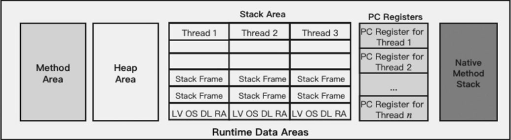

​	 如果线程正在执行的是一个Java方法，这个计数器记录的是正在执行的虚拟机字节码指令的地址；如果正在执行的是本地(Native)方法，这个计数器值则应为空(Undefined)。此内存区域是唯一一个在“Java虚拟机规范”中没有规定任何OutOfMemoryError情况的区域。<span style="color:red;font-weight:bold;">程序计数器既没有垃圾回收也没有内存溢出</span>。

​	程序计数器用来存储下一条指令的地址，也就是将要执行的指令代码。由执行引擎读取下一条指令。

<div style="text-align:center;font-weight:bold;">线程中的程序计数器</div>


​	程序计数器是一块很小的内存空间，几乎可以忽略不计。<span style="color:red;font-weight:bold;">它也是运行速度最快的存储区域</span>。在JVM规范中，每个线程都有它自己的程序计数器，是线程私有的，生命周期与线程的生命周期保持一致。

## 3.2 程序计数器常见问题

- 使用程序计数器存储字节码指令地址有什么用？为什么使用程序计数器记录当前线程的执行地址？

​	因为CPU需要不停地切换各个线程，切换回来以后，就需要知道接着从哪里开始继续执行。JVM的字节码解释器通过改变程序计数器的值，来明确下一条应该执行什么样的字节码指令。

- 程序计数器为什么会被设定为线程私有？

​	CPU时间片即CPU分配给各个程序的时间，每个线程被分配一个时间段，称作它的时间片。在宏观上，我们可以同时打开多个应用程序，每个程序同时运行。但在微观上，由于只有一个CPU，一次只能处理程序要求的一部分，为了处理公平，就要引入时间片，每个程序轮流执行。

​	所谓的多线程是在一个特定的时间段内只会执行其中某一个线程的方法，CPU会不停地做任务切换，这样必然导致经常中断或恢复，如何保证分毫无差呢？为了能够准确地记录各个线程正在执行的当前字节码指令地址，最好的办法自然是为每一个线程都分配一个程序计数器，这样一来各个线程之间便可以进行独立计算，从而不会出现相互干扰的情况。

# 第4章 虚拟机栈

​	<span style="color:red;font-weight:bold;">栈由栈帧组成，每个栈帧又包括局部变量表（Local Variable Table）、操作数栈（Operand Stack）、动态链接（Dynamic Linking）、方法返回地址（Return Address）和一些附加信息</span>。

## 4.1 虚拟机栈概述

​	Java语言具有跨平台性，由于不同平台的CPU架构不同，<span style="color:red;font-weight:bold;">所以Java的指令不能设计为基于寄存器的，而是设计为基于栈架构的。基于栈架构的优点是可以跨平台，指令集小，编译器容易实现。缺点是性能较低，实现同样的功能需要更多的指令</span>。

​	Java虚拟机栈(Java Virtual Machine Stack)早期也叫Java栈。每个线程在创建时都会创建一个虚拟机栈，其内部由许多栈帧(Stack Frame)构成，<span style="color:#9400D3;">每个栈帧对应着一个Java方法的调用</span>，如代码清单4-1所示。与数据结构上的栈有着类似的含义，它是一块先进后出的数据结构，只支持出栈和入栈两种操作。栈是线程私有的，虚拟机栈的生命周期和线程一致。

​	每个方法被执行的时候，JVM都会同步创建一个栈帧用于存储局部变量表、操作数栈、动态链接、方法出口等信息。每一个方法被调用直至执行完毕的过程，就对应着一个栈帧在虚拟机栈中从入栈到出栈的过程。

​	虚拟机栈的作用是主管Java程序的运行，栈解决程序的运行问题，即程序如何执行或者说如何处理数据。

​	虚拟机栈保存方法的局部变量（8种基本数据类型、对象的引用地址）和部分结果，并参与方法的调用和返回。虚拟机栈有如下几个特点。

1. <span style="color:red;font-weight:bold;">栈是一种快速有效的分配存储方式，访问速度仅次于程序计数器</span>。
2. <span style="color:red;font-weight:bold;">对于栈来说不存在垃圾回收问题，但存在内存溢出</span>。
3. 栈是先进后出的，每个方法执行，伴随着压栈操作；方法执行结束后，伴随着出栈操作。

<div style="text-align:center;font-weight:bold;">栈的压栈和出栈</div>

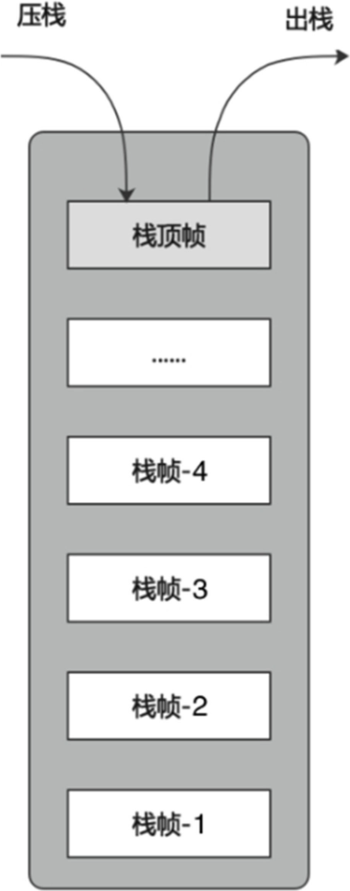

​	Java虚拟机规范允许虚拟机栈的大小是可动态扩展的或者是固定不变的（注意：<span style="color:#9400D3;">目前HotSpot虚拟机中不支持栈大小动态扩展</span>）。关于虚拟机栈的大小可能出现的异常有以下两种。

1. 如果采用固定大小的Java虚拟机栈，那每一个线程的Java虚拟机栈容量在线程创建的时候按照固定大小来设置。如果线程请求分配的栈容量超过Java虚拟机栈允许的最大容量，JVM将会抛出一个StackOverflowError异常。
2. 如果Java虚拟机栈可以动态扩展，并且在尝试扩展的时候无法申请到足够的内存，或者在创建新的线程时没有足够的内存去创建对应的虚拟机栈，那JVM将会抛出一个OutOfMemoryError（OOM，内存溢出）异常。

​	我们可以使用参数-Xss选项来设置线程的最大栈空间（默认值取决于系统平台），栈的大小直接决定了函数调用的最大可达深度。

## 4.2 栈的存储单位

​	每个线程都有自己的栈，栈中的数据都是以栈帧(Stack Frame)的形式存在。在这个线程上正在执行的每个方法都各自对应一个栈帧，也就是说栈帧是Java中方法的执行环境。栈帧是一个内存区块，是一个数据集，维系着方法执行过程中的各种数据信息。

​	在一条活动线程中，一个时间点上只会有一个活动的栈帧，即只有当前正在执行的方法的栈帧（栈顶栈帧）是有效的，这个栈帧被称为当前栈帧，与当前栈帧相对应的方法就是当前方法，定义这个方法的类就是当前类。

​	执行引擎运行的所有字节码指令只针对当前栈帧进行操作。如果在该方法中调用了其他方法，对应的新的栈帧会被创建出来，放在栈的顶端，成为新的当前帧。JVM直接对Java栈的操作只有两个，就是对栈帧的压栈和出栈，遵循“先进后出”“后进先出”原则。

<div style="text-align:center;font-weight:bold;">栈中的当前栈帧</div>

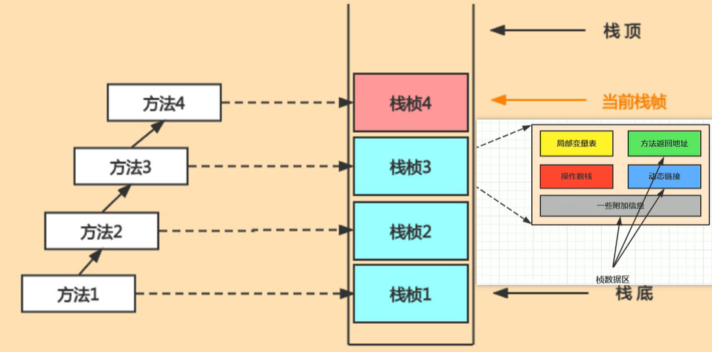

## 4.3 局部变量表

### 4.3.1 局部变量表简介

​	局部变量表也称为局部变量数组或本地变量表。局部变量表定义为一个数字数组，主要用于存储方法参数和定义在方法体内的局部变量，这些数据类型包括各类基本数据类型、对象引用(reference)以及returnAddress类型。对于基本数据类型的变量，则直接存储它的值，对于引用类型的变量，则存的是指向对象的引用。

​	由于局部变量表是建立在线程的栈上，是线程的私有数据，因此不存在数据安全问题。

​	<span style="color:#9400D3;">局部变量表所需的容量大小是在编译期确定下来的</span>，并保存在方法的Code属性的maximum local variables数据项中。在方法运行期间是不会改变局部变量表的大小的。

​	方法嵌套调用的次数由栈的大小决定。一般来说，栈越大，方法嵌套调用次数越多。对一个方法而言，它的参数和局部变量越多，使得局部变量表越膨胀，它的栈帧就越大，以满足方法调用所需传递的信息增大的需求。进而调用方法就会占用更多的栈空间，导致其嵌套调用次数就会减少。

​	局部变量表中的变量只在当前方法调用中有效。在方法执行时，虚拟机通过使用局部变量表完成参数值到参数变量列表的传递过程。当方法调用结束后，随着方法栈帧的销毁，局部变量表也会销毁。

<div style="text-align:center;font-weight:bold;">查看局部变量表</div>

```java
public static void main(String[] args) {
    LocalVariablesTest test = new LocalVariablesTest();
    int num = 10;
    long num1 = 12;
}
```

​	通过IntelliJ IDEA安装Jclasslib Bytecode Viewer插件可以查看局部变量表。安装好插件以后，单击“View”选项，选择“Show BytecodeWith Jclasslib”选项。

<div style="text-align:center;font-weight:bold;">使用工具查看局部变量表</div>

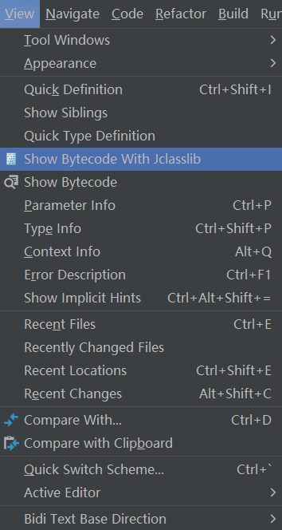

​	上面的操作结果，如下图所示：LocalVariableTable用来描述方法的局部变量表，在class文件的局部变量表中，显示了每个局部变量的作用域范围、所在槽位的索引（Index列）、变量名（Name列）和数据类型（J表示long型）。参数值的存放总是从局部变量表的索引(Index)为0开始，到变量总个数减1的索引结束，可以看到，main()方法中总共存在4个变量，分别是args、test、num和num1,Index的初始值为0，最终值为3。

<div style="text-align:center;font-weight:bold;">class文件的局部变量表</div>

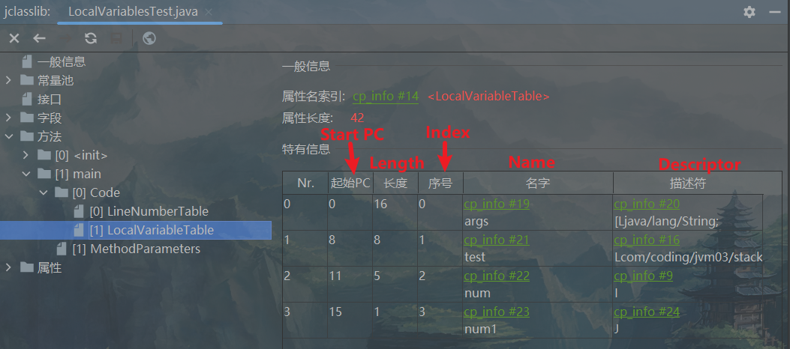

​	在“Code”选项下的“Misc”列中Maximum localvariables值为5，可是明明局部变量表中变量的数量只有4个，为什么局部变量表大小是5呢？这是因为局部变量表最基本的存储单元是slot,long类型的数据占两个slot。

<div style="text-align:center;font-weight:bold;">局部变量表大小</div>

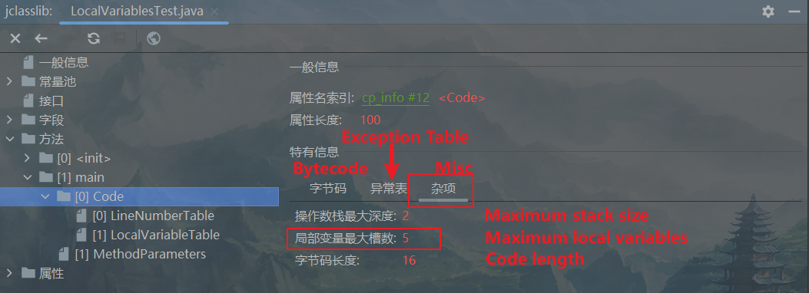

### 4.3.2 Slot

​	局部变量表最基本的存储单元是slot（变量槽）。局部变量表中存放编译期可知的各种基本数据类型（8种）、引用(reference)类型、returnAddress类型的变量。

​	<span style="color:red;font-weight:bold;">在局部变量表里，32位以内的类型（包括reference、returnAddress类型）只占用一个slot,64位的类型（long和double）占用两个slot</span>。

​	byte、short、char在存储前被转换为int,boolean也被转换为int,0表示false，非0表示true。long和double则占据两个slot。

​	JVM会为局部变量表中的每一个slot都分配一个访问索引，通过这个索引即可成功访问到局部变量表中指定的局部变量值。

​	如下图所示：long类型和double类型的占两个slot，当调用long类型或double类型的变量时用它的起始索引。即调用long类型的m时需要用索引“1”，调用double类型的q时需要用索引“4”。

<div style="text-align:center;font-weight:bold;">slot的访问索引</div>

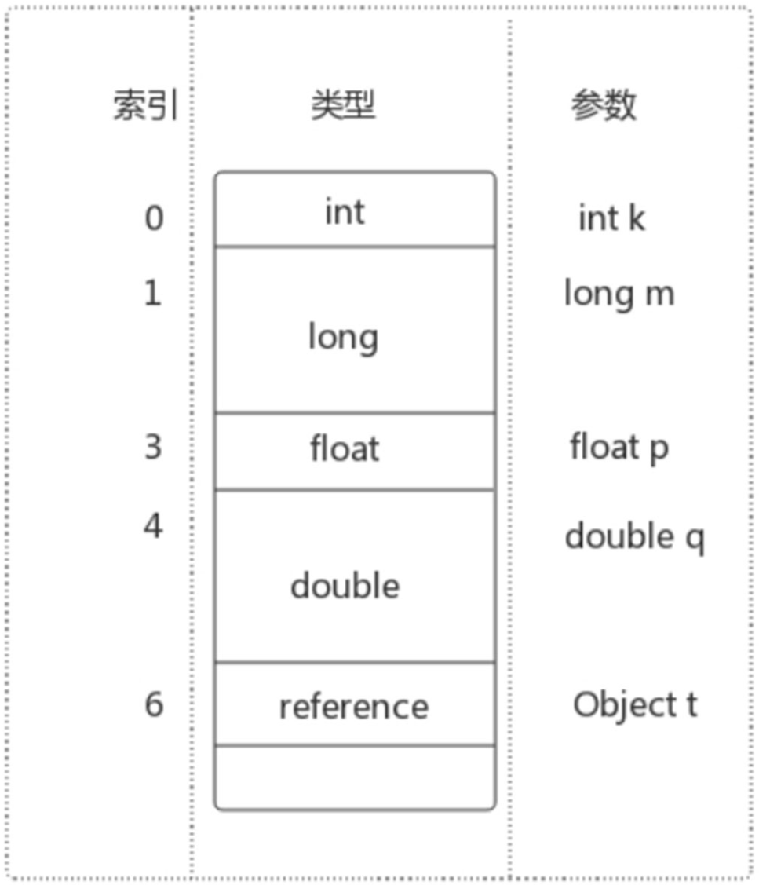

​	当一个实例方法被调用的时候，它的方法参数和方法体内部定义的局部变量将会按照顺序被复制到局部变量表中的每一个slot上。如果需要访问局部变量表中一个64位的局部变量值，只需要使用该变量占用的两个slot中的第一个slot的索引即可。比如，访问long类型或double类型变量，如果当前帧是由构造方法或者实例方法创建的，那么该对象引用this将会存放在index为0的slot处，其余的参数按照参数表顺序继续排列。

​	栈帧中的局部变量表中的slot是可以重用的，如果一个局部变量过了其作用域，那么在其作用域之后申明的新的局部变量就很有可能会复用过期局部变量的slot，从而达到节省资源的目的。

<span style="color:#40E0D0;">案例1：</span>

- 代码

```java
public void localVar1() {
    int a = 0;
    System.out.println(a);
    int b = 0;
}

public void localVar2() {
    {
        int a = 0;
	    System.out.println(a);
    }
	// 此时的b就会复用a的槽位
    int b = 0;
}
```

​	localVarl()方法局部变量表的长度为3，变量的个数为3个，局部变量分别是this、a、b，没有重复利用的slot。

<div style="text-align:center;font-weight:bold;">localVar1()方法对局部变量表中slot的利用</div>

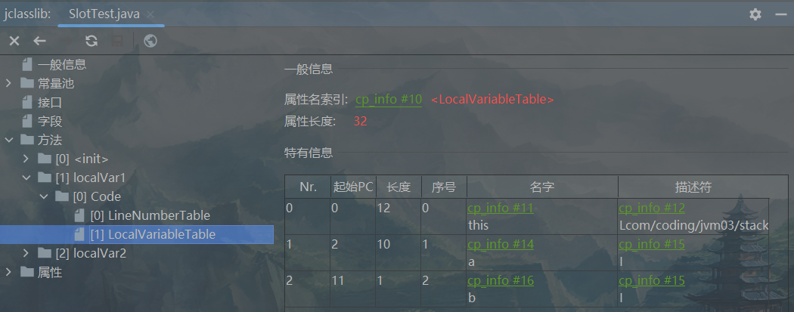

​	localVar2()方法局部变量表的长度为2，变量的个数为2个，局部变量分别是this、b。a的作用域在大括号内，当出了a的作用域后b复用了a的slot。

<div style="text-align:center;font-weight:bold;">localVar2()方法对局部变量表中slot的利用</div>

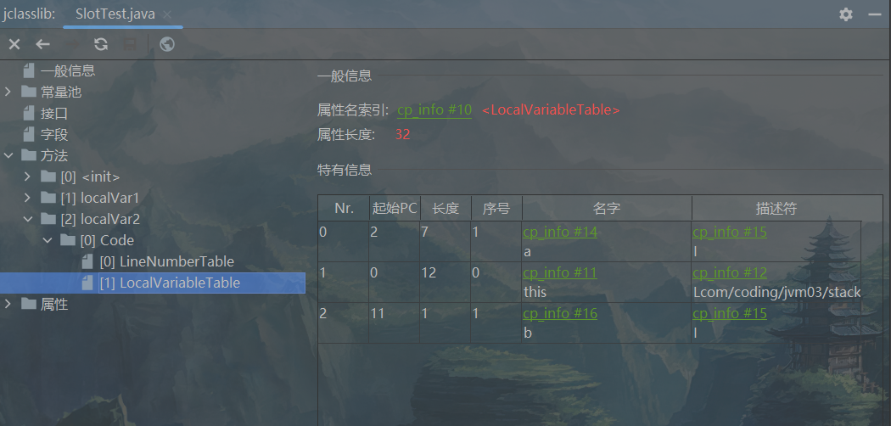

​	参数表分配完毕之后，再根据方法体内定义的变量的顺序和作用域分配。上面说了局部变量的存储位置，局部变量的值是怎么初始化的呢？<span style="color:#9400D3;">我们知道静态变量有两次初始化的机会：第一次是在“准备阶段”，执行系统初始化，对静态变量设置零值；另一次则是在“初始化”阶段，赋予程序员在代码中定义的初始值。和静态变量初始化不同的是，局部变量表不存在系统初始化的过程，这意味着一旦定义了局部变量则必须手动初始化，否则无法使用</span>。

​	值得注意的是，在栈帧中，与性能调优关系最为密切的部分就是前面提到的局部变量表。在方法执行时，虚拟机使用局部变量表完成方法的传递。

​	局部变量表中的变量也是重要的垃圾回收根节点，只要被局部变量表中直接或间接引用的对象都不会被回收。

## 4.4 操作数栈

​	每一个独立的栈帧中除了包含局部变量表以外，还包含一个后进先出的操作数栈，也可以称为表达式栈（Expression Stack）。

​	操作数栈也是栈帧中重要的内容之一，它主要用于保存计算过程的中间结果，同时作为计算过程中变量临时的存储空间。

​	操作数栈在方法执行过程中，根据字节码指令往栈中写入数据或提取数据，即入栈(push)/出栈(pop)。

​	某些字节码指令将值压入操作数栈，其余的字节码指令将操作数从栈中取出，比如，执行复制、交换、求和等操作。使用它们后再把结果压入栈。

​	操作数栈就是JVM执行引擎的一个工作区，当一个方法刚开始执行的时候，一个新的栈帧也会随之被创建出来，这个方法的操作数栈是空的。

​	每一个操作数栈都会拥有一个明确的栈深度用于存储数值，其所需的最大深度在编译期就定义好了，保存在方法的Code属性中的Maximumstack size数据项中。栈中的任何一个元素都可以是任意的Java数据类型。<span style="color:red;font-weight:bold;">32位的类型占用一个栈单位深度，64位的类型占用两个栈单位深度</span>。

​	操作数栈并非采用访问索引的方式来进行数据访问的，而是只能通过标准的入栈(push)和出栈(pop)操作来完成一次数据访问。如果被调用的方法带有返回值的话，其返回值将会被压入当前栈帧的操作数栈中，并更新程序计数器中下一条需要执行的字节码指令。

​	操作数栈中元素的数据类型必须与字节码指令的序列严格匹配，这由编译器在编译期间进行验证，同时在类加载过程中的类检验阶段的数据流分析阶段要再次验证。另外，<span style="color:#9400D3;">我们说JVM的解释引擎是基于栈的执行引擎，其中的栈指的就是操作数栈</span>。

## 4.5 栈顶缓存技术

​	由于操作数是存储在内存中的，因此频繁地执行内存读、写操作必然会影响执行速度。为了提升性能，HotSpot虚拟机的设计者提出了栈顶缓存(Top-of-Stack Cashing,ToS)技术。所谓栈顶缓存技术就是当一个栈的栈顶或栈顶附近元素被频繁访问，就会将栈顶或栈顶附近的元素缓存到物理CPU的寄存器中，将原本应该在内存中的读、写操作分别变成了寄存器中的读、写操作，从而降低对内存的读、写次数，提升执行引擎的执行效率。

​	要理解这一点，需要了解计算机的硬件知识，对于CPU而言，从读取速度上来说，CPU从寄存器中读取速度最快，其次是内存，最后是磁盘。要理解这一点，需要了解计算机的硬件知识，对于CPU而言，从读取速度上来说，CPU从寄存器中读取速度最快，其次是内存，最后是磁盘。CPU从寄存器中读取数据的速度往往比从内存中读取要快好几个数量级，这种速度差异非常大，达百倍以上。那么为什么不把数据全部放入寄存器呢？这是因为一个CPU能够集成的寄存器数量极其有限，相比于内存空间简直就是沧海一粟，所以性能和空间两者始终不能两全。栈顶缓存正是针对CPU这种在时间和空间上不能两全的遗憾而进行的改进措施。就好比我们在系统设计时，都会加入缓存这种中间件，首先系统从缓存中查询数据，如果缓存存在则返回，否则查询DB，两者设计思想有异曲同工之妙。

## 4.6 动态链接

​	每一个栈帧内部都包含一个指向运行时常量池中该栈帧所属方法的引用。包含这个引用的目的就是为了支持当前方法的代码能够实现动态链接(Dynamic Linking）。

​	在Java源文件被编译成字节码文件时，所有的变量和方法引用都作为符 号引用(Symbolic Reference)保存在class文件的常量池里。比如，描述一个方法调用了另外的其他方法时，就是通过常量池中指向方法的符号引用来表示的。动态链接的目的就是在JVM加载了字节码文件，将类数据加载到内存以后，当前栈帧能够清楚记录此方法的来源。将字节码文件中记录的符号引用转换为调用方法的直接引用，直接引用就是程序运行时方法在内存中的具体地址。

​	如下图所示：图中Thread区域代表着一个个的线程，Stack Frame区域代表着栈中的一个栈帧，Current Class Constant Pool Reference区域为动态链接，method references区域代表着方法的引用地址，即直接引用。动态链接指向运行时常量池中的方法的引用地址，运行时常量池指的是class文件中常量池表在程序运行时在内存中的形式。

<div style="text-align:center;font-weight:bold;">方法区与栈的关联结构</div>

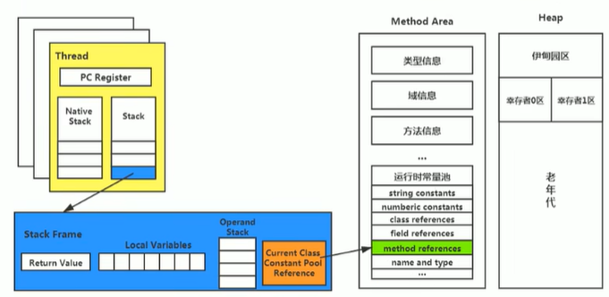


## 4.7 方法的调用

### 4.7.1 方法调用的分类

​	前面说了动态链接的作用就是将符号引用转换为调用方法的直接引用。在JVM中，将符号引用转换为调用方法的直接引用与方法的绑定机制相关，方法的绑定机制有两种，分别是静态链接和动态链接。

**1 静态链接**

​	当一个字节码文件被装载进JVM内部时，如果被调用的目标方法在编译期可知，且运行期保持不变时。这种情况下，将调用方法的符号引用转换为直接引用的过程称为静态链接。

**2 动态链接**

​	如果被调用的方法在编译期无法被确定下来，也就是说，只能够在程序运行期将调用方法的符号引用转换为直接引用，由于这种引用转换过程具备动态性，因此也就被称为动态链接。

​	静态链接和动态链接一般还会被称为早期绑定(Early Binding)和晚期绑定(Late Binding)。绑定的意思就是一个字段、方法或者类的符号引用被转换为直接引用的过程，这仅仅发生一次。

​	随着高级语言的横空出世，类似于Java的面向对象的编程语言越来越多，尽管这类编程语言在语法风格上存在一定的差别，但是它们彼此之间始终保持着一个共性，那就是都支持封装、继承和多态等面向对象特性。既然这一类的编程语言具备多态特性，那么自然也就具备静态链接和动态链接两种绑定方式。

### 4.7.2 虚方法与非虚方法

​	静态链接是指方法在编译期就确定了具体的调用版本，这个版本在运行时是不可变的，一般称这样的方法为非虚方法。除去非虚方法的都叫作虚方法。一般来说，静态方法、私有方法、final方法、实例构造器、父类方法都是非虚方法。

​	有时候如果不能很好地区分虚方法和非虚方法，可以通过字节码文件的方法调用指令来区分。虚拟机中提供了以下5条方法调用指令。

1. invokestatic：调用静态方法，解析阶段确定唯一方法版本。
2. invokespecial：调用`<init>`方法、私有及父类方法，解析阶段确定唯一方法版本。
3. invokevirtual：调用所有虚方法。

4. invokeinterface：调用接口方法。

5. invokedynamic：动态解析出需要调用的方法，然后执行。

​	方法调用指令可以分为普通调用指令和动态调用指令，前四条指令是普通调用指令，它们固化在虚拟机内部，方法的调用执行不可人为干预。第五条指令是动态调用指令，invokedynamic指令支持由用户确定方法版本。其中invokestatic指令和invokespecial指令调用的方法称为非虚方法，其余的（<span style="color:red;">final修饰的除外</span>）称为虚方法。

### 4.7.3 关于invokedynamic指令

​	JVM字节码指令集一直比较稳定，一直到Java 7中才增加了一个invokedynamic指令，这是Java为了支持“动态类型语言”而做的一种改进。

​	动态类型语言和静态类型语言的区别就在于对类型的检查是在编译期还是在运行期，满足前者就是静态类型语言，满足后者是动态类型语言。

​	但是在Java 7中并没有提供直接生成invokedynamic指令的方法，需要借助ASM这种底层字节码工具来产生invokedynamic指令。直到Java 8的Lambda表达式出现，invokedynamic指令在Java中才有了直接的生成方式。

​	Java 7中增加的动态语言类型支持的本质是对Java虚拟机规范的修改，而不是对Java语言规则的修改。增加新的虚拟机指令，最直接的受益者就是运行在Java平台的动态语言的编译器。

### 4.7.4 方法重写的本质

​	虚方法的多态性的前提是建立在方法的重写和类的继承的基础上，Java语言中方法重写的本质如下。

1. 找到操作数栈顶的第一个元素所指向的对象的实际类型，记作C。
2. 如果在类型C中找到与常量中的描述符和简单名称都相符的方法，则进行访问权限校验，如果通过则返回这个方法的直接引用，查找过程结束；如果不通过，则返回java.lang.IllegalAccessError异常。IllegalAccessError异常表示程序试图访问或修改一个属性或调用一个方法，但是没有对应的权限。一般来说，IllegalAccessError异常会引起编译器异常。这个错误如果发生在运行时，就说明一个类发生了不兼容的改变。例如，Maven的jar包冲突。
3. 如果在类型C中找不到与常量中的描述符和简单名称都相符的方法，按照继承关系从下往上依次对C的各个父类进行第2步的搜索和验证过程。
4. 如果始终没有找到合适的方法，则抛出java.lang.AbstractMethodError异常。

### 4.7.5 虚方法表

​	在面向对象的编程中，会频繁使用动态分派，即在运行期根据实际变量类型确定方法执行版本。方法执行版本的选择需要在类的方法元数据中搜索合适的目标方法，所以频繁地搜索会影响JVM的性能。因此JVM通过在类的方法区建立一个虚方法表(Virtual Method Table)来提高性能，使用虚方法表索引表来代替查找。

​	每个类中都有一个虚方法表，表中存放着各个方法的实际入口。那么虚方法表什么时候被创建？<span style="color:#9400D3;">虚方法表会在类加载的链接阶段被创建并开始初始化，类的变量初始值准备完成之后，JVM会把该类的虚方法表也初始化完毕</span>。

​	如下图所示：Son类继承于Father类，Father类包含talk()和eat()两个方法，Son类重写了Father类的talk()方法和eat()方法。当在Son类调用toString()等方法时直接找到Object类，不用再经过Father类，虚方法表的作用就是可以直接调用Object类中的方法，从而提高效率。

<div style="text-align:center;font-weight:bold;">虚方法表的方法调用</div>

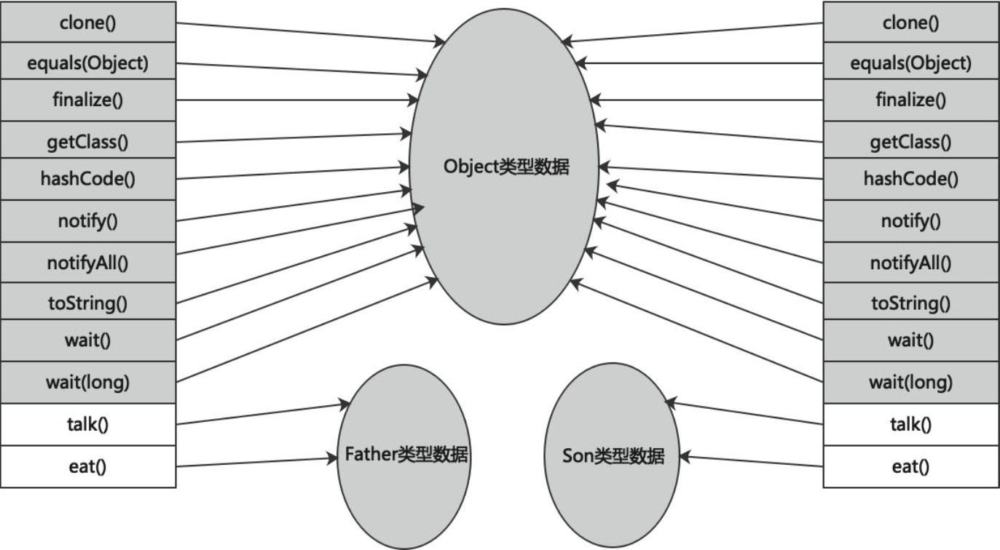


## 4.8 方法返回地址

​	方法返回地址存储的是调用该方法的程序计数器的值。一个方法的结束有两种可能，分别是正常执行完成结束和出现异常导致非正常结束。

​	无论通过哪种方式退出，在方法退出后都返回到该方法被调用的位置。方法正常退出时，调用者的程序计数器的值作为返回地址，即调用该方法的指令的下一条指令的地址。而通过异常退出的，返回地址是要通过异常表来确定，栈帧中一般不会保存这部分信息。

**1 方法正常完成退出**

​	执行引擎遇到任意一个方法返回的字节码指令(return)，会有返回值传递给上层的方法调用者，简称正常完成出口。一个方法在正常调用完成之后，究竟需要使用哪一个返回指令，还需要根据方法返回值的实际数据类型而定。

​	在字节码指令中，返回指令包含ireturn（当返回值是boolean、byte、char、short和int类型时使用）、lreturn（当返回值是long类型时使用）、freturn（当返回值是float类型时使用）、dreturn（当返回值是double类型时使用）以及areturn（当返回值是引用类型时使用），另外还有一个return指令供声明为void的方法、实例初始化方法、类和接口的初始化方法使用。

```java
public class ReturnAddressTest {

    public byte methodByte() {
        return 0; // ireturn
    }

    public short methodShort() {
        return 0; // ireturn
    }

    public int methodInt() {
        return 0; // ireturn
    }

    public long methodLong() {
        return 0L;
    }

    public float methodFloat() {
        return 0.0f; // freturn
    }

    public double methodDouble() {
        return 0.00; // dreturn
    }

    public boolean methodBoolean() {
        return false; // ireturn
    }

    public char methodChar() {
        return 'a'; // ireturn
    }

    public String methodString() {
        return null; // areturn
    }

    public Date methodDate() {
        return null; // areturn
    }

    public void methodVoid() { // return
    }

    static {
        int i = 10;
    }

    public void method2() {
        methodVoid();

        try {
            method1();
        } catch (IOException e) {
            throw new RuntimeException(e);
        }
    }

    public void method1() throws IOException {
        FileReader fis = new FileReader("emon.txt");
        char[] cBuffer = new char[1024];
        int len;
        while ((len = fis.read(cBuffer)) != -1) {
            String str = new String(cBuffer, 0, len);
            System.out.println(str);;
        }
        fis.close();
    }
}
```

**2 方法执行异常退出**

​	在方法执行的过程中遇到了异常(Exception)，并且这个异常没有在方法内进行处理（没有使用try-catch语句或者try-finally语句处理异常），也就是只要在本方法的异常表中没有搜索到匹配的异常处理器，就会导致方法退出，简称异常完成出口。

​	如果方法执行过程中抛出异常时，使用try-catch语句或者try-finally语句处理异常，异常处理会存储在一个异常表中，如图4-42所示，方便在发生异常的时候快速找到处理异常的代码。

<div style="text-align:center;font-weight:bold;">异常表</div>

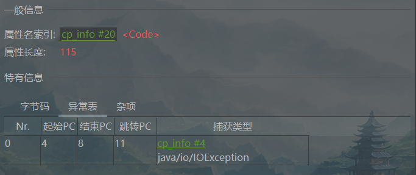

​	本质上，方法的退出就是当前栈帧出栈的过程。此时，需要恢复上层方法的局部变量表、操作数栈、将返回值压入调用者栈帧的操作数栈、设置程序计数器值等，让调用者的方法继续执行下去。

​	正常完成出口和异常完成出口的区别在于，通过异常完成出口退出的方法不会给上层调用者产生任何的返回值。

# 第5章 本地方法接口

​	虽然Java语言使用非常广泛，但是有些事务Java仍然无法处理。例如线程相关的功能，在线程类当中就有很多本地方法接口。那么Java如何来处理这些问题呢？Java设计师提出了一种解决方案就是本地方法接口。

## 5.1、本地方法接口概述

​	本地方法接口(Java Native Interface,JNI)在JVM中的位置，如图5-1所示。图中的虚线框区域就是本地方法接口，负责和本地方法库、JVM之间的交互。

<div style="text-align:center;font-weight:bold;">本地方法接口</div>

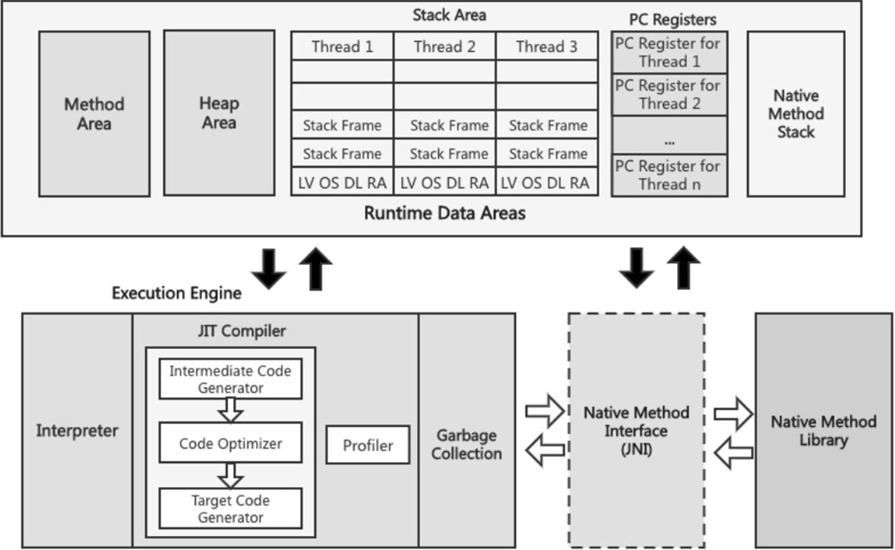

​	官方这样描述本地方法：“A method that is native andimplemented in platform-dependent code,typically written inanother programming language such as C.”意思是本地方法的实现一般是由其他语言编写的，比如可以使用C语言实现。我们可以理解为JNI就是使用Java语言调用非Java代码实现的接口。

​	  JNI可以帮助Java代码与使用其他编程语言（例如C、C++和汇编）编写的应用程序和库进行交互。这个特征并非Java所特有，许多编程语言都有这一机制，比如在C++中，可以用extern ''C''告知C++编译器去调用一个C语言的函数。在定义一个Native Method时，并不提供实现体（类似只定义了Java Interface），因为其实现体是由非Java语言在外面实现的。

​	JNI最重要的好处是它对底层JVM的实现没有任何限制。因此，JVM供应商可以添加对JNI的支持，而不会影响JVM的其他部分。

​	本地方法接口的作用是融合不同的编程语言为Java所用，它的初衷是融合C/C++程序。例如Object类的getClass()方法，它是有方法体的，不过方法体的具体实现并不是Java语言实现的，主要是C/C++语言实现的。

​	上面介绍了什么是Native Method，但是为什么要使用Native Method呢？下面将会从三个方面介绍Java中为什么使用Native Method。

1. 减少重复劳动。

​	有时Java应用需要与Java外面的环境交互，这是本地方法存在的主要原因。如果本地已经有一个用另一种语言编写的库，这时候希望通过某种方式使其可供Java代码访问，而不是重新使用Java语言编写一套功能一样的库，那么这种方式就是JNI。

2. 标准Java类库不支持应用程序所需的平台相关特性。

​	JVM支持Java语言本身和运行时库，它是Java程序赖以生存的平台，它由一个解释器（解释字节码）和一些连接到本地代码的库组成。然而不管怎样，它毕竟不是一个完整的系统，它经常依赖一些底层系统的支持，这些底层系统常常是强大的操作系统。通过本地方法，我们可以使用Java自身的JRE与底层系统进行交互，甚至JVM的部分实现就是用C语言编写的。还有，如果我们要使用一些Java语言本身没有提供封装的操作系统的特性时，也需要使用本地方法。

3. 性能要求。

​	假如想用较低级别的语言（例如汇编）实现一小部分性能要求严格的代码，这时候就可以使用到JNI了。

​	目前本地方法的使用越来越少，在企业级应用中已经比较罕见，除非是与硬件有关的应用，比如通过Java程序驱动打印机或者Java系统管理生产设备。因为现在的异构领域间的通信很发达，比如可以使用Socket通信，也可以使用Web Service，等等。

# 第6章 本地方法栈

## 6.1 本地方法栈概述 

​	Java虚拟机实现可能会使用到传统的栈（通常称为C Stack）来支持本地方法（使用Java语言以外的其他语言编写的方法）的执行，这个栈就是本地方法栈(Native Method Stack)。

​	本地方法栈和Java虚拟机栈发挥的作用是类似的，它们直接的区别是Java虚拟机栈用于管理Java方法的调用，而本地方法栈用于管理本地方法的调用。

​	本地方法栈是线程私有的。本地方法栈的大小允许被实现成固定大小的或者是可动态扩展的。在内存溢出方面，它与Java虚拟机栈也是相同的。

​	如果线程请求分配的栈容量超过本地方法栈允许的最大容量，Java虚拟机将会抛出一个StackOverflowError异常。如果本地方法栈可以动态扩展，并且在尝试扩展的时候无法申请到足够的内存，或者在创建新的线程时没有足够的内存去创建对应的本地方法栈，那么Java虚拟机将会抛出一个OutOfMemoryError异常。它的具体做法是在Native Method Stack中登记本地方法，在Execution Engine执行时加载本地方法库。

<div style="text-align:center;font-weight:bold;">本地方法栈</div>

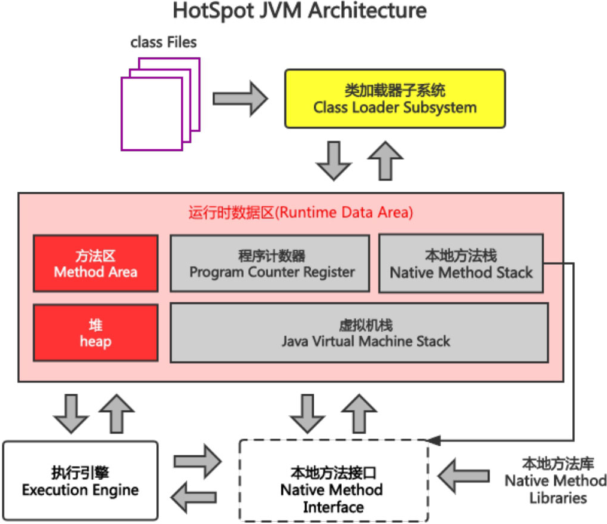

​	当某个线程调用一个本地方法时，它就进入了一个全新的并且不再受虚拟机限制的世界。它和虚拟机拥有同样的权限，如下3项表示本地方法可能涉及的权限调用。

​	本地方法可以通过本地方法接口来访问运行时数据区中的其他区域。

​	本地方法甚至可以直接使用本地处理器中的寄存器。

​	本地方法可以直接从本地内存的堆中分配任意数量的内存。

​	并不是所有的JVM都支持本地方法，因为Java虚拟机规范并没有明确要求本地方法栈的使用语言、具体实现方式、数据结构等。如果JVM产品不打算支持本地方法，也可以无须实现本地方法栈，如果支持本地方法栈，那这个栈一般会在线程创建的时候按线程分配。

​	在Java中，本地方法栈和虚拟机栈是如何关联的呢？如图6-2所示，当调用线程的start()方法的时候，在当前线程中开辟一个start()方法的栈帧并压入栈，在start()方法中又调用了start0()方法（图中画框处）。start0()方法是一个本地方法，所以start0()方法需要通过本地方法栈调用，可以使用动态链接的方式直接指向本地方法，由执行引擎来执行该本地方法。类似的案例还有Java应用中连接MySQL数据库或者Redis数据库等。

<div style="text-align:center;font-weight:bold;">本地方法栈和虚拟机栈结合案例</div>


# 第7章 堆

​	栈是运行时的单位，栈解决程序的运行问题，即程序如何执行，或者说如何处理数据。栈中处理的数据主要来源于堆(Heap)，堆是存储的单位，堆解决的是数据存储的问题，即数据怎么放、放在哪儿。

- Java8及更高版本

```bash
Heap
 PSYoungGen      total 2560K, used 1764K [0x00000000ffd00000, 0x0000000100000000, 0x0000000100000000)
  eden space 2048K, 86% used [0x00000000ffd00000,0x00000000ffeb9138,0x00000000fff00000)
  from space 512K, 0% used [0x00000000fff80000,0x00000000fff80000,0x0000000100000000)
  to   space 512K, 0% used [0x00000000fff00000,0x00000000fff00000,0x00000000fff80000)
 ParOldGen       total 7168K, used 0K [0x00000000ff600000, 0x00000000ffd00000, 0x00000000ffd00000)
  object space 7168K, 0% used [0x00000000ff600000,0x00000000ff600000,0x00000000ffd00000)
 Metaspace       used 3212K, capacity 4496K, committed 4864K, reserved 1056768K
  class space    used 352K, capacity 388K, committed 512K, reserved 1048576K
```

- Java7及之前版本

```bash
Heap
 PSYoungGen      total 3072K, used 1325K [0x00000000ffc80000, 0x0000000100000000, 0x0000000100000000)
  eden space 2560K, 51% used [0x00000000ffc80000,0x00000000ffdcb7a8,0x00000000fff00000)
  from space 512K, 0% used [0x00000000fff80000,0x00000000fff80000,0x0000000100000000)
  to   space 512K, 0% used [0x00000000fff00000,0x00000000fff00000,0x00000000fff80000)
 ParOldGen       total 7168K, used 0K [0x00000000ff580000, 0x00000000ffc80000, 0x00000000ffc80000)
  object space 7168K, 0% used [0x00000000ff580000,0x00000000ff580000,0x00000000ffc80000)
 PSPermGen       total 21504K, used 2921K [0x00000000fa380000, 0x00000000fb880000, 0x00000000ff580000)
  object space 21504K, 13% used [0x00000000fa380000,0x00000000fa65a708,0x00000000fb880000)
```

​	现代垃圾收集器大部分都基于分代收集理论设计，堆空间细分为：

- Java7及之前堆内存逻辑上分为三部分：新生区+养老区+永久区。

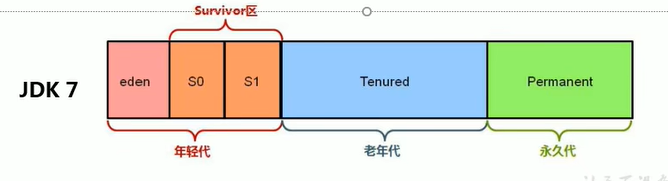

| 位置划分                                              |        |            | 示例                                 |
| ----------------------------------------------------- | ------ | ---------- | ------------------------------------ |
| Young Generation Space √ 又被划分为Eden区和Survivor区 | 新生区 | Young/New  |                                      |
| Tenure Generation Space                               | 养老区 | Old/Tenure |                                      |
| Permanent Space                                       | 永久区 | Perm       | ‑XX:PermSize=64m ‑XX:MaxPermSize=64m |

- Java8及之后堆内存逻辑上分为三部分：新生区+养老区+元空间


| 位置划分                                              |        |            | 示例                                                         |
| ----------------------------------------------------- | ------ | ---------- | ------------------------------------------------------------ |
| Young Generation Space √ 又被划分为Eden区和Survivor区 | 新生区 | Young/New  | -XX:NewRatio=2，老年代/新生代的比例2:1 -XX:SurvivorRatio=8，Eden与Survivor比例，默认Eden占8/10 |
| Tenure Generation Space                               | 养老区 | Old/Tenure |                                                              |
| Meta Space                                            | 元空间 | Meta       | -XX:MetaspaceSize=64m -XX:MaxMetaspaceSize=64m               |

## 7.1 堆的核心概述

### 7.1.1 JVM实例与堆内存的对应关系

​	在JVM中，堆是各个线程共享的运行时内存区域，也是供所有类实例和数组对象分配内存的区域。<span style="color:#9400D3;">一个JVM实例只存在一个堆内存</span>。

​	堆也是Java内存管理的核心区域。堆在JVM启动的时候被创建，其空间大小也随之被确定。堆是JVM管理的最大一块内存空间，其大小是可以根据参数调节的，它可以处于物理上不连续的内存空间中，但在逻辑上应该被视为连续的。

<div style="text-align:center;font-weight:bold;">运行时数据区</div>

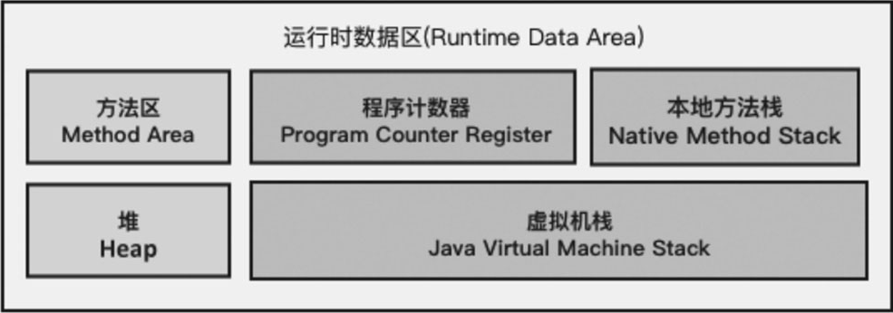

### 7.1.2 堆与栈的关系

​	堆中存放的是对象，栈帧中保存的是对象引用，这个引用指向对象在堆中的位置。

```java
public class SimpleHeap {
    private int id;

    public SimpleHeap(int id) {
        this.id = id;
    }

    public void show() {
        System.out.println("My ID is " + id);
    }

    public static void main(String[] args) {
        SimpleHeap s1 = new SimpleHeap(1);
        SimpleHeap s2 = new SimpleHeap(2);
        int[] arr = new int[10];
        Object[] arr1 = new Object[10];
    }
}
```

​	Java栈中的s1和s2分别是堆中s1实例和s2实例的引用。

<div style="text-align:center;font-weight:bold;">栈、堆关系</div>

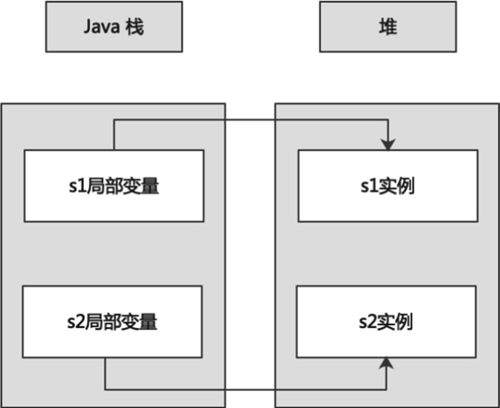

### 7.1.3 JVM堆空间划分

​	在方法结束后，堆中的对象不会马上被移除，仅仅在垃圾收集的时候才会被移除。堆也是GC（Garbage Collector，垃圾收集器）执行垃圾回收的重点区域。现代垃圾收集器大部分都基于分代收集理论设计，这是因为堆内存也是分代划分区域的，堆内存分为新生代（又叫年轻代）和老年代。

1. 新生代，英文全称Young Generation Space，简称为Young或New。该区域又分为Eden区和Survivor区。Survivor区又分为Survivor0区和Survivor1区。Survivor0和Survivor1也可以叫作from区和to区，简写为S0区和S1区。
2. 老年代，也称为养老区，英文全称Tenured Generation Space，简称为Old或Tenured。

<div style="text-align:center;font-weight:bold;">堆内存的新生代和老年代</div>

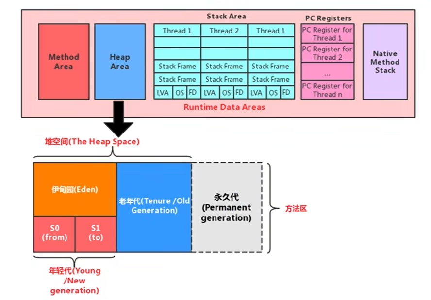

## 7.2 设置堆内存大小与内存溢出

### 7.2.1 设置堆内存大小

​	Java堆区用于存储Java对象实例，堆的大小在JVM启动时就已经设定好了，可以通过JVM参数“-Xms”和“-Xmx”来进行设置。

​	一旦堆区中的内存大小超过“-Xmx”所指定的最大内存，将会抛出内存溢出异常(OutOfMemoryError,OOM）。

​	通常会将“-Xms”和“-Xmx”两个参数配置相同的值。否则，服务器在运行过程中，堆空间会不断地扩容与回缩，势必形成不必要的系统压力。所以在线上生产环境中，JVM的Xms和Xmx设置成同样大小，避免 在GC后调整堆大小时带来的额外压力。

​	初始内存大小占据物理内存大小的1/64。

​	最大内存大小占据物理内存大小的1/4。

- 查看堆区的默认配置大小

```java
public class HeapSpaceInitial {
    public static void main(String[] args) {
        // 返回Java虚拟机中的堆内存总量
        long initialMemory = Runtime.getRuntime().totalMemory() / 1024 / 1204;
        // 返回Java虚拟机试图使用的最大堆内存量
        long maxMemory = Runtime.getRuntime().maxMemory() / 1024 / 1024;

        System.out.println("-Xms:" + initialMemory + "M");
        System.out.println("-Xms:" + maxMemory + "M");

        System.out.println("系统内存大小为：" + initialMemory * 64.0 / 1024 + "G");
        System.out.println("系统内存大小为：" + maxMemory * 4.0 / 1024 + "G");

        /*try {
            Thread.sleep(1000000);
        } catch (InterruptedException e) {
            e.printStackTrace();
        }*/
    }
}
```

### 7.2.2 内存溢出案例

​	在堆内存区域最容易出现的问题就是OOM，下面我们通过代码演示：

- 堆内存溢出案例

```java
/**
 * VM options:  -Xms600m -Xmx600m
 *
 * 启动 jvisualvm 工具
 */
public class OOMTest {
    public static void main(String[] args) {
        ArrayList<Picture> list = new ArrayList<Picture>();
        while (true) {
            try {
                Thread.sleep(20);
            } catch (InterruptedException e) {
                e.printStackTrace();
            }
            list.add(new Picture(new Random().nextInt(1024 * 1024)));
        }
    }
}

class Picture {
    private byte[] pixels;

    public Picture(int length) {
        this.pixels = new byte[length];
    }
}
```

## 7.3 新生代与老年代

​	存储在JVM中的Java对象可以被划分为两类，分别是生命周期较短的对象和生命周期较长的对象。

​	生命周期较短的对象，创建和消亡都非常迅速。

​	生命周期较长的对象，在某些极端的情况下甚至与JVM的生命周期保持一致。

​	Java堆区分为新生代和老年代，生命周期较短的对象一般放在新生代，生命周期较长的对象会进入老年代。在堆内存中新生代和老年代的所占用的比例分别是多少呢？新生代与老年代在堆结构的占比可以通过参数“-XX:NewRatio”配置。默认设置是“-XX:NewRatio=2”，表示<span style="color:red;font-weight:bold;">新生代占比为1，老年代占比为2，即新生代占整个堆的1/3</span>。

<div style="text-align:center;font-weight:bold;">新生代与老年代占比图</div>

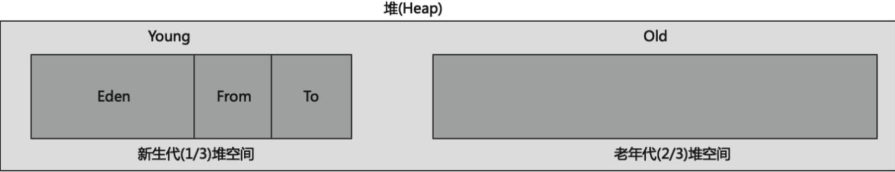

​	在HotSpot虚拟机中，新生代又分为一个Eden区和两个Survivor区，这三块区域在新生代中的占比也是可以通过参数设置的。<span style="color:red;font-weight:bold;">Eden区和两个Survivor区默认所占的比例是8:1:1</span>。但是大家查看时候发现Eden区和两个Survivor区默认所占的比例为6:1:1，这是因为JDK8的自适应大小策略导致的，JDK8默认使用UseParallelGC垃圾回收器，该垃圾回收器默认启动参数AdaptiveSizePolicy，该参数会根据垃圾收集的情况自动计算Eden区和两个Survivor区的大小。使用UseParallelGC垃圾回收器的情况下，如果想看到Eden区和两个Survivor区的比例为8:1:1的话，只能通过参数“-XX:SurvivorRatio”手动设置为8:1:1，或者直接使用CMS垃圾收集器。

​	参数“-XX:SurvivorRatio”可以设置Eden区和两个Survivor区比例。比如“-XX:SurvivorRatio=3”表示Eden区和两个Survivor区所占的比例是3:1:1。

​	IBM公司的专门研究表明，新生代中80%的对象都是“朝生夕死”的，表明大部分对象的产生和销毁都在新生代完成。所以某些情况下可以使用参数“-Xmn”设置新生代的最大内存来提高程序执行效率，一般来说这个参数使用默认值就可以了。

## 7.4 图解对象分配过程

​	为新对象分配内存是一件非常严谨和复杂的任务，JVM的设计者不仅需要考虑内存如何分配、在哪里分配等问题，并且由于内存分配算法与内存回收算法密切相关，所以还需要考虑GC执行完内存回收后，是否会在内存空间中产生内存碎片。内存具体分配过程有如下步骤。

1. new的对象先放Eden区，此区有大小限制。
2. 当Eden区的空间填满时，程序又需要创建对象，JVM的垃圾回收器将对Eden区进行垃圾回收（此时是YGC或者叫Minor GC），将Eden区中不再被其他对象所引用的对象进行销毁。再加载新的对象放到Eden区。
3. 然后将Eden区中的剩余对象移动到S0区，被移动到S0区的对象上有一个年龄计数器，值设置为1，如下图所示。浅色区域的对象被移动到S0区，深色区域的对象被销毁。

<div style="text-align:center;font-weight:bold;">Eden区将剩余对象移动到S0区</div>

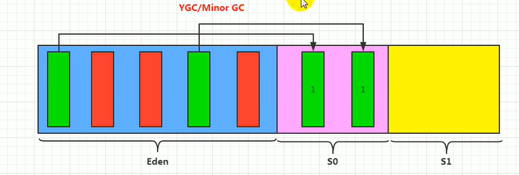

4. 如果再次触发垃圾回收，此时垃圾收集器将对Eden区和S0区进行垃圾回收，没有被回收的对象就会移动到S1区，S0区移动过来的对象的年龄计数器变为2,Eden区转移过来的对象的年龄计数器为1。注意，此刻S0区中没有对象。如下图所示：

<div style="text-align:center;font-weight:bold;">Eden区、S0区将剩余对象移动到S1区</div>

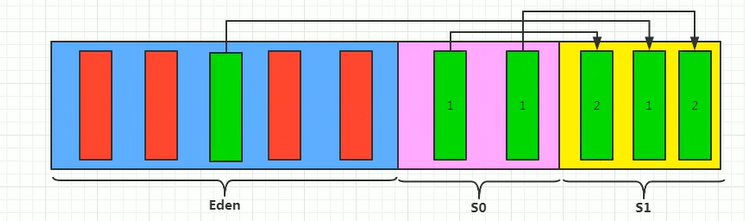


5. 如果再次经历垃圾回收，此时没有被回收的对象会重新放回S0区，接着再去S1区，对象在S0区和S1区之间每移动一次，年龄计数器都会加1。

6. 什么时候能去老年代呢？可以通过参数：-XX:MaxTenuringThreshold=`<N>`对年龄计数器进行设置，默认是15，超过15的对象进入老年代，如图下图所示。

<div style="text-align:center;font-weight:bold;">S1区将年龄计数器为15的对象移动到Old区</div>


7. 在老年代，内存相对充足。当老年代内存不足时，再次触发GC，此时可能发生Major GC或者Full GC，进行老年代的内存清理。
8. 若老年代执行了Major GC之后发现依然无法进行对象的保存，就会产生OOM异常。

​	S0区、S1区之所以也被称为From区和To区，是因为对象总是从某个Survivor(From)区转移至另一个Survivor(To)区。正常来说，垃圾回收频率应该是频繁在新生代收集，很少在老年代收集，几乎不在永久代／元空间（方法区的具体体现）收集。对象在堆空间分配的流程，如图7-22所示，注意图中我们用YGC表示Young GC,FGC表示Full GC。

<div style="text-align:center;font-weight:bold;">对象分配流程图</div>

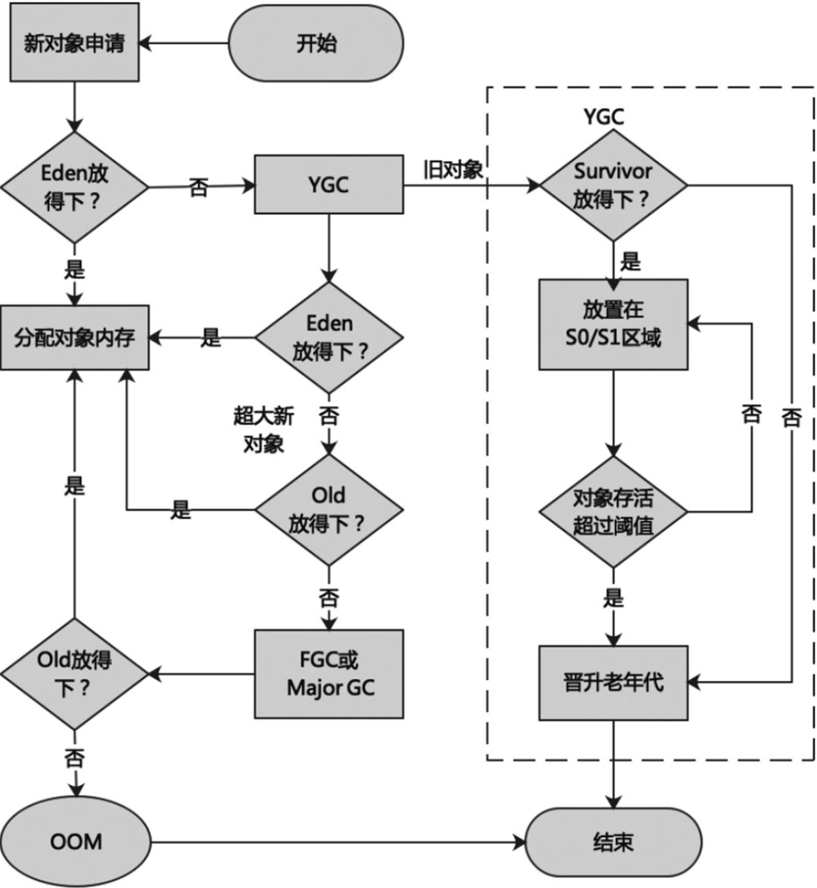

<span style="color:#40E0D0;">案例1：</span>

- 通过代码演示Eden区和两个Survivor区的变化规律

```java
/**
 * VM options:  -Xms600m -Xmx600m
 * 打开工具 jvisualvm
 */
public class HeapInstanceTest {
    byte[] buffer = new byte[new Random().nextInt(1024 * 1024)];

    public static void main(String[] args) {
        ArrayList<HeapInstanceTest> list = new ArrayList<HeapInstanceTest>();
        while (true) {
            list.add(new HeapInstanceTest());
            try {
                Thread.sleep(100);
            } catch (InterruptedException e) {
                e.printStackTrace();
            }
        }
    }
}
```

- 通过jvisualvm查看

​	当程序运行起来后可以用jvisualvm工具进行查看，可以看出新生代的Eden区达到上限的时候进行了一次Minor GC，将没有被回收的数据存放在S1区，当再次进行垃圾回收的时候，将Eden区和S1区没有被回收的数据存放在S0区。老年代则是在每次垃圾回收的时候，将S0区或S1区储存不完的数据存放在老年代，当每次垃圾进行回收后老年代的数据就会增加，增加到老年代的数据存不下的时候将会进行Major GC，进行垃圾回收之后发现老年代还是存不下的时候就会抛出OOM异常。

<div style="text-align:center;font-weight:bold;">程序运行时区域内存情况图</div>

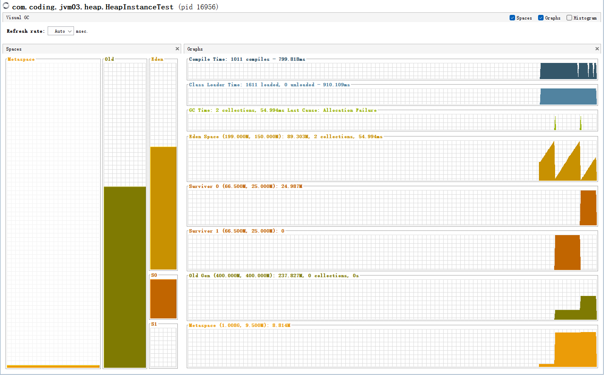

<div style="text-align:center;font-weight:bold;">程序运行结果图</div>

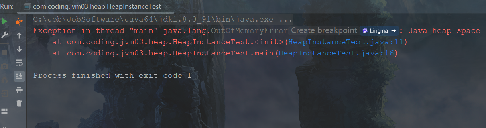

## 7.5 Minor GC、Major GC、Full GC

### 7.5.1 GC的分类

​	JVM在进行GC时，并非每次都对上面三个内存区域（新生代、老年代和方法区）一起回收，大部分时候回收的都是新生代。

​	在HotSpot VM中，GC按照回收区域分为两种类型，分别是部分GC(Partial GC)和整堆GC(Full GC)。部分GC是指不完整收集整个Java堆，又细分为新生代GC、老年代GC和混合GC。

1. 新生代GC(Minor GC / Young GC)：只是新生代（Eden、S0和S1区）的垃圾收集。
2. 老年代GC(Major GC / Old GC)：只是老年代的垃圾收集。目前，<span style="color:#9400D3;">只有CMS GC会有单独收集老年代的行为</span>。很多时候Major GC会和Full GC混淆使用，需要具体分辨是老年代回收还是整堆回收。
3. 混合GC(Mixed GC)：收集整个新生代以及部分老年代的垃圾收集。目前，只有G1 GC会有这种行为。

​	整堆GC(Full GC)则指的是整个Java堆和方法区的垃圾收集。

### 7.5.2 分代式GC策略的触发条件

​	知道GC的分类后，什么时候触发GC呢？

​	**新生代GC(Minor GC)触发机制如下**。

1. 当新生代空间不足时，就会触发Minor GC，这里的新生代空间不足指的是Eden区的空间不足，Survivor区空间不足不会引发GC（每次Minor GC会清理新生代的内存）。
2. 因为Java对象大多都具备“朝生夕灭”的特性，所以Minor GC非常频繁，一般回收速度也比较快。这一定义既清晰又易于理解。
3. Minor GC会引发STW(Stop-The-World)，暂停其他用户的线程，等垃圾回收结束，用户线程才恢复运行。

​	**老年代GC(Major GC/Old GC)触发机制如下**。

1. 对象从老年代消失时，就会触发Major GC或Full GC。
2. 出现了Major GC，经常会伴随至少一次的Minor GC（但非绝对，在ParallelScavenge收集器的收集策略里就有直接进行Major GC的策略选择过程）。也就是在老年代空间不足时，会先尝试触发Minor GC。如果之后空间还不足，则触发Major GC。
3. Minor GC的速度一般会比Major GC快10倍以上，Major GC的STW时间更长。
4. 如果Major GC后内存还不足，就会报OOM了。

​	**Full GC触发机制有如下5种情况**。

1. 调用System.gc()时，系统建议执行Full GC，但是不必然执行
2. 老年代空间不足。
3. 方法区空间不足。
4. 老年代的最大可用连续空间小于历次晋升到老年代对象的平均大小就会进行FullGC。
5. 由Eden区、S0(From)区向S1(To)区复制时，如果对象大小大于S1区可用内存，则把该对象转存到老年代，且老年代的可用内存小于该对象大小。

​	Full GC是开发或调优中尽量要避免的，这样暂停时间会短一些。

### 7.5.3 GC举例

​	在数据的执行过程中，先把数据存放到Eden区，当Eden区空间不足时，进行新生代GC把数据存放到Survivor区。当新生代空间不足时，再把数据存放到老年代，当老年代空间不足时就会触发OOM。

<span style="color:#40E0D0;">案例1：</span>

- 代码

```java
/**
 * 测试MinorGC、MajorGC、FullGC
 * VM options: -Xms9m -Xmx9m -XX:+PrintGCDetails
 */
public class GCTest {
    public static void main(String[] args) {
        int i = 0;
        try {
            List<String> list = new ArrayList<String>();
            String a = "emon.com";
            while (true) {
                list.add(a);
                a = a + a;
                i++;
            }
        } catch (Exception e) {
            e.printStackTrace();
            System.out.println("遍历次数为：" + i);
        }
    }
}
```

- GC日志信息

<div style="text-align:center;font-weight:bold;">GC日志信息</div>

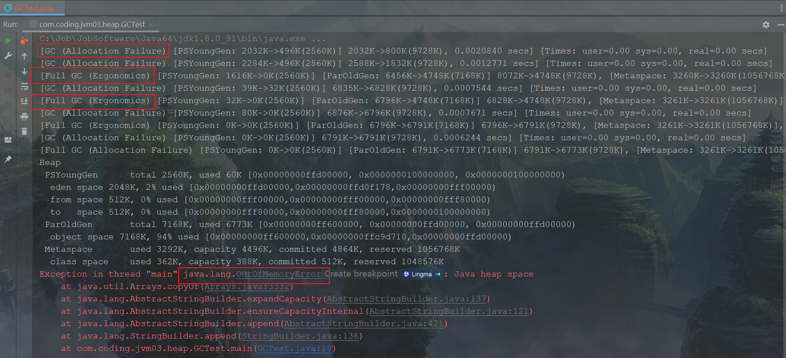

​	第一个标记框中的GC表示新生代GC，第二个和第三个表示整堆GC，最后一个标记框表示出现了OOM现象。

## 7.6 堆空间分代思想

​	为什么需要把Java堆分代？不分代就不能正常工作了吗？经研究，不同的对象生命周期不同。70%～99%的对象是临时对象。其实不分代完全可以，分代的唯一理由就是优化GC性能。如果没有分代，那所有的对象都在一块，就如同把一个学校的人都关在一个教室。GC的时候要找到哪些对象没用，这样就需要对堆的所有区域进行扫描。而很多对象都是“朝生夕死”的，如果分代的话，把新创建的对象放到某一地方，当GC的时候先把这块存储“朝生夕死”对象的区域进行回收，这样就会腾出很大空间。

## 7.7 堆中对象的分配策略

​	如果对象在Eden区出生，并经过第一次MinorGC后仍然存活，并且能被Survivor区容纳的话，将被移动到Survivor区中，并将对象年龄设为1。对象在Survivor区中每经过一次Minor GC，年龄就增加1岁，当它的年龄增加到一定程度时（默认为15岁，其实每个JVM、每个GC都有所不同），就会被晋升到老年代中。对象晋升老年代的年龄阈值，可以通过“-XX:MaxTenuringThreshold”来设置，也会有其他情况直接分配对象到老年代。对象分配策略如下所示。

1. 优先分配到Eden区。
2. 大对象直接分配到老年代，在开发过程中应尽量避免程序中出现过多的大对象。
3. 长期存活的对象分配到老年代。
4. 通过动态对象年龄判断，如果Survivor区中相同年龄的所有对象的大小总和大于Survivor区的一半，年龄大于或等于该年龄的对象可以直接进入老年代，无须等到MaxTenuringThreshold中要求的年龄。
5. 空间分配担保，使用参数-XX:HandlePromotionFailure来设置空间分配担保是否开启，但是JDK 6 Update 24该参数不再生效，JDK 6 Update 24之后版本的规则变为，只要老年代的连续空间大于新生代对象总大小或者历次晋升的平均大小，就会进行Minor GC，否则将进行Full GC。

<span style="color:#40E0D0;">案例1：大对象直接进入老年代</span>

- 代码

```java
/**
 * 测试：大对象直接进入老年代
 * VM options: -Xms60m -Xms60m -XX:NewRatio=2 -XX:SurvivorRatio=8 -XX:+PrintGCDetails
 */
public class YoungOldAreaTest {
    public static void main(String[] args) {
        byte[] buffer = new byte[1024 * 1024 * 20]; // 20m
    }
}
```

- 日志

<div style="text-align:center;font-weight:bold;">大对象直接进入老年代</div>

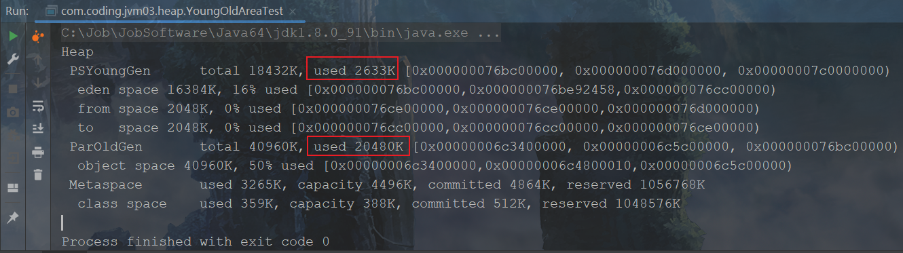

​	20M的数据出现在ParOldGen区也就是老年代，说明大对象在Eden区存不下，直接分配到老年代。

## 7.8 为对象分配内存：TLAB

​	程序中所有的线程共享Java中的堆区域，但是堆中还有一部分区域是线程私有，这部分区域称为线程本地分配缓存区(Thread Local Allocation Buffer,TLAB)。

​	TLAB表示JVM为每个线程分配了一个私有缓存区域，这块缓存区域包含在Eden区内。简单说TLAB就是在堆内存中的Eden区分配了一块线程私有的内存区域。什么是TLAB呢？

1. 从内存模型角度来看，新生代区域继续对Eden区域进行划分，JVM为每个线程分配了一个私有缓存区域。

<div style="text-align:center;font-weight:bold;">Eden区中各线程TLAB的分配情况</div>

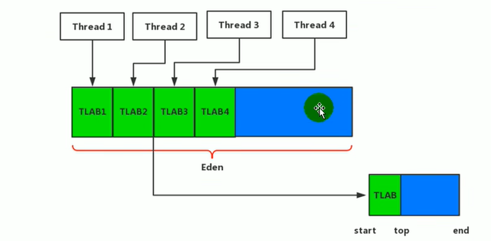

2. 多线程同时分配内存时，使用TLAB可以避免一系列的非线程安全问题，同时还能够提升内存分配的吞吐量，因此我们可以将这种内存分配方式称为快速分配策略。
3. 所有Open JDK衍生出来的JVM都提供了TLAB的设计。

为什么有TLAB呢？原因如下。

1. 堆区是线程共享区域，任何线程都可以访问到堆区中的共享数据。
2. )由于对象实例的创建在JVM中非常频繁，因此在并发环境下从堆区中划分内存空间是线程不安全的。
3. 为避免多个线程操作同一地址，需要使用加锁等机制，进而影响分配速度。

​	尽管不是所有的对象实例都能够在TLAB中成功分配内存，但JVM确实是将TLAB作为内存分配的首选。在程序中，开发人员可以通过选项“-XX:+/-UseTLAB”设置是否开启TLAB空间。

<span style="color:#40E0D0;">案例1：</span>

- 代码

```java
/**
 * 测试 -XX:UseTLAB 是否开启的情况：默认情况是开启的
 * 打开工具 jvisualvm
 *
 * $ jinfo -flag UseTLAB 17284
 * -XX:+UseTLAB
 */
public class TLABArgsTest {
    public static void main(String[] args) {
        System.out.println("我只是来打个酱油~");
        try {
            Thread.sleep(1000000);
        } catch (InterruptedException e) {
            e.printStackTrace();
        }
    }
}
```

​	通过jinfo命令查看参数是否设置，UseTLAB前面如果有“+”号，证明TLAB是开启状态。

​	默认情况下，TLAB空间的内存非常小，仅占有整个Eden区的1%，我们可以通过选项“-XX:TLABWasteTargetPercent”设置TLAB空间所占用Eden区的百分比大小。

​	一旦对象在TLAB空间分配内存失败时，JVM就会尝试着通过使用加锁机制确保数据操作的原子性，从而直接在Eden区中分配内存。加上了TLAB之后的对象分配过程如下图所示。

<div style="text-align:center;font-weight:bold;">加入TLAB后的对象分配过程图</div>

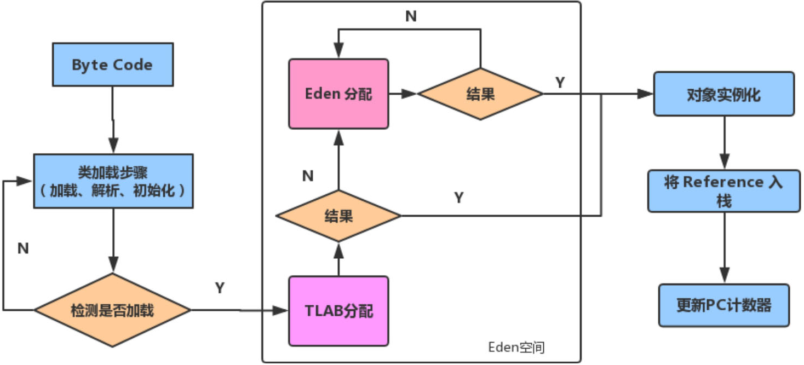

## 7.9 堆空间的参数设置小结

| 参数                       | 作用                                                         |
| -------------------------- | ------------------------------------------------------------ |
| -XX:+PrintFlagsInitial     | 查看所有的参数的默认初始值。                                 |
| -XX:+PrintFlagsFinal       | 查看所有的参数的最终值（可能会存在修改，不再是初始值）。     |
| -Xms                       | 初始堆空间内存（默认为物理内存的1/64）。                     |
| -Xmx                       | 最大堆空间内存（默认为物理内存的1/4）。                      |
| -Xmn                       | 设置新生代的大小（初始值及最大值）。                         |
| -Xss                       | 设置栈空间大小。                                             |
| -XX:NewRatio               | 配置新生代与老年代在堆结构的占比。                           |
| -XX:SurvivorRatio          | 设置新生代中Eden和S0/S1空间的比例。                          |
| -XX:MaxTenuringThreshold   | 设置新生代垃圾的最大年龄。                                   |
| -XX:+PrintGCDetails        | 输出详细的GC处理日志。打印GC简要信息：① -XX:+PrintGC；② -verbose:gc。 |
| -XX:HandlePromotionFailure | 是否设置空间分配担保                                         |

​	-XX:HandlePromotionFailure：是否设置空间分配担保，在发生Minor GC之前，JVM会检查老年代最大可用的连续空间是否大于新生代所有对象的总空间。如果大于，则此次Minor GC是安全的；如果小于，则JVM会查看-XX:HandlePromotionFailure设置值是否允许担保失败。

​	参数HandlePromotionFailure设置策略如下。

1. 如果HandlePromotionFailure=true，那么会继续检查老年代最大可用连续空间是否大于历次晋升到老年代的对象的平均大小。
2. 如果大于，则尝试进行一次Minor GC，但这次Minor GC依然是有风险的。
3. 如果小于，则改为进行一次Full GC。

​	在JDK6 Update 24之后，HandlePromotionFailure参数不会再影响到虚拟机的空间分配担保策略，观察Open JDK中的源码变化，虽然源码中还定义了HandlePromotion Failure参数，但是在代码中已经不会再使用它。<span style="color:red;font-weight:bold;">JDK6 Update 24之后的规则变为只要老年代的连续空间大于新生代对象总大小或者历次晋升的平均大小</span>，就会进行Minor GC，否则将进行Full GC。

## 7.10 堆是否为分配对象存储的唯一选择

### 7.10.1 对象不一定存储在堆中

​	在《深入理解Java虚拟机》中关于Java堆内存有这样一段描述：“随着Java语言的发展，现在已经能看到有些许迹象表明日后可能出现值类型的支持，即使只考虑现在，由于即时编译技术的进步，尤其是逃逸分析技术的日益强大，<span style="color:#9400D3;">栈上分配、标量替换</span>等优化手段已经导致一些微妙的变化悄然发生，所以说Java对象实例都分配在堆上也渐渐变得不那么绝对了。”

​	在JVM中，对象是在Java堆中分配内存的，这是一个普遍的常识。但是，有一种特殊情况，那就是<span style="color:red;font-weight:bold;">如果经过逃逸分析(Escape Analysis)后发现，一个对象并没有逃逸出方法，那么就可能被优化成栈上分配</span>。这样就无须在堆上分配内存，也无须进行垃圾回收了。这也是最常见的堆外存储技术。

​	此外，前面提到的基于Open JDK深度定制的TaoBaoVM，其中创新的GCIH(GCInvisible Heap)技术实现off-heap，将生命周期较长的Java对象从Heap中移至 Heap外，并且GC不能管理GCIH内部的Java对象，以此达到降低GC回收频率和提升GC回收效率的目的。

### 7.10.2 逃逸分析概述

​	前面我们提到了对象经过逃逸分析，有可能把对象分配到栈上。也就是说如果将对象分配到栈，需要使用逃逸分析手段。

​	逃逸分析是一种可以有效减少Java程序中同步负载和内存堆分配压力的跨函数全局数据流分析算法。

​	通过逃逸分析，Java HotSpot编译器能够分析出一个新对象引用的使用范围，从而决定是否要将这个对象分配到堆上。逃逸分析的基本行为就是分析对象的动态作用域。

​	<span style="color:red;font-weight:bold;">当一个对象在方法中被定义后，若对象只在方法内部使用，则认为没有发生逃逸。</span>

​	<span style="color:red;font-weight:bold;">当一个对象在方法中被定义后，若它被外部方法所引用，则认为发生逃逸。例如作为调用参数传递到其他地方中。</span>

<span style="color:#40E0D0;">案例1：伪代码演示没有发生逃逸的对</span>

```java
public void my_method() {
    V v = new V();
    // ......
    v = null;
}
```

​	代码示例中的对象V的作用域只在method()方法区内，若没有发生逃逸，则可以分配到栈上，随着方法执行的结束，栈空间就被移除了。

<span style="color:#40E0D0;">案例2：演示发生逃逸的对象</span>

```java
public static StringBuffer createStringBuffer(String s1, String s2) [
    StringBuffer sb = new StringBuffer();
    sb.append(s1);
    sb.append(s2);
    return sb;
]
```

<span style="color:#40E0D0;">案例3：StringBuffer不发生逃逸</span>

```java
public static StringBuffer createStringBuffer(String s1, String s2) [
    StringBuffer sb = new StringBuffer();
    sb.append(s1);
    sb.append(s2);
    return sb.toString();
]
```

<span style="color:#40E0D0;">案例4：不同情景的逃逸分析</span>

```java
/**
 * 逃逸分析
 * 如何快速的判断是否发生了逃逸分析，大家就看new的对象是否有可能在方法外被调用。
 */
public class EscapeAnalysis {
    public EscapeAnalysis obj;

    /**
     * 方法返回EscapeAnalysis对象，发生逃逸。
     */
    public EscapeAnalysis getInstance() {
        return obj == null ? new EscapeAnalysis() : obj;
    }

    /**
     * 为成员属性赋值，发生逃逸
     */
    public void setObj() {
        this.obj = new EscapeAnalysis();
    }

    /**
     * 对象的作用域仅在当前方法中有效，没有发生逃逸
     */
    public void useEscapeAnalysis() {
        EscapeAnalysis e = new EscapeAnalysis();
    }

    /**
     * 引用成员变量的值，发生逃逸
     */
    public void useEscapeAnalysis1() {
        EscapeAnalysis e = getInstance();
    }
}
```

​	<span style="color:red;font-weight:bold;">在JDK 6u23版本之后，HotSpot中默认就已经开启了逃逸分析</span>。如果使用的是较早的版本，开发人员则可以通过以下参数来设置逃逸分析的相关信息。

1. 选项“-XX:+DoEscapeAnalysis”开启逃逸分析。
2. 选项“-XX:+PrintEscapeAnalysis”查看逃逸分析的筛选结果。

​	<span style="color:red;font-weight:bold;">一般在开发中能使用局部变量的，就不要使用在方法外定义。</span>

### 7.10.3 逃逸分析优化结果

​	使用逃逸分析，编译器可以对程序做如下优化。

1. 栈上分配。将堆分配转化为栈分配。针对那些作用域不会逃逸出方法的对象，在分配内存时不再将对象分配在堆内存中，而是将对象分配在栈上，这样，随着方法的调用结束，栈空间的回收也会回收掉分配到栈上的对象，不再给垃圾收集器增加额外的负担，从而提升应用程序整体性能。

2. 同步省略。如果一个对象被发现只能从一个线程被访问到，那么对于这个对象的操作可以不考虑同步。
3. 分离对象或标量替换。有的对象可能不需要作为一个连续的内存结构存在也可以被访问到，那么对象的部分（或全部）可以不存储在堆内存中，而是存储在栈中。

### 7.10.4 逃逸分析之栈上分配

​	JIT(Just In Time)编译器在编译期间根据逃逸分析的结果，发现如果一个对象没有逃逸出方法的话，就可能被优化成栈上分配。分配完成后，继续在调用栈内执行，最后线程结束，栈空间被回收，局部变量对象也被回收。这样就无须进行垃圾回收了。

​	<span style="color:red;font-weight:bold;">栈上分配（Stack Allocation）是指将对象分配在上，而不是在堆上。</span>

​	<span style="color:red;font-weight:bold;">‌栈上分配适用于那些不会逃逸的对象。通过将对象分配到线程栈上，可以减少堆的使用，减少垃圾回收的次数，提升性能。</span>

<span style="color:#40E0D0;">案例1：栈上分配测试</span>

- 代码

```java
/**
 * 堆上分配测试：
 * VM opotions: -Xms1G -Xmx1G -XX:-DoEscapeAnalysis -XX:+PrintGCDetails
 * 说明：通过指定 -XX:-DoEscapeAnalysis 和 -XX:+DoEscapeAnalysis 观察不同执行时间
 */
public class StackAllocation {
    public static void main(String[] args) {
        long start = System.currentTimeMillis();
        for (int i = 0; i < 10000000; i++) {
            alloc();
        }
        // 查看执行时间
        long end = System.currentTimeMillis();
        System.out.println("花费的时间为：" + (end - start) + " ms");

        // 为了方便查看堆内存中对象个数，线程sleep
        try {
            Thread.sleep(1000000);
        } catch (InterruptedException e) {
            e.printStackTrace();
        }
    }

    private static void alloc() {
        User user = new User();
    }

    static class User {
    }
}
```

- 未开启：未开启逃逸分析时创建1000万个User对象花费的时间为94ms

<div style="text-align:center;font-weight:bold;">未开启逃逸分析时创建1000万个对象所花费的时间</div>


​	未开启逃逸分析时User对象的实例数为1000万个。

<div style="text-align:center;font-weight:bold;">未开启逃逸分析时内存中User对象的实例数</div>

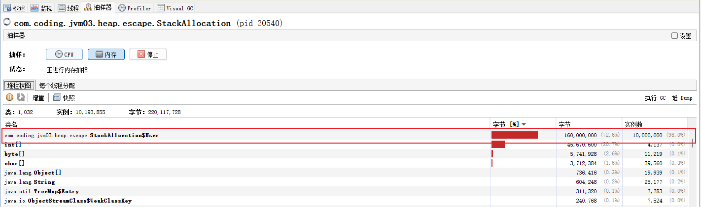

- 开启（默认行为）：

<div style="text-align:center;font-weight:bold;">开启逃逸分析后所花费的时间</div>


​	开启逃逸分析后当前内存中有124752个对象，堆内存中不再维护1000万个对象。

<div style="text-align:center;font-weight:bold;">开启逃逸分析后内存中User对象的实例数</div>

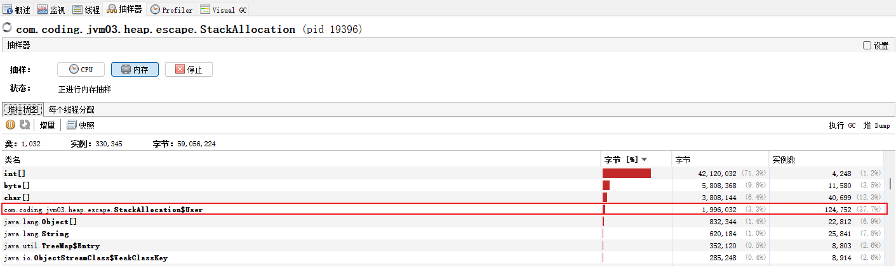

### 7.10.5 逃逸分析之同步省略

​	线程同步的代价是相当高的，同步的后果是降低了并发性和性能。在动态编译同步块的时候，JIT编译器可以借助逃逸分析，来判断同步块所使用的锁对象是否只能够被一个线程访问而没有被发布到其他线程。如果没有，那么JIT编译器在编译这个同步块的时候就会取消对这部分代码的同步，这样就能大大提高并发性和性能。这个取消同步的过程就叫同步省略，也叫锁消除。

<span style="color:#40E0D0;">案例1：同步省略</span>

- 代码

```java
/**
 * 同步省略说明
 */
public class SynchronizedTest {

    public static void main(String[] args) {
        Object hollis = new Object();
        synchronized (hollis) {
            System.out.println(hollis);
        }
    }
}
```

​	代码中对hollis对象进行加锁，但是hollis对象的生命周期只在f()方法中，并不会被其他线程访问，所以在JIT编译阶段就会被优化掉。

​	当代码中对hollis这个对象进行加锁时的字节码文件如图7-34所示。同步省略是将字节码文件加载到内存之后才进行的，所以当我们查看字节码文件的时候仍然能看到synchronized的身影，在字节码文件中体现为monitorenter和monitorexit。

<div style="text-align:center;font-weight:bold;">同步省略锁机制说明</div>

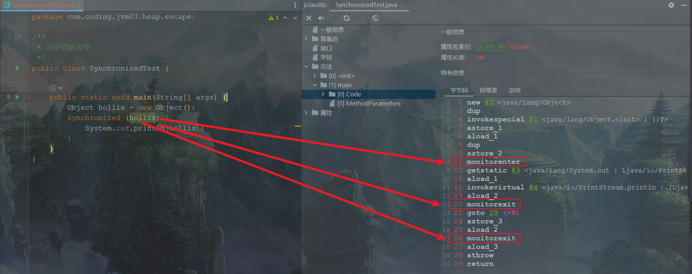

<span style="color:#40E0D0;">案例2：优化后的代码</span>

```java
/**
 * 同步省略说明
 */
public class SynchronizedTest {

    public static void main(String[] args) {
        Object hollis = new Object();
        System.out.println(hollis);
    }
}
```

### 7.10.6 逃逸分析之标量替换

​	标量(Scalar)是指一个无法再分解成更小数据的数据。Java中的原始数据类型就是标量。相对的，那些还可以分解的数据叫作聚合量(Aggregate)，Java中的对象就是聚合量，因为它可以分解成其他聚合量和标量。

​	<span style="color:#9400D3;">在JIT编译器的编译阶段，如果经过逃逸分析，发现一个对象不会被外界访问的话，那么经过JIT优化，就会把这个对象拆解成若干个成员变量。这个过程就是标量替换</span>。

​	<span style="color:red;font-weight:bold;">标量替换（Scalar Replacement）是指将对象的部分或全部成员变量替换为基本数据类型</span>。

​	<span style="color:red;font-weight:bold;">标量替换适用于那些可以被拆分成多个标量的对象。通过将对象的成员变量替换为基本数据类型，可以减少对象的创建和销毁，进一步减少内存的使用和垃圾回收的负担。</span>

<span style="color:#40E0D0;">案例1：标量替换</span>

- 代码

```java
public static void main(String[] args) {
    alloc();
}
private static void alloc() {
    Point point = new Point(1,2);
    System.out.println("point.x="+point.x+"; point.y="+point.y);
}
class Point {
    private int x;
    private int y;
}
```

​	以上代码经过标量替换后，就会变成如下效果。

- 代码

```java
private static void alloc() {
    int x = 1;
    int y = 2;
    System.out.println("point.x="+point.x+"; point.y="+point.y);
}
```

​	可以看到，point这个聚合量经过逃逸分析后，并没有逃逸就被替换成两个聚合量了。那么标量替换有什么好处呢？就是可以大大减少堆内存的占用。因为一旦不需要创建对象了，那么就不再需要分配堆内存了。标量替换为栈上分配提供了很好的基础。

​	通过参数-XX:+EliminateAllocations可以开启标量替换（默认打开），允许将对象打散分配在栈上。下面代码展示了标量替换之后对性能的优化效果。

<span style="color:#40E0D0;">案例2：标量替换性能优化测试</span>

- 代码：关闭标量替换

```java
/**
 * VM options: -server -Xms100m -Xmx100m -XX:+DoEscapeAnalysis -XX:+PrintGC -XX:-EliminateAllocations
 * 注意，HotSpot虚拟机默认是server模式，所以 -server 可省略的
 */
public class ScalarReplace {

    public static class User {
        public int id;
        public String name;
    }

    public static void alloc() {
        User u = new User(); // 未发生逃逸
        u.id = 5;
        u.name = "emon.com";
    }

    public static void main(String[] args) {
        long start = System.currentTimeMillis();
        for (int i = 0; i < 10000000; i++) {
            alloc();
        }
        // 查看执行时间
        long end = System.currentTimeMillis();
        System.out.println("花费的时间为：" + (end - start) + " ms");
    }
}
```

<div style="text-align:center;font-weight:bold;">未开启标量替换时程序运行的时间</div>

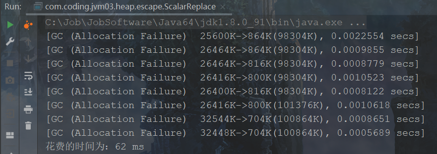

<div style="text-align:center;font-weight:bold;">开启标量替换时程序运行的时间</div>


​	开启标量替换时明显可以看出代码运行的时间减少了很多，同时也没有发生GC操作。

​	上述代码在主函数中调用了1千万次alloc()方法。调用alloc()方法的时候创建对象，每个User对象实例需要占据约16字节的空间，因此调用1亿次alloc()方法总共需要大约150MB内存空间。如果堆空间小于这个值，就必然会发生GC，所以当堆空间设置为100MB并且关闭标量替换的时候，发生了GC。

### 7.10.7 逃逸分析小结：逃逸分析并不成熟

​	关于逃逸分析的论文在1999年就已经发表了，但直到JDK 1.6才有实现，而且这项技术到如今也并不是十分成熟。

​	其根本原因就是无法保证逃逸分析的性能收益一定能高于它的消耗。虽然经过逃逸分析可以做标量替换、栈上分配和锁消除，但是逃逸分析自身也需要进行一系列复杂分析，这其实也是一个相对耗时的过程。一个极端的例子就是经过逃逸分析之后，发现所有对象都是逃逸的，那这个逃逸分析的过程就白白浪费掉了。

​	虽然这项技术并不十分成熟，但是它也是即时编译器优化技术中一个十分重要的手段。有一些观点认为，通过逃逸分析JVM会在栈上分配那些不会逃逸的对象，这在理论上是可行的，但是取决于JVM设计者的选择。<span style="color:red;font-weight:bold;">Oracle Hotspot JVM中并未实现栈上分配，上面案例测试的效果都是基于标量替换实现的，这一点在逃逸分析相关的文档里已经说明，对象被标量替换以后便不再是对象了，所以可以明确所有的对象实例都创建在堆上</span>。

​	<span style="color:#9400D3;font-weight:bold;">目前很多书籍还是基于JDK 7以前的版本。JDK 8和之后的版本中内存分配已经发生了很大变化。比如intern字符串的缓存和静态变量曾经都被分配在永久代上，而永久代已经被元空间取代。但是JDK 8和之后的版本中intern字符串缓存和静态变量并不是被转移到元空间，而是直接在堆上分配。所以这一点同样符合前面的结论：对象实例都是分配在堆上。</span>

# 第8章 方法区

## 8.1 栈、堆、方法区的交互关系

​	针对HotSpot虚拟机，从内存结构上看运行时数据区包含本地方法栈、程序计数器、虚拟机栈、堆和方法区。

<div style="text-align:center;font-weight:bold;">运行时数据区中的方法区</div>

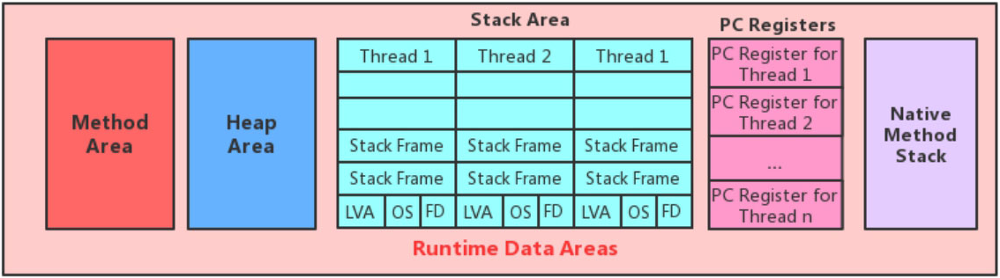

​	上面是从内存结构的角度看方法区在运行时数据区所处的位置，下面从线程共享与否的角度来看运行时数据区的划分，如下图所示：

<div style="text-align:center;font-weight:bold;">内存区域的划分</div>

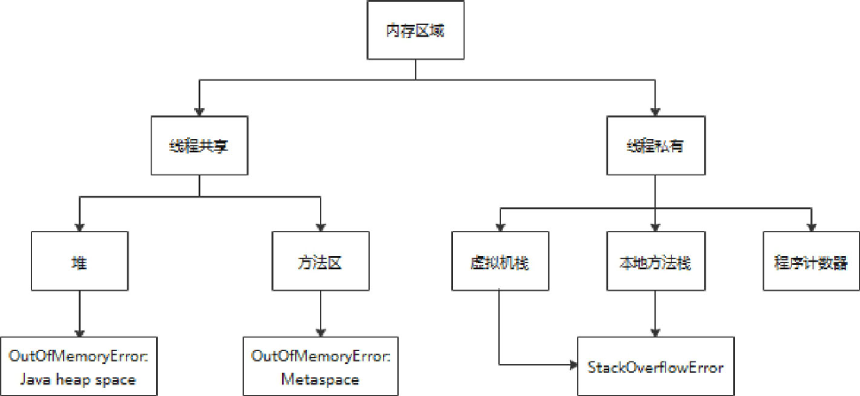


​	栈、堆、方法区三者之间的交互关系如下图所示，从最简单的代码角度出发，当前声明的变量是Student类型的student，把整个Student类的结构加载到方法区，把变量student放到虚拟机栈中，new的对象放到java堆中。

<div style="text-align:center;font-weight:bold;">栈、堆、方法区交互关系的实例图</div>

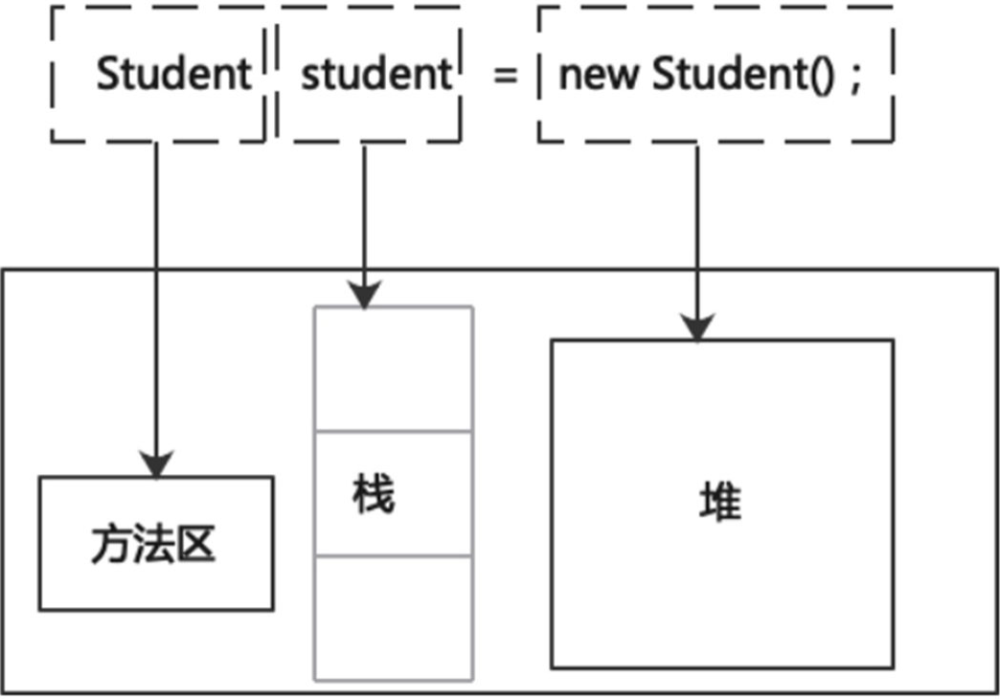

​	在虚拟机栈局部变量表中存放的是各个变量，其中reference区域就相当于上图中的student变量，引用类型reference指向了堆空间中对象的实例数据，在堆的对象实例数据中有一个到对象类型数据的指针，这个指针指向了方法区中对象类型的数据。如下图所示：

<div style="text-align:center;font-weight:bold;">栈、堆、方法区内存结构关系图</div>

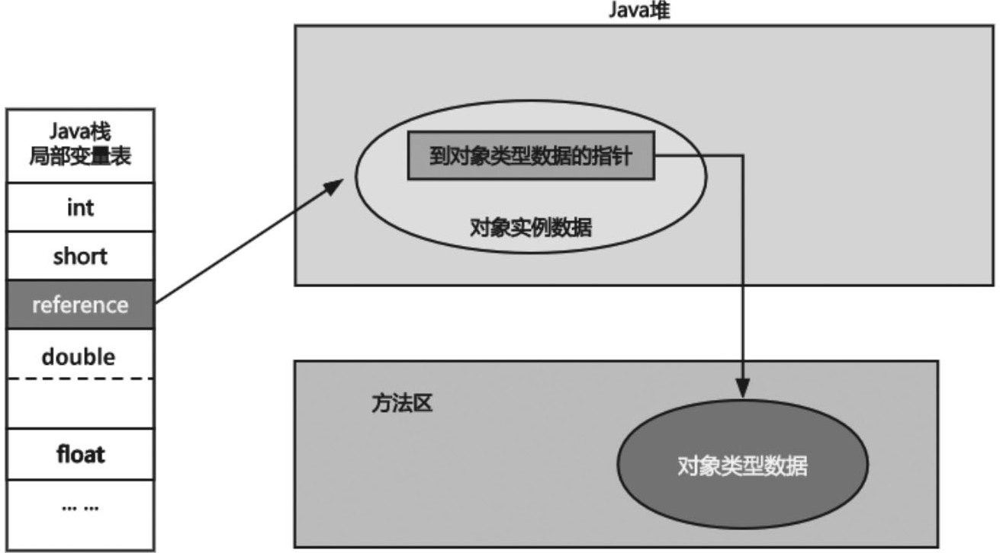

## 8.2 方法区的理解

### 8.2.1 方法区的官方描述

[方法区官方描述](https://docs.oracle.com/javase/specs/jvms/se8/html/jvms-2.html#jvms-2.5.4)

​	在JVM中，方法区是可供各个线程共享的运行时内存区域。方法区与传统语言中的编译代码存储区或者操作系统进程的正文段的作用非常类似，它存储了每一个类的结构信息，例如，运行时常量池(Runtime ConstantPool)、字段和方法数据、构造函数和普通方法的字节码内容，还包括一些在类、实例、接口初始化时用到的特殊方法。

​	方法区在虚拟机启动的时候创建，虽然方法区是堆的逻辑组成部分，但是简单的虚拟机实现可以选择在这个区域不实现垃圾收集和压缩。Java 8的虚拟机规范也不限 定实现方法区的内存位置和编译代码的管理策略。方法区的容量可以是固定的，也可以随着程序执行的需求动态扩展，并在不需要太多空间时自动收缩。方法区在实际内存空间中可以是不连续的。

​	Java虚拟机规范中明确说明：“尽管所有的方法区在逻辑上是属于堆的一部分，但一些简单的实现可能不会选择去进行垃圾收集或者进行压缩。”但对于HotSpot虚拟机而言，方法区还有一个别名叫作Non-Heap（非堆），目的就是要和堆区分开。所以，方法区可以看作是一块独立于Java堆的内存空间。

<div style="text-align:center;font-weight:bold;">运行时数据区中方法区的所在位置</div>


### 8.2.2 方法区的基本理解

​	对于方法区的理解我们要注意以下几个方面。

1. 方法区(Method Area)与堆一样，是各个线程共享的内存区域。
2. 方法区在JVM启动的时候被创建，并且它实际的物理内存空间和虚拟机堆区一样都可以是不连续的。
3. 方法区的大小跟堆空间一样，可以选择固定大小或者可扩展。方法区的大小决定了系统可以保存多少个类。如果系统定义了太多的类，导致方法区溢出，虚拟机同样会抛出内存溢出错误，如java.lang.OutOfMemoryError:PermGen space或者java.lang.OutOfMemoryError:Metaspace。

​	以下情况都可能导致方法区发生OOM异常：加载大量的第三方jar包、Tomcat部署的工程过多（30～50个）或者大量动态地生成反射类。关闭JVM就会释放这个区域的内存。

### 8.2.3 JDK中方法区的变化

​	在JDK 7及以前，习惯上把方法区称为永久代。但是JDK 8移除了永久代，官方说明[为什么移除永久代](https://openjdk.org/jeps/122)。

​	为什么会有上面的变化呢？Java虚拟机规范对如何实现方法区，不做统一要求，例如BEA JRockit和IBM J9等虚拟机中不存在永久代的概念。JDK 7及之前的HotSpot虚拟机把垃圾收集扩展到永久代，这样HotSpot虚拟机就可以像管理堆一样管理永久代，不需要单独针对方法区写内存管理代码了。现在看来，让虚拟机管理永久代内存并不是很好的想法，因为永久代很容易让Java程序发生内存溢出（超过-XX:MaxPermSize上限）。而BEA JRockit和IBM J9虚拟机是在本地内存中实现的方法区，只要没有触碰到进程可用的内存上限就不会出问题。借鉴BEAJRockit虚拟机对于方法区的实现，HotSpot虚拟机在JDK 8也完全废弃了永久代的概念，取而代之的是在本地内存中实现的元空间(Metaspace）。

<div style="text-align:center;font-weight:bold;">JDK 7中的方法区实现：永久</div>

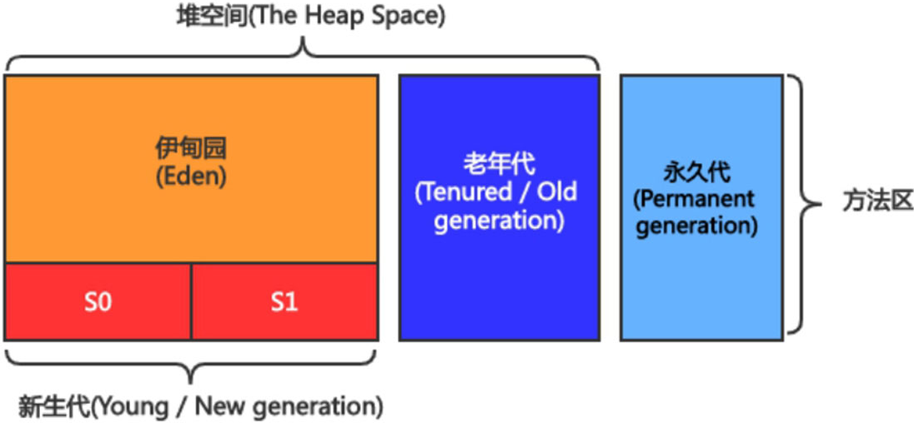

<div style="text-align:center;font-weight:bold;">JDK 8中的方法区实现：元空间</div>

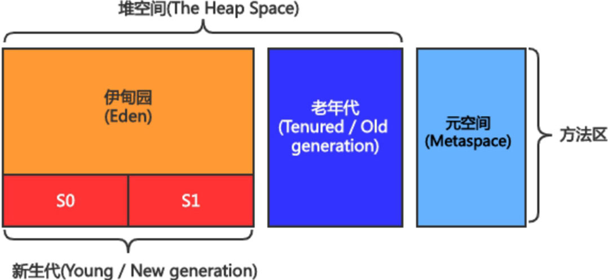

​	元空间的本质和永久代类似，都是对JVM规范中方法区的实现。不过元空间与永久代最大的区别在于元空间不在虚拟机设置的内存中，而是在本地内存。另外，永久代、元空间二者并不只是名字变了，内部结构也调整了，稍后会做介绍。

​	根据Java虚拟机规范的规定，如果方法区无法满足新的内存分配需求，将抛出OOM异常。

## 8.3 设置方法区大小与OOM

### 8.3.1 设置方法区内存的大小

​	方法区的大小不必是固定的，JVM可以根据应用的需要动态调整，下面根据JDK版本来分别说明方法区的大小设置和注意事项。

​	JDK 7及以前的方法区相关设置如下。

1. 通过-XX:PermSize参数设置永久代初始分配空间。

```bash
$ jinfo -flag PermSize <pid>
```

2. 通过-XX:MaxPermSize参数设置永久代最大可分配空间。32位机器默认是64MB,64位机器模式是82MB，当JVM加载的类信息容量超过了该值，会报异常OutOfMemoryError:PermGen space。

```bash
$ jinfo -flag MaxPermSize <pid>
```

​	8及以后方法区相关设置如下。

​	元空间大小可以使用参数-XX:MetaspaceSize和-XX:MaxMetaspaceSize指定，替代JDK7中的永久代的初始值和最大值。默认值依赖于具体的系统平台，取值范围是12～20MB。例如在Windows平台下，-XX:MetaspaceSize默认大约是20MB，如果-XX:MaxMetaspaceSize的值是-1，表示没有空间限制。与永久代不同，如果不指定大小，在默认情况下，虚拟机会耗尽所有的可用系统内存。如果元空间发生溢出，虚拟机一样会抛出异常OutOfMemoryError:Metaspace。

```bash
$ jinfo -flag MetaspaceSize <pid>
$ jinfo -flag MaxMetaspaceSize <pid>
```

​	假设-XX:MetaspaceSize默认值为20MB，这是初始的高水位线，一旦方法区内存使用触及这个水位线，Full GC将会被触发并卸载没用的类（包括这些类对应的类加载器也不再存活）。垃圾收集后，高水位标记可能会根据类元数据释放的空间量自动提高或降低，如果释放的空间很少，那么在不超过MaxMetaspaceSize时，该值会被提高，以免过早引发下一次垃圾收集。如果释放空间过多，那么该值会被降低。如果初始化的高水位线设置过低，上述高水位线调整情况会发生很多次。通过垃圾回收器的日志可以观察到Full GC多次调用。为了避免频繁GC，建议将-XX:MetaspaceSize设置为一个相对较高的值。

<span style="color:#40E0D0;">案例1：JDK 8中方法区内存设</span>

- 代码

```java
/**
 * 测试设置方法区大小参数的默认值
 * VM options: -Xms600m -Xmx600m
 * jdk7及以前：
 * ‑XX:PermSize=100m ‑XX:MaxPermSize=100m
 * jdk8及以后：
 * -XX:MetaspaceSize=100m -XX:MaxMetaspaceSize=100m
 * <p>
 * $ jinfo -flag PermSize 12516
 * -XX:PermSize=21757952=20.75M
 * $ jinfo -flag MaxPermSize 12516
 * -XX:MaxPermSize=85983232=82M
 * <p>
 * $ jinfo -flag MetaspaceSize 6148
 * -XX:MetaspaceSize=21807104=20.79
 * $ jinfo -flag MaxMetaspaceSize 6148
 * -XX:MaxMetaspaceSize=18446744073709486080
 */
public class MethodAreaDemo {
    public static void main(String[] args) {
        System.out.println("start...");
        try {
            Thread.sleep(1000000);
        } catch (InterruptedException e) {
            e.printStackTrace();
        }
        System.out.println("end...");
    }
}
```

​	在JDK 8及以上版本中，设定MaxPermSize参数，JVM在启动时并不会报错，但是会提示如下信息。

```bash
Java HotSpot(TM) 64-Bit Server VM warning: ignoring option PermSize=100m; support was removed in 8.0
```

### 8.3.2 方法区内存溢出

​	当方法区发生内存溢出的时候，我们应该怎么去解决呢？下面举例展示如何解决方法区内存溢出，将JDK 7版本的永久代大小设置为5MB，将JDK 8版本的方法区空间大小设置为10MB，分别查看加载多少类的时候发生内存溢出。

<span style="color:#40E0D0;">案例1：方法区内存溢出</span>

```java
import com.sun.xml.internal.ws.org.objectweb.asm.ClassWriter;
import com.sun.xml.internal.ws.org.objectweb.asm.Opcodes;

/**
 * jdk6中：
 * -XX:PermSize=10m -XX:MaxPermSize=10m
 * jdk8中：
 * -XX:MetaspaceSize=10m -XX:MaxMetaspaceSize=10m
 */
public class OOMTest extends ClassLoader {
    public static void main(String[] args) {
        int j = 0;
        try {
            OOMTest test = new OOMTest();
            for (int i = 0; i < 10000; i++) {
                // 创建ClassWrite对象，用于生成类的二进制字节码
                ClassWriter classWriter = new ClassWriter(0);
                // 知名版本号，修饰符，类名，包名，父类，接口
                classWriter.visit(Opcodes.V1_6, Opcodes.ACC_PUBLIC, "class" + i, null, "java/lang/Object", null);
                // 返回byte[]
                byte[] code = classWriter.toByteArray();
                // 类的加载
                test.defineClass("class" + i, code, 0, code.length); // class对象
                j++;
            }
        } finally {
            System.out.println(j);
        }
    }
}
```

<div style="text-align:center;font-weight:bold;">JDK6中出现的方法区内存溢出异常</div>

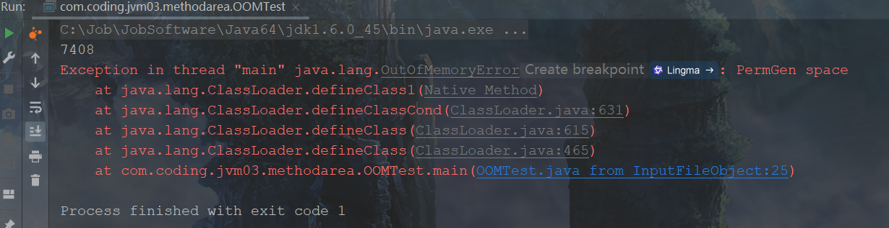

<div style="text-align:center;font-weight:bold;">JDK8中出现的方法区内存溢出异常</div>

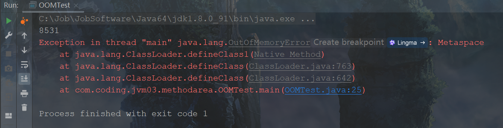

## 8.4 方法区的内部结构

​	方法区内部结构如下图所示。Java源代码编译之后生成class文件，经过类加载器把class文件中的内容加载到JVM运行时数据区。class文件中的一部分信息加载到方法区，比如类class、接口interface、枚举enum、注解annotation以及运行时常量池等类型信息。

<div style="text-align:center;font-weight:bold;">方法区内部结构图</div>

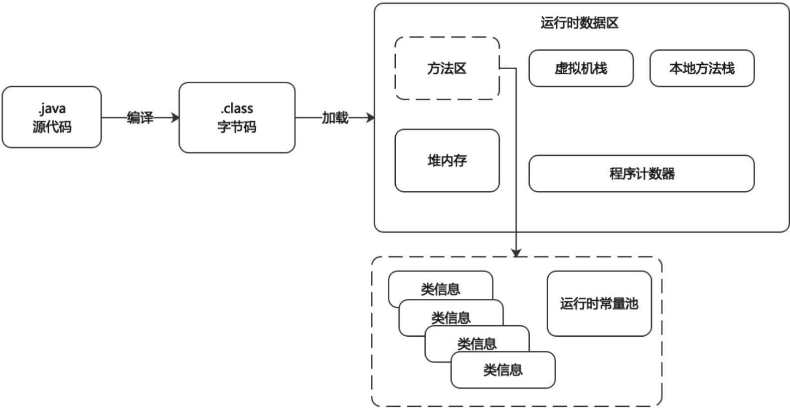

​	上面我们从类加载到运行时数据区的角度说明了方法区什么时候放入数据，下面我们比较详细地说明方法区中存放什么样的数据。方法区和Java堆一样，是各个线程共享的内存区域，<span style="color:#9400D3;">它用于存储已被虚拟机加载的类型信息、常量、静态变量、即时编译器编译后的代码缓存等</span>。

<div style="text-align:center;font-weight:bold;">方法区内部存储信息图</div>


​	接下来对方法区中存储的内容信息分别详细说明。

### 8.4.1 类型信息、域信息和方法信息介绍

​	下面我们先介绍类型信息、域信息和方法信息中存储的内容分别是什么。

**1 类型信息**

​	对每个加载的类型（类class、接口interface、枚举enum、注解annotation），JVM必须在方法区中存储以下类型信息。

- 完整有效全类名，包括包名和类名。
- 直接父类的完整有效名（对于interface或是java.lang.Object，都没有父类）。
- 修饰符（public、abstract、final的某个子集）。
- 直接接口的一个有序列表。

**2 域信息**

​	JVM必须在方法区中保存类型的所有域的相关信息以及域的声明顺序。域的相关信息包括域名称、域类型、域修饰符（public、private、protected、static、final、volatile、transient的某个子集）。

**3 方法信息**

​	JVM必须保存所有方法的以下信息，同域信息一样包括声明顺序。

- 方法名称。
- 方法的返回类型（或void）。
- 方法参数的数量和类型（按顺序）。
- 方法的修饰符（public、private、protected、static、final、synchronized、native、abstract的一个子集）。
- 方法的字节码(bytecodes)、操作数栈深度、局部变量表大小（abstract和native方法除外）。
- 异常表（abstract和native方法除外），异常表会记录每个异常处理的开始位置、结束位置、代码处理在程序计数器中的偏移地址、被捕获的异常类的常量池索引。

<span style="color:#40E0D0;">案例1：方法区内部构成</span>

- 代码

```java
/**
 * 测试方法区的内部构成
 * <p>
 * $ javap -v -p MethodInnerStrucTest.class
 * <p>
 * -v  -verbose             输出附加信息
 * -p  -private             显示所有类和成员
 */
public class MethodInnerStrucTest extends Object implements Comparable<String>, Serializable {
    // 属性
    public int num = 10;
    private static String str = "测试方法的内部结构";

    // 构造器
    // 方法
    public void test1() {
        int count = 20;
        System.out.println("count = " + count);
    }

    public static int test2(int cal) {
        int result = 0;
        try {
            int value = 30;
            result = value / cal;
        } catch (Exception e) {
            e.printStackTrace();
        }
        return result;
    }

    @Override
    public int compareTo(String o) {
        return 0;
    }
}
```

​	上述代码的class文件经反编译（使用命令`javap -v -p MethodInnerStrucTest.class`）之后的类型信息如下所示，可以看到完整有效全类名为com.atguigu.MethodInnerStrucTest；父类为java.lang.Object；实现的接口为java.lang.Comparable<java.lang.String>；修饰符为public。

```java
public class com.coding.jvm03.methodarea.MethodInnerStrucTest extends java.lang.Object implements java.lang.Comparable<java.lang.String>, java.io.Serializable
```

​	上述代码的class文件经反编译之后的域信息如下所示，其中包含两个域信息，分别是num和str。首先分析num的各项信息，num为域名称、I表示域类型为Integer、ACC_PUBLIC表示域修饰符为public。接着分析str的各项信息，str为域名称、Ljava/lang/String表示域类型为String、ACC_PRIVATE和ACC_STATIC表示域修饰符为private static。

```java
  public int num;
    descriptor: I
    flags: ACC_PUBLIC

  private static java.lang.String str;
    descriptor: Ljava/lang/String;
    flags: ACC_PRIVATE, ACC_STATIC
```

​	上述代码的class文件经反编译之后的test1()方法信息如下所示，可以看到方法名称是test1();()V表示返回值是void；该方法没有参数，所以没有参数名称和类型；ACC_PUBLIC表示方法修饰符是public;Code后面的字节码包括方法的字节码指令、操作数栈深度为3、局部变量表大小为2。

```java
  public void test1();
    descriptor: ()V
    flags: ACC_PUBLIC
    Code:
      stack=3, locals=2, args_size=1
         0: bipush        20
         2: istore_1
         3: getstatic     #3                  // Field java/lang/System.out:Ljava/io/PrintStream;
         6: new           #4                  // class java/lang/StringBuilder
         9: dup
        10: invokespecial #5                  // Method java/lang/StringBuilder."<init>":()V
        13: ldc           #6                  // String count =
        15: invokevirtual #7                  // Method java/lang/StringBuilder.append:(Ljava/lang/String;)Ljava/lang/StringBuilder;
        18: iload_1
        19: invokevirtual #8                  // Method java/lang/StringBuilder.append:(I)Ljava/lang/StringBuilder;
        22: invokevirtual #9                  // Method java/lang/StringBuilder.toString:()Ljava/lang/String;
        25: invokevirtual #10                 // Method java/io/PrintStream.println:(Ljava/lang/String;)V
        28: return
      LineNumberTable:
        line 21: 0
        line 22: 3
        line 23: 28
      LocalVariableTable:
        Start  Length  Slot  Name   Signature
            0      29     0  this   Lcom/coding/jvm03/methodarea/MethodInnerStrucTest;
            3      26     1 count   I
```

​	除了test1()方法外，大家可以看到反编译文件中还有一个方法叫作MethodInnerStruc Test()，我们知道Java中如果不手动定义构造方法的话，Java默认会提供一个无参的构造方法，在class文件反编译之后，可以看到无参构造方法信息如下所示。

```java
  public com.coding.jvm03.methodarea.MethodInnerStrucTest();
    descriptor: ()V
    flags: ACC_PUBLIC
    Code:
      stack=2, locals=1, args_size=1
         0: aload_0
         1: invokespecial #1                  // Method java/lang/Object."<init>":()V
         4: aload_0
         5: bipush        10
         7: putfield      #2                  // Field num:I
        10: return
      LineNumberTable:
        line 13: 0
        line 15: 4
      LocalVariableTable:
        Start  Length  Slot  Name   Signature
            0      11     0  this   Lcom/coding/jvm03/methodarea/MethodInnerStrucTest;
```

​	最后，我们看到test2()方法的信息中还存在一个异常表，如下所示，其中Exception table表示异常表。

```java
  public static int test2(int);
    descriptor: (I)I
    flags: ACC_PUBLIC, ACC_STATIC
    Code:
      stack=2, locals=3, args_size=1
         0: iconst_0
         1: istore_1
         2: bipush        30
         4: istore_2
         5: iload_2
         6: iload_0
         7: idiv
         8: istore_1
         9: goto          17
        12: astore_2
        13: aload_2
        14: invokevirtual #12                 // Method java/lang/Exception.printStackTrace:()V
        17: iload_1
        18: ireturn
      Exception table:
         from    to  target type
             2     9    12   Class java/lang/Exception
      LineNumberTable:
        line 26: 0
        line 28: 2
        line 29: 5
        line 32: 9
        line 30: 12
        line 31: 13
        line 33: 17
      LocalVariableTable:
        Start  Length  Slot  Name   Signature
            5       4     2 value   I
           13       4     2     e   Ljava/lang/Exception;
            0      19     0   cal   I
            2      17     1 result   I
      StackMapTable: number_of_entries = 2
        frame_type = 255 /* full_frame */
          offset_delta = 12
          locals = [ int, int ]
          stack = [ class java/lang/Exception ]
        frame_type = 4 /* same */
```

### 8.4.2 类变量和常量

​	static修饰的成员变量为类变量或者静态变量，静态变量和类关联在一起，随着类的加载而加载。类变量被类的所有实例共享，即使没有类实例时也可以访问它。

​	在JDK 7之前类变量也是方法区的一部分，JDK 7及以后的JDK类变量放在了堆空间。此外，使用final修饰的成员变量表示常量，使用static final修饰的成员变量称为静态常量，静态常量和静态变量的区别是静态常量在编译期就已经为其赋值。

<span style="color:#40E0D0;">案例1：静态常量和静态变量的区别</span>

- 代码

```java
public class MethodAreaTest {
    public static void main(String[] args) {
        // 惊不惊喜意不意外，不异常
        Order order = null;
        order.hello();
        System.out.println(order.count);
    }
}

class Order {
    // 类加载后赋值
    public static int count = 1;
    // 编译器赋值
    public static final int number = 2;

    public static void hello() {
        System.out.println("hello!");
    }
}
```

<div style="text-align:center;font-weight:bold;">non-final的类变量示例运行结果</div>


​	可以看到当order对象设置为null的时候，调用类变量count时并没有报空指针异常，这是因为类变量被类的所有实例共享，即使没有类实例时也可以访问它，但是在工作中，一般不会写这样的代码，都是直接使用类名来调用。

​	再说一下类变量和静态常量的区别。首先将上面代码使用javap命令反编译，结果如下图所示。可以发现被声明为static的类变量count在编译时期并没有做赋值处理，而对于声明为“static final”的常量处理方法则不同，每个全局常量在编译的时候就会被赋值。

<div style="text-align:center;font-weight:bold;">声明为final的全局常量的赋值</div>

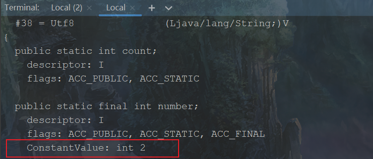

### 8.4.3 常量池

​	方法区内部包含了运行时常量池。class文件中有个constant pool，翻译过来就是常量池。当class文件被加载到内存中之后，方法区中会存放class文件的constantpool相关信息，这时候就成为了运行时常量池。

​	所以要弄清楚方法区的运行时常量池，需要理解class文件中的常量池。一个Java应用程序中所包含的所有Java类的常量池组成了JVM中的大的运行时常量池。常量池在class文件中的相关结构如下图所示，图中画框的地方有两个元素，分别是constant_pool_count和constant_pool[constant_pool_count-1]，它们分别表示常量池容量和所有的常量。

<div style="text-align:center;font-weight:bold;">class结构中的常量池</div>

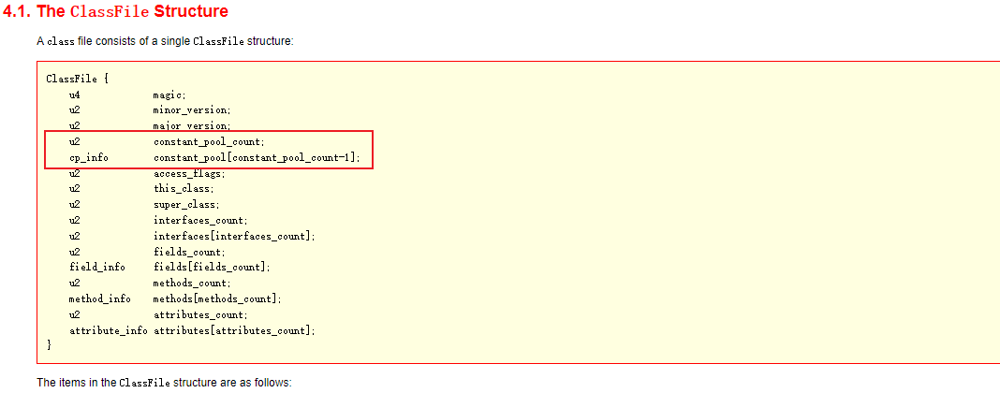

​	常量池内存储的数据类型包括数量值、字符串值、类引用、字段引用以及方法引用。

<span style="color:#40E0D0;">案例1：常量池</span>

- 代码

```java
public class DynamicLinkingTest {
    int num = 10;

    public void methodA() {
        System.out.println("methodA()......");
    }

    public void methodB() {
        System.out.println("methodB()......");
        methodA();
        num++;
    }
}
```

​	通过`javap –v DynamicLinkingTest.class`命令查看class文件，如下所示：

- 查看class文件

```java
$ javap -v DynamicLinkingTest.class 
--------------------------------------------------
Constant pool:
   #1 = Methodref          #9.#23         // java/lang/Object."<init>":()V
   #2 = Fieldref           #8.#24         // com/coding/jvm03/stack/DynamicLinkingTest.num:I
   #3 = Fieldref           #25.#26        // java/lang/System.out:Ljava/io/PrintStream;
   #4 = String             #27            // methodA()......
   #5 = Methodref          #28.#29        // java/io/PrintStream.println:(Ljava/lang/String;)V
   #6 = String             #30            // methodB()......
   #7 = Methodref          #8.#31         // com/coding/jvm03/stack/DynamicLinkingTest.methodA:()V
   #8 = Class              #32            // com/coding/jvm03/stack/DynamicLinkingTest
   #9 = Class              #33            // java/lang/Object
  #10 = Utf8               num
  #11 = Utf8               I
  #12 = Utf8               <init>
  #13 = Utf8               ()V
  #14 = Utf8               Code
  #15 = Utf8               LineNumberTable
  #16 = Utf8               LocalVariableTable
  #17 = Utf8               this
  #18 = Utf8               Lcom/coding/jvm03/stack/DynamicLinkingTest;
  #19 = Utf8               methodA
  #20 = Utf8               methodB
  #21 = Utf8               SourceFile
  #22 = Utf8               DynamicLinkingTest.java
  #23 = NameAndType        #12:#13        // "<init>":()V
  #24 = NameAndType        #10:#11        // num:I
  #25 = Class              #34            // java/lang/System
  #26 = NameAndType        #35:#36        // out:Ljava/io/PrintStream;
  #27 = Utf8               methodA()......
  #28 = Class              #37            // java/io/PrintStream
  #29 = NameAndType        #38:#39        // println:(Ljava/lang/String;)V
  #30 = Utf8               methodB()......
  #31 = NameAndType        #19:#13        // methodA:()V
  #32 = Utf8               com/coding/jvm03/stack/DynamicLinkingTest
  #33 = Utf8               java/lang/Object
  #34 = Utf8               java/lang/System
  #35 = Utf8               out
  #36 = Utf8               Ljava/io/PrintStream;
  #37 = Utf8               java/io/PrintStream
  #38 = Utf8               println
  #39 = Utf8               (Ljava/lang/String;)V
```

​	可以看到在class文件中包含了名为Constant Pool的属性，该属性表示class文件中的常量池，Methodref表示方法的符号引用，Fieldref表示字段的符号引用。

​	DynamicLinkingTest.java文件大小为265字节，但是里面却使用了String、System、PrintStream及Object等多种类结构。如果使用常量池存储这些结构的符号引用和常量，在Java文件中直接调用这些引用和常量即可，这样便可以节省很多空间。如果没有常量池这样的设计，就需要手动在Java代码中体现这些完整的类结构，这样就会导致Java文件占用空间变大。企业开发中，随着Java文件的增多和代码量的增加，就会导致Java文件非常庞大，冗余度过高。综上，<span style="color:#9400D3;">常量池的作用就是提供一些符号和常量，便于指令的识别</span>。

<div style="text-align:center;font-weight:bold;">DynamicLinkingTest.java大小</div>

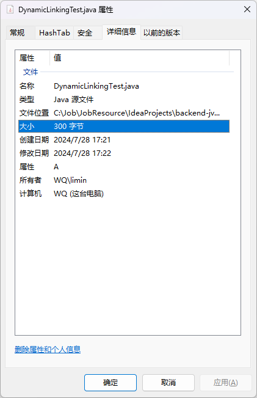


​	可以把常量池看作一张表，虚拟机指令根据这张常量表找到要执行的类名、方法名、参数类型、字面量等类型。

### 8.4.4 运行时常量池

​	运行时常量池(Runtime Constant Pool)是方法区的一部分。常量池表是class文件的一部分，用于存放编译期生成的各种字面量与符号引用，这部分内容将在类加载后存放到方法区的运行时常量池中。

​	虚拟机加载类或接口后，就会创建对应的运行时常量池。JVM为每个已加载的类型（类或接口）都维护一个常量池。池中的数据项像数组项一样，是通过索引访问的。

​	运行时常量池中包含多种不同的常量，包括编译期就已经明确的数值字面量，也包括到运行期解析后才能够获得的方法或者字段引用。此时不再是常量池中的符号地址了，这里换为真实地址。

​	运行时常量池相对于class文件常量池的另外一个重要特征是具备动态性，Java语言并不要求常量一定只有编译期才能产生，也就是说，并非预置入class文件中常量池的内容才能进入方法区运行时常量池，运行期间也可以将新的常量放入池中，这种特性被开发人员利用得比较多的便是String类的intern()方法。

​	当创建类或接口的运行时常量池时，如果构造运行时常量池所需的内存空间超过了方法区所能提供的最大值，则JVM会抛OOM异常。

## 8.5 方法区使用举例

​	上面我们讲了方法区比较经典的内部存储结构，包括类型信息、常量、静态变量、即时编译器编译后的代码缓存等。下面我们从代码的角度深度剖析方法区的使用过程。

<span style="color:#40E0D0;">案例1：</span>

- 代码

```java
public class MethodAreaDemo1 {
    public static void main(String[] args) {
        String x = "shangguigu";
        System.out.println(x);
    }
}
```

- 查看字节码内容

```java
$ javap -v MethodAreaDemo1.class
----------------------------------------
Classfile /C:/Job/JobResource/IdeaProjects/backend-jvm-learning/jvm-03-runtimedataarea/target/classes/com/coding/jvm03/methodarea/MethodAreaDemo1.class
  Last modified 2024-11-6; size 644 bytes
  MD5 checksum e8a11d20f917a84a4c2b364658116c55
  Compiled from "MethodAreaDemo1.java"eaProjects/backend-jvm-learning/jvm-03-runtimedataarea/target/classes/com/coding/jvm03/methodarea (master)
public class com.coding.jvm03.methodarea.MethodAreaDemo1
  minor version: 0
  major version: 52
  flags: ACC_PUBLIC, ACC_SUPER
Constant pool:
   #1 = Methodref          #6.#22         // java/lang/Object."<init>":()V
   #2 = String             #23            // shangguigu
   #3 = Fieldref           #24.#25        // java/lang/System.out:Ljava/io/PrintStream;
   #4 = Methodref          #26.#27        // java/io/PrintStream.println:(Ljava/lang/String;)V
   #5 = Class              #28            // com/coding/jvm03/methodarea/MethodAreaDemo1
   #6 = Class              #29            // java/lang/Object
   #7 = Utf8               <init>
   #8 = Utf8               ()V
   #9 = Utf8               Code
  #10 = Utf8               LineNumberTable
  #11 = Utf8               LocalVariableTable
  #12 = Utf8               this
  #13 = Utf8               Lcom/coding/jvm03/methodarea/MethodAreaDemo1;
  #14 = Utf8               main
  #15 = Utf8               ([Ljava/lang/String;)V
  #16 = Utf8               args
  #17 = Utf8               [Ljava/lang/String;
  #18 = Utf8               x
  #19 = Utf8               Ljava/lang/String;
  #20 = Utf8               SourceFile
  #21 = Utf8               MethodAreaDemo1.java
  #22 = NameAndType        #7:#8          // "<init>":()V
  #23 = Utf8               shangguigu
  #24 = Class              #30            // java/lang/System
  #25 = NameAndType        #31:#32        // out:Ljava/io/PrintStream;
  #26 = Class              #33            // java/io/PrintStream
  #27 = NameAndType        #34:#35        // println:(Ljava/lang/String;)V
  #28 = Utf8               com/coding/jvm03/methodarea/MethodAreaDemo1
  #29 = Utf8               java/lang/Object
  #30 = Utf8               java/lang/System
  #31 = Utf8               out
  #32 = Utf8               Ljava/io/PrintStream;
  #33 = Utf8               java/io/PrintStream
  #34 = Utf8               println
  #35 = Utf8               (Ljava/lang/String;)V
{
  public com.coding.jvm03.methodarea.MethodAreaDemo1();
    descriptor: ()V
    flags: ACC_PUBLIC
    Code:
      stack=1, locals=1, args_size=1
         0: aload_0
         1: invokespecial #1                  // Method java/lang/Object."<init>":()V
         4: return
      LineNumberTable:
        line 3: 0
      LocalVariableTable:
        Start  Length  Slot  Name   Signature
            0       5     0  this   Lcom/coding/jvm03/methodarea/MethodAreaDemo1;

  public static void main(java.lang.String[]);
    descriptor: ([Ljava/lang/String;)V
    flags: ACC_PUBLIC, ACC_STATIC
    Code:
      stack=2, locals=2, args_size=1
         0: ldc           #2                  // String shangguigu
         2: astore_1
         3: getstatic     #3                  // Field java/lang/System.out:Ljava/io/PrintStream;
         6: aload_1
         7: invokevirtual #4                  // Method java/io/PrintStream.println:(Ljava/lang/String;)V
        10: return
      LineNumberTable:
        line 5: 0
        line 6: 3
        line 7: 10
      LocalVariableTable:
        Start  Length  Slot  Name   Signature
            0      11     0  args   [Ljava/lang/String;
            3       8     1     x   Ljava/lang/String;
}
SourceFile: "MethodAreaDemo1.java"
```

​	class文件反编译之后方法区中main()方法的信息如下，根据反编译的结果我们可以看到局部变量表大小是2，这是在编译期已经确定好的，程序中有2个变量，分别是args和x，所以局部变量表的大小是2。还可以看到操作数栈的深度是2，剩下的就是字节码指令了。

​	我们主要查看方法区中字节码指令如何与程序计数器以及虚拟机栈之间协同合作。<span style="color:#9400D3;">字节码指令前面的序号表示程序计数器中指令编号，字节码指令表示当前指令的具体操作</span>。接下来我们针对执行过程画图讲解，具体流程如下。

1. 首先执行“ldc #2”指令，指令序号为0，程序计数器指令编号是0，该指令表示的含义是把常量池中编号为2的符号引用放入操作数栈，常量池中编号为2的符号引用又指向了编号为23的符号引用，继续查找常量池便可看到23号符号引用是“shangguigu”，所以我们把“shangguigu”放入操作数栈。

<div style="text-align:center;font-weight:bold;">方法区中字节码指令与程序计数器和虚拟机栈的协作关系(1)</div>


2. 接下来执行“astore_1”指令，指令序号为2，程序计数器指令编号是2，该指令表示的含义是把操作数栈顶中的元素放入局部变量表中序号为1的位置。

<div style="text-align:center;font-weight:bold;">方法区中字节码指令与程序计数器和虚拟机栈的协作关系(2)</div>

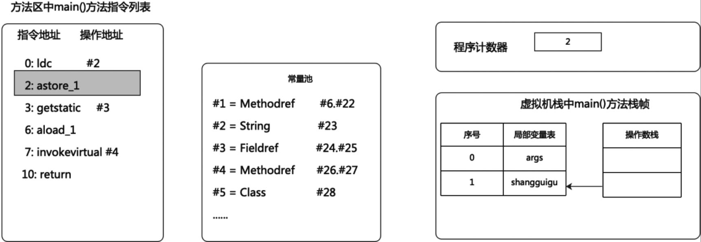

3. “getstatic #3”指令的序号为3，程序计数器指令编号是3，该指令表示的含义是将常量池中编号为#24、#25的符号引用放入操作数栈，24号和25号的符号引用又指向30号、31号和32号，分别对应java/lang/System、out和Ljava/io/PrintStream，也就是说把System类中的静态常量out放入操作数栈。

<div style="text-align:center;font-weight:bold;">方法区中字节码指令与程序计数器和虚拟机栈的协作关系(3)</div>

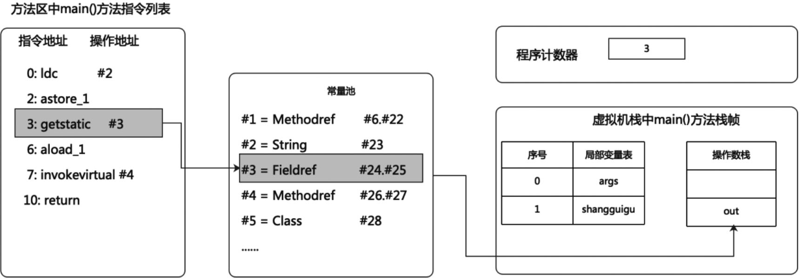

4. “aload_1”指令的序号为6，程序计数器指令编号是6，该指令表示的含义是把局部变量表中序号为1的数据放入操作数栈

<div style="text-align:center;font-weight:bold;">方法区中字节码指令与程序计数器和虚拟机栈的协作关系(4)</div>

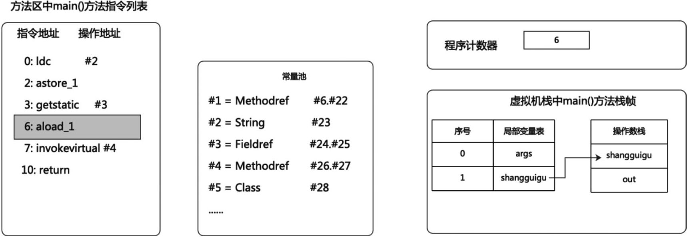

5. “invokevirtual #4”指令的序号为7，程序计数器指令编号为7，该指令调用常量池中编号为4指向的方法引用，查看常量池内容可知该方法是PrintStream.println()，将操作数栈中的两个元素弹出，作为println()方法的参数传入println()方法的操作数栈中

<div style="text-align:center;font-weight:bold;">方法区中字节码指令与程序计数器和虚拟机栈的协作关系(5)</div>

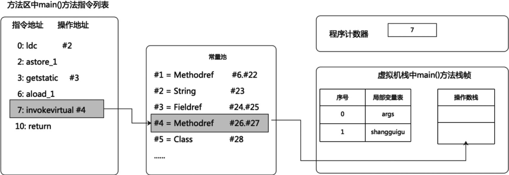

6. 最后调用return指令，该指令的含义是main()方法调用结束返回void。

<div style="text-align:center;font-weight:bold;">方法区中字节码指令与程序计数器和虚拟机栈的协作关系(6)</div>

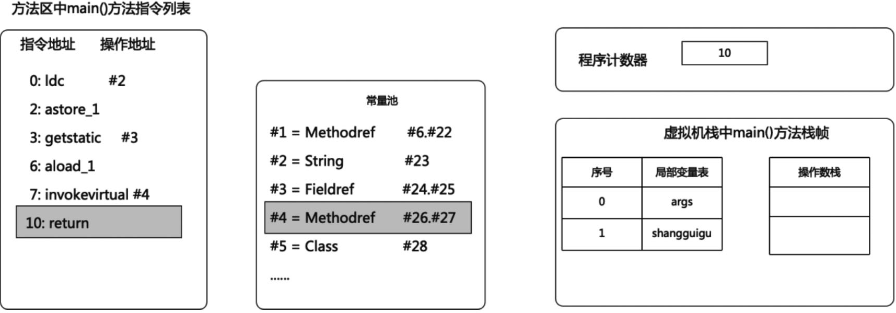

​	我们通过简单的案例说明方法区中字节码指令与常量池、程序计数器以及虚拟机栈之间的协作关系流程图。随着字节码指令的执行，程序计数器中存储的指令会发生变化；虚拟机栈中的操作数栈和局部变量表也会根据字节码指令而发生变化，这就是内存区域之间的协作关系。

## 8.6 方法区的演进细节

### 8.6.1 HotSpot虚拟机中方法区的变化

​	以JDK 7为例，前面讲过只有HotSpot虚拟机才有永久代的概念。对于BEAJRockit、IBM J9等虚拟机来说，是不存在永久代的概念的。原则上如何实现方法区属于虚拟机实现的细节，不受Java虚拟机规范管束，并不要求统一。

<div style="text-align:center;font-weight:bold;">HotSpot虚拟机中方法区的变化</div>

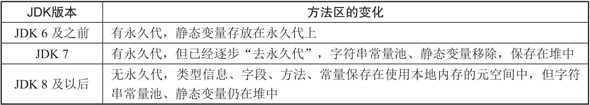

<div style="text-align:center;font-weight:bold;">JDK 6的方法区</div>

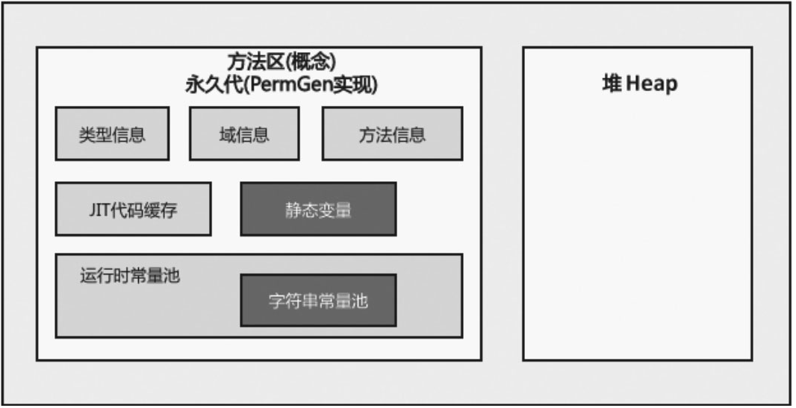

​	JDK 7中方法区的内容如下图所示。可以发现相对JDK 6来说，字符串常量池(StringTable)位置发生了变化。为什么要对字符串常量池的位置进行调整呢？因为永久代的回收效率很低，在Full GC的时候才会触发，而Full GC是老年代的空间不足、永久代不足时才会触发。这就导致字符串常量池回收效率不高。我们程序中一定会有大量的字符串被创建，而很多字符串往往不需要永久保存，那么回收效率低的话，就会导致永久代内存严重不足。如果将字符串放到堆里，内存就能及时回收利用。

<div style="text-align:center;font-weight:bold;">JDK7的方法区</div>

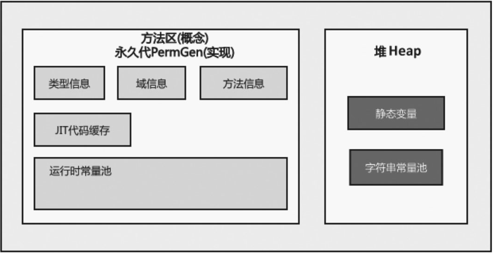

[字符串常量池调整的官方声明](https://www.oracle.com/java/technologies/javase/jdk7-relnotes.html#jdk7changes)

<div style="text-align:center;font-weight:bold;">字符串常量池调整的官方解释</div>

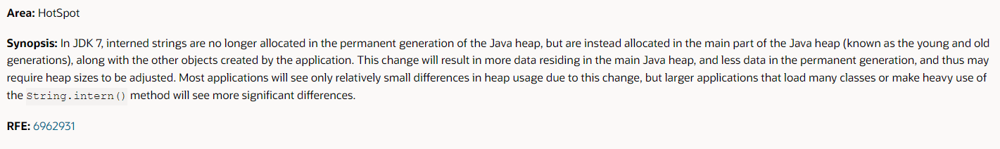

​	声明大致意思为：在JDK 7中，字符串常量不再在Java堆的永久代中分配，而是和应用程序创建的其他对象一样，在Java堆的主要部分（称为新生代和老年代）中分配。这一更改将导致更多数据驻留在主Java堆中，而在永久代中数据更少，因此可能需要调整堆大小。由于这一更改，大多数应用程序在堆使用方面只会看到相对较小的差异，但加载更多的类或大量使用String.intern()方法的大型应用程序将看到更显著的差异。

​	JDK 8中方法区的内容如下图所示，这个时候方法区的实现元空间不再占用JVM内存，而是把元空间放到了本地内存。

<div style="text-align:center;font-weight:bold;">　JDK 8方法区的演变图</div>

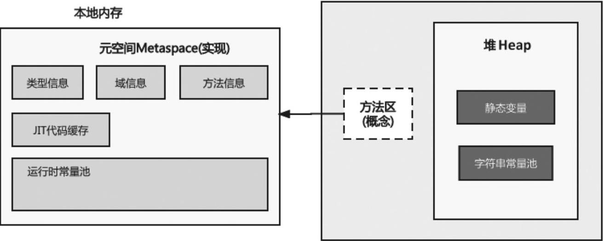

### 8.6.2 永久代为什么被元空间替换

​	官方解释元空间替换永久代的原因：元空间替换永久代这部分内容是JRockit虚拟机和HotSpot虚拟机融合的一部分，我们知道JRockit不需要配置永久代，HotSpot虚拟机也在慢慢地去永久代。

​	JDK 7之前的版本中，HotSpot虚拟机将类型信息、内部字符串和类静态变量存储在永久代中，垃圾收集器也会对该区域进行垃圾回收。JDK 7将HotSpot虚拟机中永久代内部字符串和类静态变量数据移动到Java堆中，但是依然存在永久代。

​	随着Java 8的到来，HotSpot虚拟机中再也见不到永久代了。但是这并不意味着类的元数据信息也消失了。这些数据被移到了一个与堆不相连的本地内存区域，这个区域叫作元空间，元数据信息内存的分配将受本机可用内存量的限制，而不是由“-XX:MaxPermSize”的值固定。由于类的元数据分配在本地内存中，元空间的最大可分配空间就是系统可用内存空间。这项改动是很有必要的，原因有以下两点。

- 为永久代设置空间大小是很难确定的。

​	在某些场景下，如果动态加载类过多，容易产生永久代的OOM。比如某个集成了很多框架的Web工程中，因为功能繁多，在运行过程中要不断动态加载很多类，可能出现如下致命错误。

<div style="text-align:center;font-weight:bold;">JDK6中出现的方法区内存溢出异常</div>


​	而元空间和永久代之间最大的区别在于：元空间并不在虚拟机中，而是使用本地内存。因此，默认情况下，元空间的大小仅受本地内存限制。

- 将元数据从永久代剥离出来放到元空间中，不仅实现了对元数据的无缝管理，而且因为元空间大小仅受本地内存限制，也简化了Full GC，并且可以在GC不暂停的情况下并发地释放元数据。

### 8.6.3 静态变量存放的位置

​	JDK 7及以后的版本中静态变量存放位置的改变，从方法区存储改为堆内存存储，是我们学习JVM过程中的一个结论，下面我们用代码去验证上面的结论。

<span style="color:#40E0D0;">案例1：</span>

- 代码示例

```java
/**
 * 结论：静态引用对应的对象实体始终都存在堆空间
 * <p>
 * jdk7:
 * -Xms200m -Xmx200m -XX:PermSize=300m -XX:MaxPermSize=300m -XX:+PrintGCDetails
 * <p>
 * jdk8:
 * -Xms200m -Xmx200m -XX:MetaspaceSize=300m -XX:MaxMetaspaceSize=300m -XX:+PrintGCDetails
 */
public class StaticFieldTest {
    private static byte[] arr = new byte[1024 * 1024 * 100]; // 100MB

    public static void main(String[] args) {
        System.out.println(StaticFieldTest.arr);
    }
}
```

​	在JDK 7中创建100M字节数组存放到老年代。

<div style="text-align:center;font-weight:bold;">JDK 7中字节数组存放的位置</div>

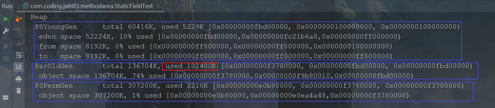

​	在JDK 8中创建100M字节数组存放到老年代。

<div style="text-align:center;font-weight:bold;">JDK8中字节数组存放的位置</div>

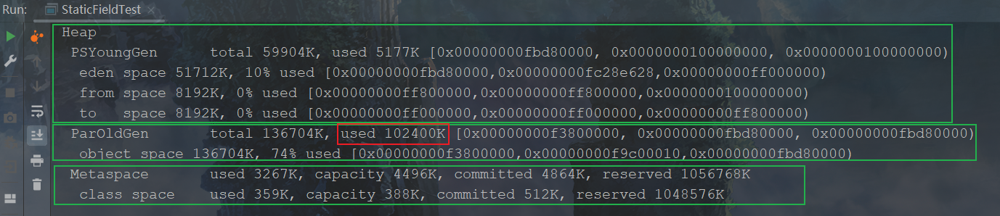

​	静态引用对应的对象实体始终都存放在堆空间，所以JDK 7和JDK 8中创建的字数组都是存放在堆空间，<span style="color:red;font-weight:bold;">JDK 7及之后的版本创建对象的引用名（即定义的arr）也存放在堆空间中</span>。

​	JDK 7及其以后版本的HotSpot虚拟机选择把静态变量与类型在Java语言一端的映射Class对象存放在一起，存储于Java堆之中，从我们的试验中也明确验证了这一点。

## 8.7 方法区的垃圾回收

​	有些人认为方法区是没有垃圾收集行为的，其实不然。一般来说这个区域的回收效果比较难令人满意，尤其是类的卸载，条件相当苛刻。但是这部分区域的回收又确实是必要的。以前Sun公司的Bug列表中，曾出现过的若干个严重的Bug就是由于低版本的HotSpot虚拟机对此区域未完全回收而导致内存泄漏。

​	方法区的垃圾收集主要回收两部分内容：常量池中废弃的常量和不再使用的类型信息。

​	先来说说方法区内常量池之中主要存放的两大类常量：字面量和符号引用。字面量比较接近Java语言层次的常量概念，如文本字符串、被声明为final的常量值等。而符号引用则属于编译原理方面的概念，包括下面三类常量。

- 类和接口的全限定名。

- 字段的名称和描述符。

- 方法的名称和描述符。

​	HotSpot虚拟机对常量池的回收策略是很明确的，只要常量池中的常量没有被任何地方引用，就可以被回收。回收废弃常量与回收Java堆中的对象非常类似。判定一个常量是否“废弃”还是相对简单的，而要判定一个类型是否属于“不再被使用的类”的条件就比较苛刻了。需要同时满足下面三个条件。

- 该类所有的实例都已经被回收，也就是Java堆中不存在该类及其任何派生子类的实例。
- 加载该类的类加载器已经被回收，这个条件除非是经过精心设计的可替换类加载器的场景，如OSGi、JSP的重加载等，否则通常是很难达成的。
- 该类对应的java.lang.Class对象没有在任何地方被引用，无法在任何地方通过反射访问该类的方法。

​	JVM被允许对满足上述三个条件的无用类进行回收，这里说的仅仅是“被允许”，而并不是和对象一样，没有引用了就必然会回收。关于是否要对类型进行回收，HotSpot虚拟机提供了-Xnoclassgc参数进行控制，还可以使用“-verbose:class”“-XX:+TraceClassLoading”以及“-XX:+TraceClassUnLoading”查看类加载和卸载信息。

​	在大量使用反射、动态代理、CGLib等字节码框架，动态生成JSP以及OSGi这类频繁自定义类加载器的场景中，通常都需要JVM具备类型卸载的能力，以保证不会对方法区造成过大的内存压力。


# 第9章 对象的实例化内存布局与访问定位

​	前面几章我们已经对运行时数据区各个区域有了一个比较细致的了解，平时大家经常使用new关键字来创建对象，那么我们创建对象的时候，怎么去和运行时数据区关联起来呢？本章将会带着这样的问题来重点讲解对象实例化的过程和方式，包括对象在内存中是怎样布局的，以及对象的访问定位方式，带领大家更加深入地学习对象的实例化布局。

## 9.1 对象的实例化

<div style="text-align:center;font-weight:bold;">对象的实例化</div>

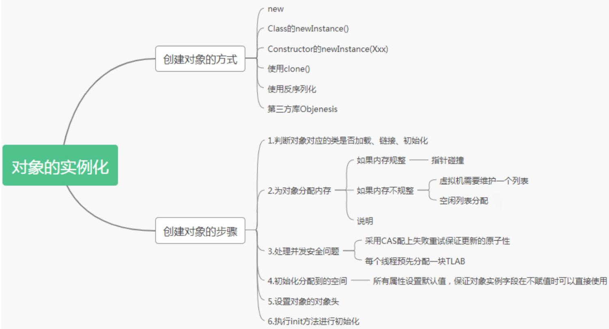

### 9.1.1 创建对象的方式

​	创建对象的方式有多种，例如使用new关键字、Class的newInstance()方法、Constructor类的newInstance()方法、clone()方法、反序列化、第三方库Objenesis等。

​	每种创建对象方式的实际操作如下。

1. 使用new关键字——调用无参或有参构造器创建。
2. 使用Class的newInstance()方法——调用无参构造器创建，且需要是public的构造器。
3. 使用Constructor类的newInstance()方法——调用无参或有参、不同权限修饰构造器创建，实用性更广。
4. 使用clone()方法——不调用任何参构造器，且对象需要实现Cloneable接口并实现其定义的clone()方法，且默认为浅复制。
5. 使用反序列化——从指定的文件或网络中，获取二进制流，反序列化为内存中的对象。
6. 第三方库Objenesis——利用了asm字节码技术，动态生成Constructor对象。

​	Java是面向对象的静态强类型语言，声明并创建对象的代码很常见，根据某个类声明一个引用变量指向被创建的对象，并使用此引用变量操作该对象。在实例化对象的过程中，JVM中发生了什么变化呢？

<span style="color:#40E0D0;">案例1：创建对象的字节码命令</span>

- 代码

```java
public class NewObj {
    public static void main(String[] args) {
        Object obj = new Object();
    }
}
```

- 字节码

```java
$ javap -v -p NewObj.class
```

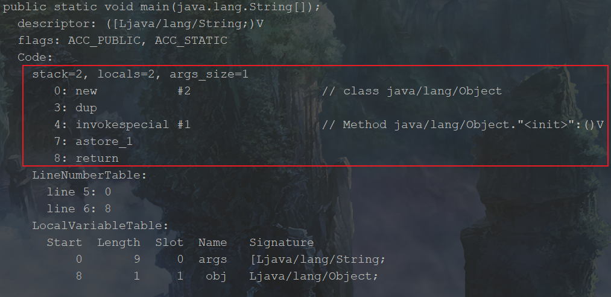

​	各个指令的含义如下。

new：首先检查该类是否被加载。如果没有加载，则进行类的加载过程；如果已经加载，则在堆中分配内存。对象所需的内存的大小在类加载完成后便可以完全确定，为对象分配空间的任务等同于把一块确定大小的内存从Java堆中划分出来。这个指令完毕后，将指向实例对象的引用变量压入虚拟机栈栈顶。

dup：在栈顶复制该引用变量，这时的栈顶有两个指向堆内实例对象的引用变量。

invokespecial：调用对象实例方法，通过栈顶的引用变量调用<init>方法。<init>是对象初始化时执行的方法，而<clinit>是类初始化时执行的方法。

astore_1: 存入局部变量表的位置1处。

​	从上面的四个步骤中可以看出，需要从栈顶弹出两个实例对象的引用。这就是为什么会在new指令下面有一个dup指令。其实对于每一个new指令来说，一般编译器都会在其下面生成一个dup指令，这是因为实例的初始化方法（<init>方法）肯定需要用到一次，然后第二个留给业务程序使用，例如给变量赋值、抛出异常等。如果我们不用，那编译器也会生成dup指令，在初始化方法调用完成后再从栈顶pop出来。

### 9.1.2 创建对象的步骤

​	前面所述是从字节码角度看待对象的创建过程，现在从执行步骤的角度来分析。

​	创建对象的步骤如下。

**1 判断对象对应的类是否加载、链接、初始化**

​	虚拟机遇到一条new指令，首先去检查这个指令的参数能否在Metaspace的常量池中定位到一个类的符号引用，并且检查这个符号引用代表的类是否已经被加载、解析和初始化（即判断类元信息是否存在）。如果没有，那么在双亲委派模式下，使用当前类加载器以“ClassLoader+包名+类名”为Key查找对应的“.class”文件。如果没有找到文件，则抛出ClassNotFoundException异常。如果找到，则进行类加载，并生成对应的Class类对象。

**2 为对象分配内存**

​	首先计算对象占用空间大小，接着在堆中划分一块内存给新对象。如果实例成员变量是引用变量，仅分配引用变量空间即可，即4字节大小。

​	如果内存规整，使用指针碰撞。

​	如果内存是规整的，那么虚拟机将采用指针碰撞法(Bump The Pointer)来为对象分配内存。意思是所有用过的内存在一边，空闲的内存在另外一边，中间放着一个指针作为分界点的指示器，分配内存就仅仅是把指针向空闲那边挪动一段与对象大小相等的距离罢了。一般使用带有compact（整理）过程的收集器时，使用指针碰撞，例如Serial Old、Parallel Old等垃圾收集器。

​	如果内存不规整，虚拟机需要维护一个列表，使用空闲列表(Free List)分配。

​	如果内存不是规整的，已使用的内存和未使用的内存相互交错，那么虚拟机将采用空闲列表法来为对象分配内存。意思是虚拟机维护了一个列表，记录哪些内存块是可用的，在分配的时候从列表中找到一块足够大的空间划分给对象实例，并更新列表上的内容。这种分配方式称为空闲列表。

​	选择哪种分配方式由Java堆是否规整决定，而Java堆是否规整又由所采用的垃圾收集器是否带有压缩整理功能决定。

**3 处理并发安全问题**

​	创建对象是非常频繁的操作，在分配内存空间时，另外一个问题是保证new对象的线程安全性。虚拟机采用了两种方式解决并发问题。

​	CAS(Compare And Swap)：是一种用于在多线程环境下实现同步功能的机制。CAS操作包含三个操作数，内存位置、预期数值和新值。CAS的实现逻辑是将内存位置处的数值与预期数值相比较，若相等，则将内存位置处的值替换为新值；若不相等，则不做任何操作。

​	TLAB：把内存分配的动作按照线程划分在不同的空间之中进行，即每个线程在Java堆中预先分配一小块内存。

**4 初始化分配到的空间**

​	内存分配结束，虚拟机将分配到的内存空间都初始化为零值（不包括对象头）。这一步保证了对象的实例字段在Java代码中可以不用赋初始值就可以直接使用，程序能访问到这些字段的数据类型所对应的零值。

**5 设置对象的对象头**

​	将对象的所属类（即类的元数据信息）、对象的HashCode、对象的GC信息、锁信息等数据存储在对象头中。这个过程的具体设置方式取决于JVM实现。

**6 执行init()方法进行初始化**

​	从Java程序的视角看来，初始化才正式开始。初始化成员变量，执行实例化代码块，调用类的构造方法，并把堆内对象的首地址赋值给引用变量。

​	因此一般来说（由字节码中是否跟随由invokespecial指令所决定），new指令之后接着就是执行方法，把对象按照程序员的意愿进行初始化，这样一个真正可用的对象才算完全创建出来。

## 9.2 对象的内存布局

<div style="text-align:center;font-weight:bold;">对象的内存布局</div>

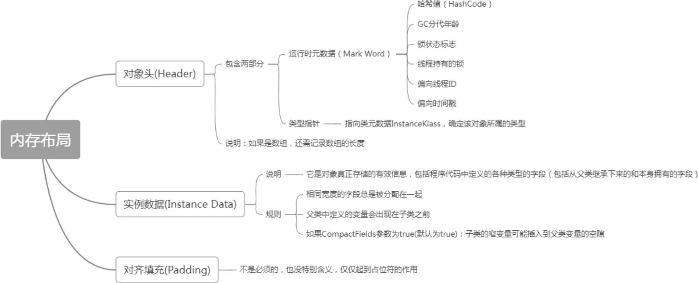

​	在HotSpot虚拟机中，对象在内存中的布局可以分成对象头(Header)、实例数据(Instance Data)、对齐填充(Padding)三部分。

**1 对象头**

​	主要包括对象自身的运行时元数据，比如哈希值、GC分代年龄、锁状态标志等，同时还包含一个类型指针，指向类元数据，表明该对象所属的类型。此外，如果对象是一个数组，对象头中还必须有一块用于记录数组的长度的数据。因为正常通过对象元数据就知道对象的确切大小。所以数组必须得知道长度。

**2 实例数据**

​	它是对象真正存储的有效信息，包括程序代码中定义的各种类型的字段（包括从父类继承下来的和本身拥有的字段）。

**3 对齐填充**

​	由于HotSpot虚拟机的自动内存管理系统要求对象起始地址必须是8字节的整数倍，换句话说就是任何对象的大小都必须是8字节的整数倍。对象头部分已经被精心设计成正好是8字节的倍数（1倍或者2倍），因此，如果对象实例数据部分没有对齐的话，就需要通过对齐填充来补全。它不是必要存在的，仅仅起着占位符的作用。

​	对象的内存布局示例如下图所示：

<div style="text-align:center;font-weight:bold;">对象的内存布局示例图</div>

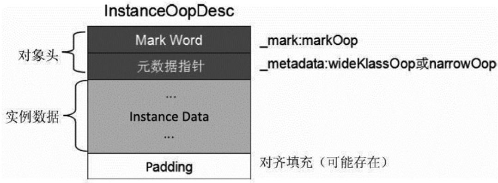

​	下面我们用代码来讲述实例在内存中的布局，如代码所示。

<span style="color:#40E0D0;">案例1：实例在内存中的布局</span>

- 代码

```java
public class Customer {
    int id = 1001;
    String name;
    Account acct;

    {
        name = "匿名客户";
    }

    public Customer() {
        acct = new Account();
    }
}

class Account {

}

/**
 * 对象的内存布局
 */
public class CustomerTest {
    public static void main(String[] args) {
        Customer cust = new Customer();
    }
}
```

​	把CustomerTest中main()方法看作是主线程，主线程虚拟机栈中放了main()方法的栈帧，其中栈帧里包含了局部变量表、操作数栈、动态链接、方法返回地址、附加信息等结构。

​	局部变量表对于main()方法来讲第一个位置放的是args，第二个位置放的是cust,cust指向堆空间中new Customer()实体。

​	Customer对象实体整体来看分为对象头、实例数据、对齐填充。

​	对象头中主要有运行时元数据和元数据指针，元数据指针也可称为类型指针，运行时元数据包含哈希值、GC分代年龄、锁状态标志等信息；类型指针指向当前对象所属类的信息，也就是方法区的Customer类的Klass类元信息，Klass类元信息包括对象的类型信息；

​	在实例数据中包含父类的实例数据，对于当前对象来讲它有id、name、acct三个变量，name的字符串常量放在堆空间的字符串常量池中，成员变量acct指向new Account()对象实例在堆中的内存地址，new Account()对象实例的对象头中也维护了一个类型指针指向方法区的Account的Klass类元信息。

​	整体布局如下图所示：

<div style="text-align:center;font-weight:bold;">实例中的内存布局图</div>

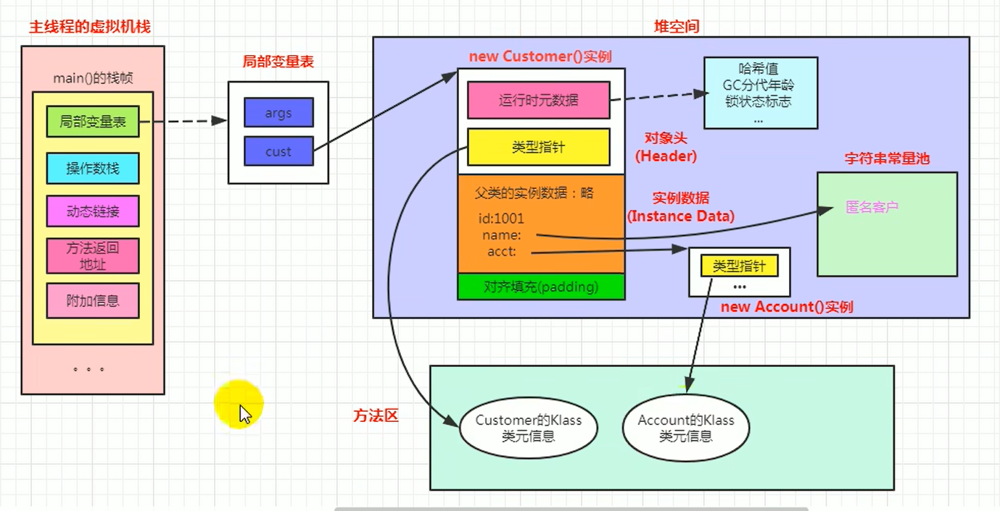

## 9.3 对象的访问定位

### 9.3.1 对象访问的定位方式

​	前面讲解了创建对象的方式以及对象的内存结构。创建好对象之后，接下来就是去访问对象，那么JVM是如何通过栈帧中的对象引用访问到其内部对象实例的呢？通常来讲，栈帧存储指向堆区中的对象地址，对象中含有该类对象的类型指针，也就是我们说的元数据指针，如果访问对象，只需要访问栈帧中的地址即可。

<div style="text-align:center;font-weight:bold;">对象的引用访问对象实例图</div>

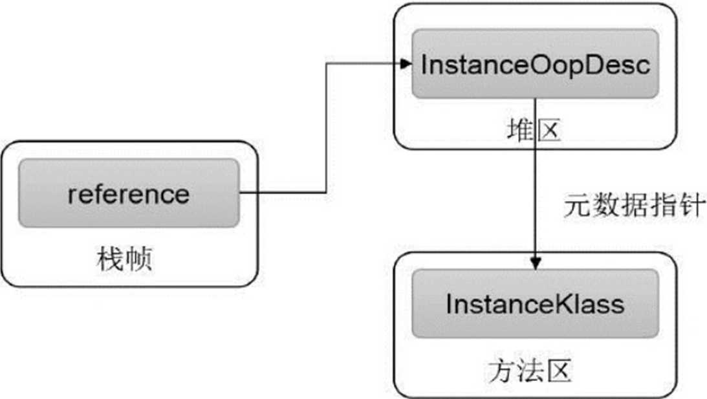

​	《Java虚拟机规范》没有对访问对象做具体的说明和要求，所以对象访问方式由虚拟机实现而定。主流有两种方式，分别是使用句柄访问和使用直接指针访问。

### 9.3.2 使用句柄访问

​	堆需要划分出一块内存来做句柄池，reference中存储对象的句柄池地址，句柄中包含对象实例与类型数据各自具体的地址信息。

<div style="text-align:center;font-weight:bold;">句柄访问</div>

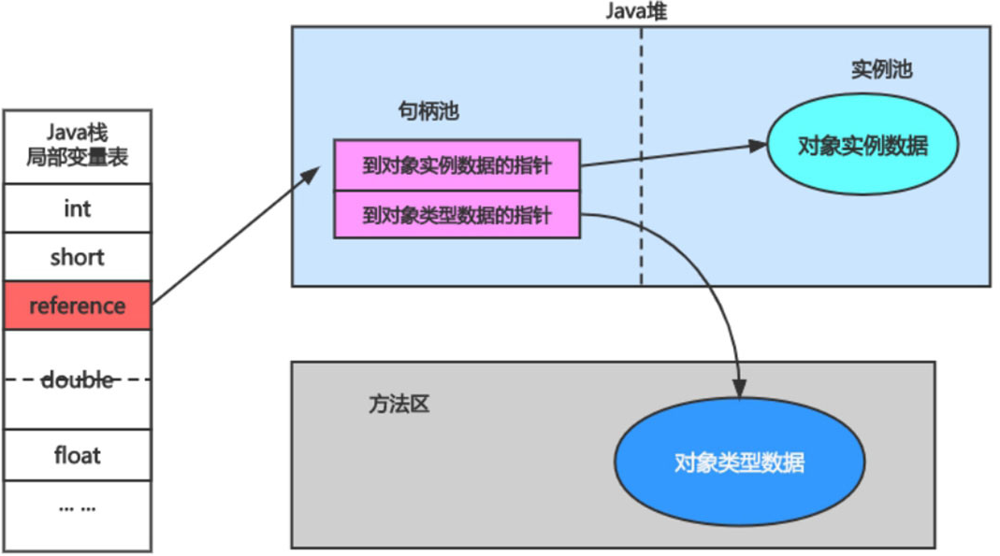

​	这样做的好处是reference中存储稳定句柄地址，对象被移动（垃圾收集时移动对象很普遍）时只会改变句柄中实例数据指针，reference本身不需要被修改。但是这样做会造成多开辟一块空间来存储句柄地址，相当于是间接访问对象。

### 9.3.3 使用指针访问

​	reference中存储的就是对象的地址，如果只是访问对象本身的话，就不需要多一次间接访问的开销。

​	这样做的好处是访问速度更快，Java中对象访问频繁，每次访问都节省了一次指针定位的时间开销。<span style="color:red;font-weight:bold;">HotSpot虚拟机主要使用直接指针访问的方式</span>。

<div style="text-align:center;font-weight:bold;">使用指针访问</div>

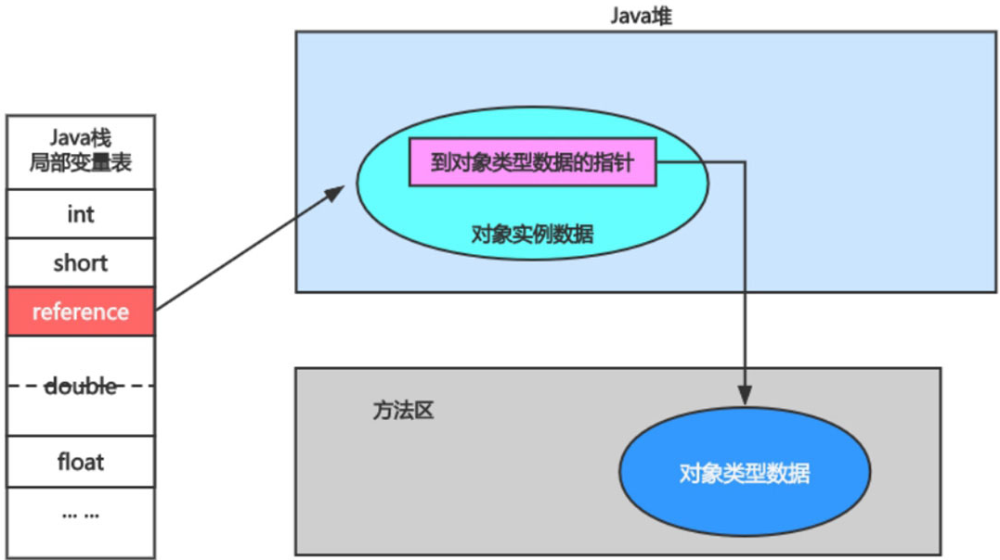

​	JVM可以通过对象引用准确定位到Java堆区中的对象，这样便可成功访问到对象的实例数据。JVM通过存储在对象中的元数据指针定位到存储在方法区中的对象的类型信息，即可访问目标对象的具体类型。

# 第10章 直接内存

​	Java中的内存从广义上可以划分为两个部分，一部分是我们之前章节讲解过的受JVM管理的堆内存，<span style="color:#9400D3;">另一部分则是不受JVM管理的堆外内存，也称为直接内存</span>。直接内存由操作系统来管理，这部分内存的应用可以减少垃圾收集对应用程序的影响。

## 10.1 直接内存概述

​	直接内存不是虚拟机运行时数据区的一部分，也不是Java虚拟机规范中定义的内存区域。直接内存是在Java堆外的、直接向操作系统申请的内存区间。直接内存来源于NIO(Non-Blocking IO)，可以通过ByteBuffer类操作。ByteBuffer类调用allocateDirect()方法可以申请直接内存，方法内部创建了一个DirectByteBuffer对象，DirectByteBuffer对象存储直接内存的起始地址和大小，据此就可以操作直接内存。直接内存和堆内存之间的关系如图所示。

<div style="text-align:center;font-weight:bold;">堆内存和直接内存的关系</div>

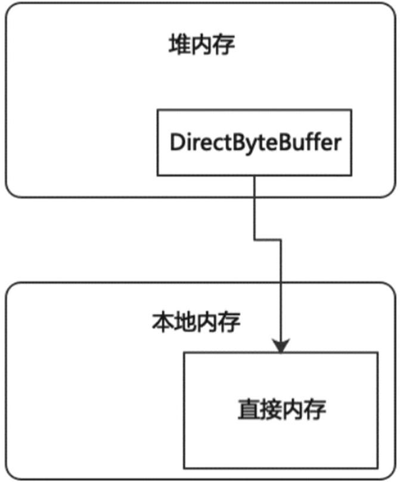

<span style="color:#40E0D0;">案例1：查看直接内存的占用和释放</span>

- 代码

```java
/**
 * 查看直接内存的占用与释放
 */
public class BufferTest {
    private static final int BUFFER = 1024 * 1024 * 1024; // 1GB

    public static void main(String[] args) {
        ByteBuffer byteBuffer = ByteBuffer.allocateDirect(BUFFER);
        System.out.println("直接内存分配完毕，请求指示！");

        Scanner scanner = new Scanner(System.in);
        scanner.next();

        System.out.println("直接内存开始释放！");
        byteBuffer = null;
        System.gc(); // 可以被gc
        scanner.next();
    }
}
```

​	直接分配后的本地内存空间如下图所示，可以看到内存为1063332KB，换算过来大约是1GB。

<div style="text-align:center;font-weight:bold;">本地内存空间</div>

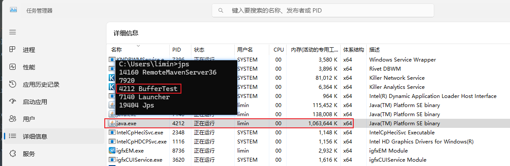	

​	释放内存后的本地内存空间如下图所示，内存释放后的空间为17424KB，几乎释放了1GB的内存。

<div style="text-align:center;font-weight:bold;">释放内存后的本地内存空间</div>

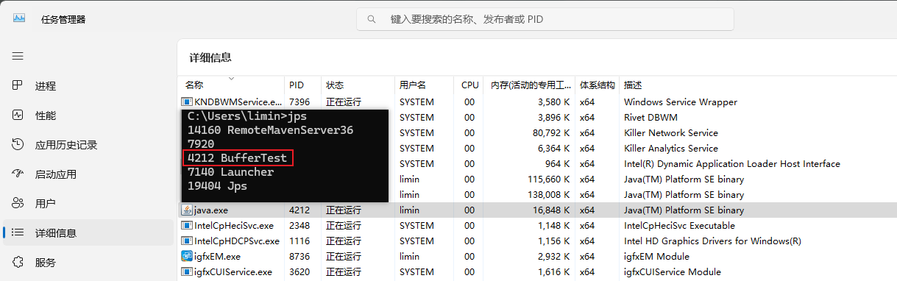

​	通常，访问直接内存的速度会优于Java堆，读写性能更高。因此出于性能考虑，读写频繁的场合可能会考虑使用直接内存。Java的NIO库允许Java程序使用直接内存，用于数据缓冲区。

​	通过前面的案例我们可以把Java进程占用的内存理解为两部分，分别是JVM内存和直接内存。前面我们讲解方法区的时候，不同版本JDK中方法区的实现是不一样的，<span style="color:#9400D3;">JDK 7使用永久代实现方法区，永久代中的数据还是使用JVM内存存储数据。JDK 8使用元空间实现方法区，元空间中的数据放在了本地内存当中，直接内存和元空间一样都属于堆外内存</span>。

<div style="text-align:center;font-weight:bold;">JDK 7和JDK 8内存结构的对比图</div>

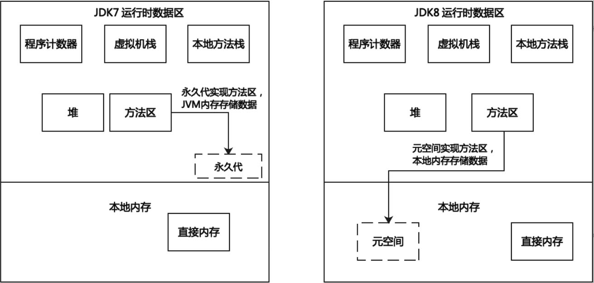

## 10.2 直接内存的优势

​	文件读写必然涉及磁盘的读写，但是Java本身不具备磁盘读写的能力，因此借助操作系统提供的方法，在Java中表现出来的形式就是Java中的本地方法接口调用本地方法库。普通IO读取一份物理磁盘的文件到内存中，需要下面两步。

1. 把磁盘文件中的数据读取到系统内存中。
2. 把系统内存中的数据读取到JVM堆内存中。

​	为了使得数据可以在系统内存和JVM堆内存之间相互复制，需要在系统内存和JVM堆内存都复制一份磁盘文件。这样做不仅浪费空间，而且传输效率低下。

<div style="text-align:center;font-weight:bold;">非直接缓冲区</div>

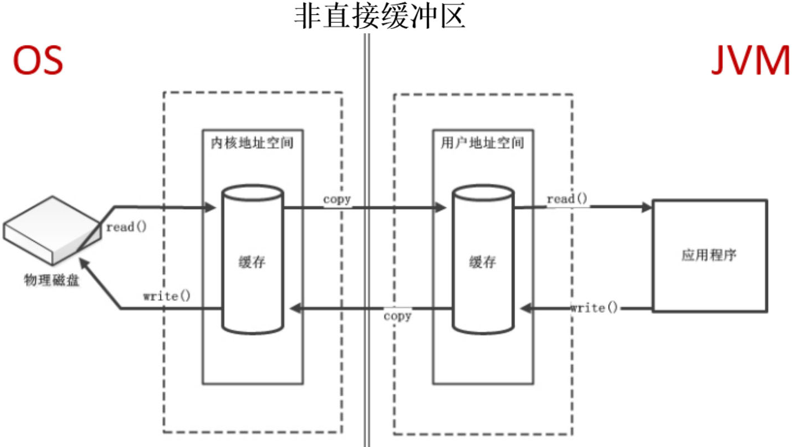

​	当使用NIO时，如下图所示。操作系统划出一块直接缓冲区可以被Java代码直接访问。这样当读取文件的时候步骤如下。

1. 物理磁盘读取文件到直接内存。
2. JVM通过NIO库直接访问数据。

<div style="text-align:center;font-weight:bold;">直接缓冲区</div>

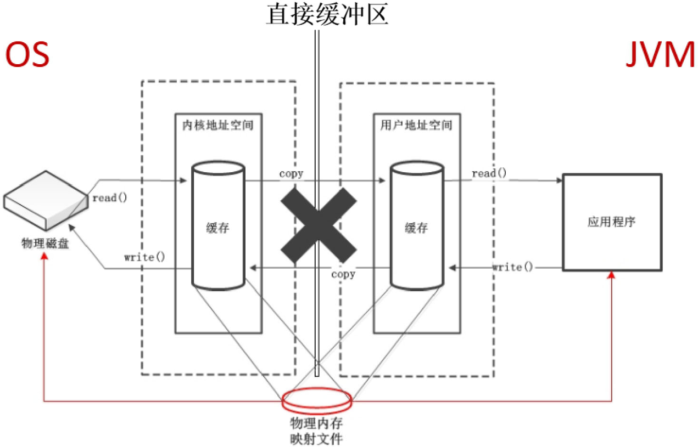

​	下面通过一个案例来对普通IO和NIO性能做比较。

<span style="color:#40E0D0;">案例1：IO和NIO的性能比较</span>

- 代码

```java
package com.coding.jvm03.methodarea.directmemory;

import java.io.FileInputStream;
import java.io.FileOutputStream;
import java.io.IOException;
import java.nio.ByteBuffer;
import java.nio.channels.FileChannel;

public class BufferTest1 {
    private static final int _100Mb = 1024 * 1024 * 100; // 100MB

    public static void main(String[] args) {
        long sum = 0;
        String src = "D:\\test\\毒液最后yi舞_HD英语中字.mp4";
        for (int i = 0; i < 3; i++) {
            String dest = "D:\\test\\毒液最后yi舞_HD英语中字" + i + ".mp4";
//            sum += io(src, dest);
            sum += directBuffer(src, dest);
        }
        System.out.println("总花费的时间为：" + sum);
    }

    private static long io(String src, String dest) {
        long start = System.currentTimeMillis();
        try (FileInputStream fis = new FileInputStream(src);
             FileOutputStream fos = new FileOutputStream(dest);) {
            // 定义缓冲区 allocate分配大小
            byte[] buffer = new byte[_100Mb];
            while (true) {
                int len = fis.read(buffer);
                if (len == -1) {
                    break;
                }
                fos.write(buffer, 0, len);
            }
        } catch (IOException e) {
            e.printStackTrace();
        }
        long end = System.currentTimeMillis();
        return end - start;
    }

    private static long directBuffer(String src, String dest) {
        long start = System.currentTimeMillis();
        try (FileInputStream fis = new FileInputStream(src); FileChannel inChannel = fis.getChannel();
             FileOutputStream fos = new FileOutputStream(dest); FileChannel outChannel = fos.getChannel()) {
            // 定义缓冲区 allocate分配大小
            ByteBuffer byteBuffer = ByteBuffer.allocateDirect(_100Mb);
            while (inChannel.read(byteBuffer) != -1) {
                byteBuffer.flip(); // 修改为读数据模式
                outChannel.write(byteBuffer);
                byteBuffer.clear(); // 清空，切换为谢模式
            }
        } catch (IOException e) {
            e.printStackTrace();
        }
        long end = System.currentTimeMillis();
        return end - start;
    }
}
```

​	上述代码中复制三次1.37GB的影片文件，使用IO复制文件所耗费的时间为10330ms，使用NIO复制文件所耗费的时间为6469ms，相对来说有了性能的提升，如果适当增大直接内存或者增多复制的次数，效果会更明显。

## 10.3 直接内存溢出

​	直接内存也可能导致OutOfMemoryError异常。由于直接内存在Java堆外，因此它的大小不会直接受限于“-Xmx”指定的最大堆大小，但是系统内存也是有限的，Java堆和直接内存的总和依然受限于操作系统能给出的最大内存。接下来通过一个案例演示直接内存的内存溢出现象。

<span style="color:#40E0D0;">案例1：直接内存的内存溢出</span>

- 代码

```java
/**
 * 本地内存的OOM：Exception in thread "main" java.lang.OutOfMemoryError: Direct buffer memory
 */
public class BufferTest2 {
    private static final int BUFFER = 1024 * 1024 * 20; // 20MB

    public static void main(String[] args) {
        ArrayList<ByteBuffer> list = new ArrayList<ByteBuffer>();
        int count = 0;
        try {
            while (true) {
                ByteBuffer byteBuffer = ByteBuffer.allocateDirect(BUFFER);
                list.add(byteBuffer);
                count++;
                try {
                    Thread.sleep(100);
                } catch (InterruptedException e) {
                    e.printStackTrace();
                }
            }
        } finally {
            System.out.println("count = " + count);
        }
    }
}    
```

<div style="text-align:center;font-weight:bold;">内存溢出异常</div>

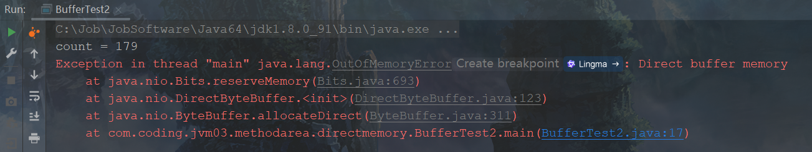

​	直接内存由于不受JVM的内存管理，所以需要开发人员自己来管理，以防内存溢出，通常有两种方式。

1. 当ByteBuffer对象不再使用的时候置为null，调用System.gc()方法告诉JVM可以回收ByteBuffer对象，最终系统调用freemermory()方法释放内存。System.gc()会引起一次Full GC，通常比较耗时，影响程序执行。
2. 调用Unsafe类中的freemermory()方法释放内存。

​	<span style="color:#9400D3;">可以通过参数-XX:MaxDirectMemorySize来指定直接内存的最大值。若不设置-XX:MaxDirectMemorySize参数，其默认值与“-Xmx”参数配置的堆内存的最大值一致</span>。

​	特殊说明：

1. 如果使用Java自带的 ByteBuffer.allocateDirect(size) 或者直接 new DirectByteBuffer(capacity) , 这样受-XX:MaxDirectMemorySize 这个JVM参数的限制. 其实底层都是用的Unsafe#allocateMemory,区别是对大小做了限制. 如果超出限制直接OOM。
2. <span style="color:red;font-weight:bold;">如果通过反射的方式拿到Unsafe的实例,然后用Unsafe的allocateMemory方法分配堆外内存. 确实不受-XX:MaxDirectMemorySize这个JVM参数的限制 . 所以限制的内存大小为操作系统的内存</span>。

## 10.4 申请直接内存源码分析

​	ByteBuffer类调用allocateDirect()方法申请直接内存，底层调用的是DirectByteBuffer类的构造方法，源码如下所示。

- 代码

```java
    public static ByteBuffer allocateDirect(int capacity) {
        return new DirectByteBuffer(capacity);
    }
```

​	进入到DirectByteBuffer类的构造方法，如下代码所示，该类访问权限是默认级别的，只能被同一个包下的类访问，所以开发人员无法直接调用，所以需要通过ByteBuffer类调用。构造方法中申请内存的核心代码就是Unsafe类中的allocateMemory(size)方法，该方法是一个native方法，不再深究。

- 代码

```java
    // Primary constructor
    //
    DirectByteBuffer(int cap) {                   // package-private

        super(-1, 0, cap, cap);
        boolean pa = VM.isDirectMemoryPageAligned();
        int ps = Bits.pageSize();
        long size = Math.max(1L, (long)cap + (pa ? ps : 0));
        Bits.reserveMemory(size, cap);

        long base = 0;
        try {
            base = unsafe.allocateMemory(size);
        } catch (OutOfMemoryError x) {
            Bits.unreserveMemory(size, cap);
            throw x;
        }
        unsafe.setMemory(base, size, (byte) 0);
        if (pa && (base % ps != 0)) {
            // Round up to page boundary
            address = base + ps - (base & (ps - 1));
        } else {
            address = base;
        }
        cleaner = Cleaner.create(this, new Deallocator(base, size, cap));
        att = null;


    }
```

​	Unsafe类无法直接被开发工程师使用，因为其构造方法是私有的，但是我们可以通过反射机制获取Unsafe对象，进而申请直接内存，如代码所示。

<span style="color:#40E0D0;">案例1：申请直接内存</span>

- 代码

```java
/**
 * 通过反射方式拿到的Unsafe实例，该参数对反射方式是无效的
 * -Xmx20m -XX:MaxDirectMemorySize=10m
 */
public class MaxDirectMemorySizeTest {
    private static final int _1MB = 1024 * 1024; // 1MB

    public static void main(String[] args) throws IllegalAccessException {
        Field unsafeField = Unsafe.class.getDeclaredFields()[0];
        unsafeField.setAccessible(true);
        Unsafe unsafe = (Unsafe) unsafeField.get(null);
        while (true) {
            // 申请直接内存
            unsafe.allocateMemory(_1MB);
        }
    }

}
```


# 第11章 执行引擎

​	到目前为止，我们已经讲完了JVM的运行时数据区，我们知道Java源文件经过编译之后生成class文件，class文件加载到内存中，此时物理机器并不能直接执行代码，因为它没办法识别class文件中的内容，此时就需要执行引擎(ExecutionEngine)来做相应的处理。

## 11.1 概述

​	执行引擎是JVM核心的组成部分之一。可以把JVM架构分成三部分，如下图所示，执行引擎位于JVM的最下层（图中虚线框部分），可以粗略地看到执行引擎负责和运行时数据区交互。

<div style="text-align:center;font-weight:bold;">执行引擎在JVM中的位置</div>


## 11.2 计算机语言的发展史

​	在讲解执行引擎之前，需要知道什么是机器码、汇编语言、高级语言以及为什么会有Java字节码的出现。

### 11.2.1 机器码

​	各种用0和1组成的二进制编码方式表示的指令，叫作机器指令码，简称机器码。计算机发展的初始阶段，人们就用机器码编写程序，我们也称为机器语言。机器语言虽然能够被计算机理解和接受，但和人类的语言差别太大，不易被人们理解和记忆，并且用它编程容易出差错。使用机器码编写的程序一经输入计算机，CPU可以直接读取运行，因此和其他语言编的程序相比，执行速度最快。机器码与CPU紧密相关，所以不同种类的CPU所对应的机器码也就不同。

### 11.2.2 汇编语言

​	由于机器码是由0和1组成的二进制序列，可读性实在太差，于是人们发明了指令。指令就是把机器码中特定的0和1序列，简化成对应的指令（一般为英文简写，如mov、inc等），可读性稍好，这就是我们常说的汇编语言。在汇编语言中，用助记符(Mnemonics)代替机器码的操作码，用地址符号(Symbol)或标号(Label)代替指令或操作数的地址。

​	不同的硬件平台，各自支持的指令是有差别的。因此每个平台所支持的指令，称为对应平台的指令集，如常见的x86指令集对应的是x86架构的平台，ARM指令集对应的是ARM架构的平台。不同平台之间指令不可以直接移植。

​	由于计算机只认识机器码，所以用汇编语言编写的程序还必须翻译成机器码，计算机才能识别和执行。

### 11.2.3 高级语言

​	为了使计算机用户编程序更容易些，后来就出现了各种高级计算机语言。比如C、C++等更容易让人识别的语言。

​	当计算机执行高级语言编写的程序时，仍然需要把程序解释或编译成机器的指令码。完成这个过程的程序就叫作解释程序或编译程序，如下图所示。

<div style="text-align:center;font-weight:bold;">高级语言转化为机器指令的过程</div>

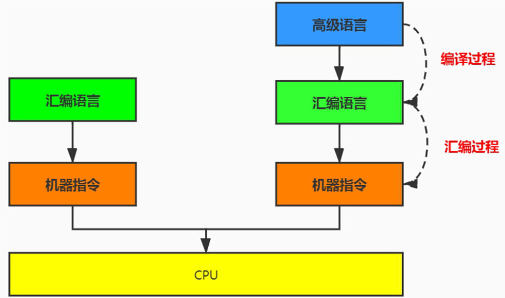

### 11.2.4 字节码

​	字节码是一种中间状态（中间码）的二进制代码（文件），需要转译后才能成为机器码。字节码主要为了实现特定软件运行和软件环境，与硬件环境无关。如下图所示，Java程序可以通过编译器将源码编译成Java字节码，特定平台上的虚拟机将字节码转译为可以直接执行的指令，也就实现了跨平台性。

<div style="text-align:center;font-weight:bold;">字节码文件的跨平台性</div>


## 11.3 Java代码编译和执行过程

​	我们知道虚拟机并不是真实存在的，是由软件编写而成的，它是相对于物理机的概念。但是虚拟机和物理机一样都可以执行一系列的计算机指令，其区别是物理机的执行引擎是直接建立在处理器、缓存、指令集和操作系统层面上的，而虚拟机的执行引擎则是由软件自行实现的，因此可以不受物理条件制约地定制指令集与执行引擎的结构体系，执行那些不被硬件直接支持的指令集格式。

​	JVM装载字节码到内存中，但字节码仅仅只是一个实现跨平台的通用契约而已，它并不能够直接运行在操作系统之上，因为字节码指令并不等价于机器码，它内部包含的仅仅只是一些能够被JVM所识别的字节码指令、符号表，以及其他辅助信息。

​	如果想要让一个Java程序运行起来，执行引擎的任务就是将字节码指令解释／编译为对应平台上的机器码才可以。简单来说，JVM中的执行引擎充当了将高级语言翻译为机器语言的译者，就好比两个国家领导人之间的交流需要翻译官一样。

​	在Java虚拟机规范中制定了JVM执行引擎的概念模型，这个概念模型成为各大发行商的JVM执行引擎的统一规范。执行引擎的工作流程如下图所示：

<div style="text-align:center;font-weight:bold;">执行引擎工作流程</div>

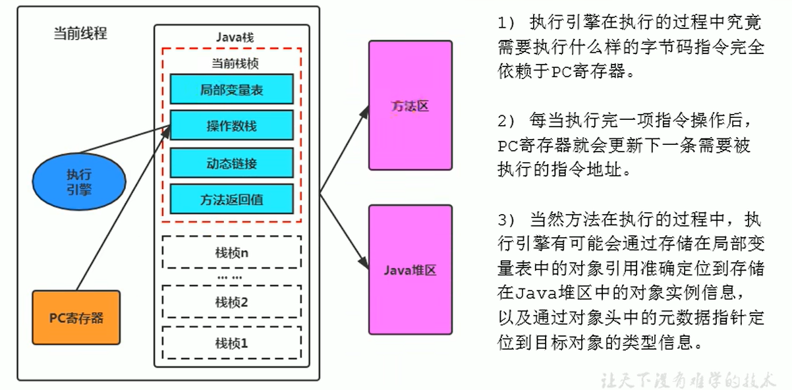

​	所有的JVM的执行引擎输入、输出都是一致的，输入的是字节码二进制流，处理过程是字节码解析执行的过程，输出的是执行结果。

​	大部分的程序代码转换成物理机的目标代码或虚拟机能执行的指令集之前，都需要经过下图中的各个步骤，<span style="background-color:#ffb660;">程序源码到抽象语法树的过程属于代码编译的过程，和虚拟机无关</span>；<span style="background-color:#22df2b;">指令流到解释执行的过程属于生成虚拟机指令集的过程</span>；<span style="background-color:#5daeff">优化器到目标代码的过程属于生成物理机目标代码的过程</span>

<div style="text-align:center;font-weight:bold;">源代码转换为机器的目标代码流程</div>

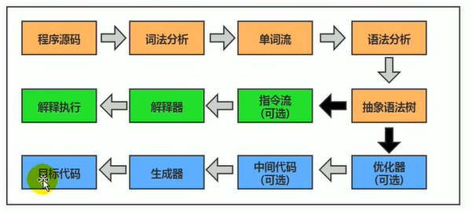

​	具体来说，Java代码编译是由Java源码编译器来完成，流程图如下图所示。在Java中，javac编译器主要负责词法分析、语法分析和语义分析，最终生成二进制字节码，此过程发生在虚拟机外部。

<div style="text-align:center;font-weight:bold;">Java源代码转换字节码流程</div>

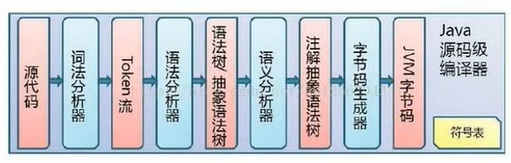

​	Java字节码的执行是由JVM执行引擎来完成，流程图如下所示：

<div style="text-align:center;font-weight:bold;">JVM字节码解释执行与JIT编译执行流程</div>

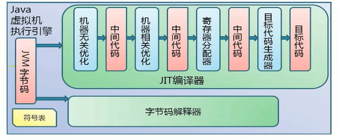

​	Java源代码经过javac编译器编译之后生成字节码，Java字节码的执行是由JVM执行引擎来完成，流程图如下图所示。可以看到图中有JIT编译器和字节码解释器两种路径执行字节码，也就是说可以解释执行，也可以编译执行。在前面的章节中我们讲过，Java是一种解释类型的语言，其实JDK 1.0时代，将Java语言定位为“解释执行”还是比较准确的，再后来，Java也发展出可以直接生成本地代码的编译器，所以Java语言就不再是纯粹的解释执行语言了。<span style="color:red;font-weight:bold;">现在JVM在执行Java代码的时候，通常都会将解释执行与编译执行结合起来进行，这也就是为什么现在Java语言被称为半编译半解释型语言的原因</span>。

<div style="text-align:center;font-weight:bold;">标题</div>

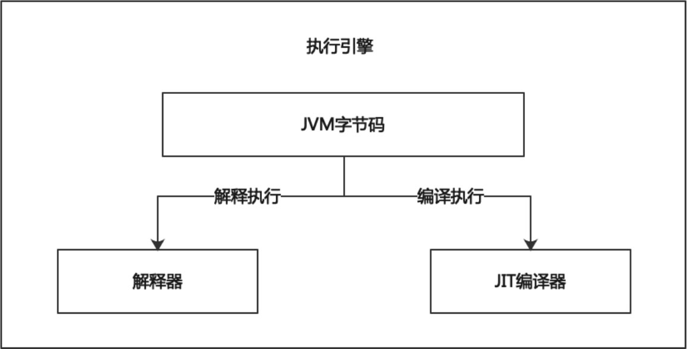

## 11.4 解释器

​	解释器的作用是当JVM启动时会根据预定义的规范对字节码采用逐行解释的方式执行，将每条字节码文件中的内容“翻译”为对应平台的机器码执行。

​	JVM设计者的初衷是为了满足Java程序实现跨平台特性，因此避免采用静态编译的方式直接生成机器码，从而诞生了实现解释器在运行时采用逐行解释字节码执行程序的想法。如下图所示，如果不采用字节码文件的形式，我们就需要针对不同的平台(Windows、Linux、Mac)编译不同的机器指令，那么就需要耗费很多精力和时间；如果采用了字节码的形式，那么就只需要从源文件编译到字节码文件即可，虽然在不同的平台上，但是JVM中的解释器可以识别同一套字节码文件，大大提高了开发效率。

<div style="text-align:center;font-weight:bold;">解释器功能</div>


​	解释器真正意义上所承担的角色就是一个运行时的“翻译者”，将字节码文件中的内容“翻译”为对应平台的机器码执行。

​	在Java的发展历史里，一共有两套解释执行器，分别是古老的<span style="color:#9400D3;">字节码解释器</span>和现在普遍使用的<span style="color:#9400D3;">模板解释器</span>。字节码解释器在执行时通过纯软件代码模拟字节码的执行，效率非常低下。而模板解释器将每一条字节码和一个模板函数相关联，模板函数中直接产生这条字节码执行时的机器码，从而很大程度上提高了解释器的性能。

​	在HotSpot VM中，解释器主要由Interpreter模块和Code模块构成。Interpreter模块实现了解释器的核心功能，Code模块用于管理HotSpot VM在运行时生成的机器码。

​	由于解释器在设计和实现上非常简单，因此除了Java语言之外，还有许多高级语言同样也是基于解释器执行的，比如Python、Perl、Ruby等。但是在今天，基于解释器执行已经沦落为低效的代名词。为了解决低效这个问题，JVM平台支持一种叫作即时编译的技术。即时编译的目的是避免函数被解释执行，而是将整个函数体编译成机器码，每次函数执行时，只执行编译后的机器码即可，这种方式可以使执行效率大幅度提升。不过无论如何，基于解释器的执行模式仍然为中间语言的发展做出了不可磨灭的贡献。

## 11.5 JIT编译器

​	JIT编译器(Just In Time Compiler)的作用就是虚拟机将字节码直接编译成机器码。但是现代虚拟机为了提高执行效率，会使用即时编译技术将方法编译成机器码后再执行。

​	在JDK 1.0时代，JVM完全是解释执行的，随着技术的发展，现在主流的虚拟机中大都包含了即时编译器。

​	HotSpot VM是目前市面上高性能虚拟机的代表作之一。它采用解释器与即时编译器并存的架构。在JVM运行时，解释器和即时编译器能够相互协作，各自取长补短，尽力去选择最合适的方式来权衡编译本地代码的时间和直接解释执行代码的时间。

​	在此大家需要注意，无论是采用解释器进行解释执行，还是采用即时编译器进行编译执行，都是希望程序执行要快。最终字节码都需要被转换为对应平台的机器码。

​	可以使用jconsole工具查看程序的运行情况。

<span style="color:#40E0D0;">案例1：</span>

- 代码

```java
/**
 * 打开jconsole观察JIT编译情况
 */
public class JITTest {

    public static void main(String[] args) {
        ArrayList<String> list = new ArrayList<>();

        for (int i = 0; i < 1000; i++) {
            list.add("让天下没有难学的技术！");

            try {
                Thread.sleep(1000);
            } catch (InterruptedException e) {
                e.printStackTrace();
            }
        }
    }
}
```

​	可以看见用到了JIT编译器。

<div style="text-align:center;font-weight:bold;">jconsole查看JIT编译器</div>

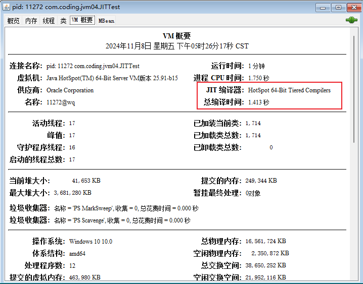

### 11.5.1 为什么HotSpot VM同时存在JIT编译器和解释器

​	既然HotSpot VM中已经内置JIT编译器了，那么为什么还需要再使用解释器来“拖累”程序的执行性能呢？比如JRockit VM内部就不包含解释器，字节码全部都依靠即时编译器编译后执行。

​	首先明确，当程序启动后，解释器可以马上发挥作用，省去编译的时间，立即执行。编译器要想发挥作用，把代码编译成机器码，需要一定的执行时间，但编译为机器码后，执行效率高。

​	尽管JRockit VM中程序的执行性能会非常高效，但程序在启动时必然需要花费更长的时间来进行编译（即“预热”）。对于服务端应用来说，启动时间并非是关注重点，但对于那些<span style="color:#9400D3;">看中启动时间的应用场景而言，或许就需要采用解释器与即时编译器并存的架构来换取一个平衡点。在此模式下，当JVM启动时，解释器可以首先发挥作用，而不必等待JIT全部编译完成后再执行，这样可以省去许多不必要的编译时间。随着程序运行时间的推移，即时编译器逐渐发挥作用，根据热点代码探测功能，将有价值的字节码编译为机器码，并缓存起来，以换取更高的程序执行效率</span>。

​	<span style="color:#FF00FF;">注意解释执行与编译执行在线上环境存在微妙的辩证关系。机器在热机状态可以承受的负载要大于冷机状态。如果以热机状态时的流量进行切流，可能使处于冷机状态的服务器因无法承载流量而假死。</span>

​	在生产环境发布过程中，以分批的方式进行发布，根据机器数量划分成多个批次，每个批次的机器数至多占到整个集群的1/8。

​	曾经有这样的故障案例，某程序员在发布平台进行分批发布，在输入发布总批数时，误填写成分为两批发布。如果是热机状态，在正常情况下一半的机器可以勉强承载流量，但由于刚启动的JVM均是解释执行，还没有进行热点代码统计和JIT动态编译，导致机器启动之后，当前l/2发布成功的服务器马上全部宕机，此故障证明了JIT的存在。

​	下图示例，以人类语言为例，形象生动地展示了Java语言中前端编译器、解释器和后端编译器（即JIT编译器）共同工作的流程。前端编译器将不同的语言统一编译成字节码文件（即“乌拉库哈吗哟”），这些信息我们是看不懂的，而是供JVM来读取的。之后可以通过解释器逐行将字节码指令解释为本地机器指令执行，或者通过JIT把热点代码编译为本地机器指令执行。

<div style="text-align:center;font-weight:bold;">解释器和JIT编译器共同工作流程</div>

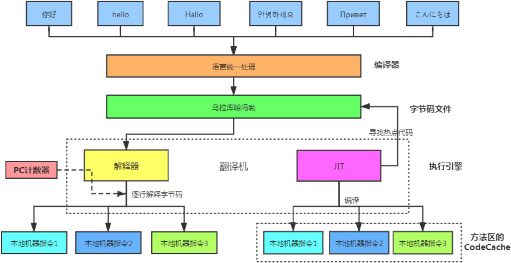

​	在此我们要说明一点，Java语言的“编译期”其实是一段“不确定”的操作过程，因为它可能是指一个前端编译器（其实叫“编译器的前端”更准确一些）把.java文件转变成.class文件的过程。也可能是指虚拟机的后端运行期编译器（JIT编译器，Just In Time Compiler）把字节码转变成机器码的过程。还可能是指使用静态提前编译器（AOT编译器，Ahead Of Time Compiler）直接把.java文件编译成本地机器代码的过程。

### 11.5.2 热点代码探测确定何时JIT

​	是否需要启动JIT编译器将字节码直接编译为对应平台的机器码需要根据代码被调用执行的频率而定。那些需要被编译为本地代码的字节码也被称为“热点代码”，<span style="color:#9400D3;">JIT编译器在运行时会针对那些频繁被调用的“热点代码”做出深度优化，将其直接编译为对应平台的机器码，以此提升Java程序的执行性能</span>。

​	一个被多次调用的方法，或者是一个方法体内部循环次数较多的循环体都可以被称为“热点代码”，因此都可以通过JIT编译器编译为机器码，并缓存起来。

​	一个方法被多次调用的时候，从解释执行切换到编译执行是在两次方法调用之间产生的，因为上一次方法在被调用的时候还没有将该方法编译好，所以仍然需要继续解释执行，而不需要去等待程序被编译，否则太浪费时间了，等再次调用该方法的时候，发现该方法已经被编译好，那么就会使用编译好的机器码执行了。

​	还有一种情况就是一个方法体内包含大量的循环的代码，比如下面的代码：

- 代码

```java
public static void main(String[] args) {
    for (int i = 0; i < 20000; i++) {
        System.out.println(i);
    }
}
```

​	main()方法被执行的次数只有一次，但是方法体内部有一个循环20000次的循体，这种情况下，就需要将循环体编译为机器码，而不是将main()方法编译为机器码，这个时候就需要在循环入口处判断是否该循环体已经被编译为机器码。由于这种编译方式不需要等待方法的执行结束，因此也被称为栈上替换编译，或简称OSR(On Stack Replacement)编译。

​	一个方法究竟要被调用多少次，或者一个循环体究竟需要执行多少次循环才可以达到这个标准？必然需要一个明确的阈值，JIT编译器才会将这些“热点代码”编译为机器码执行。这里主要依靠热点探测功能，比如上面代码的循环次数为20000次，那么就可能在循环执行5000次的时候开始被编译，然后在第5200次循环的时候开始使用机器码，中间的200次循环依然是解释执行，因为编译也是需要消耗时间的。

​	<span style="color:red;font-weight:bold;">目前HotSpot VM所采用的热点探测方式是基于计数器的热点探测</span>。HotSpot VM会为每一个方法都建立两个不同类型的计数器，分别为方法调用计数器(Invocation Counter)和回边计数器(Back Edge Counter)。方法调用计数器用于统计方法的调用次数，回边计数器则用于统计循环体执行的循环次数。

​	<span style="color:red;font-weight:bold;">方法调用计数器的默认阈值在Client模式下是1500次，在Server模式下是10000次。超过这个阈值，就会触发JIT编译。这个阈值可以通过虚拟机参数-XX:CompileThreshold来手动设定。</span>

​	一般而言，如果以缺省参数启动Java程序，方法调用计数器统计的是一段时间之内方法被调用的次数。当超过一定的时间限度，如果方法的调用次数没有达到方法调用计数器的阈值，这个方法的调用计数器的数值调整为当前数值的1/2，比如10分钟之内方法调用计数器数值为1000，下次执行该方法的时候，方法调用计数器的数值从500开始计数。这个过程称为方法调用计数器热度的衰减(CounterDecay)，而这段时间就称为此方法统计的半衰周期(Counter Half Life Time)，可以使用-XX:CounterHalfLifeTime参数设置半衰周期的时间，单位是秒。可以使用JVM参数“-XX:-UseCounterDecay”关闭热度衰减，让方法计数器统计方法调用的绝对次数，这样，只要系统运行时间足够长，绝大部分方法都会被编译成机器码。<span style="color:#9400D3;">一般而言，如果项目规模不大，并且产品上线后很长一段时间不需要进行版本迭代，都可以尝试把热度衰减关闭，这样可以使Java程序在线上运行的时间越久，执行性能会更佳</span>。

​	当一个方法被调用时，会先检查该方法是否存在被JIT编译过的版本，如果存在，则编译执行。如果不存在已被编译过的版本，则将此方法的调用计数器值加1，然后判断方法计数器的数值是否超过设置的阈值。如果已超过阈值， 那么将会向JIT申请代码编译，如果没有超过阈值，则继续解释执行。

​	回边计数器的作用是统计一个方法中循环体代码执行的次数，在字节码中遇到控制流向后跳转的指令称为“回边”(Back Edge)，回边可简单理解为循环末尾跳转到循环开始。回边计数器的流程如下所示，当程序执行过程中遇到回边指令时，判断是否已经存在编译的机器码，如果存在，则编译执行即可，如果不存在，则回边计数器加1，再次判断是否超过阈值，如果没有超过，则解释执行，如果超过阈值，则向编译器提交编译请求，之后编译器开始编译代码，程序继续解释执行。回边计数器的阈值可以通过参数“-XX:OnStackReplacePercentage”设置。显然，建立回边计数器统计的目的就是为了触发OSR编译，如图11-12所示。

<div style="text-align:center;font-weight:bold;">方法计数器执行流程</div>

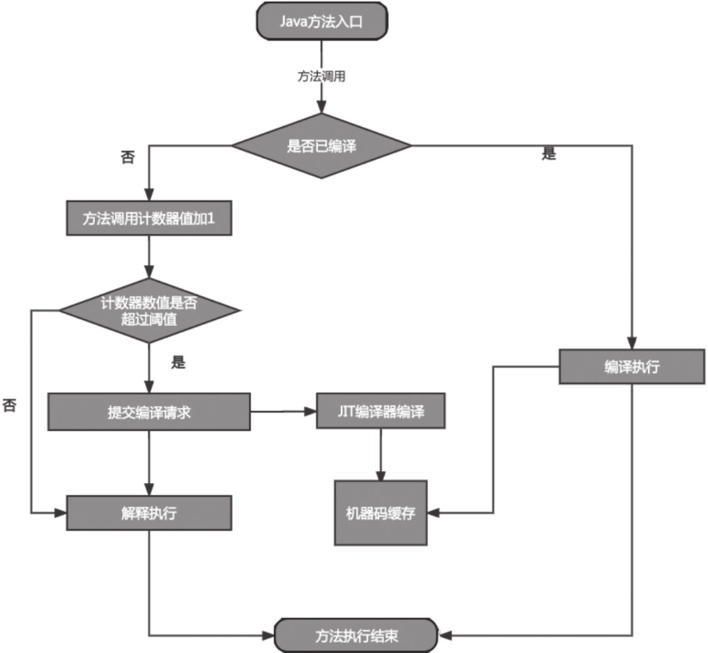

### 11.5.3 设置执行模式

​	缺省情况下HotSpot VM采用解释器与即时编译器并存的架构，使用java –version命令可以查看，如下所示，mixed mode表示解释器与即时编译器并存。

```cmd
> java -version
java version "1.8.0_91"
Java(TM) SE Runtime Environment (build 1.8.0_91-b15)
Java HotSpot(TM) 64-Bit Server VM (build 25.91-b15, mixed mode)
```

​	当然，开发人员可以根据具体的应用场景，通过下面的命令显式地为JVM指定在运行时到底是完全采用解释器执行，还是完全采用即时编译器执行。

​	-Xint命令表示完全采用解释器模式执行程序，如下所示。

```cmd
>java -Xint -version
java version "1.8.0_91"
Java(TM) SE Runtime Environment (build 1.8.0_91-b15)
Java HotSpot(TM) 64-Bit Server VM (build 25.91-b15, interpreted mode)
```

​	-Xcomp命令表示完全采用即时编译器模式执行程序。如果即时编译出现问题，解释器会介入执行，如下所示。

```cmd
>java -Xcomp -version
java version "1.8.0_91"
Java(TM) SE Runtime Environment (build 1.8.0_91-b15)
Java HotSpot(TM) 64-Bit Server VM (build 25.91-b15, compiled mode)
```

​	-Xmixed（HotSpot VM默认模式）命令表示采用解释器和即时编译器的混合模式共同执行程序，如下所示。

```cmd
>java -Xmixed -version
java version "1.8.0_91"
Java(TM) SE Runtime Environment (build 1.8.0_91-b15)
Java HotSpot(TM) 64-Bit Server VM (build 25.91-b15, mixed mode)
```

### 11.5.4 C1编译器和C2编译器

​	在HotSpot VM中内嵌有两个JIT编译器，分别为Client Compiler和ServerCompiler，通常简称为C1编译器和C2编译器。开发人员可以通过如下命令显式指定JVM在运行时到底使用哪一种即时编译器。

1.  -client：指定JVM运行在Client模式下，并使用C1编译器。C1编译器会对字节码进行简单和可靠的优化，耗时短，以达到更快的编译速度。
2. -server：指定JVM运行在Server模式下，并使用C2编译器。C2进行耗时较长的优化，以及激进优化，但优化的代码执行效率更高。

​	在不同的编译器上有不同的优化策略，C1编译器上主要有方法内联，去虚拟化、冗余消除。

1. 方法内联：将引用的函数代码编译到引用点处，这样可以减少栈帧的生成，减少参数传递以及跳转过程。
2. 去虚拟化：对唯一的实现类进行内联。
3. 冗余消除：在运行期间把一些不会执行的代码折叠掉。

​	C2的优化主要是在全局层面，逃逸分析是优化的基础。基于逃逸分析在C2上有如下几种优化。

1. 标量替换：用标量值代替聚合对象的属性值。
2. 栈上分配：对于未逃逸的对象分配对象在栈而不是堆。
3. 同步消除：清除同步操作，通常指synchronized。

​	Java分层编译(Tiered Compilation)策略：不开启性能监控的情况下，程序解释执行可以触发C1编译，将字节码编译成机器码，可以进行简单优化。如果开启性能监控，C2编译会根据性能监控信息进行激进优化。<span style="color:#9400D3;">不过在Java 7版本之后，一旦开发人员在程序中显式指定命令“-server”时，默认将会开启分层编译策略，由C1编译器和C2编译器相互协作共同来执行编译任务</span>。一般来讲，JIT编译出来的机器码性能比解释器高。C2编译器启动时长比C1编译器慢，系统稳定执行以后，C2编译器执行速度远远快于C1编译器。

​	默认情况下HotSpot VM则会根据操作系统版本与物理机器的硬件性能自动选择运行在哪一种模式下，以及采用哪一种即时编译器。

​	对于32位Windows操作系统，不论硬件什么配置都会默认使用Client模式，可以执行“java -server -version”命令，切换为Server模式，但已经是Server模式的，不能切换为Client模式。对于32位其他类型的操作系统，如果内存配置为2GB或以上且CPU数量大于或等于2，默认情况会以Server模式运行，低于该配置依然使用Client模式。64位的操作系统只有Server模式。

​	对于开发人员来讲，基本都是64位的操作系统了，因为32位的内存限制为4GB，显得捉襟见肘。现在生产环境上，基本上都是Server模式。所以我们只需要掌握Server模式即可，Client模式基本不会使用了。

## 11.6 AOT编译器和Graal编译器

​	JDK 9引入了AOT编译器（Ahead Of Time Compiler，静态提前编译器）及AOT编译工具jaotc。将所输入的class文件转换为机器码，并存放至生成的动态共享库之中。

​	所谓AOT编译，是与即时编译相对立的一个概念。我们知道，即时编译指的是在程序的运行过程中，将字节码转换为可在硬件上直接运行的机器码，并部署至托管环境中的过程。而AOT编译指的则是，在程序运行之前，便将字节码转换为机器码的过程，也就是说在程序运行之前通过jaotc工具将class文件转换为so文件。

​	AOT编译的最大好处是JVM加载已经预编译成二进制库，可以直接执行，无须通过解释器执行，不必等待即时编译器的预热，减少Java应用给人带来“第一次运行慢”的不良体验。把编译的本地机器码保存到磁盘，不占用内存，并可多次使用。

​	<span style="color:#9400D3;">但是破坏了Java“一次编译，到处运行”的特性，必须为不同硬件编译对应的发行包，降低了Java链接过程的动态性，加载的代码在编译工作前就必须全部已知。</span>

​	自JDK 10起，HotSpot又加入一个全新的即时编译器——Graal编译器。它的编译效果在短短几年内就追平了C2编译器，未来可期。目前，它还依然带着“试验状态”的标签，需要使用参数“-XX:+UnlockExperimentalVMOptions -XX:+UseJVMCICompiler”去激活，才可以使用。

# 第12章 字符串常量池

​	在Java程序中String类的使用几乎无处不在，String类代表字符串，字符串对象可以说是Java程序中使用最多的对象了。

​	首先，在Java中创建大量对象是非常耗费时间的。其次，在程序中又经常使用相同的字符串对象，如果每次都去重新创建相同的字符串对象将会非常浪费空间。最后，字符串对象具有不可变性，即字符串对象一旦创建，内容和长度是固定的，既然这样，那么字符串对象完全可以共享。所以就有了StringTable这一特殊的存在，StringTable叫作字符串常量池，用于存放字符串常量，这样当我们使用相同的字符串对象时，就可以直接从StringTable中获取而不用重新创建对象。

## 12.1 String的基本特性

### 12.1.1 String类概述

​	String是字符串的意思，可以使用一对双引号引起来表示，而String又是一个类，所以可以用new关键字创建对象。因此字符串对象的创建有两种方式，分别是使用字面量定义和new的方式创建，如下所示。

​	字面量的定义方式：String s1 = “atguigu”;

​	以new的方式创建：String s2 = new String(“hello”)。

​	String类声明是加final修饰符的，表示String类不可被继承；String类实现了Serializable接口，表示字符串对象支持序列化；String类实现了Comparable接口，表示字符串对象可以比较大小。

​	String在JDK 8及以前版本内部定义了final char[] value用于存储字符串数据。JDK 9时改为final byte[] value。String在JDK 9中存储结构变更通知如下图所示：

[官方文档](https://openjdk.org/jeps/254)

<div style="text-align:center;font-weight:bold;">JDK7和JDK8存储结构的对比图</div>

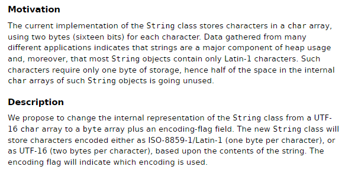

​	String类的当前实现将字符串存储在char数组中，每个char类型的字符使用2字节（16位）。从许多不同的应用程序收集的数据表明，字符串是堆使用的主要组成部分，而大多数字符串对象只包含Latin-1字符。这些字符只需要1字节的存储空间，也就是说这些字符串对象的内部字符数组中有一半的空间并没有使用。

​	我们建议将String类的内部表示形式从UTF-16字符数组更改为字节数组加上字符编码级的标志字段。新的String类将根据字符串的内容存储编码为ISO-8859-1/Latin-1（每个字符1字节）或UTF-16（每个字符2字节）编码的字符。编码标志将指示所使用的编码。

​	基于上述官方给出的理由，String不再使用char[]来存储，改成了byte[]加上编码标记，以此达到节约空间的目的。JDK9关于String类的部分源码如下面代码清单所示，可以看出来已经将char[]改成了byte[]。

<span style="color:#40E0D0;">案例1：JDK 9版本String的部分源码</span>

- 代码

```java
// JDK8
public final class String
    implements java.io.Serializable, Comparable<String>, CharSequence {
    private final char value[];
	private int hash; // Default to 0
}
// JDK9
public final class String
    implements java.io.Serializable, Comparable<String>, CharSequence {
    @Stable
	private final byte[] value;
	private final byte coder;
	private int hash; // Default to 0
	@Native static final byte LATIN1 = 0;
    @Native static final byte UTF16  = 1;
}
```

​	String类做了修改，与字符串相关的类（如AbstractStringBuilder、StringBuilder和String Buffer）也都随之被更新为使用相同的表示形式，HotSpot VM的内部字符串操作也做了更新。

### 12.1.2 String的不可变性

​	String是不可变的字符序列，即字符串对象具有不可变性。例如，对字符串变量重新赋值、对现有的字符串进行连接操作、调用String的replace等方法修改字符串等操作时，都是指向另一个字符串对象而已，对于原来的字符串的值不做任何改变。下面通过代码验证String的不可变性，如下代码所示。

<span style="color:#40E0D0;">案例1：</span>

```java
/**
 * String的基本使用：体现String的不可变性。
 */
public class StringTest1 {

    @Test
    public void test1() {
        String s1 = "java"; // 字面量定义的方式，"abc"存储在字符串常量池中。
        String s2 = "java";
        s1 = "hello";
        System.out.println(s1); // hello
        System.out.println(s2); // java
    }

    @Test
    public void test2() {
        String s1 = "java"; // 字面量定义的方式，"abc"存储在字符串常量池中。
        String s2 = s1 + "hello";
        System.out.println(s1); // java
        System.out.println(s2); // javahello
    }

    @Test
    public void test3() {
        String s1 = "java";
        String s2 = s1.concat("hello");
        System.out.println(s1); // java
        System.out.println(s2); // javahello
    }

    @Test
    public void test4() {
        String s1 = "java";
        String s2 = s1.replace('a', 'A');
        System.out.println(s1); // java
        System.out.println(s2); // jAvA
    }
}
```

<div style="text-align:center;font-weight:bold;">StringTest1类代码的解析</div>

| 方法      | 代码解析                                                     |
| --------- | ------------------------------------------------------------ |
| test1方法 | s1变量指向新的字符串对象“hello”，而不是直接修改“java”字符串对象的内容 |
| test2方法 | s1和“hello”拼接后得到新的字符串，s2指向这个新字符串，s1不变  |
| test3方法 | s1和“hello”拼接后得到新的字符串，s2指向这个新字符串，s1不变  |
| test4方法 | 基于s1创建一个新字符串然后替换，s2指向这个新字符串，s1不变。 |

<span style="color:#40E0D0;">案例2：</span>

```java
/**
 * 字符串不可变
 */
public class StringExer {

    String literal = "good";
    String str = new String("good");
    char[] ch = {'t', 'e', 's', 't'};

    public void change(String literal, String str, char ch[]) {
        literal = "test ok";
        str = "test ok";
        ch[0] = 'b';
        System.out.println(literal); // test ok
        System.out.println(str); // test ok
        System.out.println(ch); // {'b', 'e', 's', 't'}
    }

    public static void main(String[] args) {
        StringExer ex = new StringExer();
        ex.change(ex.literal, ex.str, ex.ch);
        System.out.println(ex.literal); // good
        System.out.println(ex.str); // good
        System.out.println(ex.ch); // {'b', 'e', 's', 't'}
    }
}
```

​	在上面的代码中，因为change(String literal, String str, char ch[])方法的三个形参都是引用数据类型，<span style="color:red;font-weight:bold;">接收的都是实参对象的首地址</span>，即literal与ex.literal指向同一个对象，str和ex.str指向同一个对象，ch和ex.ch指向同一个对象，所以在change方法中打印literal、str和ch的结果和实参ex.literal、ex.str和ex.ch一样。虽然str在change方法中进行了拼接操作，str的值变了，但是由于String对象具有不可变性，literal、str指向了新的字符串对象，就和实参对象ex.literal、ex.str无关了，所以ex.literal和ex.str的值不会改变。而ch在change方法中并没有指向新对象，对ch[0]的修改，相当于对ex.ch[0]的修改。

## 12.2 字符串常量池

​	因为String对象的不可变性，所以String的对象可以共享。但是Java中并不是所有字符串对象都共享，只会共享字符串常量对象。Java把需要共享的字符串常量对象存储在字符串常量池(StringTable)中，即字符串常量池中是不会存储相同内容的字符串的。

### 12.2.1 字符串常量池的大小

​	String的StringTable是一个固定大小的HashTable，不同JDK版本的默认长度不同。如果放进StringTable的String非常多，就会造成Hash冲突严重，从而导致链表很长，链表过长会造成当调用String.intern()方法时性能大幅下降。

​	在JDK6中StringTable长度默认是1009，所以如果常量池中的字符串过多就会导致效率下降很快。在JDK 7和JDK 8中，StringTable长度默认是60013。

​	使用“-XX:StringTableSize”可自由设置StringTable的长度。但是在JDK 8中，StringTable长度设置最小值是1009。

​	下面我们使用代码来测试不同的JDK版本中对StringTable的长度限制，如下面代码。

<span style="color:#40E0D0;">案例1：不同的JDK版本中对StringTable的长度限制</span>

- 代码

```java
/**
 * <p>
 * -- jdk6
 * $ jinfo -flag StringTableSize pid
 * -XX:StringTableSize=1009
 * -- jdk7
 * $ jinfo -flag StringTableSize pid
 * -XX:StringTableSize=60013
 * -- jdk8
 * $ jinfo -flag StringTableSize pid
 * -XX:StringTableSize=60013
 * -- jdk11
 * $ jinfo -flag StringTableSize pid
 * -XX:StringTableSize=65536
 */
public class StringTest2 {
    public static void main(String[] args) {
        // 测试StringTableSize参数
        System.out.println("我来打个酱油");
        try {
            Thread.sleep(1000000);
        } catch (InterruptedException e) {
            e.printStackTrace();
        }
    }
}
```

​	先运行上面的Java程序，然后使用jps和jinfo命令来查看当前Java进程和打印指定Java进程的配置信息。

- JDK6

```java
>jinfo -flag StringTableSize 12872
-XX:StringTableSize=1009
```
- JDK7

```java
>jinfo -flag StringTableSize 12980
-XX:StringTableSize=60013
```
- JDK8

```java
>jinfo -flag StringTableSize 20096
-XX:StringTableSize=60013
```
​	当JDK 8设置StringTable的长度过短的话会抛出“Could not create the JavaVirtual Machine”异常。

<div style="text-align:center;font-weight:bold;">JDK 8时设置StringTable的长度过短抛出异常</div>

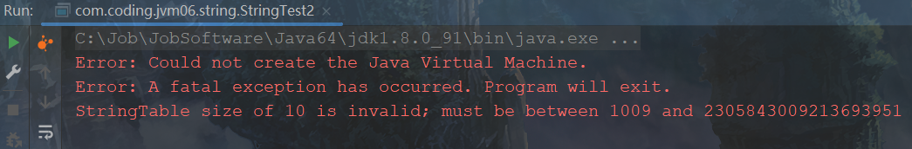

- JDK11

```java
>jinfo -flag StringTableSize 19308
-XX:StringTableSize=65536
```

​	上面程序测试了不同版本的JDK对于StringTable的长度有不同的限制，接下来测试不同的StringTable长度对于性能的影响，业务需求为产生10万个长度不超过10的字符串，如下代码所示。

<span style="color:#40E0D0;">案例1：不同的StringTable长度对于性能的影响</span>

- 代码：生成tokens

```java
/**
 * 产生10万个长度不超过10的字符串，包含a-z,A-Z
 */
public class GenerateString {
    public static void main(String[] args) throws IOException {
        try (FileWriter fw = new FileWriter("words.txt")) {
            Random random = new Random();
            for (int i = 0; i < 100000; i++) {
                int length = random.nextInt(10) + 1;
                fw.write(getString(length) + "\n");
            }
        }
    }

    public static String getString(int length) {
        String str = "";
        Random random = new Random();
        for (int i = 0; i < length; i++) {
            // 65 - 90 26个大写字母编码, 97 - 122 大小写字母相差32
            int num = random.nextInt(26) + 65;
            num += random.nextInt(2) * 32;
            str += (char) num;
        }
        return str;
    }
}
```

- 代码：读取tokens

```java
public class GenerateStringRead {
    public static void main(String[] args) {
        BufferedReader br = null;
        try {
            br = new BufferedReader(new FileReader("words.txt"));
            long start = System.currentTimeMillis();
            String data;
            while ((data = br.readLine()) != null) {
                data.intern(); // 如果字符串常量池中没有对应data的字符串的话，则在常量池中生存
            }
            long end = System.currentTimeMillis();
            /*
             * -XX:StringTableSize=1009 =>109 ms
             * -XX:StringTableSize = 10009 =>51 ms
             */
            System.out.println("花费的时间为：" + (end - start));
        } catch (Exception e) {
            throw new RuntimeException(e);
        } finally {
            if (br != null) {
                try {
                    br.close();
                } catch (IOException e) {
                    e.printStackTrace();
                }
            }
        }
    }
}
```

​	当字符串常量池的长度设置为“-XX:StringTableSize=1009”时，读取的时间为109ms。当字符串常量池的长度设置为“-XX:StringTableSize=100009”时，读取的时间为51ms。由此可以看出当字符串常量池的长度较短时，代码执行性能降低。

### 12.2.2 字符串常量池的位置

​	除String外，在Java语言中还有8种基本数据类型，为了节省内存、提高运行速度，Java虚拟机为这些类型都提供了常量池。

​	8种基本数据类型的常量池都由系统协调使用。String类型的常量池使用比较特殊，当直接使用字面量的方式（也就是直接使用双引号）创建字符串对象时，会直接将字符串存储至常量池。当使用其他方式（如以new的方式）创建字符串对象时，字符串不会直接存储至常量池，但是可以通过调用String的intern()方法将字符串存储至常量池。

​	HotSpot虚拟机中在Java 6及以前版本中字符串常量池放到了永久代，在Java 7及之后版本中字符串常量池被放到了堆空间。字符串常量池位置之所以调整到堆空间，是因为永久代空间默认比较小，而且永久代垃圾回收频率低。将字符串保存在堆中，就是希望字符串对象可以和其他普通对象一样，垃圾对象可以及时被回收，同时可以通过调整堆空间大小来优化应用程序的运行。

​	下面用代码来展示不同JDK版本中字符串常量池的变化。

<span style="color:#40E0D0;">案例1：不同JDK版本中字符串常量池的变化</span>

```java
/**
 * <p>
 * -- jdk6
 * -XX:PermSize=20m -XX:MaxPermSize=20m -Xms128m -Xmx256m
 * Exception in thread "main" java.lang.OutOfMemoryError: PermGen space
 * <p>
 * -- jdk7
 * -XX:PermSize=20m -XX:MaxPermSize=20m -Xms128m -Xmx256m
 * Exception in thread "main" java.lang.OutOfMemoryError: PermGen space
 * <p>
 * -- jdk8
 * -XX:MetaspaceSize=20m -XX:MaxMetaspaceSize=20m -Xms128m -Xmx256m
 * Exception in thread "main" java.lang.OutOfMemoryError: Java heap space
 */
public class StringTest3 {
    public static void main(String[] args) {
        // 使用list保持着常量池引用，避免full gc回收常量池行为
        ArrayList<String> list = new ArrayList<String>();
        int i = 0;
        while (true) {
            list.add(String.valueOf(i++).intern());
        }
    }
}
```

​	当使用JDK 6时，设置永久代(PermSize)内存为20MB，堆内存大小最小值为128MB，最大值为256MB，运行代码后，报出永久代内存溢出异常，如下图所示。

<div style="text-align:center;font-weight:bold;">JDK 6中永久代内存溢出异常</div>

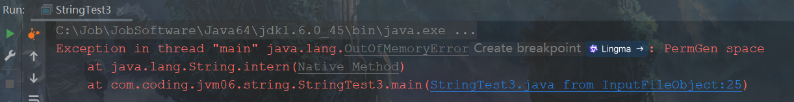

​	在JDK 7中设置永久代(PermSize)内存为20MB，堆内存大小最小值为128MB，最大值为256MB，运行代码后，报出如下图所示堆内存溢出异常。由此可以看出，字符串常量池被放在了堆中，最终导致堆内存溢出。

<div style="text-align:center;font-weight:bold;">JDK 7中堆内存溢出异常</div>

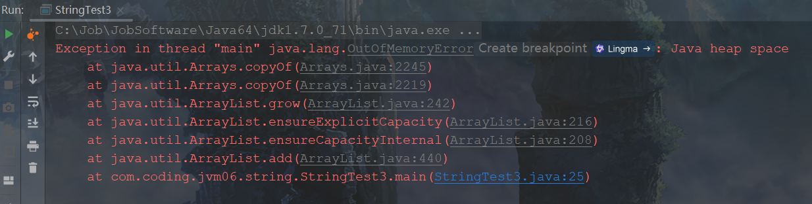

​	在JDK 8中因为永久代被取消，所以PermSize参数换成了MetaspaceSize参数，设置元空间(MetaspaceSize)的大小为20MB，堆内存大小最小值为128MB，最大值为256MB时，运行代码报错和JDK版本一样，也是堆内存溢出错误。

<div style="text-align:center;font-weight:bold;">JDK 8中堆内存溢出异常</div>

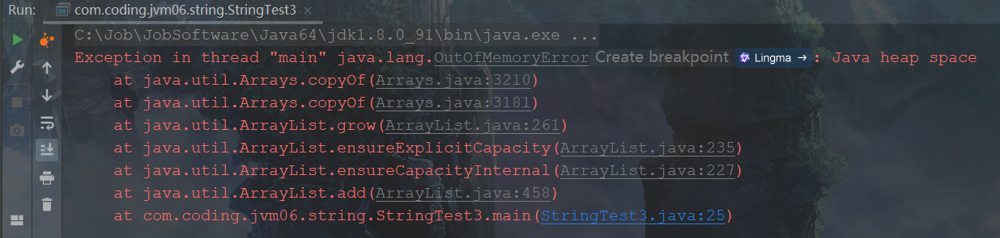

### 12.2.3 字符串常量对象的共享

​	因为String对象是不可变的，所以可以共享。存储在StringTable中的字符串对象是不会重复的，即相同的字符串对象本质上是共享同一个。Java语言规范里要求完全相同的字符串字面量，应该包含同样的Unicode字符序列（包含同一份码点序列的常量），如代码所示。

<span style="color:#40E0D0;">案例1：完全相同的字符串字面量指向同一个String类实例</span>

- 代码

```java
/**
 * 观察字符串对象个数：
 * Java语言规范里要求完全相同的字符串字面量，应该包含同样的Unicode字符序列（包含同一份码点序列的常量），并且必须是指向同一个String类实例。
 * debug时打开memory面板观察 java.lang.String
 */
public class StringTest4 {

    public static void main(String[] args) {
        String s1 = "hello"; // code(1)
        String s2 = "hello"; // code(2)
        String s3 = "emon";  // code(3)
    }
}
```

​	Debug运行并查看Memory内存结果如下图所示，code(1)代码运行之前，字符串的数量为1659个，code(1)语句执行之后，字符串的数量为1660个，说明code(1)语句产生了1个新的字符串对象。当code(2)语句执行之后，字符串的数量仍然为1660个，说明code(2)语句没有产生新的字符串对象，和code(1)语句共享同一个字符串对象“hello”。当code(3)语句执行之后，字符串的数量为1661个，说明code(3)语句又产生了1个新的字符串对象，因为code(3)语句的字符串“emon”和之前的字符串常量对象不一样。

<div style="text-align:center;font-weight:bold;">Debug运行StringTest4查看字符串的数量</div>

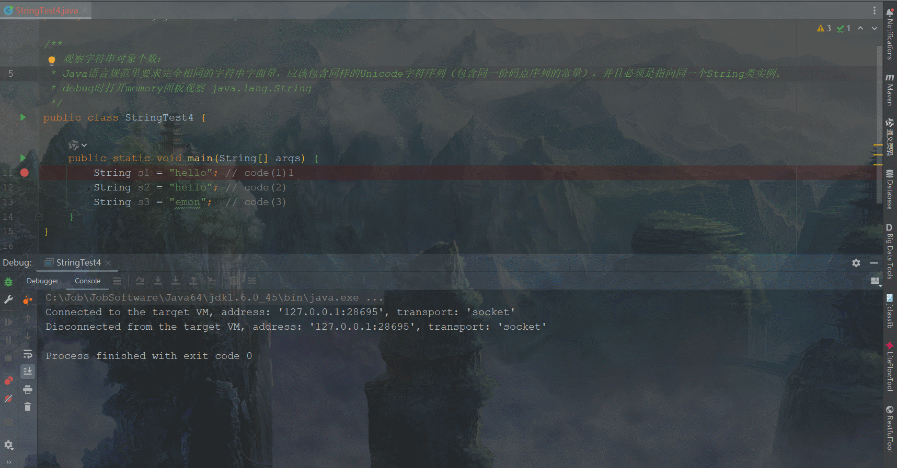

​	只有在StringTable中的字符串常量对象才会共享，不是在StringTable中的字符串对象，不会共享。例如new出来的字符串不在字符串常量池，如下代码所示。 

​	<span style="color:#40E0D0;">案例1：演示new出来的字符串不在字符串常量池</span>

```java
public class StringTest4_2 {
    public static void main(String[] args) {
        String s1 = new String("hello"); // code(4)
        String s2 = new String("hello"); // code(5)
    }
}
```

​	Debug运行并查看Memory内存结果如下图所示。code(4)代码运行之前，字符串的数量为1659个，code(4)语句执行之后，字符串的数量为1661个，说明code(4)语句产生了两个新的字符串对象，一个是new出来的，一个是字符串常量对象“hello”。当code(5)语句执行之后，字符串的数量为1662个，说明code(5)语句只新增了1个字符串对象，它是新new出来的，而字符串常量对象“hello”和code(4)语句共享同一个。

<div style="text-align:center;font-weight:bold;">演示new出来的字符串不在字符串常量池</div>

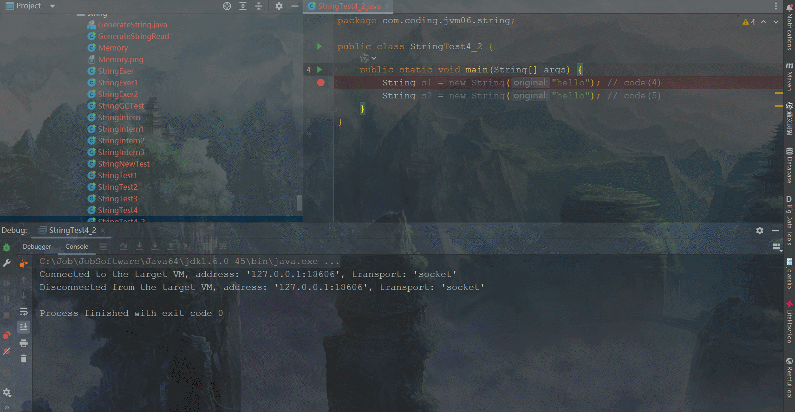

## 12.3 字符串拼接操作

### 12.3.1 不同方式的字符串拼接

​	在日常开发中，大家会经常用到字符串的拼接，字符串的拼接通常使用“+”或String类的concat()方法，它们有什么不同呢？另外，使用针对字符串常量拼接和字符串变量拼接又有什么区别呢？字符串拼接结果存放在常量池还是堆中呢？通过运行和分析下面的代码，相信你可以得出结论。

<span style="color:#40E0D0;">案例1：字符串拼接结果对比</span>

- 代码

```java

public class StringTest5 {

    @Test
    public void test1() {
        String s1 = "a" + "b" + "c"; // 编译期优化：等同于 “abc”
        String s2 = "abc"; // "abc"一定是放在字符串常量池StringTable中，将此地址赋值给s2
        System.out.println(s1 == s2); // true
    }

    @Test
    public void test2() {
        String s1 = "javaEE";
        String s2 = "hadoop";
        String s3 = "javaEEhadoop";
        // “+”拼接中出现字符串变量等非字面常量，结果都不在 StringTable 中
        String s4 = "javaEE" + new String("hadoop");
        String s5 = s1 + "hadoop";
        String s6 = "javaEE" + s2;
        String s7 = s1 + s2;

        System.out.println(s3 == s4); // false
        System.out.println(s3 == s5); // false
        System.out.println(s3 == s6); // false
        System.out.println(s3 == s7); // false
        System.out.println(s5 == s6); // false
        System.out.println(s5 == s7); // false
        System.out.println(s6 == s7); // false

        // intern(): 判断字符串常量池中是否存在 javaEEhadoop 值，如果存在，则返回常量池中概字符串的地址；否则在常量池中加载一份。
        String s8 = s6.intern();
        System.out.println(s3 == s8); // true
    }

    @Test
    public void test3() {
        String s1 = "javaEE";
        String s2 = "hadoop";
        String s3 = "javaEEhadoop";
        /*
        如下的s1 + s2的执行细节：
        1、StringBuilder s = new StringBuilder();
        2、s.append("a");
        3、s.append("b");
        4、s.toString() --> 类似于 new String("ab")
        补充：在jdk5.0之后使用的是StringBuilder，之前使用的是StringBuffer。
         */
        String s4 = s1 + s2; // s1 + s2 或 s1.concat(s2) 的拼接结果，都不在 StringTable 中
        System.out.println(s3 == s4); // false
    }


    @Test
    public void test4() {
        String s1 = "hello";
        String s2 = "java";
        String s3 = "hellojava";
        String s4 = (s1 + s2).intern();
        String s5 = s1.concat(s2).intern();
        // 拼接后调用intern()方法，结果都在StringTable中
        System.out.println(s3 == s4); // true
        System.out.println(s3 == s5); // true
    }

    /*
    1、字符串拼接操作不一定使用的是StringBuilder！
    如果拼接符号左右两边都是字符串常量或常量引用，则仍然使用编译期优化，即非StringBuilder方式。
    2、针对于final修饰类、方法、基本数据类型、引用数据类型的量的结构时，能用则用。
     */
    @Test
    public void test5() {
        final String s1 = "hello";
        final String s2 = "java";
        String s3 = "hellojava";
        String s4 = s1 + s2;
        System.out.println(s3 == s4); // true
    }
}
```

<div style="text-align:center;font-weight:bold;">StringTest 5类代码的解析</div>

| 方法      | 代码解析                                                     |
| --------- | ------------------------------------------------------------ |
| test1方法 | 字面常量与字面常量的“+”拼接结果在常量池，原理是编译期优化    |
| test2方法 | 字符串“+”拼接中只要其中有一个是变量或非字面常量，结果不会直接放在StringTable中 |
| test3方法 | 凡是使用concat()方法拼接的结果不会放在StringTable中          |
| test4方法 | 如果拼接的结果调用intern()方法，则主动将常量池中还没有的字符串对象放入池中，并返回此对象地址 |
| test5方法 | s1和s2前面加了final修饰，那么s1和s2仍然是字符串常量，即s1和s2是”hello“和”java“的代名词而已。 |

​	通过上面的代码我们可以得出以下结论：

1. 字符串常量池中不会存在相同内容的字符串常量。
2. 字面常量字符串与字面常量字符串的“+”拼接结果仍然在字符串常量池。
3. 字符串“+”拼接中只要其中有一个是变量或非字面常量，结果不会放在字符串常量池中。
4. 凡是使用concat()方法拼接的结果也不会放在字符串常量池中。
5. 如果拼接的结果调用intern()方法，则主动将常量池中还没有的字符串对象放入池中，并返回此对象地址。

### 12.3.2 字符串拼接的细节

​	看了上面小节的运行结果，有些读者就开始有疑问了，为什么这几种字符串拼接结果存储位置不同呢？下面我们将通过查看源码和分析字节码等方式来为大家揭晓答案。

​	字节码命令视图可以看出上面代码中<span style="color:#40E0D0;">12.3.1 StringTest5类的test1</span>方法中两个字符串加载的内容是相等的，也就是编译器对"a"+"b"+"c"做了优化，直接等同于"abc"。如下图所示。

<div style="text-align:center;font-weight:bold;">字符串常量“+”拼接和字符串常量的对比</div>

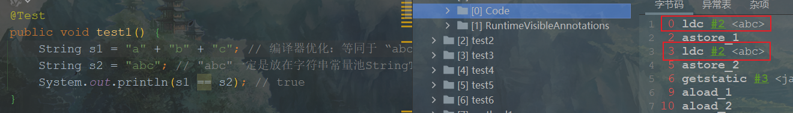

​	从字节码命令视图可以看出上面代码中<span style="color:#40E0D0;">12.3.1 StringTest5类的test2</span>方法中，两个字符串拼接过程使用StringBuilder类的append()方法来完成，之后又通过toString()方法转为String字符串对象。而StringBuilder类的toString()方法源码如下面代码所示，它会重新new一个字符串对象返回，而直接new的String对象一定是在堆中，而不是在常量池中。

<div style="text-align:center;font-weight:bold;">“+”拼接过程使用了StringBuilder类</div>

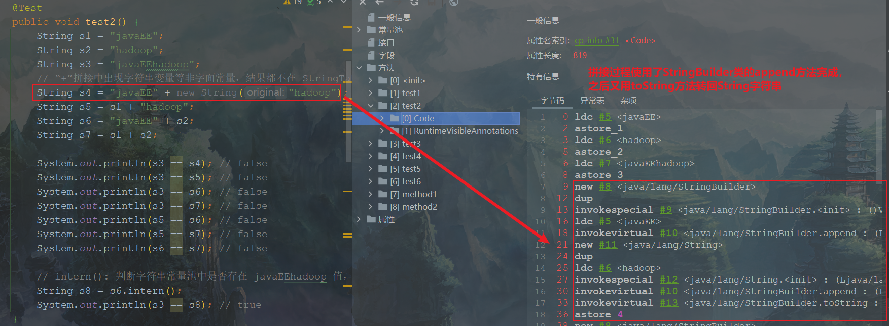

<div style="text-align:center;font-weight:bold;">StringBuilder类toString方法源码</div>

- 代码

```java
    @Override
    public String toString() {
        // Create a copy, don't share the array
        return new String(value, 0, count);
    }
```

​	下面查看String类的concat()方法源码，如代下面码清所示，只要拼接的不是一个空字符串，那么最终结果都是new一个新的String对象返回，所以拼接结果也是在堆中，而非常量池。

<div style="text-align:center;font-weight:bold;">String类concat方法源码</div>

```java
    public String concat(String str) {
        int otherLen = str.length();
        if (otherLen == 0) {
            return this;
        }
        int len = value.length;
        char buf[] = Arrays.copyOf(value, len + otherLen);
        str.getChars(buf, len);
        return new String(buf, true);
    }
```

### 12.3.3 “+”拼接和StringBuilder拼接效率

​	在上一节，我们提到了“+”拼接过程中，如果“+”两边有非字符串常量出现，编译器会将拼接转换为StringBuilder的append拼接。那么使用“+”拼接和直接使用StringBuilder的append()拼接，效率有差异吗？如下代码演示了字符串“+”拼接和StringBuilder的append()的效率对比。

<span style="color:#40E0D0;">案例1：字符串“+”拼接和StringBuilder的append()效率对比</span>

- 代码

```java
public class StringConcatTimeTest {
    @Test
    public void test1() {
        long start = System.currentTimeMillis();
        String src = "";
        for (int i = 0; i < 100000; i++) {
            src = src + "a"; // 每次循环都会创建一个 StringBuilder、String
        }
        long end = System.currentTimeMillis();
        System.out.println("花费的时间为：" + (end - start)); // 4080ms
        long totalMemory = Runtime.getRuntime().totalMemory();
        long freeMemory = Runtime.getRuntime().freeMemory();
        System.out.println("占用的内存：" + (totalMemory - freeMemory)); // 137506160B
    }

    @Test
    public void test2() {
        long start = System.currentTimeMillis();
        // 只需要创建一个 StringBuilder
        StringBuilder src = new StringBuilder();
        for (int i = 0; i < 100000; i++) {
            src.append("a");
        }
        long end = System.currentTimeMillis();
        System.out.println("花费的时间为：" + (end - start)); // 16
        long totalMemory = Runtime.getRuntime().totalMemory();
        long freeMemory = Runtime.getRuntime().freeMemory();
        System.out.println("占用的内存：" + (totalMemory - freeMemory)); // 10653712B
    }
}
```

​	创建100000个字符串的拼接使用test1()方法耗时4080ms，占用内存137506160字节，使用test2()方法耗时16ms，占用内存10653712字节，明显test2()方法的效率更高。这是因为test2()方法中StringBuilder的append()自始至终只创建过一个StringBuilder对象。test1()方法中使用String的字符串拼接方式会创建多个StringBuilder和String对象。

## 12.4 intern()的使用

​	从上面代码<span style="color:#40E0D0;">12.3.1 StringTest5类的test4</span>方法中可以看出，无论是哪一种字符串拼接，拼接后调用intern()结果都在字符串常量池。这是为什么呢？查看intern()方法的官方文档解释说明。

<div style="text-align:center;font-weight:bold;">intern()方法的官方文档解释说明</div>

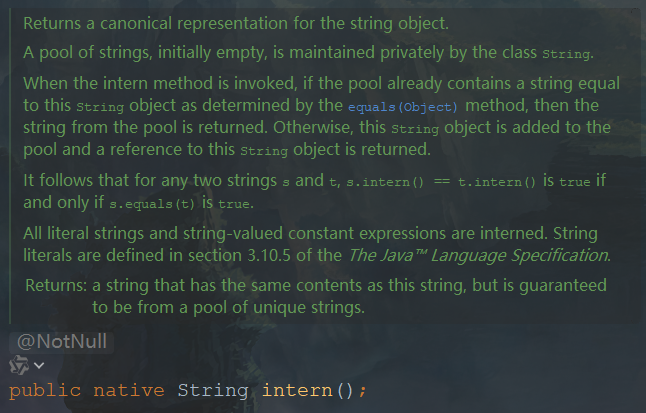

​	当调用intern()方法时，如果池中已经包含一个等于此String对象的字符串，则返回池中的字符串。否则，将此String对象添加到池中，并返回此String对象的引用。也就是说，如果在任意字符串上调用intern()方法，那么其返回地址引用和直接双引号表示的字面常量值的地址引用是一样的。例如：new String(“I loveatguigu”).intern()== “I love atguigu”和“I love atguigu” == newString(“I love atguigu”).intern()的结果都是true。

### 12.4.1 不同JDK版本的intern()方法

​	虽然intern()方法都是指返回字符串常量池中字符串对象引用，但是在不同的JDK版本中，字符串常量池的位置不同，决定了字符串常量池是否会与堆中的字符串共享问题。

<span style="color:#40E0D0;">案例1：不同JDK版本的字符串常量共享的区别</span>

- 代码

```java
/**
 * 不同JDK版本intern()方法测试
 */
public class StringInternTest {
    @Test
    public void test1() {
        String s = "ab";
        String s1 = new String("a") + new String("b");
        String s2 = s1.intern();
        System.out.println(s1 == s); // JDK6、JDK7和JDK8：false
        System.out.println(s2 == s); // JDK6、JDK7和JDK8：true
    }

    @Test
    public void test2() {
        String s1 = new String("a") + new String("b");
        String s2 = s1.intern();
        String s = "ab";
        System.out.println(s1 == s); // JDK6：false JDK7和JDK8：true
        System.out.println(s2 == s); // JDK6、JDK7和JDK8：true
    }
}
```

​	在JDK6中，上述代码test1()和test2()方法运行结果都是false和true。这是因为JDK6时，HotSpot虚拟机中字符串常量池在永久代，不在堆中，所以，字符串常量池不会和堆中的字符串共享，即无论是test1()还是test2(),s1指向的是堆中的字符串对象的地址，而s2和s指向的是永久代中字符串的地址。

​	JDK 6的test1()和test2()的内存示意图一样，如下图所示。

<div style="text-align:center;font-weight:bold;">JDK 6版本test1()和test2()方法的内存示意图</div>

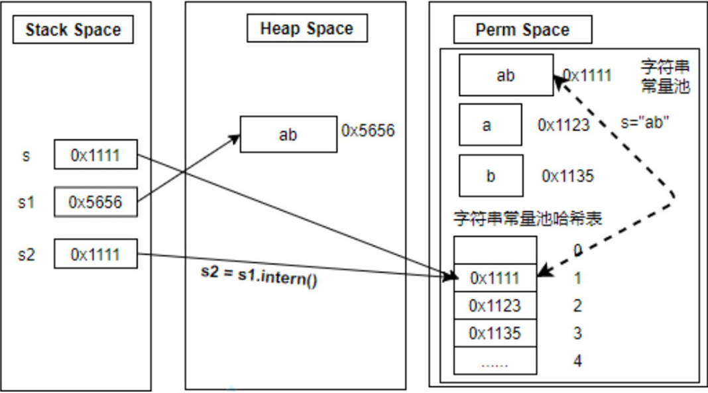

​	在JDK7和JDK8中上述代码test1()方法运行结果是false和true,test2()方法运行结果是true和true。这是因为HotSpot虚拟机在JDK 7和JDK 8中，字符串常量池被设置在了堆中，所以，字符串常量池可以和堆共享字符串。在test1()方法中，由于是先给s赋值"ab"，后出现s1.intern()的调用，也就是在用intern()方法之前，堆中已经有一个字符串常量"ab"了，字符串常量池中记录的是它的地址，intern()方法也直接返回该地址，而给s1变量赋值的是新new的堆中的另一个字符串的地址，所以test1()方法运行结果是false和true。在test2()方法中，由于是先调用s1.intern()，后出现给s赋值"ab"，此时intern()方法之前，堆中并不存在字符串常量"ab"，所以就直接把s1指向的new出来的堆中的字符串“ab”的地址放到了字符串常量表中，之后给s变量赋值“ab”时，也直接使用该地址，所以test1()方法运行结果是true和true。

​	JDK 7和JDK 8的test1()和test2()的内存示意图不一样，如下图所示。

<div style="text-align:center;font-weight:bold;">JDK 7、JDK 8版本test1()和test2()方法的内存示意图</div>

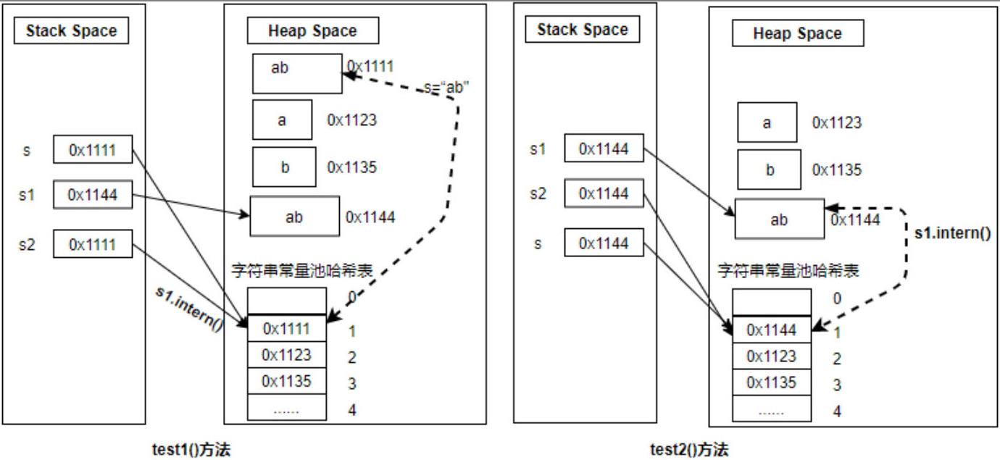

### 12.4.2 intern()方法的好处

​	根据上一个小节的分析，JDK 7及其之后的版本，intern()方法可以直接把堆中的字符串对象的地址放到字符串常量池表共享，从而达到节省内存的目的。

​	下面通过一段代码，分别测试不用intern()方法和使用intern()方法的字符串对象的个数及其内存占用情况。

<span style="color:#40E0D0;">案例1：不使用intern()和使用intern()对象个数和内存占用区别</span>

- 代码

```java
/**
 * 使用intern()测试执行效率和空间使用
 * 结论：对于程序中大量存在的字符串，尤其其中存在很多重复字符串时，使用intern()可以提升效率、节省内存
 */
public class StringIntern3 {
    static final int MAX_COUNT = 1000 * 10000;
    static final String[] arr = new String[MAX_COUNT];
    static Integer[] data = new Integer[]{1, 2, 3, 4, 5, 6, 7, 8, 9, 10};

    public static void main(String[] args) {
        long start = System.currentTimeMillis();
        for (int i = 0; i < MAX_COUNT; i++) {
            arr[i] = new String(String.valueOf(data[i % data.length])); // 花费的时间为：7370ms 占用的内存：522701400B
//            arr[i] = new String(String.valueOf(data[i % data.length])).intern(); // 花费的时间为：1225ms 占用的内存：115062944B
        }
        long end = System.currentTimeMillis();
        System.out.println("花费的时间为：" + (end - start));
        long totalMemory = Runtime.getRuntime().totalMemory();
        long freeMemory = Runtime.getRuntime().freeMemory();
        System.out.println("占用的内存：" + (totalMemory - freeMemory));

        try {
            Thread.sleep(1000000);
        } catch (InterruptedException e) {
            e.printStackTrace();
        }
    }
}
```

​	从上面的内存监测样本可以得出结论，程序中存在大量字符串，尤其存在很多重复字符串时，使用intern()可以大大节省内存空间。例如大型社交网站中很多人都存储北京市海淀区等信息，这时候如果字符串调用intern()方法，就会明显降低内存消耗。

## 12.5 字符串常量池的垃圾回收

​	字符串常量池中存储的虽然是字符串常量，但是依然需要垃圾回收。我们接下来验证字符串常量池中是否存在垃圾回收操作。首先设置JVM参数“-Xms15m -Xmx15m -XX:+PrintStringTableStatistics -XX:+PrintGCDetails”，然后分别设置不同的运行次数，其中“-XX:+PrintStringTableStatistics”参数可以打印StringTable的使用情况，测试代码如下面代码所示。

<span style="color:#40E0D0;">案例1：验证StringTable中是否存在垃圾回收</span>

- 代码

```java
/**
 * String的垃圾回收：
 * -Xms15m -Xmx15m -XX:+PrintStringTableStatistics -XX:+PrintGCDetails
 */
public class StringGCTest {
    public static void main(String[] args) {
        for (int i = 0; i < 100000; i++) {
            String.valueOf(i).intern();
        }
    }
}
```

​	当循环次数为100次时，关于StringTable statistics的统计信息如下图所示，图中方框标记内容为堆空间中StringTable维护的字符串的个数，并没有GC信息。

<div style="text-align:center;font-weight:bold;">循环次数为100次时字符串的个数</div>

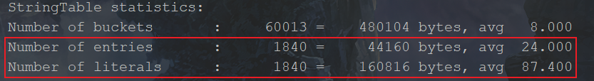

​	当循环次数为10万次时，关于StringTable statistics的统计信息如下图所示，堆空间中StringTable维护的字符串的个数就不足10万个，并且出现了GC信息。说明此时进行了垃圾回收使得堆空间的字符串信息下降了。

<div style="text-align:center;font-weight:bold;">循环次数为10万次时字符串的个数及GC信息</div>

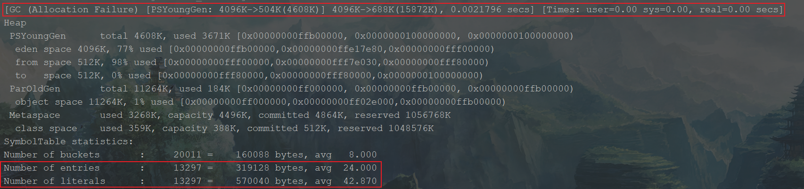

## 12.6 G1中的String去重操作

​	不同的垃圾收集器使用的算法是不同的，其中G1垃圾收集器对字符串去重的官方说明如下图所示，官方文档可扫码查看。

<div style="text-align:center;font-weight:bold;">官方G1对字符串去重的说明</div>

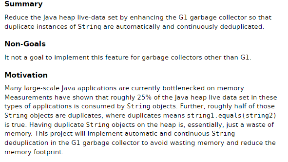

​	上面内容大致意思就是许多大型Java应用的瓶颈在于内存。测试表明，在这些类型的应用里面，Java堆中存活的数据集合差不多25%是字符串对象。更进一步，这里面差不多一半字符串对象是重复的，重复的意思是指string1.equals(string2)的结果是true。堆上存在重复的字符串对象必然是一种内存的浪费。在G1垃圾收集器中实现自动持续对重复的字符串对象进行去重，这样就能避免浪费内存。那么G1垃圾收集器是如何对字符串进行去重的呢？

​	收集器是如何对字符串进行去重的呢？

1. 当垃圾收集器工作的时候，会访问堆上存活的对象。对每一个访问的对象，都会检查是否为候选的要去重的字符串对象。
2. 如果是，把这个对象的一个引用插入到队列中等待后续的处理。一个去重的线程在后台运行，处理这个队列。处理队列的一个元素意味着从队列删除这个元素（这个元素就是一个引用），然后尝试去重它引用的字符串对象。
3. 使用一个哈希表(HashTable)来记录所有的被字符串对象使用的不重复的char数组。当去重的时候会查这个哈希表，来看堆上是否已经存在一个一模一样的char数组。
4. 如果存在，字符串对象会被调整引用那个数组，释放对原来的数组的引用，最终会被垃圾收集器回收。
5. 如果查找失败，char数组会被插入到HashTable，这样以后就可以共享这个数组了。

​	实现对字符串对象去重的相关命令行选项如下。

1. UseStringDeduplication(bool)：开启String去重，默认是不开启，需要手动开启。
2. PrintStringDeduplicationStatistics(bool)：打印详细的去重统计信息。
3. StringDeduplicationAgeThreshold(uintx)：达到这个年龄的字符串对象被认为是去重的候选对象。

# 第二篇 垃圾收集篇

# 第13章 垃圾收集篇

​	垃圾收集(Garbage Collection,GC)并不是Java语言所独有的，早在1960年，Lisp语言中就已经开始使用内存的动态分配和垃圾收集技术。可见，在很早以前，程序运行中产生的垃圾如何处理就已经引起了开发人员的重视。

## 13.1 什么是垃圾

​	前面已经提过，垃圾收集技术并不是Java语言所独有的，如今垃圾收集技术已经是现代开发语言的标配了。但垃圾收集技术却是Java语言的招牌能力，其优秀的垃圾收集机制极大地提高了开发效率。即使经过长时间的发展，Java的垃圾收集机制仍在不断演进变化，这是因为，不同的设备、不同的应用场景，对垃圾收集机制提出了更高的挑战。想要搞清楚垃圾收集机制，首先要弄清楚第一个问题：什么是垃圾？

​	在Java官网中，对垃圾的定义为：“An object is considered garbage when it  can no longer be reached from any pointer in the running program.”意思是，在运行的程序中，当一个对象没有任何指针指向它时，它就会被视为垃圾。

​	由此可以看出，判断一个对象是否为垃圾对象的关键标准就是是否有指针指向它。当一个对象没有任何指针指向它时，即说明该对象不再被引用。如果一个对象不被引用之后还继续留在内存中，被占用的空间也无法被其他对象使用，如果这些垃圾对象所占用的空间一直保留至程序结束，随着垃圾对象越来越多，将可能导致内存溢出。对这种垃圾对象的清理就类似于我们熟悉的磁盘碎片整理，通过定时清理磁盘中的垃圾碎片，可以有效提升空间利用率。

​	那么，如何判断一个对象是否有指针指向它呢？关于这一问题，开发人员有很多探讨，诞生了众多对象存活判定算法。这些内容将在14.1节中做详细讲解。

## 13.2 为什么需要垃圾收集

​	现在，我们来回答第二个问题：为什么需要垃圾收集？

​	对于高级语言来说，一个基本认知是如果不进行垃圾收集，内存迟早都会被消耗完。因为不断地分配内存空间而不进行回收，就好像不停地生产生活，而从来不打扫垃圾一样。

​	垃圾对象可能散列在任意位置，它所占用的内存被回收后，就会出现零零散散的空位，这些零散的内存利用率是很低的，当需要申请一个较大对象的内存时，可能出现找不到一整块连续的可用的存储空间，所以垃圾收集不仅是把垃圾对象所占用的内存进行回收，还涉及内存的整理。这就好比生活中的清洁、整理等家务，不仅要把垃圾扔掉，还要对物品进行规整，重新摆放，才能让家里看起来更干净整洁、空间利用率更高。

​	随着应用程序所应付的业务越来越庞大、复杂，用户越来越多，没有垃圾收集就不能保证应用程序的正常进行。

## 13.3 如何进行垃圾收集

### 13.3.1 早期垃圾收集

​	那如何进行垃圾收集呢？

​	在早期的C/C++时代，垃圾收集基本上是手工进行的。开发人员使用new关键字申请内存，使用delete关键字释放内存。以下是C++里面申请和释放内存的代码。

```c++
MibBridge *pBridge = new cmBaseGroupBridge();
// 如果注册失败，使用delete释放该对象所占内存区域
if (pBridge->Register(kDestroy) != NO_ERROR)
    delete pBridge;
```

​	这种方式可以灵活决定内存释放的时间，但是却给开发人员带来了很大的负担。因为开发人员必须在代码中频繁申请内存和释放内存，倘若有一些对象由于程序员的编码疏忽，忘记了释放内存，这些垃圾对象永远没有被清除，随着系统运行时间的不断增长，垃圾对象所耗内存可能持续上升，直至出现内存溢出，造成应用程序崩溃。

​	在有了垃圾收集机制可以自动回收垃圾对象的内存后，上述代码极有可能变成下面这样，不需要再去手动释放内存，等待回收机制自动处理即可。

```c++
MibBridge *pBridge = new cmBaseGroupBridge();
// 如果注册失败，使用delete释放该对象所占内存区域
pBridge->Register(kDestroy)
```

​	现在，除了Java以外，C#、Python、Ruby等语言都使用了自动垃圾收集的思想，这也是未来的发展趋势。可以说，这种自动化的内存分配和垃圾收集的方式已经成为现代开发语言的标配。

### 13.3.2 Java垃圾收集机制

​	Java使用的是自动内存管理机制，有内存分配器和垃圾收集器来代为分配和回收内存。自动内存管理机制使开发人员无须参与内存的分配和回收，将开发人员从繁重的内存管理工作中解放出来，同时降低了内存泄漏和内存溢出的风险。

​	但是对于Java开发人员来说，自动内存管理就像一个黑匣子，如果过度依赖它，将会弱化开发人员在程序出现内存溢出等问题时定位和解决问题的能力。所以，了解JVM的自动内存分配和垃圾收集机制就显得非常重要，只有在真正了解JVM是如何管理内存后，我们才能够在遇见OutOfMemoryError问题时，快速地根据错误异常日志定位并解决问题。

​	如下图所示，Java的垃圾收集机制主要作用于运行时数据区中的堆和方法区（图中的虚线区域）。其中，堆是垃圾收集器的工作重点。

<div style="text-align:center;font-weight:bold;">GC的作用区域</div>


​	Java的垃圾收集机制中有两个十分重要的概念，也是我们需要重点了解和学习的，分别是垃圾收集算法和分代算法。

​	在JVM中，垃圾收集算法主要有以下三种。

1. 标记-清除算法。
2. 复制算法。
3. 标记压缩算法。

​	详细讲解。三种算法各有利弊，单独采用其中任何一种算法，都不能取得很好的效果。所以在JVM中，会针对内存的不同区域采用不同的垃圾收集算法，这就是分代算法。具体的内存区域如何划分，不同分区又需要采取何种垃圾收集算法，在第14章中将会详细讲解。

# 第14章 垃圾收集相关算法

​	<span style="color:red;font-weight:bold;">垃圾回收可以分成两个阶段，分别是标记阶段和清除阶段</span>，本章将重点讲解两个阶段各自使用的算法。标记阶段的任务是标记哪些对象是垃圾，<span style="color:red;font-weight:bold;">标记算法包括引用计数算法和可达性分析算法</span>。清除阶段的任务是清除垃圾对象，<span style="color:red;font-weight:bold;">清除算法包括标记–清除算法、复制算法和标记–压缩算法</span>。此外本章还将介绍分代收集算法、增量收集算法、分区算法和对象的finalization机制。

## 14.1 对象存活判断

​	在堆里存放着几乎所有的Java对象实例，在GC执行垃圾回收之前，首先需要区分出内存中哪些是存活对象，哪些是已经死亡的对象。只有被标记为死亡的对象，GC才会在执行垃圾回收时，释放掉其所占用的内存空间，这个过程我们可以称为垃圾标记阶段。

​	那么在JVM中究竟是如何标记一个死亡对象呢？简单来说，当一个对象已经不再被任何的存活对象继续引用时，就可以宣判为已死亡。

​	判断对象存活一般有两种方式：引用计数算法和可达性分析算法。

### 14.1.1 引用计数算法

​	引用计数算法(Reference Counting)比较简单，对每个对象保存一个整型的引用计数器属性，用于记录对象被引用的次数。

​	对于一个对象A，只要有任何一个对象引用了A，则A的引用计数器就加1；当引用失效时，引用计数器就减1。只要对象A的引用计数器的值为0，即表示对象A不可能再被使用，可进行回收。

​	引用计数算法的优点是实现简单，垃圾对象便于辨识，判定效率高，回收没有延迟性。但是引用计数算法也存在如下几个缺点：

1. 每个对象需要单独的字段存储计数器，这样的做法增加了存储空间的开销。
2. 每次赋值操作都需要更新计数器，伴随着加法和减法操作，这增加了时间开销。
3. 每个对象需要单独的字段存储计数器，这样的做法增加了存储空间的开销。每次赋值操作都需要更新计数器，伴随着加法和减法操作，这增加了时间开销。另外，引用计数器有一个严重的问题，即无法处理循环引用的情况。比如有对象A和对象B，对象A中含有对象B的引用，对象B中又含有对象A的引用。此时对象A和对象B的引用计数器都不为0，但是系统中却不存在任何第3个对象引用了对象A或对象B。也就是说对象A和对象B是应该被回收的垃圾对象，但由于垃圾对象之间互相引用，从而使垃圾回收器无法识别，引起内存泄漏，如下图所示。这是一条致命缺陷，所以目前主流的JVM都摒弃了该算法。

<div style="text-align:center;font-weight:bold;">对象的循环引用</div>


​	下面我们使用代码来证明目前HotSpot的虚拟机中没有使用引用计数算法来判断对象是否可以回收，如下代码所示。

<span style="color:#40E0D0;">案例1：证明Java中没有使用引用计数法</span>

- 代码

```java
/**
 * -XX:+PrintGCDetails
 * 发现能回收，证明Java使用的不是引用计数算法。
 */
public class RefCountGC {
    // 这个成员属性唯一的作用就是占用一点内存
    private byte[] bigSize = new byte[5 * 1024 * 1024]; // 5MB

    Object reference = null;


    public static void main(String[] args) {
        RefCountGC obj1 = new RefCountGC();
        RefCountGC obj2 = new RefCountGC();

        obj1.reference = obj2;
        obj2.reference = obj1;

        obj1 = null;
        obj2 = null;

        // 显式的执行垃圾回收行为
        // 这里发生GC，obj1和obj2能否被回收？
        System.gc();
    }
}
```

​	如果HotSpot中使用了引用计数算法，那么就算把obj1和obj2的引用置为null，在Java堆当中的两块对象依然保持着互相引用，将会导致两个对象内存无法回收，如下图所示。

<div style="text-align:center;font-weight:bold;">对象引用示意图</div>

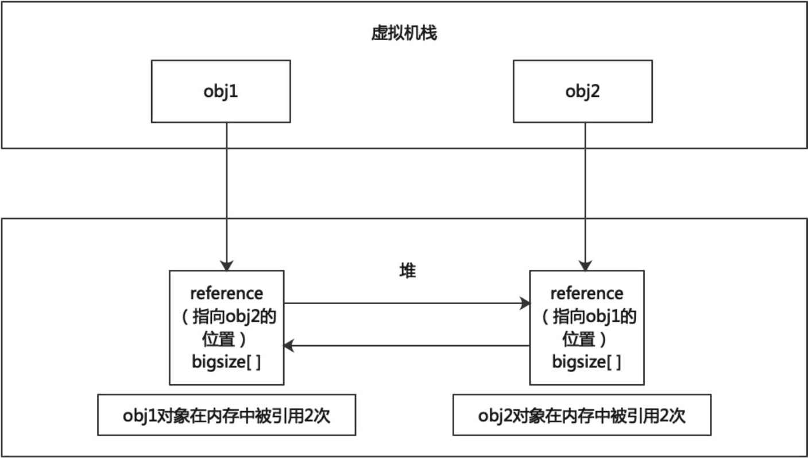

​	然而运行程序，并打印GC详细信息显示堆区所占的空间为650K，远远小于10M，表示obj1和obj2的对象被Java的垃圾回收机制给回收了，否则obj1和obj2各有一个5M的bigSize数组实例对象，堆内存将超过10M。所以目前HotSpot的虚拟机的垃圾标记阶段没有采用引用计数算法。程序运行结果的GC信息如下图所示。

<div style="text-align:center;font-weight:bold;">代码运行结果图</div>

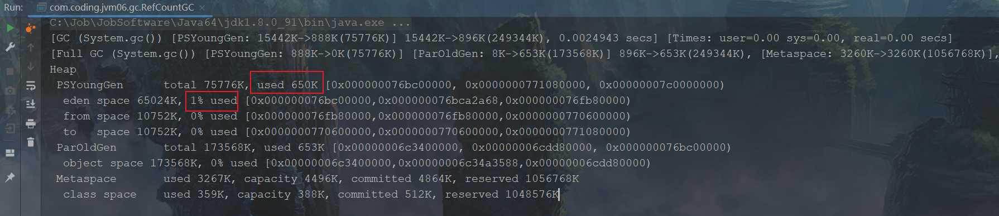

​	Java没有选择引用计数，是因为其存在一个基本的难题，也就是很难处理循环引用关系。但并不是所有语言都摒弃了引用计数算法，例如Python语言就支持引用计数算法，在Python语言中可以采用手动解除或者使用弱引用(Weakref)的方式解决循环引用，但是如果处理不当，循环引用就会导致内存泄漏。

### 14.1.2 可达性分析算法

​	相对于引用计数算法而言，可达性分析算法同样具备实现简单和执行高效等特点，更重要的是，该算法可以有效地解决在引用计数算法中循环引用的问题，防止内存泄漏的发生，这个算法目前较为常用。

​	Java语言选择使用可达性分析算法判断对象是否存活。这种类型的垃圾收集通常叫作追踪性垃圾收集(Tracing Garbage Collection)，它的基本流程如下。

​	可达性分析算法是以GC Root（根对象）（见14.2.1节）为起始点，按照从上至下的方式搜索被根对象集合所连接的目标对象是否可达。GC Root不止一个，它们构成了一个集合，称为“GC Roots”，所谓“GC Roots”集合就是一组必须活跃的引用。

​	使用可达性分析算法后，内存中的存活对象都会被根对象集合直接或间接连接着，搜索所走过的路径称为引用链(Reference Chain)。如果目标对象没有在引用链上，则表示对象是不可达的，就意味着该对象已经死亡，可以标记为垃圾对象。即在可达性分析算法中，只有引用链上的对象才是存活对象。

## 14.2 GC Roots集合

​	在可达性分析算法中使用了GC Root，那么GC Roots集合中就是一组必须活跃的引用。那么哪些对象的引用需要放到GC Roots集合呢？

### 14.2.1 GC Roots

​	在Java语言中，GC Roots集合中的对象引用包括以下几种类型。

1. 虚拟机栈中对象的引用，比如，各个线程被调用的方法中使用到的引用数据类型的参数、局部变量等。
2. 本地方法栈内JNI（本地方法）对象的引用。
3. 方法区中引用数据类型的静态变量。
4. 方法区中常量对象的引用，比如字符串常量池(String Table)里的引用。
5. 所有被同步锁synchronized持有的对象引用。
6. JVM内部的引用。基本数据类型对应的Class对象引用，一些常驻的异常对象引用（如NullPointerException、OutOfMemoryError），系统类加载器对象引用等。
7. 反映JVM内部情况的JMXBean、JVMTI中注册的回调、本地代码缓存对象的引用等。

​	GC Roots内存引用示例如图14-4所示。左侧表示GC Roots，右侧分为ReachableObjects（可达对象）和Unreachable Objects（不可达对象），其中不可达对象就是所谓的垃圾对象。就好比果园里面的果树，如果水果长在树上，肯定是可以根据树根找到水果的，此时水果就不是垃圾；如果水果掉落到地上，此时树根无法连接水果，掉落的水果就是垃圾。

<div style="text-align:center;font-weight:bold;">GC Roots内存引用示例图</div>

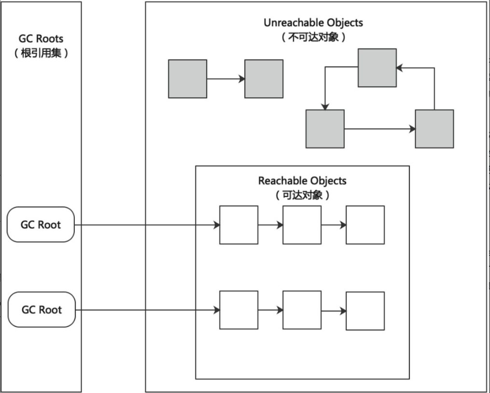

​	除了这些固定的GC Roots集合以外，根据用户所选用的垃圾收集器以及当前回收的内存区域不同，还可以有其他对象“临时性”地加入，共同构成完整的GCRoots集合。

​	 另外，如果只针对Java堆中的某一块区域进行垃圾回收（比如新生代），必须考虑到内存区域是JVM自己的实现细节，而不是孤立封闭的，这个区域的对象完全有可能被其他区域的对象所引用，这时候就需要一并将关联的区域对象加入GC Roots集合中去考虑，才能保证可达性分析的准确性。

​	<span style="color:#9400D3;">如果要使用可达性分析算法来判断内存是否可回收，那么分析工作必须在一个能保障一致性的快照中进行</span>。这点不满足的话分析结果的准确性就无法保证，这也是导致垃圾回收时必须STW（Stop The World，整个应用程序暂停一段时间）的一个重要原因。即使是号称不会发生停顿的CMS收集器中，枚举根节点时也是必须要停顿的。

### 14.2.2 MAT追踪GC Roots的溯源

​	MAT是Memory Analyzer的简称，它是一款功能强大的Java堆内存分析器。MAT是基于Eclipse开发的，是一款免费的性能分析工具。MAT可以用于查找内存泄漏以及查看内存消耗情况。下面我们使用MAT查看哪些对象是GC Root。

​	大家可以在 https://www.eclipse.org/mat/download 下载并使用MAT。

> 启动报错咋办？
> https://www.cnblogs.com/hong0632/p/8677853.html

<div style="text-align:center;font-weight:bold;">MAT版本与JDK版本的关系</div>

| MAT版本                        | JDK版本 |
| ------------------------------ | ------- |
| MemoryAnalyzer-1.15.0.20231206 | 17+     |
| MemoryAnalyzer-1.14.0.20230315 | 17+     |
| MemoryAnalyzer-1.13.0.20220615 | 11+     |
| MemoryAnalyzer-1.12.0.20210602 | 11+     |
| MemoryAnalyzer-1.11.0.20201202 | 1.8+    |

<span style="color:#40E0D0;">案例1：MAT分析GC Roots</span>

- 代码

```java
public class GCRootsTest {
    public static void main(String[] args) {
        List<Object> numList = new ArrayList<Object>();
        Date birth = new Date();

        for (int i = 0; i < 100; i++) {
            numList.add(String.valueOf(i));
            try {
                Thread.sleep(10);
            } catch (InterruptedException e) {
                e.printStackTrace();
            }
        }
        System.out.println("数据添加完毕，请操作：");
        // next()方法等着用户输入数据，是一个阻塞方法，此时留出时间，可以给内存拍照，生成dump文件
        new Scanner(System.in).next();
        numList = null;
        birth = null;

        System.out.println("numList、birth已置空，请操作：");
        new Scanner(System.in).next();
        System.out.println("结束");
    }
}
```

​	分析堆内存之前，首先需要获取dump文件。dump文件又叫内存转储文件或内存快照文件，是进程的内存镜像。dump文件中包含了程序运行的模块信息、线程信息、堆栈调用信息、异常信息等数据。获取dump文件有两种方式，分别是使用命令jmap和使用jvisualvm工具。

1. 使用命令jmap。
   - 运行GCRootsTest程序后，使用jps命令查询到GCRootsTest进程pid，再使用命令jmap –dump:format=b,live,file就可以导出堆内存文件。可以分别在两次等待键盘输入时，使用jmap命令生成dump文件。

<div style="text-align:center;font-weight:bold;">使用命令行生成dump文件</div>

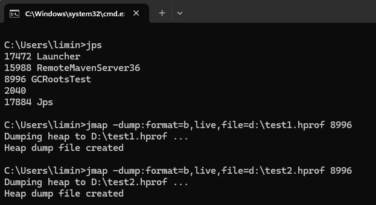

2. 使用jvisualvm工具。

   - 使用VisualVM Launcher插件运行JDK自带的jvisualvm.exe工具捕获的heapdump文件是一个临时文件，关闭jvisualvm后自动删除，若要保留，需要将其另存为文件。使用VisualVM Launcher插件启动GCRootsTest程序之后，可通过以下方法存储dump文件。

     1. 在左侧“应用程序”子窗口中右击相应的应用程序（例如，com.coding.jvm06.gc.GCRootsTest）。
     2. 在右侧“监视”子标签页中单击“堆Dump”按钮。
     3. 本地应用程序的堆作为应用程序标签页的一个子标签页打开。同时，堆在左侧的应用程序栏中对应一个含有时间戳的节点。右击这个节点选择“另存为(S)”即可将堆保存到本地。

     <div style="text-align:center;font-weight:bold;">dump文件概要及另存为操作示意图</div>

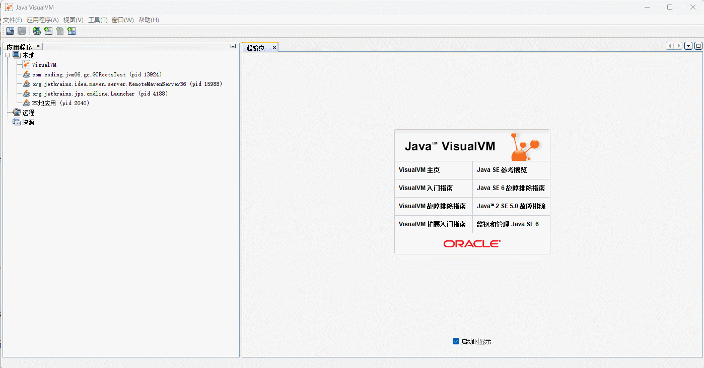

​	堆文件已经准备就绪，下面就需要分析哪些对象是GC Root了。[Eclipse中对Garbage Collection Roots的官方描述](https://help.eclipse.org/latest/index.jsp?topic=/org.eclipse.mat.ui.help/welcome.html)。

​	使用Memory Analyzer工具查看jvisualvm导出的dump文件的步骤如下。

1. 打开Memory Analyzer工具，单击“File”中的“Open File”选择要打开的dump文件。
2. 当打开dump文件后选择设置中的“Java Basics”下的“GC Roots”，单击打开。
3. 当打开文件后在Thread下找到main主线程后单击打开。
4. 可以看到String、ArrayList、Date都作为GC Root出现了，当前程序主线程GC Roots中共有21个实体。

<div style="text-align:center;font-weight:bold;">用Memory Analyzer打开dump文件</div>

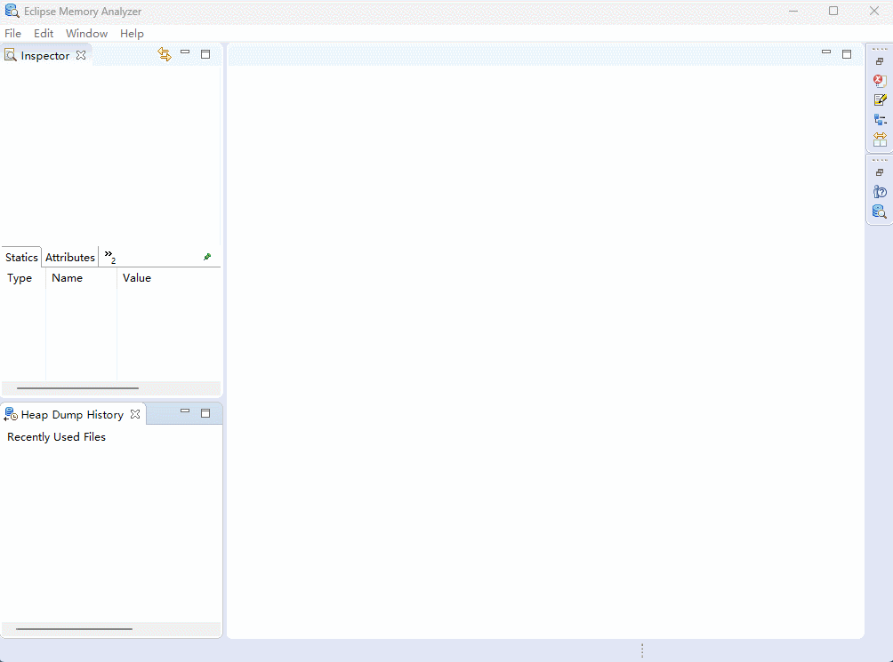

<div style="text-align:center;font-weight:bold;">查看当前程序主线程中所有的GC Root</div>

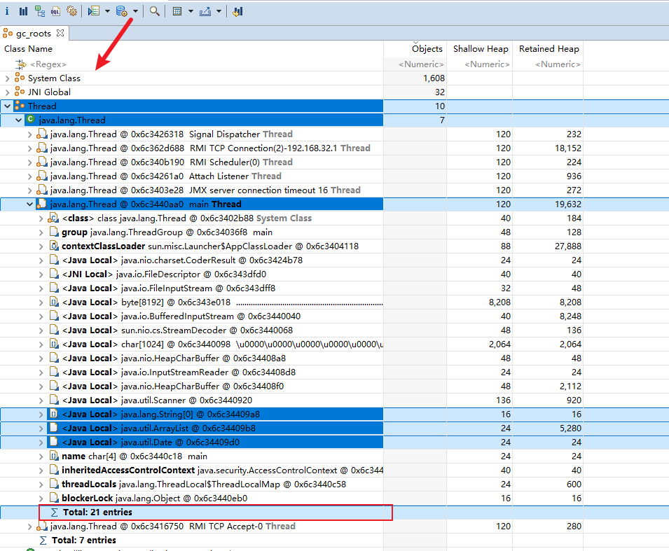

​	继续执行程序，程序中将numList和birth变量值修改为“null”后，用上述同样方法再保存一个dump文件，之后再用Memory Analyzer工具打开，如图所示，可以看出图中的ArrayList和Date实体类都消失了，当前程序的主线程中GCRoots还有19个实体。

<div style="text-align:center;font-weight:bold;">查看当前程序主线程中剩余的GC Root</div>

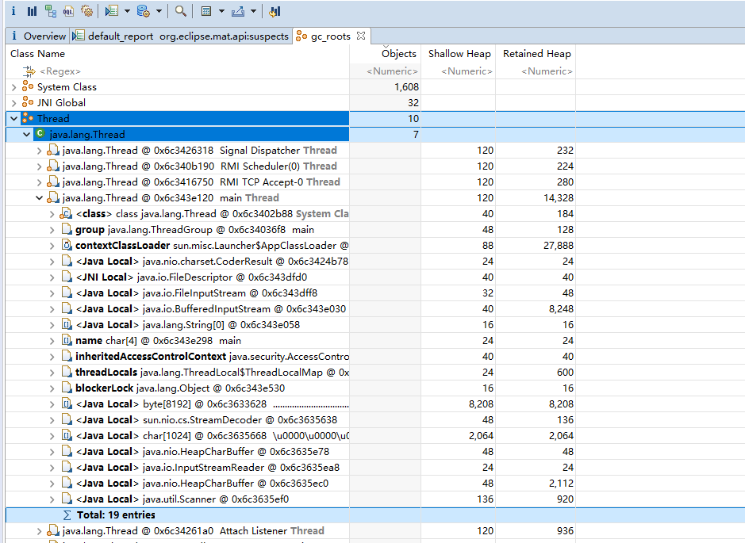

### 14.2.3 JProfiler追踪GC Roots的溯源

​	另外，也可以使用Java剖析工具JProfiler进行GC Roots的溯源。JProfiler是一个独立的应用程序，但它提供Eclipse和IntelliJ IDEA等IDE的插件。安装好JProfiler程序之后，就可以与IntelliJ IDEA集成，之后就可以在IDEA中通过JProfiler插件启动运行了。

​	大家可以在https://www.ej-technologies.com/jprofiler/download下载并使用JProfiler。

1. 在IDEA中用JProfiler插件运行JProfiler程序。

<div style="text-align:center;font-weight:bold;">在IDEA中运行JProfiler程序</div>


2. 当程序运行起来之后，JProfiler便会监控该程序的内存、线程、类、对象的变化。选中左侧“Live memory（实时内存）”当前动态的内存情况，在“All Objects（所有对象）”中可以看到当前程序中所有对象的个数。

<div style="text-align:center;font-weight:bold;">JProfiler中动态内存所有对象统计图</div>

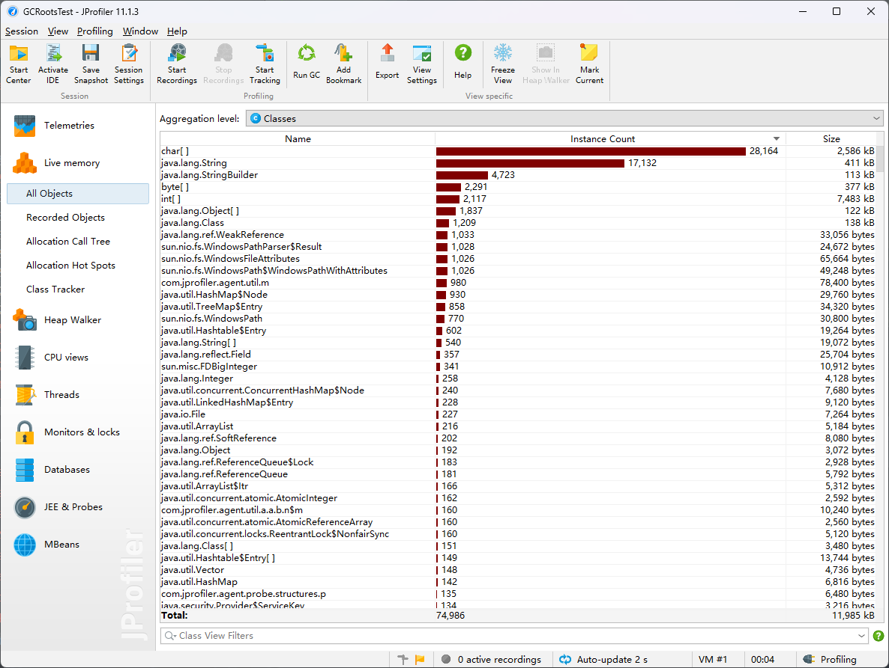

3. 此时选择“View（视图）”菜单中的“Mark Current Values（标记当前值）”选项标记当前的值，标记后所有对象数量的显示颜色为绿色。

<div style="text-align:center;font-weight:bold;">JProfiler中动态内存标记当前值</div>

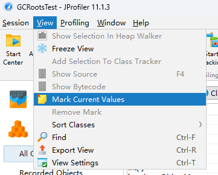

4. 随着程序的运行，对象数量的颜色可能会发生变化，左半部分的区域表示截至标记时刻内存中的对象数量，颜色发生变化的右边区域表示从标记开始之后对象数量的变化，从“Difference（相差）”值列中也可以看到详细的数量变化。我们可以根据对象数量的变化来分析内存的变化，例如String类型的对象在标记之后增加了6个。

<div style="text-align:center;font-weight:bold;">JProfiler中动态内存标记之后的变化</div>


5. 如果需要单独查询某个类型的对象数据，鼠标右击该类型，在弹出的上下文菜单中选择“Show Selection In Heap Walker（在堆遍历器中显示所选内容）”进行单独查询。下面我们单独查询对象数量最多的char[]类型数组的数据。

<div style="text-align:center;font-weight:bold;">选择单独查询char[]类型数组对象信息</div>

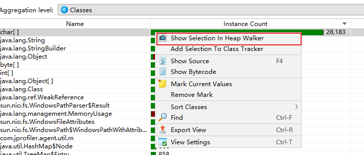

6. 进入单独查询char[]类型的对象时，可以看出包含了和char[]类型数组对象有关的Classes、Allocations、Biggest Objects、References等信息。

<div style="text-align:center;font-weight:bold;">char[​]类型数组对象相关信息查询页</div>

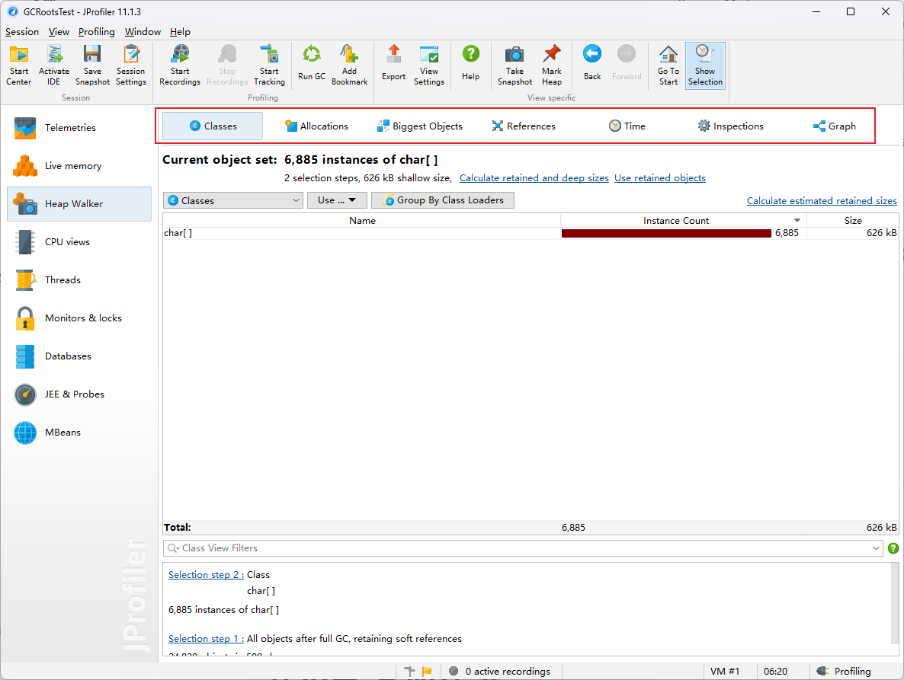

7. 下面我们重点关注char[]类型数组的相关引用，选择“References（引用）”时我们看到了所有char[]类型数组对象的引用信息，如下图所示。进行排查内存泄漏问题时可以进行溯源。

<div style="text-align:center;font-weight:bold;">所有char[]类型数组对象的相关引用</div>

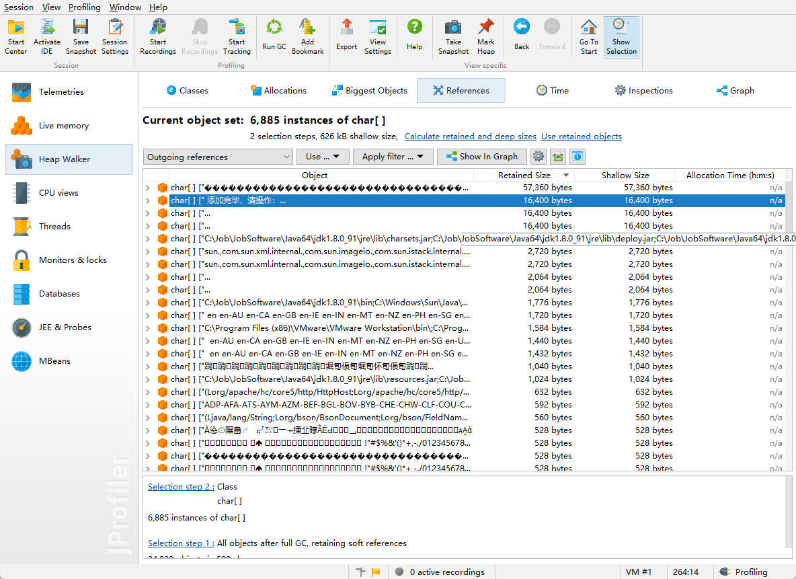

8. 此时选中“Incoming references（传入引用）”，如下图所示。Incoming references表示查看当前对象被哪些外部对象引用，据此可以判断当前对象和哪个GC Root相关联。

<div style="text-align:center;font-weight:bold;">选择具体char[]类型数组对象引用信息</div>

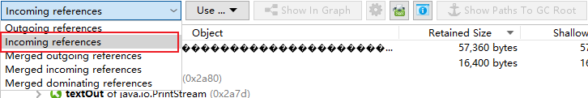

9. 例如选中“char[] ［"添加完毕，请操作：..."］”这个char[]类型数组对象，再单击“Show Paths To GC Root（显示到GC Root的路径）”按钮，可以查看它被GC Root引用，如下图所示。

<div style="text-align:center;font-weight:bold;">查询“char[​] ［"添加完毕，请操作：..."］”这个char[​]类型数组的GC Root</div>

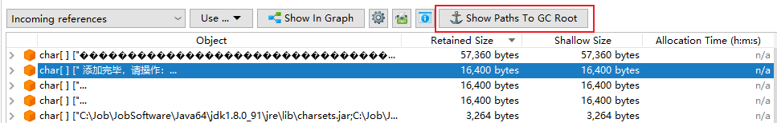

10. 在弹出的对话框中，选择“Single root（单根）”，单击“OK”，如下图所示。

<div style="text-align:center;font-weight:bold;">选择Single root（单根）</div>


11. 如下图所示，显示了“char[] ［"添加完毕，请操作：..."］”这个char[]类型数组对象的GC Root是System.out对象。

<div style="text-align:center;font-weight:bold;">查看“char[] ［"添加完毕，请操作：..."］”这个char[]类型数组对象GC Root的来源</div>

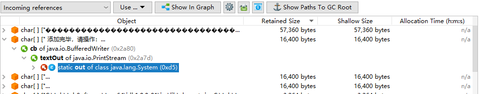

## 14.3 对象的finalization机制

​	Java语言提供了对象终止(finalization)机制来允许开发人员自定义对象被销毁之前的处理逻辑。当垃圾回收器发现没有引用指向一个对象时，通常接下来要做的就是垃圾回收，即清除该对象，而finalization机制使得在清除此对象之前，总会先调用这个对象的finalize()方法。

​	finalize()方法允许在子类中被重写，用于在对象被回收时进行资源释放或清理相关内存，例如关闭文件、套接字和数据库连接等。但是，不要过分依赖对象的finalize()方法来释放资源，最好有其他的方法来释放资源，例如手动调用close()方法，理由如下。

1. 在调用finalize()方法时可能会导致对象复活，即在finalize()方法中当前对象this又被赋值给了一个有效的变量引用。
2. 一个糟糕的finalize()会严重影响GC的性能，而长时间的GC是会影响程序运行性能和体验的。
3. finalize()方法的执行时间是没有保障的，它完全由GC线程决定，极端情况下，若不发生GC，则finalize()方法将没有执行机会。另外，finalize()方法工作效率很低。如果一个对象在回收前需要调用finalize()方法的话，要先将其加入一个队列，之后由Finalizer线程处理这些对象，而这个线程的优先级非常低，所以很难被CPU执行到，进而导致对象的finalize()方法迟迟不能被执行，资源迟迟不能被释放，对象迟迟不能被垃圾回收。

​	从功能上来说，finalize()方法与C++中的析构函数比较相似，都是用来做清理善后的工作。只不过C++中需要手动调用析构函数清理内存，而Java采用的是基于垃圾回收器的自动内存管理机制。finalize()方法在本质上不同于C++中的析构函数。

​	由于finalize()方法的存在，JVM中的对象一般处于三种可能的状态。如果从所有的根节点都无法访问到某个对象，说明该对象已经不再使用了。一般来说，此对象需要被回收。但事实上，也并非是“非死不可”的，这时候它们暂时处于“缓刑”阶段。一个无法触及的对象有可能在某一个条件下“复活”自己，如果这样，那么对它的回收就是不合理的，为此，定义JVM中的对象可能的三种状态。

1. 可触及的：从根节点开始，可以到达这个对象。
2. 可复活的：对象的所有引用都被释放，但是对象有可能在finalize()中复活。
3. 不可触及的：对象的finalize()被调用，并且没有复活，那么就会进入不可触及状态。不可触及的对象不可能被复活，因为每一个对象的finalize()只会被调用一次。

​	以上三种状态中只有在对象不可触及时才可以被回收。

​	判定一个对象objA是否可回收，至少要经历以下两次标记过程。

1. 如果GC Roots到对象objA没有引用链，则进行第一次标记。
2. 判断此对象是否有必要执行finalize()方法。

​	如果对象objA没有重写finalize()方法，或者finalize()方法已经被JVM调用过，则JVM视为“没有必要执行”，objA被判定为不可触及。

​	如果对象objA重写了finalize()方法，且还未执行过，那么objA会被插入到F-Queue队列中，由一个JVM自动创建的、低优先级的Finalizer线程触发其finalize()方法执行。

​	finalize()方法是对象逃脱死亡的最后机会，稍后GC会对F-Queue队列中的对象进行第二次标记。如果objA在finalize()方法中与引用链上的任何一个对象建立了联系，那么在第二次标记时，objA会被移出“即将回收”集合。之后，对象如果再次出现没有引用存在的情况，finaliz()方法就不会被再次调用，对象会直接变成不可触及的状态，也就是说，一个对象的finalize()方法只会被调用一次。

<span style="color:#40E0D0;">案例1：测试对象的finalization机制</span>

- 代码

```java
/**
 * 测试Object类中finalize()方法，即对象的 finalization 机制。
 */
public class CanReliveObj {

    public static CanReliveObj obj; // 类变量；属于GC Root

    /**
     * 此方法只能被调用1次
     * <p>
     * 【该方法存在时】：
     * 调用当前类重写的finalize()方法
     * 第1次GC
     * obj is still alive
     * 第2次GC
     * obj is dead
     * <p>
     * 【该方法不存在时】：
     * 第1次GC
     * obj is dead
     * 第2次GC
     * obj is dead
     */
    @Override
    protected void finalize() throws Throwable {
        super.finalize();
        System.out.println("调用当前类重写的finalize()方法");
        obj = this; // 当前待回收的对象在finalize()方法中与引用链上的任何一个对象建立了联系，导致当前对象复活
    }

    public static void main(String[] args) {
        try {
            obj = new CanReliveObj();
            // obj 设置为 null，表示 obj 不引用 CanReliveObj 对象了，它成了垃圾对象
            obj = null;
            System.gc(); // 调用垃圾回收器
            System.out.println("第1次GC");
            // 第1次GC时，重写了finalize()方法，finalize()会被调用
            // finalize()方法中，CanReliveObj对象可能复活
            // 因为Finalizer线程优先级很低，暂停2秒，等待它被CPU调度。
            Thread.sleep(2000);
            if (obj == null) {
                System.out.println("obj is dead");
            } else {
                System.out.println("obj is still alive");
            }
            // 下面这段代码与上面的完全相同，但是这次自救失败了。
            obj = null;
            System.gc();
            System.out.println("第2次GC");
            // 因为Finalizer线程优先级很低，暂停2秒，等待它被CPU调度。
            Thread.sleep(2000);
            if (obj == null) {
                System.out.println("obj is dead");
            } else {
                System.out.println("obj is still alive");
            }
        } catch (InterruptedException e) {
            e.printStackTrace();
        }
    }
}
```

​	在没有重写Object类中finalize()方法时，即注释掉上面代码中的finalize()方法，当第一次进行GC时obj对象已经被垃圾回收了，运行结果如下图所示。

<div style="text-align:center;font-weight:bold;">没重写finalize()方法时运行结果</div>

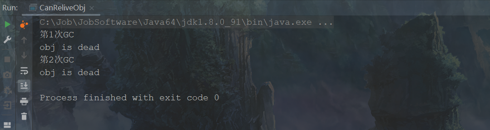

​	当重写Object类中finalize()方法时，当第一次进行GC时调用了finalize()方法，因为在finalize()方法中又让静态变量obj引用了当前对象，所以obj对象就没有被垃圾回收，当第二次进行GC时obj对象才被垃圾回收。运行结果如下图所示。

<div style="text-align:center;font-weight:bold;">重写finalize()方法时运行结果</div>

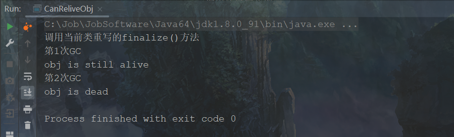

​	上述代码可以看到第一次回收时，对象的finalize()方法被执行，但是它仍然可以存活。但是任何一个对象的finalize()方法都只会被系统自动调用一次，如果面临下一次回收，它的finalize()方法不会被再次执行，因此第2段代码的自救行动就失败了。

## 14.4 清除垃圾对象

​	当成功区分出内存中存活对象和死亡对象后，GC接下来的任务就是执行垃圾回收，释放无用对象所占用的内存空间，以便有足够的可用内存空间分配给新对象。

​	目前在JVM中比较常见的三种垃圾收集算法是标记–清除算法(Mark-Sweep)、复制算法(Copying)、标记–压缩算法(Mark-Compact)。

### 14.4.1 标记–清除算法

​	标记–清除算法是一种非常基础和常见的垃圾收集算法，该算法由J.McCarthy等人在1960年提出并应用于Lisp语言。

​	标记–清除算法的执行过程是当堆中的有效内存空间(Available Memory)被耗尽的时候，就会停止整个程序，然后进行两项工作，一是标记，二是清除。

1. 标记：垃圾收集器从引用根节点开始遍历，标记所有被引用的对象。
2. 清除：垃圾收集器对堆内存从头到尾进行线性遍历，如果发现某个对象为不可达对象，则将其回收。

​	标记–清除算法解析如下图所示。

<div style="text-align:center;font-weight:bold;">标记–清除算法</div>

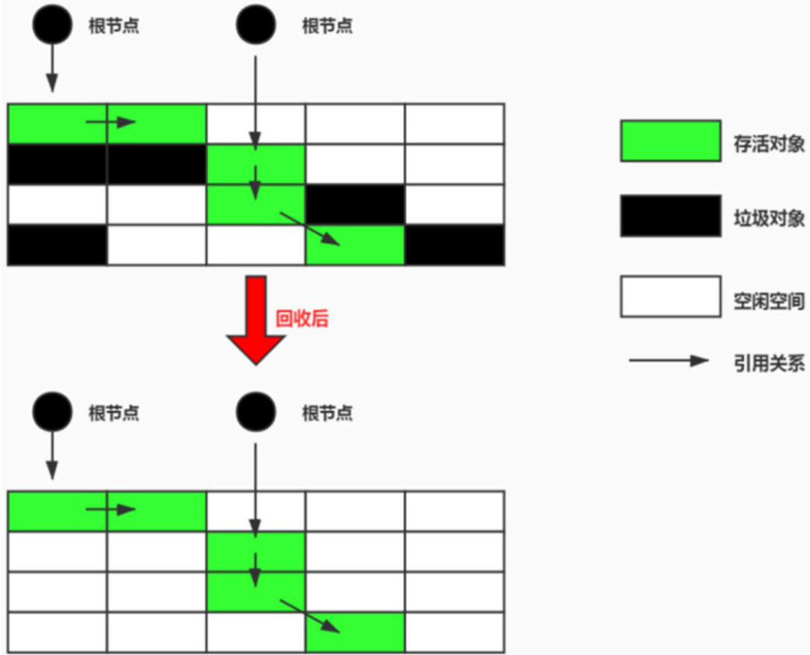

​	标记-清除算法的优点是简单、容易实现，而且不需要移动对象。但是缺点也很明显，在进行GC的时候，需要停止整个应用程序，导致用户体验差。最重要的是这种方式清理出来的空闲内存是不连续的，会产生内存碎片，而且该算法清除对象并不是真的置空，而是把需要清除的对象地址保存在空闲的地址列表里，下次有新对象申请内存时，判断某块内存空间是否充足，如果充足，新的对象将会覆盖原来标记为垃圾的对象，从而实现内存的重复使用。但是因为可用内存不连续问题，在大对象申请内存时，需要花费更多时间去找寻合适的位置，甚至失败。所以标记-清除算法效率不高，且内存利用率低下，甚至有些内存碎片无法重复利用。

### 14.4.2 复制算法

​	为了解决标记—清除算法在垃圾收集中内存利用率低的缺陷，M.L.Minsky于1963年发表了著名的论文《使用双存储区的Lisp语言垃圾收集器》(A Lisp GarbageCollector Algorithm Using Serial Secondary Storage)。M.L.Minsky在该论文中描述的算法被人们称为复制(Copying)算法，它也被M.L.Minsky本人成功地引入到了Lisp语言的一个实现版本中。

​	它的核心思想是将活着的内存空间分为两块，每次只使用其中一块，在垃圾回收时将正在使用的内存中的存活对象复制到未被使用的内存块中，之后清除正在使用的内存块中的所有对象。两块内存交替使用，从而完成垃圾对象的回收，如下图所示。

​	复制算法没有标记和清除过程，实现简单，运行高效。内存从一块空间复制到另一块空间可以保证空间的连续性，不会出现内存碎片问题。但是复制算法需要双倍内存空间，而且需要移动对象，这就涉及修改对象引用地址值的问题。另外，对于G1这种把内存拆分成大量region的垃圾收集器，意味着需要维护各个region之间对象引用关系，在时空消耗方面都不低。

​	特别需要注意的是如果系统中的垃圾对象很少，复制算法不会很理想。因为复制算法需要复制的存活对象数量变大，使得垃圾回收器的运行效率变低。

<div style="text-align:center;font-weight:bold;">复制算法</div>

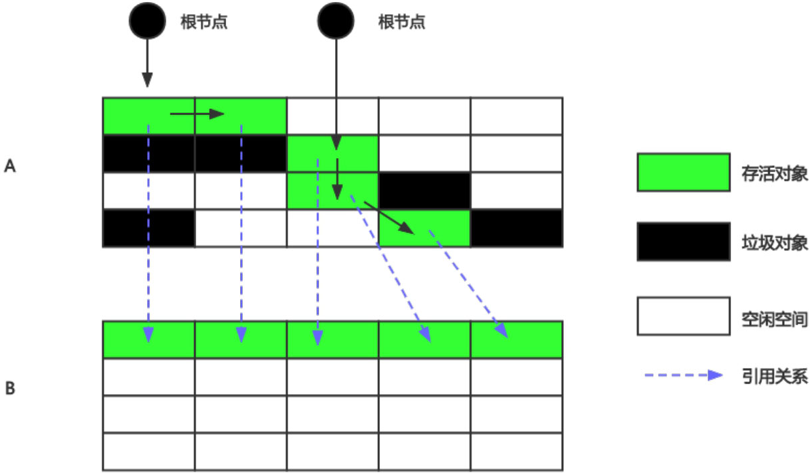

### 14.4.3 标记–压缩算法

​	复制算法的高效性是建立在存活对象少、垃圾对象多的前提下。这种情况在新生代经常发生，但是在老年代，更常见的情况是大部分对象都是存活对象。如果依然使用复制算法，由于存活对象较多，复制的成本也将很高。因此，基于老年代垃圾回收的特性，需要使用其他的算法。

​	标记–清除算法的确可以应用在老年代中，但是该算法不仅执行效率低下，而且在执行完内存回收后还会产生内存碎片，所以JVM的设计者需要重新优化垃圾对象的清除算法。1970年前后，G.L.Steele、C.J.Chene和D.S.Wise等研究者发布了标记–压缩算法。在许多现代的垃圾收集器中，人们都使用了标记–压缩算法。该算法的执行过程如下图所示。

1. 第一阶段和标记–清除算法一样，从根节点开始标记所有被引用对象。
2. 第二阶段将所有的存活对象压缩到内存的一端，按顺序排放。
3. 第三阶段清理边界外所有的空间。

<div style="text-align:center;font-weight:bold;">标记–压缩算法执行过程</div>

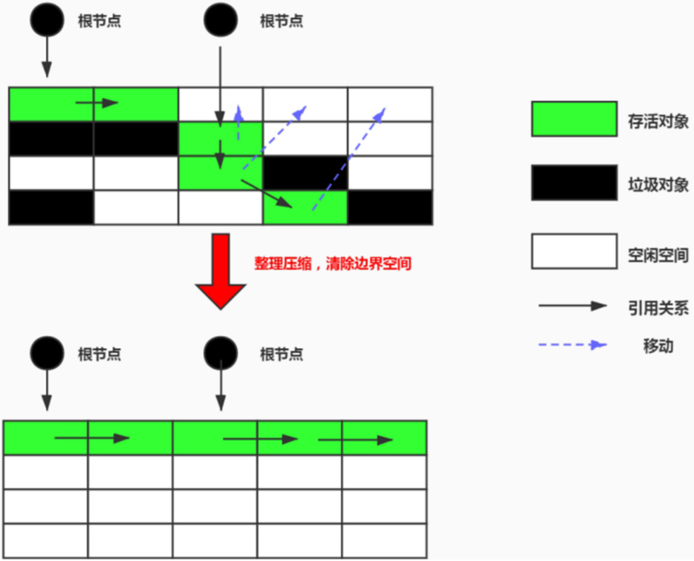

​	标记–压缩算法的最终效果等同于标记–清除算法执行完成后，再进行一次内存碎片整理，因此，也可以把它称为标记–清除–压缩(Mark-Sweep-Compact)算法。

​	二者的本质差异在于标记–清除算法是一种非移动式的回收算法，标记–压缩是移动式的。是否移动回收后的存活对象却是一项优缺点并存的风险决策，优点是避免了内存碎片，也大大简化了可用内存和不可用内存的区分，缺点是移动对象意味着需要修改对象的引用地址值。

​	可以看到，在标记–压缩算法中标记的存活对象将会被整理，按照内存地址依次排列，而未被标记的内存会被清理。如此一来，当我们需要给新对象分配内存时，JVM只需要持有一个可用内存的起始地址即可，这比维护一个空闲地址列表显然少了许多开销。

​	如果内存空间以规整和有序的方式分布，即已用和未用的内存都各自一边，彼此之间维系着一个记录下一次内存分配起始点的标记指针，当为新对象分配内存时，只需要将新对象分配在第一个空闲内存位置上，同时修改指针的偏移量，这种分配方式就叫作指针碰撞(Bump the Pointer)。

​	标记–压缩算法算法的优点如下。

1. 消除了标记–清除算法当中，内存区域分散的缺点，我们需要给新对象分配内存时，JVM只需要持有一个内存的起始地址即可。
2. 消除了复制算法当中，内存减半的高额代价。

​	该算法的缺点如下。

1. 从效率上来说，标记–压缩算法要低于复制算法，因为需要先标记，再整理移动。
2. 另外，如果对象被其他对象引用，移动对象的同时，还需要调整引用的地址。对象移动过程中，需要全程暂停用户应用程序，即STW(Stop The World)。

<div style="text-align:center;font-weight:bold;">三种算法的对比表</div>

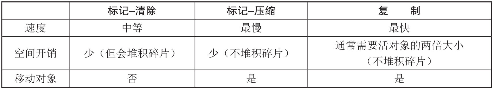

## 14.5 垃圾收集算法的复合与升级

### 14.5.1 分代收集算法

​	前面所有这些算法中，并没有一种算法可以完全替代其他算法，它们都具有自己独特的优势和特点，此时分代收集(Generational Collecting)算法应运而生。

​	在程序开发中，有这样一个既定的事实：不同的对象的生命周期是不一样的。例如有些对象与业务信息相关，比如Http请求中的Session对象、线程对象、Socket连接对象，这类对象跟业务直接挂钩，因此生命周期比较长。但是还有一些对象，主要是程序运行过程中生成的临时变量，这些对象生命周期会比较短，甚至有些对象只用一次即可回收。还有像String这种比较特殊类型的对象，因为对象的不可变性，对String对象的修改、拼接等操作都会产生很多垃圾对象，它们的生命周期也都很短。因此在HotSpot的JVM中，把Java堆分为新生代和老年代，生命周期较短的对象一般放在新生代，生命周期较长的对象会进入老年代。不同区域的对象，采取不同的收集方式，以便提高回收效率。

​	目前几乎所有的垃圾收集器都是采用分代收集算法执行垃圾回收的。基于分代的概念，垃圾收集器所使用的内存回收算法必须结合新生代和老年代各自的特点。

**1 新生代(Young Gen)**

​	新生代特点是区域相对老年代较小，对象生命周期短、存活率低、回收频繁。而复制算法的效率只和当前存活对象数量大小有关，结合新生代的特点，新生代使用复制算法，速度最快、效率也最高。复制算法在新生代，对于常规应用的垃圾回收，一次通常可以回收70%～99%的内存空间，回收性价比很高。所以现在的商业JVM都是用这种收集算法回收新生代。鉴于复制算法内存利用率不高的问题，HotSpot没有把新生区简单地一分为二，而是通过把新生区分为Eden、From和To三个区域，如图14-31所示，每次新生代发生GC时，把Eden区和上次幸存区中在本次GC仍然存活的对象复制到另一个幸存区，幸存区在From区和To区之间切换，总有一块空间为空，从而解决内存利用率低的问题。

<div style="text-align:center;font-weight:bold;">复制算法在新生代的应用场景</div>

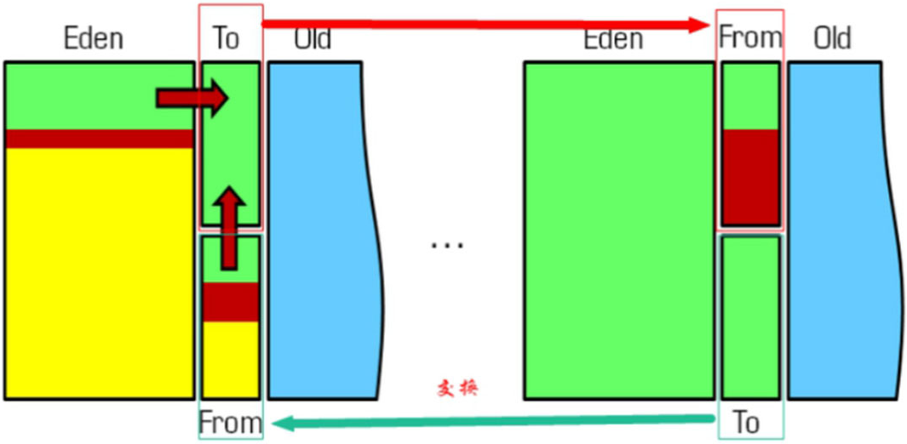

**2 老年代(Tenured Gen)**

​	老年代特点是区域较大，对象生命周期长、存活率高，回收不及新生代频繁。这种情况存在大量存活率高的对象，复制算法明显变得不合适。一般是由标记–清除或者标记–清除与标记–压缩的混合实现。

​	在老年代的收集算法有以下特点：

1. 标记(Mark)阶段的开销与存活对象的数量呈正比。
2. 清除(Sweep)阶段的开销与所管理区域的大小呈正比。
3. 压缩(Compact)阶段的开销与存活对象的数量呈正比。

​	以HotSpot中的CMS(Concurrent Mark Sweep)回收器为例，CMS是基于标记–清除算法实现的，对于对象的回收效率很高。当因为内存碎片导致出现Concurrent Mode Failure异常时，CMS将采用基于标记–压缩算法的Serial Old回收器作为补偿措施，此时Serial Old会执行Full GC以达到对老年代内存的整理。

​	分代的思想被现有的JVM广泛使用，几乎所有的垃圾回收器都区分新生代和老年代。

### 14.5.2 增量收集算法

​	上述现有的算法，在垃圾回收过程中，应用软件将处于一种STW(Stop TheWorld)的状态。在STW状态下，应用程序所有的线程都会挂起，暂停一切正常的工作，等待垃圾回收的完成。如果垃圾回收时间过长，应用程序会被挂起很久，将严重影响用户体验或者系统的稳定性。为了解决这个问题，急需一种实时垃圾收集算法，增量收集(Incremental Collecting)算法由此诞生。

​	增量收集基本思想是如果一次性将所有的垃圾进行处理，会造成系统长时间的停顿，那么就可以让垃圾收集线程和应用程序线程交替执行。每次垃圾收集线程只收集一小片区域的内存空间，接着切换到应用程序线程。依次反复，直到垃圾收集完成。

​	总的来说，增量收集算法的基础仍是传统的标记–清除和复制算法。增量收集算法通过对线程间冲突的妥善处理，允许垃圾收集线程以分阶段的方式完成标记、清理或复制工作。

​	增量收集算法的优点是在垃圾回收过程中，间断性地执行了应用程序代码，从而解决了系统的长时间停顿带来的用户体验差和系统稳定性问题。但是因为线程切换和上下文转换的消耗，会使得垃圾回收的总体成本上升，造成系统吞吐量的下降。

### 14.5.3 分区收集算法

​	一般来说，在相同条件下，堆空间越大，一次GC所需要的时间就越长，有关GC产生的停顿也就越长。为了更好地控制GC产生的停顿时间，将一块大的内存区域分割成多个小块，根据目标的停顿时间，每次合理地回收若干个小区间，而不是整个堆空间，从而减少一次GC所产生的停顿。

​	分代算法按照对象的生命周期长短将堆空间划分成两个部分，分区算法将整个堆空间划分成连续的不同小区间(region)，如下图所示。每一个小区间都独立使用、独立回收。这种算法的好处是可以控制一次回收多少个小区间。

<div style="text-align:center;font-weight:bold;">分区算法示例图</div>


​	大家要注意一点，这些只是基本的算法思路，实际GC实现过程要复杂得多，目前还在发展中的前沿GC都是复合算法，并且并行和并发兼备。

# 第15章 　垃圾收集相关概念

​	通过上一章的学习，让我们对垃圾收集的算法思路有所了解，相当于主体思路有了，但是要把这些算法落地，还涉及很多细节。本章将为大家讲解除了收集算法之外的其他相关技术点，为第16章垃圾收集器的学习扫清障碍。本章讲解的内容包括System.gc()、内存溢出、内存泄漏、STW机制以及垃圾收集的串行、并行、并发三种情况，还有强引用、软引用、弱引用、虚引用四种引用。

## 15.1 System.gc()的理解

​	在默认情况下，通过System.gc()或者Runtime.getRuntime().gc()的调用，会显式触发Full GC，同时对老年代和新生代进行回收，尝试释放被丢弃对象占用的内存。然而System.gc()调用附带一个免责声明，无法保证对垃圾收集器的调用，也就是说该方法的作用只是提醒垃圾收集器执行垃圾收集(GarbageCollection,GC)，但是不确定是否马上执行GC。一般情况下，垃圾收集是自动进行的，无须手动触发，否则就失去自动内存管理的意义了。下面使用代码演示调用System.gc()手动触发GC，如下代码所示。

<span style="color:#40E0D0;">案例1：手动调用System.gc()</span>

- 代码

```java
public class TestSystem {
    public static void main(String[] args) {
        byte[] buffer = new byte[10 * 1024 * 1024];
        buffer = null;
        // System.gc(); // 手动触发GC
    }
}
```

​	执行上面方法之前配置JVM参数-XX:+PrintGCDetails，方便看到GC日志信息，进而分析内存是否被回收。虽然“buffer=null”操作使得上一行代码的byte[]数组对象成了垃圾对象，但是因为当前JVM内存充足，不加“System.gc();”这句代码的话，自动GC操作并没有被触发。当加上“System.gc();”这句代码时，就手动触发了GC操作，如下图所示。

<div style="text-align:center;font-weight:bold;">没有手动调用System.gc()方法运行结果</div>

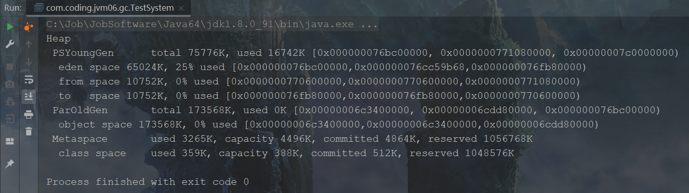

<div style="text-align:center;font-weight:bold;">手动调用System.gc()方法运行结果</div>


## 15.2 内存溢出与内存泄漏

### 15.2.1 内存溢出

​	内存溢出(Out Of Memory,OOM)是引发程序崩溃的罪魁祸首之一。由于垃圾收集技术一直在发展，一般情况下，除非应用程序占用的内存增长速度非常快，造成垃圾收集已经跟不上内存消耗的速度，否则不太容易出现内存溢出的情况。

​	大多数情况下，GC会进行各个内存区域的垃圾收集，实在不行了就放大招，来一次独占式的Full GC操作，这时候会回收大量的内存，供应用程序继续使用。

​	Java中对内存溢出的解释是，没有空闲内存，并且垃圾收集器也无法回收更多内存。如果出现没有空闲内存的情况，说明JVM的堆内存不够，此时会报“java.lang.OutOfMemoryError”的错误。发生堆内存溢出错误的原因可能有以下几方面。

1. JVM的堆内存设置不够。

​	也很有可能就是堆的大小不合理，比如要处理比较大的数据量，但是没有显式指定JVM堆大小或者指定数值偏小，可以通过参数“-Xms”“-Xmx”来调整。如果堆内存设置不够，将会报“java.lang.OutOfMemoryError:Java heap space”的错误。

2. 代码中创建了大量的大对象，并且长时间不能被垃圾收集器收集，因为这些对象仍然被引用。
3. 对于老版本的Oracle JDK，因为永久代的大小是有限的，并且JVM对永久代垃圾收集（例如常量池回收、卸载不再需要的类型）非常不积极，所以当不断添加新类型、字符串常量对象时占用太多空间，都会导致内存溢出问题。永久代内存溢出的错误信息为“java.lang.OutOfMemoryError:PermGen space”。随着字符串常量池从方法区中移出，以及元空间的引入，方法区内存已经不再那么窘迫，所以相应的内存溢出现象也会有所改观。当在元空间出现内存溢出时，异常信息则变成了“java.lang.OutOfMemoryError:Metaspace”。

4. 可能存在内存泄漏问题。

### 15.2.2 内存泄漏

​	内存泄漏(Memory Leak)也称作“存储渗漏”。严格来说，只有对象不会再被程序用到了，但是GC又不能回收它们的情况，才叫内存泄漏。比如，内存一共有1024MB，分配了512MB的内存一直不回收，那么可以用的内存只有512MB了，仿佛泄漏掉了一部分。如下图所示，从GC Roots出发，可以找到当前被引用的所有对象，当对象不再被GC Roots可达时，就变成了垃圾对象；下图中的右侧有部分对象(Forgotten Reference)在程序中已经不可用，但是还可以被GC Roots引用到，这时就是内存泄漏。

<div style="text-align:center;font-weight:bold;">内存泄漏图示</div>

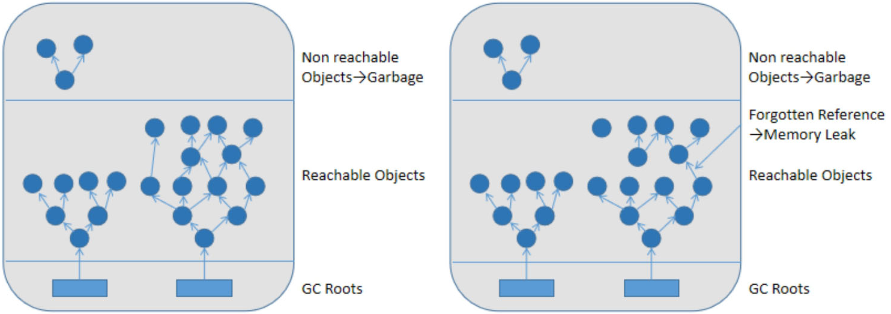

​	实际上，很多时候一些不太好的实践（或疏忽）会导致对象的生命周期变得很长甚至导致内存溢出，也可以叫作宽泛意义上的内存泄漏。

​	尽管内存泄漏并不会立刻引起程序崩溃，但是一旦发生内存泄漏，程序中的可用内存就会被逐步蚕食，直至耗尽所有内存，最终出现内存溢出异常，导致程序崩溃。

​	注意，这里的存储空间并不是指物理内存，而是指虚拟内存，这个虚拟内存的大小取决于磁盘交换区设定的大小。

​	下面举两个内存泄漏的例子。

1. 单例模式

​	单例的生命周期和应用程序是一样长的，所以单例程序中，如果持有对外部对象的引用，那么这个外部对象是不能被回收的，则会导致内存泄漏的产生。

2. 未手动关闭资源

​	如数据库连接、网络连接、IO连接等资源，除非用户显示调用其close()方法，否则这些资源不会自动被垃圾收集器回收。

​	Java中把内存泄漏容易发生的场景归类为8种情况，如下所示。

**1 静态集合类内存泄漏**

​	静态集合类有HashMap、LinkedList等。如果这些容器为静态的，那么它们的生命周期与JVM程序一致，则容器中的对象在程序结束之前将不能被释放，从而造成内存泄漏。简单而言，长生命周期的对象持有短生命周期对象的引用，尽管短生命周期的对象不再使用，但是因为长生命周期对象持有它的引用而导致不能被回收。如下代码所示，每次调用oomTests()方法的时候都会往list中存放对象，调用次数多了就会占用很大的内存空间。

<span style="color:#40E0D0;">案例1：静态集合类内存泄漏案例</span>

- 代码

```java
public class MemoryLeak {

    static List list = new ArrayList<>();

    public void oomTests() {
        Object obj = new Object(); // 局部变量
        list.add(obj);
    }
}
```

**2 单例模式**

​	单例模式和静态集合导致内存泄漏的原因类似，因为单例的静态特性，它的生命周期和JVM的生命周期一样长，所以如果单例对象持有外部对象的引用，那么这个外部对象也不会被回收，那么就会造成内存泄漏。

**3 内部类持有外部类**

​	如果一个外部类的实例对象的方法返回了一个内部类的实例对象，这个内部类对象被长期引用了，即使那个外部类实例对象不再被使用，但由于内部类持有外部类的实例对象，这个外部类对象将不会被垃圾回收，也会造成内存泄漏。

**4 连接未及时关闭**

​	在对数据库进行操作的过程中，首先需要建立与数据库的连接，当不再使用时，需要调用close()方法来释放与数据库的连接。只有连接被关闭后，垃圾收集器才会回收对应的对象。否则，如果在访问数据库的过程中，对Connection、Statement或ResultSet不显性地关闭，将会造成大量的对象无法被回收，从而引起内存泄漏，类似的还有网络连接和IO连接等。如代码清单15-3所示，使用jdbc的时候没有及时关闭连接，如果频繁地连接数据库，就会造成对象的堆积。

<span style="color:#40E0D0;">案例1：连接未及时关闭</span>

- 代码

```java
public static void main(String[] args) {
    Connection conn = null;
    Class.forName("com.mysql.jdbc.Driver");
    conn = DriverManager.getConnection("url", "", "");
    Statement stmt = conn.createStatement();
    ResultSet rs = stmt.executeQuery("...");
} catch (Exception e) { // 异常日志
} finally {
    // 1.关闭结果集 Statement
    // 2.关闭声明的对象ResultSet
    // 3.关闭连接 Connection
}
```

**5 变量不合理的作用域**

​	一般而言，一个变量定义的作用范围大于其使用范围，很有可能会造成内存泄漏。另一方面，如果没有及时地把对象设置为null，很有可能导致内存泄漏的发生。如下代码所示，通过readFromNet()方法把接收的消息保存在变量msg中，然后调用saveDB()方法把msg的内容保存到数据库中，此时msg已经没用了，由于msg的生命周期与对象的生命周期相同，此时msg还不能回收，因此造成了内存泄漏。

​	实际上，这个msg变量可以放在receiveMsg()方法内部，当方法使用完，那么msg的生命周期也就结束了，此时就可以回收了。还有一种方法，在使用完msg后，把msg设置为null，这样垃圾收集器也会回收msg的内存空间。

<span style="color:#40E0D0;">案例1：变量不合理的作用域</span>

- 代码

```java
public class UsingRandom {
    private String msg;
    public void receiveMsg() {
        // private String msg;
        readFromNet(); // 从网络中接收数据保存到msg中
        saveDB(); // 把msg保存到数据库中
        // msg = null;
    }
}
```

**6 改变哈希值**

​	当一个对象被存储进HashSet集合中以后，就不能修改这个对象中的那些参与计算哈希值的字段了。否则，对象修改后的哈希值与最初存储进HashSet集合中的哈希值就不同了，在这种情况下，即使在contains()方法中使用该对象的引用地址作为参数去检索HashSet集合中的对象，也将返回该对象不存在的结果，就会导致无法从HashSet集合中单独删除该对象，造成内存泄漏。这也是为什么String被设置成了final类型，可以放心地把String存入HashSet，或者把String当作HashMap的key值。当我们想把自己定义的类保存到Hash表的时候，需要保证对象的hashCode不可变。如下代码演示了修改对象的hashCode之后对象无法被删除的场景。

<span style="color:#40E0D0;">案例1：更改对象的hashCode之后对象无法被删除</span>

- 代码

```java
package com.coding.jvm07.gui;

import java.util.HashSet;

public class ChangeHashCode1 {
    public static void main(String[] args) {
        HashSet<Point> hs = new HashSet<>();
        Point cc = new Point();
        cc.setX(10); // hashCode = 41
        hs.add(cc);
        cc.setX(20); // hashCode = 51
        System.out.println("hs.remove=" + hs.remove(cc)); // false
        hs.add(cc);
        System.out.println("hs.size=" + hs.size()); // size = 2
        System.out.println(hs);
    }
}

class Point {
    int x;

    public int getX() {
        return x;
    }

    public void setX(int x) {
        this.x = x;
    }

    @Override
    public int hashCode() {
        final int prime = 31;
        int result = 1;
        result = prime * result + x;
        return result;
    }

    @Override
    public boolean equals(Object o) {
        if (this == o) return true;
        if (o == null || getClass() != o.getClass()) return false;
        Point point = (Point) o;
        return x == point.x;
    }

    @Override
    public String toString() {
        return "Point{" +
                "x=" + x +
                '}';
    }
}
```

​	执行结果如下所示。

```cmd
hs.remove=false
hs.size=2
[Point{x=20}, Point{x=20}]
```

​	可以看到HashSet中的对象改变了hash值以后，无法移除元素导致元素滞留内存当中，还可以继续新增元素，导致内存泄漏。

**7 缓存泄漏**

​	内存泄漏的另一个常见来源是缓存，一旦把对象引用放入缓存中，就很容易遗忘，如果程序长时间运行下去，就会让内存中的对象越来越多，导致程序溢出。

​	对于这个问题，可以使用WeakHashMap代表缓存，此类Map的特点是，当除了自身有对key的引用外，此key没有其他对象引用，那么此Map会自动丢弃此值，WeakHashMap的原理就是弱引用（见15.5.3节）。下面代码演示了HashMap和WeakHashMap之间的区别。

<span style="color:#40E0D0;">案例1：缓存泄漏</span>

- 代码

```java
/**
 * 演示内存泄漏
 */
public class MapTest {
    static Map wMap = new WeakHashMap<>();
    static Map map = new HashMap();

    public static void main(String[] args) {
        init();
        testWeakHashMap();
        testHashMap();
    }

    public static void init() {
        String ref1 = new String("object1");
        String ref2 = new String("object2");
        String ref3 = new String("object3");
        String ref4 = new String("object4");
        wMap.put(ref1, "cacheObject1");
        wMap.put(ref2, "cacheObject2");
        map.put(ref3, "cacheObject3");
        map.put(ref4, "cacheObject4");
        System.out.println("String引用ref1,ref2,ref3,ref4消失");
    }

    private static void testWeakHashMap() {
        System.out.println("WeakHashMap GC之前");
        for (Object o : wMap.entrySet()) {
            System.out.println(o);
        }
        try {
            System.gc();
            TimeUnit.SECONDS.sleep(5);
        } catch (Exception e) {
            e.printStackTrace();
        }
        System.out.println("WeakHashMap GC之后");
        for (Object o : wMap.entrySet()) {
            System.out.println(o);
        }
    }

    private static void testHashMap() {
        System.out.println("HashMap GC之前");
        for (Object o : map.entrySet()) {
            System.out.println(o);
        }
        try {
            System.gc();
            TimeUnit.SECONDS.sleep(5);
        } catch (Exception e) {
            e.printStackTrace();
        }
        System.out.println("HashMap GC之后");
        for (Object o : map.entrySet()) {
            System.out.println(o);
        }
    }
}
```

​	运行结果如下。

```cmd
String引用ref1,ref2,ref3,ref4消失
WeakHashMap GC之前
object2=cacheObject2
object1=cacheObject1
WeakHashMap GC之后
HashMap GC之前
object4=cacheObject4
object3=cacheObject3
HashMap GC之后
object4=cacheObject4
object3=cacheObject3
```

​	上面代码演示了WeakHashMap如何自动释放缓存对象，当init函数执行完成后，局部变量字符串引用ref1、ref2、ref3和ref4都会消失，此时只有静态Map中保存对字符串对象的引用，可以看到，调用gc之后，HashMap没有被回收，而WeakHashMap里面的缓存被回收了。

**8 监听器和回调**

​	内存泄漏另一个常见来源是监听器和其他回调，如果客户端在实现的API中注册回调，却没有显式取消，那么就会积聚。需要确保回调立即被当作垃圾回收的最佳方法是只保存它的弱引用，例如将它们保存为WeakHashMap中的键。

## 15.3 Stop-The-World

​	在垃圾回收过程中，整个应用程序都会暂停，没有任何响应，所以被形象地称为“Stop-The-World”，简称STW。

​	可达性分析算法中枚举根节点(GC Roots)造成STW，原因是如果出现分析过程中对象引用关系还在不断变化，则分析结果的准确性无法保证。所以分析工作必须在一个能确保一致性的快照中进行。

​	被STW中断的应用程序线程会在完成GC之后恢复，频繁中断会让用户感觉像是网速不给力造成电影卡顿一样，体验非常不好，所以我们需要减少STW的发生。

​	STW的发生与所使用的垃圾收集器是什么无关，每一种垃圾收集器都会发生STW，即使G1回收器也不能完全避免。随着垃圾收集器的发展演变，回收效率越来越高，STW的时间也在进一步缩短。

​	STW是JVM在后台自动发起和自动完成的。在用户不可见的情况下，把用户正常的工作线程全部停掉。下面我们编写一段代码，通过调用System.gc()方法来感受STW的发生，如下面代码所示，注意在实际开发中一般不会手动调用System.gc()方法。

<span style="color:#40E0D0;">案例1：感受STW</span>

- 代码

```java
public class StopTheWorldDemo {

    public static class WorkThread extends Thread {
        List<byte[]> list = new ArrayList<byte[]>();

        @Override
        public void run() {
            try {
                while (true) {
                    for (int i = 0; i < 1000; i++) {
                        byte[] buffer = new byte[1024 * 256]; // 若不明显，可以增加这里的byte数组大小
                        list.add(buffer);
                    }

                    if (list.size() > 10000) {
                        list.clear();
                        System.gc(); // 会触发full gc，进而会出现STW事件
                    }
                }
            } catch (Exception e) {
                e.printStackTrace();
            }
        }
    }

    public static class PrintThread extends Thread {
        SimpleDateFormat s = new SimpleDateFormat("yyyy 年 MM 月 dd 日 HH:mm:ss");

        @Override
        public void run() {
            try {
                while (true) {
                    // 每秒打印时间信息
                    String str = s.format(new Date());
                    System.out.println(str);
                    Thread.sleep(1000);
                }
            } catch (InterruptedException e) {
                e.printStackTrace();
            }
        }
    }

    public static void main(String[] args) {
        WorkThread w = new WorkThread();
        PrintThread p = new PrintThread();
        w.start();
        p.start();
    }
}
```

​	代码中PrintThread线程是每隔一秒钟打印一次时间，在WorkThread线程被注释掉的情况下，代码输出的情况是每隔一秒打印一次时间，如下图所示。

<div style="text-align:center;font-weight:bold;">PrintThread线程结果示意图</div>

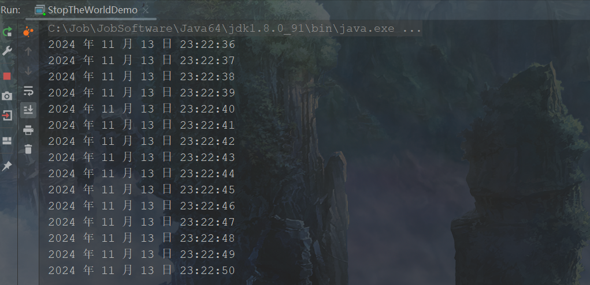

​	代码中WorkThread线程负责把byte数组放到list集合中，如果list集合的长度大于10000，清除list集合的数据并进行Full GC，进而触发STW，就会使PrintThread线程出现卡顿的情况，从而使之前每隔一秒打印的时间变长。打开WorkThread线程注释，运行结果如下图所示，可以看到图中画框的部分间隔时间为2秒，表明PrintThread线程被暂停了1秒。

<div style="text-align:center;font-weight:bold;">StopTheWorld代码的运行结果示意图</div>

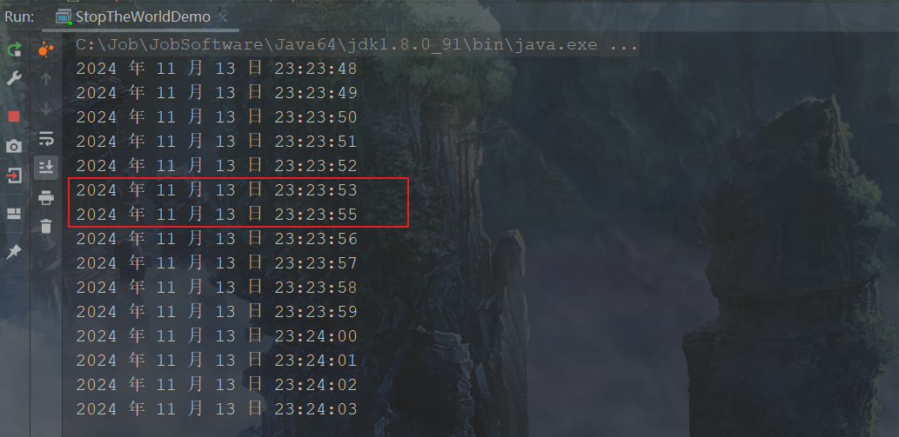

## 15.4 安全点与安全区域

### 15.4.1 安全点

​	在第15.3节讲到，在垃圾回收过程中，应用程序会产生停顿，发生STW现象。但是应用程序在执行过程中，并不是在任意位置都适合停顿下来进行GC的，只有在特定的位置才能停顿下来进行GC操作，这些特定的位置被称为安全点(SafePoint)。

​	安全点的选择至关重要，如果安全点太少可能导致GC等待的时间太长，如果安全点太密可能导致运行时的性能问题。那么，哪些位置作为安全点合适呢？通常选择一些运行时间较长的指令位置，例如方法调用、循环跳转等。

​	当GC发生时，如何保证应用程序的线程是在安全点呢？

​	抢先式中断：GC抢先中断所有线程。如果发现某个线程不在安全点，就重新恢复该线程，让线程跑到安全点。这种方式是由GC线程占主导位置的，违背了应用程序才是主角的定位，所以目前几乎所有虚拟机都不选择这种方式。

​	主动式中断：GC线程给自己设置一个中断标志，各个应用线程运行到安全点的时候主动轮询这个标志，如果此时GC线程的中断标志为真，则将自己中断挂起。这种方式的好处是由应用程序在安全点主动发起中断，而不会出现被迫在非安全点的位置先中断的情况。

### 15.4.2 安全区域

​	 安全点机制保证了程序执行时，在不太长的时间内就会遇到可进入GC的安全点。但是，应用程序的线程“不执行”怎么办呢？例如线程处于阻塞(Blocked)状态，这时候应用线程无法响应JVM的中断请求，“走”到安全点去中断挂起，JVM也不太可能等待应用线程被唤醒之后再进行GC。对于这种情况，就需要安全区域(Safe Region)机制来解决。

​	<span style="color:#9400D3;">安全区域是指在一段代码片段中，对象的引用关系不会发生变化，在这个区域中的任何位置开始GC都是安全的</span>。我们也可以把安全区域看作是被“放大”了的安全点。

​	在程序实际运行过程中，线程对于安全区域的处理方式如下。

1. 当线程运行安全区域的代码时，首先标识已经进入了安全区域，如果这段时间内发生GC,JVM会忽略标识为安全区域状态的线程。
2. 当线程即将离开安全区域时，会检查JVM是否已经完成GC，如果完成了，则继续运行，否则线程必须等待直到收到可以安全离开安全区域的信号为止。

## 15.5 四种引用

​	所谓的引用就是记录一个对象的地址，然后通过这个地址值找到这个对象并使用这个对象。最初Java只有强引用，例如“User user=new User（"问秋","666"）”，user变量记录了一个User对象的地址，之后程序便可以通过user这个变量访问对象的属性值"问秋"和"666"，或者通过user这个变量调用对象的方法。<span style="color:#9400D3;">Java中8种基本数据类型以外的变量都称为引用数据类型的变量</span>，上面的user就是对象的引用，也称为对象名。

​	<span style="color:red;font-weight:bold;">在JDK 1.2版之后，Java对引用的概念进行了细分，将引用分为强引用、软引用、弱引用和虚引用，这四种引用强度依次递减。</span>

​	除强引用外，其他三种引用均需要创建特殊的引用类对象来“构建”引用关系。这些特殊的引用类在java.lang.ref包中，如下图所示，它们分别是SoftReference（软引用）、PhantomReference（虚引用）、WeakReference（弱引用），开发人员可以在应用程序中直接使用它们。

<div style="text-align:center;font-weight:bold;">软引用、弱引用、虚引用对应的类</div>

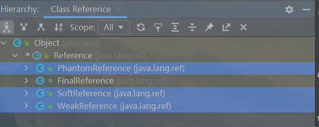

​	针对不同引用类型的对象，GC的态度也是完全不同的。

1. 强引用(StrongReference)：是最传统的引用关系，比如前面提到的“Useruser=new User（"问秋","666"）”这种引用关系。只要强引用关系还存在，无论任何情况垃圾收集器都永远不会回收掉被引用的对象。
2. 软引用(SoftReference)：在系统将要发生内存溢出之前，垃圾收集器收集完垃圾对象的内存之后，内存仍然吃紧，此时垃圾收集器会把软引用的对象列入回收范 围之中进行第二次回收，如果这次回收后还没有足够的内存，才会抛出内存溢出异常。
3. 弱引用(WeakReference)：被弱引用关联的对象只能生存到下一次垃圾收集之前。当垃圾收集器工作时，无论内存空间是否足够，都会回收掉被弱引用关联的对象。
4. 虚引用(PhantomReference)：一个对象是否有虚引用的存在，完全不会对其生存时间构成影响，也无法通过虚引用来获得一个对象的实例。为一个对象设置虚引用关联的唯一目的就是能在这个对象被收集器回收时收到一个系统通知。

### 15.5.1 强引用——不回收

​	在Java程序中，最常见的引用类型是强引用（普通系统99%以上都是强引用），也就是我们最常见的普通对象引用，也是默认的引用类型。

​	当在Java语言中使用new关键字创建一个新的对象，并将其赋值给一个变量的时候，这个变量就成为指向该对象的一个强引用。

​	如果一个对象被某个变量强引用了，只有引用它的变量超过了作用域或者显式地被赋值为null值，并且此时没有其他变量引用这个对象，那么这个对象才成了不可达的垃圾对象，可以被回收了，当然具体回收时机还是要看垃圾收集策略。换句话说，只要一个对象，被某个变量强引用了，这个变量还在作用域范围内，就表示这个对象是可达的、可触及的，垃圾收集器永远不会回收被强引用的对象。所以，强引用是造成Java内存泄漏的主要原因之一。

​	相对的，软引用、弱引用和虚引用的对象是软可触及、弱可触及和虚可触及的，在一定条件下，都是可以被回收的。

​	下面通过代码演示强引用关系的对象可达时不会被GC回收，不可达时才会被GC回收，如下代码所示。

<span style="color:#40E0D0;">案例1：强引用测试</span>

- 代码

```java
/**
 * 强引用的测试
 */
public class StrongReferenceTest {
    public static void main(String[] args) {
        StrongDemo s1 = new StrongDemo();
        StrongDemo s2 = s1;

        s1 = null;
        System.gc();

        try {
            // 3秒的延迟保证GC有时间工作
            Thread.sleep(3000);
        } catch (InterruptedException e) {
            e.printStackTrace();
        }

        System.out.println("s1 = " + s1);
        System.out.println("s2 = " + s2);

        s2 = null;
        System.gc();

        try {
            // 3秒的延迟保证GC有时间工作
            Thread.sleep(3000);
        } catch (InterruptedException e) {
            e.printStackTrace();
        }
        System.out.println("s1 = " + s1);
        System.out.println("s2 = " + s2);
    }
}
```

​	创建StrongDemo类如下所示，重写finalize()方法，如果该方法被执行，表明该类型对象被回收。

- 代码

```java
public class StrongDemo {
    @Override
    protected void finalize() throws Throwable {
        System.out.println("我被回收了");
    }

    @Override
    public String toString() {
        return "StrongDemo对象";
    }
}
```

​	上面代码的运行结果如下。

<div style="text-align:center;font-weight:bold;">强引用关系对象的回收观察</div>

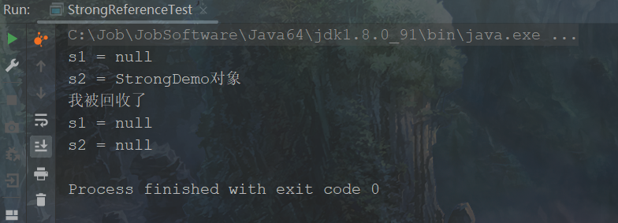

​	执行完“StrongDemo s1 = new StrongDemo();”语句时，对应内存结构如下图所示。

<div style="text-align:center;font-weight:bold;">强引用StrongDemo对象内存结构图</div>

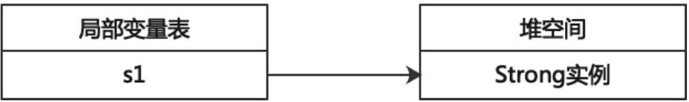

​	执行完“StrongDemo s2 = s1;”语句时，对应内存结构如下图所示。

<div style="text-align:center;font-weight:bold;">强引用StrongDemo赋值语句内存结构图</div>

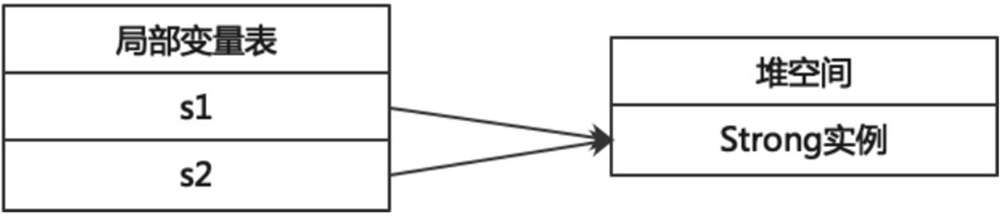

​	在第一次GC工作时，虽然通过“s1 = null”解除了s1变量和StrongDemo对象的强引用关系，但是因为s2仍然指向该StrongDemo对象，所以GC不会回收StrongDemo对象。此时通过s1无法再找到StrongDemo对象，而通过s2还可以找到StrongDemo对象。

​	在第二次GC工作时，因为“s2 = null”语句也解除了s2变量和StrongDemo对象的强引用关系，此时没有其他变量引用StrongDemo对象了，所以GC会回收StrongDemo对象。此时通过s1和s2都无法找到StrongDemo对象了。

​	本例中的两个变量和StrongDemo对象，都是强引用关系，强引用关系具备以下特点。

1. 可以通过变量名直接访问目标对象。
2. 强引用所指向的对象在任何时候都不会被系统回收，虚拟机宁愿抛出内存溢出异常，也不会回收强引用所指向对象。
3. 强引用可能导致内存泄漏。

### 15.5.2 软引用——内存不足立即回收

​	软引用是用来描述一些还有用，但非必需的对象。如果内存空间足够，垃圾收集器就不会回收它，如果内存空间不足，就会回收这些对象的内存。只要垃圾收集器没有回收它，该对象就可以被程序使用。

​	当内存空间不是很充足的时候，用户可以通过软引用机制实现缓存，其工作原理是：当内存还富裕时，就暂时保留缓存对象；当内存开始吃紧时，就可以清理掉缓存对象。这样就保证了在将对象进行缓存时不会耗光内存。软引用实现的缓存既提高了程序性能，又节省了内存空间。

​	垃圾收集器在某个时刻决定回收软可达的对象的时候，JVM会尽量让软引用的存活时间长一些，迫不得已才清理。一般而言，在JVM内存非常紧张临近溢出之前，垃圾收集器会收集这部分对象。

​	在JDK 1.2版之后提供了java.lang.ref.SoftReference类来实现软引用，使用方法如下所示。

```java
SoftReference<Object> sf = new SoftReference<Object>(对象);
```

​	也可以在建立软引用关系时，指定一个引用队列(Reference Queue)，之后可以通过这个引用队列跟踪这些软引用对象。

```java
SoftReference<Object> sf = new SoftReference<Object>(对象, 引用队列);
```

​	下面我们使用代码演示软引用对象被回收的现象，如下代码所示，在执行程序之前需要配置JVM参数，JVM参数配置在代码上面的注释中。

<span style="color:#40E0D0;">案例1：软引用测试</span>

- 代码

```java
/**
 * 软引用的测试：内存不足即回收
 * -Xms10m -Xmx10m -XX:+PrintGCDetails
 */
public class SoftReferenceTest {

    public static class User {
        public int id;
        public String name;
        private byte[] data = new byte[1024 * 1024];

        public User(int id, String name) {
            this.id = id;
            this.name = name;
        }

        @Override
        public String toString() {
            return "User{" + "id=" + id + ", name='" + name + '\'' + '}';
        }
    }

    public static void main(String[] args) {
        // 创建对象，建立软引用
        SoftReference<User> userSoftRef = new SoftReference<>(new User(1, "emon"));
        // 上面的一行代码，等价于如下的三行代码
        /*User u1 = new User(1, "emon");
        SoftReference<User> userSoftRef = new SoftReference<User>(u1);
        u1 = null; // 取消强引用*/

        // 从软引用中重新获得强引用
        System.out.println(userSoftRef.get());

        System.gc();
        System.out.println("After GC:");
        // 垃圾回收之后获得软引用中的对象，由于堆空间内存足够，所以不会回收软引用的可达对象
        System.out.println(userSoftRef.get());

        try {
            // 让系统认为内存资源紧张
            // byte[] b = new byte[1024 * 1024 * 6];
        } catch (Exception e) {
            e.printStackTrace();
        } finally {
            // 再次从软引用中获取数据
            System.out.println(userSoftRef.get()); // 在报OOM之前，垃圾回收器会回收软引用的可达对象，已经找不到了
        }
    }
}
```

​	上面代码运行到第一次GC时，内存充足，软引用的可达对象没有被回收，所以“After GC：”之后仍然可以从软引用中获取到引用对象。当代码继续运行，创建了一个byte数组，因为这个byte数组的长度为“1024 * 1024 * 6”，此时JVM的堆内存变得很紧张，软引用的可达对象被回收了，之后再从软引用中获取对象得到的是null值，运行结果如下图所示。

<div style="text-align:center;font-weight:bold;">内存不足未报内存溢出时回收软引用</div>

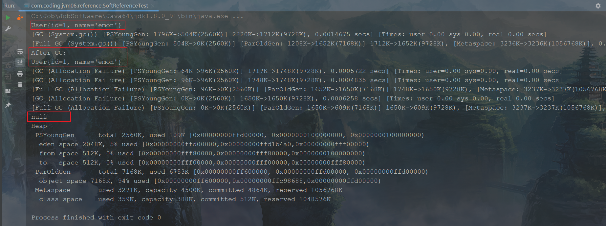

​	如果修改代码中字节数组的大小为“1024 * 1024 * 7”，或者更大，此时会发生OOM异常，如图15-10所示，那么软引用对象一定是会被GC清理掉的。

<div style="text-align:center;font-weight:bold;">内存不足时回收软引用</div>


### 15.5.3 弱引用——发现即回收

​	弱引用是用来描述那些非必需对象，只被弱引用关联的对象只能生存到下一次垃圾收集发生时。在垃圾收集器准备清理垃圾对象时，只要发现弱引用，不管系统堆空间是否充足，就会回收只被弱引用关联的对象。

​	弱引用是用来描述那些非必需对象，只被弱引用关联的对象只能生存到下一次垃圾收集发生时。在垃圾收集器准备清理垃圾对象时，只要发现弱引用，不管系统堆空间是否充足，就会回收只被弱引用关联的对象。

​	但是，由于垃圾收集器的线程通常优先级很低，因此，并不一定能迅速地清理完所有弱引用的对象。在这种情况下，弱引用对象可以存在较长的时间。

​	在JDK 1.2版之后提供了java.lang.ref.WeakReference类来实现弱引用，使用方法如下面代码所示。弱引用和软引用一样，在构造弱引用时，也可以指定一个引用队列，当弱引用对象被回收时，就会加入指定的引用队列，之后这个队列可以跟踪对象的回收情况。软引用、弱引用都非常适合来保存那些可有可无的缓存数据。

```java
WeakReference<Object> wr = new WeakReference<Object>(对象);
```

​	弱引用对象与软引用对象的最大不同就在于，当垃圾收集器在进行回收时，需要通过算法检查是否回收软引用对象，而对于弱引用对象，垃圾收集器直接进行回收。弱引用对象更容易、更快被垃圾收集器回收。

​	下面我们使用代码演示弱引用对象被回收的现象，如下代码所示。

<span style="color:#40E0D0;">案例1：若引用测试</span>

- 代码

```java
public class WeakReferenceTest {

    public static class User {
        public int id;
        public String name;

        public User(int id, String name) {
            this.id = id;
            this.name = name;
        }

        @Override
        public String toString() {
            return "User{" + "id=" + id + ", name='" + name + '\'' + '}';
        }
    }

    public static void main(String[] args) {
        // 创建对象，建立软引用
        WeakReference<User> userWeakRef = new WeakReference<>(new User(1, "emon"));
        // 上面的一行代码，等价于如下的三行代码
        /*User u1 = new User(1, "emon");
        WeakReference<User> userWeakRef = new WeakReference<User>(u1);
        u1 = null; // 取消强引用*/

        // 从软引用中重新获得强引用
        System.out.println(userWeakRef.get());

        System.gc();
        System.out.println("After GC:");
        // 垃圾回收之后获得软引用中的对象
        System.out.println(userWeakRef.get()); // 已经找不到了

    }
}
```

​	上面代码的运行结果如下图所示，可以看到弱引用对象在GC行为发生时就被直接回收了。

<div style="text-align:center;font-weight:bold;">弱引用对象被GC回收</div>


### 15.5.4 虚引用——对象回收跟踪

​	虚引用也称为“幽灵引用”或者“幻影引用”，是所有引用类型中最弱的一个。

​	一个对象是否有虚引用存在，完全不会决定对象的生命周期。如果一个对象仅持有虚引用，那么它和没有引用几乎是一样的，随时都可能被垃圾收集器回收。

​	它不能单独使用，也无法通过虚引用来获取被引用的对象。当试图通过虚引用的get()方法取得对象时，总是null。

​	<span style="color:#9400D3;">为一个对象设置虚引用的唯一目的在于跟踪垃圾收集过程</span>。比如在这个对象被收集器回收时收到一个系统通知。

​	<span style="color:#9400D3;">虚引用必须和引用队列一起使用。虚引用在创建时必须提供一个引用队列作为参数</span>。当垃圾收集器准备回收一个对象时，如果发现它还有虚引用，就会在回收对象后，将这个虚引用加入引用队列，以通知应用程序对象的回收情况。由于虚引用可以跟踪对象的回收时间，因此，也可以将一些资源释放操作放置在虚引用中执行和记录。在JDK 1.2版之后提供了PhantomReference类来实现虚引用，使用方法如下面代码所示。

- 代码

```java
ReferenceQueue phantomQueue = new ReferenceQueue();
PhantomReference<Object> pf = new PhantomReference<Object>(对象, phantomQueue);
```

​	我们使用代码演示虚引用，如下代码所示。

<span style="color:#40E0D0;">案例1：虚引用测试</span>

- 代码

```java
/**
 * 虚引用的测试
 */
public class PhantomReferenceTest {

    private static PhantomReferenceTest obj; // 当前类对象的声明
    private static ReferenceQueue<PhantomReferenceTest> phantomQueue = null; // 引用队列的声明

    public static class CheckRefQueue extends Thread {
        @Override
        public void run() {
            while (true) {
                if (phantomQueue != null) {
                    PhantomReference<PhantomReferenceTest> obj = null;
                    try {
                        obj = (PhantomReference<PhantomReferenceTest>) phantomQueue.remove();
                    } catch (Exception e) {
                        e.printStackTrace();
                    }
                    if (obj != null) {
                        System.out.println("追踪垃圾回收过程：PhantomReferenceTest实例被GC了");
                    }
                }
            }
        }
    }

    // finalize() 方法只能被调用一次
    @Override
    protected void finalize() throws Throwable {
        super.finalize();
        System.out.println("调用当前类的finalize()方法");
        obj = this;
    }

    public static void main(String[] args) {
        Thread t = new CheckRefQueue();
        t.setDaemon(true); // 设置为守护线程
        t.start();

        phantomQueue = new ReferenceQueue<PhantomReferenceTest>();
        obj = new PhantomReferenceTest();
        // 构造了 PhantomReferenceTest 对象的虚引用，并指定了引用队列
        PhantomReference<PhantomReferenceTest> phantomRef = new PhantomReference<PhantomReferenceTest>(obj, phantomQueue);


        try {
            // 不可获取虚引用中的对象
            System.out.println(phantomRef.get());

            // 将强引用去除
            obj = null;
            // 第一次进行GC，由于对象可复活，GC无法回收该对象
            System.out.println("第一次进行GC");
            System.gc();
            Thread.sleep(1000);
            if (obj == null) {
                System.out.println("obj 是 null");
            } else {
                System.out.println("obj 可用"); // 输出结果
            }

            // 将强引用去除
            obj = null;
            // 第二次进行GC
            System.out.println("第二次进行GC");
            System.gc();
            Thread.sleep(1000);
            if (obj == null) {
                System.out.println("obj 是 null"); // 输出结果
            } else {
                System.out.println("obj 可用");
            }
        } catch (InterruptedException e) {
            e.printStackTrace();
        }
    }
}
```

​	虚引用不同于软引用和弱引用，试图用get()方法去获取对象是徒劳的，得到的永远是null值。

​	上面代码中CheckRefQueue线程用来操作引用队列，第二次GC时在队列中就能取到obj对象，代码就会输出“追踪垃圾收集过程：PhantomReferenceTest实例被GC了”，如下图所示。

<div style="text-align:center;font-weight:bold;">虚引用的验证</div>

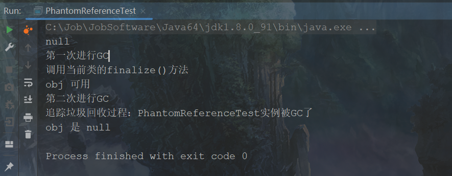

# 第16章 垃圾收集器

​	前面讲了垃圾收集算法有复制算法、标记–清除算法和标记–压缩算法。此时相当于对垃圾收集的理解还处于一种理论状态，相当于只定义了接口，还没有完成实现细节。本章要讲的垃圾收集器就是针对垃圾收集算法的具体实现。接下来我们会从垃圾收集器的发展史开始，详细讲解各种类型的垃圾收集器和其适用的应用场景。

## 16.1 垃圾收集器的发展和分类

​	内存处理是编程人员容易出现问题的地方，忘记或者错误的内存回收会导致程序或系统的不稳定甚至崩溃。JVM有一套内存的自动管理机制，Java程序员可以把绝大部分精力放在业务逻辑的实现上，不用过多地关心对象的内存申请、分配、回收等问题。自动内存管理机制是Java的招牌能力，极大地提高了开发效率，也大大降低了内存溢出或内存泄漏的风险。

​	自动内存管理的内存回收是靠垃圾收集器来实现的，垃圾收集器，英文全称为Garbage Collector，简称GC。在JVM规范中，没有对垃圾收集器做过多的规定。不同厂商、不同版本的JVM对垃圾收集器的实现也各有不同，随着JDK版本的高速迭代，衍生了很多类型的垃圾收集器。

### 16.1.1 评估垃圾收集器的性能指标

​	没有一款垃圾收集器能够适用所有场合，不同的用户需求、不同的程序运行环境和平台对垃圾收集器的要求也各不相同，所以目前HotSpot虚拟机中是多种垃圾收集器并存的。另外，衡量一款垃圾收集器的优劣也有多个指标，而且多个指标之间甚至互相矛盾、互相牵制，很难两全其美。

- <span style="color:red;font-weight:bold;">吞吐量</span>：运行用户代码的时间占总运行时间的比例。总运行时间=程序的运行时间+内存回收的时间。

- 垃圾收集开销：吞吐量的补数，内存回收所用时间与总运行时间的比例。

- <span style="color:red;font-weight:bold;">停顿时间</span>：执行垃圾收集时，程序的工作线程被暂停的时间。

- 收集频率：垃圾收集操作发生的频率。

- <span style="color:red;font-weight:bold;">内存占用</span>：Java堆区大小设置。

​	其中吞吐量、停顿时间、内存占用这三者共同构成一个“不可能三角”，即不可能同时都满足，一款优秀的收集器通常最多同时满足其中的两项。下面就吞吐量和停顿时间做个对比。

**1 吞吐量**

​	吞吐量就是CPU用于运行用户代码的时间与CPU总消耗时间的比值，即吞吐量=运行用户代码时间/（运行用户代码时间+垃圾收集时间）。比如虚拟机总共运行了100分钟，其中垃圾收集花掉1分钟，那吞吐量就是99%。

​	高吞吐量的应用程序往往有更长的时间基准，快速响应是不必考虑的，这种情况下，应用程序能容忍较高的单次停顿时间。如下图所示，图中的垃圾回收时间是200 + 200 = 400ms,CPU消耗总时间是6000ms，那么吞吐量为(6000-400)/6000 = 93.33%。

<div style="text-align:center;font-weight:bold;">注重吞吐量</div>


**2 停顿时间**

​	停顿时间是指一个时间段内应用程序线程暂停，让垃圾收集线程执行的状态。例如，GC期间100ms的停顿时间意味着在这100ms期间内没有应用程序线程是活动的。

​	停顿时间优先，意味着尽可能让单次程序停顿的时间最短。如下图所示，总的停顿时间是100 + 100 + 100 + 100 + 100 = 500ms。虽然总的停顿时间变长了，但是每次停顿的时间都很短，这样应用程序看起来延迟是比较低的，此时程序的吞吐量为(6000-500)/6000 =91.67%，明显吞吐量会有所降低，但是单次停顿的时间变短了。

<div style="text-align:center;font-weight:bold;">注重低延时</div>

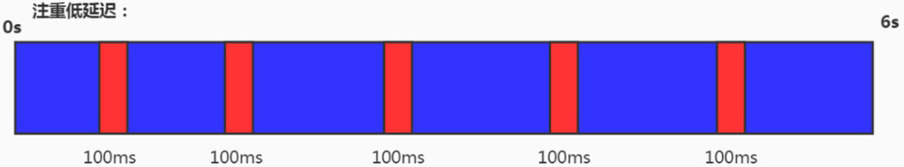

**3 吞吐量和停顿时间的比较**

​	高吞吐量会让应用程序的用户感觉只有应用程序线程在做“生产性”工作。直觉上，吞吐量越高程序运行越快。

​	停顿时间较高会让用户感觉延迟严重，不管是垃圾收集还是其他原因导致一个应用被挂起始终是不好的。不同类型的应用程序对停顿时间的要求有很大差异，有时候甚至短暂的200ms暂停都可能打断终端用户体验。因此，对于一个交互式应用程序，具有低停顿时间是非常重要的。

​	不幸的是，应用程序无法同时满足高吞吐量和低停顿时间。如果选择以吞吐量优先，那么必然需要降低内存回收的执行频率，这样会导致垃圾收集需要更长的停顿时间来执行内存回收。相反的，如果选择以低延迟优先为原则，为了降低每次执行内存回收时的停顿时间，也只能频繁地执行内存回收，但这又引起了新生代内存的缩减和程序吞吐量的下降。

​	在垃圾收集器的发展过程中，不同的垃圾收集器也是在不断地挑战性能指标的极限，或者在尽量兼顾多个性能指标。

### 16.1.2 垃圾收集器的发展史

​	1998年12月8日，第二代Java平台的企业版J2EE正式对外发布。为了配合企业级应用落地，1999年4月27日，Java程序的舞台——Java HotSpot VirtualMachine（以下简称HotSpot）正式对外发布，并从这之后发布的JDK1.3版本开始，HotSpot成为Sun JDK的默认虚拟机。

​	<span style="color:#FF1493;font-weight:bold;">1999年随JDK1.3.1一起发布的是串行方式的Serial GC，它是第一款GC</span>，并且这只是起点。Serial收集器是最基本、历史最悠久的垃圾收集器，它是一个单线程收集器。而之后的ParNew垃圾收集器是Serial收集器的多线程升级版本，除了Serial收集器外，也只有它能与CMS收集器配合工作。

​	2002年2月26日，J2SE1.4发布。<span style="color:#FF1493;font-weight:bold;">Parallel GC和Concurrent MarkSweep(CMS)GC跟随JDK1.4.2一起发布，并且Parallel GC在JDK6之后成为HotSpot默认GC</span>。Parallel GC收集器看似与ParNew收集器在功能上类似，但是它们的侧重点不同，<span style="color:#32CD32;font-weight:bold;">Parallel Scavenge收集器关注点是吞吐量（高效率地利用CPU），CMS等垃圾收集器的关注点更多的是用户线程的停顿时间（提高用户体验）</span>。但是在2020年3月发布的JDK14中，CMS垃圾收集器被彻底删除了。

​	2012年，在JDK1.7u4版本中，又有一种优秀的垃圾收集器被正式投入使用，它就是Garbage First(G1)。随着G1 GC的出现，GC从传统的连续堆内存布局设计，逐渐走向不连续内存块，这是通过引入Region概念实现，也就是说，由一堆不连续的Region组成了堆内存。其实也不能说是不连续的，只是它从传统的物理连续逐渐改变为逻辑上的连续，这是通过Region的动态分配方式实现的，我们可以把一个Region分配给Eden、Survivor、老年代、大对象区间、空闲区间等的任意一个，而不是固定它的作用，因为越是固定，越是呆板。<span style="color:#FF1493;font-weight:bold;">到2017年JDK9中，G1变成了默认的垃圾收集器，替代了CMS</span>。2018年3月发布的JDK10中，G1垃圾收集器已经可以并行完整垃圾回收了，G1实现并行性来改善最坏情况下的延迟。之后在JDK12，继续增强G1，自动返回未用堆内存给操作系统。

​	2018年9月，JDK11发布，在该版本中提到了两个垃圾收集器，一个是Epsilon垃圾收集器，又被称为“No-Op（无操作）”收集器。另一个是ZGC(The ZGarbage Collector)，这是一款可伸缩的低延迟垃圾收集器，此时还是实验性的。ZGC在2019年9月发布的JDK13中继续得到增强，实现自动返回未用堆内存给操作系统。在2020年3月发布的JDK14中ZGC扩展了在macOS和Windows平台上的应用。经过了几个版本的迭代，ZGC在JDK15中成为正式特性，并且进行了进一步改进，将线程栈的处理从安全点移到了并发阶段，这样ZGC在扫描根时就不用Stop-The-World了。

​	2019年3月，JDK12发布，另一种实验性GC被引入，它就是Shenandoah GC，也是一种低停顿时间的GC。

### 16.1.3 垃圾收集器的分类

​	首先，在本书7.3节提到Java堆分为新生代和老年代，生命周期较短的对象一般放在新生代，生命周期较长的对象会进入老年代。不同区域的对象，采取不同的收集方式，以便提高回收效率。因此根据垃圾收集器工作的内存区间不同，可分为新生代垃圾收集器、老年代垃圾收集器和整堆垃圾收集器，如下图所示。

新生代收集器：Serial、ParNew、Parallel Scavenge。

老年代收集器：Serial Old、Parallel Old、CMS。

整堆收集器：G1。

<div style="text-align:center;font-weight:bold;">垃圾收集器与垃圾分代之间的关系</div>

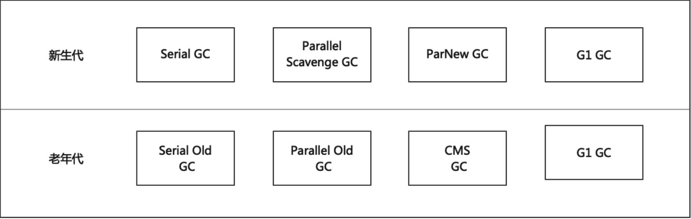

​	其次，新生代在每次垃圾收集发生时，大部分对象会被回收，存活对象数量较少，因此每次回收进行碎片整理是非常高效的。而老年代的每次回收，存活对象数量较多，复制算法明显变得不合适，一般选用标记–清除算法，或者标记–清除算法与标记–压缩算法混合实现。因此垃圾收集器可分为压缩式垃圾收集器和非压缩式垃圾收集器。<span style="color:#9400D3;">压缩式垃圾收集器会在回收完成后，对存活对象进行压缩整理，消除回收后的碎片，如果再次分配对象空间，使用指针碰撞技术实现，比如Serial Old就是压缩式垃圾收集器。非压缩式垃圾收集器不进行这步操作，如果再分配对象空间，只能使用空闲列表技术实现，比如CMS就是非压缩式垃圾收集器</span>。

​	最后，垃圾收集器还可以分为串行垃圾收集器、并行垃圾收集器、并发式垃圾收集器等。这又是怎么回事呢？要弄清楚这些，我们需要先来看一下在操作系统中串行(Serial)、并行(Parallel)和并发(Concurrent)的概念。

​	在操作系统中串行是指单个线程处理多任务时，多个任务需要按顺序执行，即完成一个任务之后再去完成另外一个任务，多个任务之间的时间没有重叠。

​	在操作系统中并发是指同一个时间段中有多个任务都处于已启动运行到运行完毕之间，且这几个任务都是在同一个CPU上运行。并发不是真正意义上的“同时”执行，只是CPU把一个时间段划分成几个小的时间片段，然后多个任务分别被安排在不同的时间片段内执行，即CPU在这几个任务之间来回切换，由于CPU处理的速度非常快，只要时间间隔处理得当，即可让用户感觉是多个任务同时在进行。如下图所示，有三个应用程序A、B、C，当前只有一个处理器，在当前时间节点上，只能有一个应用被处理器执行，另外两个应用暂停，这种情景就是并发。即并发从微观角度看，多个任务不是同时进行的，多个任务之间是互相抢占CPU资源的，但是从宏观角度看，多个任务是“同时”进行的，它们的时间互相重叠，一个任务还未结束，另一个任务已经开始了。

<div style="text-align:center;font-weight:bold;">单核处理器的并发</div>


​	在操作系统中并行是指如果操作系统有一个以上CPU可用时，当一个CPU执行一个任务的代码时，另一个CPU可以执行另一个任务的代码，两个任务互不抢占CPU资源，可以同时进行。如图16-5所示，A、B、C三个应用在当前时间节点可以同时被不同的处理器执行。因此要实现并行的效果的关键是需要有多个CPU可用，或者一个CPU存在多核也可以。

<div style="text-align:center;font-weight:bold;">多核处理器的并行</div>


​	总结来看，串行指的是多个任务在不同时间段按顺序执行。并发指的是多个任务，在同一时间段内“同时”发生了。并行指的是多个任务，在同一时间点上同时发生了。串行的多个任务是不会抢同一个CPU资源的，因为它们是顺序执行。并发的多个任务之间是会互相抢占CPU资源的。并行的多个任务之间是不互相抢占CPU资源的。而且只有在多CPU或者一个CPU多核的情况中，才会发生并行，否则，看似同时发生的事情，其实都是并发执行的。

​	那么，串行垃圾收集器、并行垃圾收集器、并发垃圾收集器又是怎么回事呢？

​	串行垃圾收集器是指使用单线程收集垃圾，即使存在多个CPU可用，也只能用一个CPU执行垃圾回收，所以应用程序一定会发生STW。<span style="color:#FF1493;font-weight:bold;">使用串行方式的垃圾收集器有Serial等</span>。

​	并行垃圾收集器指使用多个垃圾收集线程并行工作，当多个CPU可用时，并行垃圾收集器会使用多个CPU同时进行垃圾回收，因此提升了应用的吞吐量，但此时用户线程仍会处于等待状态，即STW现象仍然会发生。<span style="color:#FF1493;font-weight:bold;">使用并行方式的垃圾收集器有ParNew、Parallel Scavenge、Parallel Old等</span>。

​	并发垃圾收集器是指用户线程与垃圾收集线程“同时”，但此时用户线程和垃圾收集线程不一定是并行的，可能会交替执行。如果此时存在多个CPU或者一个CPU存在多核的情况，垃圾收集线程在执行时不会“停顿”用户程序的运行，即垃圾收集线程不会独占CPU资源，用户程序再继续运行，而垃圾收集程序线程运行于另一个CPU上。<span style="color:#FF1493;font-weight:bold;">使用并发方式的垃圾收集器有CMS和G1等</span>。

​	因此，根据进行垃圾收集的工作线程数不同，垃圾收集器可以分为串行垃圾收集器和并行垃圾收集器。根据垃圾收集器的工作模式不同，即垃圾收集器工作时是否独占CPU资源，可以把垃圾收集器分为并发式垃圾收集器和独占式垃圾收集器。

​	独占式垃圾收集器一旦运行，就停止应用程序中的其他所有线程，直到垃圾收集过程完全结束。

​	并发式垃圾收集器与应用程序线程交替工作，以尽可能减少应用程序的停顿时间。我们把上面提到的垃圾收集器分类如下。

​	串行收集器：Serial、Serial Old。

​	并行收集器：ParNew、Parallel Scavenge、Parallel Old。

​	并发收集器：CMS、G1。

​	三种类型的垃圾收集器的工作流程如下图所示，图中实线表示应用线程(Application threads)，虚线表示垃圾回收线程(GC threads)。串行垃圾收集器是指使用单线程进行垃圾回收，垃圾回收时，只有一个线程在工作，并且Java应用中的所有线程都要暂停，等待垃圾回收的完成。并行垃圾收集器在串行垃圾收集器的基础之上做了改进，将单线程改为多线程进行垃圾回收，这样可以缩短垃圾回收的时间。并发垃圾收集器是指垃圾收集线程和用户线程同时运行。

<div style="text-align:center;font-weight:bold;">串行、并行、并发收集器流程示意图</div>


​	其中经典的7个垃圾收集器之间的组合关系如下图所示。

<div style="text-align:center;font-weight:bold;">垃圾收集器的组合关系</div>

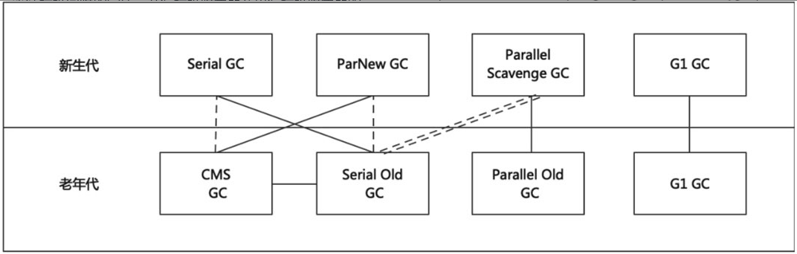

​	两个收集器之间由实线连线，表明它们可以搭配使用，常见的组合有：Serial/Serial Old、Serial/CMS、ParNew/Serial Old、ParNew/CMS、ParallelScavenge/Serial Old、Parallel Scavenge/Parallel Old、G1，其中Serial Old作为CMS出现“Concurrent Mode Failure”失败的后备预案。

​	两个收集器之间由单虚线连接，表示由于维护和兼容性测试的成本，在JDK 8时将Serial/CMS和ParNew/Serial Old这两个组合声明为废弃，并在JDK 9中完全移除了这些组合。

​	两个收集器之间由双虚线连接，表示JDK 14中，弃用Parallel Scavenge和Serial  Old GC组合。需要注意的是JDK 14中已经彻底删除了CMS垃圾收集器。

​	为什么要有很多收集器，因为Java的使用场景很多，如移动端、服务器等。所以需要针对不同的场景，提供不同的垃圾收集器，提高垃圾收集的性能。

​	虽然我们会对各个收集器进行比较，但并非为了挑选一个最好的收集器出来。没有一种可以在任何场景下都适用的万能垃圾收集器。所以我们选择的只是对具体应用最合适的收集器。

<span style="color:#FF1493;font-weight:bold;">另外一种图文描述</span>

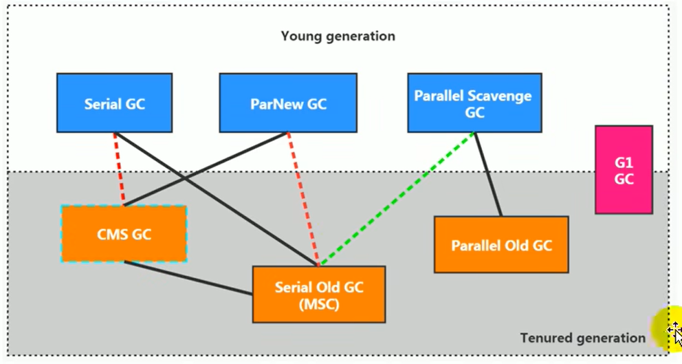

说明：

- JDK8时，上图<span style="color:red;font-weight:bold;">红色虚线</span>被Deprecated（废弃），仍可用。
- JDK9时，上图<span style="color:red;font-weight:bold;">红色虚线</span>被移除了
- JDK9时，CMS GC被Deprecated（废弃），仍可用
- JDK14时，CMS GC被移除了
- JDK14时，<span style="color:green;font-weight:bold;">绿色虚线</span>被Deprecated（废弃），仍可用

### 16.1.4 查看默认的垃圾收集器

​	查看默认的垃圾收集器可以参考下面的方式：

1. -XX:+PrintCommandLineFlags：查看命令行相关参数（包含使用的垃圾收集器）。
2. 使用命令行指令：“jinfo -flag相关垃圾收集器参数进程ID”。

​	下面我们用一段代码让程序处于执行状态，使用上面的方式查看虚拟机默认的垃圾收集器，JDK版本为JDK8，如下代码所示。

<span style="color:#40E0D0;">案例1：查看默认的垃圾收集器</span>

- 代码

```java
/**
 * -XX:+PrintCommandLineFlags
 *  JDK8下，使用的是： -XX:+UseParallelGC 和 -XX:+UseParallelOldGC
 *  JDK9下，使用的是： -XX:+UseG1GC
 *  也可以手动指定使用其他垃圾收集器：   -XX:+UseSerialGC        新生代用 Serial GC，且老年代用 Serial Old GC
 *  也可以手动指定使用其他垃圾收集器：   -XX:+UseParNewGC        新生代使用并行收集器，不影响老年代
 *  也可以手动指定使用其他垃圾收集器：   -XX:+UseParallelGC      新生代使用 Parallel GC，老年代使用 ParallelOld GC（UseParallelGC与UseParallelOldGC开启一个，另一个也会被开启）
 *  也可以手动指定使用其他垃圾收集器：   -XX:+UseParallelOldGC   新生代使用 Parallel GC，老年代使用 ParallelOld GC（UseParallelGC与UseParallelOldGC开启一个，另一个也会被开启）
 *  也可以手动指定使用其他垃圾收集器：   -XX:+UseConcMarkSweepGC 新生代使用ParNew+，老年代使用CMS（Serial Old作为CMS由于内存碎片出现“Concurrent Mode Failure”失败的后备预案）
 *  也可以手动指定使用其他垃圾收集器：   -XX:+UseG1GC    表示年轻代与老年代都使用G1GC
 */
public class GCUseTest {
    public static void main(String[] args) {
        ArrayList<byte[]> list = new ArrayList<byte[]>();

        while (true) {
            byte[] arr = new byte[100];
            list.add(arr);
            try {
                Thread.sleep(10);
            } catch (InterruptedException e) {
                e.printStackTrace();
            }
        }
    }
}
```

​	设置VM options的参数为“-XX:+PrintCommandLineFlags”，即可查看当前JDK使用的是哪种垃圾收集器。例如，以下是基于JDK8的运行结果，其中“-XX:+UseParallelGC”表示使用了ParallelGC。

```bash
-XX:InitialHeapSize=264987584 -XX:MaxHeapSize=4239801344 -XX:+PrintCommandLineFlags -XX:+UseCompressedClassPointers -XX:+UseCompressedOops -XX:-UseLargePagesIndividualAllocation -XX:+UseParallelGC
```

​	也可以使用命令行“jinfo –flag相关垃圾收集器参数进程ID”进行查看。如下图展示了在JDK8中是使用ParallelGC。

<div style="text-align:center;font-weight:bold;">基于JDK8运行程序后在命令行查看使用的垃圾收集器</div>

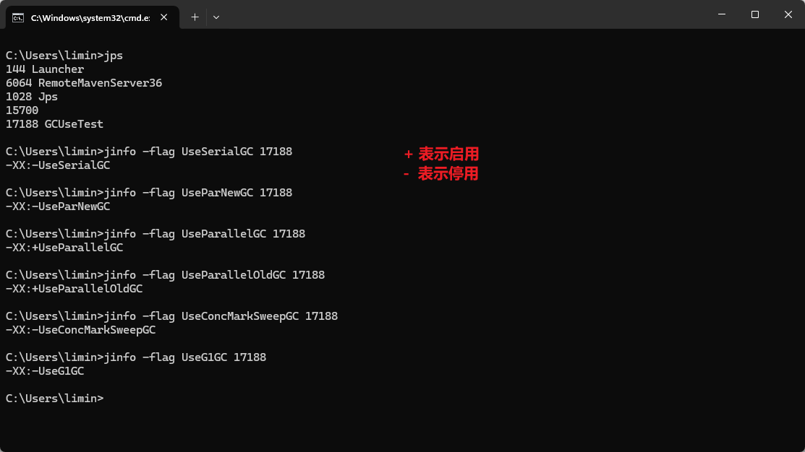


## 16.2 Serial收集器：串行回收

​	Serial收集器是最基本、历史最悠久的垃圾收集器了，是JDK1.3之前回收新生代唯一的选择。Serial收集器作为HotSpot中Client模式下的默认新生代垃圾收集器，<span style="color:red;font-weight:bold;">采用的是复制算法、串行回收和STW机制的方式执行内存回收</span>。

​	除了新生代，Serial收集器还提供了用于执行老年代垃圾收集的Serial Old收集器。<span style="color:red;font-weight:bold;">Serial Old收集器同样采用了串行回收和STW机制，只不过内存回收算法使用的是标记—压缩算法</span>。

​	Serial Old是运行在Client模式下默认的老年代的垃圾收集器。Serial Old在Server模式下主要有两个用途。

1. 与新生代的Parallel Scavenge垃圾收集器搭配。
2. 作为老年代CMS收集器的后备方案。

​	它只会使用一条垃圾收集线程去完成垃圾收集工作，更重要的是它在进行垃圾收集工作的时候必须暂停其他所有的工作线程——“Stop The World”，直到它收集结束。这就意味着每次垃圾收集时都会给用户带来一定的卡顿现象，造成不良的用户体验，如下图所示。

<div style="text-align:center;font-weight:bold;">Serial/Serial Old收集器与各线程的运作关系</div>

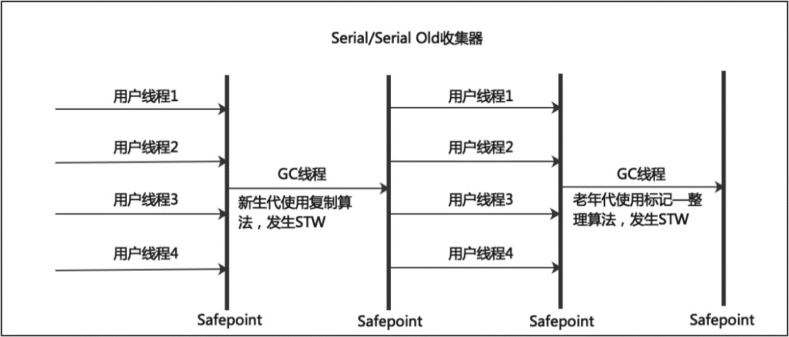

​	Serial垃圾收集器相比于其他收集器也有一定的优点：简单而高效。Serial收集器由于没有线程交互的开销，只需要专心做垃圾收集，自然可以获得很高的单线程收集效率。虚拟机的Client模式下使用Serial垃圾收集器是个不错的选择。比如在用户的桌面应用场景中，可用内存一般不大（几十M至一两百M），可以在较短时间内完成垃圾收集（几十ms至一百多ms），只要不频繁发生，使用Serial收集器是一个不错的选择。

​	<span style="color:red;font-weight:bold;">在HotSpot虚拟机中，可以通过设置“-XX:+UseSerialGC”参数明确指定新生代和老年代都使用串行收集器</span>。配置完该参数以后表示新生代用Serial垃圾收集器，老年代用Serial Old垃圾收集器。

​	依然使用<span style="color:blue;font-weight:bold;">GCUseTest</span>演示，在JDK8中手动设置使用Serial垃圾收集器。设置VMoptions的参数为“-XX:+PrintCommandLineFlags -XX:+UseSerialGC”，指定新生代和老年代都使用串行收集器。运行结果如下，其中“-XX:+ UseSerialGC”表示使用了SerialGC。

```bash
-XX:InitialHeapSize=264987584 -XX:MaxHeapSize=4239801344 -XX:+PrintCommandLineFlags -XX:+UseCompressedClassPointers -XX:+UseCompressedOops -XX:-UseLargePagesIndividualAllocation -XX:+UseSerialGC
```

## 16.3 ParNew收集器：并行回收

​	如果说Serial GC是新生代中的单线程垃圾收集器，那么ParNew收集器则是Serial收集器的多线程版本。Par是Parallel的缩写，New指的是该收集器只能处理新生代。

​	ParNew收集器除了采用并行回收的方式执行内存回收外，和Serial垃圾收集器之 间几乎没有任何区别。<span style="color:red;font-weight:bold;">ParNew收集器在新生代中同样也是采用复制算法和STW机制</span>。ParNew是很多JVM运行在Server模式下新生代的默认垃圾收集器。

​	对于新生代，回收次数频繁，使用并行方式高效。对于老年代，回收次数少，使用串行方式更加节省CPU资源。ParNew收集器与各线程的运作关系如下图所示。

<div style="text-align:center;font-weight:bold;">ParNew收集器与各线程的运作关系</div>

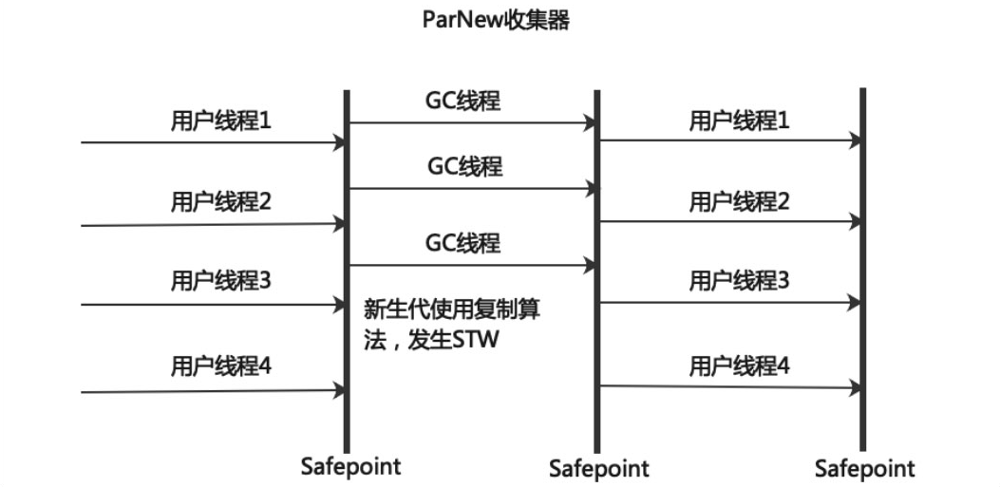

​	由于ParNew收集器是基于并行回收，那么是否可以断定ParNew收集器的回收效率在任何场景下都会比Serial收集器更高效呢？

​	ParNew收集器运行在多CPU的环境下，由于可以充分利用多CPU、多核心等物理硬件资源优势，可以更快速地完成垃圾收集，提升程序的吞吐量。

​	但是在单个CPU的环境下，ParNew收集器不比Serial收集器更高效。虽然Serial收集器是基于串行回收，但是由于CPU不需要频繁地做任务切换，因此可以有效避免多线程交互过程中产生的一些额外开销。

​	<span style="color:red;font-weight:bold;">除Serial外，目前只有ParNew垃圾收集器能与CMS收集器配合工作</span>。在程序中，开发人员可以通过选项“-XX:+UseParNewGC”手动指定使用ParNew收集器执行内存回收任务。它表示新生代使用并行收集器，不影响老年代。

​	依然使用<span style="color:blue;font-weight:bold;">GCUseTest</span>演示使用ParNew垃圾收集器。设置VM options的参数为“-XX:+PrintCommandLineFlags -XX:+UseParNewGC”，指定新生代使用ParNew垃圾收集器。运行结果如下，其中“-XX:+UseParNewGC”表示使用了ParNew垃圾收集器。

```bash
-XX:InitialHeapSize=264987584 -XX:MaxHeapSize=4239801344 -XX:+PrintCommandLineFlags -XX:+UseCompressedClassPointers -XX:+UseCompressedOops -XX:-UseLargePagesIndividualAllocation -XX:+UseParNewGC 
```

## 16.3 Parallel Scavenge收集器：吞吐量优先

​	HotSpot的新生代中除了拥有ParNew收集器是基于并行回收的以外，<span style="color:red;font-weight:bold;">ParallelScavenge收集器同样也采用了复制算法、并行回收和STW机制</span>。那么ParallelScavenge收集器的出现是否多余？Parallel Scavenge收集器的目标是达到一个可控制的吞吐量，它也被称为吞吐量优先的垃圾收集器。<span style="color:#FF1493;font-weight:bold;">自适应调节策略也是Parallel Scavenge与ParNew一个重要区别，Parallel Scavenge获取应用程序的运行情况收集系统的性能监控信息，动态调整参数以提供最合适的停顿时间或最大的吞吐量，这种调节方式称为垃圾收集的自适应调节策略</span>。

​	高吞吐量可以高效率地利用CPU时间，尽快完成程序的运算任务，主要适合在后台运算而不需要太多交互的任务，例如，那些执行批量处理、订单处理、工资支付、科学计算的应用程序。

​	Parallel Scavenge收集器在JDK1.6时提供了用于执行老年代垃圾收集的ParallelOld收集器，用来代替老年代的Serial Old收集器。<span style="color:red;font-weight:bold;">Parallel Old收集器采用了标记—压缩算法，但同样也是基于并行回收和STW机制</span>。

​	在程序吞吐量优先的应用场景中，Parallel Scavenge收集器和Parallel Old收集器的组合，在Server模式下的内存回收性能很不错。Parallel Scavenge/Parallel Old收集器中GC线程和用户线程之间的运作关系如下图所示。在JDK8中，默认使用此垃圾收集器。

<div style="text-align:center;font-weight:bold;">Parallel Scavenge/Parallel Old收集器与各线程的运作关系</div>

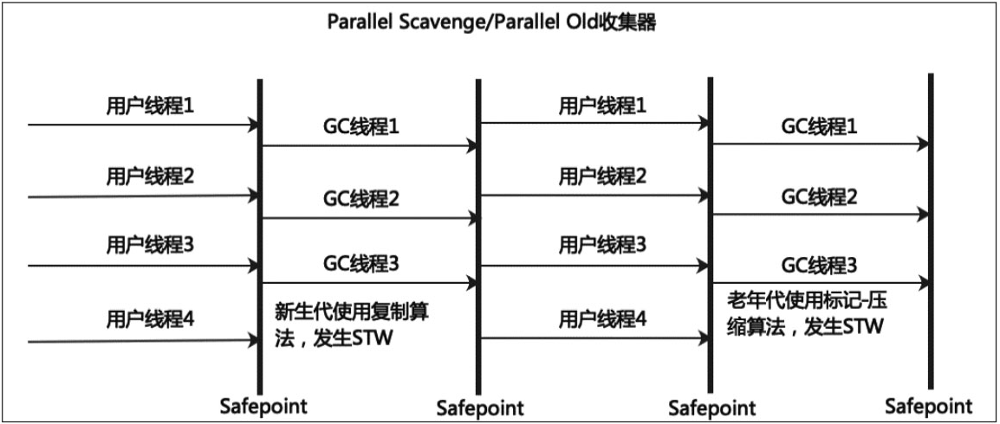

​	Parallel垃圾收集器常用参数配置如下。

1. XX:+UseParallelGC：指定新生代使用Parallel并行收集器执行内存回收任务；-XX:+UseParallelOldGC：指定老年代都是使用并行回收收集器，JDK8默认开启。默认情况下，开启其中一个参数，另一个也会被开启（互相激活）。

2. -XX:ParallelGCThreads：设置新生代并行收集器的线程数。一般最好与CPU核心数量相等，以避免过多的线程数影响垃圾收集性能。在默认情况下，当CPU核心数量小于8个，ParallelGCThreads的值等于CPU核心数量。当CPU核心数量大于8个，ParallelGCThreads的值等于3+[5*CPU_Count]/8]。

3. -XX:MaxGCPauseMillis：设置垃圾收集器最大停顿时间（即STW的时间）。单位是毫秒。为了尽可能地把停顿时间控制在MaxGCPauseMills以内，收集器在工作时会调整Java堆大小或者其他一些参数。

   对于用户来讲，停顿时间越短体验越好，但是在服务器端，我们更加注重高并发和应用程序的吞吐量，所以Parallel垃圾收集器更适合服务器端。

4. -XX:GCTimeRatio：设置垃圾收集时间占总时间的比例(1 /(N+1))。用于衡量吞吐量的大小。该参数取值范围是(0,100)，默认值是99，表示垃圾收集时间不超过1%。

​	该参数与前一个-XX:MaxGCPauseMillis参数有一定矛盾性。停顿时间越长，GCTimeRatio参数就越容易超过设定的比例。

5. -XX:+UseAdaptiveSizePolicy：开启自适应调节策略。在这种模式下，新生代的大小、Eden区和Survivor区的比例、晋升老年代的对象年龄等参数会被自动调整，以达到在堆大小、吞吐量和停顿时间之间的平衡点。

   在手动调优比较困难的场合，可以直接使用这种自适应的方式，仅指定虚拟机的最大堆、目标的吞吐量(GCTimeRatio)和停顿时间(MaxGCPauseMills)，让虚拟机自己完成调优工作。

​	依然使用<span style="color:blue;font-weight:bold;">GCUseTest</span>演示使用Parallel垃圾收集器。设置VM options的参数为“-XX:+PrintCommandLineFlags -XX:+UseParallelGC”，指定新生代和老年代使用Parallel垃圾收集器。运行结果如下，其中“-XX:+UseParallelGC”表示使用了Parallel垃圾收集器。

```bash
-XX:InitialHeapSize=264987584 -XX:MaxHeapSize=4239801344 -XX:+PrintCommandLineFlags -XX:+UseCompressedClassPointers -XX:+UseCompressedOops -XX:-UseLargePagesIndividualAllocation -XX:+UseParallelGC 
```

## 16.5 CMS收集器：低延迟

### 16.5.1 CMS收集器介绍

​	<span style="color:#FF1493;font-weight:bold;">CMS(Concurrent Low Pause Collector)是JDK1.4.2开始引入的新GC算法</span>，在JDK5和JDK6中得到了进一步改进，它的主要适合场景是对响应时间的需求大于对吞吐量的要求。CMS垃圾收集器在强交互应用中几乎可认为有划时代意义。它是HotSpot虚拟机中第一款真正意义上的并发收集器，第一次实现了让垃圾收集线程与用户线程同时工作。

​	CMS收集器的关注点是尽可能缩短垃圾收集时用户线程的停顿时间。停顿时间越短，延迟就越低，就越适合与用户强交互的程序，因为良好的响应速度能更好地提升用户体验。

​	目前很大一部分的Java应用集中在互联网站或者B/S系统的服务端上，这类应用尤其重视服务的响应速度，希望减少系统停顿时间，以给用户带来较好的使用体验。CMS收集器就非常符合这类应用的需求。

​	<span style="color:red;font-weight:bold;">CMS的垃圾收集算法采用标记–清除算法，并且也会STW</span>。不幸的是，CMS作为老年代的收集器，却无法与新生代收集器Parallel Scavenge配合工作，所以在JDK 1.5中使用CMS来收集老年代的时候，新生代只能选择ParNew或者Serial收集器中的一个。

### 16.5.2 CMS的工作原理

​	CMS整个过程比之前的收集器要复杂，整个过程分为4个主要阶段，即初始标记阶段、并发标记阶段、重新标记阶段和并发清除阶段，如下图所示。

<div style="text-align:center;font-weight:bold;">Concurrent Mark Sweep收集器与各线程的运作关系</div>

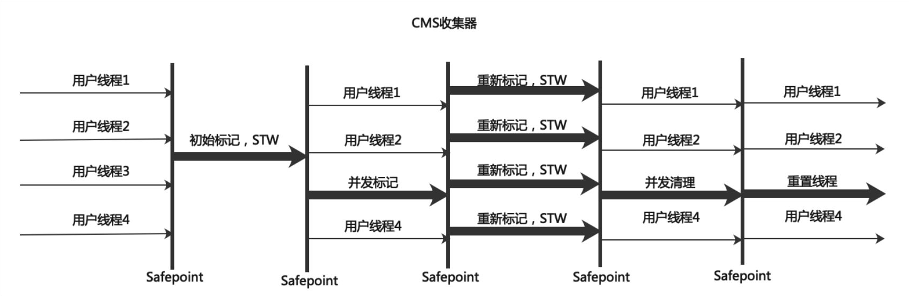

**1 初始标记阶段**

​	初始标记(Initial-Mark)阶段：在这个阶段中，程序中所有的工作线程都将会因为STW机制而出现短暂的暂停，这个阶段的主要任务仅仅只是<span style="color:red;font-weight:bold;">标记出GC Roots能直接关联到的对象</span>。一旦标记完成之后就会恢复之前被暂停的所有应用线程。由于直接关联对象比较小，所以这里的速度非常快。

**2 并发标记阶段**

​	并发标记(Concurrent-Mark)阶段：从GC Roots的直接关联对象开始遍历整个对象图的过程，这个过程耗时较长但是不需要停顿用户线程，可以与垃圾收集线程一起并发运行。

**3 重新标记阶段**

​	重新标记(Remark)阶段：由于在并发标记阶段中，程序的工作线程会和垃圾收集线程同时运行或者交叉运行，为了修正在并发标记期间因用户程序继续运作而导致标记产生变动的那一部分对象的标记记录，需要一次重新标记操作，通常这个阶段的停顿时间会比初始标记阶段稍长一些，但也远比并发标记阶段的时间短。

**4 并发清除阶段**

​	并发清除(Concurrent-Sweep)阶段：此阶段清理已经被标记为死亡的对象，释放内存空间。由于不需要移动存活对象，所以这个阶段也是可以与用户线程同时并发的。


​	尽管CMS收集器采用的是并发回收，但是在其初始化标记和再次标记这两个阶段中仍然需要执行STW机制暂停程序中的工作线程，不过停顿时间并不会太长，因此可以说明目前所有的垃圾收集器都做不到完全不需要STW，只是尽可能地缩短停顿时间。

​	由于最耗费时间的并发标记与并发清除阶段都不需要暂停工作，所以整体的回收是低停顿的。

​	另外，由于在垃圾收集阶段用户线程没有中断，所以在CMS回收过程中，还应该确保应用程序用户线程有足够的内存可用。因此CMS收集器不能像其他收集器那样等到老年代几乎完全被填满了再进行收集，而是当堆内存使用率达到某一阈值时，便开始进行回收，以确保应用程序在CMS工作过程中依然有足够的空间支持应用程序运行。要是CMS运行期间预留的内存无法满足程序需要，就会出现一次“Concurrent Mode Failure”失败，这时虚拟机将启动后备预案：临时启用Serial Old收集器来重新进行老年代的垃圾收集，这样停顿时间就很长了。

​	CMS收集器的垃圾收集算法采用的是标记–清除算法，这意味着每次执行完内存回收后，由于被执行内存回收的无用对象所占用的内存空间极有可能是不连续的一些内存块，不可避免地将会产生一些内存碎片，如下图所示，图中清理完内存之后零碎的小内存区域就是所谓的内存碎片。那么CMS在为新对象分配内存空间时，将无法使用指针碰撞(Bump the Pointer)技术，而只能够选择空闲列表(FreeList)执行内存分配。

​	<span style="color:red;font-weight:bold;">有人会觉得既然标记–清除会造成内存碎片，那么为什么不把算法换成标记–压缩呢</span>？

​	<span style="color:#9400D3;font-weight:bold;">答案其实很简单，要保证用户线程能继续执行，前提是它运行的资源（比如内存占用）不受影响。当CMS并发清除的时候，原来的用户线程依然在使用内存，所以也就无法整理内存。标记—压缩算法更适合在STW这种场景下使用</span>。

​	CMS的优点是并发收集和低延迟。CMS的弊端也很明显。

1. 会产生内存碎片，导致并发清除后，用户线程可用的空间不足。在无法分配大对象的情况下，不得不提前触发Full GC。
2. 对CPU资源非常敏感。在并发阶段，它虽然不会导致用户停顿，但是会因为占用了一部分线程而导致应用程序变慢，总吞吐量会降低。
3. 由于在垃圾收集阶段用户线程没有中断，要是CMS运行期间预留的内存无法满足程序需要，就会出现一次“Concurrent Mode Failure”失败而导致另一次FullGC的产生。
4. 无法处理浮动垃圾。在并发清除阶段由于程序的工作线程和垃圾收集线程是同时运行或者交叉运行的，那么在并发清除阶段如果产生新的垃圾对象，CMS将无法对这些垃圾对象进行标记，最终会导致这些新产生的垃圾对象没有被及时回收，从而只能在下一次执行GC时释放这些之前未被回收的内存空间。

### 16.5.3 CMS收集器的参数设置

​	CMS收集器可以设置的参数如下。

1. -XX:+UseConcMarkSweepGC：指定使用CMS收集器执行内存回收任务。开启该参数后会自动将-XX:+UseParNewGC打开。即垃圾收集器组合为ParNew（Young区用）、CMS（Old区用）和Serial Old（CMS的备用方案）。
2. -XX:CMSlnitiatingOccupanyFraction：设置堆内存使用率的阈值，一旦达到该阈值，便开始进行回收。JDK5及以前版本的默认值为68，即当老年代的空间使用率达到68%时，会执行一次CMS回收。JDK6及以上版本默认值为92%。如果内存增长缓慢，则可以设置一个稍大的值，大的阈值可以有效降低CMS的触发频率，减少老年代回收的次数，可以较为明显地改善应用程序性能。反之，如果应用程序内存使用率增长很快，则应该降低这个阈值，以避免频繁触发老年代串行收集器。
3. -XX:+UseCMSCompactAtFullCollection：用于指定在执行完Full GC后对内存空间进行压缩整理，以此避免内存碎片的产生。不过由于内存压缩整理过程无法并发执行，所带来的问题就是停顿时间变得更长了。
4. -XX:CMSFullGCsBeforeCompaction：设置在执行多少次Full GC后对内存空间进行压缩整理。
5. -XX:ParallelCMSThreads：设置CMS的线程数量。CMS默认启动的线程数是(ParallelGCThreads+3)/4,ParallelGCThreads是新生代并行收集器的线程数。当CPU资源比较紧张时，受到CMS收集器线程的影响，应用程序的性能在垃圾回收阶段可能会非常糟糕。

​	依然使用<span style="color:blue;font-weight:bold;">GCUseTest</span>演示使用CMS垃圾收集器。设置VM options的参数为“-XX:+PrintCommandLineFlags -XX:+UseConcMarkSweepGC”，指定老年代使用CMS垃圾收集器，同时，新生代会触发对ParNew的使用。运行结果如下，其中“-XX:+UseConcMarkSweepGC”表示老年代使用了CMS垃圾收集器，“-XX:+UseParNewGC”表示新生代使用了ParNew垃圾收集器。

```bash
-XX:InitialHeapSize=264987584 -XX:MaxHeapSize=4239801344 -XX:MaxNewSize=872415232 -XX:MaxTenuringThreshold=6 -XX:OldPLABSize=16 -XX:+PrintCommandLineFlags -XX:+UseCompressedClassPointers -XX:+UseCompressedOops -XX:+UseConcMarkSweepGC -XX:-UseLargePagesIndividualAllocation -XX:+UseParNewGC
```

​	到目前为止，已经介绍了3种非常经典的垃圾收集器：Serial垃圾收集器、Parallel垃圾收集器和Concurrent Mark Sweep垃圾收集器。那么这三个垃圾收集器该如何进行选择呢？<span style="color:red;font-weight:bold;">如果想要最小化地使用内存和并行开销，请选Serial垃圾收集器；如果想要最大化应用程序的吞吐量，请选Parallel垃圾收集器；如果想要最小化垃圾收集的停顿时间，请选CMS垃圾收集器</span>。

### 16.5.4 JDK后续版本中CMS的变化

​	2017年JDK9中，G1变成了默认的垃圾收集器，替代了CMS。JDK9中CMS被标记为Deprecate，如果对JDK 9及以上版本的HotSpot虚拟机使用参数“-XX:+UseConcMarkSweepGC”来开启CMS收集器的话，用户会收到一个警告信息，提示CMS未来将会被废弃。

​	2020年3月，JDK14发布，该版本彻底删除了CMS垃圾收集器。如果在JDK14中使用“-XX:+UseConcMarkSweepGC”的话，JVM不会报错，只是给出一个warning信息，不会退出JVM。JVM会自动回退以默认GC方式启动JVM。

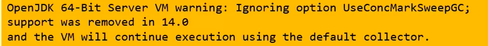

## 16.6 G1收集器：区域化分代式

### 16.6.1 G1收集器

​	G1(Garbage-First)垃圾收集器是在Java7 update 4之后引入的一个新的垃圾收集器，是当今收集器技术发展的最前沿成果之一。

​	既然我们已经有了前面几个强大的垃圾收集器，为什么还要发布G1垃圾收集器呢？原因就在于应用程序所应对的业务越来越庞大、复杂，用户越来越多，没有垃圾收集器不能保证应用程序正常进行，而经常造成STW的垃圾收集器又跟不上实际的需求，所以才会不断地尝试对垃圾收集器进行优化。为了实现在应用程序运行环境内存不断扩大，处理器数量不断增加的情况下，进一步降低停顿时间，同时还能兼顾良好的吞吐量的目标，G1垃圾收集器应运而生。

​	官方给G1设定的目标是在延迟可控的情况下获得尽可能高的吞吐量，担负着“全功能的垃圾收集器”的重任和期望。<span style="color:#FF1493;font-weight:bold;">G1是一款基于并行和并发的收集器，它把堆内存分割为很多区域(Region)，它们虽然物理上不连续，但是逻辑上是连续的</span>。然后使用不同的Region来表示Eden区、Survivor 0区、Survivor 1区、老年代等。

​	G1有计划地避免在整个Java堆中进行全区域的垃圾收集。G1跟踪各个Region里面的垃圾堆积的价值大小（回收所获得的空间大小以及回收所需时间的经验值），在后台维护一个优先列表，每次根据允许的收集时间，优先回收价值最大的Region。

​	由于这种方式的侧重点在于回收垃圾最大量的区间(Region)，所以我们给G1取一个名字就是垃圾优先(Garbage First)。

​	G1在JDK1.7版本正式启用，移除了Experimental（实验性）的标识，是JDK 9以后的默认垃圾收集器，取代了CMS收集器以及Parallel/ Parallel Old组合。在JDK8中还不是默认的垃圾收集器，需要使用“-XX:+UseG1GC”来启用。

### 16.6.2 G1收集器的特点和使用场景

​	G1是一款面向服务端应用的垃圾收集器，主要针对配备多核CPU及大容量内存的机器，极大可能降低垃圾回收停顿时间的同时，还兼具高吞吐量的性能特征。与其他垃圾收集器相比，G1使用了全新的分区算法，其特点如下。

**1 并行与并发**

​	并行性是指G1在回收期间，可以有多个垃圾收集线程同时工作，有效利用多核计算能力。此时用户线程STW。

​	并发性是指G1拥有与应用程序交替执行的能力，部分工作可以和应用程序同时执行，因此，一般来说，不会在整个回收阶段发生完全阻塞应用程序的情况。

**2 分代收集**

​	从分代上看，G1依然属于分代型垃圾收集器，它会区分新生代和老年代，新生代依然有Eden区和Survivor区。但从堆的结构上看，它不要求整个Eden区、新生代或者老年代都是连续的，也不再坚持固定大小和固定数量。详细分区请看16.6.3节。

​	和之前的各类收集器不同，G1可以工作在新生代和老年代。其他收集器要么工作在新生代，要么工作在老年代。

**3 空间整合**

​	CMS采用了标记–清除算法，会存在内存碎片，会在若干次GC后进行一次碎片整理。

​	<span style="color:red;font-weight:bold;">G1将内存划分为一个个的Region。内存的回收是以Region作为基本单位的。Region之间是复制算法，但整体上实际可看作是标记–压缩算法，两种算法都可以避免内存碎片</span>。这种特性有利于程序长时间运行，分配大对象时不会因为无法找到连续内存空间而提前触发下一次GC。尤其是当Java堆非常大的时候，G1的优势更加明显。

**4 可预测的停顿时间模型**

​	这是G1相对于CMS的另一大优势，G1除了追求低停顿外，还能建立可预测的停顿时间模型，能让使用者明确指定在一个长度为Mms的时间片段内，消耗在垃圾收集上的时间不得超过Nms。由于分区的原因，G1可以只选取部分区域进行内存回收，这样缩小了回收的范围，因此STW的情况也可以得到较好的控制。G1跟踪各个Region里面的垃圾堆积的价值大小（回收所获得的空间大小以及回收所需时间的经验值），在后台维护一个优先列表，每次根据允许的收集时间，优先回收价值最大的Region。保证了G1收集器在有限的时间内可以获取尽可能高的收集效率。相比于CMS GC,G1未必能做到CMS在最好情况下的延时停顿，但是比最差情况要好很多。

​	G1垃圾收集器相较于CMS，还不具备全方位、压倒性优势。比如在用户程序运行过程中，G1无论是为了垃圾收集产生的内存占用(Footprint)还是程序运行时的额外执行负载(Overload)都要比CMS要高。从经验上来说，在小内存应用上CMS的表现大概率会优于G1，而G1在大内存应用上则发挥其优势，平衡点在6～8G。

​	G1收集器主要面向服务端应用，针对具有大内存、多处理器的机器，在普通大小的堆里表现并不惊喜。如果应用需要较低停顿时间，并且需要比较大的堆内存提供支持时，那么G1收集器无疑是比较合适的垃圾收集器，例如在堆大小约6GB或更大时，可预测的停顿时间可以低于0.5秒。

​	一般我们认为在下面的几种情况中，使用G1可能比CMS更好。

1. 超过50%的Java堆被活动数据占用。
2. 对象分配频率或年代提升频率变化很大。
3. GC停顿时间过长（长于0.5～1s）。

​	HotSpot垃圾收集器里，除了G1以外，其他的垃圾收集器使用内置的JVM线程执行垃圾收集的多线程操作，而G1可以采用应用线程承担后台运行的垃圾收集工作，即当JVM的垃圾收集线程处理速度慢时，系统会调用应用程序线程帮助加速垃圾回收过程。

### 16.6.3 分区Region：化整为零

​	使用G1收集器时，它将整个Java堆划分成约2048个大小相同的独立Region块，每个Region块大小根据堆空间的实际大小而定，整体被控制在1MB到32MB，且为2的N次幂，即1MB、2MB、4MB、8MB、16MB、32MB。Region块大小可以通过“-XX:G1HeapRegionSize”设定。所有的Region大小相同，且在JVM生命周期内不会被改变。

​	虽然还保留有新生代和老年代的概念，但新生代和老年代不再是物理隔离的了，它们都是一部分Region（不需要连续）的集合。通过Region的动态分配方式实现逻辑上的连续，如下图所示。

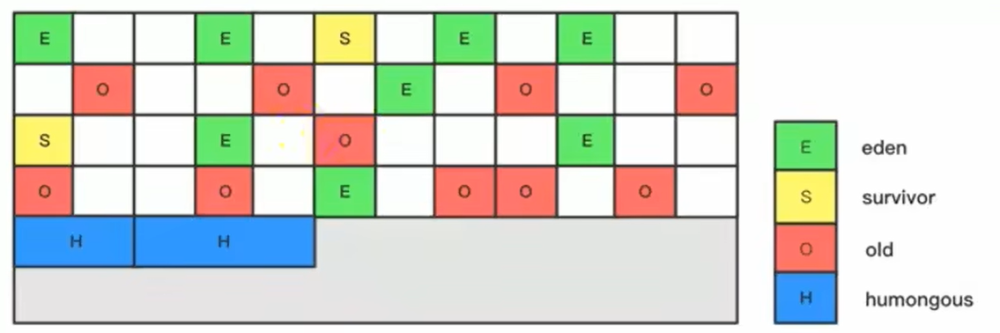

<div style="text-align:center;font-weight:bold;">Region分区</div>

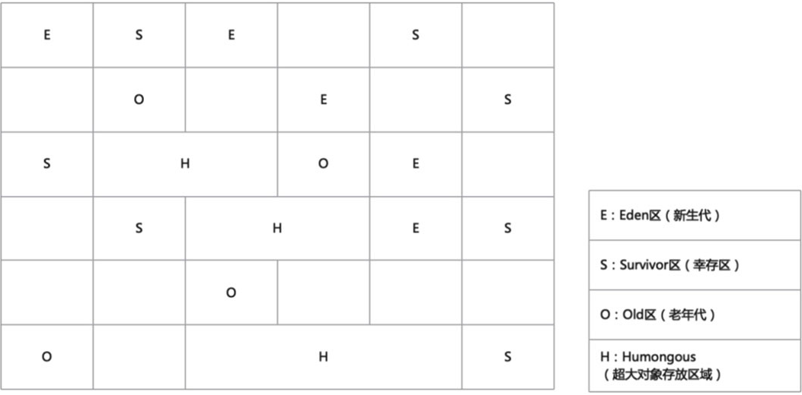

​	一个Region有可能属于Eden、Survivor或者Old/Tenured内存区域。注意一个Region只可能属于一个角色。上图中的E表示该Region属于Eden内存区域，S表示属于Survivor内存区域，O表示属于Old内存区域。上图中空白区域表示未使用的内存空间。

​	G1垃圾收集器还增加了一种新的内存区域，叫作Humongous内存区域，如上图中的H块，主要用于存储大对象，如果超过1.5个Region，就放到H。设置H的原因是对于堆中的大对象，默认直接会被分配到老年代，但是如果它是一个短期存在的大对象，就会对垃圾收集器造成负面影响。为了解决这个问题，G1划分了一个Humongous区，它用来专门存放大对象。如果一个H区装不下一个大对象，那么G1会寻找连续的H区来存储。为了能找到连续的H区，有时候不得不启动FullGC。G1的大多数行为都把H区作为老年代的一部分来看待。

​	正常的Region的内存大小为4MB左右。Region区域使用指针碰撞算法来为对象分配内存，每一个分配的Region被分成两部分，已分配(allocated)和未分配(unallocate)的，它们之间的界限称为top指针。将变量或对象实体存放到当前的allocated区域，未使用的unallocate区域。当再分配新的对象的时候指针(top)右移将新对象存放到allocated区域，如下图所示。当然在多线程情况下，会有并发的问题，G1收集器采用的是TLAB(Thread Local Allocation Buffer)和CAS(Compare and Swap)来解决并发的安全问题，关于TLAB和CAS的介绍本书第9章已经讲过，此处不再赘述。

<div style="text-align:center;font-weight:bold;">Region的指针碰撞</div>

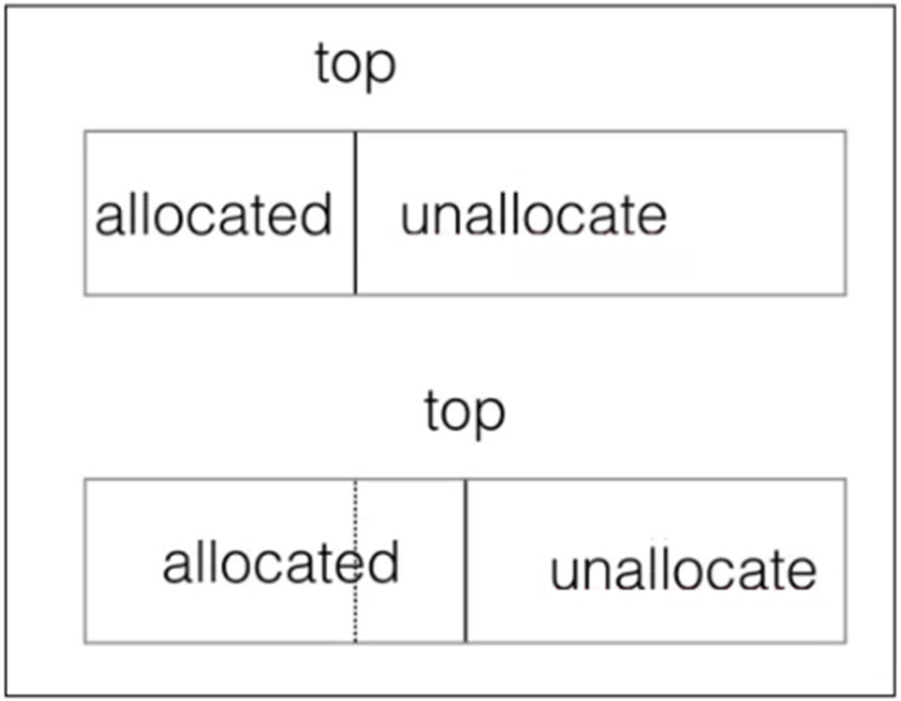

### 16.6.4 G1收集器垃圾回收过程

​	G1可以作用于整个新生代和老年代，G1的垃圾回收过程主要包括如下三个环节。

​	新生代GC(Young GC)。

​	老年代并发标记(Concurrent Marking)。

​	混合回收(Mixed GC)。

​	作为JVM的兜底逻辑，如果应用程序垃圾收集时内存不足，G1会像其他收集器一样执行Full GC，即强力回收内存。

​	垃圾回收的流程如下图所示，按图中顺时针走向，以新生代GC=>新生代GC+并发标记过程=>混合GC顺序进行垃圾回收。首先执行新生代GC，之后执行并发标记过程，该过程会伴随着Young GC的发生，最后执行混合GC。

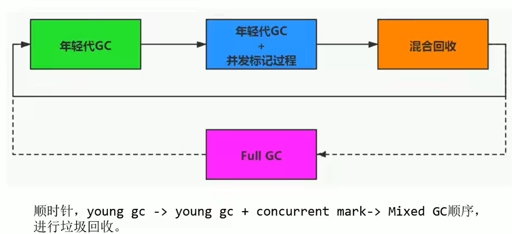

<div style="text-align:center;font-weight:bold;">G1垃圾收集器回收过程</div>

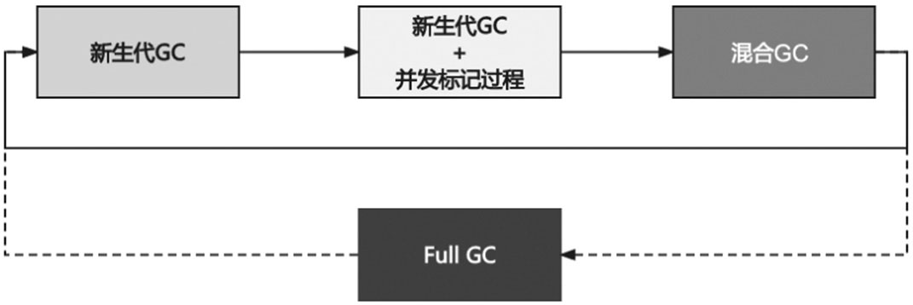

​	应用程序分配内存，当新生代的Eden区用尽时开始新生代回收过程。G1的新生代收集阶段是一个并行的独占式收集器。在新生代回收期，G1暂停所有应用程序线程，启动多线程执行新生代回收。然后从新生代区移动存活对象到Survivor区或者老年代区，也有可能是两个区都会涉及。

​	当堆内存使用达到一定值（默认45%）时，开始老年代并发标记过程。标记完成马上开始混合回收过程。对于一个混合回收期，G1从老年代区移动存活对象到空闲区，这些空闲区也就成为老年代的一部分。G1收集器在老年代的处理方式和其他垃圾收集器不同，G1不需要回收整个老年代，一次只需要扫描／回收一小部分老年代的Region就可以了。同时，这个老年代Region是和新生代一起被回收的。

​	G1收集器在回收的过程会有很多问题，比如一个对象被不同区域引用的问题，一个Region不可能是孤立的，一个Region中的对象可能被其他任意Region中对象引用，判断对象存活时，是否需要扫描整个Java堆才能保证准确。在其他的分代收集器，也存在这样的问题（而G1更突出）。回收新生代也不得不同时扫描老年代，因为判断对象可达，需要通过GC Roots来判断对象是否可达，那么寻找GC Roots的过程可能会放大范围，查找到老年代的对象，这样会降低Young GC的效率。

​	针对上述问题，JVM给出的解决方法如下。

​	无论G1还是其他分代收集器，JVM都是使用记忆集(Remembered Set,Rset)来避免全局扫描。

​	每个Region都有一个对应的Remembered Set。

​	每次Reference类型数据写操作时，都会产生一个写屏障(Write Barrier)暂时中断操作。然后检查将要写入的引用指向的对象是否和该引用类型数据在不同的Region（其他收集器：检查老年代对象是否引用了新生代对象）。

​	如果不同，通过CardTable把相关引用信息记录到引用指向对象的所在Region对应的Remembered Set中。

​	当进行垃圾收集时，在GC根节点的枚举范围加入Remembered Set；就可以保证不进行全局扫描，也不会有遗漏。

​	如下图所示，存在3个Region，每个Region包含一个Rset，当产生一个新对象放在Region2中时，此时判断指向该对象的引用是否都在Region2中；可以发现该对象存在两个引用对象，分别在Region1和Region3中，所以需要通过CardTable把引用信息记录到Region2中的Rset中。

<div style="text-align:center;font-weight:bold;">Remembered Set的执行过程</div>

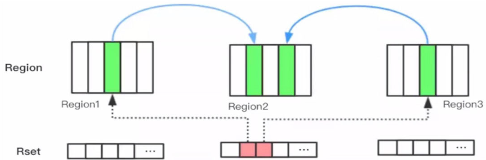

**1 G1回收过程一：新生代GC**

​	JVM启动时，G1先准备好Eden区，程序在运行过程中不断创建对象到Eden区，当Eden空间耗尽时，G1会启动一次新生代垃圾回收过程。新生代垃圾回收只会回收Eden区和Survivor区。

​	新生代GC时，首先G1停止应用程序的执行(Stop-The-World)，G1创建回收集(Collection Set)，回收集是指需要被回收的内存分段的集合，新生代回收过程的回收集包含新生代Eden区和Survivor区所有的内存分段。如下图所示，可以看到内存回收之后部分Eden区和Survivor区直接清空变为新的Survivor区，也有Survivor区的直接晋升为Old区。

<div style="text-align:center;font-weight:bold;">回收前内存分段图</div>

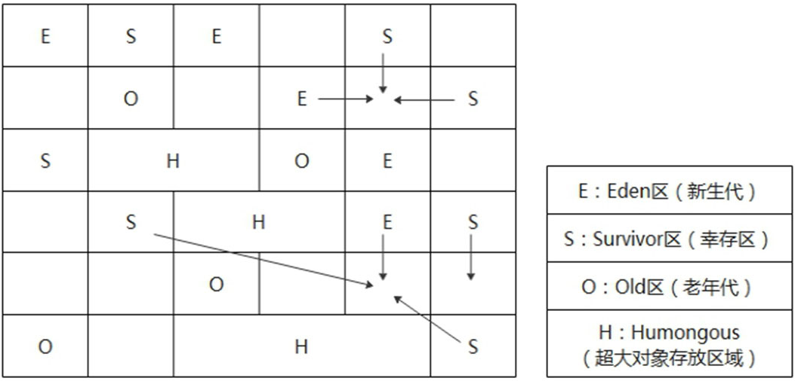

<div style="text-align:center;font-weight:bold;">回收后内存分段图</div>

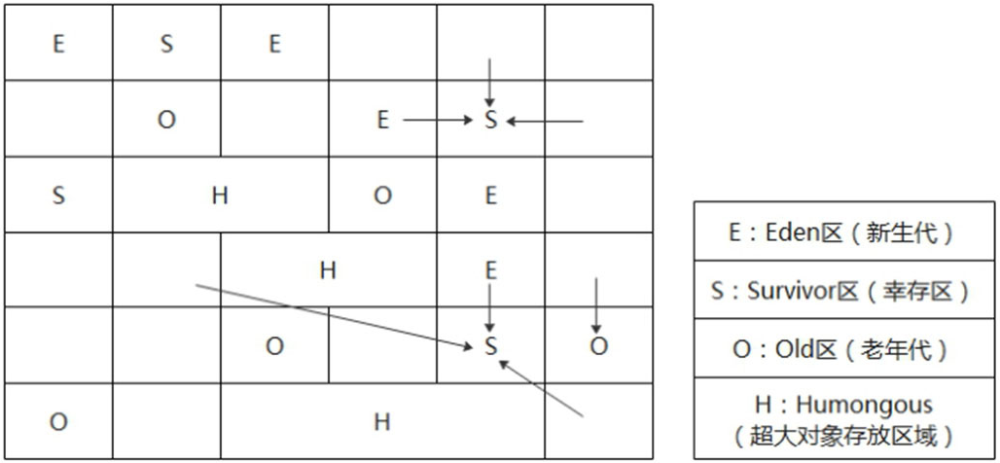

​	然后开始如下回收过程。

​	第一阶段，扫描根。

​	根是指static变量指向的对象，正在执行的方法调用链条上的局部变量等。根引用连同RSet记录的外部引用作为扫描存活对象的入口。

​	第二阶段，更新RSet。

​	对于应用程序的引用赋值语句“object.field=object”，JVM会在之前和之后执行特殊的操作，在dirty card queue中入队一个保存了对象引用信息的card。

​	处理dirty card queue中的card，更新RSet。此阶段完成后，RSet可以准确地反映老年代对所在的内存分段中对象的引用。

​	那为什么不在引用赋值语句处直接更新RSet呢？这是为了性能的需要，RSet的处理需要线程同步，开销会很大，使用队列性能会好很多。

​	第三阶段，处理RSet。

​	识别被老年代对象指向的Eden中的对象，这些被指向的Eden中的对象被认为是存活的对象。

​	第四阶段，复制对象。

​	此阶段，对象树被遍历，Eden区内存段中存活的对象会被复制到Survivor区中空的内存分段，Survivor区内存段中存活的对象如果年龄未达阈值，年龄会加1，达到阈值会被复制到Old区中空的内存分段。如果Survivor空间不够，Eden空间的部分数据会直接晋升到老年代空间。

​	第五阶段，处理引用。

​	处理Soft、Weak、Phantom、Final、JNI Weak等引用。最终Eden空间的数据为空，GC停止工作，而目标内存中的对象都是连续存储的，没有碎片，所以复制过程可以达到内存整理的效果，减少碎片。

​	新生代GC完成以后，接下来就是老年代并发标记过程了。

**2 G1回收过程二：并发标记过程**

​	并发标记过程主要包含5个步骤，如下所示。

​	初始标记阶段：标记从根节点直接可达的对象。这个阶段是STW的，并且会触发一次新生代GC。

​	根区域扫描(Root Region Scanning)：G1GC扫描Survivor区直接可达的老年代区域对象，并标记被引用的对象。这一过程必须在新生代GC之前完成。

​	并发标记(Concurrent Marking)：在整个堆中进行并发标记（和应用程序并发执行），此过程可能被新生代GC中断。在并发标记阶段，若发现区域对象中的所有对象都是垃圾，那这个区域会被立即回收。同时，并发标记过程中，会计算每个区域的对象活性（区域中存活对象的比例）。

​	再次标记(Remark)：由于应用程序持续进行，需要修正上一次的标记结果，是STW的。G1中采用了比CMS更快的初始快照算法snapshot-at-the-beginning（SATB）。

​	独占清理(Cleanup)：计算各个区域的存活对象和GC回收比例，并进行排序，识别可以混合回收的区域。为下阶段做铺垫，这个过程是STW的。这个阶段并不会实际上去做垃圾的收集。

​	并发清理阶段：识别并清理完全空闲的区域。

**3 G1回收过程三：混合回收(Mixed GC)**

​	如下图所示，当越来越多的对象晋升到老年代区时，为了避免堆内存被耗尽，虚拟机会触发一个混合的垃圾收集器，即Mixed GC，该算法并不是一个OldGC，除了回收整个新生代区，还会回收一部分的老年代区。这里需要注意的是回收一部分老年代，而不是全部老年代。可以选择哪些老年代区进行收集，从而可以对垃圾回收的所耗时间进行控制。也要注意的是Mixed GC并不是Full GC。

<div style="text-align:center;font-weight:bold;">混合回收</div>

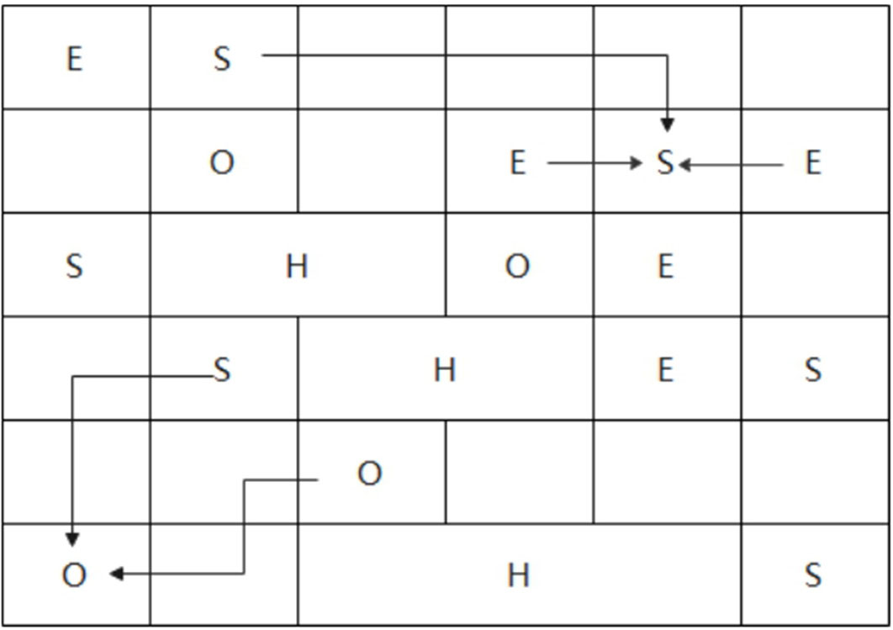

​	并发标记结束以后，老年代中百分百为垃圾的内存分段被回收了，部分为垃圾的内存分段被计算了出来。G1的混合回收阶段是可以分多次进行的，但每次都会进入STW状态，次数默认是8次（可以通过“-XX:G1MixedGCCountTarget”设置）被回收。运行逻辑是先STW，执行一次混合回收回收一些Region，接着恢复系统运行，然后再STW，再执行混合回收。

​	每次混合回收的回收集(Collection Set)包括需要回收的老年代区的八分之一、Eden区以及Survivor区。混合回收的算法和新生代回收的算法完全一样，只是回收集多了老年代的内存Region。具体过程请参考上面的新生代回收过程。

​	由于老年代中的内存分段默认分8次回收，G1会优先回收垃圾多的Region。垃圾占Region比例越高，越会被先回收。并且有一个阈值会决定Region是否被回收，“-XX:G1Mixe dGCLiveThresholdPercent”默认为65%，意思是垃圾占内存分段比例要达到65%才会被回收。如果垃圾占比太低，意味着存活的对象占比高，在复制的时候会花费更多的时间。

​	混合回收并不一定要进行8次，事实上，混合回收阶段具体执行几次回收，看的是空闲的Region数量何时达到堆内存的10%，如果执行3次回收就达到了10%，就不会再继续执行回收了。这个10%可以使用参数“-XX:G1HeapWastePercent”来控制。该参数默认值为10%，意思是允许整个堆内存中有10%的空间被浪费，意味着如果发现可以回收的垃圾占堆内存的比例低于10%，则不再进行混合回收。因为GC会花费很多的时间但是回收到的内存却很少。

**4 G1回收可选的过程四：Full GC**

​	G1的初衷就是要避免Full GC的出现。但是如果上述方式不能正常工作，G1会停止应用程序的执行(Stop-The-World)，使用单线程的内存回收算法进行垃圾回收，性能会非常差，应用程序停顿时间会很长。

​	要避免Full GC的发生，一旦发生需要进行调整。什么时候会发生Full GC呢？比如堆内存太小，当G1在复制存活对象的时候没有空的内存分段可用，则会回退到FullGC，这种情况可以通过增大内存解决。

​	导致G1 Full GC的原因可能有两个：

1. Evacuation的时候没有足够的to-space来存放晋升的对象；
2. 并发处理过程完成之前空间耗尽。

**5 G1回收过程：补充**

​	从Oracle官方透露出来的信息可获知，回收阶段(Evacuation)其实本也有想过设计成与用户程序一起并发执行，但这件事情做起来比较复杂，考虑到G1只回收一部分Region，停顿时间是用户可控制的，所以并不迫切去实现，而选择把这个特性放到了G1之后出现的低延迟垃圾收集器（即ZGC）中。另外，还考虑到G1不是仅仅面向低延迟，停顿用户线程能够最大幅度提高垃圾收集效率，为了保证吞吐量所以才选择了完全暂停用户线程的实现方案。

**6 G1收集器优化建议**

​	针对G1收集器优化，我们给出以下建议，大家在学习过程中可以参考。

1. 新生代大小不要固定。避免使用“-Xmn”或“-XX:NewRatio”等相关选项显式设置新生代大小，固定新生代的大小会覆盖停顿时间目标。
2. 停顿时间目标不要太过严苛。G1的吞吐量目标是90%的应用程序时间和10%的垃圾回收时间。评估G1的吞吐量时，停顿时间目标不要太严苛。目标太过严苛表示你愿意承受更多的垃圾回收开销，而这些会直接影响到吞吐量。

### 16.6.5 G1收集器的参数设置

​	G1收集器的相关参数说明如下。

​	-XX:+UseG1GC：指定使用G1收集器执行内存回收任务，JDK 9之后G1是默认垃圾收集器。

​	-XX:G1HeapRegionSize：设置每个Region的大小，值是2的幂次方，范围是1MB到32MB，目标是根据最小的Java堆大小划分出约2048个区域。默认值是堆内存的1/2000。

​	-XX:MaxGCPauseMillis：设置期望达到的最大GC停顿时间指标（JVM会尽力实现，但不保证达到）。默认值是200ms。

​	-XX:ParallelGCThread：设置STW时并行的GC线程数量值。最多可以设置为8。-XX:ConcGCThreads：设置并发标记的线程数。通常设置为并行垃圾回收线程数(ParallelGCThreads)的1/4左右。

​	-XX:ConcGCThreads：设置并发标记的线程数。通常设置为并行垃圾回收线程数(ParallelGCThreads)的1/4左右。

​	-XX:InitiatingHeapOccupancyPercent：设置触发并发GC周期的Java堆占用率阈值，超过此值，就触发GC。默认值是45。

​	G1的设计原则就是简化JVM性能调优，开发人员只需要简单地配置即可完成调优。首先开启G1垃圾收集器，然后设置堆的最大内存，最后设置最大停顿时间即可。

​	G1中提供了三种垃圾回收模式，它们分别是Young GC、Mixed GC和Full GC，在不同的条件下被触发。

## 16.7 垃圾收集器的新发展

​	垃圾收集器仍然处于飞速发展之中，目前的默认收集器G1仍在不断地改进，例如串行的Full GC在JDK 10以后，已经改成了并行运行。

​	即使是Serial GC，虽然比较古老，但是简单的设计和实现未必就是过时的，它本身的开销，不管是GC相关数据结构的开销，还是线程的开销，都是非常小的。随着云计算的兴起，在Serverless等新的应用场景下，Serial GC也有了新的舞台。

​	比较不幸的是CMS GC，因为其算法的理论缺陷等原因，虽然现在还有非常大的用户群体，但在JDK 9中已经被标记为废弃，并在JDK 14版本中移除。

​	在JDK 11中出现了两个新的垃圾收集器：Epsilon和ZGC。

​	在JDK 12中引入了Shenandoah GC。

### 16.7.1 Epsilon和ZGC

​	在JDK 11中出现了两个新的垃圾收集器：Epsilon和ZGC。Epsilon垃圾收集器是一个无操作的收集器(A No-Op Garbage Collector)。Epsilon垃圾收集器是为不需要或禁止GC的场景提供的最小实现，它仅实现了“分配”部分，我们可以在它上面来实现回收功能。

​	ZGC垃圾收集器是一个可伸缩的低延迟垃圾收集器，处于实验性阶段[A ScalableLow-Latency Garbage Collector(Experimental)]。

​	ZGC与Shenandoah（请看16.7.2节）目标高度相似，在尽可能减小对吞吐量影响的前提下，实现在任意堆内存大小下把垃圾回收的停顿时间限制在10ms以内的超低延迟。《深入理解Java虚拟机》一书中这样定义ZGC：“ZGC收集器是一款基于Region内存布局的，（暂时）不设分代的，使用了读屏障、染色指针和内存多重映射等技术来实现可并发的标记–整理算法的，以低延迟为首要目标的一款垃圾收集器。”

<div style="text-align:center;font-weight:bold;">吞吐量测试数据</div>

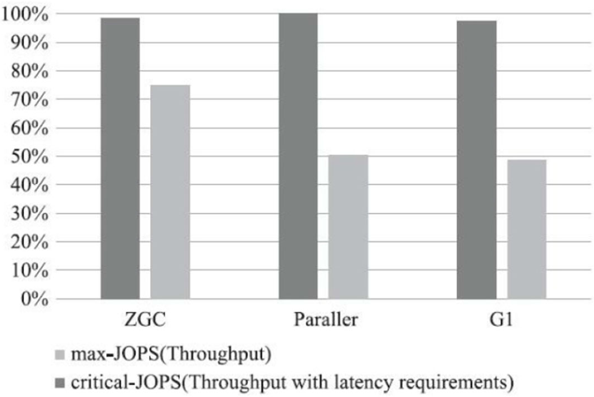

​	ZGC的工作过程可以分为4个阶段：并发标记→并发预备重分配→并发重分配→并发重映射。

​	ZGC几乎在所有地方都是并发执行的，除了初始标记的是STW。所以停顿时间几乎就耗费在初始标记上，这部分的实际时间是非常少的。吞吐量的测试数据如上图所示。

​	低延迟性的测试数据如下图所示。

<div style="text-align:center;font-weight:bold;">低延迟性测试数据</div>

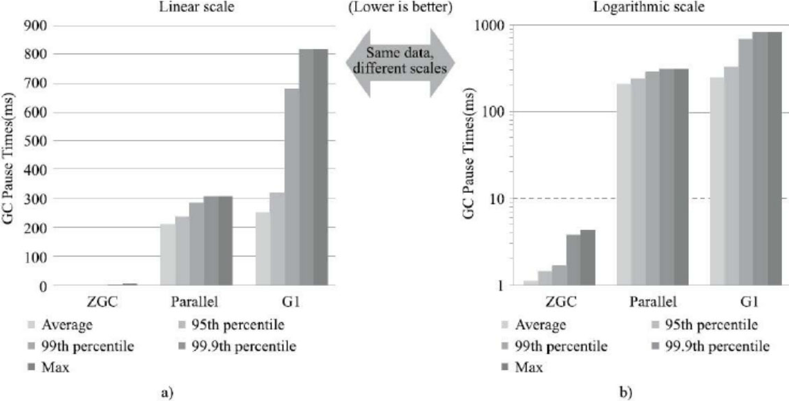

​	在ZGC的强项停顿时间测试上，它毫不留情地将Parallel、G1拉开了两个数量级的差距。无论平均停顿、95%停顿、99%停顿、99.9%停顿，还是最大停顿时间，ZGC都能毫不费劲地控制在10ms以内。

​	虽然ZGC还在试验状态，没有完成所有特性，但此时性能已经相当亮眼，用“令人震惊、革命性”来形容，不为过。未来将在服务端、大内存、低延迟应用的首选垃圾收集器。JDK14之前，ZGC仅Linux才支持，尽管许多使用ZGC的用户都使用类Linux的环境，但在Windows和macOS上，人们也需要ZGC进行开发部署和测试，在JDK14中ZGC扩展了在macOS和Windows平台上的应用。许多桌面应用也可以从ZGC中受益。想要使用ZGC，可以通过如下参数实现。

```bash
-XX:+UnlockExperimentalVMOptions -XX:+UseZGC
```

### 16.7.2 Shenandoah GC

​	2019年3月，JDK12发布，另一种实验性GC被引入，它就是Shenandoah GC，也是一种低停顿时间的GC。

​	但是Shenandoah无疑是众多GC中最孤独的一个。因为它是第一款不由Oracle公司团队领导开发的HotSpot垃圾收集器，不可避免地受到官方的排挤。Shenandoah垃圾收集器最初由RedHat进行的一项垃圾收集器研究项目PauselessGC实现，旨在针对JVM上的内存回收实现低停顿的需求，在2014年贡献给OpenJDK，但是OracleJDK目前还未正式接纳Shenandoah GC。

​	Shenandoah GC和ZGC一样都是强调低停顿时间的GC。Shenandoah研发团队对外宣称，Shenandoah垃圾收集器的停顿时间与堆大小无关，这意味着无论将堆设置为200 MB还是200GB,99.9%的目标都可以把垃圾收集的停顿时间限制在10ms以内。不过实际使用性能将取决于实际工作堆的大小和工作负载。RedHat 在2016年使用Elastic Search对200GB的维基百科数据进行索引，如表16-1所示是论文中展示的测试数据。

<div style="text-align:center;font-weight:bold;">不同垃圾收集器性能测试</div>


​	从结果可以发现：

1. Shenandoah停顿时间比其他几款收集器确实有了质的飞跃，但也未实现最大停顿时间控制在10ms以内的目标。
2. Shenandoah吞吐量方面出现了明显的下降，总运行时间是所有测试收集器里最长的。

​	Shenandoah的弱项是高运行负担下的吞吐量下降。Shenandoah的强项是低延迟时间。Shenandoah的工作过程大致分为九个阶段，这里就不再过多介绍了，有兴趣的读者可以查看尚硅谷官网公开视频。

## 16.8 垃圾收集器总结

​	每一款不同的垃圾收集器都有不同的特点，在具体使用的时候，需要根据具体的情况选用不同的垃圾收集器，目前主流垃圾收集器的特点对比如下表所示。

<div style="text-align:center;font-weight:bold;">垃圾收集器特点</div>

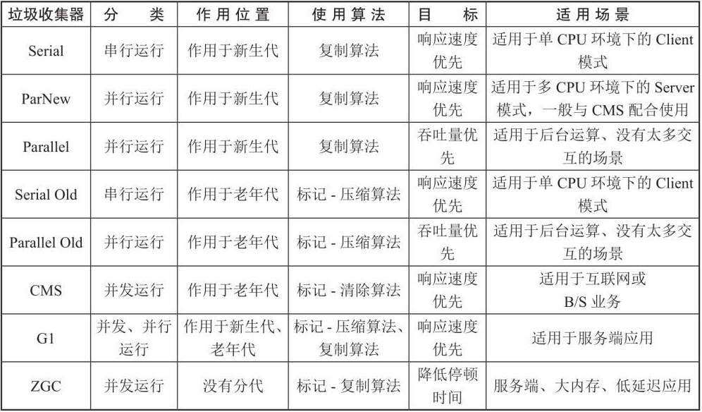

| 垃圾收集器   | 分类           | 作用位置             | 使用算法                | 特点         | 适用场景                             |
| ------------ | -------------- | -------------------- | ----------------------- | ------------ | ------------------------------------ |
| Serial       | 串行运行       | 作用于新生代         | 复制算法                | 响应速度优先 | 适用于单CPU环境下的Clien模式         |
| ParNew       | 并行运行       | 作用于新生代         | 复制算法                | 响应速度优先 | 多CPU环境Server模式下与CMS配合使用   |
| Parallel     | 并行运行       | 作用于新生代         | 复制算法                | 吞吐量优先   | 适用于后台运算而不需要太多交互的场景 |
| Serial Old   | 串行运行       | 作用于老年代         | 标记-压缩算法           | 响应速度优先 | 适用于单CPU环境下的Clien模式         |
| Parallel Old | 并行运行       | 作用于老年代         | 标记-压缩算法           | 吞吐量优先   | 适用于后台运算而不需要太多交互的场景 |
| CMS          | 并发运行       | 作用于老年代         | 标记-清除算法           | 响应速度优先 | 适用于互联网或B/S业务                |
| G1           | 并发、并行运行 | 作用于新生代、老年代 | 标记-压缩算法、复制算法 | 响应速度优先 | 面相服务端应用                       |

​	垃圾收集器从Serial发展到ZGC，经历了很多不同的版本，Serial=>Parallel（并行）=>CMS（并发）=>G1=>ZGC。不同厂商、不同版本的虚拟机实现差别很大。HotSpot虚拟机在JDK7/8后所有收集器及组合（连线）在第16.1.3节给大家做了展示。

​	Java垃圾收集器的配置对于JVM优化来说是很重要的，选择合适的垃圾收集器可以让JVM的性能有一个很大的提升。怎么选择垃圾收集器呢？我们可以参考下面的选择标准。

​	优先让JVM自适应调整堆的大小。

​	如果内存小于100M，使用串行收集器。

​	如果是单核、单机程序，并且没有停顿时间的要求，串行收集器。

​	如果是多CPU、需要高吞吐量、允许停顿时间超过1s，选择并行或者JVM自己选择。

​	如果是多CPU、追求低停顿时间，需快速响应（比如延迟不能超过1s，如互联网应用），使用并发收集器。

​	最后需要明确一个观点，没有最好的收集器，更没有万能的收集器。调优永远是针对特定场景、特定需求，不存在一劳永逸的收集器。

# 第三篇 字节码与类的加载篇

# 第17章 class文件结构

​	一段Java程序编写完成后，会被存储到以.java为后缀的源文件中，源文件会被编译器编译为以.class为后缀的二进制文件，之后以.class为后缀的二进制文件会经由类加载器加载至内存中。本章我们要讲的重点就是以.class为后缀的二进制文件，也简称为class文件或者字节码文件。接下来将会介绍class文件的详细结构，以及如何解析class文件。

## 17.1 概述

### 17.1.1 class文件的跨平台性

​	Java是一门跨平台的语言，也就是我们常说的“Write once,run anywhere”，意思是当Java代码被编译成字节码后，就可以在不同的平台上运行，而无须再次编译。但是现在这个优势不再那么吸引人了，Python、PHP、Perl、Ruby、Lisp等语言同样有强大的解释器。跨平台几乎成为一门开发语言必备的特性。

​	虽然很多语言都有跨平台性，但是JVM却是一个跨语言的平台。JVM不和包括Java在内的任何语言绑定，它只与class文件这种特定的二进制文件格式关联。无论使用何种语言开发软件，只要能将源文件编译为正确的class文件，那么这种语言就可以在JVM上执行，如下图所示，比如Groovy语言、Scala语言等。可以说规范的class文件结构，就是JVM的基石、桥梁。

<div style="text-align:center;font-weight:bold;">跨语言的JVM</div>


​	JVM有很多不同的实现，但是所有的JVM全部遵守Java虚拟机规范，也就是说所有的JVM环境都是一样的，只有这样class文件才可以在各种JVM上运行。在Java发展之初，设计者就曾经考虑并实现了让其他语言运行在Java虚拟机之上的可能性，他们在发布规范文档的时候，也刻意把Java的规范拆分成了Java语言规范及Java虚拟机规范。官方虚拟机规范如下图所示。

<div style="text-align:center;font-weight:bold;">虚拟机规范</div>

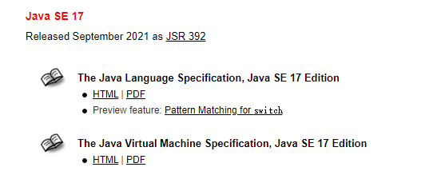

​	想要让一个Java程序正确地运行在JVM中，Java源文件就必须要被编译为符合JVM规范的字节码。前端编译器就是负责将符合Java语法规范的Java代码转换为符合JVM规范的class文件。常用的javac就是一种能够将Java源文件编译为字节码的前端编译器。javac编译器在将Java源文件编译为一个有效的class文件过程中经历了4个步骤，分别是词法解析、语法解析、语义解析以及生成字节码。

​	Oracle的JDK软件中除了包含将Java源文件编译成class文件外，还包含JVM的运行时环境。如下图所示，Java源文件(Java Source)经过编译器编译为class文件，之后class文件经过ClassLoader加载到虚拟机的运行时环境。需要注意的是ClassLoader只负责class文件的加载，至于class文件是否可以运行，则由执行引擎决定。

<div style="text-align:center;font-weight:bold;">JDK结构</div>


### 17.1.2 编译器分类

​	Java源文件的编译结果是字节码，那么肯定需要有一种编译器将Java源文件编译为class文件，承担这个重要责任的就是配置在path环境变量中的javac编译器。javac是一种能够将Java源文件编译为字节码的前端编译器。

​	HotSpot VM并没有强制要求前端编译器只能使用javac来编译字节码，其实只要编译结果符合JVM规范都可以被JVM所识别。

​	在Java的前端编译器领域，除了javac，还有一种经常用到的前端编译器，那就是内置在Eclipse中的ECJ(Eclipse Compiler for Java)编译器。和javac的全量式编译不同，ECJ是一种增量式编译器。

​	在Eclipse中，当开发人员编写完代码，使用Ctrl+S快捷键保存代码时，ECJ编译器会把未编译部分的源码逐行进行编译，而不是每次都全量编译。因此ECJ的编译效率更高。

​	ECJ不仅是Eclipse的默认内置前端编译器，在Tomcat中同样也是使用ECJ编译器来编译jsp文件。由于ECJ编译器是采用GPLv2的开源协议进行开源的，所以大家可以在Eclipse官网下载ECJ编译器的源码进行二次开发。另外，IntelliJ IDEA默认使用javac编译器。

​	我们把不同的编程语言类比为不同国家的语言，它们经过前端编译器处理之后，都变成同一种class文件。如图17-4所示，前端编译器把各个国家的“你好”编译为一样的“乌拉库哈吗哟”，这个“乌拉库哈吗哟”就好比class文件中的内容。class文件对于执行引擎是可以识别的，所以JVM是跨语言的平台，其中起关键作用的就是前端编译器。

<div style="text-align:center;font-weight:bold;">前端编译器</div>

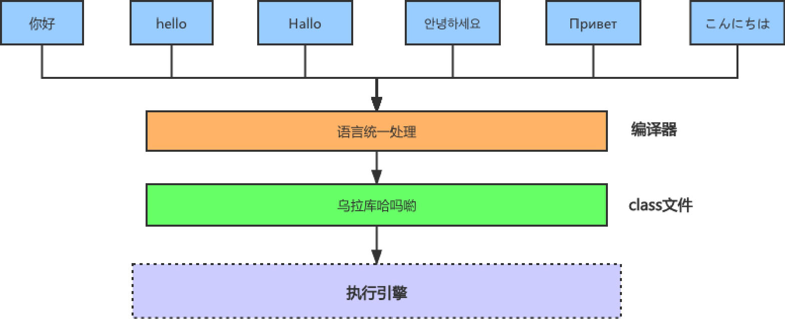


​	前端编译器并不会直接涉及编译优化等方面的技术，而是将这些具体优化细节移交给HotSpot内置的即时编译器(Just In Time,JIT)负责，比如前面第11章讲过JIT编译器可以对程序做栈上分配、同步省略等优化。为了区别前面讲的javac，把JIT称为后端编译器。

​	除了上面提到的前端编译器和后端编译器，还有我们在11章提到的AOT编译器和Graal编译器。

### 17.1.3 透过字节码指令看代码细节

​	通过学习class文件，可以查看代码运行的详细信息。如下代码所示，测试不同Integer变量是否相等。

<span style="color:#40E0D0;">案例1：测试不同Integer值是否相等</span>

- 代码

```java
/**
 * 测试不同Integer值是否相等
 */
public class IntegerTest {
    public static void main(String[] args) {
        Integer i1 = 10;
        Integer i2 = 10;
        System.out.println(i1 == i2); // true

        Integer i3 = 128;
        Integer i4 = 128;
        System.out.println(i3 == i4); // false
    }
}
```

​	显而易见，两次运行结果并不相同。定义的变量是Integer类型，采用的是直接赋值的形式，并没有通过某一个方法进行赋值，所以无法看到代码底层的执行逻辑是怎样的，那么只能通过查看class文件来分析问题原因。通过IDEA中的插件jclasslib查看class文件，如下图所示。

<div style="text-align:center;font-weight:bold;">IntegerTest字节码文件</div>

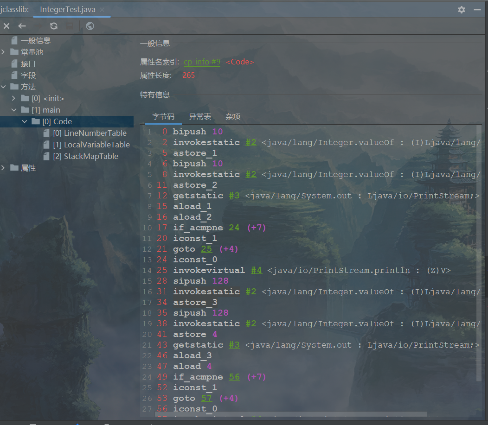

​	class文件中包含很多字节码指令，分别表示程序代码执行期间用到了哪些指令，具体指令会在后面的章节中详细讲解。这里仅说一下Integer i1 = 10语句执行的是<java/lang/Integer.valueOf>方法，也就是Integer类中的valueOf方法，我们查看源代码如下图所示。

<div style="text-align:center;font-weight:bold;">java.lang.Integer#valueOf源代码</div>

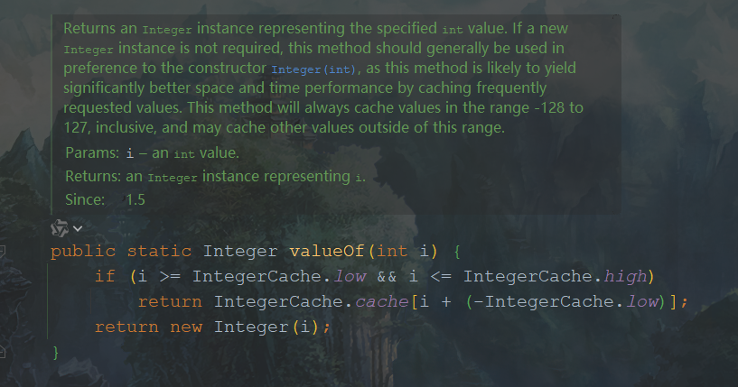

​	可以发现对Integer赋值的时候，通过i和IntegerCache类高位值和低位值的比较，判断i是否直接从IntegerCache内cache数组获取数据。IntegerCache类的低位值为-128，高位值为127。如果赋值在低位值和高位值范围内，则返回IntegerCache内cache数组中的同一个值；否则，重新创建Integer对象。这也是为什么当Integer变量赋值为10的时候输出为true,Integer变量赋值为128的时候输出为false。

## 17.2 虚拟机的基石：class文件

​	源代码经过编译器编译之后生成class文件，字节码是一种二进制的文件，它的内容是JVM的指令，其不像C、C++经由编译器直接生成机器码。

### 17.2.1 字节码指令

​	JVM的指令由一个字节长度的、代表着某种特定操作含义的操作码(opcode)以及跟随其后的零至多个代表此操作所需参数的操作数(operand)所构成。虚拟机中许多指令并不包含操作数，只有一个操作码。如下图所示，其中aload_1是操作码，没有操作数。bipush 10中的bipush是操作码，30是操作数。

<div style="text-align:center;font-weight:bold;">字节码指令</div>

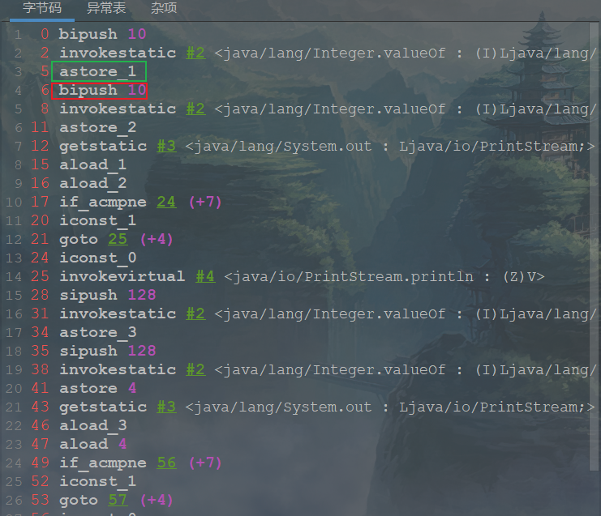


### 17.2.2 解读字节码方式

​	由于class文件是二进制形式的，所以没办法直接打开查看，需要使用一些工具将class文件解析成我们可以直接阅读的形式。解析方式主要有以下三种。

**1 使用第三方文本编辑工具**

​	我们常用的第三方文本编辑工具有Notepad++和Binary Viewer以及EditPlus。以EditPlus为例，打开后选择Hex viewer即可，如下图所示。

<div style="text-align:center;font-weight:bold;">选择Hex viewer</div>


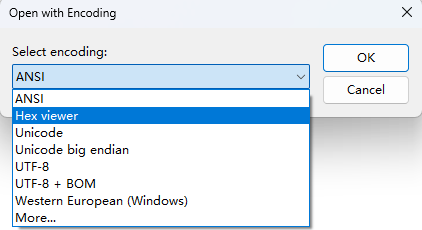

<div style="text-align:center;font-weight:bold;">EditPlus查看十六进制的class文件</div>

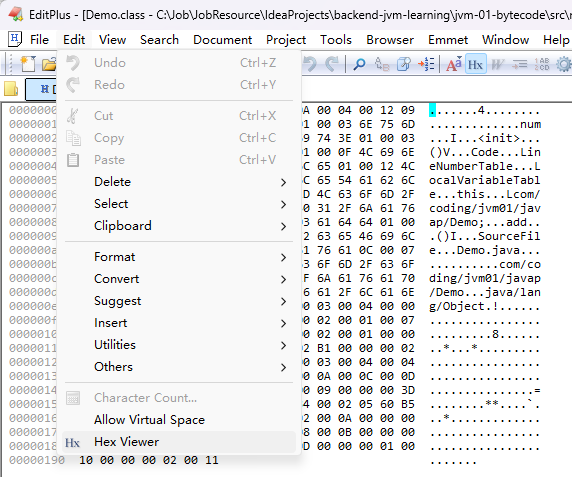

**2 使用javap指令**

​	JDK自带的解析工具，前面的篇章经常使用到，详细介绍见第17.4节。

**3 jclasslib工具**

​	jclasslib工具在解析class文件时，已经进行了二进制数据的“翻译”工作，可以更直观地反映class文件中的数据。各位读者可以下载安装jclasslib Bytecodeviewer客户端工具或者在IDEA的插件市场安装jclasslib插件，如下图所示。


## 17.3 class文件结构

​	任何一个class文件都对应着唯一一个类或接口的定义信息，但是并不是所有的类或接口都必须定义在文件中，它们也可以通过类加载器直接生成。也就是说class文件实际上并不一定以磁盘文件的形式存在。class文件是一组以8位字节为基础单位的二进制流，它的结构不像XML等描述语言，由于它没有任何分隔符号，所以在其中的数据项，无论是字节顺序还是数量，都是被严格限定的，哪个字节代表什么含义，长度是多少，先后顺序如何，都不允许改变，就好像一篇没有标点符号的文章。这使得整个class文件中存储的内容几乎全部是程序运行的必要数据，没有空隙存在。class文件格式采用一种类似于C语言结构体的伪结构来存储数据，这种伪结构只有无符号数和表两种数据类型。

​	无符号数属于基本的数据类型，以u1、u2、u4、u8来分别代表1个字节、2个字节、4个字节和8个字节的无符号数，无符号数可以用来描述数字、索引引用、数量值或者按照UTF-8编码构成字符串值。对于字符串，则使用u1数组进行表示。

​	表是由多个无符号数或者其他表作为数据项构成的复合数据类型，所有表都习惯性地以“_info”结尾。表用于描述有层次关系的复合结构的数据，整个class文件本质上就是一张表。由于表没有固定长度，所以通常会在其前面加上长度说明。在学习过程中，只要充分理解了每一个class文件的细节，甚至可以自己反编译出Java源文件。

​	class文件的结构并不是一成不变的，随着JVM的不断发展，总是不可避免地会对class文件结构做出一些调整，但是其基本结构和框架是非常稳定的。class文件的整体结构如下表所示。

<div style="text-align:center;font-weight:bold;">class文件总体结构</div>


​	官方对class文件结构的详细描述如下所示。

https://docs.oracle.com/javase/specs/jvms/se8/html/jvms-4.html

<div style="text-align:center;font-weight:bold;">class文件结构图</div>

A `class` file consists of a single `ClassFile` structure:

```
ClassFile {
    u4             magic;
    u2             minor_version;
    u2             major_version;
    u2             constant_pool_count;
    cp_info        constant_pool[constant_pool_count-1];
    u2             access_flags;
    u2             this_class;
    u2             super_class;
    u2             interfaces_count;
    u2             interfaces[interfaces_count];
    u2             fields_count;
    field_info     fields[fields_count];
    u2             methods_count;
    method_info    methods[methods_count];
    u2             attributes_count;
    attribute_info attributes[attributes_count];
}
```

​	上面class文件的结构解读如下表所示。

<div style="text-align:center;font-weight:bold;">class文件结构解读</div>

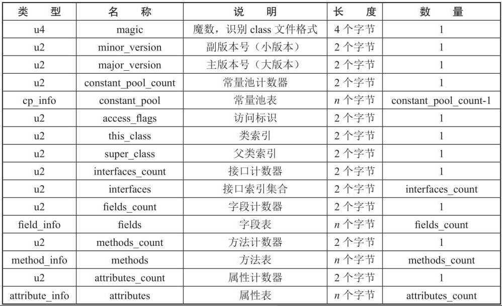

​	下面我们按照上面的顺序逐一解读class文件结构。首先编写一段简单的代码，对照上面的结构表来分析class文件，如下代码所示。

<span style="color:#40E0D0;">案例1：class文件结构测试用例</span>

- 代码

```java
package com.coding.jvm01.javap;

public class ClassFileDemo {
    private Integer num;

    public void fun() {
        num = num * 2;
    }
}
```

​	这段代码很简单，只有一个成员变量num和一个方法fun()。将源文件编译为class文件，我们使用命令javac编译，如下所示。

```bash
# 直接执行javac xx.java，就不会在生成对应的局部变量表等信息，如果使用javac -g xx.java就可以生成所有相关信息了。如果使用Eclipse或IDEA，则默认情况下Eclipse、IDEA在编译时会帮助生成局部变量表、指令和代码行偏移量映射表等信息。
$ javac -g ClassFileDemo.java
```

​	上面命令的执行结果是生成一个ClassFileDemo.class文件。使用EditPlus打开该文件结果如下图所示，可以看到每个字节都是十六进制数字，通过分析每个字节来解析class文件。

<div style="text-align:center;font-weight:bold;">图17-1：IDEA编译得到ClassFileDemo.class文件（Consolas 12号字体）</div>

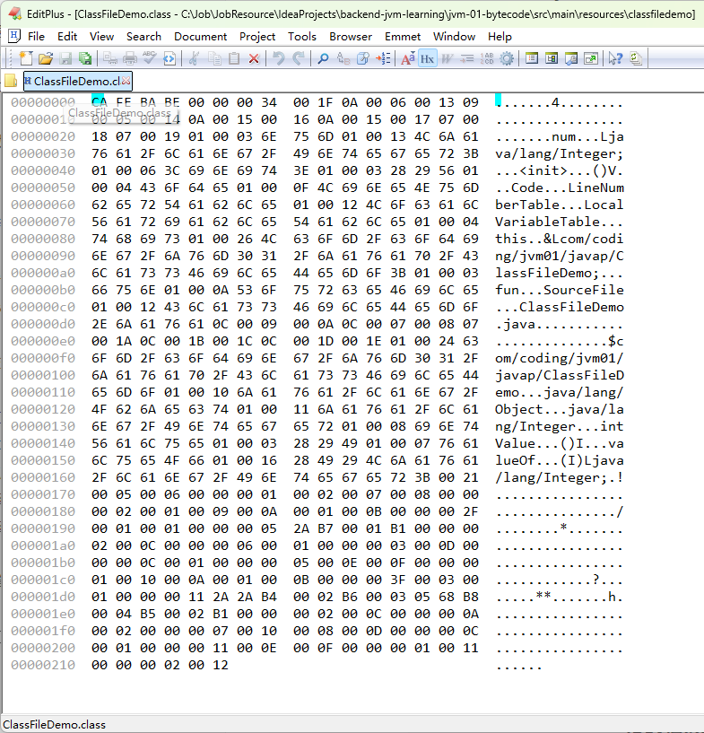

### 17.3.1 魔数：class文件的标识

​	每个class文件开头的<span style="color:#FF1493;font-weight:bold;">4个字节</span>的无符号整数称为魔数(Magic Number)。魔数的唯一作用是确定class文件是否有效合法，也就是说魔数是class文件的标识符。魔数值固定为0xCAFEBABE，如下图框中所示。之所以使用CAFEBABE，可以从Java的图标（一杯咖啡）窥得一二。

<div style="text-align:center;font-weight:bold;">魔数</div>

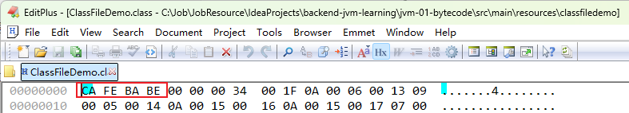

​	如果一个class文件不以0xCAFEBABE开头，JVM在文件校验的时候就会直接抛出以下错误的错误。

```bash
# 切换到classes路径下（包含com/coding/jvm01/javap目录）
$ java com.coding.jvm01.javap.ClassFileDemo
Error: A JNI error has occurred, please check your installation and try again
Exception in thread "main" java.lang.ClassFormatError: Incompatible magic value 1885430635 in class file com/coding/jvm01/javap/ClassFileDemo
```

​	比如将ClassFileDemo.java文件后缀改成ClassFileDemo.class，然后使用命令行解释运行，就报出上面的魔数不对的错误。

​	使用魔数而不是扩展名识别class文件，主要是基于安全方面的考虑，因为文件扩展名可以随意改动。除了Java的class文件以外，其他常见的文件格式内部也会有类似的设计手法，比如图片格式gif或者jpeg等在头文件中都有魔数。

### 17.3.2 class文件版本号

​	紧接着魔数存储的是class文件的版本号，同样也是<span style="color:#FF1493;font-weight:bold;">4个字节</span>。第5个和第6个字节所代表的含义是class文件的副版本号minor_version，第7个和第8个字节是class文件的主版本号major_version。它们共同构成了class文件的版本号，例如某个class文件的主版本号为M，副版本号为m，那么这个class文件的版本号就确定为M.m。版本号和Java编译器版本的对应关系如下表所示。

<div style="text-align:center;font-weight:bold;">Java编译器与版本号对应关系</div>

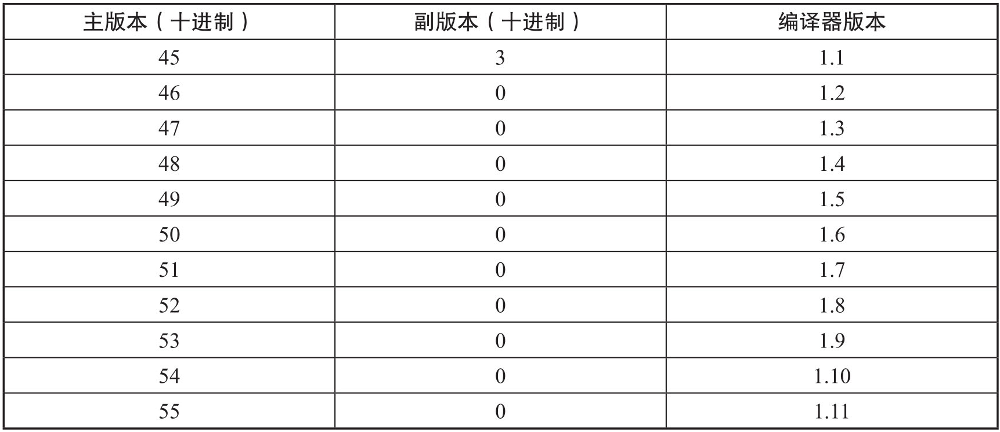

​	Java的版本号是从45开始的，JDK 1.1之后每发布一个JDK大版本，主版本号向上加1。当虚拟机JDK版本为1.k(k≥2)时，对应的class文件版本号的范围为45.0到44+k.0之间（含两端）。字节码指令集多年不变，但是版本号每次发布都会变化。

​	不同版本的Java编译器编译的class文件对应的版本是不一样的。目前，<span style="color:red;font-weight:bold;">高版本的JVM可以执行由低版本编译器生成的class文件，可以理解为向下兼容。但是低版本的JVM不能执行由高版本编译器生成的class文件</span>。一旦执行，JVM会抛出java.lang.UnsupportedClass VersionError异常。在实际应用中，由于开发环境和生产环境的不同，可能会导致该问题的发生。因此，需要我们在开发时，特别注意开发环境的JDK版本和生产环境中的JDK版本是否一致。

​	上面的ClassFileDemo.class文件使用JDK8版本编译而成，第5个字节到第8个字节如图17-14所示，其中第5个字节和第6个字节都是00，第7个字节和第8个字节为十六进制的34，换算为十进制为52，对应表17-3可知使用的版本为1.8，即JDK8。

​	上面的ClassFileDemo.class文件使用JDK8版本编译而成，第5个字节到第8个字节如图17-14所示，其中第5个字节和第6个字节都是00，第7个字节和第8个字节为十六进制的34，换算为十进制为52，对应表17-3可知使用的版本为1.8，即JDK8。

<div style="text-align:center;font-weight:bold;">字节码版本号</div>


### 17.3.3 常量池：存放所有常量

​	紧跟在版本号之后的是常量池中常量的数量(constant_pool_count)以及若干个常量池表项(constant_pool[])。常量池是class文件中内容最为丰富的区域之一。常量池表项用于存放编译时期生成的各种字面量(Literal)和符号引用(SymbolicReferences)，这部分内容在经过类加载器加载后存放在方法区的运行时常量池中存放。常量池对于class文件中的字段和方法解析起着至关重要的作用。随着JVM的不断发展，常量池的内容也日渐丰富。可以说，常量池是整个class文件的基石。

**1 constant_pool_count（常量池计数器）**

​	由于常量池的数量不固定，时长时短，所以需要放置<span style="color:#FF1493;font-weight:bold;">两个字节（u2类型）来表示常量池容量计数值</span>。常量池容量计数器从1开始计数，constant_pool_count=1表示常量池中有0个常量项。通常我们写代码时都是从0开始的，但是这里的常量池计数器却是从1开始，因为它把第0项常量空出来了，这是为了满足某些指向常量池的索引值的数据在特定情况下需要表达“不引用任何一个常量池项目”的含义，这种情况可用索引值0来表示。如下图17-15所示，第9个字节和第10个字节表示常量池计数器，其值为0x001f，换算为十进制为31，需要注意的是，实际上只有30项常量，索引范围是1～30。

<div style="text-align:center;font-weight:bold;">字节码常量池计数器</div>


​	我们也可以通过jclasslib插件来查看常量池数量，如下图所示，可以看到一共有30个常量。

<div style="text-align:center;font-weight:bold;">jclasslib查看字节码常量池计数器</div>

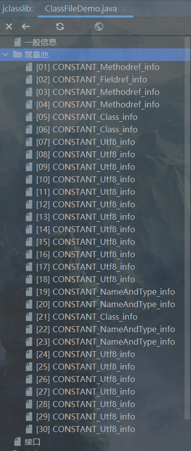

**2 constant_pool[]（常量池）**

​	常量池是一种表结构，从1到constant_pool_count–1为索引。常量池主要存放字面量和符号引用两大类常量。常量池包含了class文件结构及其子结构中引用的所有字符串常量、类或接口名、字段名和其他常量。<span style="color:#9400D3;font-weight:bold;">常量池中的每一项常量的结构都具备相同的特征，那就是每一项常量入口都是一个u1类型的标识，该标识用于确定该项的类型，这个字节称为tag byte（标识字节</span>），如下图所示。

https://docs.oracle.com/javase/specs/jvms/se8/html/jvms-4.html#jvms-4.4

<div style="text-align:center;font-weight:bold;">常量池中每一项结构</div>

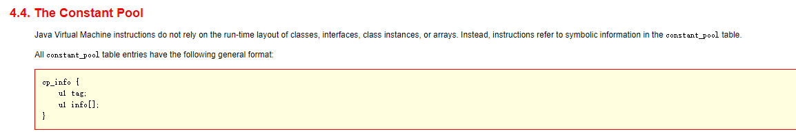

​	一旦JVM获取并解析这个标识，JVM就会知道在标识后的常量类型是什么。常量池中的每一项都是一个表，其项目类型共有14种，下表列出了所有常量项的类型和对应标识的值，比如当标识值为1时，表示该常量的类型为CONSTANT_utf8_info。

<div style="text-align:center;font-weight:bold;">常量池中每一项结构</div>

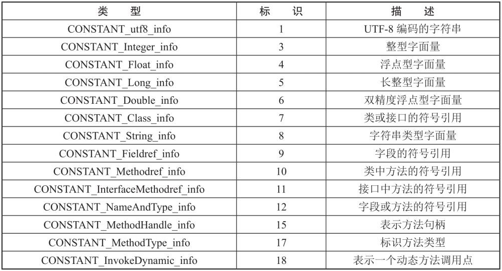

​	这14种类型的结构各不相同，各个类型的结构如下表所示，比如CONSTANT_utf8_info由tag、length和bytes组成。

<div style="text-align:center;font-weight:bold;">图17-2：常量类型及其结构</div>

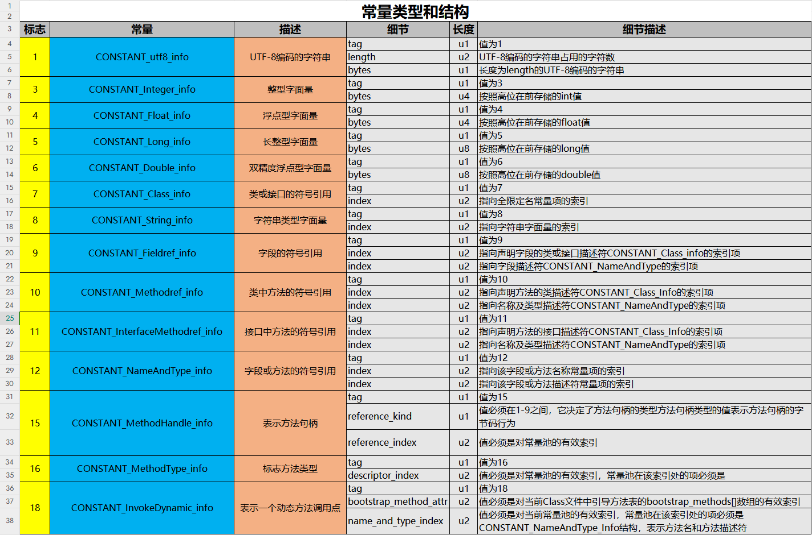

​	根据上表中对每个类型的描述，我们可以知道每个类型是用来描述常量池中的字面量、符号引用，比如CONSTANT_Integer_info是用来描述常量池中字面量信息，而且只是整型字面量信息。标识值为15、16、18的常量项类型是用来支持动态语言调用的，它们在JDK7时加入。下面按照标识的大小顺序分别进行介绍。

1. CONSTANT_Utf8_info用于表示字符常量的值。
2. CONSTANT_Integer_info和CONSTANT_Float_info表示4字节（int和float）的数值常量。
3. CONSTANT_Long_info和CONSTANT_Double_info表示8字节（long和double）的数值常量；在class文件的常量池表中，所有的8字节常量均占两个表项的空间。如果一个CONSTANT_Long_info或CONSTANT_Double_info的项在常量池表中的索引位n，则常量池表中下一个可用项的索引为n+2，此时常量池表中索引为n+1的项仍然有效但必须视为不可用的。
4. CONSTANT_Class_info用于表示类或接口。
5. CONSTANT_String_info用于表示String类型的常量对象。
6. CONSTANT_Fieldref_info、CONSTANT_Methodref_info表示字段、方法。
7. CONSTANT_InterfaceMethodref_info表示接口方法。
8. CONSTANT_NameAndType_info用于表示字段或方法，但是和之前的3个结构不同，CONSTANT_NameAndType_info没有指明该字段或方法所属的类或接口。
9. CONSTANT_MethodHandle_info用于表示方法句柄。
10. CONSTANT_MethodType_info表示方法类型。
11. CONSTANT_InvokeDynamic_info用于表示invokedynamic指令所用到的引导方法(Bootstrap Method)、引导方法所用到的动态调用名称(DynamicInvocation name)、参数和返回类型，并可以给引导方法传入一系列称为静态参数(Static Argument)的常量。

​	这14种表（或者常量项结构）的共同点是表开始的第一位是一个u1类型的标识位(tag)，代表当前这个常量项使用的是哪种表结构，即哪种常量类型。在常量池列表中，CONSTANT_Utf8_info常量项是一种使用改进过的UTF-8编码格式来存储诸如文字字符串、类或者接口的全限定名、字段或者方法的简单名称以及描述符等常量字符串信息。这14种常量项结构还有一个特点是，其中13个常量项占用的字节固定，只有CONSTANT_Utf8_info占用字节不固定，其大小由length决定。因为从常量池存放的内容可知，其存放的是字面量和符号引用，最终这些内容都会是一个字符串，这些字符串的大小是在编写程序时才确定，比如定义一个类，类名可以取长取短，所以在代码源文件没编译前，大小不固定；代码源文件编译后，可以通过utf-8编码知道其长度。

​	常量池可以理解为class文件之中的资源仓库，它是class文件结构中与其他项目关联最多的数据类型（后面讲解的很多数据结构都会指向此处），也是占用class文件空间最大的数据项目之一。

​	Java代码在进行javac编译的时候，并不像C和C++那样有“连接”这一步骤，而是在虚拟机加载class文件的时候进行动态链接。也就是说，在class文件中不会保存各个方法、字段的最终内存布局信息，因此这些字段、方法的符号引用不经过运行期转换的话无法得到真正的内存入口地址，也就无法直接被虚拟机使用。当虚拟机运行时，需要从常量池获得对应的符号引用，再在类创建时或运行时解析、翻译到具体的内存地址之中。本章先弄清楚class文件中常量池中的字面量符号引用。关于类加载和动态链接的内容，在第18章类的加载过程会进行详细讲解。

<span style="color:blue;font-weight:bold;">（1）字面量和符号引用。</span>

​	常量池主要存放两大类常量字面量和符号引用。字面量和符号引用的具体定义如下表所示。

<div style="text-align:center;font-weight:bold;">字面量和符号引用定义</div>

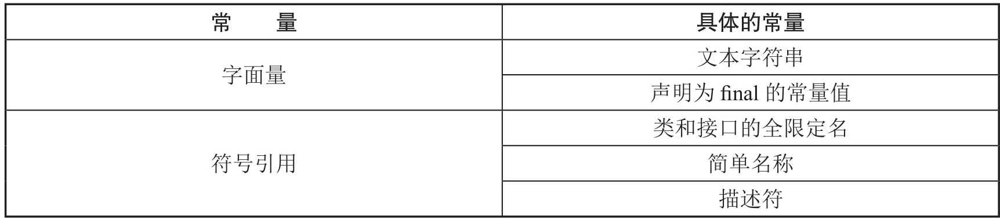

​	字面量很容易理解，例如定义String str = “emon”和final int NUM = 10，其中atguigu和10都是字面量，它们都放在常量池中，注意没有存放在内存中。符号引用包含类和接口的全限定名、简单名称、描述符三种常量类型。

①类和接口的全限定名。

​	com.coding.jvm01.javap.ClassFileDemo就是类的全限定名，仅仅是把包名的“.”替换成“/”，为了使连续的多个全限定名之间不产生混淆，在使用时最后一般会加入一个“;”表示全限定名结束。

②简单名称。

​	简单名称是指没有类型和参数修饰的方法或者字段名称，代码清单17-2中fun()方法和num字段的简单名称分别是fun和num。

③描述符。

​	描述符的作用是用来描述字段的数据类型、方法的参数列表（包括数量、类型以及顺序）和返回值。关于描述符规则，详见17.3.6节和17.3.7节。

<span style="color:blue;font-weight:bold;">（2） 常量解读。</span>

​	针对<span style="color:blue;font-weight:bold;">图17-1：IDEA编译得到ClassFileDemo.class文件（Consolas 12号字体）</span>的class文件，我们解读其中的常量池中存储的信息。首先是第一个常量，其标识位如下图所示。

<div style="text-align:center;font-weight:bold;">首个常量项标识位</div>

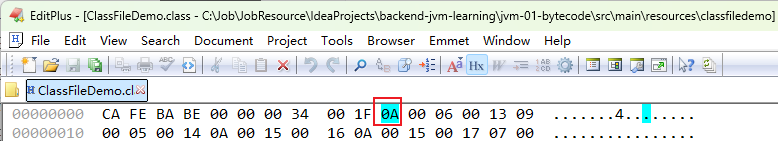

​	其值为0x0a，即10，查找表<span style="color:blue;font-weight:bold;">图17-2：常量类型及其结构</span>可知，其对应的项目类型为CONSTANT_Methodref_info，即类中方法的符号引用，其结构如图17-19所示。

<div style="text-align:center;font-weight:bold;">首个常量结构</div>


​	可以看到标识后面还有4个字节的内容，分别为两个索引项，如下图所示。

<div style="text-align:center;font-weight:bold;">首个常量项标识位后面的内容</div>

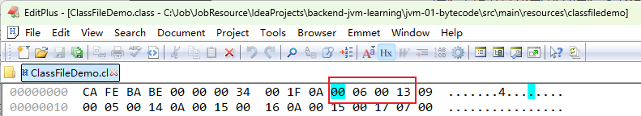

​	其中前两位的值为0x0006，即6，指向常量池第6项的索引；后两位的值为0x0013，即19，指向常量池第19项的索引。至此，常量池中第一个常量项解析完毕。再来看下第二个常量，其标识位如下图所示。

<div style="text-align:center;font-weight:bold;">第二个常量项标识位</div>

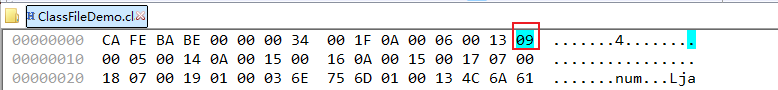

​	标识值为0x09，即9，查找表<span style="color:blue;font-weight:bold;">图17-2：常量类型及其结构</span>可知，其对应的项目类型为CONSTANT_Fieldref_info，即字段的符号引用，其结构如下图所示。

<div style="text-align:center;font-weight:bold;">第二个常量结构</div>


​	同样后面也有4字节的内容，分别为两个索引项，如下图所示。

<div style="text-align:center;font-weight:bold;">第二个常量项标识位后面的内容</div>

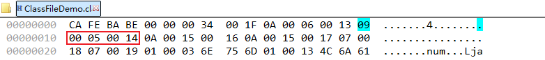

​	同样也是4字节，前后都是两个索引。分别指向第5项的索引和第20项的索引。后面常量项就不一一去解读了，这样的class文件解读起来既费力又费神，还很有可能解析错误。我们可以使用“<span style="color:#32CD32;font-weight:bold;">javap -verbose ClassFileDemo.class</span>”命令去查看class文件，如下图所示。

<div style="text-align:center;font-weight:bold;">第二个常量项标识位后面的内容</div>

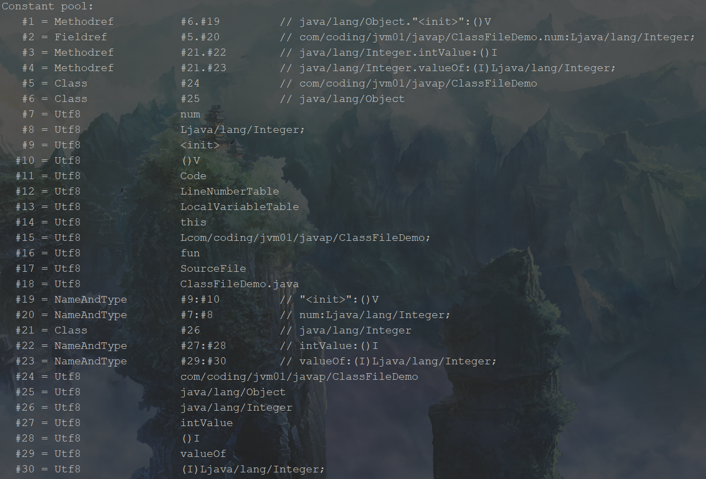

​	可以看到，常量池中总共有30个常量项，第一个常量项指向常量池第6项的索引以及指向常量池第19项的索引，第二个常量项指向常量池第5项的索引和指向常量池第20项的索引。和我们上面按照字节码原文件解析结果一样。虽然使用javap命令很方便，但是通过手动分析才知道这个结果是怎么出来的，做到知其然也知其所以然。

### 17.3.4 访问标识

​	常量池后紧跟着访问标识。访问标识(access_flag)描述的是当前类（或者接口）的访问修饰符，如public、private等标识使用两个字节表示，用于识别一些类或者接口层次的访问信息，识别当前Java源文件属性是类还是接口；是否定义为public类型；是否定义为abstract类型；如果是类的话，是否被声明为final等。访问标识的类型如表17-7所示，比如当标识值为0x0001的时候，访问标识的类型是public。

<div style="text-align:center;font-weight:bold;">访问标识对照表</div>

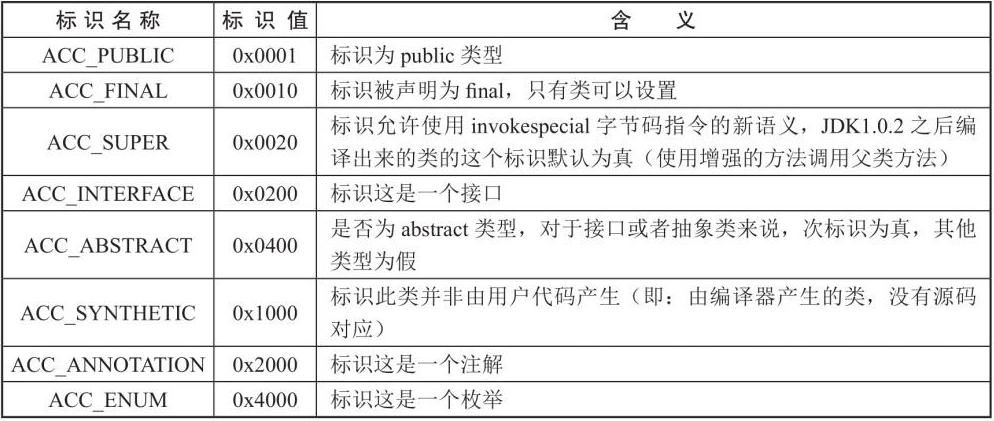

​	从上表中可以看到类的访问权限通常是以ACC_开头的常量。一个public final类型的类，该类标识为ACC_PUBLIC|ACC_FINAL。带有ACC_INTERFACE标识的class文件表示的是接口而不是类，其他标识则表示的是类而不是接口。下面介绍访问标识的设置规则。

1. 如果一个class文件被设置了ACC_INTERFACE标识，那么同时也得设置ACC_ABSTRACT标识。它不能再设置ACC_FINAL、ACC_SUPER或ACC_ENUM标识。

2. 如果没有设置ACC_INTERFACE标识，那么这个class文件可以具有上表中除ACC_ANNOTATION外的其他所有标识。当然，ACC_FINAL和ACC_ABSTRACT这类互斥的标识除外，这两个标识不得同时设置。

3. ACC_SUPER标识用于确定类或接口里面的invokespecial指令使用的是哪一种执行语义。针对JVM指令集的编译器都应当设置这个标识。使用ACC_SUPER可以让类更准确地定位到父类的方法super.method()。ACC_SUPER标识是为了向后兼容由旧Java编译器所编译的代码而设计的。对于JavaSE 8及后续版本来说，无论class文件中这个标识的实际值是什么，也不管class文件的版本号是多少，JVM都认为每个class文件均设置了ACC_SUPER标识。也就是说JavaSE 8及后续版本不再支持没有设置ACC_SUPER标识的class文件了。ACC_SUPER这个标识位在JDK1.0.2之前的版本中没有任何含义，即使设置了标志，Oracle的JVM实现也会忽略该标志。

4. ACC_SYNTHETIC标识意味着该类或接口的class文件是由编译器生成的，而不是由源代码生成的。

5. 注解类型必须设置ACC_ANNOTATION标识。而且，如果设置了ACC_ANNOTATION标识，那么也必须设置ACC_INTERFACE标识。

6. ACC_ENUM标识表明该类或其父类为枚举类型。

​	<span style="color:#FF1493;font-weight:bold;">访问标识占用2字节，表示其有16位可以使用，目前只定义了8种类型</span>，表中没有使用的标识是为未来扩充而预留的，这些预留的标识在编译器中设置为0。我们把ClassFileDemo.class文件中的内容全部放到表格中展示，访问标识的值如下图所示。

<div style="text-align:center;font-weight:bold;">访问标识</div>

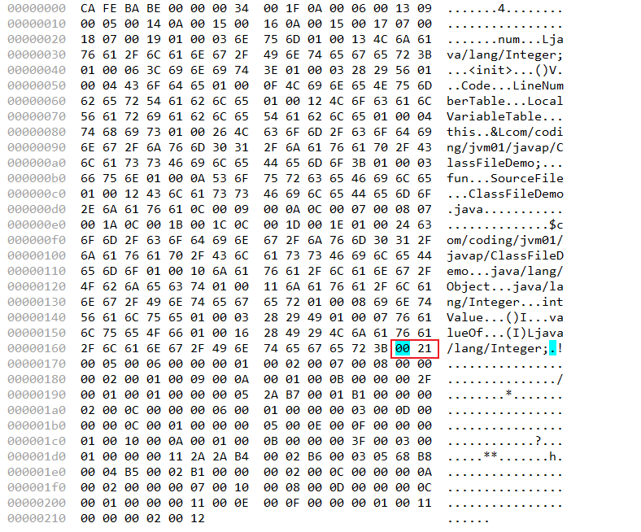

​	其值为0x0021，我们上面的表格里没有0x0021，那么0x0021只能是组合后的数值，0x0021只能是0x0020和0x0001的并集，即这是一个public的类，再回头看看我们的源码，该类是由public修饰的。

### 17.3.5 类索引、父类索引、接口索引集合

​	在访问标识后，会指定该类的类别、父类类别以及实现的接口，这三项数据来确定这个类的继承关系，格式如下表所示。

<div style="text-align:center;font-weight:bold;">类别格式</div>


​	类索引用于确定这个类的全限定名，父类索引用于确定这个类的父类的全限定名。由于Java语言不允许多重继承，所以父类索引只有一个，注意java.lang.Object类除外。一个类如果没有继承其他类，默认继承java.lang.Object类。

​	接口索引集合用来描述这个类实现了哪些接口，这些被实现的接口将按implements语句后面接口的顺序从左到右排列在接口索引集合中。如果这个类本身是接口类型，则应当是按extends语句后面接口的顺序从左到右排列在接口索引集合中。

**1 this_class（类索引）**

​	类索引占用2字节，指向常量池的索引，它提供了类的全限定名，如ClassFileDemo文件的全限定名为com/atguigu/ClassFileDemo。类索引的值必须是对常量池表中某项的一个有效索引值。常量池在这个索引处的成员必须为CONSTANT_Class_info类型结构体，该结构体表示这个class文件所定义的类或接口。我们直接来看下ClassFileDemo字节码中的值，如下图所示。

<div style="text-align:center;font-weight:bold;">图17-3:：类索引，父类索引、接口索引集合</div>

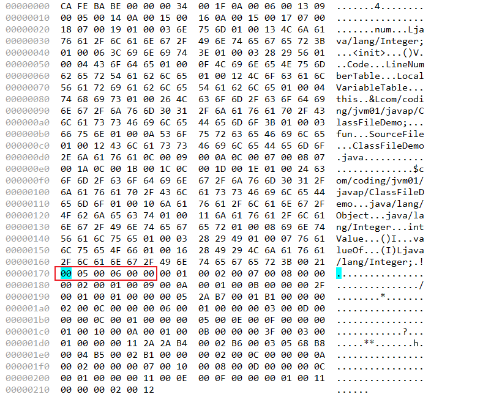

​	类索引的值为0x0005，即为指向常量池中第五项的索引。这里就用到了常量池中的值。接下来查看常量池中第五项的值，如下所示。


​	通过类索引我们可以确定到类的全限定名。

**2 super_class（父类索引**

​	父类索引占用2字节，指向常量池的索引。它提供了当前类的父类的全限定名。如果我们没有继承任何类，其默认继承的是java/lang/Object类。同时，由于Java不支持多继承，所以其父类只有一个。super_class指向的父类不能是final。

​	从<span style="color:blue;font-weight:bold;">图17-3:：类索引，父类索引、接口索引集合</span>可以看出，父类索引的值为0x0006，即常量池中的第六项，接下来查看常量池中第六项的值，如下所示。


​	这样我们就可以确定到父类的全限定名。可以看到，如果我们没有继承任何类，其默认继承的是java/lang/Object类。同时，由于Java不支持多继承，所以其父类只有一个。对于类来说，super_class的值要么是0，要么是对常量池表中某项的一个有效索引值。如果它的值不为0，那么常量池在这个索引处的成员必须为CONSTANT_Class_info类型常量，它表示这个class文件所定义的类的直接超类。在当前类的直接超类，以及它所有间接超类的ClassFile结构体中，访问标识里面均不能有ACC_FINAL标志。

​	<span style="color:#9400D3;font-weight:bold;">如果class文件的super_class的值为0，那这个class文件只可能用来表示Object类，因为它是唯一没有父类的类</span>。

**3 interfaces**

​	指向常量池索引集合，它提供了一个符号引用到所有已实现的接口。由于一个类可以实现多个接口，因此需要以数组形式保存多个接口的索引，表示接口的每个索引也是一个指向常量池的CONSTANT_Class（当然这里就必须是接口，而不是类）。和常量池计数器以及常量池的设计一样，interfaces同样设计了接口计数器和接口索引集合。

1、interfaces_count（接口计数器）

​	interfaces_count项的值表示当前类或接口的直接超接口数量。从<span style="color:blue;font-weight:bold;">图17-3:：类索引，父类索引、接口索引集合</span>可以看出，接口索引个数的值为0x0000，即没有任何接口索引，ClassFileDemo的源码也确实没有去实现任何接口。

2、interfaces[]（接口索引集合）

​	interfaces []中每个成员的值必须是对常量池表中某项的有效索引值，它的长度为interfaces_count。每个成员interfaces[i]必须为CONSTANT_Class_info结构，其中0≤i<interfaces_count。在interfaces[]中，各成员所表示的接口顺序和对应的源代码中给定的接口顺序（从左至右）一样，即interfaces[0]对应的是源代码中最左边的接口。

​	由于ClassFileDemo的源码没有去实现任何接口，所以接口索引集合就为空了，不占空间。可以看到，由于Java支持多接口，因此这里设计成了接口计数器和接口索引集合来实现。

### 17.3.6 字段表集合

​	接口计数器或接口索引集合后面就是字段表了，用于描述接口或类中声明的变量。字段包括类级变量以及实例级变量，但是不包括方法内部、代码块内部声明的局部变量。

​	字段叫什么名字、字段被定义为什么数据类型，这些都是无法固定的，只能引用常量池中的常量来描述。它指向常量池索引集合，它描述了每个字段的完整信息，比如字段的标识符、访问修饰符（public、private或protected）、是类变量（static修饰符）还是实例变量、是否为常量（final修饰符）等。

​	需要注意的是字段表集合中不会列出从父类或者实现的接口中继承而来的字段，但有可能列出原本Java代码之中不存在的字段，<span style="color:#9400D3;font-weight:bold;">例如在内部类中为了保持对外部类的访问性，会自动添加指向外部类实例的字段</span>。

​	在Java语言中字段是无法重载的，两个字段的数据类型、修饰符不管是否相同，都必须使用不一样的名称，但是对于字节码来讲，如果两个字段的描述符不一致，那字段重名就是合法的。由于存储在字段表项中的字段信息并不包括声明在方法内部或者代码块内的局部变量，因此多个字段之间的作用域就都是一样的，那么Java语法规范必然不允许在一个类或者接口中声明多个具有相同标识符名称的字段。

​	和常量池计数器以及常量池的设计一样，字段表同样设计了字段计数器和字段表，<span style="color:#FF1493;font-weight:bold;">在接口计数器或接口索引集合后面就是字段计数器，占用2个字节，后面便是字段表了</span>。

**1 fields_count（字段计数器）**

​	fields_count的值表示当前class文件fields表的成员个数，使用两个字节表示。fields表中每个成员都是一个field_info结构，用于表示该类或接口所声明的所有类字段或者实例字段，不包括方法内部声明的变量，也不包括从父类或父接口继承的那些字段。查看ClassFileDemo字节码中的值，如图17-27所示。

​	其值为0x0001，表示只有一个字段。

**2 　fields[]（字段表）**

​	fields表中的每个成员都必须是一个fields_info结构的数据项，用于表示当前类或接口中某个字段的完整描述。

​	一个字段的信息包括如下这些：作用域（public、private、protected修饰符）；

​	是实例变量还是类变量（static修饰符）；可变性(final)；并发可见性（volatile修饰符，是否强制从主内存读写）；可否序列化（transient修饰符）；字段数据类型（基本数据类型、对象、数组）；字段名称。

<div style="text-align:center;font-weight:bold;">字段计数器</div>

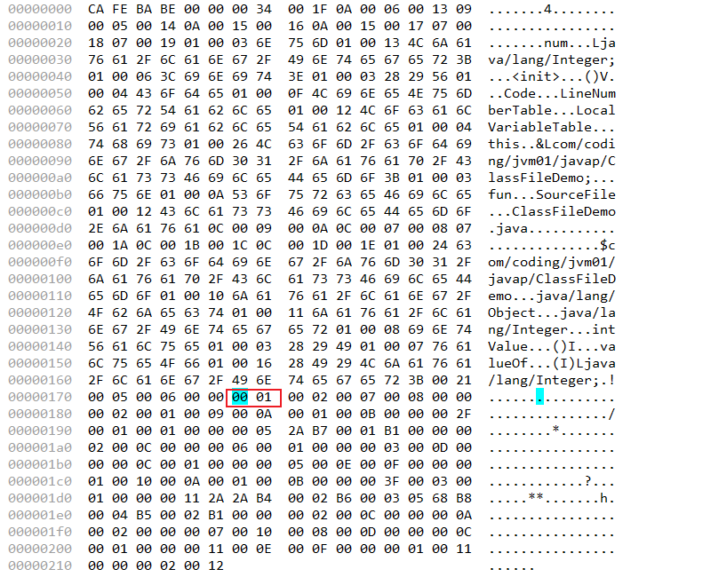

​	字段表作为一个表，同样有它自己的结构，如下表所示。

<div style="text-align:center;font-weight:bold;">字段表结构</div>

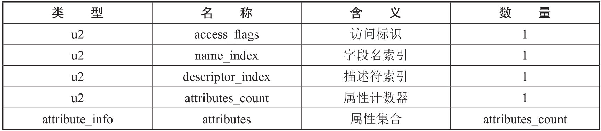

​	下面分别介绍每个结构所代表的含义。

1、字段表访问标识

​	我们知道，一个字段可以被各种关键字去修饰，比如作用域修饰符(public、private、protected)、static修饰符、final修饰符、volatile修饰符等。因此，和类的访问标识类似，使用一些标识来标识字段。字段的访问标识分类如下表所示。

<div style="text-align:center;font-weight:bold;">字段访问标识</div>

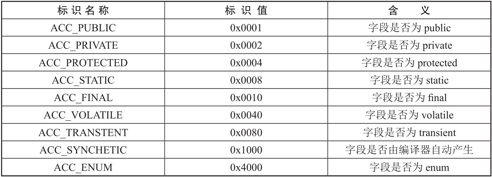

2、字段名索引

​	根据字段名索引的值，查询常量池中的指定索引项即可。

3、描述符索引

​	字段描述符的作用是用来描述字段的数据类型。我们知道数据类型分为基本数据类型和引用数据类型。基本数据类型(byte、short、int、long、float、double、boolean、char)都用一个大写字符来表示。引用数据类型中的对象类型用字符L加对象的全限定名来表示。对于数组类型，每一维度将使用一个前置的“[”字符来描述，如表17-11所示。例如int实例变量的描述符是I。Object类型的实例，描述符是Ljava/lang/Object;。三维数组double d[][][]的描述符是[[[D。

<div style="text-align:center;font-weight:bold;">描述符索引</div>

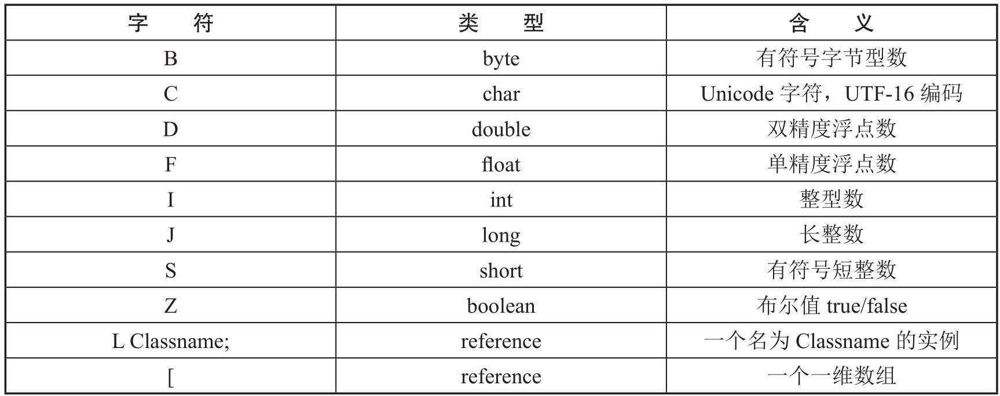

4、属性表集合

​	一个字段还可能拥有一些属性，用于存储更多的额外信息。比如字段的初始化值、一些注释信息等。属性个数存放在attribute_count中，属性具体内容存放在attributes数组中，以常量属性为例，结构如下。

https://docs.oracle.com/javase/specs/jvms/se8/html/jvms-4.html#jvms-4.7.2

<div style="text-align:center;font-weight:bold;">常量属性</div>

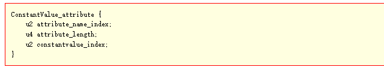

​	注意，对于常量属性而言，attribute_length值恒为2。

**3 解析字段表**

​	我们在ClassFileDemo中定义的字段为num，如下所示。

```java
	private Integer num;
```

​	查看ClassFileDemo字节码中的值，如下图所示。

<div style="text-align:center;font-weight:bold;">字段表</div>

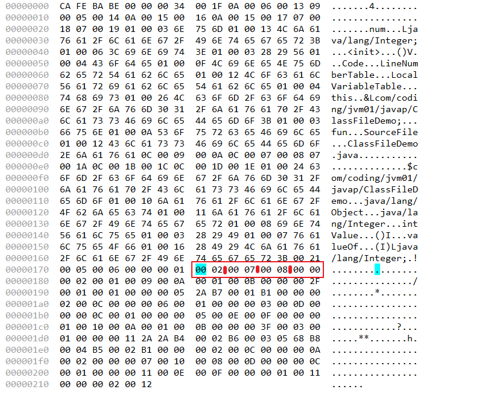

​	访问标识的值为0x0002，查询上面字段访问标识的表格，可得字段为private。

​	字段名索引的值为0x0007，查询常量池中的第7项，如下所示，可以得到字段名为num。

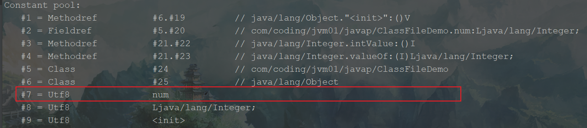

​	描述符索引的值为0x0008，查询常量池中的第8项，如下所示，可以得到其为Integer类型的实例。如果定义数据类型的时候写为int类型，就会显示为I。

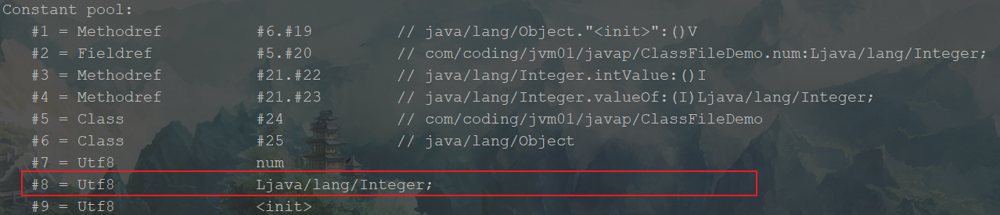

### 17.3.7 方法表集合

​	字段表之后就是方法表信息了，它指向常量池索引集合，它完整描述了每个方法的信息。在class文件中，一个方法表与类或者接口中方法一一对应。方法信息包含方法的访问修饰符（public、private或protected）、方法的返回值类型以及方法的参数信息等。如果这个方法不是抽象的或者不是native的，那么字节码中会体现出来。方法表只描述当前类或接口中声明的方法，不包括从父类或父接口继承的方法，除非当前类重写了父类方法。方法表有可能会出现由编译器自动添加的方法，最典型的便是编译器产生的方法信息，比如类或接口的初始化方法<clinit>()，以及实例初始化方法<init>()。

​	Java语法规范中，要重载(Overload)一个方法，要求参数类型或者参数个数必须不同，方法返回值不会作为区分重载方法的标准。但是在class文件中，如果两个方法仅仅返回值不同，那么也是可以合法共存于同一个class文件中。方法表和常量池计数器以及常量池的设计一样，同样设计了方法计数器和方法表。

**1 methods_count（方法计数器）**

​	methods_count的值表示当前class文件methods表的成员个数。使用<span style="color:red;font-weight:bold;">两个字节来表示</span>。methods表中每个成员都是一个method_info结构。

**2 methods[]（方法表）**

​	方法表中的每个成员都必须是一个method_info结构，用于表示当前类或接口中某个方法的完整描述。如果某个method_info结构的access_flags项既没有设置ACC_NATIVE标识也没有设置ACC_ABSTRACT标识，那么该结构中也应包含实现这个方法所用的JVM指令。

​	method_info结构可以表示类和接口中定义的所有方法，包括实例方法、类方法、实例初始化方法和类或接口初始化方法。方法表的结构实际跟字段表是一样的，方法表结构如下表所示。

<div style="text-align:center;font-weight:bold;">方法表结构表</div>

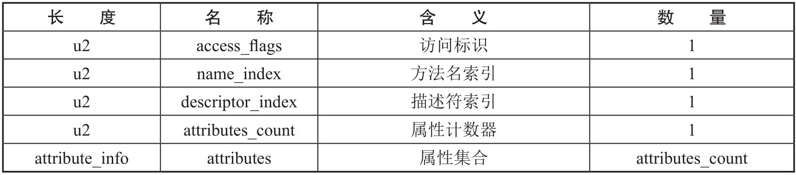

1、方法表访问标识

​	跟字段表一样，方法表也有访问标识，而且它们的标识有部分相同，部分则不同，方法表的具体访问标识如下表所示。

<div style="text-align:center;font-weight:bold;">图17-4：方法表访问标识</div>

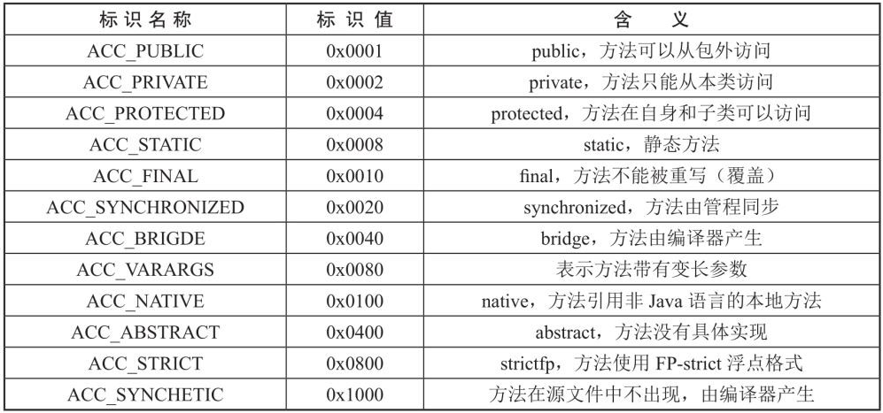

2、方法名索引

​	根据方法名索引的值，查询常量池中的指定索引项即可。

3、描述符索引

​	根据描述符索引的值，查询常量池中的指定索引项即可。用描述符来描述方法时，按照参数列表、返回值的顺序描述，参数列表严格按照参数的顺序放在一组小括号“()”之内。如方法java.lang.String toString()的描述符为()LJava/lang/String;，方法int abc(int[] x,int y)的描述符为([II)I。

4、属性计数器

​	根据属性计数器的值，判断出方法中属性的个数。

5、属性表

​	属性计数器后面就是属性表。


**3 解析方法表**

​	前面两个字节依然用来表示方法计数器，我们在ClassFileDemo中定义的方法如下。

```java
    public void fun() {
        num = num * 2;
    }
```

​	查看ClassFileDemo字节码中的值，如下图所示。

<div style="text-align:center;font-weight:bold;">图17-5：第一个方法解析</div>

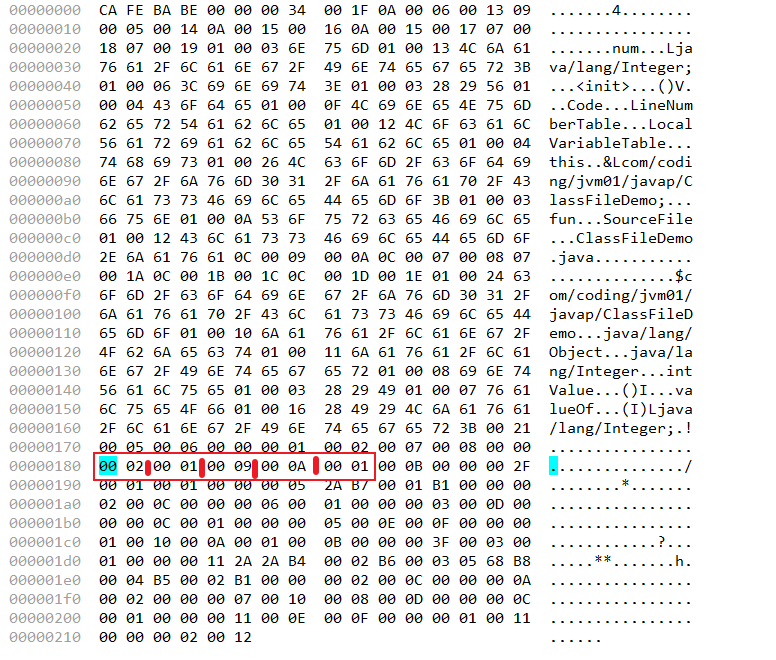

​	前面两个字节依然用来表示方法表的容量，值为0x0002，表示有两个方法。ClassFileDemo源码中只定义了一个方法，但是这里却显示两个方法，这是因为它包含了默认的构造方法。

​	继续分析字节码，在方法计数器之后是方法表，方法表中前两个字节表示访问标识，即0x0001，对应访问标识表<span style="color:blue;font-weight:bold;">图17-4：方法表访问标识</span>可知访问标识为public。

​	接下来2个字节是方法名索引的值为0x0009，查询常量池中的第9项，这个名为<init>的方法实际上就是默认的构造方法了。

```java
#9 = Utf8               <init>
```

​	描述符索引的值为0x000a，查询常量池中的第10项，如下所示，可以得到该方法是一个返回值为空的方法。

```java
#10 = Utf8               ()V
```

​	属性计数器的值为0x0001，即这个方法表有一个属性。属性计数器后面就是属性表了，由于只有一个属性，所以这里也只有一个属性表。由于涉及属性表，这里简单讲一下，17.3.8节会详细介绍。

​	属性表的前两个字节是属性名称索引，这里的值为0x000b，查下常量池中的第11项，如下所示，表示这是一个Code属性，我们方法里面的代码就是存放在这个Code属性里面。相关细节暂且不表。

```java
#11 = Utf8               Code
```

​	属性表的通用结构见第17.3.8节，<span style="color:#9400D3;font-weight:bold;">这里我们需要跳过47个字节（0x000b是属性名Code，其后4个字节是属性长度的值为0x0000002f=47）个字节</span>，再继续看第二个方法的字节码，如下图所示。

<div style="text-align:center;font-weight:bold;">第二个方法解析</div>

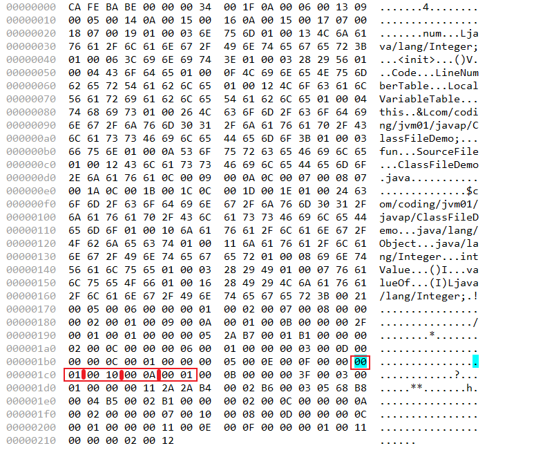

​	访问标识的值为0x0001，查询上面字段访问标识的表格，可得字段为public。方法名索引的值为0x0010，查询常量池中的第16项，可知方法名称为fun。可以看到，第二个方法表就是我们自定义的fun()方法了。

```java
#16 = Utf8               fun
```

​	描述符索引的值为0x000a，查询常量池中的第10项，可以得到该方法同样也是一个返回值为空的方法。对照源代码，结果一致。

```java
#10 = Utf8               ()V
```

​	属性计数器的值为0x0001，即这个方法表有一个属性。属性名称索引的值同样也是0x000b，即这也是一个Code属性。

### 17.3.8 属性表集合

​	方法表集合之后的属性表集合，指的是class文件所携带的辅助信息，比如该class文件的源文件的名称以及任何带有RetentionPolicy.CLASS或者RetentionPolicy.RUNTIME的注解。这类辅助信息通常被用于JVM的验证和运行，以及Java程序的调试，一般无须深入了解。此外，字段表、方法表都可以有自己的属性表。用于描述某些场景专有的信息。属性表集合的限制没有那么严格，不再要求各个属性表具有严格的顺序，并且只要不与已有的属性名重复，任何人实现的编译器都可以向属性表中写入自己定义的属性信息，但JVM运行时会忽略掉它不认识的属性。前面我们看到的属性表都是Code属性。Code属性就是存放在方法体里面的代码，像接口或者抽象方法，它们没有具体的方法体，因此也就不会有Code属性了。和常量池计数器以及常量池的设计一样，属性表同样设计了属性计数器和属性表。

**1 attributes_count（属性计数器）**

​	attributes_count的值表示当前class文件属性表的成员个数。

**2 attributes[]（属性表）**

​	属性表的每个项的值必须是attribute_info结构。属性表的结构比较灵活，各种不同的属性只要满足以下结构即可。

1、属性的通用格式

​	属性表的通用格式如下表所示，只需说明属性的名称以及占用位数的长度即可，属性表具体的结构可以自定义。

<div style="text-align:center;font-weight:bold;">属性表通用格式</div>

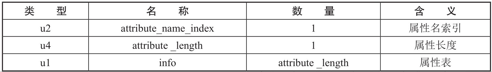

2、属性类型

​	属性表实际上可以有很多类型，上面看到的Code属性只是其中一种，Java虚拟机规范里面定义了23种属性。下面这些是虚拟机中预定义的属性，如下表所示，表格按照属性可能出现的位置排序。

<div style="text-align:center;font-weight:bold;">属性类型</div>

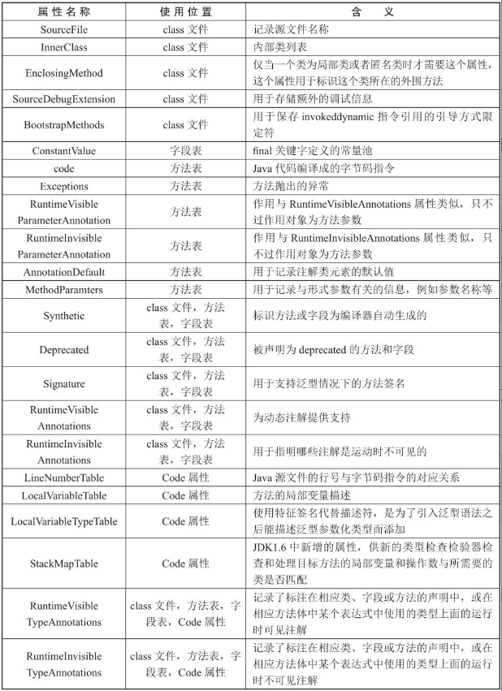

**3 部分属性详解**

1、ConstantValue属性

https://docs.oracle.com/javase/specs/jvms/se8/html/jvms-4.html#jvms-4.7.2

​	ConstantValue属性表示一个常量字段的值。位于field_info结构的属性表中。它的结构如下所示。

<div style="text-align:center;font-weight:bold;">ConstantValue属性</div>

```
ConstantValue_attribute {
    u2 attribute_name_index;
    u4 attribute_length;
    // 字段值在常量池的索引，常量池在该索引处的项给出该属性表示的常量值。（例如，值是long型的，在常量池中便是CONSTANT_Long）
    u2 constantvalue_index;
}
```

2、Deprecated属性

https://docs.oracle.com/javase/specs/jvms/se8/html/jvms-4.html#jvms-4.7.15

​	Deprecated属性是在JDK 1.1为了支持注释中的关键词@deprecated而引入的。它的结构如下所示。

<div style="text-align:center;font-weight:bold;">Deprecated属性</div>

```
Deprecated_attribute {
    u2 attribute_name_index;
    u4 attribute_length;
}
```

3、Code属性

https://docs.oracle.com/javase/specs/jvms/se8/html/jvms-4.html#jvms-4.7.3

​	Code属性就是存放在方法体里面的代码。但是，并非所有方法表都有Code属性。

​	像接口或者抽象方法，它们没有具体的方法体，因此也就不会有Code属性了。Code属性表的结构如下表所示。

<div style="text-align:center;font-weight:bold;">Code属性表的结构</div>

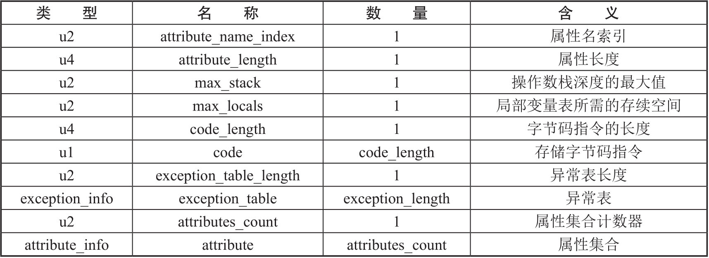

​	可以看到Code属性表的前两项跟属性表是一致的，即Code属性表遵循属性表的结构，后面那些则是它自定义的结构。

​	下面对Code属性进行字节码解析，紧跟在<span style="color:blue;font-weight:bold;">图17-5：第一个方法解析</span>中属性计数器后面的字节就是Code属性结构，如下图所示。

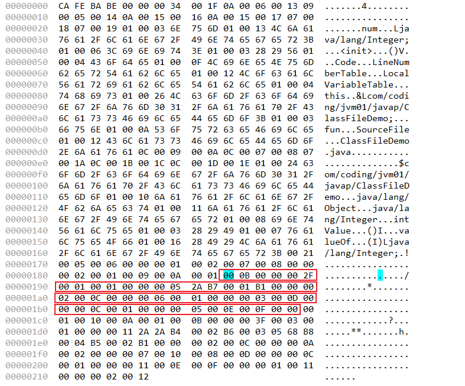

​	前面两个字节为属性名索引，其值为0x000b，前面有讲过其对应常量池中的值为Code，表明这是一个Code属性。<span style="color:#9400D3;">属性长度的值为0x0000002f，即长度为47，注意，这里的长度是指后面自定义的属性长度，不包括属性名索引和属性长度这两个所占的长度，因为这两个类型所占的长度都是固定6个字节，所以往后47个字节都是Code属性的内容。这也是为什么在17.3.7节中分析第二个方法的时候，我们说需要跳过47个字节</span>。

​	max_stack的值为0x0001，即操作数栈深度的最大值为1。

​	max_locals的值为0x0001，即局部变量表所需的存储空间为1,max_locals的单位是slot,slot是虚拟机为局部变量分配内存所使用的最小单位。

​	code_length的值为0x000000005，即字节码指令的长度是5。

​	code总共有5个值，分别是0x2a、0xb7、0x00、0x01、0xb1。这里的值就代表一系列的字节码指令。一个字节代表一个指令，一个指令可能有参数也可能没参数，如果有参数，则其后面字节码就是它的参数；如果没参数，后面的字节码就是下一条指令。可以通过jclasslib插件来查看这些字节分别代表哪些命令，如下图所示。

<div style="text-align:center;font-weight:bold;">第一个方法的Code属性结构之code</div>


​	从上图看到只有三个命令存在，单击aload_0，会自动跳转到JVM官网，如下图所示，可以看到aload_0指令对应的字节码是0x2a，对应class文件中code的第一个字节。

https://docs.oracle.com/javase/specs/jvms/se19/html/jvms-6.html#jvms-6.5.aload_n

<div style="text-align:center;font-weight:bold;">aload_&lt;n&gt;指令</div>

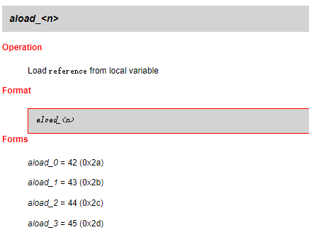

​	继续单击“invokespecial”命令，如下图所示，可以看到invokespecial指令对应的字节码是0xb7，对应class文件中code的第二个字节，大家可以看到这个指令需要两个参数，每个参数占用一个字节，也就是说0x00和0x01分别是invokespecial的参数。

https://docs.oracle.com/javase/specs/jvms/se19/html/jvms-6.html#jvms-6.5.invokespecial

<div style="text-align:center;font-weight:bold;">invokespecial指令</div>

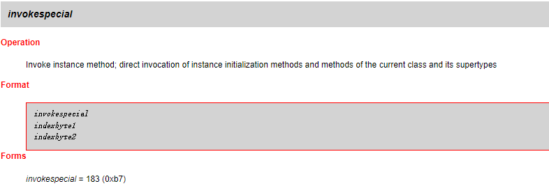

​	继续单击“return”命令，如下图所示，可以看到return指令对应的字节码是0xb1，对应class文件中code的第五个字节。

https://docs.oracle.com/javase/specs/jvms/se19/html/jvms-6.html#jvms-6.5.return

<div style="text-align:center;font-weight:bold;">return指令</div>


​	也可以直接使用javap命令来解析，如下图所示。

<div style="text-align:center;font-weight:bold;">javap命令查看code属性</div>

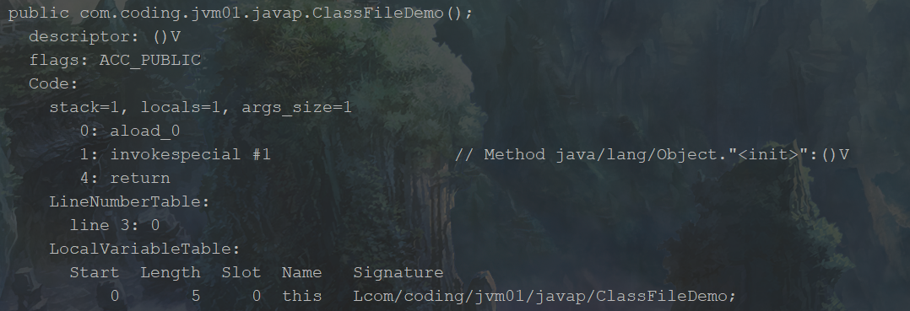

​	由上图可知，code属性的操作数栈深度的最大值为1，局部变量表所需的存储空间为1，整个方法需要三个字节码指令。exception_table_length的值为0x0000，即异常表长度为0，所以其异常表也就没有了。attributes_count的值为0x0002，即code属性表里面还有2个其他的属性表，后面就是其他属性的属性表了。所有的属性都遵循属性表的结构，同样，这里的结构也不例外。前两个字节为属性名索引，其值为0x000c，查看常量池中的第12项。

```java
#12 = Utf8               LineNumberTable
```

​	这是一个LineNumberTable属性。LineNumberTable属性先跳过。再来看下第二个方法表中的Code属性，如下图所示。

<div style="text-align:center;font-weight:bold;">第二个方法Code属性结构</div>

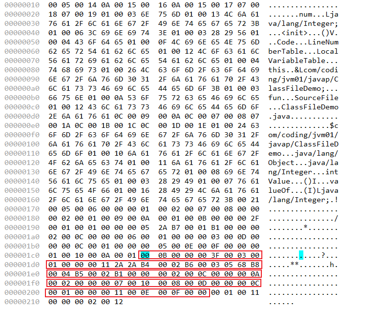

​	属性名索引的值同样为0x000b，所以这也是一个Code属性。属性长度的值为0x0000003f，即长度为63。max_stack的值为0x0003，即操作数栈深度的最大值为3。max_locals的值为0x0001，即局部变量表所需的存储空间为1。code_length的值为0x00000011，即字节码指令的长度为17。code的值为0x2a,0x2a,0xb4,0x00,0x02,0xb6,0x00,0x03,0x05,0x68,0xb8,0x00,0x04,0xb5,0x00,0x02,0xb1命令，对应的fun()方法的字节码指令如下图所示。

<div style="text-align:center;font-weight:bold;">javap命令查看code属性</div>

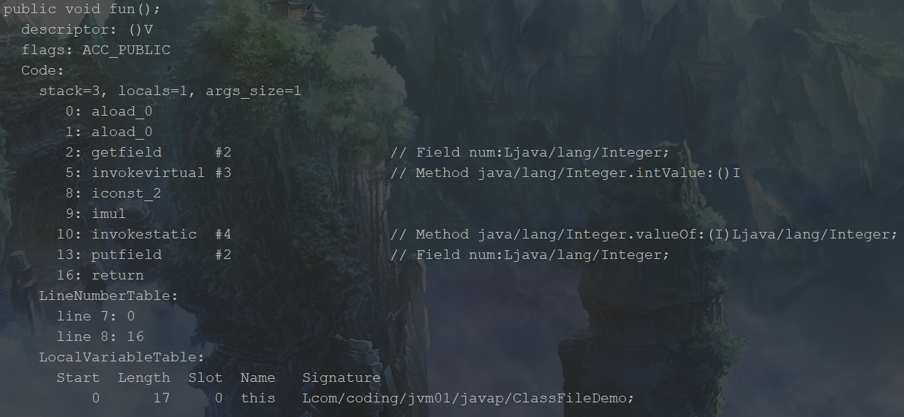

​	继续解析后面的字节码，exception_table_length的值为0x0000，表示异常表长度为0，所以没有异常表。attributes_count的值为0x0002，表示code属性表里面还有一个其他的属性表。属性名索引值为0x000c，这同样也是一个LineNumberTable属性，继续往下看。

4、LineNumberTable属性

​	LineNumberTable属性是可选变长属性，位于Code结构的属性表。用来描述Java源文件行号与字节码行号之间的对应关系。这个属性可以用来在调试的时候定位代码执行的行数。start_pc表示字节码行号；line_number表示Java源文件行号。在Code属性的属性表中，LineNumberTable属性可以按照任意顺序出现，此外，多个LineNumberTable属性可以共同表示一个行号在源文件中表示的内容，即LineNumberTable属性不需要与源文件的行一一对应。LineNumberTable属性表结构如下。

https://docs.oracle.com/javase/specs/jvms/se8/html/jvms-4.html#jvms-4.7.12

<div style="text-align:center;font-weight:bold;">LineNumberTable属性</div>

```
LineNumberTable_attribute {
    u2 attribute_name_index;
    u4 attribute_length;
    u2 line_number_table_length;
    {   u2 start_pc;
        u2 line_number;	
    } line_number_table[line_number_table_length];
}
```

​	前面出现了两个LineNumberTable属性，先看第一个，如下图所示。

<div style="text-align:center;font-weight:bold;">第1个Code属性之LineNumberTable属性</div>

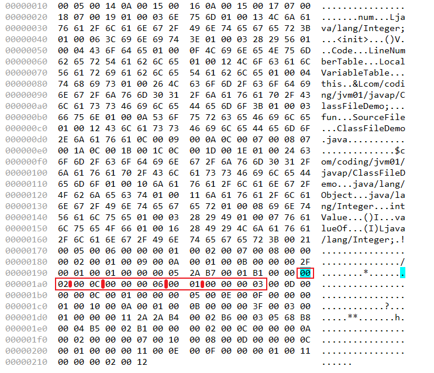

​	attributes_count的值为0x0002，表明code属性表里面还有一个其他的属性表。属性名索引值为0x000c，查看常量池中的第12项，如下所示，表明这是一个LineNumberTable属性。

```
#12 = Utf8               LineNumberTable
```

​	attribute_length的值为0x00000006，即其长度为6，后面6个字节都是LineNumberTable属性的内容。line_number_table_length的值为0x0001，即其行号表长度为1，表示有一个行号表。行号表值为0x00 00 00 03，表示字节码第0行对应Java源文件第3行，同样，使用javap命令也能看到，如下所示。

```
    LineNumberTable:
            line 3: 0
```

​	第二个LineNumberTable属性如下图所示。

<div style="text-align:center;font-weight:bold;">第2个Code属性之LineNumberTable属性</div>


​	attribute_length的值为0x0000000a，表示其长度为10，后面10个字节都是LineNumberTable属性的内容。line_number_table_length的值为0x0002，表示其行号表长度为2，即有一个行号表。行号表其值为0x00 00 00 07，表示字节码第0行对应Java源文件第7行。第二个行号表其值为0x00 10 00 08，即字节码第16行对应Java源文件第8行。同样，使用javap命令也能看到，如下所示。

```
      LineNumberTable:
        line 7: 0
        line 8: 16
```

​	这些行号主要用于当程序抛出异常时，可以看到报错的行号，这利于我们排查问题。工作使用debug断点时，也是根据源码的行号来设置的。

5、LocalVariableTable属性

​	LocalVariableTable是可选变长属性，位于Code属性的属性表中。它被调试器用于确定方法在执行过程中局部变量的信息。在Code属性的属性表中，LocalVariableTable属性可以按照任意顺序出现。Code属性中的每个局部变量最多只能有一个LocalVariableTable属性。“start pc + length”表示这个变量在字节码中的生命周期起始和结束的偏移位置（this生命周期从头0到结尾），index就是这个变量在局部变量表中的槽位（槽位可复用），name就是变量名称，Descriptor表示局部变量类型描述。LocalVariableTable属性表结构如下所示。

https://docs.oracle.com/javase/specs/jvms/se8/html/jvms-4.html#jvms-4.7.13

<div style="text-align:center;font-weight:bold;">LocalVariableTable属性</div>

```
LocalVariableTable_attribute {
    u2 attribute_name_index;
    u4 attribute_length;
    u2 local_variable_table_length;
    {   u2 start_pc;
        u2 length;
        u2 name_index;
        u2 descriptor_index;
        u2 index;
    } local_variable_table[local_variable_table_length];
}
```

​	大家还记得上面的code属性中存在2个其他属性，其中之一是LineNumberTable属性，在上一小节我们已经讲过，那么接下来分析另外一个属性。所有的属性都遵循属性表的结构，同样，这里的结构也不例外。前两个字节为属性名索引，其值为0x000d，查看常量池中的第13项。

```
#13 = Utf8               LocalVariableTable
```

​	这是一个LocalVariableTable属性，如下图所示。

<div style="text-align:center;font-weight:bold;">第1个Code属性之LocalVariableTable属性</div>

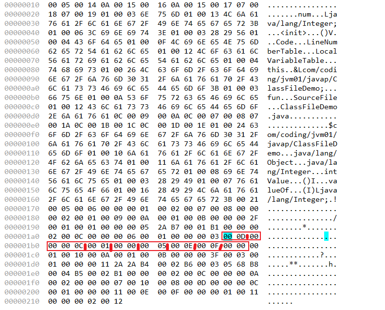

​	attribute_length的值为0x0000000c，表示其长度为12，后面12个字节都是LocalVariableTable属性的内容。line_variable_table_length的值为0x0001，表示其行号表长度为1，即有一个local_variable_table表。start_pc的值为0x0000,length的值为0x0005，其十进制值为5，从字节码偏移量start_pc到start_pc+length就是当前局部变量的作用域范围。name_index的值为0x000e，转为十进制为14，查看常量池中的第14项，可知，当前局部变量为this。

```
#14 = Utf8               this
```

​	descriptor_index的值为0x000f，转为十进制为15，查看常量池中的第15项。该变量的描述符为引用数据类型com/coding/jvm01/javap/ClassFileDemo。index的值为0x0000，转为十进制为0，当前局部变量在栈帧中局部变量表中的位置是0

```
#15 = Utf8               Lcom/coding/jvm01/javap/ClassFileDemo;
```

​	同样，使用javap命令也能看到，如下所示。

```
      LocalVariableTable:
        Start  Length  Slot  Name   Signature
            0       5     0  this   Lcom/coding/jvm01/javap/ClassFileDemo;
```

​	对于Java类中的每一个实例方法（非static方法），其实在编译后所生成的字节码当中，方法参数的数量总是会比源代码中方法参数的数量多一个，多的参数是this，它位于方法的第一个参数位置处，就可以在Java的实例方法中使用this去访问当前对象的属性以及其他方法。

​	这个操作是在编译期间完成的，即由javac编译器在编译的时候将对this的访问转化为对一个普通实例方法参数的访问，接下来在运行期间，由JVM在调用实例方法时，自动向实例方法传入该this参数，所以，在实例方法的局部变量表中，至少会有一个指向当前对象的局部变量。

6、InnerClasses属性

​	假设一个类或接口的class文件为C。如果C的常量池中包含某个CONSTANT_Class_info成员，且这个成员所表示的类或接口不属于任何一个包，那么C的属性表中就必须含有对应的InnerClasses属性。InnerClasses属性是在JDK 1.1中为了支持内部类和内部接口而引入的，位于class文件中的属性表。

https://docs.oracle.com/javase/specs/jvms/se8/html/jvms-4.html#jvms-4.7.6

<div style="text-align:center;font-weight:bold;">InnerClasses属性</div>

```
InnerClasses_attribute {
    u2 attribute_name_index;
    u4 attribute_length;
    u2 number_of_classes;
    {   u2 inner_class_info_index;
        u2 outer_class_info_index;
        u2 inner_name_index;
        u2 inner_class_access_flags;
    } classes[number_of_classes];
}
```

7、Signature属性

​	Signature属性是可选的定长属性，位于ClassFile、field_info或method_info结构的属性表中。在Java语言中，任何类、接口、初始化方法或成员的泛型签名如果包含了类型变量或参数化类型，则Signature属性会为它记录泛型签名信息。

https://docs.oracle.com/javase/specs/jvms/se8/html/jvms-4.html#jvms-4.7.9

<div style="text-align:center;font-weight:bold;">Signature属性</div>

```
Signature_attribute {
    u2 attribute_name_index;
    u4 attribute_length;
    u2 signature_index;
}
```

8、SourceFile属性

SourceFile属性结构如下表所示，其长度是固定的8个字节。

<div style="text-align:center;font-weight:bold;">SourceFile属性表结构</div>

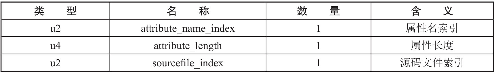

9、其他属性

​	最后还有几个字节没有解析，如下图所示。

<div style="text-align:center;font-weight:bold;">其他属性</div>

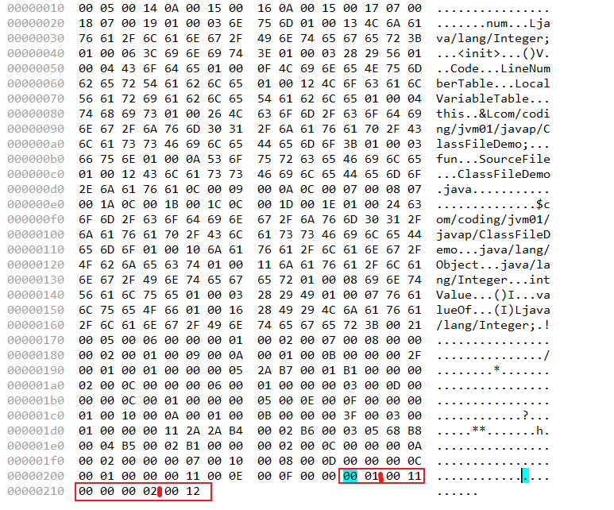

​	我们前面带大家解析的是方法表中的一些属性信息，包括code属性以及code属性中的LineNumberTable属性和LocalVariableTable属性，<span style="color:red;font-weight:bold;">最后的就是我们本节所说的属性表集合</span>。前面2个字节表示属性表计数器，其值为0x0001，即还有一个附加属性，属性名索引的值为0x0011，即常量池中的第17项，如下所示，这一个属性是SourceFile属性，即源码文件属性。

```
#17 = Utf8               SourceFile
```

​	属性长度的值为0x00000002，即长度为2。源码文件索引的值为0x0012，即常量池中的第18项，如下所示。所以，我们能够从这里知道，这个class文件的源码文件名称为ClassFileDemo.java。同样，当抛出异常时，可以通过这个属性定位到报错的文件。至此，字节码完全解读完毕。

```
#18 = Utf8               ClassFileDemo.java
```

​	JVM中预定义的属性有20多个，这里就不一一介绍了，通过上面几个属性的介绍，只要领会其精髓，其他属性的解读也是易如反掌。

​	通过手动去解读class文件，终于大概了解到其构成和原理了。实际上，可以使用各种工具来帮我们去解读class文件，而不用直接去看这些十六进制的数据。下面介绍javap指令解析class文件。

## 17.4 使用javap指令解析class文件

​	前面小节中通过解析反编译生成的class文件，可以帮助我们深入地了解Java代码的工作机制。但是，手动解析class文件结构太麻烦，除了使用第三方的jclasslib工具之外，Oracle官方也提供了javap命令工具。

​	javap是JDK自带的反编译工具。它的作用就是根据class文件，反编译出当前类对应的字节码指令、局部变量表、异常表和代码行偏移量映射表、常量池等信息。例如通过局部变量表，我们可以查看局部变量的作用域范围、所在槽位等信息，甚至可以看到槽位复用等信息。

​	解析class文件得到的信息中，有些信息（如局部变量表、指令和代码行偏移量映射表、常量池中方法的参数名称等）需要在使用javac编译成class文件时，指定参数才能输出。<span style="color:#FF1493;font-weight:bold;">比如直接执行javac xx.java，就不会在生成对应的局部变量表等信息，如果使用javac -g xx.java就可以生成所有相关信息了</span>。如果使用Eclipse或IDEA，则默认情况下Eclipse、IDEA在编译时会帮助生成局部变量表、指令和代码行偏移量映射表等信息。

​	javap的用法格式如下。

```cmd
$ javap -help
用法: javap <options> <classes>
其中, 可能的选项包括:
  -help  --help  -?        输出此用法消息
  -version                 版本信息
  -v  -verbose             输出附加信息
  -l                       输出行号和本地变量表
  -public                  仅显示公共类和成员
  -protected               显示受保护的/公共类和成员
  -package                 显示程序包/受保护的/公共类
                           和成员 (默认)
  -p  -private             显示所有类和成员
  -c                       对代码进行反汇编
  -s                       输出内部类型签名
  -sysinfo                 显示正在处理的类的
                           系统信息 (路径, 大小, 日期, MD5 散列)
  -constants               显示最终常量
  -classpath <path>        指定查找用户类文件的位置
  -cp <path>               指定查找用户类文件的位置
  -bootclasspath <path>    覆盖引导类文件的位置
```

​	其中，classes就是要反编译的class文件。在命令行中直接输入javap或javap -help可以看到javap命令有如下选项，如下表所示。

| 命令                                                         | 含义                                                         |
| ------------------------------------------------------------ | ------------------------------------------------------------ |
| <span style="background-color:#ff9b00;font-weight:bold;width:350px;display:inline-block;">-help --help -?</span> | 输出此用法消息                                               |
| <span style="background-color:#ff9b00;font-weight:bold;width:350px;display:inline-block;">-version</span> | 版本信息，其实是当前javap所在jdk的版本信息，不是class在哪个jdk下生成的。 |
| <span style="background-color:#00d900;font-weight:bold;width:350px;display:inline-block;">-public</span> | 仅显示公共类和成员                                           |
| <span style="background-color:#00d900;font-weight:bold;width:350px;display:inline-block;">-protected</span> | 显示受保护的/公共类和成员                                    |
| <span style="background-color:#00d900;color:red;font-weight:bold;width:350px;display:inline-block;">-p -private</span> | <span style="color:red;font-weight:bold;">显示所有类和成员</span> |
| <span style="background-color:#00d900;font-weight:bold;width:350px;display:inline-block;">-package</span> | <span style="color:blue;font-weight:bold;">显示程序包/受保护的/公共类 和成员（默认）</span> |
| <span style="background-color:#00d900;font-weight:bold;width:350px;display:inline-block;">-sysinfo</span> | 显示正在处理的类的系统信息（路径，大小，日期，MD5 散列，源文件名） |
| <span style="background-color:#00d900;font-weight:bold;width:350px;display:inline-block;">-constants</span> | 显示静态最终常量                                             |
| <span style="background-color:#fff000;font-weight:bold;width:350px;display:inline-block;;">-s</span> | 输出内部类型签名                                             |
| <span style="background-color:#fff000;font-weight:bold;width:350px;display:inline-block;">-l</span> | 输出行号表和本地变量表                                       |
| <span style="background-color:#fff000;font-weight:bold;width:350px;display:inline-block;">-c</span> | 对代码进行反汇编（也即方法的Code）                           |
| <span style="background-color:#fff000;color:red;font-weight:bold;width:350px;display:inline-block;">-v -verbose</span> | <span style="color:red;font-weight:bold;">输出附加信息（包括行号、本地变量表，反汇编等详细信息）</span> |
| <span style="background-color:#ccc;font-weight:bold;width:350px;display:inline-block;">-classpath <path></span> | 指定查找用户类文件的位置                                     |
| <span style="background-color:#ccc;font-weight:bold;width:350px;display:inline-block;">-cp <path></span> | 指定查找用户类文件的位置                                     |

<div style="text-align:center;font-weight:bold;">javap参数解析</div>

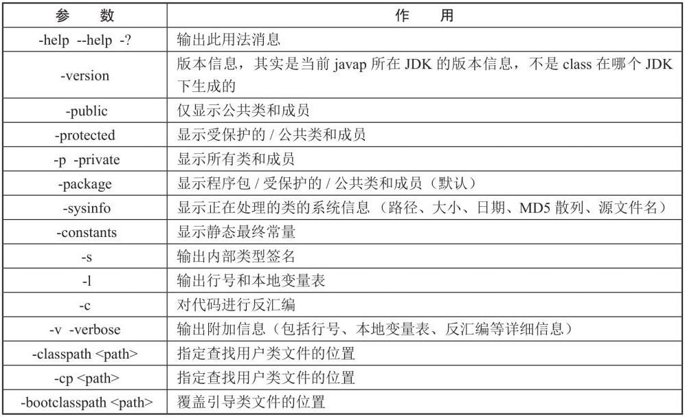

​	一般常用的是-l、-c、-v三个选项。

- javap -l 会输出行号和本地变量表信息。    
- javap -c 会对当前class字节码进行反编译生成汇编代码。     
- javap –v 除了包含-c内容外，还会输出行号、局部变量表信息、常量池等信息。

常用示例：

```cmd
# <classes>可以不带有.class
$ javap -v -p JavapTest.class
$ javap -v -p JavapTest
```

**1 使用举例**

​	通过一段代码来查看使用javap命令的效果，Java源文件如下代码所示。

<span style="color:#40E0D0;">案例1：测试javap命令的效果</span>

- 代码

```java
package com.coding.jvm01.javap;

public class JavapTest {
    private int num;
    boolean flag;
    protected char gender;
    public String info;

    public static final int COUNTS = 1;

    static {
        String url = "www.baidu.com";
    }

    {
        info = "java";
    }

    public JavapTest() {
    }

    private JavapTest(boolean flag) {
        this.flag = flag;
    }

    private void methodPrivate() {
    }

    int getNum(int i) {
        return num + i;
    }

    protected char showGender() {
        return gender;
    }

    public void showInfo() {
        int i = 10;
        System.out.println(info + i);
    }
}
```

​	输入如下命令可以看到比较完整的字节码信息。

​	结果如下，相关的信息在字节码中有注释。

​	下面的内容用来描述字段表集合信息，包括字段名称（例如private int num表示字段名称为num），字段描述符（例如descriptor:I表示字段类型为int）和字段的访问权限（例如flags:ACC_PRIVATE表示字段访问权限为private）。如果包含常量则用ConstantValue来表示。

​	接着就是方法表集合的信息，包含了类中方法信息，关于详细解释请查看下面内容中的注释，以showinfo()方法为例注释。

```cmd
$ javap -v -p JavapTest.class 
Classfile /C:/Job/JobResource/IdeaProjects/backend-jvm-learning/jvm-01-bytecode/src/main/java/com/coding/jvm01/javap/JavapTest.class
  Last modified 2024-11-21; size 1366 bytes
  MD5 checksum 225bfadf6de46ec57299a118d141aefb
  Compiled from "JavapTest.java"
public class com.coding.jvm01.javap.JavapTest
  minor version: 0							// 副版本
  major version: 52							// 主版本
  flags: ACC_PUBLIC, ACC_SUPER				// 访问标识
Constant pool:								// 常量池
   #1 = Methodref          #16.#46        // java/lang/Object."<init>":()V
   #2 = String             #47            // java
   #3 = Fieldref           #15.#48        // com/coding/jvm01/javap/JavapTest.info:Ljava/lang/String;
   #4 = Fieldref           #15.#49        // com/coding/jvm01/javap/JavapTest.flag:Z
   #5 = Fieldref           #15.#50        // com/coding/jvm01/javap/JavapTest.num:I
   #6 = Fieldref           #15.#51        // com/coding/jvm01/javap/JavapTest.gender:C
   #7 = Fieldref           #52.#53        // java/lang/System.out:Ljava/io/PrintStream;
   #8 = Class              #54            // java/lang/StringBuilder
   #9 = Methodref          #8.#46         // java/lang/StringBuilder."<init>":()V
  #10 = Methodref          #8.#55         // java/lang/StringBuilder.append:(Ljava/lang/String;)Ljava/lang/StringBuilder;
  #11 = Methodref          #8.#56         // java/lang/StringBuilder.append:(I)Ljava/lang/StringBuilder;
  #12 = Methodref          #8.#57         // java/lang/StringBuilder.toString:()Ljava/lang/String;
  #13 = Methodref          #58.#59        // java/io/PrintStream.println:(Ljava/lang/String;)V
  #14 = String             #60            // www.baidu.com
  #15 = Class              #61            // com/coding/jvm01/javap/JavapTest
  #16 = Class              #62            // java/lang/Object
  #17 = Utf8               num
  #18 = Utf8               I
  #19 = Utf8               flag
  #20 = Utf8               Z
  #21 = Utf8               gender
  #22 = Utf8               C
  #23 = Utf8               info
  #24 = Utf8               Ljava/lang/String;
  #25 = Utf8               COUNTS
  #26 = Utf8               ConstantValue
  #27 = Integer            1
  #28 = Utf8               <init>
  #29 = Utf8               ()V
  #30 = Utf8               Code
  #31 = Utf8               LineNumberTable
  #32 = Utf8               LocalVariableTable
  #33 = Utf8               this
  #34 = Utf8               Lcom/coding/jvm01/javap/JavapTest;
  #35 = Utf8               (Z)V
  #36 = Utf8               methodPrivate
  #37 = Utf8               getNum
  #38 = Utf8               (I)I
  #39 = Utf8               i
  #40 = Utf8               showGender
  #41 = Utf8               ()C
  #42 = Utf8               showInfo
  #43 = Utf8               <clinit>
  #44 = Utf8               SourceFile
  #45 = Utf8               JavapTest.java
  #46 = NameAndType        #28:#29        // "<init>":()V
  #47 = Utf8               java
  #48 = NameAndType        #23:#24        // info:Ljava/lang/String;
  #49 = NameAndType        #19:#20        // flag:Z
  #50 = NameAndType        #17:#18        // num:I
  #51 = NameAndType        #21:#22        // gender:C
  #52 = Class              #63            // java/lang/System
  #53 = NameAndType        #64:#65        // out:Ljava/io/PrintStream;
  #54 = Utf8               java/lang/StringBuilder
  #55 = NameAndType        #66:#67        // append:(Ljava/lang/String;)Ljava/lang/StringBuilder;
  #56 = NameAndType        #66:#68        // append:(I)Ljava/lang/StringBuilder;
  #57 = NameAndType        #69:#70        // toString:()Ljava/lang/String;
  #58 = Class              #71            // java/io/PrintStream
  #59 = NameAndType        #72:#73        // println:(Ljava/lang/String;)V
  #60 = Utf8               www.baidu.com
  #61 = Utf8               com/coding/jvm01/javap/JavapTest
  #62 = Utf8               java/lang/Object
  #63 = Utf8               java/lang/System
  #64 = Utf8               out
  #65 = Utf8               Ljava/io/PrintStream;
  #66 = Utf8               append
  #67 = Utf8               (Ljava/lang/String;)Ljava/lang/StringBuilder;
  #68 = Utf8               (I)Ljava/lang/StringBuilder;
  #69 = Utf8               toString
  #70 = Utf8               ()Ljava/lang/String;
  #71 = Utf8               java/io/PrintStream
  #72 = Utf8               println
  #73 = Utf8               (Ljava/lang/String;)V
{
  private int num;
    descriptor: I
    flags: ACC_PRIVATE

  boolean flag;
    descriptor: Z
    flags:

  protected char gender;
    descriptor: C
    flags: ACC_PROTECTED

  public java.lang.String info;
    descriptor: Ljava/lang/String;
    flags: ACC_PUBLIC

  public static final int COUNTS;
    descriptor: I
    flags: ACC_PUBLIC, ACC_STATIC, ACC_FINAL
    ConstantValue: int 1

  public com.coding.jvm01.javap.JavapTest();	// 无参构造器的信息
    descriptor: ()V
    flags: ACC_PUBLIC
    Code:
      stack=2, locals=1, args_size=1
         0: aload_0
         1: invokespecial #1                  // Method java/lang/Object."<init>":()V
         4: aload_0
         5: ldc           #2                  // String java
         7: putfield      #3                  // Field info:Ljava/lang/String;
        10: return
      LineNumberTable:
        line 19: 0
        line 16: 4
        line 20: 10
      LocalVariableTable:
        Start  Length  Slot  Name   Signature
            0      11     0  this   Lcom/coding/jvm01/javap/JavapTest;

  private com.coding.jvm01.javap.JavapTest(boolean);	// 含参构造器的信息
    descriptor: (Z)V
    flags: ACC_PRIVATE
    Code:
      stack=2, locals=2, args_size=2
         0: aload_0
         1: invokespecial #1                  // Method java/lang/Object."<init>":()V
         4: aload_0
         5: ldc           #2                  // String java
         7: putfield      #3                  // Field info:Ljava/lang/String;
        10: aload_0
        11: iload_1
        12: putfield      #4                  // Field flag:Z
        15: return
      LineNumberTable:
        line 22: 0
        line 16: 4
        line 23: 10
        line 24: 15
      LocalVariableTable:
        Start  Length  Slot  Name   Signature
            0      16     0  this   Lcom/coding/jvm01/javap/JavapTest;
            0      16     1  flag   Z

  private void methodPrivate();
    descriptor: ()V
    flags: ACC_PRIVATE
    Code:
      stack=0, locals=1, args_size=1
         0: return
      LineNumberTable:
        line 27: 0
      LocalVariableTable:
        Start  Length  Slot  Name   Signature
            0       1     0  this   Lcom/coding/jvm01/javap/JavapTest;

  int getNum(int);
    descriptor: (I)I
    flags:
    Code:
      stack=2, locals=2, args_size=2
         0: aload_0
         1: getfield      #5                  // Field num:I
         4: iload_1
         5: iadd
         6: ireturn
      LineNumberTable:
        line 30: 0
      LocalVariableTable:
        Start  Length  Slot  Name   Signature
            0       7     0  this   Lcom/coding/jvm01/javap/JavapTest;
            0       7     1     i   I

  protected char showGender();
    descriptor: ()C
    flags: ACC_PROTECTED
    Code:
      stack=1, locals=1, args_size=1
         0: aload_0
         1: getfield      #6                  // Field gender:C
         4: ireturn
      LineNumberTable:
        line 34: 0
      LocalVariableTable:
        Start  Length  Slot  Name   Signature
            0       5     0  this   Lcom/coding/jvm01/javap/JavapTest;

  public void showInfo();
    descriptor: ()V							// 方法描述符主要包含方法的形参列表和返回值类型
    flags: ACC_PUBLIC						// 方法的访问标识
    Code:									// 方法的Code属性
      stack=3, locals=2, args_size=1		// stack:操作数栈的最大深度；locals:局部变量表的长度，注意包含this；args_size：方法接收参数的个数，static代码块值为0，无参值为1，有一个参数值为2，以此类推。
      	// 第一行的10表示操作数，前面加#表示指向常量池中的索引地址
         0: bipush        10
         2: istore_1
         3: getstatic     #7                  // Field java/lang/System.out:Ljava/io/PrintStream;
         6: new           #8                  // class java/lang/StringBuilder
         9: dup
        10: invokespecial #9                  // Method java/lang/StringBuilder."<init>":()V
        13: aload_0
        14: getfield      #3                  // Field info:Ljava/lang/String;
        17: invokevirtual #10                 // Method java/lang/StringBuilder.append:(Ljava/lang/String;)Ljava/lang/StringBuilder;
        20: iload_1
        21: invokevirtual #11                 // Method java/lang/StringBuilder.append:(I)Ljava/lang/StringBuilder;
        24: invokevirtual #12                 // Method java/lang/StringBuilder.toString:()Ljava/lang/String;
        27: invokevirtual #13                 // Method java/io/PrintStream.println:(Ljava/lang/String;)V
        30: return
        // 行号表：指明字节码指令的偏移量与java源程序中代码的行号的一一对应关系。
      LineNumberTable:
        line 38: 0							// 0：表示上面字节码指令前面的0；38表示java代码中的行号
        line 39: 3
        line 40: 30
      LocalVariableTable:					// 局部变量表：描述方法内部局部变量的相关信息
        Start  Length  Slot  Name   Signature
            0      31     0  this   Lcom/coding/jvm01/javap/JavapTest;
            3      28     1     i   I

  static {};
    descriptor: ()V
    flags: ACC_STATIC
    Code:
      stack=1, locals=1, args_size=0
         0: ldc           #14                 // String www.baidu.com
         2: astore_0
         3: return
      LineNumberTable:
        line 12: 0
        line 13: 3
      LocalVariableTable:
        Start  Length  Slot  Name   Signature
}
SourceFile: "JavapTest.java"						// 附加属性：指明当前class文件对应的源程序文件名
```


# 第18章 字节码指令集与解析

​	如果大家还有印象的话，前面的章节也有使用到字节码指令，比如第4章讲解操作数栈的时候就使用到iconst和istore指令。字节码指令就是JVM层面对于Java语法逻辑的底层实现，比如在程序中使用的“if else”语句，对应JVM中的指令就是控制转移指令。JVM中还有很多其他类型的字节码指令，比如控制转移指令、异常处理指令等。本章将详细介绍JVM的不同用途的字节码指令，可以更好地帮助理解Java中的语法逻辑在JVM中是如何实现的。

## 18.1 概述

​	Java字节码对于虚拟机，就好像汇编语言对于计算机，属于基本执行指令。<span style="color:red;font-weight:bold;">JVM字节码指令由一个字节长度的、代表着某种特定操作含义的数字（称为操作码，Opcode）以及跟随其后的零至多个代表此操作所需参数（称为操作数，Operands）而构成</span>。由于JVM是基于栈结构而不是寄存器的结构，所以大多数的指令都不包含操作数，只有一个操作码。JVM操作码的长度为一个字节（即0～255），这意味着指令集的操作码总数不可能超过256条。

​	不考虑异常处理的情况下，JVM解释器的执行模型可以使用下面的伪代码表示。

```java
do {
    自动计算PC寄存器的值加1;
    根据PC寄存器的指示位置，从字节码流中取出操作码;
    if(字节码存在操作数) 从字节码流中取出操作数;
	执行操作码所定义的操作;
} while(字节码长度>0);
```

​	掌握常见的字节码指令可以帮助更方便地阅读class文件。

### 18.1.1 字节码与数据类型

​	在JVM的指令集中，大多数的指令都包含了其操作所对应的数据类型信息，例如iload指令用于从局部变量表中加载int型的数据到操作数栈中，fload指令中的f表示加载float类型的数据。对于大部分与数据类型相关的字节码指令，它们的操作码助记符中都有特殊的字符来表明专门为哪种数据类型服务，如下表所示。

<div style="text-align:center;font-weight:bold;">特殊字符对应数据类型</div>

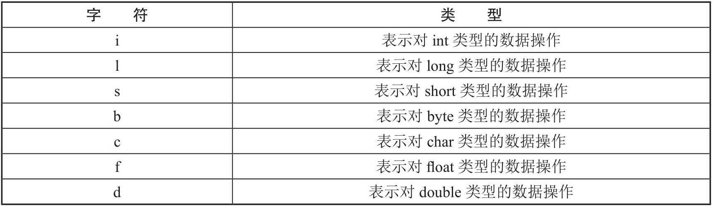

​	也有一些指令的助记符中没有明确地指明操作类型的字母，如arraylength指令，它没有代表数据类型的特殊字符，但操作数永远只能是一个数组类型的对象。还有另外一些指令，如无条件跳转指令goto则是与数据类型无关的。

​	由于JVM的操作码长度只有一个字节，所以包含了数据类型的操作码就为指令集的设计带来了很大的压力。如果每一种与数据类型相关的指令都支持JVM所有运行时数据类型的话，那指令的数量就会超出一个字节所能表示的数量范围了。

​	字节码指令集中大部分的指令都不支持byte、char和short，甚至没有任何指令支持boolean类型，例如，load指令有操作int类型的iload，但是没有操作byte类型的同类指令。编译器会在编译期或运行期将byte和short类型的数据带符号扩展(Sign-Extend)为相应的int类型数据，将boolean和char类型数据零位扩展(Zero-Extend)为相应的int类型数据。与之类似，在处理boolean、byte、short和char类型的数组时，也会转换为使用对应的int类型的字节码指令来处理。因此，大多数对于boolean、byte、short和char类型数据的操作，实际上都是使用相应的int类型作为运算类型。在编写Java代码时也有所体现，比如Java允许byte b1 =12,short s1 = 10，而b1 + s1的结果至少要使用int类型来接收等语法。

### 18.1.2 指令分类

​	由于完全介绍和学习这些指令需要花费大量时间。为了让大家能够更快地熟悉和了解这些基本指令，这里将JVM中的字节码指令集按用途大致分成9类，如下表所示。

<div style="text-align:center;font-weight:bold;">指令分类</div>


​	在做值相关操作时，指令可以从局部变量表、常量池、堆中对象、方法调用、系统调用等区域取得数据，这些数据（可能是值，可能是对象的引用）被压入操作数栈。也可以从操作数栈中取出一个到多个值（pop多次），完成赋值、加减乘除、方法传参、系统调用等操作。下面分别讲解各种指令的详细含义。

## 18.2 加载与存储指令

​	加载和存储指令用于将数据在栈帧中的局部变量表和操作数栈之间来回传输，这类指令包括如下内容。

1、局部变量入栈指令表示将一个局部变量加载到操作数栈，指令如下。

```
xload、xload_<n>（其中x为i、l、f、d、a，分别表示int类型，long类型，float类型，double类型，引用类型；n为数值0到3）
```

2、常量入栈指令表示将一个常量加载到操作数栈，指令如下。

```
bipush
sipush
ldc
ldc_w
ldc2_w
aconst_null
iconst_m1
iconst_<i>
lconst_<l>
fconst_<f>
dconst_<d>
```

3、出栈装入局部变量表指令表示将一个数值从操作数栈存储到局部变量表，指令如下。

```
xstore、xstore_<n>（其中x为i、l、f、d、a，分别表示int类型，long类型，float类型，double类型，引用类型；n为0到3）
```

4、扩充局部变量表的访问索引的指令如下。

```
wide
```

​	上面所列举的指令助记符中，有一部分是以尖括号结尾的（例如`iload_<n>`），这些指令助记符实际上代表了一组指令（例如`iload_<n>`代表了iload_0、iload_1、iload_2和iload_3这几个指令）。这几组指令都是某个带有一个操作数的通用指令（例如iload）的特殊形式，对于这若干组特殊指令来说，它们表面上没有操作数，不需要进行取操作数的动作，但操作数都隐含在指令中。具体含义如下所示。

<div style="text-align:center;font-weight:bold;">指令含义</div>

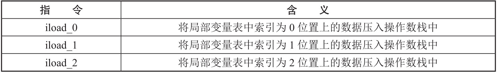

​	除此之外，它们的语义与原生的通用指令完全一致（例如iload_0的语义与操作数为0时的iload指令语义完全一致）。在尖括号之间的字母指定了指令隐含操作数的数据类型，<n>代表非负的整数，<i>代表int类型数据，<l>代表long类型，<f>代表float类型，<d>代表double类型。

### 18.2.1 局部变量入栈指令

​	局部变量入栈指令将给定的局部变量表中的数据压入操作数栈。这类指令大体可以分为以下两种类型。

```
xload_<n> (x为i、l、f、d、a，n为0到3)
xload (x为i、l、f、d、a)
```

​	在这里，x的取值表示数据类型。指令xload_n表示将局部变量表中索引为n的位置中的数据压入操作数栈，比如iload_0、fload_0、aload_0等指令。其中aload_n表示将一个对象引用入栈。

​	指令xload通过指定参数的形式，把局部变量压入操作数栈，当使用这个命令时，表示局部变量的数量可能超过了4个，比如指令iload、fload等。

​	我们使用代码来演示局部变量入栈指令，如下代码所示。

<span style="color:#40E0D0;">案例1：局部变量入栈指令示例</span>

- 代码

```java
package com.coding.jvm01.instruct;

/**
 * 1、加载与存储指令
 */
public class LoadAndStoreTest {

    // 1、局部变量压栈指令
    public void load(int num, Object obj, long count, boolean flag, short[] arr) {
        System.out.println(num);
        System.out.println(obj);
        System.out.println(count);
        System.out.println(flag);
        System.out.println(arr);
    }
}
```

​	其对应的字节码指令如下。

<div style="text-align:center;font-weight:bold;">字节码数据</div>

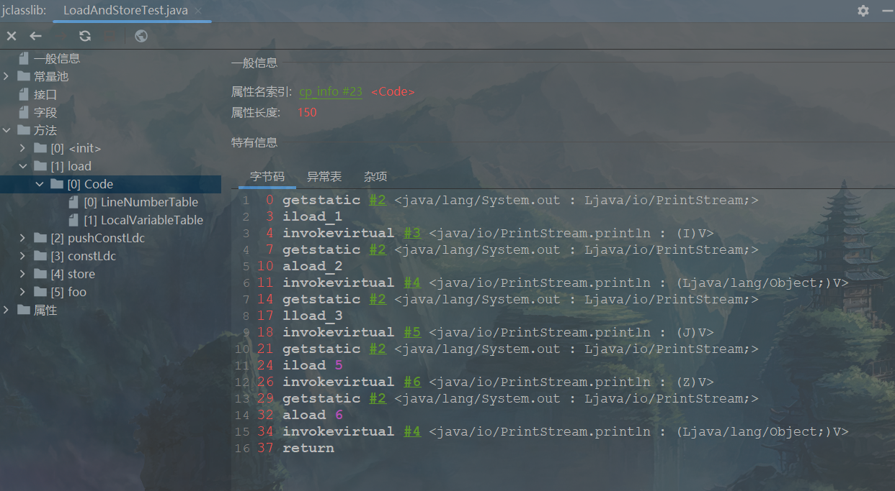

​	这段指令只需要看load相关指令即可，其他指令暂且不表。load指令作用是将局部变量表中的数据压入操作数栈，局部变量表的数据如下图所示。

​	由下图可知在0的位置存储的是this,1的位置存储num代表的值，2的位置存储obj，由于long类型占用两个槽位，所以3和4的位置存储count代表的值，5的位置存储flag表示的值，6的位置存储arr。对应的指令iload_1将1号槽位的int类型的num压入操作数栈；指令aload_2将2号槽位的引用类型的obj压入操作数栈；指令lload_3将3号和4号槽位（合为3号槽位）的long类型的count压入操作数栈；指令iload 5将5号槽位的int类型的flag压入操作数栈（前面讲过操作byte、char、short和boolean类型数据时，用int类型的指令来表示），当槽位超过3之后，需要加上操作数；指令aload 6将6号槽位的引用类型的num压入操作数栈。

<div style="text-align:center;font-weight:bold;">局部变量表数据</div>

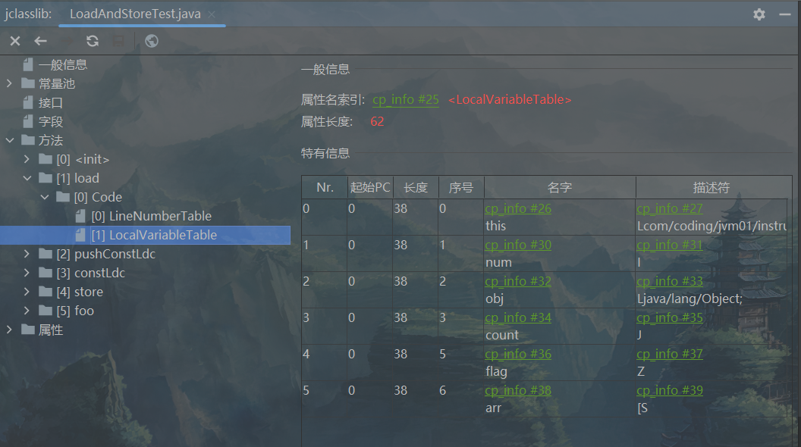

### 18.2.2 常量入栈指令

​	常量入栈指令主要负责将常量加载到操作数栈，根据常量的数据类型和入栈内容的不同，又可以分为const系列、push系列和ldc系列指令。

**1 指令const系列**

​	用于对特定的常量入栈，入栈的常量隐含在指令本身里并使用下画线连接，如下表所示，比如指令iconst_<i>,<i>的取值是从0到5，表示的含义是将i加载到操作数栈。

<div style="text-align:center;font-weight:bold;">常量入栈指令</div>

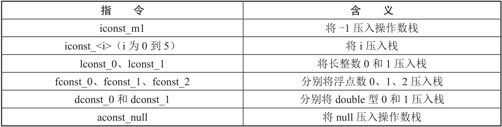

​	指令的第一个字符表示数据类型，i表示int类型，l表示long类型，f表示float类型，d表示double类型，a表示对象引用。

​	对于非特定的常量入栈，比如需要将int类型的常量128压入到操作数栈，就需要用到push指令，或者常量数值更大的话就需要用到ldc指令了。

**2 指令push系列**

​	push系列主要包括bipush和sipush。它们的区别在于接收数据类型的范围不同，bipush接收一个字节（8个比特位，即-128～127）整数作为参数，sipush接收两个字节（16个比特位，即-32768～32767）整数，它们都将参数压入栈。

**3 指令ldc系列**

​	如果常量超出上面指令的范围，可以使用万能的ldc系列指令，ldc系列指令包含ldc、ldc_w和ldc2_w。ldc接收一个字节的无符号参数，该参数指向常量池中的int、float或者String的索引，将指定的内容压入操作数栈。ldc_w指令接收两个字节的无符号参数，能支持的索引范围大于ldc。如果要入栈的元素是long或者double类型，则使用ldc2_w指令，使用方式都是类似的。

**4 常量入栈指令使用范围**

​	const、push和ldc指令的区别在于常量的使用范围不同，常量入栈指令的使用范围汇总如下表所示。

<div style="text-align:center;font-weight:bold;">常量入栈指令使用范围</div>

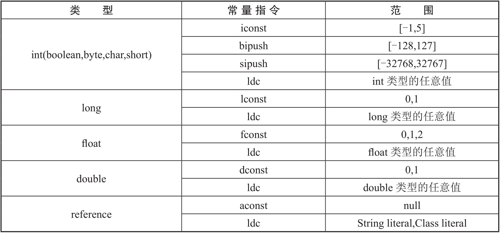

**5 案例**

​	我们使用代码来演示常量入栈指令的使用范围，如下代码所示。

<span style="color:#40E0D0;">案例1：常量入栈指令示例</span>

- 代码

```java
package com.coding.jvm01.instruct;

/**
 * 1、加载与存储指令
 */
public class LoadAndStoreTest {

    // 2、常量压栈指令
    public void pushConstLdc() {
        int i = -1;
        int a = 5;
        int b = 6;
        int c = 127;
        int d = 128;
        int e = 1234567;
        int f = 32767;
        int g = 32768;
    }
}
```

​	其对应的字节码指令如下。

<div style="text-align:center;font-weight:bold;">字节码数据</div>

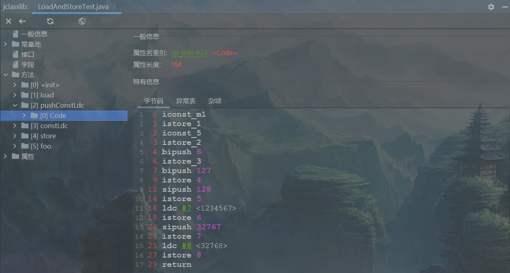

​	从字节码指令中可以看到，上面讲到的三种命令都有使用到，由于代码中定义的都是int类型，所以使用的是iconst、bipush、sipush和ldc。大家可以看到当数值小于5时，使用的是iconst命令；当大于5小于128时，使用的是bipush命令；当大于127小于32768时，使用的是sipush命令；当大于32767时，使用的是ldc命令，“#7”表示常量池中索引为7。

<div style="text-align:center;font-weight:bold;">局部变量表数据</div>

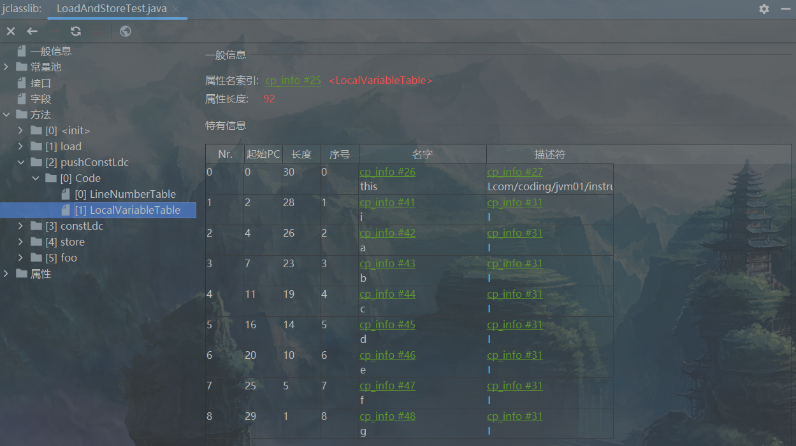

### 18.2.3 出栈装入局部变量表指令

​	出栈装入局部变量表指令用于将一个数值从操作数栈存储到局部变量表的指定位置。这类指令主要以store的形式存在，整体可以分为三类，分别是xstore（x为i、l、f、d、a）、xstore_n（x为i、l、f、d、a,n为0至3）和xastore（其中x为i、l、f、d、a、b、c、s）。xstore和xstore_n类型的指令负责对基本数据类型和引用数据类型的操作，xastore类型的指令主要负责数组的操作。

​	一般说来，出栈装入局部变量表指令需要接收一个参数，用来指明将弹出的元素放在局部变量表的第几个位置。但是，由于局部变量表前几个位置使用非常频繁，为了尽可能压缩指令大小，使用专门的istore_1指令表示将弹出的元素放置在局部变量表索引为1的位置。类似的还有istore_0、istore_2、istore_3，它们分别表示从操作数栈顶弹出一个元素，存放在局部变量表索引为0、2、3的位置。这种做法虽然增加了指令数量，但是可以大大压缩生成的字节码的体积。如果局部变量表很大，需要存储的槽位大于3，那么可以使用xstore指令，外加一个参数，用来表示需要存放的槽位位置。

​	我们使用代码来演示常量出栈指令，如下代码所示。

<span style="color:#40E0D0;">案例1：常量出栈指令示例</span>

- 代码

```java
package com.coding.jvm01.instruct;

/**
 * 1、加载与存储指令
 */
public class LoadAndStoreTest {
    // 3、出栈装入局部变量表指令
    public void store(int k, double d) {
        int m = k + 2;
        long l = 12;
        String str = "emon";
        float f = 10.0F;
        d = 10;
    }
}
```

​	其对应的字节码指令如下。

<div style="text-align:center;font-weight:bold;">字节码数据</div>

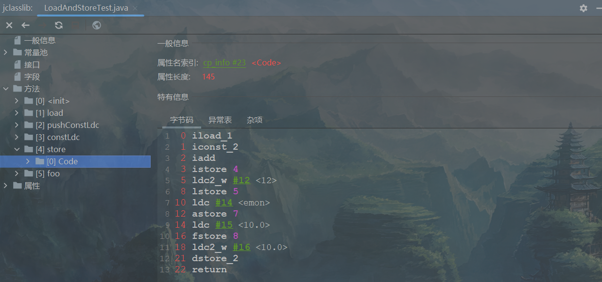

​	非静态方法定义完以后，局部变量表中已经存储了参数的值，本案例存储的是k和d的值（在方法调用过程中会有值存在），字节码执行步骤追踪如下所示。

1、iload_1把局部变量表索引为1位置的数据放入操作数栈，也就是把k的值放入操作数栈。

2、iconst_2表示把常量2放入操作数栈。

3、iadd表示把栈内的数据进行算数加的操作，此处不做详细介绍，参考18.3节。

4、istore 4表示把iadd指令的结果放入局部变量表中索引为4的位置。

5、ldc2_w#8 <12>表示把12放入操作数栈。

6、lstore 5表示把栈顶元素12放入局部变量表中索引为5的位置。

7、ldc #10<atguigu>把字符串“atguigu”放入操作数栈。

8、astore 7表示把栈顶元素字符串“atguigu”放入局部变量表中索引为7的位置。

9、ldc #11 <10.0>表示把10.0（此处的类型是float）放入操作数栈。

10、fstore 8表示把栈顶元素（10.0，此处的类型是float）放入局部变量表中索引为8的位置。

11、ldc2_w #12 <10.0>表示把10.0（此处的类型为double）放入操作数栈。

12、dstore_2表示把栈顶元素（double类型的10.0）放入局部变量表索引为2的位置。

​	最终局部变量表如下图所示。

<div style="text-align:center;font-weight:bold;">局部变量表数据</div>

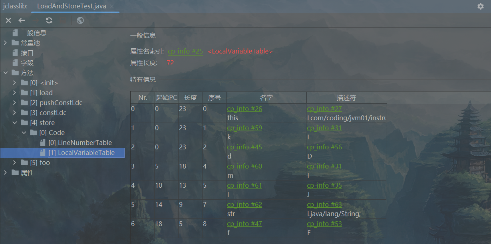

## 18.3 算术指令

​	算术指令用于对两个操作数栈上的值进行某种特定运算，并把结果重新压入操作数栈。基本运算包括加法、减法、乘法、除法、取余、取反、自增等。算术指令如下表18-6所示，每一类指令也支持多种数据类型，例如add指令就包括iadd、ladd、fadd和dadd四种，分别支持int类型、long类型、float类型和double类型。本书第4章讲解操作数栈（见4.4节）的时候就用到了iadd指令，不再赘述。

<div style="text-align:center;font-weight:bold;">算数指令汇总</div>

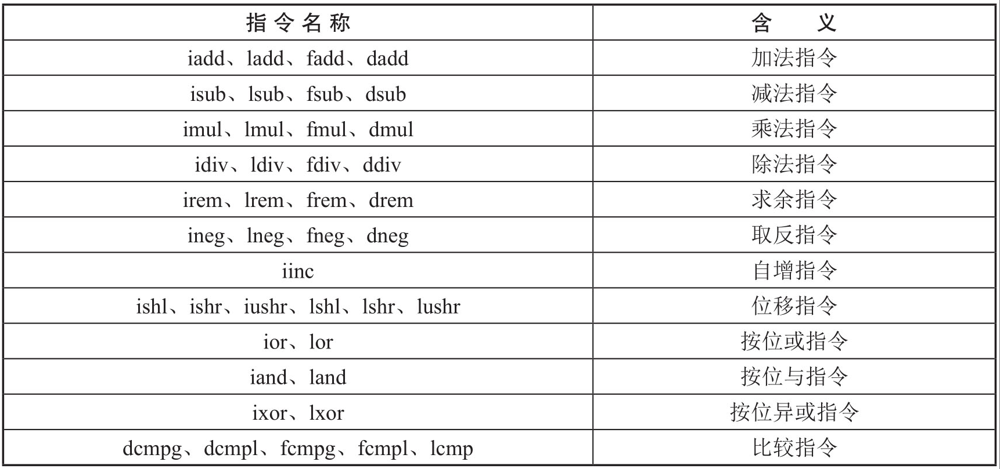

​	所有运算指令中，都没有直接支持byte、short、char和boolean类型的指令，对于这些数据的运算，都使用int类型的指令来处理。此外，在处理boolean、byte、short和char类型的数组时，也会转换为对应的int类型的字节码指令来处理。JVM中的实际数据类型与运算类型的对应关系如下表所示。

<div style="text-align:center;font-weight:bold;">JVM中的实际类型与运算类型</div>

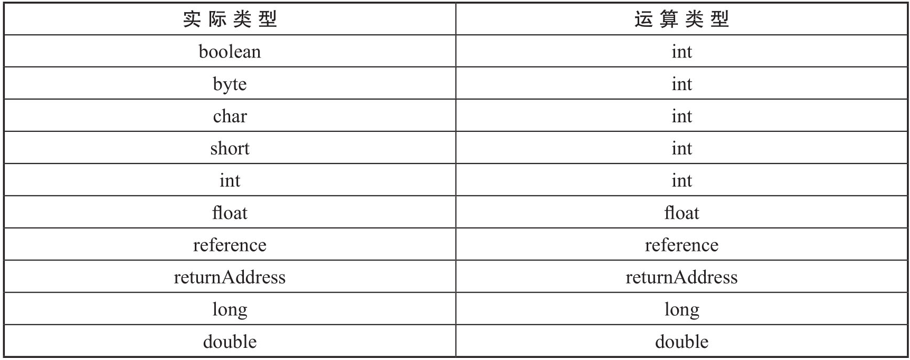

​	数据运算可能会导致溢出，例如两个很大的正整数相加，结果可能是一个负数。其实JVM规范并无明确规定过整型数据溢出的具体结果，仅规定了在处理整型数据时，只有除法指令以及求余指令中当出现除数为0时会导致虚拟机抛出异常“ArithmeticException”。当一个操作产生溢出时，将会使用有符号的无穷大表示，如果某个操作结果没有明确的数学定义的话，将会使用NaN值来表示。所有使用NaN值作为操作数的算术操作，结果都会返回NaN。在数据运算过程中，所有的运算结果都必须舍入到适当的精度，比如要求保留3位小数，那么就需要丢弃多余的数位，常见的运算模式包括向最接近数舍入模式和向零舍入模式。

1、向最接近数舍入模式

​	JVM要求在进行浮点数计算时，所有的运算结果都必须舍入到适当的精度，非精确结果必须舍入为可被表示的最接近的精确值，如果有两种可表示的形式与该值一样接近，将优先选择最低有效位为零的那种。

2、向零舍入模式

​	将浮点数转换为整数时，采用向零舍入模式，该模式将在目标数值类型中选择一个最接近但是不大于原值的数字作为最精确的舍入结果，这种模式会使小数部分被丢弃。

### 18.3.1 彻底理解i++与++i

​	大家都知道i++与++i都是对自身进行加1操作，但是它们之间的区别到底是什么呢？我们今天从字节码指令的角度来理解i++和++i，具体代码如下代码所示。

<span style="color:#40E0D0;">案例1：i++与++i示例</span>

- 代码

```java
public class ArithmeticTest {

    public void method1() {
        int i = 10;
        i++;
    }

    public void method2() {
        int i = 10;
        ++i;
    }
}
```

​	方法method1( )对应的字节码指令如下。

```
0 bipush 10
2 istore_1
3 iinc 1 by 1
6 return
```

​	方法method2( )对应的字节码指令如下。

```
0 bipush 10
2 istore_1
3 iinc 1 by 1
6 return
```

​	如果只对变量进行++i或者i++操作，可以看到字节码指令是完全一样的，所以在性能上并没有什么不同，两者完全可以替换使用。两段代码的字节码指令的含义如下。

1、bipush 10表示把常量10放入操作数栈。

2、istore_1表示从操作数栈弹出10放入局部变量表，此时操作数栈为空，局部变量表索引为1的槽位存储10（描述符索引为i）。

3、iinc 1 by 1表示对局部变量表中索引为1的槽位中的数值进行加1操作，即更改为11，这便是上面代码的所有流程。

​	再看另外一段代码，当自增运算符和其他运算符混合运算时，如下代码所示。

<span style="color:#40E0D0;">案例1：i++与++i示例</span>

- 代码

```java
public class ArithmeticTest {

    public void method3() {
        int i = 10;
        int a = i++;
        int j = 20;
        int b = ++j;
    }
}
```

​	方法method3( )对应的字节码指令如下。

```
 0 bipush 10
 2 istore_1
 3 iload_1
 4 iinc 1 by 1
 7 istore_2
 8 bipush 20
10 istore_3
11 iinc 3 by 1
14 iload_3
15 istore 4
17 return
```

​	对代码的解析如下。

1、执行bipush 10指令，此时操作数栈存放数据10。

2、执行istore_1指令，此时把数据10放入局部变量表1的位置，同时把栈中数据弹出，栈为空。

3、执行iload_1指令，此时把局部变量表中1号位置中的数据10放入操作数栈。

4、执行iinc 1 by 1指令，局部变量表中1号位置的数据加1,1号位置的数据变为11。

5、执行istore_2指令，此时把操作数栈中的10放入局部变量表2的位置，同时把栈中数据弹出，栈为空，此时局部变量表中1号位置存放的数据为11,2号位置存放的数据是10，也就是我们常说的先赋值再进行自增操作，所以此时a的值为10,i的值为11。

6、执行bipush 20指令，此时操作数栈存放数据20。

7、执行istore_3指令，此时把数据20放入局部变量表3的位置，同时把栈中数据弹出，栈为空。

8、执行iinc 3 by 1指令，局部变量表中3号位置的数据加1,3号位置的数据变为21。

9、执行iload_3指令，此时把局部变量表中3号位置中的数据21放入操作数栈。

10、执行istore_4指令，此时把操作数栈中的21放入局部变量表4的位置，同时把栈中数据弹出，栈为空，此时局部变量表中3号位置存放的数据为21,4号位置存放的数据是21，也就是我们常说的先自增再进行赋值操作，所以此时j的值为21,b的值为21。

### 18.3.2 比较指令

​	比较指令的作用是比较栈顶两个元素的大小，并将比较结果入栈。比较指令有dcmpg、dcmpl、fcmpg、fcmpl、lcmp。与前面讲解的指令类似，首字符d表示double类型，f表示float,l表示long。

​	可以发现，对于double和float类型的数字，分别有两套指令，即xcmpg和xcmpl（x取值d或f），以float为例，有fcmpg和fcmpl两个指令，它们的区别在于在数字比较时，若遇到NaN值，处理结果不同，指令dcmpl和dcmpg也是类似。指令lcmp针对long型整数，由于long型整数没有NaN值，故无须准备两套指令。

​	比如指令fcmpg和fcmpl都从栈中弹出两个操作数，并将它们做比较，设栈顶的元素为v2，栈顶顺位第2位的元素为v1，比较结果如下。

1、若v1等于v2，则压入0。

2、若v1大于v2，则压入1。

3、若v1小于v2，则压入-1。

​	两个指令的不同之处在于，如果遇到NaN值，fcmpg会压入1，而fcmpl会压入-1。dcmpg和dcmpl指令同理。

​	数值类型的数据才可以比较大小，例如byte、short、char、int、long、float、double类型的数据可以比较大小，但是boolean和引用数据类型的数据不能比较大小。

## 18.4 类型转换指令

​	类型转换指令可以将两种不同的数值类型进行相互转换。这些转换操作一般用于实现用户代码中的显式类型转换操作，或者用来处理数据类型相关指令与数据类型无法一一对应的问题。类型转换指令又分为宽化类型转换和窄化类型转换。

### 18.4.1 宽化类型转换

​	宽化类型转换简单来说就是把小范围类型向大范围类型转换，它是隐式转换，也可以理解为自动类型转换，不需要强制类型转换。

**1 转换规则**

​	JVM直接支持以下数值的宽化类型转换（Widening Numeric Conversion，小范围类型向大范围类型的安全转换）。虽然在代码中不需要强制转换，但是在class文件中依然存在转换指令，宽化转换指令包含以下指令。

- 从int类型到long、float或者double类型。对应的指令为i2l、i2f、i2d。

- 从long类型到float、double类型。对应的指令为l2f、l2d。
- 从float类型到double类型。对应的指令为f2d。
- 简化可以理解为int→long→float→double。如下代码展示了宽化类型转换。

<span style="color:#40E0D0;">案例1：宽化类型转换</span>

- 代码

```java
/**
 * 指令3、类型转换指令
 */
public class ClassCastTest {
    // 宽化类型转换，针对宽化类型转换的基本测试
    public void upCast1() {
        int i = 10;
        long l = i;
        float f = i;
        double d = i;

        float f1 = l;
        double d1 = l;
        double d2 = f1;
    }
}
```

​	方法upCast1()对应的字节码指令如下。

```
 0 bipush 10
 2 istore_1
 3 iload_1
 4 i2l
 5 lstore_2
 6 iload_1
 7 i2f
 8 fstore 4
10 iload_1
11 i2d
12 dstore 5
14 lload_2
15 l2f
16 fstore 7
18 lload_2
19 l2d
20 dstore 8
22 fload 7
24 f2d
25 dstore 10
27 return
```

​	可以看到字节码指令中包含宽化类型转换指令i2l、i2f、i2d、l2f、l2d和f2d，而且不需要在代码中进行强制类型转换。

​	除了上面讲演示的类型转换，还会经常遇到byte类型转int类型的情况。大家请注意，从byte、char和short类型到int类型，宽化类型转换实际上是没有指令存在的，如下代码演示了byte类型转换为int和long类型的情况。

<span style="color:#40E0D0;">案例1：byte类型转换为int和long类型</span>

- 代码

```java
/**
 * 指令3、类型转换指令
 */
public class ClassCastTest {
    public void upCast2() {
        byte b = 10;
        int i = b;
        long l = b;
    }
}
```

​	字节码指令如下。

```
0 bipush 10
2 istore_1
3 iload_1
4 istore_2
5 iload_1
6 i2l
7 lstore_3
8 return
```

​	从字节码指令可以看到，对于byte类型转为int，虚拟机并没有做实质性的转化处理，也就是说没有使用类型转换指令，因为JVM内部会使用int来表示byte类型数据。而将byte转为long时，使用的是i2l指令，也说明了使用int类型代替byte类型。这种处理方式有两个特点，一方面可以减少实际的数据类型，如果为short和byte都准备一套指令，那么指令的数量就会大增，而虚拟机目前的指令总数不超过256个，为了节省指令资源，将short和byte当作int处理也在情理之中；另一方面，由于<span style="color:red;font-weight:bold;">局部变量表中的slot固定为32位</span>，每个int、float、reference占用1个slot，而比int类型窄的byte或者short存入局部变量表也要占用1个slot，那么还不如直接提升为int类型，这样还能减少JVM对类型支持的数量。

**2 精度损失**

​	宽化类型转换是不会因为超过目标类型最大值而丢失信息的，例如，从int转换到long，或者从int转换到double，都不会丢失任何信息，转换前后的值是精确相等的。

​	<span style="color:red;font-weight:bold;">但是从int、long类型数值转换到float，或者long类型数值转换到double时，将可能发生精度损失</span>，可能丢失掉几个最低有效位上的值，转换后的浮点数值是根据IEEE 754最接近舍入模式所得到的正确整数值。<span style="color:red;font-weight:bold;">尽管宽化类型转换实际上是可能发生精度损失的，但是这种转换永远不会导致JVM抛出运行时异常</span>。如下代码展示了宽化类型转换精度损失的情况。

<span style="color:#40E0D0;">案例1：宽化类型转换精度损失</span>

- 代码

```java
/**
 * 指令3、类型转换指令
 */
public class ClassCastTest {
	// 举例：精度损失的问题
    @Test
    public void upCast3() {
        int i = 123123123;
        float f = i;
        System.out.println(f);
    }
}
```

​	运行结果如下。

```bash
1.2312312E8
```

​	由结果可知，虽然程序运行期间没有报异常，但是最后的结果却是1.2312312E8，也就是1.23123120乘以10的8次方，最后损失了一位精度。

### 18.4.2 窄化类型转换

​	对应宽化类型转换的隐式转换，窄化类型转换就是显示类型转换或者强制类型转换。

**1 转换规则**

​	JVM直接支持以下窄化类型转换。

- 从int类型到byte、short或者char类型。对应的指令有i2b、i2s、i2c。
- 从long类型到int类型。对应的指令有l2i。
- 从float类型到int或者long类型。对应的指令有f2i、f2l。
- 从double类型到int、long或者float类型。对应的指令有d2i、d2l、d2f。

​	简化可以理解为double→float→long→int。如下代码展示了窄化类型转换。

<span style="color:#40E0D0;">案例1：窄化类型转换</span>

- 代码

```java

/**
 * 指令3、类型转换指令
 */
public class ClassCastTest {
    // 窄化类型转换基本的使用
    public void downCast1() {
        int i = 10;
        byte b = (byte) i;
        short s = (short) i;
        char c = (char) i;

        long l = 10L;
        int i1 = (int) l;
        byte b1 = (byte) l;
    }
}
```

​	downCast1()方法对应的字节码指令如下。

```
 0 bipush 10
 2 istore_1
 3 iload_1
 4 i2b
 5 istore_2
 6 iload_1
 7 i2s
 8 istore_3
 9 iload_1
10 i2c
11 istore 4
13 ldc2_w #10 <10>
16 lstore 5
18 lload 5
20 l2i
21 istore 7
23 lload 5
25 l2i
26 i2b
27 istore 8
29 return
```

​	从方法中可以看出，窄化类型转换需要强制类型转换。在class文件中使用到了前面讲到的i2b（int类型到byte类型）、i2s（int类型到short类型）、i2c（int类型到char类型）等指令。需要注意的是当从long类型转换到byte类型时，字节码指令中使用了两个指令（25行和26行），分别是l2i和i2b，这里先将long类型转换至int类型，再从int类型转换至byte类型。

**2 精度损失**

​	窄化类型转换可能会导致转换结果具备不同的正负号、不同的数量级，因此，转换过程很可能会导致数值丢失精度。尽管数据类型窄化转换可能会发生上限溢出、下限溢出和精度损失等情况，<span style="color:red;font-weight:bold;">但是JVM规范中明确规定数值类型的窄化转换指令永远不可能导致虚拟机抛出运行时异常</span>。如下代码展示了窄化类型转换精度损失的情况。

<span style="color:#40E0D0;">案例1：窄化类型转换精度损失</span>

- 代码

```java
/**
 * 指令3、类型转换指令
 */
public class ClassCastTest {
    // 窄化类型转换的精度损失
    @Test
    public void downCast1() {
        int i = 128;
        byte b = (byte) i;
        System.out.println(b); // -128
    }
}
```

​	上面代码的运行结果如下。

```
-128
```

​	原因是int类型的128的二进制数如下。

```
0000 0000 0000 0000 0000 0000 1000 0000
```

​	当转化为byte类型时，把高位去掉，剩下的二进制数如下。

```
1000 0000
```

​	最高位是1，表明该数为负数，即-128。可知窄化转换类型会造成精度损失。

​	当将一个浮点值窄化转换为整数类型T（T限于int或long类型之一）的时候，将遵循以下转换规则。

1、如果浮点值是NaN，那转换结果就是int或long类型的0。

2、如果浮点值不是无穷大的话，浮点值使用IEEE 754的标准向零舍入模式取整，获得整数值v，如果v在目标类型T（int或long）的表示范围之内，那转换结果就是v。否则，将根据v的符号，转换为T所能表示的最大或者最小正数。

​	当将一个double类型窄化转换为float类型时，通过向最接近数舍入模式舍入一个可以使用float类型表示的数字。最后结果根据下面这3条规则判断。

1、如果转换结果的绝对值太小而无法使用float来表示，将返回float类型的正负零。

2、如果转换结果的绝对值太大而无法使用float来表示，将返回float类型的正负无穷大。

3、对于double类型的NaN值将按规定转换为float类型的NaN值。

<span style="color:#40E0D0;">案例2：窄化类型转换示例</span>

- 代码

```java
/**
 * 指令3、类型转换指令
 */
public class ClassCastTest {
    // 测试NaN和无穷大的情况
    @Test
    public void downCast2() {
        // 定义NaN值，查看转换为低精度整数类型结果
        double d1 = Double.NaN;
        int i = (int) d1;
        System.out.println(i);

        // 定义double类型正向无穷大，查看转换为低精度整数类型结果
        double d2 = Double.POSITIVE_INFINITY;
        long l = (long) d2;
        System.out.println(l);
        System.out.println(Long.MAX_VALUE);
        int j = (int) d2;
        System.out.println(j);
        System.out.println(Integer.MAX_VALUE);

        // 查看转换为低精度浮点类型结果
        float f = (float) d1;
        System.out.println(f);
        float f1 = (float) d2;
        System.out.println(f1);
    }
}
```

​	代码运行结果如下。

```
0
9223372036854775807
9223372036854775807
2147483647
2147483647
NaN
Infinity
```

​	从结果可知，当double为NaN值时，整数类型转换结果为0；但是转换为float类型时结果依然为NaN。

​	当double为正向无穷大时，整数类型转换结果为整数类型的正向最大值；但是转换为float类型时结果依然是Infinity（无穷大)。

## 18.5 对象、数组的创建与访问指令

​	Java作为一门面向对象语言，创建和访问对象是其一大特点，JVM也在字节码层面为其提供了一些指令专门用于操作类的对象。这类指令细分为创建指令、字段访问指令、数组操作指令和类型检查指令。

### 18.5.1 创建指令

​	虽然类实例和数组都是对象，但JVM对类实例和数组的创建与操作使用了不同的字节码指令。

**1 创建类实例的指令**

​	创建类实例的指令是new，它接收一个操作数，操作数为指向常量池的索引，表示要创建的类型，执行完成后，将对象的引用压入操作数栈。如下代码清单演示了创建类实例指令的使用。

<span style="color:#40E0D0;">案例1：创建类实例的指令</span>

- 代码

```java
/**
 * 指令4：对象、数组的创建与访问指令
 */
public class NewTest {

    // 1、创建指令
    public void newInstance() {
        Object obj = new Object();
        File file = new File("emon.avi");
    }
}
```

​	方法newInstance()对应的字节码指令如下。

```
0 new #2 <java/lang/Object>
3 dup
4 invokespecial #1 <java/lang/Object.<init> : ()V>
7 astore_1
8 return
```

​	字节码指令含义如下。

1、new #2 <java/lang/Object>指令：创建一个对象并且将对象地址（比如为0x1234）放入操作数栈。

2、dup指令：复制一份栈顶的数据（此时为0x1234）继续放入操作数栈，此时操作数栈中有两条一样的地址。

3、invokespecial #1 <java/lang/Object.<init>>指令：调用Object的构造方法，并且弹出栈顶元素，此时操作数栈中还有一份0x1234数据。

4、astore_1指令：把操作数栈中的数据放入局部变量表中索引为1的位置。

​	new语句的三个作用分别是在内存中<span style="color:#FF1493;font-weight:bold;">开辟内存空间</span>，<span style="color:#FF1493;font-weight:bold;">创建对象</span>和<span style="color:#FF1493;font-weight:bold;">将对象赋给一个局部变量</span>。

**2 创建数组的指令**

​	创建数组的指令包含newarray、anewarray和multianewarray。newarray负责创建基本类型数组，anewarray负责创建引用类型数组，multianewarray负责创建多维数组。

​	上述创建指令可以用于创建数组，由于数组在Java中广泛使用，这些指令的使用频率也非常高。如下代码演示了创建数组使用到的字节码指令。

<span style="color:#40E0D0;">案例1：创建数组指令</span>

```java
/**
 * 指令4：对象、数组的创建与访问指令
 */
public class NewTest {

    public void newArray() {
        // 创建int数组
        int[] intArray = new int[10];
        // 创建引用类型数组
        Object[] objArray = new Object[10];
        // 创建二位数组
        int[][] mintArray = new int[10][10];
        // 创建没有初始化的二维数组
        String[][] strArray = new String[10][];
    }
}
```

​	newArray( )方法对应的字节码指令如下。

```
 0 bipush 10
 2 newarray 10 (int)
 4 astore_1
 5 bipush 10
 7 anewarray #2 <java/lang/Object>
10 astore_2
11 bipush 10
13 bipush 10
15 multianewarray #6 <[[I> dim 2
19 astore_3
20 bipush 10
22 anewarray #7 <[Ljava/lang/String;>
25 astore 4
27 return
```

​	从字节码指令中可以看到创建基本类型数组intArray使用的指令是newarray；创建引用类型数组objArray使用的指令是anewarray；创建多维数组intmutiArray使用的指令是multianewarray，但是当多维数组intArray1只有一个数组有长度时，使用的指令是anewarray，把其作为引用类型数组创建。

### 18.5.2 字段访问指令

​	对象创建后，就可以通过对象访问指令获取对象实例或数组实例中的字段或者数组元素。访问类字段（static字段，或者称为类变量）的指令包括getstatic和putstatic。访问类实例字段（非static字段，或者称为实例变量）的指令包括getfield和putfield。

​	以getstatic指令为例，它含有一个操作数，操作数指明了一个常量池中的索引值，该索引处的值为常量池的字段符号引用。getstatic指令的作用就是获取字段符号引用指定的对象或者值，并将其压入操作数栈，如下代码所示。

<span style="color:#40E0D0;">案例1：getstatic指令示例</span>

- 代码

```java
/**
 * 指令4：对象、数组的创建与访问指令
 */
public class NewTest {
    // 2、字段访问指令
    public void sayHello() {
        System.out.println("hello");
    }
}
```

​	这是一段很简单的代码，在sayHello( )方法中输出"hello"字符串。对应的字节码指令如下。

```
0 getstatic #8 <java/lang/System.out : Ljava/io/PrintStream;>
3 ldc #9 <hello>
5 invokevirtual #10 <java/io/PrintStream.println : (Ljava/lang/String;)V>
8 return
```

​	字节码常量池中的内容如下所示。

```
   #8 = Fieldref           #59.#60        // java/lang/System.out:Ljava/io/PrintStream;
   #9 = String             #61            // hello
  #10 = Methodref          #62.#63        // java/io/PrintStream.println:(Ljava/lang/String;)V
  #59 = Class              #72            // java/lang/System
  #60 = NameAndType        #73:#74        // out:Ljava/io/PrintStream;
  #61 = Utf8               hello
  #62 = Class              #75            // java/io/PrintStream
  #63 = NameAndType        #76:#71        // println:(Ljava/lang/String;)V
  #71 = Utf8               (Ljava/lang/String;)V
  #72 = Utf8               java/lang/System
  #73 = Utf8               out
  #74 = Utf8               Ljava/io/PrintStream;
  #75 = Utf8               java/io/PrintStream
  #76 = Utf8               println
```

​	字节码执行步骤追踪。

​	第一步：首先会由“getstatic”指令将常量池中第8号常量放入操作数栈，我们追踪第8号常量指向的位置，从常量池结构中可以看到，8指向59和60,59指向72,60指向73和74。通过8指向59,59指向72可以确定该常量在System类中使用，通过8指向60，60指向73和74确定其类型是PrintStream类型，常量值为“out”，最终将静态常量“out”压入操作数栈的栈顶。

​	第二步：“ldc”指令将常量中第9号常量入栈，第9号常量指向61号的“Hello“字符串，所以将“Hello”压入操作数栈的栈顶。

​	第三步：“invokevirtual”指令将操作数栈中的数据弹出，执行println()方法。

### 18.5.3 数组操作指令

​	数组操作指令主要包含xaload和xastore指令。xaload指令表示把一个数组元素加载到操作数栈的指令。根据不同的类型数组操作指令又分为baload、caload、saload、iaload、laload、faload、daload和aaload。指令前面第一个字符表示指令对应的数据类型，比如saload和caload分别表示操作short类型数组和char类型数组。指令xaload在执行时，要求操作数中栈顶元素为数组索引i，栈顶顺位第2个元素为数组引用a，该指令会弹岀栈顶这两个元素，并将a[i]重新压入栈。

​	xastore指令表示将一个操作数栈的值存储到数组元素中。根据不同类型数组操作指令又分为bastore、castore、sastore、iastore、lastore、fastore、dastore和aastore。指令前面第一个字符表示指令对应的数据类型，比如iastore指令表示给一个int数组的给定索引赋值。在iastore执行前，操作数栈顶需要准备3个元素，分别是赋值给数组的值、索引（数组角标）、数组引用，iastore会弹出这3个值，并将值赋给数组中指定索引的位置。

​	不同类型数组和数组操作指令的对应关系如下表所示。

<div style="text-align:center;font-weight:bold;">数组操作指令</div>

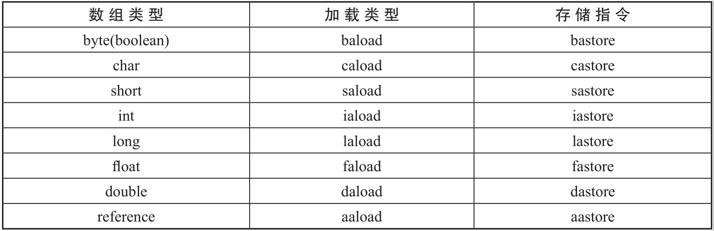

​	此外，获取数组长度的指令为arraylength，该指令会弹出栈顶的数组元素，获取数组的长度，将长度压入栈。如下代码展示了数组操作指令。

<span style="color:#40E0D0;">案例1：数组操作指令</span>

- 代码

```java
/**
 * 指令4：对象、数组的创建与访问指令
 */
public class NewTest {
    // 3、数组操作指令
    public void setArray() {
        int[] intArray = new int[10];
        intArray[3] = 10;
        System.out.println(intArray[3]);
    }
}
```

​	setArray( )方法对应的字节码指令如下。

```
 0 bipush 10
 2 newarray 10 (int)
 4 astore_1
 5 aload_1
 6 iconst_3
 7 bipush 10
 9 iastore
10 getstatic #8 <java/lang/System.out : Ljava/io/PrintStream;>
13 aload_1
14 iconst_3
15 iaload
16 invokevirtual #14 <java/io/PrintStream.println : (I)V>
19 return
```

​	bipush 10指令把常量10放入操作数栈。newarray 10(int)指令负责在堆中生成一个数组对象并且把数组地址（假如此时数组地址为0x2233）放入操作数栈，指令后面紧跟的10表示数组中元素的类型为int，注意区分bipush 10，这个10表示数组的长度，此时需要把数组的长度出栈，如下图所示，图中没有展示常量10。

<div style="text-align:center;font-weight:bold;">bipush和newarray字节码指令操作</div>


​	astore_1指令把栈顶数据弹出并且放入到局部变量表中索引为1的槽位；aload_1指令把局部变量表中索引为1的槽位中的数据放入操作数栈；iconst_3指令把常量3放入操作数栈；bipush 10指令把常量10放入操作数栈，如下图所示。

<div style="text-align:center;font-weight:bold;">前6条字节码指令操作</div>

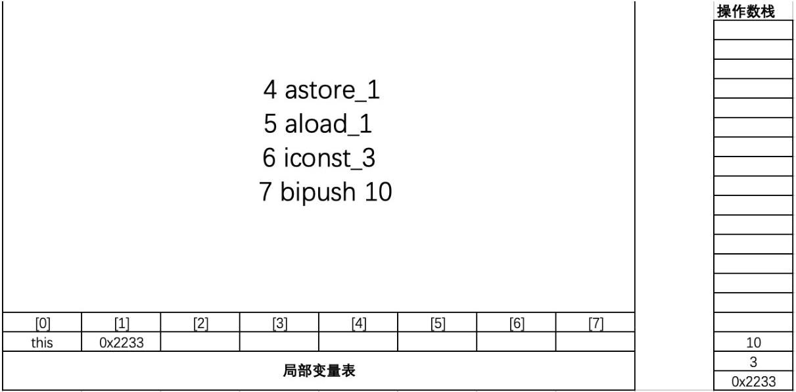

​	iastore指令把常量10（赋值元素）、常量3（数组角标）以及数组地址(0x2233)弹出，给数组元素赋值，如下图所示。

<div style="text-align:center;font-weight:bold;">iastore字节码指令操作</div>


​	getstatic #2 <java/lang/System.out>指令把常量“out”放入操作数栈；aload_1把局部变量表中1号槽位的值放入操作数栈；iconst_3把常量3放入操作数栈，如下图所示。

<div style="text-align:center;font-weight:bold;">getstatic,aload以及iconst字节码指令操作</div>


​	iaload指令把栈顶元素为数组的索引3弹出，继续弹出数组引用(0x2233)，继而找到数组角标为3的元素，即10，重新把常量10压入栈，如下图所示。

<div style="text-align:center;font-weight:bold;">iaload字节码指令操作</div>

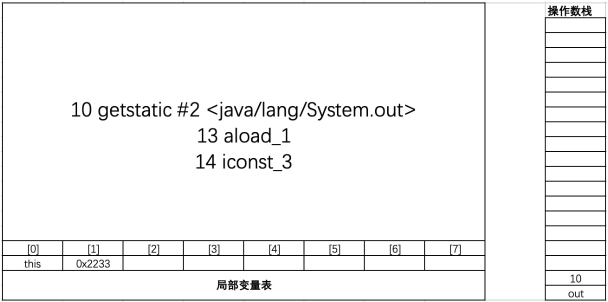

​	至此就完成了数组的赋值和取值操作，最后输出结果即可。

### 18.5.4 类型检查指令

​	检查类实例或数组类型的指令主要包括instanceof和checkcast。指令instanceof用来判断给定对象是否为某一个类的实例，它会将判断结果压入操作数栈。指令checkcast用于检查类型强制转换是否可以进行。这两个指令很相似，区别在于checkcast指令如果可以强制类型转换，那么checkcast指令不会改变操作数栈，否则它会抛出“ClassCastException”异常，instanceof指令会将判断结果压入操作数栈，如果某对象属于某一个类的实例，将1压入操作数栈，否则将0压入操作数栈。如下代码演示了类型检查指令的使用。

<span style="color:#40E0D0;">案例1：类型检查指令</span>

- 代码

```java
/**
 * 指令4：对象、数组的创建与访问指令
 */
public class NewTest {
	// 4、类型检查指令
    public String checkCast(Object obj) {
        if (obj instanceof String) {
            return (String) obj;
        } else {
            return null;
        }
    }
}
```

​	字节码指令如下所示。

```
 0 aload_1
 1 instanceof #17 <java/lang/String>
 4 ifeq 12 (+8)
 7 aload_1
 8 checkcast #17 <java/lang/String>
11 areturn
12 aconst_null
13 areturn
```

​	对代码的解析如下。

1、aload_1表示把局部变量表中索引为1的位置中的数据压入操作数栈，即将obj压入操作数栈。

2、instanceof #17<java/lang/String>表示将操作数栈中栈顶元素obj弹出，判断obj类型是否为java.lang.String，如果是，将1压入操作数栈；否则将0压入操作数栈。

3、ifeq 12(+8)比较栈顶元素是否等于0，如果不等于0，进行下一步，否则跳转到指令行号为12的指令。括号中的+8表示当前指令的行号加8之后正好为跳转的指令行号，此时会有出栈的操作。

4、aload_1表示把局部变量表中索引为1的位置中的数据压入操作数栈，即将obj压入操作数栈。

5、checkcast #17 <java/lang/String>指令判断obj是否可以转换为java.lang.String，如果不可以转换，抛出“ClassCastException”异常；如果可以转换，该指令也不会影响操作数栈。

## 18.6 方法调用与返回指令

### 18.6.1 方法调用指令

​	方法调用指令包括invokevirtual、invokeinterface、invokespecial、invokestatic和invokedynamic，上述5条指令含义如下表所示。

<div style="text-align:center;font-weight:bold;">方法调用指令集</div>

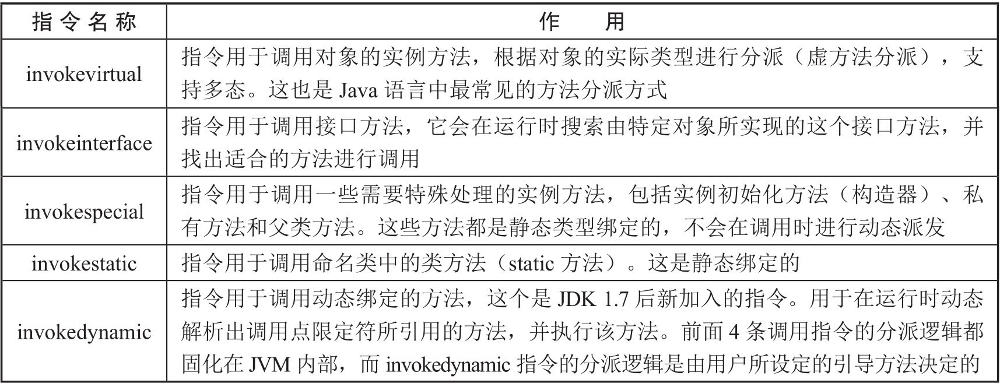

​	如下代码展示了方法调用指令的使用。

<span style="color:#40E0D0;">案例1：方法调用指令</span>

```java
/*
指令5：方法调用与返回指令
 */
public class MethodInvokeReturnTest {

    // 方法调用指令：invokespecial：静态分派
    public void invoke1() {
        // 情况1：类实例构造器方法：<init>()
        Date date = new Date();
        Thread t1 = new Thread();
        // 情况2：父类的方法
        super.toString();
        // 情况3：私有方法
        methodPrivate();
    }
}
```

​	对应的字节码指令如下。

```
 0 new #2 <java/util/Date>
 3 dup
 4 invokespecial #3 <java/util/Date.<init> : ()V>
 7 astore_1
 8 new #4 <java/lang/Thread>
11 dup
12 invokespecial #5 <java/lang/Thread.<init> : ()V>
15 astore_2
16 aload_0
17 invokespecial #6 <java/lang/Object.toString : ()Ljava/lang/String;>
20 pop
21 aload_0
22 invokespecial #7 <com/coding/jvm01/instruct/MethodInvokeReturnTest.methodPrivate : ()V>
25 return
```

​	可以看到invokespecial指令调用了Date的构造方法、Thread对象的构造方法，以及该类的父类方法以及私有方法。其他的指令就不再举例说明了，知道其含义即可。关于方法调用指令在本书4.7.2节已经介绍过了，此处不再赘述。

### 18.6.2 方法返回指令

​	方法调用结束前，需要返回方法调用结果。方法返回指令是根据返回值的类型区分的，包括ireturn（当返回值是boolean、byte、char、short和int类型时使用）、lreturn、freturn、dreturn和areturn，另外还有一条return指令供声明返回值为void的方法、实例初始化方法以及类和接口的类初始化方法使用。方法返回指令如下表所示。

<div style="text-align:center;font-weight:bold;">方法返回指令</div>

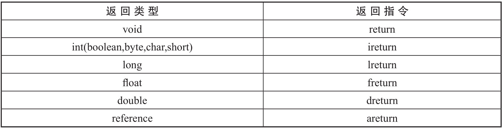

​	例如，ireturn指令表示将当前方法操作数栈中的栈顶元素弹出，并将这个元素压入调用者方法的操作数栈中，因为调用者非常关心方法的返回值，所有在当前方法操作数栈中的其他元素都会被丢弃。如果当前返回的是synchronized()方法，那么还会执行一个隐含的monitorexit指令，退出临界区，在18.10节我们会介绍同步控制指令。最后，会丢弃当前方法的整个栈帧，恢复调用者的栈帧，并将控制权转交给调用者。如下代码演示了方法返回指令的使用。

<span style="color:#40E0D0;">案例1：方法返回指令</span>

- 代码

```java
/*
指令5：方法调用与返回指令
 */
public class MethodInvokeReturnTest {
    
    // 方法的返回指令
    public int returnInt() {
        int i = 500;
        return i;
    }
}
```

​	对应的字节码指令如下。

```
0 sipush 500
3 istore_1
4 iload_1
5 ireturn
```

​	第一步通过sipush 500指令将常量500放入操作数栈；第二步通过istore指令把栈顶元素弹出，放入局部变量表中槽位为1的位置；第三步通过iload_1指令把局部变量1号槽位的元素放入操作数栈；最后通过ireturn指令弹出栈顶元素给到调用者方法的操作数栈。其他指令同理，不再举例。

## 18.7 操作数栈管理指令

​	JVM提供的操作数栈管理指令，可以直接作用于操作数栈，和数据结构中的栈操作类似，都会有入栈和出栈的操作，这类指令如下表所示。

<div style="text-align:center;font-weight:bold;">操作数栈指令集</div>


​	pop指令表示将栈顶的1个32位的元素（比如int类型）出栈，即该元素占用一个slot即可。pop2指令表示将栈顶的1个64位的元素（比如long、double类型）或2个32位的元素出栈，即弹出操作数栈栈顶的2个slot。

​	dup和dup2表示复制栈顶数据并压入栈顶，dup后面的数字表示要复制的slot个数。dup开头的指令用于复制1个32位元素数据，即复制1个slot中的元素。dup2开头的指令用于复制1个64位或2个32位元素数据，即复制2个slot中的元素。

​	带_x的指令是复制栈顶数据并插入栈顶以下的某个位置。4个指令分别是dup_x1、dup_x2、dup2_x1、dup2_x2。

1、dup_x1表示复制1个栈顶元素，然后将复制的值插入原来栈顶第2个slot下面。假设原来操作数栈中的元素从栈顶向下顺序是v1,v2，…；执行dup_x1指令之后的元素从栈顶向下顺序为v1,v2,v1（复制值），…，如下图所示。

<div style="text-align:center;font-weight:bold;">dup_x1字节码指令操作</div>

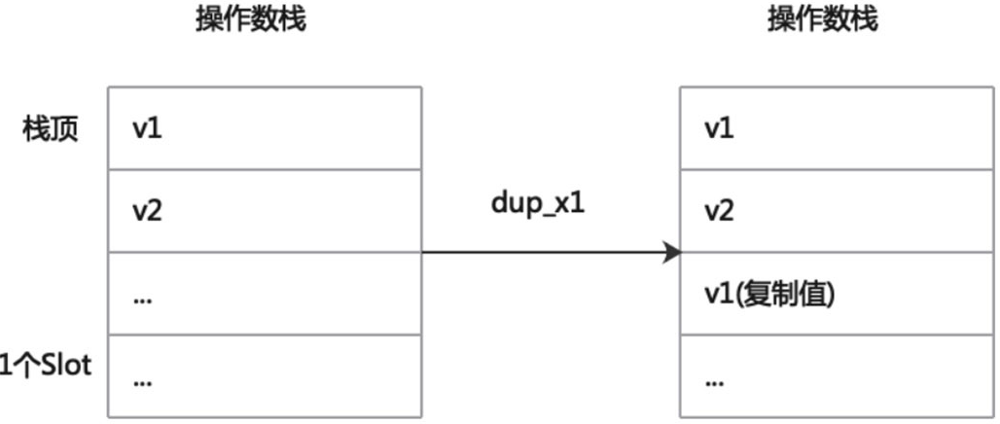

2、dup_x2表示复制1个栈顶32位元素数据，然后将复制的值插入原来栈顶第3个slot下面。

①假设原来操作数栈中的元素从栈顶向下顺序是v1,v2,v3，…，且所有元素都是32位；执行dup_x2指令之后的元素从栈顶向下顺序为v1,v2,v3,v1（复制值），…，如下图所示。

<div style="text-align:center;font-weight:bold;">dup_x2字节码指令操作</div>

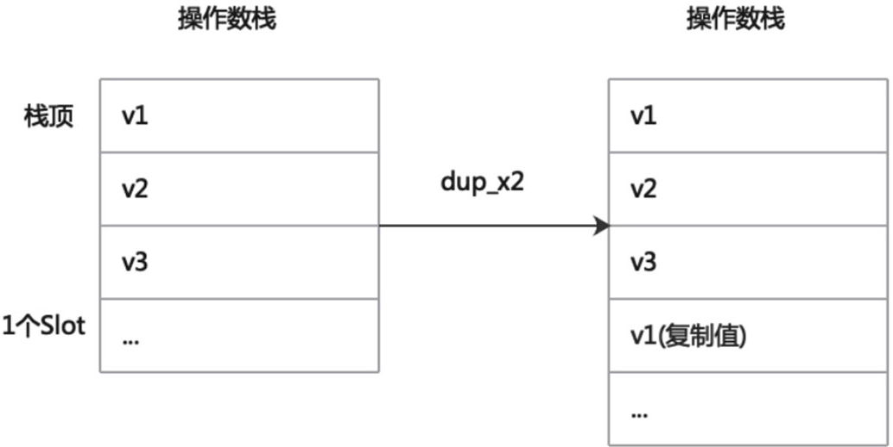

②假设原来操作数栈中的元素顺序是v1,v2，…，其中v1占用1个slot,v2占用2个slot；那么执行dup_x2指令之后的元素从栈顶向下顺序为v1,v2,v1（复制值），…，也就是复制到第3个slot下面，如下图所示。

<div style="text-align:center;font-weight:bold;">dup_x2字节码指令操作</div>

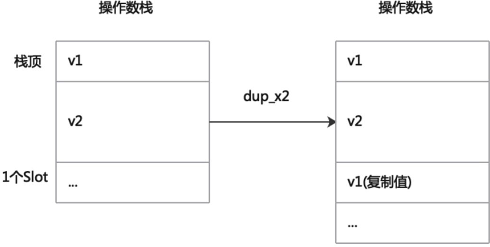

3、dup2_x1表示复制1个64位数据或2个32位数据的元素（从栈顶开始计数），然后将复制的值插入原来栈顶第3个slot下面。

①假设原来操作数栈中的元素顺序是v1,v2,v3，…，且所有元素都是32位；执行dup2_x1指令之后的元素顺序可能为v1,v2,v3,v1（复制值），v2（复制值），…，如下图所示。

<div style="text-align:center;font-weight:bold;">dup2_x1字节码指令操作</div>


②假设原来操作数栈中的元素顺序是v1,v2，…，其中v1占用2个slot,v2占用1个slot；那么执行dup2_x1指令之后的元素从栈顶向下顺序为v1,v2,v1（复制值），…，即复制到第3个slot下面，如下图所示。

<div style="text-align:center;font-weight:bold;">dup2_x1字节码指令操作</div>


2、dup2_x2表示复制复制1个64位数据或2个32位数据的元素（从栈顶开始计数），然后将复制的值插入原来栈顶第4个slot下面，该类型包含的情况较多，分类如下。

①假设原来操作数栈中的元素从栈顶向下顺序是v1,v2,v3,v4，…，且所有元素都是32位；执行dup2_x2指令之后的元素从栈顶向下顺序为v1,v2,v3,v4,v1（复制值），v2（复制值），…，如下图所示。

<div style="text-align:center;font-weight:bold;">dup2_x2字节码指令操作</div>

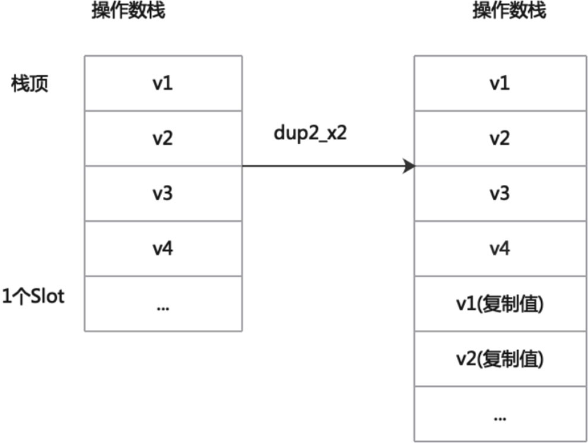

②假设原来操作数栈中的元素从栈顶向下顺序是v1,v2,v3，…，其中v1占用2个slot，其它元素占用1个slot；执行dup2_x2指令之后的元素从栈顶向下顺序为v1,v2,v3,v1（复制值），…，如下图所示。

<div style="text-align:center;font-weight:bold;">dup2_x2字节码指令操作</div>

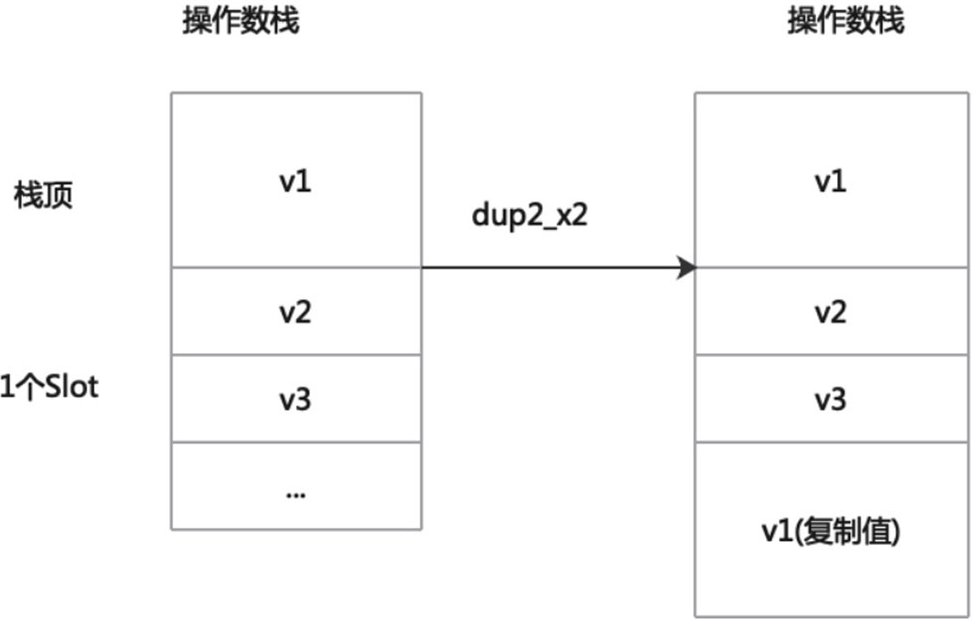

③假设原来操作数栈中的元素从栈顶向下顺序是v1,v2,v3，…，其中v1和v2占用1个slot,v3元素占用2个slot；执行dup2_x2指令之后的元素从栈顶向下顺序为v1,v2,v3,v1（复制值），v2（复制值），…，如下图所示。

<div style="text-align:center;font-weight:bold;">dup2_x2字节码指令操作</div>

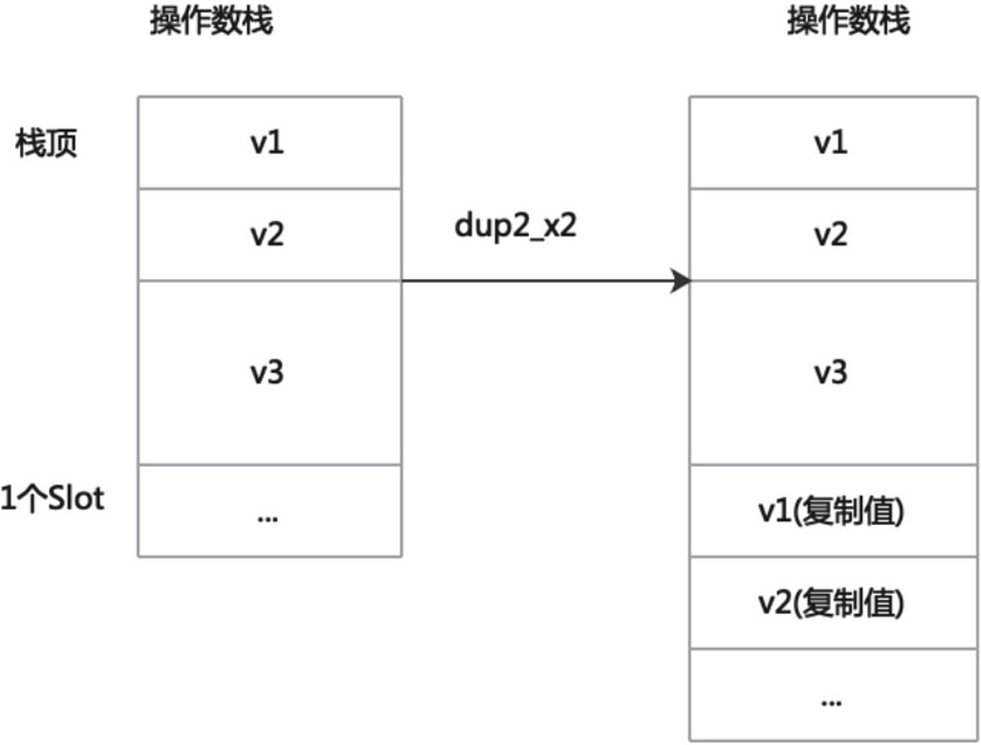

④假设原来操作数栈中的从栈顶向下元素顺序是v1,v2，…，其中v1和v2占用2个slot；执行dup2_x2指令之后的从栈顶向下元素顺序为v1,v2,v1（复制值），…，如下图所示。

<div style="text-align:center;font-weight:bold;">dup2_x2字节码指令操作</div>

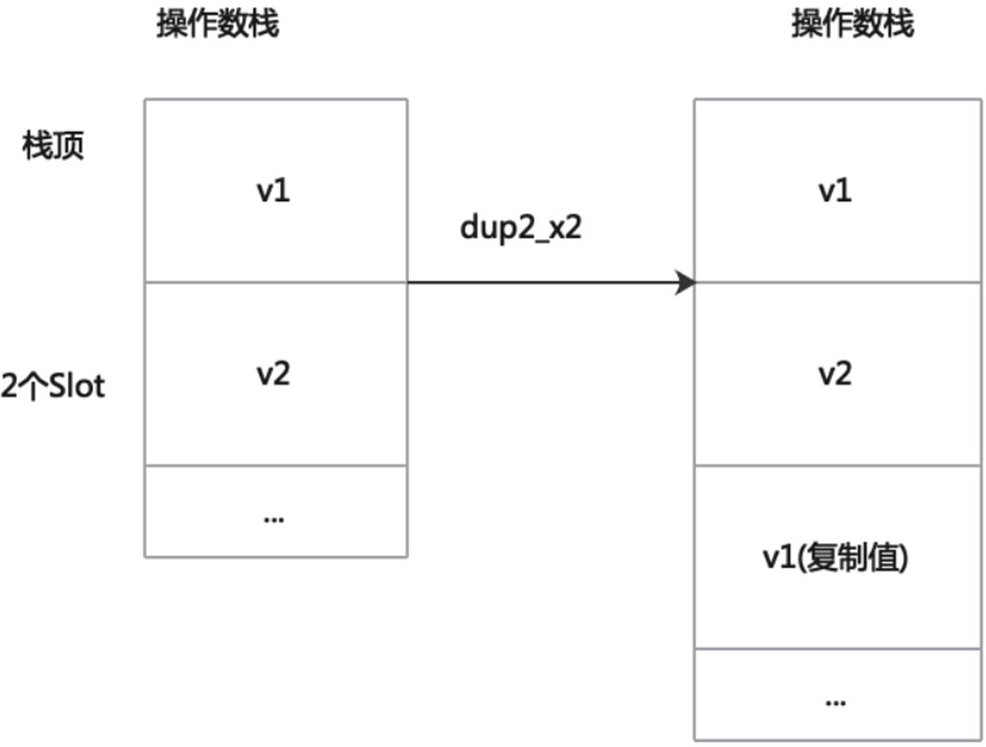

<span style="color:#40E0D0;">案例1：操作数栈管理指令。</span>

- 代码

```java
package com.coding.jvm01.instruct;

/**
 * 指令6：操作数栈管理指令
 */
public class StackOperateTest {
    private long index = 0;

    public long nextIndex() {
        return index++;
    }
}
```

​	对应的字节码指令如下。

```
 0 aload_0
 1 dup
 2 getfield #2 <com/coding/jvm01/instruct/StackOperateTest.index : J>
 5 dup2_x1
 6 lconst_1
 7 ladd
 8 putfield #2 <com/coding/jvm01/instruct/StackOperateTest.index : J>
11 lreturn
```

​	aload_0指令把局部变量表0号位置的this（当前对象）地址（比如地址为0x1212）放入操作数栈。dup指令把this对象地址复制一份放入操作数栈，如下图所示。

<div style="text-align:center;font-weight:bold;">aload_0与dup字节码指令操作</div>

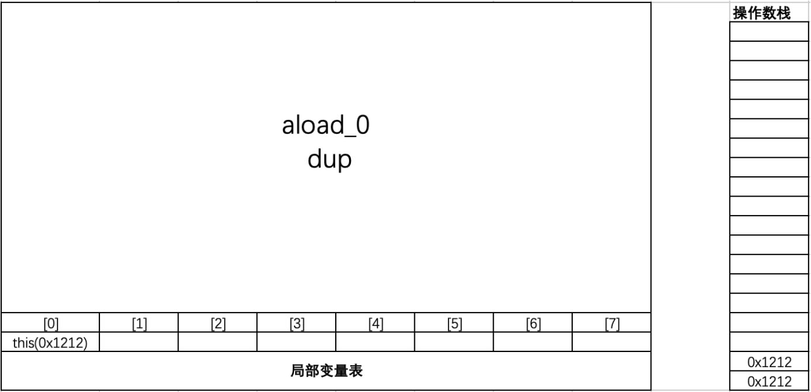

​	getfield #2指令弹出this对象，并且把变量index的值0放入操作数栈，该值是long类型，占用两个slot，如下图所示。

<div style="text-align:center;font-weight:bold;">getfield #2指令操作</div>

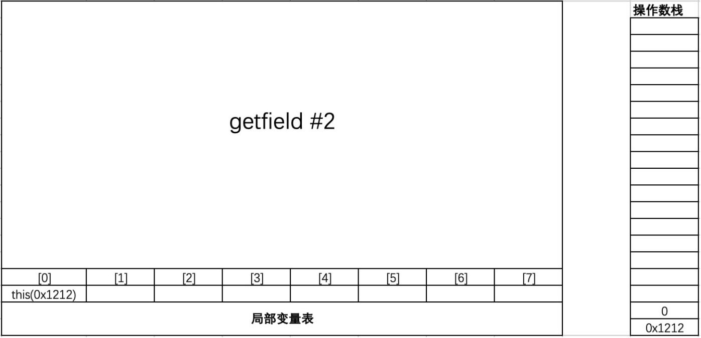

​	dup2_x1复制栈顶元素放入第3个slot下面，如下图所示。

<div style="text-align:center;font-weight:bold;">dup2_x1指令操作</div>

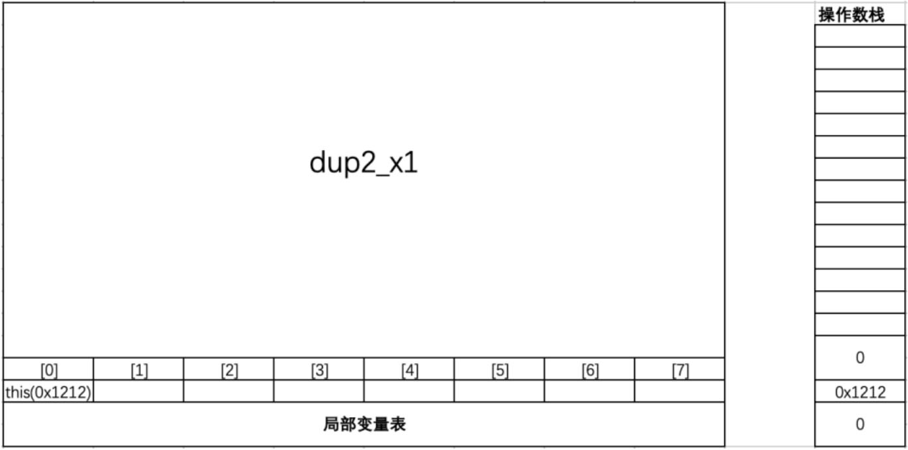

​	lconst_1指令把常量1放入操作数栈，如下图所示。

<div style="text-align:center;font-weight:bold;">lconst_1字节码指令操作</div>

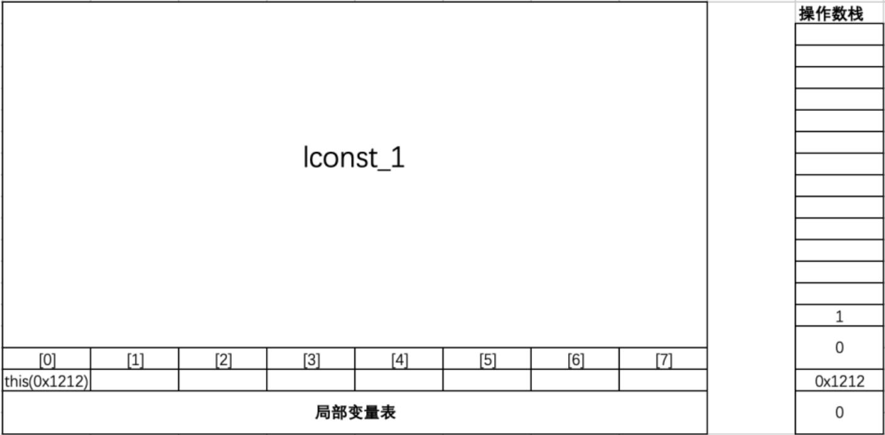

​	ladd指令把栈顶两个弹出操作数栈，并且相加之后再放入操作数栈，如下图所示。

<div style="text-align:center;font-weight:bold;">ladd指令操作</div>

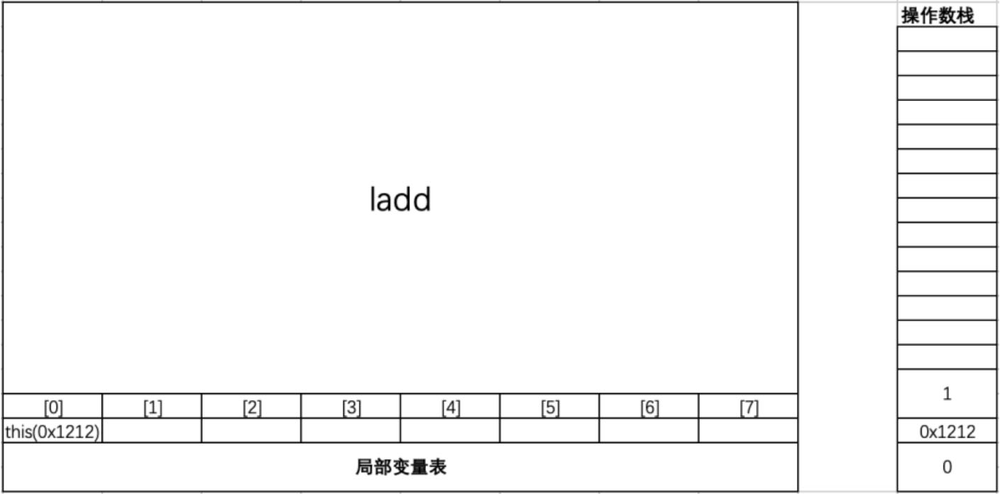

​	putfield #2指令，给当前对象的字段赋值，即将栈顶元素1赋值给当前对象中的index字段。此时当前对象地址和元素1弹出操作数栈，如下图所示。

<div style="text-align:center;font-weight:bold;">putfield #2指令操作</div>

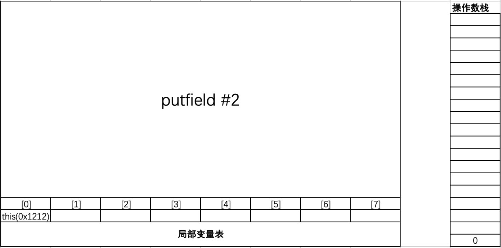

## 18.8 控制转移指令

​	程序的执行流程一般都会包含条件跳转语句，相应的JVM提供了大量字节码指令用于实现程序的条件跳转，这些字节码指令我们称为控制转移指令，用于让程序有条件或者无条件地跳转到指定指令处。这些指令大体上可以分为比较指令、条件跳转指令、比较条件跳转指令、多条件分支跳转指令和无条件跳转指令等。比较指令已经在18.3节中详细介绍过了，此处不再赘述，下面讲述其他控制转移指令。

### 18.8.1 条件跳转指令

​	条件跳转指令通常和比较指令结合使用。在条件跳转指令执行前，一般可以先用比较指令进行栈顶元素的准备，然后进行条件跳转。条件跳转指令的格式为if_<condition>，以“if_”开头，<condition>的值包括eq（等于）、ne（不等于）、lt（小于）、le（小于或等于）、gt（大于）和ge（大于或等于），这些指令的意思都是弹出栈顶元素，然后和0比较，当满足给定的条件时则跳转到给定位置。此外还有两条指令用于判断是否为空，分别是ifnull和ifnonnull，条件跳转指令详细说明如下表所示。

<div style="text-align:center;font-weight:bold;">条件跳转指令集</div>

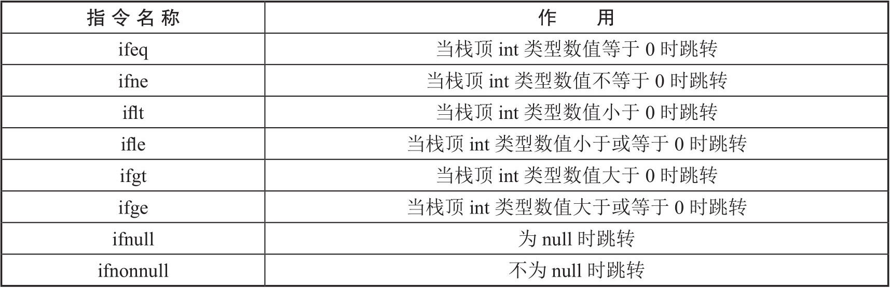

​	与前面运算规则一致，对于boolean、byte、char、short类型的条件分支比较操作，都是使用int类型的比较指令完成。对于long、float、double类型的条件分支比较操作，则会先执行相应类型的比较运算指令，运算指令会返回一个整型值到操作数栈中，随后再执行int类型的条件分支比较操作来完成整个分支跳转。由于各类型的比较最终都会转为int类型的比较操作，所以JVM提供的int类型的条件分支指令是最为丰富和强大的。如下码演示了条件跳转指令的使用。

<span style="color:#40E0D0;">案例1：条件跳转指令</span>

- 代码

```java
package com.coding.jvm01.instruct;

/**
 * 指令7：控制转移指令
 */
public class IfSwitchGotoTest {

    // 1、条件跳转指令
    public void compare1() {
        int a = 0;
        if (a != 0) {
            a = 10;
        } else {
            a = 20;
        }
    }
}
```

​	对应的字节码指令如下。

```
 0 iconst_0
 1 istore_1
 2 iload_1
 3 ifeq 12 (+9)
 6 bipush 10
 8 istore_1
 9 goto 15 (+6)
12 bipush 20
14 istore_1
15 return
```

​	字节码指令的执行流程如下。

1、iconst表示把常量0放入操作数栈；istore出栈压入局部变量表中索引为1的位置，这两条指令相当于代码int a = 0;的含义。

2、iload把局部变量表索引为1的数据压到操作数栈中，此时操作数栈栈顶的元素是0。

3、ifeq 12(+9)比较栈顶元素是否等于0，如果不等于0，则进行下一步。否则跳转到指令行号为12的指令。括号中的+9表示当前指令的行号加9之后正好为跳转的指令行号，此时会有出栈的操作。

4、bipush指令将10压入操作数栈，此时操作数栈中的元素为10。

5、istore_1出栈压入局部变量表中为1的位置，此时局部变量表中有2个元素，索引为0的位置存放this，索引为1的位置存放10。

6、goto 15(+6)跳转到指令行号为15的指令直接返回。

​	后面的操作是当第3步判断等于0时执行的，bipush 20，将20压入操作数栈，此时操作数栈中的元素为20;istore_1表示出栈压入局部变量表中为1的位置，此时局部变量表中有2个元素，索引为0的位置存放this，索引为1的位置存放20。其他的指令就不再举例说明了，知道其含义即可。

### 18.8.2 比较条件跳转指令

​	比较条件跳转指令类似于比较指令和条件跳转指令的结合体，它将比较和跳转两个步骤合二为一。这类指令的格式可分为if_icmp<condition>和if_acmp<condition>，以“if_”开头，紧跟着第一个字母表示对应的数据类型，比如字符“i”开头的指令针对int型整数操作（也包括short和byte类型），以字符“a”开头的指令表示对象引用的比较。<condition>的值包括eq（等于）、ne（不等于），lt（小于）、le（小于或等于）、gt（大于）和ge（大于或等于）。

​	if_icmp<condition>类型的指令细化为具体指令包括if_icmpeq、if_icmpne、if_icmplt、if_icmple、if_icmpgt和if_icmpge。if_acmp<condition>类型的指令细化为具体指令包括if_acmpeq和if_acmpne。

​	<span style="color:#FF1493;font-weight:bold;">这些指令都接收两个字节的操作数作为参数，用于计算跳转到新的指令地址执行</span>。指令执行时，弹出栈顶两个元素进行比较，如果比较结果成立，则跳转到新的指令地址处继续执行；否则在该指令之后的指令地址处继续执行，注意比较结果没有任何数据入栈。关于各个指令的详细说明如下表所示。

<div style="text-align:center;font-weight:bold;">比较条件跳转指令集</div>

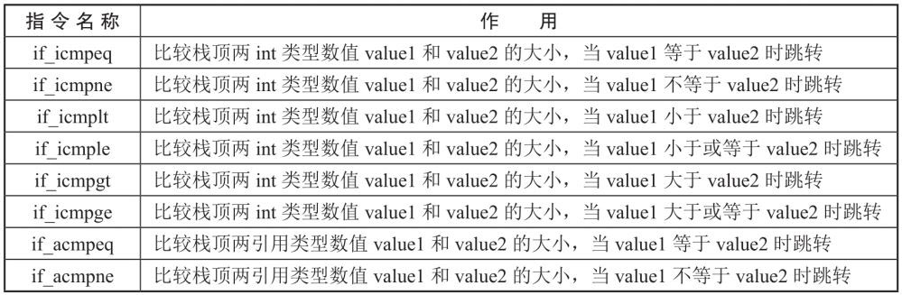

​	如下代码展示了比较条件跳转指令的作用。

<span style="color:#40E0D0;">案例1：比较条件跳转指令</span>

- 代码

```java
package com.coding.jvm01.instruct;

/**
 * 指令7：控制转移指令
 */
public class IfSwitchGotoTest {
    
	// 2、比较条件跳转指令
    public void ifCompare1() {
        int i = 10;
        int j = 20;
        System.out.println(i < j);
    }
}
```

​	对应的字节码指令如下。

```
 0 bipush 10
 2 istore_1
 3 bipush 20
 5 istore_2
 6 getstatic #4 <java/lang/System.out : Ljava/io/PrintStream;>
 9 iload_1
10 iload_2
11 if_icmple 18 (+7)
14 iconst_1
15 goto 19 (+4)
18 iconst_0
19 invokevirtual #5 <java/io/PrintStream.println : (Z)V>
22 return
```

​	字节码整个流程如下。

1、bipush 10将10压入操作数栈，此时操作数栈中的元素为10。istore_1将操作数栈中栈顶元素弹出并将数据放入局部变量表中索引为1的位置，此时局部变量表中有2个元素，索引为0的位置存放this，索引为1的位置存放10。

2、bipush 20将20压入操作数栈，此时操作数栈中的元素为20。istore_2将操作数栈中栈顶元素弹出并将数据放入局部变量表中为2的位置，此时局部变量表中有3个元素，索引为0的位置存放this，索引为1的位置存放10，索引为2的位置存放20。

3、getstatic #4 <java/lang/System.out>把“out”压入操作数栈。

4、iload1把局部变量表索引为1的数据压入到操作数栈中，此时操作数栈栈顶的元素是10。

5、iload 2把局部变量表索引为2的数据压入到操作数栈中，此时操作数栈栈顶的元素是20。

6、if_icmple 18(+7)比较栈顶两int类型数值大小，当前者小于或等于后者时跳转，此时比较的是10<20，条件成立，跳转到指令行号为18的指令，也就是执行iconst_0，把常量0放入操作数栈；字节码指令中是不支持boolean的，0对应的是false,1对应的是true，这里返回的是0，所以结果为false。

### 18.8.3 多条件分支跳转

​	多条件分支跳转指令是专为Java语法中switch-case语句设计的，包含tableswitch和lookupswitch，如下表所示。

<div style="text-align:center;font-weight:bold;">多条件分支跳转指令集</div>


​	两条指令都是JVM对switch语句的底层实现，它们的区别如下。

1、tableswitch，指令主要作用于多个条件分支case跨度较小的数值，比如case的值是(1,2,3,4,5,default)。在tableswitch的操作码index后面存放了default选项、case值的最小值low、case值的最大值high，以及high-low+1个地址偏移量(offset)。当执行到tableswitch指令时，检测操作数index值是否在low～high，如果不在，执行default分支；如果在范围之内，通过index-low进行简单的计算即可定位指定的目标地址，查找效率较高。指令tableswitch的示意图如图18-26所示。

<div style="text-align:center;font-weight:bold;">指令tableswitch示意图</div>


2、指令lookupswitch指令主要作用于多个条件分支case跨度较大，数值不连续的情况，比如case的值是(1,10,100,1000,10000,default)，lookupswitch指令内部存放各个离散的case值，因为是离散的，如果像switchtable那样，存储high-low+1个地址偏移量(offset)，就会造成空间的浪费。在lookupswitch的操作码index后面存放了default选项和若干个<key,offset>的形式存储的匹配对，这些匹配对按key递增排序，以便实现可以使用比线性扫描更有效的搜索。每次调用lookupswitch指令的时候通过操作码index去匹配key，如果匹配成功，则通过地址偏移量计算目标地址，如果不匹配，则跳转到default选项。指令lookupswitch如下图所示。

<div style="text-align:center;font-weight:bold;">指令lookupswitch示意图</div>

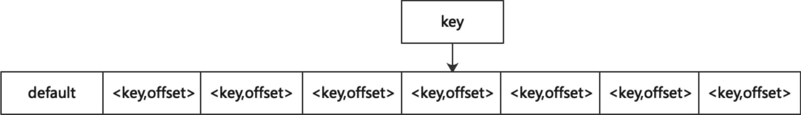

<span style="color:#40E0D0;">案例1：多条件跳转指令</span>

- 代码

```java
package com.coding.jvm01.instruct;

/**
 * 指令7：控制转移指令
 */
public class IfSwitchGotoTest {
    
	// 3、多条件分支跳转
    public void switch1(int select) {
        int num;
        switch (select) {
            case 1:
                num = 10;
                break;
            case 2:
                num = 20;
                // break;
            case 3:
                num = 30;
                break;
            default:
                num = 40;
        }
    }
}
```

​	对应的字节码指令如下。

```
 0 iload_1
 1 tableswitch 1 to 3
	1:  28 (+27)
	2:  34 (+33)
	3:  37 (+36)
	default:  43 (+42)
28 bipush 10
30 istore_2
31 goto 46 (+15)
34 bipush 20
36 istore_2
37 bipush 30
39 istore_2
40 goto 46 (+6)
43 bipush 40
45 istore_2
46 return
```

​	字节码指令执行流程如下。

1、iload1把局部变量表索引为1的对象引用到操作数栈中，这里是方法的参数压入操作数栈。

2、tableswitch 1 to 3

1:28(+27)

2:34(+33)

3:37(+36)

default:43(+42)

​	表示的意思是指令仅支持从1到3，当栈顶元素为1的时候跳转到指令行号为28的指令执行；当为2的时候跳转到指令行号为34的指令执行；当为3的时候跳转到指令行号为37的指令执行；否则跳转到指令行号为43的指令执行。符合switch语句的执行流程。

3、后续执行对应的指令即可。

<span style="color:#40E0D0;">案例1：case跨度较大的多条件跳转指令</span>

- 代码

```java
package com.coding.jvm01.instruct;

/**
 * 指令7：控制转移指令
 */
public class IfSwitchGotoTest {
    
    public void switch2(int select) {
        int num;
        switch (select) {
            case 10:
                num = 10;
                break;
            case 20:
                num = 20;
                // break
            case 30:
                num = 30;
                break;
            default:
                num = 40;
        }
    }
}
```

​	对应的字节码指令如下。可以看到当case值跨度较大时，使用的是lookupswitch指令。

```
 0 iload_1
 1 lookupswitch 3
	10:  36 (+35)
	20:  42 (+41)
	30:  45 (+44)
	default:  51 (+50)
36 bipush 10
38 istore_2
39 goto 54 (+15)
42 bipush 20
44 istore_2
45 bipush 30
47 istore_2
48 goto 54 (+6)
51 bipush 40
53 istore_2
54 return
```

​	下面我们再看一段代码，case值跨度设置较小时候的情况，如下代码所示。

<span style="color:#40E0D0;">案例1：case值跨度较小的多条件跳转指令</span>

- 代码

```java
package com.coding.jvm01.instruct;

/**
 * 指令7：控制转移指令
 */
public class IfSwitchGotoTest {
    
    public void switch3(int select) {
        int num;
        switch (select) {
            case 1:
                num = 10;
                break;
            case 2:
                num = 20;
                // break
            case 4:
                num = 40;
                break;
            case 6:
                num = 60;
                break;
            case 7:
                num = 70;
                break;
            default:
                num = 40;
        }
    }
}
```

​	对应的字节码指令如下，在源代码swtich3(int select)中可以看到，case值为1、2、4、6和7，并没有3和5。但是JVM为了便于利用数组连续的特性，添加了3和5，所以这也就解释了，当case中的值跨度较大时不宜使用tableswitch的原因，会导致空间浪费，比如方法swtich2(int select)中的case的值有10、20和30，如果继续使用tableswitch，就需要补充上11～19和21～29的值，而这些其实很多都是无效的值，会导致浪费很多空间。所以针对方法swtich2(int select)使用lookupswitch。

```
 0 iload_1
 1 tableswitch 1 to 7
	1:  44 (+43)
	2:  50 (+49)
	3:  71 (+70)
	4:  53 (+52)
	5:  71 (+70)
	6:  59 (+58)
	7:  65 (+64)
	default:  71 (+70)
44 bipush 10
46 istore_2
47 goto 74 (+27)
50 bipush 20
52 istore_2
53 bipush 40
55 istore_2
56 goto 74 (+18)
59 bipush 60
61 istore_2
62 goto 74 (+12)
65 bipush 70
67 istore_2
68 goto 74 (+6)
71 bipush 40
73 istore_2
74 return
```

### 18.8.4 无条件跳转

​	JVM目前主要使用的无条件跳转指令包括goto和goto_w。指令goto接收两个字节的无符号操作数，共同构造一个带符号的整数，用于指定目标指令地址的偏移量。goto指令的作用就是跳转到偏移量给定的位置处，目标指令地址必须和go指令在同一个方法中。goto_w和goto作用相同，区别是goto_w接收4个字节的无符号操作数，可以构造范围更大的地址偏移量。指令jsr、jsr_w、ret虽然也是无条件跳转的，但主要用于try-finally语句，且已经被虚拟机逐渐废弃，本书不再过多赘述，无条件跳转指令如下表所示。

<div style="text-align:center;font-weight:bold;">无条件跳转指令集</div>

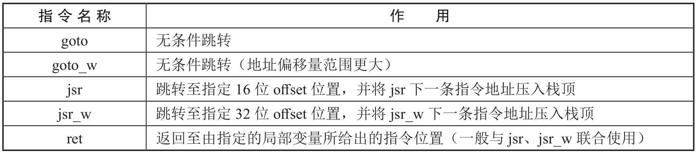

​	如下代码所示。

<span style="color:#40E0D0;">案例1：无条件跳转指令</span>

- 代码

```java
package com.coding.jvm01.instruct;

/**
 * 指令7：控制转移指令
 */
public class IfSwitchGotoTest {
    
    // 4、无条件跳转指令
    public void whileInt() {
        int i = 0;
        while (i < 100) {
            String s = "emon";
            i++;
        }
    }
}
```

​	对应的字节码指令如下。

```
 0 iconst_0
 1 istore_1
 2 iload_1
 3 bipush 100
 5 if_icmpge 17 (+12)
 8 ldc #17 <emon>
10 astore_2
11 iinc 1 by 1
14 goto 2 (-12)
17 return
```

​	字节码指令执行流程如下。

(1)iconst_0指令表示把常量0放入操作数栈；istore_1指令表示将操作数栈中栈顶元素弹出并放入局部变量表中为索引为1的位置，这两条指令相当于代码int i = 0;的含义。

(2)iload_1指令表示把局部变量表索引为1的数据压入到操作数栈中，此时操作数栈栈顶的元素是0;bipush 100指令表示将数值100压入操作数栈，此时操作数栈有两个元素，栈顶是100，栈底是0。

(3)if_icmpge 17(+12)指令表示比较栈顶两int类型数值大小，判断0是否大于100，如果大于则跳转到行号为17的指令，也就是直接return；否则接着往下执行。括号中的+12表示当前指令的行号加12之后正好为跳转的指令行号。

(4)ldc #17 <atguigu.com>指令表示把字符串“emon”地址压入操作数栈。

(5)astore_2指令表示将操作数栈中栈顶元素弹出并将数据放入局部变量表中索引为2的位置，此时局部变量表中有3个元素，索引为0的位置存储this，索引为1的位置存储0，索引为2的位置存储字符串s的地址。

(6)iinc 1 by 1指令表示对局部变量表中索引为1的位置中的数值进行加1操作，也就是i++。

(7)goto 2指令表示跳转到指令行号为2的指令，继续下一次循环。

## 18.9 异常处理指令

### 18.9.1 抛出异常指令

​	在Java程序中显式抛出异常的操作（throw语句）都是由athrow指令来实现。除了使用throw语句显式抛出异常情况之外，JVM规范还规定了许多运行时异常会在其他JVM指令检测到异常状况时自动抛出，例如之前介绍整数运算时，当除数为零时，虚拟机会在idiv或ldiv指令中抛出ArithmeticException异常。正常情况下，操作数栈的压入弹出都是一条条指令完成的。唯一的例外情况是在抛出异常时，JVM会清除操作数栈上的所有内容，而后将异常实例压入调用者操作数栈上。通过下面的案例演示JVM中的抛出异常指令。

```java
package com.coding.jvm01.instruct;

import java.io.File;
import java.io.FileInputStream;
import java.io.FileNotFoundException;
import java.io.IOException;

/**
 * 指令8、异常处理
 */
public class ExceptionTest {
    public void throwZero(int i) {
        if (i == 0) {
            throw new RuntimeException("参数值为0");
        }
    }

    public void throwOne(int i) throws RuntimeException, IOException {
        if (i == 1) {
            throw new RuntimeException("参数值为1");
        }
    }

    public void throwArithmetic() {
        int i = 10;
        int j = i / 0;
        System.out.println(j);
    }
}
```

​	throwZero()方法对应的字节码指令如下，通过athrow指令抛出异常。

```
 0 iload_1
 1 ifne 14 (+13)
 4 new #2 <java/lang/RuntimeException>
 7 dup
 8 ldc #3 <参数值为0>
10 invokespecial #4 <java/lang/RuntimeException.<init> : (Ljava/lang/String;)V>
13 athrow
14 return
```

​	throwOne()方法对应的字节码指令如下，可以看到和throwZero()方法的字节码指令基本相同。通过jclasslib工具查看时，会发现多了一项“Exceptions”，该选项表示throws语句产生的异常信息，如下图所示，可以看到“Exceptions”选项中包括RuntimeException和IOException两个异常。

```
 0 iload_1
 1 iconst_1
 2 if_icmpne 15 (+13)
 5 new #2 <java/lang/RuntimeException>
 8 dup
 9 ldc #5 <参数值为1>
11 invokespecial #4 <java/lang/RuntimeException.<init> : (Ljava/lang/String;)V>
14 athrow
15 return
```

<div style="text-align:center;font-weight:bold;">throws语句产生的异常信息</div>

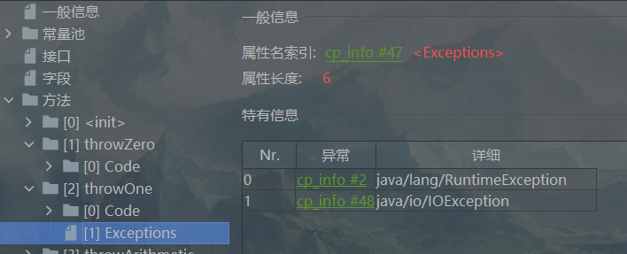

​	throwArithmetic()方法对应的字节码指令如下，JVM没有通过athrow指令抛出异常。

```
 0 bipush 10
 2 istore_1
 3 iload_1
 4 iconst_0
 5 idiv
 6 istore_2
 7 getstatic #6 <java/lang/System.out : Ljava/io/PrintStream;>
10 iload_2
11 invokevirtual #7 <java/io/PrintStream.println : (I)V>
14 return
```

### 18.9.2 异常处理和异常表

​	在JVM中，处理异常（catch语句）不是由字节码指令来实现的，而是采用异常表来完成的。

​	如果一个方法定义了一个try-catch或者try-finally的异常处理，就会创建一个异常表。它包含了每个异常处理或者finally块的信息。异常表保存了每个异常处理信息，比如异常的起始位置、结束位置、程序计数器记录的代码处理的偏移地址、被捕获的异常类在常量池中的索引等信息。当一个异常被抛出时，JVM会在当前的方法里寻找一个匹配的处理，如果没有找到，这个方法会强制结束并弹出当前栈帧，并且异常会重新抛给上层调用的方法（在调用方法栈帧）。如果在所有栈帧弹出前仍然没有找到合适的异常处理，这个线程将终止。如果这个异常在最后一个非守护线程里抛出，将会导致JVM自己终止，比如这个线程是个main线程。不管什么时候抛出异常，如果异常处理最终匹配了所有异常类型，代码就会继续执行。如果方法结束后没有抛出异常，仍然执行finally块，在return前，它直接跳到finally块来完成目标。如下代码展示了异常处理指令的作用。

<span style="color:#40E0D0;">案例1：异常处理指令</span>

- 代码

```java
package com.coding.jvm01.instruct;

import java.io.File;
import java.io.FileInputStream;
import java.io.FileNotFoundException;
import java.io.IOException;

/**
 * 指令8、异常处理
 */
public class ExceptionTest {
    public void tryCatch() {
        try {
            File file = new File("d:/hello.txt");
            FileInputStream fis = new FileInputStream(file);
        } catch (FileNotFoundException e) {
            e.printStackTrace();
        } catch (RuntimeException e) {
            e.printStackTrace();
        }
    }
}
```

​	对应的字节码指令如下。

```
 0 new #8 <java/io/File>
 3 dup
 4 ldc #9 <d:/hello.txt>
 6 invokespecial #10 <java/io/File.<init> : (Ljava/lang/String;)V>
 9 astore_1
10 new #11 <java/io/FileInputStream>
13 dup
14 aload_1
15 invokespecial #12 <java/io/FileInputStream.<init> : (Ljava/io/File;)V>
18 astore_2
19 goto 35 (+16)
22 astore_1
23 aload_1
24 invokevirtual #14 <java/io/FileNotFoundException.printStackTrace : ()V>
27 goto 35 (+8)
30 astore_1
31 aload_1
32 invokevirtual #15 <java/lang/RuntimeException.printStackTrace : ()V>
35 return
```

​	new #8 <java/io/File>指令创建一个File对象，把对象地址压入操作数栈，假如地址为0x1122,dup指令把栈顶对象地址复制一份再放入操作数栈，如下图所示。

<div style="text-align:center;font-weight:bold;">new和dup字节码指令操作</div>

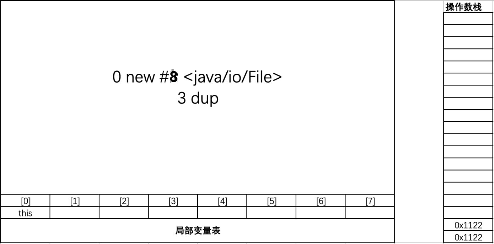


​	ldc #9 <d:/hello.txt>把字符串“d:/hello.txt”地址压入操作数栈，假如地址为0x1111，如下图所示。

<div style="text-align:center;font-weight:bold;">ldc指令操作</div>


​	invokespecial #10 <java/io/File.<init>>指令调用java/io/File类的构造器方法，此时弹出栈顶2个元素，如下图所示。

<div style="text-align:center;font-weight:bold;">invokespecial指令操作</div>


​		astore_1指令把操作数栈顶元素放入局部变量表中1号槽位并出栈；new #11<java/io/FileInputStream>指令创建FileInputStream类型的实例，并把地址放入操作数栈，假如地址为0x2233;dup指令把栈顶对象地址复制一份再放入操作数栈，如下图所示。

<div style="text-align:center;font-weight:bold;">astore_1和new以及dup字节码指令操作</div>


​	aload_1指令把局部变量表中1号槽位的数据放入操作数栈，如下图所示。

<div style="text-align:center;font-weight:bold;">aload_1指令操作</div>


​	invokespecial #12 <java/io/FileInputStream.<init>>指令调用java/io/FileInputStream类的构造器方法，此时弹出栈顶2个元素，如下图所示。

<div style="text-align:center;font-weight:bold;">invokespecial指令操作</div>

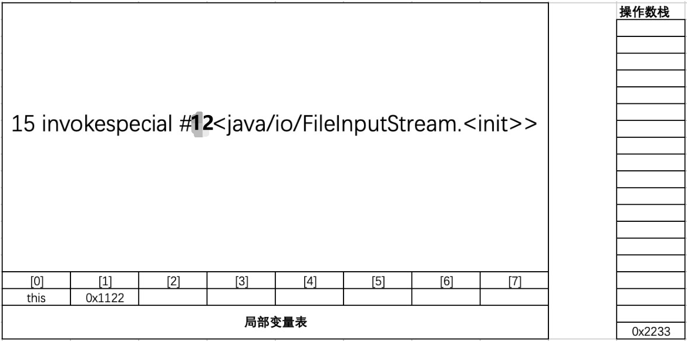

​	astore_2指令把操作数栈顶元素弹出并放入局部变量表中2号槽位；goto 35(+16)指令直接跳转到第35号指令位置，也就是执行return指令返回，括号中的“+16”表示当前指令号“19+16”就是跳转的指令位置，如下图所示。

<div style="text-align:center;font-weight:bold;">astore_2和goto指令操作</div>

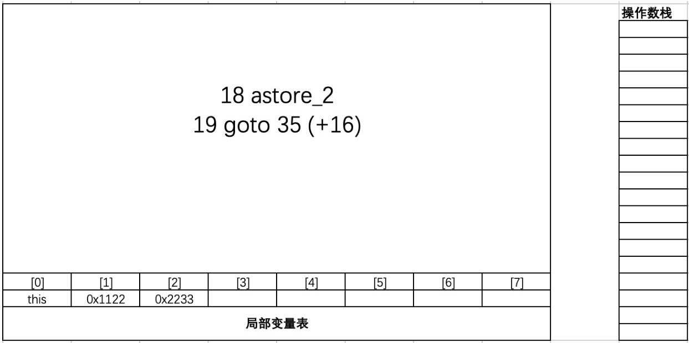

​	以上流程是程序在正常执行过程，没有使用到捕获异常情况，当程序发生异常时，首先应该查看异常表，使用插件jclasslib可以查看异常表，如下图所示。

<div style="text-align:center;font-weight:bold;">异常表</div>


​	起始PC和结束PC表示在字节码指令中指令前面的序号位置，这里表示的意思是程序只有在第0个指令（即0 new #8 <java/io/File>指令）和第19个指令（即19goto 35(+16)）之间会发生异常。跳转PC表示当程序发生异常时，需要跳转到的指令位置，当发生FileNotFoundException异常时，跳转到第22号指令，即astore_1指令。当发生RuntimeException异常时，跳转到第30号指令，这里也是astore_1指令。

​	分析第一种情况，如果发生FileNotFoundException异常，会产生一个异常对象e，假如对象e的地址为0x7788，该地址存入操作数栈。之后跳转到第22号指令，执行astore_1指令，把操作数栈中的数据出栈并放入局部变量表，如下图所示。

<div style="text-align:center;font-weight:bold;">FileNotFoundException异常情况</div>

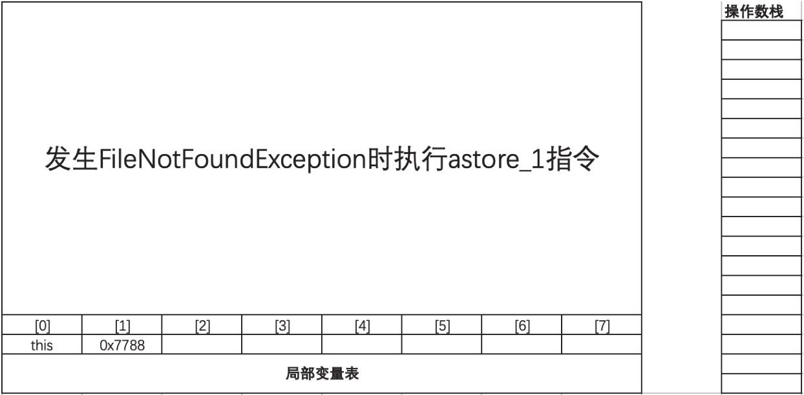

​	执行aload_1指令，把局部变量表中槽位为1的数据放入操作数栈，如下图所示。

<div style="text-align:center;font-weight:bold;">FileNotFoundException异常情况</div>

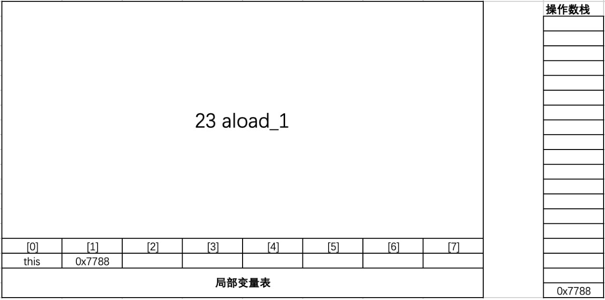

​	之后执行invokevirtual #14 <java/io/FileNotFoundException.printStackTrace>指令，弹出栈中元素。最后执行goto 35(+8)指令跳转到return指令，程序结束。

## 18.10 同步控制指令

​	JVM支持两种同步结构，分别是方法内部一段指令序列的同步和方法级的同步，这两种同步都是使用monitor来支持的。

### 18.10.1 方法内指定指令序列的同步

​	Java中通常是由synchronized语句代码块来表示同步。JVM通过monitorenter和monitorexit两条指令支持synchronized关键字的语义。在JVM中，任何对象都有一个监视器与之相关联，用来判断对象是否被锁定，当监视器被持有后，对象处于锁定状态，指令monitorenter和monitorexit在执行时，都需要在操作数栈顶压入对象。monitorenter和monitorexit的锁定和释放都是针对这个对象的监视器进行的。

​	如果一段代码块使用了synchronized关键字修饰，当一个线程进入同步代码块时，在字节码指令层面会使用monitorenter指令表示有线程请求进入，如果锁定的当前对象的监视器的计数器为0，则该线程会被准许进入；若为1，则判断持有当前监视器的线程是否当前线程，如果是，则允许该线程继续进入（重入锁），否则进行等待，直到对象的监视器计数器为0，当前线程才会被允许进入同步块。当线程退岀同步代码块时，需要使用monitorexit指令声明退出。下图展示了监视器如何保护临界区代码不同时被多个线程访问，只有当线程4离开临界区后，线程1、2、3才有可能进入。

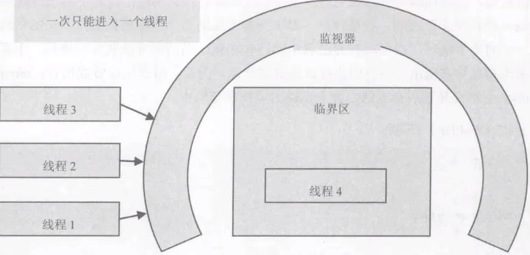

<div style="text-align:center;font-weight:bold;">多个线程竞争临界区代码块</div>

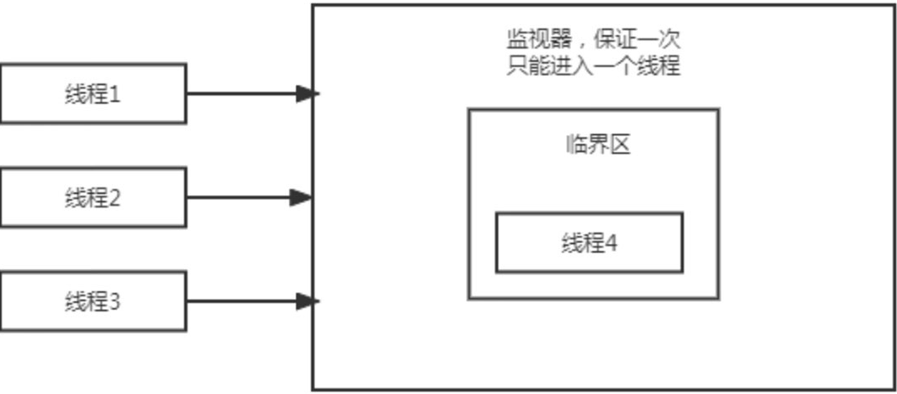

​	如下代码演示了同步控制指令的使用。

<span style="color:#40E0D0;">案例1：同步控制指令示例</span>

- 代码

```java
package com.coding.jvm01.instruct;

/**
 * 指令9：同步控制指令
 */
public class SynchronizedTest {
    private int i = 0;
    private Object obj = new Object();

    public void subtract() {
        synchronized (obj) {
            i--;
        }
    }
}
```

​	其对应的字节码指令如下。

```
 0 aload_0
 1 getfield #4 <com/coding/jvm01/instruct/SynchronizedTest.obj : Ljava/lang/Object;>
 4 dup
 5 astore_1
 6 monitorenter
 7 aload_0
 8 dup
 9 getfield #2 <com/coding/jvm01/instruct/SynchronizedTest.i : I>
12 iconst_1
13 isub
14 putfield #2 <com/coding/jvm01/instruct/SynchronizedTest.i : I>
17 aload_1
18 monitorexit
19 goto 27 (+8)
22 astore_2
23 aload_1
24 monitorexit
25 aload_2
26 athrow
27 return
```

​	可以看到monitorenter指令和monitorexit指令都是为同步代码块服务的。需要注意的是编译器必须确保无论方法通过何种方式完成，方法中调用过的每条monitorenter指令都必须执行其对应的monitorexit指令，而无论这个方法是正常结束还是异常结束。为了保证在方法异常完成时monitorenter和monitorexit指令依然可以正确配对执行，编译器会自动产生一个异常处理器，这个异常处理器声明可处理所有的异常，它的目的就是用来执行monitorexit指令，所以会多出一个monitorexit指令。

### 18.10.2 方法级的同步

​	方法级的同步是隐式的，即无须通过字节码指令来控制，它实现在方法调用和返回操作之中。虚拟机可以从方法常量池的方法表结构中的ACC_SYNCHRONIZED访问标志得知一个方法是否声明为同步方法。当调用方法时，调用指令将会检查方法的ACC_SYNCHRONIZED访问标志是否设置。如果设置了，执行线程将先持有同步锁，然后执行方法，最后在方法完成（无论是正常完成还是非正常完成）时释放同步锁。在方法执行期间，执行线程持有了同步锁，其他任何线程都无法再获得同一个锁。如果一个同步方法执行期间抛出了异常，并且在方法内部无法处理此异常，那这个同步方法所持有的锁将在异常抛到同步方法之外时自动释放，如下代码所示。

<span style="color:#40E0D0;">案例1：方法级同步控制示例</span>

- 代码

```java
package com.coding.jvm01.instruct;

/**
 * 指令9：同步控制指令
 */
public class SynchronizedTest {
    private int i = 0;

    public synchronized void add() {
        i++;
    }
}
```

​	这是一段很简单的代码，在add()方法上加synchronized关键字修饰，对应的字节码指令如下，可以看到字节码指令中并没有使用monitorenter和monitorexit进行同步控制，但是方法设置了ACC_SYNCHRONIZED访问标志。

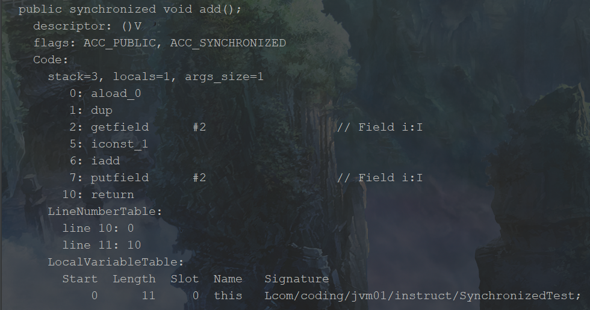

# 第19章 类的加载过程详解

​	我们知道class文件是存放在磁盘上的，如果想要在JVM中使用class文件，需要将其加载至内存当中。前面我们已经讲解了class文件的结构，本章将详细介绍class文件加载到内存中的过程。

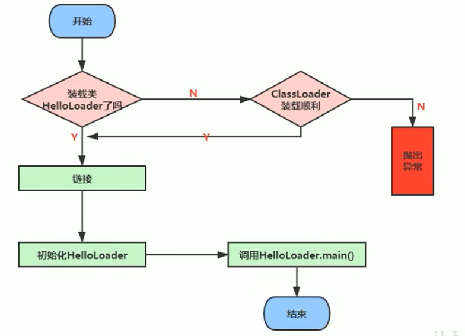

## 19.1 概述

​	在Java中数据类型分为基本数据类型和引用数据类型。基本数据类型由JVM预先定义，可以直接被用户使用，引用数据类型则需要执行类的加载才可以被用户使用。Java虚拟机规范中规定，class文件加载到内存，再到类卸载出内存会经历7个阶段，分别是加载、验证、准备、解析、初始化、使用和卸载，其中，验证、准备和解析3个阶段统称为链接(Linking)，整个过程称为类的生命周期，如下图所示。

<div style="text-align:center;font-weight:bold;">类的生命周期</div>

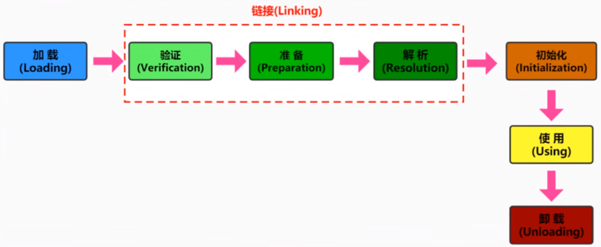

## 19.2 加载(Loading)阶段

### 19.2.1 加载完成的操作

​	所谓加载，简而言之就是将Java类的class文件加载到机器内存中，并在内存中构建出Java类的原型，也就是类模板对象。所谓类模板对象，其实就是Java类在JVM内存中的一个快照，JVM将从class文件中解析出的常量池、类字段、类方法等信息存储到类模板对象中。JVM在运行期可以通过类模板对象获取Java类中的任意信息，能够访问Java类中的成员变量，也能调用Java方法，反射机制便是基于这一基础，如果JVM没有将Java类的声明信息存储起来，则JVM在运行期也无法使用反射。在加载类时，JVM必须完成以下3件事情。

(1)通过类的全名，获取类的二进制数据流。

(2)解析类的二进制数据流为方法区内的数据结构（Java类模型）。

(3)创建java.lang.Class类的实例，作为方法区中访问类数据的入口。

### 19.2.2 二进制流的获取方式

​	JVM可以通过多种途径产生或获得类的二进制数据流，下面列举了常见的几种方式。

(1)通过文件系统读入一个后缀为.class的文件（最常见）。

(2)读入jar、zip等归档数据包，提取类文件。

(3)事先存放在数据库中的类的二进制数据。

(4)使用类似于HTTP之类的协议通过网络加载。

(5)在运行时生成一段Class的二进制信息。

​	在获取到类的二进制信息后，JVM就会处理这些数据，并最终转为一个java.lang.Class的实例。如果输入数据不是JVM规范的class文件的结构，则会抛出“ClassFormatError”异常。

### 19.2.3 类模型与Class实例的位置

**1 类模型的位置**

​	加载的类在JVM中创建相应的类结构，类结构会存储在方法区中。

**2 Class实例的位置**

​	类加载器将class文件加载至方法区后，会在堆中创建一个Java.lang.Class对象，用来封装类位于方法区内的数据结构，<span style="color:#9400D3;">该Class对象是在加载类的过程中创建的，每个类都对应有一个Class类型的对象</span>。类模型和Class实例的位置对应关系如下图所示。

<div style="text-align:center;font-weight:bold;">类模型和Class实例的位置</div>

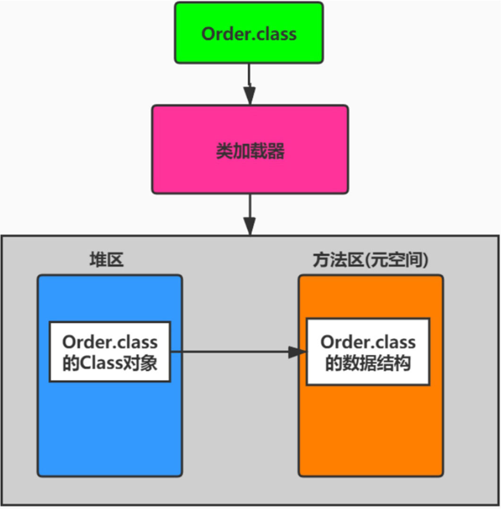

​	外部可以通过访问代表Order类的Class对象来获取Order类的数据结构。java.lang.Class类的构造方法是私有的，只有JVM能够创建。java.lang.Class实例是访问类型元数据的入口，也是实现反射的关键数据。通过Class类提供的接口，可以获得目标类所关联的class文件中具体的数据结构、方法、字段等信息。如下代码所示，展示了如何通过java.lang.Class类获取方法信息。

<span style="color:#40E0D0;">案例1：通过Class类获取方法信息</span>

- 代码

```java
package com.coding.jvm02.loading;

import java.lang.reflect.Method;
import java.lang.reflect.Modifier;

/**
 * 过程一：加载阶段
 * <p>
 * 通过Class类，获得了java.lang.String类的所有方法信息，并打印方法访问标识符、描述符
 */
public class LoadingTest {
    public static void main(String[] args) {
        try {
            Class<?> clazz = Class.forName("java.lang.String");
            // 获取当前运行时类声明的所有方法
            Method[] ms = clazz.getDeclaredMethods();
            for (Method m : ms) {
                // 获取方法修饰符
                String mod = Modifier.toString(m.getModifiers());
                System.out.print(mod + " ");
                // 获取方法返回值类型
                String returnType = m.getReturnType().getSimpleName();
                System.out.print(returnType + " ");
                // 获取方法名
                System.out.print(m.getName() + "(");
                // 获取方法参数列表
                Class<?>[] ps = m.getParameterTypes();
                if (ps.length == 0) System.out.print(")");
                for (int i = 0; i < ps.length; i++) {
                    char end = (i == ps.length - 1) ? ')' : ',';
                    // 获取参数的类型
                    System.out.print(ps[i].getSimpleName() + end);
                }
                System.out.println();
            }
        } catch (ClassNotFoundException e) {
            throw new RuntimeException(e);
        }
    }
}
```

​	通过上面的代码可以直接获取到String类的方法信息，运行结果如下，由于String类方法太多，只展示部分方法。

```bash
public boolean equals(Object)
public String toString()
public int hashCode()
public int compareTo(String)
public volatile int compareTo(Object)
......
```

### 19.2.4 数组类的加载

​	创建数组类的情况稍微有些特殊，<span style="color:#9400D3;">数组类由JVM在运行时根据需要直接创建，所以数组类没有对应的class文件，也就没有二进制形式，所以也就无法使用类加载器去创建数组类</span>。但数组的元素类型仍然需要依靠类加载器去创建。创建数组类的过程如下。

(1)如果数组的元素类型是引用类型，那么就遵循定义的加载过程递归加载和创建数组的元素类型，JVM使用指定的元素类型和数组维度来创建新的数组类。

(2)如果数组的元素是基本数据类型，比如int类型的数组，由于基本数据类型是由JVM预先定义的，所以也不需要类加载，只需要关注数组维度即可。

​	如果数组的元素类型是引用类型，数组类的可访问性就由元素类型的可访问性决定。否则数组类的可访问性将被缺省定义为public。

## 19.3 链接(Linking)阶段

### 19.3.1 链接阶段之验证(Verification)

​	类加载到机器内存后，就开始链接操作，验证是链接操作的第一步。验证的目的是保证加载的字节码是合法、合理并符合规范的。验证的步骤比较复杂，实际要验证的项目也很繁多，如下图所示，验证的内容涵盖了类数据信息的格式检查、语义检查、字节码验证、符号引用验证，其中格式检查会和加载阶段一起执行。<span style="color:#9400D3;">验证通过之后，类加载器才会成功将类的二进制数据信息加载到方法区中。格式检查之外的验证操作将会在方法区中进行</span>。如果不在链接阶段进行验证，那么class文件运行时依旧需要进行各种检查，虽然链接阶段的验证拖慢了加载速度，但是却提高了程序执行的速度，正所谓“磨刀不误砍柴工”。

<div style="text-align:center;font-weight:bold;">验证流程</div>

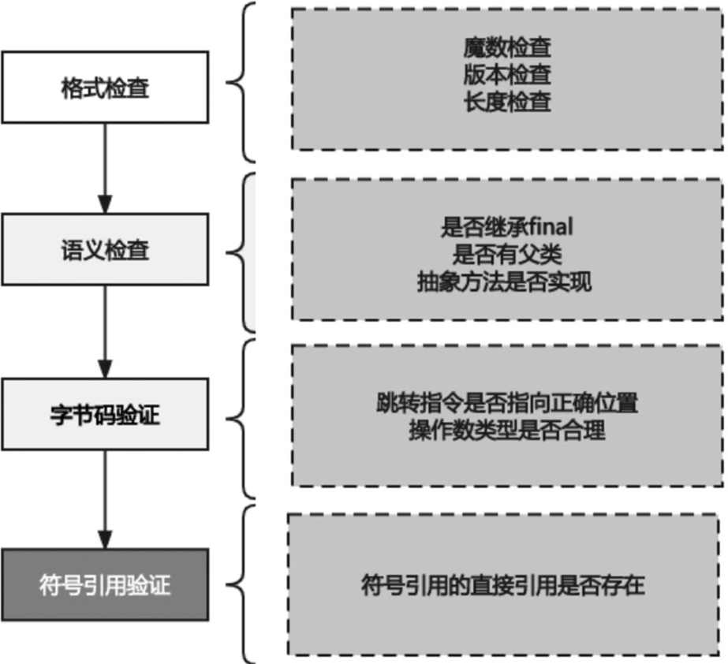

**1 格式检查**

​	主要检查是否以魔数OxCAFEBABE开头，主版本和副版本号是否在当前JVM的支持范围内，数据中每一个项是否都拥有正确的长度等。

**2 语义检查**

​	JVM会进行字节码的语义检查，但凡在语义上不符合规范的，JVM也不会验证通过，比如JVM会检查下面4项语义是否符合规范。

(1)是否所有的类都有父类的存在（Object除外）。

(2)是否一些被定义为final的方法或者类被重写或继承了。

(3)非抽象类是否实现了所有抽象方法或者接口方法。

(4)是否存在不兼容的方法，比如方法的签名除了返回值不同，其他都一样。

**3 字节码验证**

​	JVM还会进行字节码验证，字节码验证也是验证过程中最为复杂的一个过程。它试图通过对字节码流的分析，判断字节码是否可以被正确地执行，比如JVM会验证字节码中的以下内容。

(1)在字节码的执行过程中，是否会跳转到一条不存在的指令。

(2)函数的调用是否传递了正确类型的参数。

(3)变量的赋值是不是给了正确的数据类型等。

(4)检查栈映射帧的局部变量表和操作数栈是否有着正确的数据类型。

​	遗憾的是，百分之百准确地判断一段字节码是否可以被安全执行是无法实现的，因此，该过程只是尽可能地检查出可以预知的明显的问题。如果在这个阶段无法通过检查，JVM也不会正确装载这个类。但是，如果通过了这个阶段的检查，也不能说明这个类是完全没有问题的。在前面3次检查中，已经排除了文件格式错误、语义错误以及字节码的不正确性。但是依然不能确保类是没有问题的。

**4 符号引用验证**

​	class文件中的常量池会通过字符串记录将要使用的其他类或者方法。因此，在验证阶段，JVM就会检查这些类或者方法是否存在，检查当前类是否有权限访问这些数据，如果一个需要使用的类无法在系统中找到，则会抛出“NoClassDefFoundError”错误，如果一个方法无法被找到，则会抛出“NoSuchMethodError”错误。注意，这个过程发生在链接阶段的解析环节。

### 19.3.2 链接阶段之准备(Preparation)

​	当一个类验证通过时，JVM就会进入准备阶段。<span style="color:red;font-weight:bold;">准备阶段主要负责为类的静态变量分配内存，并将其初始化为默认值</span>。JVM为各类型变量默认的初始值如下表所示。

<div style="text-align:center;font-weight:bold;">表19-1：静态变量默认初始值</div>

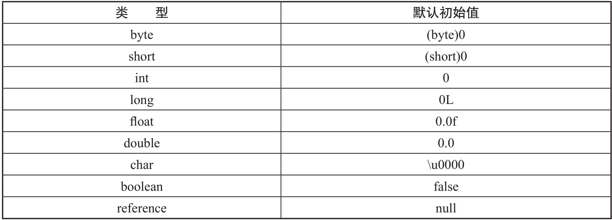

​	各类型默认初始值以及占用大小。

| 类型      | 默认初始值 | 占用字节 |
| --------- | ---------- | -------- |
| byte      | (byte)0    | 1个字节  |
| short     | (short)0   | 2个字节  |
| int       | 0          | 4个字节  |
| long      | 0L         | 8个字节  |
| float     | 0.0f       | 4个字节  |
| double    | 0.0        | 8个字节  |
| char      | \u0000     | 2个字节  |
| boolean   | false      | 1个字节  |
| reference | null       | ---      |

​	Java并不直接支持boolean类型，对于boolean类型，内部实现是int,int的默认值是0，对应的boolean类型的默认值是false。

​	注意，这个阶段不会为使用static final修饰的基本数据类型初始化为0，因为final在编译的时候就会分配了，准备阶段会显式赋值。也不会为实例变量分配初始化，因为实例变量会随着对象一起分配到Java堆中。这个阶段并不会像初始化阶段（见19.4节）那样会有初始化或者代码被执行。如下代码展示了static final修饰的基本数据类型不会被初始化为0。

<span style="color:#40E0D0;">案例1：准备阶段测试</span>

- 代码

```java
/**
 * 过程二：链接阶段
 * <p>
 * 基本数据类型：非final修饰的变量，在准备环节进行默认初始化赋值。 final修饰以后，在准备环节直接进行显式赋值。
 * <p>
 * 拓展：如果使用字面量的方式定义一个字符串的常量的话，也是在准备环节直接进行显式赋值。
 */
public class LinkingTest {
    // 定义静态变量id
    private static long id;
    // 定义静态常量num，并且赋值为1
    private static final int num = 1;
}
```

​	查看该类的字节码字段属性，如下图所示。

<div style="text-align:center;font-weight:bold;">LinkingTest字段属性</div>

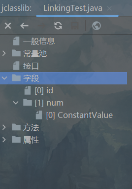

​	如果类字段的字段属性表中存在ConstantValue属性，那么在准备阶段该类字段value就会被显式赋值，也就是说在准备阶段，num的值是1，而不是0。仅被static修饰的类变量，在准备阶段初始化为默认值，默认值见表<span style="color:blue;font-weight:bold;">表19-1：静态变量默认初始值</span>。

### 19.3.3 链接阶段之解析(Resolution)

​	在准备阶段完成后，类加载进入解析阶段。解析阶段主要负责将类、接口、字段和方法的符号引用转为直接引用。

​	符号引用就是一些字面量的引用，和JVM的内部数据结构及内存布局无关。比如class文件中，常量池存储了大量的符号引用。在程序实际运行时，只有符号引用是不够的，比如当println()方法被调用时，系统需要明确知道该方法的位置。

​	以方法为例，JVM为每个类都准备了一张方法表，将其所有的方法都列在表中，当需要调用一个类的方法的时候，只要知道这个方法在方法表中的偏移量就可以直接调用该方法。通过解析操作，符号引用就可以转变为目标方法在类中方法表中的位置，从而使得方法被成功调用。如下代码演示了方法在解析阶段的调用过程。

<span style="color:#40E0D0;">案例1:方法的解析阶段</span>

- 代码

```java
package com.coding.jvm02.loading;

public class ResolutionTest {
    public void print() {
        System.out.println("emon");
    }
}
```

​	其对应的字节码如下。

```
0 getstatic #2 <java/lang/System.out : Ljava/io/PrintStream;>
3 ldc #3 <emon>
5 invokevirtual #4 <java/io/PrintStream.println : (Ljava/lang/String;)V>
8 return
```

​	invokevirtual #4 <java/io/PrintStream.println>方法的符号引用指向常量池中第四个选项，如下图所示。

<div style="text-align:center;font-weight:bold;">常量池项</div>

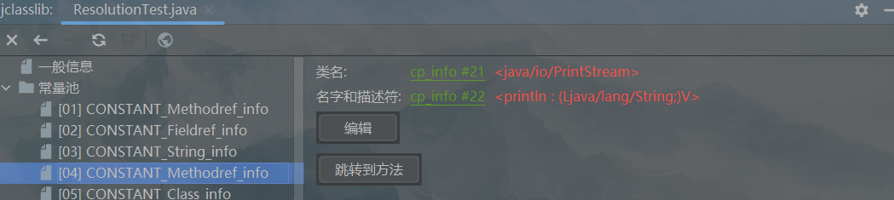

​	方法调用的常量是类中方法的符号引用，包含类名和方法以及方法参数，解析阶段就是获取这些属性在内存中的地址，具体过程如下图所示，通过第4项常量找到第21项类名常量和第22项方法的名称描述符即可。

<div style="text-align:center;font-weight:bold;">方法解析</div>

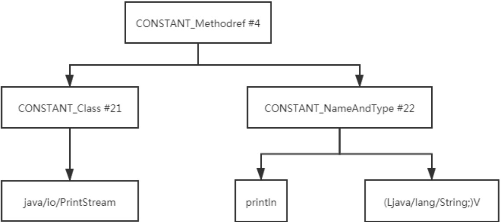

## 19.4 初始化(Initialization)阶段

​	类的初始化是类装载的最后一个阶段。如果前面的步骤都没有问题，那么表示类可以顺利装载到系统中，然后JVM才会开始执行Java字节码，也就是说到了初始化阶段，JVM才真正开始执行类中定义的Java程序代码。初始化阶段的重要工作是执行类的<clinit>()方法（即类初始化方法），该方法仅能由Java编译器生成并被JVM调用，程序开发者无法自定义一个同名的方法，也无法直接在Java程序中调用该方法。<clinit>()方法是由类静态成员的赋值语句以及static语句块合并产生的。通常在加载一个类之前，JVM总是会试图加载该类的父类，因此父类的<clinit>()方法总是在子类<clinit>()方法之前被调用，也就是说，父类的static语句块优先级高于子类，简要概括为<span style="color:#9400D3;font-weight:bold;">由父及子，静态先行</span>。

​	Java编译器并不会为所有的类都产生<clinit>()方法。以下情况class文件中将不会包含<clinit>()方法。

(1)一个类中并没有声明任何的类变量，也没有静态代码块时。

(2)一个类中声明类变量，但是没有明确使用类变量的初始化语句以及静态代码块来执行初始化操作时。

(3)一个类中包含static final修饰的基本数据类型的字段，这些类字段初始化语句采用编译时常量表达式。

<span style="color:#40E0D0;">案例1：没有&lt;clinit&gt;()方法</span>

- 代码

```java
package com.coding.jvm02.loading;

/**
 * 过程三：初始化阶段
 * <p>
 * 哪些场景下，java编译器不会生成<clinit>()方法
 */
public class InitializationTest2 {
    // 场景1：一个类中并没有声明任何的类变量，也没有静态代码块时。
    public int num = 1;
    // 场景2：一个类中声明类变量，但是没有明确使用类变量的初始化语句以及静态代码块来执行初始化操作时。
    public static int num2;
    // 场景3：一个类中包含static final修饰的基本数据类型的字段，这些类字段初始化语句采用编译时常量表达式。
    public static final int num3 = 1;
}
```

​	查看该类对应的方法信息，如下图所示，可以看到不存在<clinit>()方法。

<div style="text-align:center;font-weight:bold;">方法表</div>

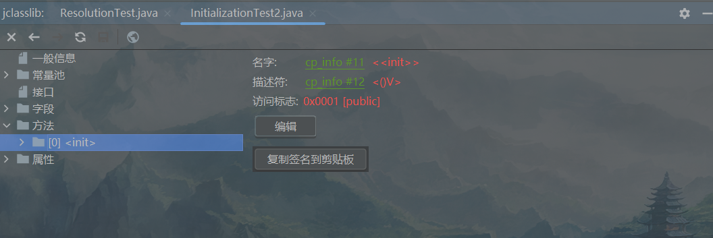

### 19.4.1 static与final搭配

​	在第19.3.2节中讲解了static与final定义的变量在准备阶段完成赋值，但是并不是所有的变量都在链接阶段的准备阶段完成赋值，下面通过代码案例说明不同情况下的不同阶段赋值，如下代码所示。

<span style="color:#40E0D0;">案例1：static与final搭配使用的不同阶段赋值</span>

- 代码

```java
package com.coding.jvm02.loading;

import java.util.Random;

/**
 * 过程三：初始化阶段
 * <p>
 * 说明：使用static+final修饰的字段的显式赋值的操作，到底是在哪个阶段进行的赋值？
 * 情况1：在链接阶段的准备环境赋值
 * 情况2：在初始化阶段赋值
 * <p>
 * 结论：
 * 在链接阶段的准备环节赋值的情况：
 * 1.对于基本数据类型的字段来说，如果使用static final修饰，则显式赋值（赋值常量，而非调用方法生成值）通常是在链接阶段的准备环节进行。
 * 2.对于String来说，如果使用字面量赋值，使用static final修饰的话，则显式赋值通常是在链接阶段的准备环节进行。
 * 在初始化阶段赋值：
 * 1.排除上述的在准备环节赋值的情况之外的情况。
 * <p>
 * 最终结论：使用static + final修饰，且显式赋值中不涉及到方法或构造器调用的基本数据类型或String类型的显式赋值，是在链接阶段的准备环节进行。
 */
public class InitializationTest3 {
    public static int a = 1; // 在初始化阶段赋值
    public static final int INT_CONSTANT = 10; // 在链接阶段的准备环境赋值

    public static final Integer INTEGER_CONSTANT1 = Integer.valueOf(100); // 在初始化阶段赋值
    public static Integer INTEGER_CONSTANT2 = Integer.valueOf(1000); // 在初始化阶段赋值

    public static final String s0 = "helloworld0"; // 在链接阶段的准备环境赋值
    public static final String s1 = new String("helloworld1"); // 在初始化阶段赋值
    public static String s2 = "helloworld2"; // 在初始化阶段赋值

    public static final int NUM1 = new Random().nextInt(10); // 在初始化阶段赋值
}
```

​	对应字节码指令在<clinit>()方法中。

```
 0 iconst_1
 1 putstatic #2 <com/coding/jvm02/loading/InitializationTest3.a : I>
 4 bipush 100
 6 invokestatic #3 <java/lang/Integer.valueOf : (I)Ljava/lang/Integer;>
 9 putstatic #4 <com/coding/jvm02/loading/InitializationTest3.INTEGER_CONSTANT1 : Ljava/lang/Integer;>
12 sipush 1000
15 invokestatic #3 <java/lang/Integer.valueOf : (I)Ljava/lang/Integer;>
18 putstatic #5 <com/coding/jvm02/loading/InitializationTest3.INTEGER_CONSTANT2 : Ljava/lang/Integer;>
21 new #6 <java/lang/String>
24 dup
25 ldc #7 <helloworld1>
27 invokespecial #8 <java/lang/String.<init> : (Ljava/lang/String;)V>
30 putstatic #9 <com/coding/jvm02/loading/InitializationTest3.s1 : Ljava/lang/String;>
33 ldc #10 <helloworld2>
35 putstatic #11 <com/coding/jvm02/loading/InitializationTest3.s2 : Ljava/lang/String;>
38 new #12 <java/util/Random>
41 dup
42 invokespecial #13 <java/util/Random.<init> : ()V>
45 bipush 10
47 invokevirtual #14 <java/util/Random.nextInt : (I)I>
50 putstatic #15 <com/coding/jvm02/loading/InitializationTest3.NUM1 : I>
53 return
```

​	从字节码指令中看到只有定义类成员变量a、INTEGER_CONSTANT1、INTEGER_CONSTANT2和s1、s2以及NUM1时是在初始化阶段的<clinit>()方法中完成。那么另外两个类变量是怎么赋值的呢？通过jclasslib查看字段属性表，如下图所示，可以看到只有INT_CONSTANT和helloworld0两个常量拥有ConstantValue，说明INT_CONSTANT = 10和String s0="helloworld0"是在链接阶段的准备阶段完成的。

<div style="text-align:center;font-weight:bold;">字段属性表</div>

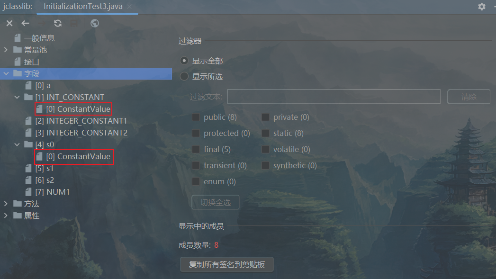

​	<span style="color:red;font-weight:bold;">我们得出的结论就是，基本数据类型和String类型使用static和final修饰，并且显式赋值中不涉及方法或构造器调用，其初始化是在链接阶段的准备环节进行，其他情况都是在初始化阶段进行赋值。</span>

### 19.4.2 &lt;clinit&gt;()方法的线程安全性

​	对于<clinit>()方法的调用，JVM会在内部确保其多线程环境中的安全性。JVM会保证一个类的<clinit>()方法在多线程环境中被正确地加锁、同步，如果多个线程同时去初始化一个类，那么只会有一个线程去执行这个类的<clinit>()方法，其他线程都需要阻塞等待，直到活动线程执行<clinit>()方法完毕。正是因为方法<clinit>()带锁线程安全的，如果在一个类的<clinit>()方法中有耗时很长的操作，就可能造成多个线程阻塞，导致死锁，这种死锁是很难发现的，因为并没有可用的锁信息。如果之前的线程成功加载了类，则等在队列中的线程就没有机会再执行<clinit>()方法了，当需要使用这个类时，JVM会直接返回给它已经准备好的信息。

### 19.4.3 类的初始化时机：主动使用和被动使用

​	初始化阶段是执行类构造器<clinit>()方法的过程。虽然有些类已经存在<clinit>()方法，但是并不确定什么时候会触发执行，可以触发<clinit>()方法的情景称为主动使用，不能触发<clinit>()方法执行的情景称为被动使用。主动使用可以触发类的初始化，被动使用不能触发类的初始化。

**1 主动使用**

​	JVM不会无条件地装载class文件，class文件只有在首次使用的时候才会被装载。JVM规定，一个类或接口在初次使用前，必须要进行初始化。这里的“使用”是指主动使用，主动使用包含下列几种情况。

(1)创建一个类的实例时，比如使用new关键字、反射、克隆或反序列化等方式创建实例。首先创建Order类，Order类中写了一段静态代码块，如下代码所示。

<span style="color:#40E0D0;">案例1：Order类</span>

- 代码

```java
class Order implements Serializable {
    private static final long serialVersionUID = -6166346450199490389L;

    static {
        System.out.println("Order类的初始化过程");
    }
}
```

​	一个类被初始化的标志就是执行<clinit>()方法，查看Order类的<clinit>()方法，如下图所示，说明只要执行了静态代码块就表示执行了<clinit>()方法，即Order类被初始化。

<div style="text-align:center;font-weight:bold;">Order类的<clinit>()</div>


​	如下代码演示了new［test1()方法］关键字创建实例、反射［test2()方法］，以及反序列化［test3_1()方法］都会调用类的初始化，代码中如果输出了Order类中对应的输出语句即表示执行了类的初始化。注意，案例中序列化［test3_0()方法］的作用仅仅是将对象序列化为order.dat文件，为反序列化［test3_2()方法］做铺垫，虽然序列化［test3_1()方法］也输出了Order类中的语句，这是因为new关键字调用了类的初始化，而不是序列化调用了类的初始化。

<span style="color:#40E0D0;">案例1：ActiveUse1类</span>

- 代码

```java
public class ActiveUse1 {
    // new 创建实例
    @Test
    public void test1() {
        Order order = new Order();
    }

    // 反射
    @Test
    public void test2() throws InstantiationException, IllegalAccessException, ClassNotFoundException {
        // Order.class.newInstance(); // 方式一
        Class clazz = Class.forName("com.coding.jvm02.loading.Order"); // 方式二
    }

    // 序列化
    @Test
    public void test3_0() throws IOException, ClassNotFoundException {
        try (ObjectOutputStream oos = new ObjectOutputStream(Files.newOutputStream(Paths.get("order.data")))) {
            oos.writeObject(new Order());
        }
    }

    // 反序列化
    @Test
    public void test3_1() throws IOException, ClassNotFoundException {
        try (ObjectInputStream ois = new ObjectInputStream(Files.newInputStream(Paths.get("order.data")))) {
            Object o = ois.readObject();
        }
    }

}
```

​	test1()、test2()、test3_1()方法的执行结果如下，表明使用new关键字、反射、反序列化等方式都会执行类的初始化。

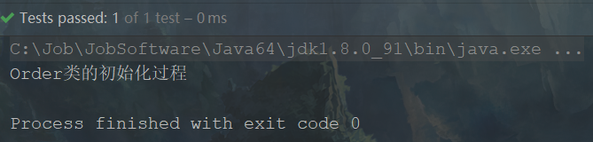

(2)调用类的静态方法时，即当使用了字节码invokestatic指令时。

​	Order类中添加静态方法，如下所示。

```java
    public static void method() {
        System.out.println("Order method()...");
    }
```

​	ActiveUse1类中添加test4()方法用于调用类的静态方法，如下所示。

```java
    // 当调用类的静态方法时
    @Test
    public void test4() {
        Order.method();
    }
```

​	test4()方法执行结果如下，可以发现调用类的静态方法的时候也执行了类的初始化。

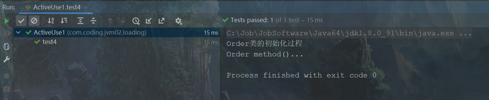

​	(3)使用类、接口的静态字段时（final修饰特殊考虑），字节码指令中使用了getstatic或者putstatic指令。

​	在Order类中添加以下属性。

```java
    public static int num1 = 1;
    public static final int num2 = 2;
    public static final int num3 = new Random().nextInt(10);
```

​	在ActiveUse1中增加如下测试方法。

```java
    @Test
    public void test5() {
        // 会主动使用
        System.out.println("test5() 方法执行结果：" + Order.num1);
    }

    @Test
    public void test6() {
        // 不会主动使用
        System.out.println("test6() 方法执行结果：" + Order.num2);
    }

    @Test
    public void test7() {
        // 会主动使用
        System.out.println("test7() 方法执行结果：" + Order.num3);
    }
```

​	test5()方法的执行结果如下所示。

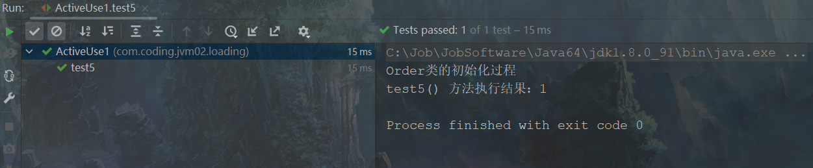

​	test6()方法的执行结果如下所示。

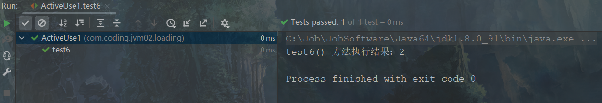

​	test7()方法的执行结果如下所示。

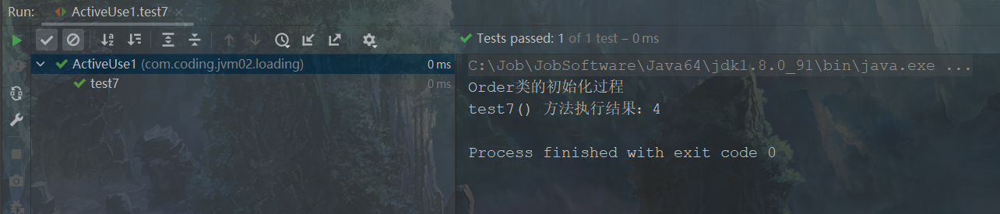

​	从结果来看，当字段使用static修饰且没有使用final字段修饰时，如果使用该字段会触发类的初始化；当static和final同时修饰字段时，且该字段是一个固定值则不会触发类的初始化，因为该类型的字段在链接过程的准备阶段就已经被初始化赋值了，不需要类初始化以后才能使用，所以不会执行类的初始化；num3是因为在程序执行之前无法确定具体的数值，所以需要执行类的初始化以后才能继续执行。

​	上面讲述了类的静态字段是否触发类的初始化，接下来再测试接口的静态字段是否会触发接口的初始化，创建CompareA接口如下代码所示。

<span style="color:#40E0D0;">案例1：创建CompareA接口</span>

- 代码

```java
interface CompareA {
    Thread t = new Thread() {
        {
            System.out.println("CompareA的初始化");
        }
    };
    int NUM1 = 1;
    int NUM2 = new Random().nextInt(10);
}
```

​	查看CompareA中<clinit>()方法，如下图所示，可以看到如果创建了线程对象t并且里面的代码块语句输出则表示执行了<clinit>()方法。

<div style="text-align:center;font-weight:bold;">Order类的<clinit>()</div>

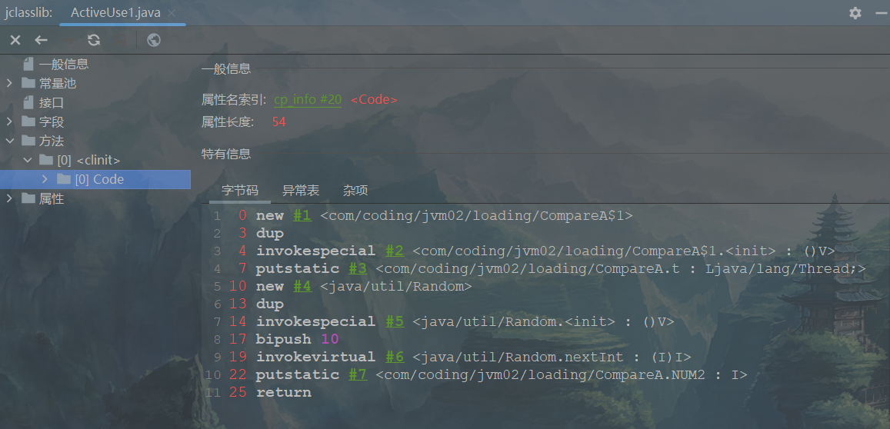

​	在ActiveUse2类中添加test8()和test9()方法用于测试接口的静态属性是否会触发类的初始化。

```java
    @Test
    public void test8() {
        // 不会主动使用
        int num1 = CompareA.NUM1;
    }

    @Test
    public void test9() {
        // 会主动使用
        int num2 = CompareA.NUM2;
    }
```

​	test8()方法执行结果如下。

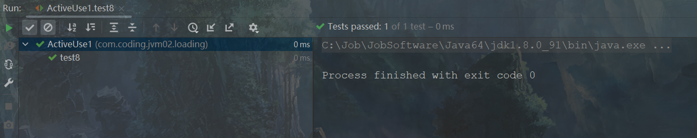

​	test9()方法执行结果如下。

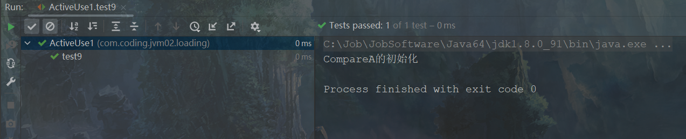

​	可以看到接口的静态字段和类的静态不可变字段对类的初始化效果是一样的，需要注意的是接口的字段默认是由static final修饰的，接口中没有字段是被static单独修饰的。

<span style="color:#40E0D0;">案例2：ActiveUse2类</span>

- 代码

```java
public class ActiveUse2 {
	// 当初始化子类时，如果发现其父类还没有进行过初始化，则需要先触发其父类的初始化
    // 在初始化一个类时，并不会先初始化它所实现的接口。
    // 如果一个接口定义了default方法，那么直接实现或者间接实现了该接口的类若初始化，该接口要在其之前被初始化
    @Test
    public void test1() {
        int num = Son.num;
    }

    // 在初始化一个接口时，并不会先初始化它的父接口。
    @Test
    public void test2() {
        int num2 = CompareC.NUM1;
    }
}

class Father {

    static {
        System.out.println("Father类的初始化过程");
    }
}

class Son extends Father implements CompareB {

    public static int num = 1;

    static {
        System.out.println("Son类的初始化过程");
    }
}

interface CompareB {
    Thread t = new Thread() {
        {
            System.out.println("CompareB的初始化");
        }
    };

    // 如果一个接口定义了default方法，那么直接实现或者间接实现了该接口的类若初始化，该接口要在其之前被初始化
    //    default void method1() {
    //        System.out.println("CompareB->method1()");
    //    }
}

interface CompareC extends CompareB {
    Thread t = new Thread() {
        {
            System.out.println("CompareC的初始化");
        }
    };

    int NUM2 = new Random().nextInt(10);
}
```

(4)初始化子类时，如果发现其父类还没有进行过初始化，则需要先触发其父类的初始化。<span style="color:red;font-weight:bold;">JVM虚拟机初始化一个类时，要求它的所有父类都已经被初始化，但是这条规则并不适用于接口。在初始化一个类时，并不会先初始化它所实现的接口</span>；在初始化一个接口时，并不会先初始化它的父接口。因此，一个父接口并不会因为它的子接口或者实现类的初始化而初始化。只有当程序首次使用特定接口的静态字段时，才会导致该接口的初始化，下面我们使用案例验证上述结论。	

​	test1()方法执行结果如下，可以看到在Son类初始化之前执行了Father类的静态代码块，表示初始化子类时，需要先触发其父类的初始化。但也可以发现并没有执行父接口的初始化方法。

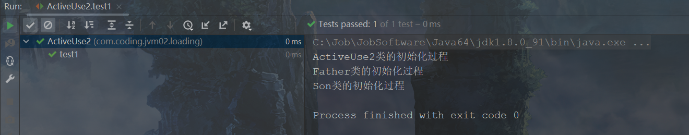

(5)如果一个接口定义了default方法，那么直接实现或者间接实现该接口的类在初始化之前需要实现接口的初始化。

​	我们在接口CompareB中添加default修饰的方法method1()，如下所示。

```java
interface CompareB {
    Thread t = new Thread() {
        {
            System.out.println("CompareB的初始化");
        }
    };

    // 如果一个接口定义了default方法，那么直接实现或者间接实现了该接口的类若初始化，该接口要在其之前被初始化
    default void method1() {
        System.out.println("CompareB->method1()");
    }
}
```

​	再次执行ActiveUse2类中的test1()方法，执行结果如下，从结果可知接口CompareB也执行了初始化。

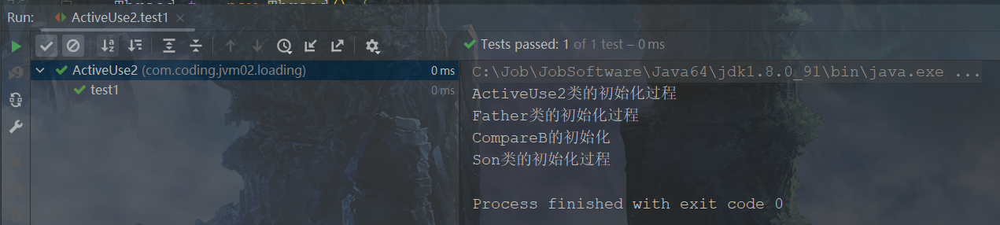

(6)JVM启动时，用户需要指定一个要执行的主类［包含main()方法的那个类］,JVM会先初始化这个主类。这个类在调用main()方法之前被链接和初始化，main()方法的执行将依次加载，链接和初始化后面需要使用到的类。

​	在ActiveUse2类中添加静态代码块和main()方法，如下代码所示。

```java
public class ActiveUse2 {

    // 当初始化子类时，如果发现其父类还没有进行过初始化，则需要先触发其父类的初始化
    // 在初始化一个类时，并不会先初始化它所实现的接口。
    // 如果一个接口定义了default方法，那么直接实现或者间接实现了该接口的类若初始化，该接口要在其之前被初始化
    @Test
    public void test1() {
        int num = Son.num;
    }

    // 在初始化一个接口时，并不会先初始化它的父接口。
    @Test
    public void test2() {
        int num2 = CompareC.NUM1;
    }

    // 当虚拟机启动时，用户需要指定一个要执行的主类（包含 main() 方法的那个类），虚拟机会先初始化这个主类
    static {
        System.out.println("ActiveUse2类的初始化过程");
    }

    public static void main(String[] args) {
        System.out.println("main() 方法执行......");
    }

}
```

​	执行main()方法，结果如下，从结果可知，在main()方法执行之前，先执行了该类的初始化。

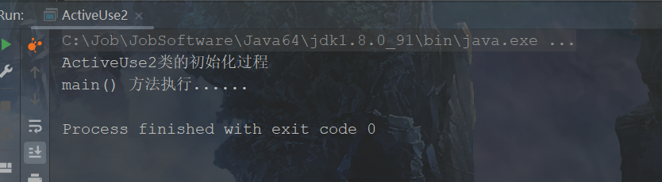

**2 被动使用**

​	除了以上的情况属于主动使用，其他的情况均属于被动使用。被动使用不会引起类的初始化。也就是说并不是在代码中出现的类，就一定会被加载或者初始化。如果不符合主动使用的条件，类就不会初始化。被动使用包含如以下几种情况。

(1)当访问一个静态字段时，只有真正声明这个字段的类才会被初始化。当通过子类引用父类的静态变量，不会导致子类初始化。

<span style="color:#40E0D0;">案例1：PassiveUse1</span>

- 代码

```java
public class PassiveUse1 {

    // 当通过子类引用父类的静态变量，不会导致子类初始化。
    @Test
    public void test1() {
        System.out.println(Child.num);
    }

    // 通过数组定义类引用，不会触发此类的初始化
    @Test
    public void test2() {
        Parent[] parents = new Parent[10];
        System.out.println(parents.getClass());
    }
    
    @Test
    public void test3() {
        Parent[] parents = new Parent[10];
        System.out.println(parents.getClass());
        parents[0] = new Parent(); // 会导致初始化
    }
}

class Parent {
    static {
        System.out.println("Parent的初始化过程");
    }

    public static int num = 1;
}

class Child extends Parent {
    static {
        System.out.println("Child的初始化过程");
    }
}
```

​	test1()方法执行结果如下，只执行了父类的初始化，没有执行子类的初始化。


(2)通过数组定义类引用，不会触发此类的初始化。

​	test2()方法执行结果如下.

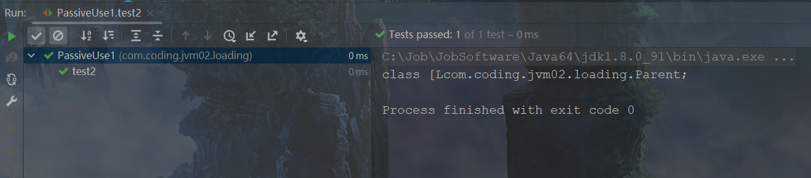

​	如果加入以下语句，则会执行类的初始化。

​	test3()方法执行结果如下。

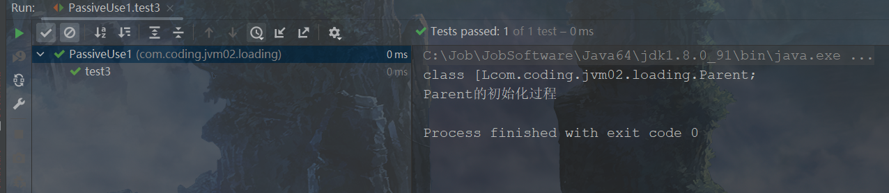

<span style="color:#40E0D0;">案例2：PassiveUse2</span>

- 代码

```java
public class PassiveUse2 {


    // 引用常量不会触发此类或接口的初始化。因为常量在链接阶段的准备环节就已经被显式赋值了
    @Test
    public void test1() {
        int num = Person.NUM;
    }

    // 引用常量不会触发此类或接口的初始化。因为常量在链接阶段的准备环节就已经被显式赋值了
    @Test
    public void test2() {
        int num1 = SerialA.NUM1;
    }

    // 调用ClassLoader类的loadClass()方法加载一个类，并不是对类的主动使用，不会导致类的初始化
    @Test
    public void test3() throws ClassNotFoundException {
        ClassLoader.getSystemClassLoader().loadClass("com.coding.jvm02.loading.Person");
    }
}

class Person {
    static {
        System.out.println("Person类的初始化");
    }

    public static final int NUM = 1;
}

interface SerialA {
    Thread t = new Thread() {
        {
            System.out.println("SerialA的初始化");
        }
    };
    int NUM1 = 1;
}
```

(3)引用常量不会触发此类或接口的初始化，因为常量在链接阶段已经被显式赋值。

​	test1()执行结果，引用常量不会触发此类或接口的初始化。因为常量在链接阶段的准备环节就已经被显式赋值了。

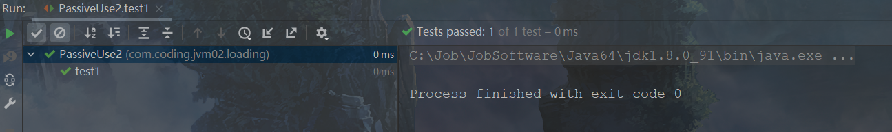

​	test2()执行结果，引用常量不会触发此类或接口的初始化。因为常量在链接阶段的准备环节就已经被显式赋值了。

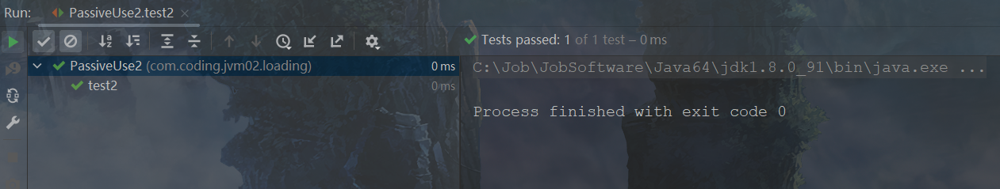

(4)调用ClassLoader类的loadClass()方法加载一个类，并不是对类的主动使用，不会导致类的初始化。

​	test3()执行结果，调用ClassLoader类的loadClass()方法加载一个类，并不是对类的主动使用，不会导致类的初始化。


## 19.5 类的使用(Using)

​	任何一个类在使用之前都必须经历过完整的加载、链接和初始化3个步骤。一旦一个类成功经历这3个步骤之后，便“万事俱备，只欠东风”，就等着开发者使用了。开发人员可以在程序中访问和调用它的静态类成员信息（比如静态字段、静态方法等），或者使用new关键字创建对象实例。

## 19.6 类的卸载(Unloading)

​	和前面讲过对象的生命周期类似，对象在使用完以后会被垃圾收集器回收，那么对应的类在使用完成以后，也有可能被卸载掉。在了解类的卸载之前，需要先厘清类、类的加载器、类的Class对象和类的实例之间的引用关系。

**1 类、类的加载器、类的Class对象、类的实例之间的引用关系**

(1)类加载器和类的Class对象之间的关系。

​	在类加载器的内部实现中，用一个Java集合来存放所加载类的引用。另外，一个Class对象总是会引用它的类加载器，调用Class对象的getClassLoader()方法，就能获得它的类加载器。由此可见，代表某个类的Class对象与该类的类加载器之间为双向关联关系。

(2)类、类的Class对象、类的实例对象之间的关系。

​	一个类的实例总是引用代表这个类的Class对象。Object类中定义了getClass()方法，这个方法返回代表实例所属类的Class对象的引用。此外，所有的Java类都有一个静态属性class，它引用代表这个类的Class对象。

**2 类的生命周期**

​	当类被加载、链接和初始化后，它的生命周期就开始了。当代表类的Class对象不再被引用，即不可触及时，Class对象就会结束生命周期，类在方法区内的数据也会被卸载，从而结束类的生命周期。一个类何时结束生命周期，取决于代表它的Class对象何时结束生命周期。

**3 案例**

​	自定义一个类加载器MyClassLoader加载自定义类Order，那么就可以通过Order的Class对象获取到对应的类加载器，再通过Order类的实例对象获取到类Class对象，如下代码所示。

<span style="color:#40E0D0;">案例1：类、类的加载器、类的Class对象、类的实例之间的引用关系</span>

- 代码

```java
        // 通过类加载器加载Order类java.lang.Class对象
        MyClassLoader myLoader = new MyClassLoader("d:/");
        Class clazz = myLoader.loadClass("Order");
        // 获取java.lang.Class对象
        Class<Order> orderClass = Order.class;
        // 获取类加载器
        ClassLoader classLoader = orderClass.getClassLoader();
        // 通过实例对象获取java.lang.Class对象
        Order order = new Order();
        Class<? extends Order> aClass = order.getClass();
```

​	类、类的加载器、类的Class对象、类的实例之间的引用关系如下图所示。

<div style="text-align:center;font-weight:bold;">类、类的加载器、类的Class对象类的实例之间的引用关系</div>

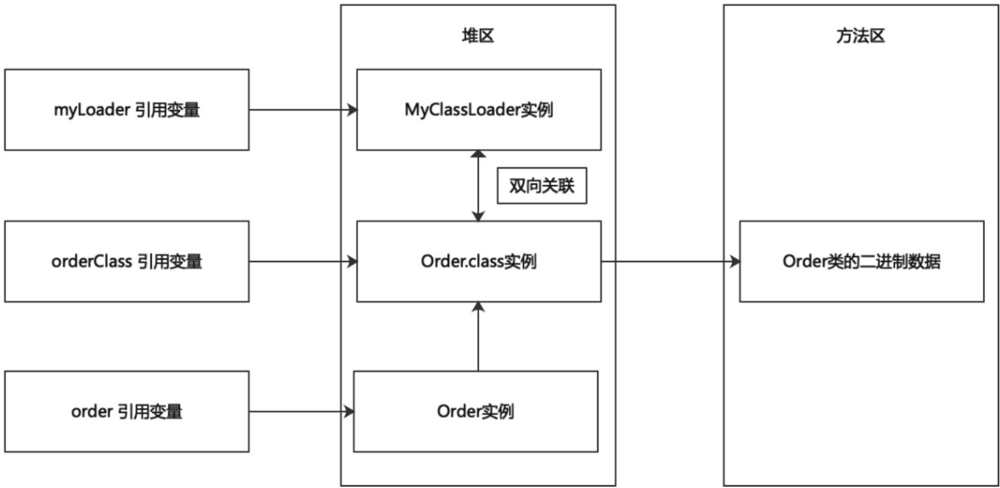

​	myLoader变量和order变量间接引用代表Order类的Class对象，而orderClass变量则直接引用代表Order类的Class对象。如果程序运行过程中，将上图左侧三个引用变量都置为null，此时Order对象结束生命周期，myLoader对象结束生命周期，代表Order类的Class对象也结束生命周期，Order类在方法区内的二进制数据被卸载。当再次有需要时，会检查Order类的Class对象是否存在，如果存在会直接使用，不再重新加载；如果不存在Order类会被重新加载，在JVM的堆区会生成一个新的代表Order类的Class实例。

**4 类的卸载**

​	通过上面的案例可以知道当类对象没有引用时，可能会产生类的卸载，类的卸载需要满足如下三个条件。

(1)该类所有的实例已经被回收。

(2)加载该类的类加载器的实例已经被回收。

(3)该类对应的Class对象没有在任何地方被引用。

​	但是需要注意，并不是所有类加载器下面的类都可以被卸载，Java自带的三种类加载器的实例是不可以被卸载的，所以它们加载的类在整个运行期间是不可以被卸载的，只有被开发者自定义的类加载器实例加载的类才有可能被卸载。一个已经加载的类被卸载的概率很小，至少被卸载的时间是不确定的。开发者在开发代码的时候，不应该对虚拟机的类卸载做任何假设，在此前提下，再来实现系统中的特定功能。

**5 回顾：方法区的垃圾回收**

​	方法区的垃圾收集主要回收两部分内容，分别是常量池中废弃的常量和不再使用的类。HotSpot虚拟机对常量池的回收策略是很明确的，只要常量池中的常量没有被任何地方引用，就可以被回收。

​	JVM判定一个常量是否“废弃”还相对简单，而要判定一个类是否属于“不再被使用的类”的条件就比较苛刻了，需要同时满足下面三个条件。

(1)该类所有的实例都已经被回收。也就是Java堆中不存在该类及其任何派生子类的实例。

(2)加载该类的类加载器已经被回收。这个条件除非是经过精心设计的可替换类加载器的场景，如OSGi、JSP的重加载等，否则通常是很难达成的。

(3)该类对应的java.lang.Class对象没有在任何地方被引用，无法在任何地方通过反射访问该类的方法。

​	上述三个条件并不是JVM卸载无用类的必要条件，JVM可以卸载类也可以不卸载类，不会像对象那样没有引用就肯定回收。

# 第20章 类加载器

​	前面的章节讲解了类的装载过程，其中第一个阶段是加载环节。在Java语言中，实现该环节的工具就是类加载器(ClassLoader)。本章将详细介绍类加载器的相关知识。

## 20.1 概述

​	类加载器从文件系统或者网络中加载class文件到JVM内部，至于class文件是否可以运行，则由执行引擎决定，类加载器将加载的类信息存放到方法区。类加载器在整个装载阶段，只能影响到类的加载，而无法改变类的链接和初始化行为。它最早出现在Java 1.0版本中，当时主要为了满足Java Applet应用的需要，虽然目前JavaApplet应用极少，但类加载器并没有随之消失不见，相反类加载器在OSGi、热部署等领域依然应用广泛。这主要是因为JVM没有将所有的类加载器绑定在JVM内部，这样做的好处就是能够更加灵活和动态地执行类加载操作。

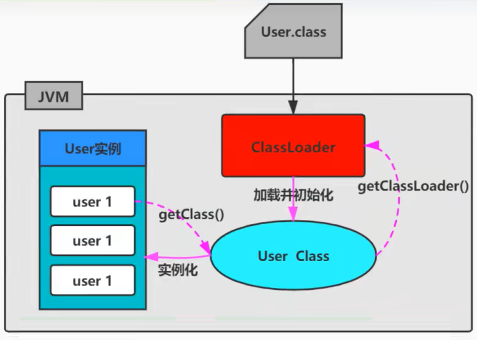

### 20.1.1 类加载的分类

​	类的加载分为显式加载和隐式加载两种类型。显式加载指的是在代码中通过类加载器的方法加载class对象，如直接使用Class.forName(name)或this.getClass().getClassLoader().loadClass()加载class对象。隐式加载则是不直接在代码中调用类加载器的方法加载class文件，而是通过JVM自动加载到内存中，如在加载某个类的class文件时，该类的class文件中引用了另外一个类的对象，此时额外引用的类将通过JVM自动加载到内存中。在日常开发中以上两种方式一般会混合使用。

### 20.1.2 类加载器的必要性

​	一般情况下，Java开发人员并不需要在程序中显式地使用类加载器，但是了解类加载器的加载机制却显得至关重要。主要原因有以下几个方面。

(1)避免在开发中遇到java.lang.ClassNotFoundException异常或java.lang.NoClassDefFoundError异常时手足无措。

(2)只有了解类加载器的加载机制，才能够在出现异常的时候快速地根据错误异常日志定位并解决问题。

(3)需要支持类的动态加载或需要对编译后的class文件进行加解密操作时，就需要与类加载器打交道。

(4)开发人员可以在程序中编写自定义类加载器来重新定义类的加载规则，以便实现一些自定义的处理逻辑。

### 20.1.3 命名空间

​	对于任意一个类，都需要<span style="color:red;font-weight:bold;">由加载它的类加载器和这个类本身一同确认其在JVM中的唯一性</span>。每个类加载器都有自己的命名空间，<span style="color:red;font-weight:bold;">命名空间由该类加载器及所有的父类加载器组成</span>，在同一命名空间中，不会出现类的完整名字（包括类的包名）相同的两个类；在不同的命名空间中，有可能会出现类的完整名字（包括类的包名）相同的两个类；在大型应用中，我们往往借助这一特性，来运行同一个类的不同版本。

### 20.1.4 类加载机制的基本特征

​	通常类加载机制有三个基本特征，分别是双亲委派模型、可见性和单一性。

**1 双亲委派模型**

​	如果一个类加载器在接到加载类的请求时，它首先不会自己尝试去加载这个类，而是把这个请求任务委托给父类加载器去完成，依次递归，如果父类加载器可以完成类加载任务，就成功返回。只有父类加载器无法完成此加载任务时，才自己去加载。详细讲解见20.6节。

**2 可见性**

​	子类加载器可以访问父类加载器加载的类型，但是反过来是不允许的。不然，因为缺少必要的隔离，就没有办法利用类加载器去实现容器的逻辑。

**3 单一性**

​	由于父类加载器的类型对于子类加载器是可见的，所以父类加载器中加载过的类型，就不会在子加载器中重复加载。但是注意，同一个类仍然可以被同级别的类加载器加载多次，因为互相并不可见。

## 20.2 类加载器分类

​	JVM支持两种类型的类加载器，分别为启动类加载器(Bootstrap ClassLoader)和自定义类加载器(User-Defined ClassLoader)。从概念上来讲，自定义类加载器一般指的是程序中由开发人员自定义的一类类加载器，但是Java虚拟机规范却没有这么定义，而是将所有派生于抽象类ClassLoader的类加载器都划分为自定义类加载器。无论类加载器的类型如何划分，在程序中我们最常见的类加载器结构如下图所示，其中扩展类加载器和应用程序类由抽象类ClassLoader派生而来。

<div style="text-align:center;font-weight:bold;">类加载器结构</div>


​	<span style="color:#9400D3;font-weight:bold;">除了顶层的启动类加载器，其余的类加载器都应当有自己的“父类”加载器。不同类加载器看似是继承关系，实际上是聚合关系</span>。在下层加载器中，包含着上层加载器的引用，也就是说应用程序类加载器并不是扩展类加载器的子类。如下代码所示，展示了类加载器直接的包含关系，定义了ParentClassLoader和ChildClassLoader两个类继承抽象类ClassLoader。习惯上把ChildClassLoader称为子类加载器，ParentClassLoader称为父类加载器，但是它们之间并不是继承关系，而是在构造子类的时候以参数的形式传入ParentClassLoader而已，在实例化ChildClassLoader时，构造器形参使用ParentClassLoader实例进行赋值，给属性初始化。虽然说法上称为父类加载器，但是却不是继承关系，大家需要注意这一点。

<span style="color:#40E0D0;">案例1：类加载器的包含关系</span>

- 代码

```java
/**
 * 类加载器的包含关系
 */
public abstract class ClassLoader {
    private final ClassLoader parent; // 父类加载器
    protected ClassLoader(ClassLoader parent) {
        this(checkCreateClassLoader(), parent);
    }
}

class ParentClassLoader extends ClassLoader {
    public ParentClassLoader(ClassLoader parent) {
        super(parent);
    }
}

class ChildClassLoader extends ParentClassLoader {
    public ChildClassLoader(ClassLoader parent) {
        // parent = new ParentClassLoader();
        super(parent);
    }
}
```

### 20.2.1 引导类加载器

​	引导类加载器（BootstrapClassLoader，又称启动类加载器）使用C/C++语言实现，嵌套在JVM内部。引导类加载器不继承java.lang.ClassLoader，没有父类加载器。出于安全考虑，引导类加载器主要用来加载Java的核心库，也就是“JAVA_HOME/jre/lib/rt.jar”或“<span style="color:#FF1493;font-weight:bold;">sun.boot.class.path</span>”路径下的内容，指定为扩展类和应用程序类加载器的父类加载器。使用-XX:+TraceClassLoading参数可以得到类加载器加载了哪些类，注意该参数只能得到所有加载器加载的全部类文件，不能得到各个加载器加载了什么类。查看引导类加载器加载的类文件，如下代码所示。

<span style="color:#40E0D0;">案例1：引导类加载器加载范围</span>

- 代码

```java
package com.coding.jvm02.classloader;

/**
 * 查看引导类加载器加载范围
 */
public class BootStrapClassLoaderTest {
    public static void main(String[] args) {
        String pathBoot = System.getProperty("sun.boot.class.path");
        System.out.println("BootStrapClassLoader 加载范围 开始 --------");
        System.out.println(pathBoot.replaceAll(";", System.lineSeparator()));
        System.out.println("BootStrapClassLoader 加载范围 结束 --------");
    }
}
```

​	运行结果如下。

```
BootStrapClassLoader 加载范围 开始 --------
C:\Job\JobSoftware\Java64\jdk1.8.0_91\jre\lib\resources.jar
C:\Job\JobSoftware\Java64\jdk1.8.0_91\jre\lib\rt.jar
C:\Job\JobSoftware\Java64\jdk1.8.0_91\jre\lib\sunrsasign.jar
C:\Job\JobSoftware\Java64\jdk1.8.0_91\jre\lib\jsse.jar
C:\Job\JobSoftware\Java64\jdk1.8.0_91\jre\lib\jce.jar
C:\Job\JobSoftware\Java64\jdk1.8.0_91\jre\lib\charsets.jar
C:\Job\JobSoftware\Java64\jdk1.8.0_91\jre\lib\jfr.jar
C:\Job\JobSoftware\Java64\jdk1.8.0_91\jre\classes
BootStrapClassLoader 加载范围 结束 --------
```

​	引导类加载器加载了如上路径的类文件。

### 20.2.2 扩展类加载器

​	扩展类加载器(ExtensionClassLoader)由Java语言编写，该类的全路径名为sun.misc.Launcher$ExtClassLoader,ExtClassLoader是Launcher类的内部类，间接继承于ClassLoader类，父类加载器为启动类加载器，类的继承关系如下图所示。扩展类加载器主要负责从<span style="color:#FF1493;font-weight:bold;">java.ext.dirs</span>系统属性所指定的目录或者JDK的安装目录的jre/lib/ext子目录下加载类库。如果用户创建的类放在上述目录下，也会自动由扩展类加载器加载。简言之扩展类加载器主要负责加载Java的扩展库。

<div style="text-align:center;font-weight:bold;">扩展类加载器继承关系</div>

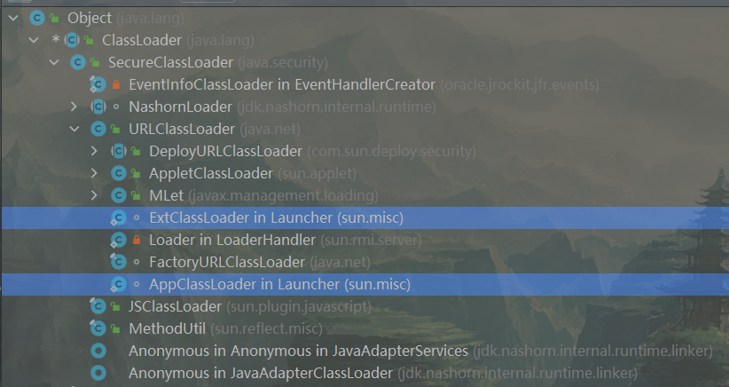

​	查看扩展加载器加载的类文件，如下代码所示。

<span style="color:#40E0D0;">案例1：扩展类加载器加载范围</span>

- 代码

```java
package com.coding.jvm02.classloader;

/**
 * 查看扩展类加载器加载范围
 */
public class ExtClassLoaderTest {
    public static void main(String[] args) {
        String pathExt = System.getProperty("java.ext.dirs");
        System.out.println("ExtClassLoader 加载范围 开始 --------");
        System.out.println(pathExt.replaceAll(";", System.lineSeparator()));
        System.out.println("ExtClassLoader 加载范围 结束 --------");
    }
}
```

​	运行结果如下。

```
ExtClassLoader 加载范围 开始 --------
C:\Job\JobSoftware\Java64\jdk1.8.0_91\jre\lib\ext
C:\Windows\Sun\Java\lib\ext
ExtClassLoader 加载范围 结束 --------
```

​	扩展类加载器加载了如上路径的类文件，如下所示。

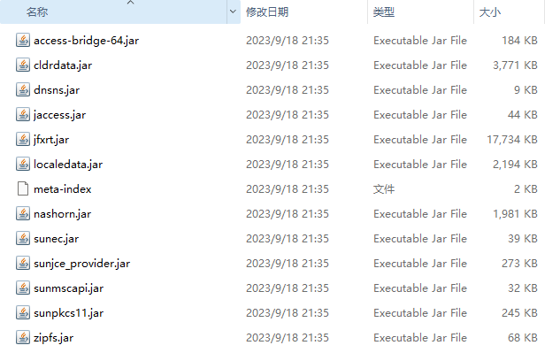

### 20.2.3 应用程序类加载器

​	应用程序类加载器(AppClassLoader)和扩展类加载器一样也是由Java语言编写，该类的全路径名为sun.misc.Launcher$AppClassLoader，间接继承于ClassLoader类，父类加载器为扩展类加载器，应用程序类加载器也称系统类加载器。它负责加载环境变量classpath或系统属性<span style="color:#FF1493;font-weight:bold;">java.class.path</span>指定路径下的类库，应用程序中的类加载器默认是应用程序类加载器。它是用户自定义类加载器的默认父类加载器，通过ClassLoader的getSystemClassLoader()方法可以获取到该类加载器。查看应用类加载器加载的类文件，如下代码所示。

<span style="color:#40E0D0;">案例1：应用类加载器加载范围</span>

- 代码

```java
package com.coding.jvm02.classloader;

/**
 * 查看应用类加载器加载范围
 */
public class AppClassLoaderTest {
    public static void main(String[] args) {
        String pathApp = System.getProperty("java.class.path");
        System.out.println("AppClassLoader 加载范围 开始 --------");
        System.out.println(pathApp.replaceAll(";", System.lineSeparator()));
        System.out.println("AppClassLoader 加载范围 结束 --------");
    }
}
```

​	运行结果如下。

```
AppClassLoader 加载范围 开始 --------
C:\Job\JobSoftware\Java64\jdk1.8.0_91\jre\lib\charsets.jar
C:\Job\JobSoftware\Java64\jdk1.8.0_91\jre\lib\deploy.jar
C:\Job\JobSoftware\Java64\jdk1.8.0_91\jre\lib\ext\access-bridge-64.jar
C:\Job\JobSoftware\Java64\jdk1.8.0_91\jre\lib\ext\cldrdata.jar
C:\Job\JobSoftware\Java64\jdk1.8.0_91\jre\lib\ext\dnsns.jar
C:\Job\JobSoftware\Java64\jdk1.8.0_91\jre\lib\ext\jaccess.jar
C:\Job\JobSoftware\Java64\jdk1.8.0_91\jre\lib\ext\jfxrt.jar
C:\Job\JobSoftware\Java64\jdk1.8.0_91\jre\lib\ext\localedata.jar
C:\Job\JobSoftware\Java64\jdk1.8.0_91\jre\lib\ext\nashorn.jar
C:\Job\JobSoftware\Java64\jdk1.8.0_91\jre\lib\ext\sunec.jar
C:\Job\JobSoftware\Java64\jdk1.8.0_91\jre\lib\ext\sunjce_provider.jar
C:\Job\JobSoftware\Java64\jdk1.8.0_91\jre\lib\ext\sunmscapi.jar
C:\Job\JobSoftware\Java64\jdk1.8.0_91\jre\lib\ext\sunpkcs11.jar
C:\Job\JobSoftware\Java64\jdk1.8.0_91\jre\lib\ext\zipfs.jar
C:\Job\JobSoftware\Java64\jdk1.8.0_91\jre\lib\javaws.jar
C:\Job\JobSoftware\Java64\jdk1.8.0_91\jre\lib\jce.jar
C:\Job\JobSoftware\Java64\jdk1.8.0_91\jre\lib\jfr.jar
C:\Job\JobSoftware\Java64\jdk1.8.0_91\jre\lib\jfxswt.jar
C:\Job\JobSoftware\Java64\jdk1.8.0_91\jre\lib\jsse.jar
C:\Job\JobSoftware\Java64\jdk1.8.0_91\jre\lib\management-agent.jar
C:\Job\JobSoftware\Java64\jdk1.8.0_91\jre\lib\plugin.jar
C:\Job\JobSoftware\Java64\jdk1.8.0_91\jre\lib\resources.jar
C:\Job\JobSoftware\Java64\jdk1.8.0_91\jre\lib\rt.jar
C:\Job\JobResource\IdeaProjects\backend-jvm-learning\jvm-02-classloader\target\classes
C:\Job\JobResource\local-repository\junit\junit\4.6\junit-4.6.jar
C:\Job\JobResource\local-repository\org\projectlombok\lombok\1.18.30\lombok-1.18.30.jar
C:\Job\JobSoftware\JetBrains\IntelliJ IDEA 2022.1.3\lib\idea_rt.jar
AppClassLoader 加载范围 结束 --------
```

​	从结果可以看出，一部分内容是由扩展类加载器加载的，这是因为IntelliJ IDEA工具中的CLASSPATH值如下图所示，所以应用程序类加载器的加载范围才会输出下面的结果。

<div style="text-align:center;font-weight:bold;">IntelliJ IDEA工具的CLASSPATH</div>

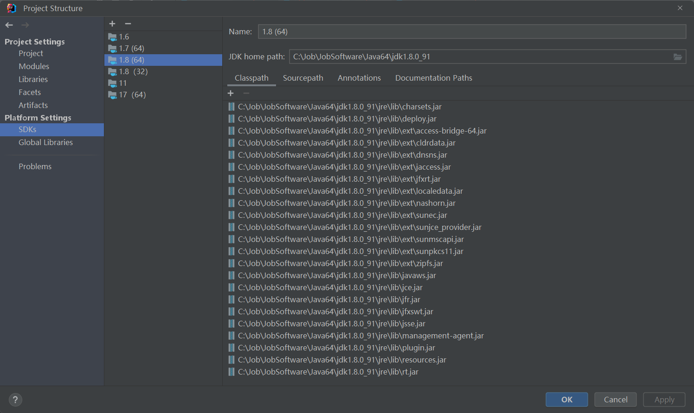

​	而直接在命令行中编译执行时，应用程序类加载器的加载路径就是环境变量CLASSPATH的值，如下图所示，运行结果表示只加载当前路径下的类文件。


### 20.2.4 自定义类加载器

​	在Java的日常应用程序开发中，类的加载几乎是由前面讲解的3种类加载器相互配合执行的。必要时，还可以自定义类加载器来定制类的加载方式。体现Java语言强大生命力和巨大魅力的关键因素之一便是Java开发者可以自定义类加载器来实现类库的动态加载，加载源可以是本地的JAR包，也可以是网络上的远程资源。以下是自定义类加载器的好处。

(1)插件机制。

​	通过类加载器可以实现非常绝妙的插件机制，这方面的实际应用案例不胜枚举。例如，著名的OSGi组件框架，再如Eclipse的插件机制。类加载器为应用程序提供了一种动态增加新功能的机制，这种机制无须重新打包发布应用程序就能实现。

(2)隔离加载类。

​	在某些框架内进行中间件与应用的模块隔离，把类加载到不同的环境中。比如Tomcat这类Web应用服务器，内部自定义了好几种类加载器，用于隔离同一个Web应用服务器上的不同应用程序。再比如两个模块依赖某个类库的不同版本，如果分别被不同的类加载器加载，就可以互不干扰。

(3)修改类加载的方式。

​	类的加载模型并非强制，除引导类加载器外，其他的类加载器并非一定要引入，或者根据实际情况在某个时间点进行按需进行动态加载。

(4)扩展加载源。

​	应用需要从不同的数据源获取类定义信息，例如网络数据源，而不是本地文件系统。或者是需要自己操纵字节码，动态修改或者生成类型。

(5)提高程序安全性。

​	在一般情况下，使用不同的类加载器去加载不同的功能模块，会提高应用程序的安全性。但是，如果涉及Java类型转换，则加载器反而容易产生不美好的事情。在做Java类型转换时，只有两个类型都是由同一个加载器所加载，才能进行类型转换，否则转换时会发生异常。

​	用户通过定制自己的类加载器，可以重新定义类的加载规则，以便实现一些自定义的处理逻辑。

## 20.3 获取不同的类加载器

​	每个对象都会包含一个定义它的类加载器的一个引用。获取类加载器的途径方式如下表所示。

<div style="text-align:center;font-weight:bold;">多种获取类加载器方式</div>

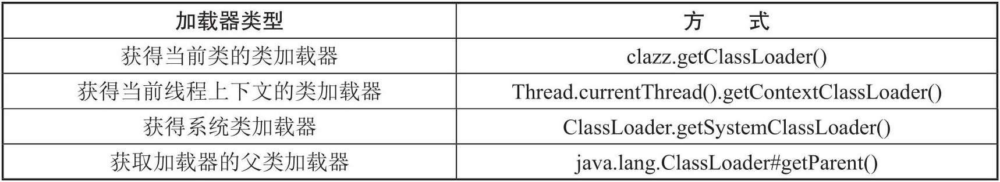

​	具体操作如下代码所示。

<span style="color:#40E0D0;">案例1：获取类加载器</span>

- 代码

```java
package com.coding.jvm02.classloader;

public class ClassLoaderTest {
    public static void main(String[] args) {
        // 获取当前类的类加载器 sun.misc.Launcher$AppClassLoader@18b4aac2
        ClassLoader classLoader = ClassLoaderTest.class.getClassLoader();
        System.out.println("获取当前类的类加载器=" + classLoader);
        // 获取当前线程的上下文加载器 sun.misc.Launcher$AppClassLoader@18b4aac2
        ClassLoader contextClassLoader = Thread.currentThread().getContextClassLoader();
        System.out.println("获取当前线程的上下文加载器=" + contextClassLoader);
        // 获取系统类加载器 sun.misc.Launcher$AppClassLoader@18b4aac2
        ClassLoader systemClassLoader = ClassLoader.getSystemClassLoader();
        System.out.println("获取系统类加载器=" + systemClassLoader);
        // 获取扩展类加载器 sun.misc.Launcher$ExtClassLoader@14ae5a5
        ClassLoader extClassLoader = systemClassLoader.getParent();
        System.out.println("获取扩展类加载器=" + extClassLoader);
        // 获取引导类加载器 null
        ClassLoader bootstrapClassLoader = extClassLoader.getParent();
        System.out.println("获取引导类加载器=" + bootstrapClassLoader);
    }
}
```

​	运行结果如下。

```
获取当前类的类加载器=sun.misc.Launcher$AppClassLoader@18b4aac2
获取当前线程的上下文加载器=sun.misc.Launcher$AppClassLoader@18b4aac2
获取系统类加载器=sun.misc.Launcher$AppClassLoader@18b4aac2
获取扩展类加载器=sun.misc.Launcher$ExtClassLoader@14ae5a5
获取引导类加载器=null
```

​	需要注意的是，引导类加载器结果为null，原因是引导类加载器是C++语言编写，并不是一个java对象，所以这里用null展示。

​	数组类的Class对象，不是由类加载器创建的，而是在Java运行期JVM根据需要自动创建的。数组类的类加载器可以通过Class.getClassLoader()方法返回，如果数组元素是引用数据类型，类加载器与数组当中元素类型相同，如果数组元素类型是基本数据类型，数组类没有类加载器，如下代码所示。

<span style="color:#40E0D0;">案例2：获取数组类加载器</span>

- 代码

```java
package com.coding.jvm02.classloader;

public class ClassLoaderTest {
    public static void main(String[] args) {
        // String类使用引导类加载器进行加载的 ---> Java的核心类库都是使用引导类加载器进行加载的
        ClassLoader stringClassLoader = String.class.getClassLoader();
        System.out.println(stringClassLoader); // null
        try {
            ClassLoader stringForNameClassLoader = Class.forName("java.lang.String").getClassLoader();
            System.out.println(stringForNameClassLoader); // null
        } catch (ClassNotFoundException e) {
            e.printStackTrace();
        }


        // 关于数组类型的加载：使用的类加载器与元素的类加载器相同
        String[] strArr = new String[6];
        System.out.println(strArr.getClass()); // class [Ljava.lang.String;
        System.out.println(strArr.getClass().getClassLoader()); // null 表示使用的是引导类加载器

        ClassLoaderTest[] arr = new ClassLoaderTest[6]; // class [Lcom.coding.jvm02.classloader.ClassLoaderTest;
        System.out.println(arr.getClass());
        System.out.println(arr.getClass().getClassLoader()); // sun.misc.Launcher$AppClassLoader@18b4aac2 表示使用的是系统类加载器

        int[] arr2 = new int[6];
        System.out.println(arr2.getClass().getClassLoader()); // null 表示没有类加载器
    }
}

```

​	运行结果如下。

```
null
null
class [Ljava.lang.String;
null
class [Lcom.coding.jvm02.classloader.ClassLoaderTest;
sun.misc.Launcher$AppClassLoader@18b4aac2
null
```

​	前2个null，表示String等Java的核心类库都是使用引导类加载器进行加载的。

​	后面2个null中，第一个null表示引导类加载器，第二个null表示当数组中元素为基本数据类型时，结果也为null，但是第二个null表示的含义是没有类加载器，而不是引导类加载器。

## 20.4 类加载器源码解析

​	前面我们多次提到了抽象类java.lang.ClassLoader，该类在类加载中起着至关重要的作用，除了引导类加载器之外，其他的类加载器都需要继承它，所以对该类的源码学习就显得尤为重要。ClassLoader与JVM提供的类加载器关系如下图所示。

<div style="text-align:center;font-weight:bold;">类加载器关系图</div>

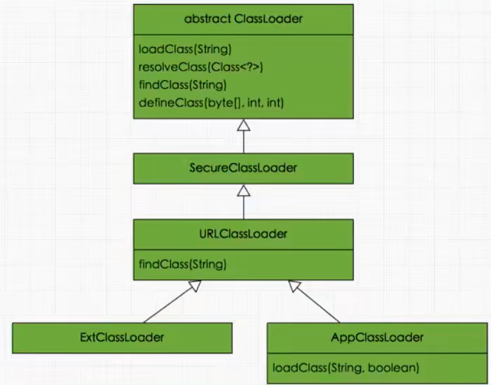

​	从上图中可以看到ClassLoader类位于所有类加载器的顶层，20.3节讲述了通过ClassLoader.getSystemClassLoader()来获得系统类加载器，下面讲述其获取过程。

(1)通过ClassLoader.getSystemClassLoader()进入源码分析，如下所示。

```java
public static void main(String[] args) {
    // 1. 获取 classLoader 的方法
    ClassLoader systemClassLoader = ClassLoader.getSystemClassLoader();
}
```

(2)进入getSystemClassLoader()方法，如下所示，其中需要重点关注initSystemClassLoader()方法。

```java
    @CallerSensitive
    public static ClassLoader getSystemClassLoader() {
        initSystemClassLoader();
        if (scl == null) {
            return null;
        }
        SecurityManager sm = System.getSecurityManager();
        if (sm != null) {
            checkClassLoaderPermission(scl, Reflection.getCallerClass());
        }
        return scl;
    }
```

(3)initSystemClassLoader()方法的作用是对应用程序类加载器进行初始化，代码如下。

```java
	// 初始化系统加载器，包括初始化父类加载器
	private static synchronized void initSystemClassLoader() {
        // boolean类型的静态变量，标记是否被初始化了，解决并发问题
        if (!sclSet) {
            if (scl != null)
                throw new IllegalStateException("recursive invocation");
            // 获取 Launcher 类实例，加载器都是它的内部类，直接去看 Launcher 源码
            sun.misc.Launcher l = sun.misc.Launcher.getLauncher();
            if (l != null) {
                Throwable oops = null;
                // scl为classLoader内部的缓存静态变量，存储系统类加载器
                scl = l.getClassLoader();
                try {
                    // 是否用户指定了默认的加载类 System.getProperty("java.system.class.loader")
                    scl = AccessController.doPrivileged(
                        new SystemClassLoaderAction(scl));
                } catch (PrivilegedActionException pae) {
                    oops = pae.getCause();
                    if (oops instanceof InvocationTargetException) {
                        oops = oops.getCause();
                    }
                }
                if (oops != null) {
                    if (oops instanceof Error) {
                        throw (Error) oops;
                    } else {
                        // wrap the exception
                        throw new Error(oops);
                    }
                }
            }
            // 初始化完毕
            sclSet = true;
        }
    }
```

​	通过获取Launcher类实例的代码直接跳转到Launcher类的源码，如下。

```java
// Launcher的部分源代码
public class Launcher {
    private static URLStreamHandlerFactory factory = new Factory();
    private static Launcher launcher = new Launcher();
    private static String bootClassPath = System.getProperty("sun.boot.class.path");
    // 定义类加载器
    private ClassLoader loader;
    private static URLStreamHandler fileHandler;
	// 返回类加载器
    public static Launcher getLauncher() {
        return launcher;
    }
    
    // 构造方法
    public Launcher() {
        // 1.创建ExtClassLoader
        ExtClassLoader var1;
        try {
            var1 = Launcher.ExtClassLoader.getExtClassLoader();
        } catch (IOException var10) {
            throw new InternalError("Could not create extension class loader", var10);
        }

        // 2.用ExtClassLoader作为parent去创建AppClassLoader
        try {
            this.loader = Launcher.AppClassLoader.getAppClassLoader(var1);
        } catch (IOException var9) {
            throw new InternalError("Could not create application class loader", var9);
        }

        // 3.设置AppClassLoader为ContextClassLoader
        Thread.currentThread().setContextClassLoader(this.loader);
		// ......
    }
	// 定义内部类扩展类加载器ExtClassLoader
    static class ExtClassLoader extends URLClassLoader {
        public static ExtClassLoader getExtClassLoader() throws IOException {
            final File[] var0 = getExtDirs();
            return new ExtClassLoader(var0);
        }
        public ExtClassLoader(File[] var1) throws IOException {
            super(getExtURLs(var1), (ClassLoader)null, Launcher.factory);
        }
        private static File[] getExtDirs() {
            String var0 = System.getProperty("java.ext.dirs");
            File[] var1;
            ......
            return var1;
        }
    }
    // 定义内部类系统类加载器AppClassLoader
    static class AppClassLoader extends URLClassLoader {
        public static ClassLoader getAppClassLoader(final ClassLoader var0) throws IOException {
            final String var1 = System.getProperty("java.class.path");
            final File[] var2 = var1 == null ? new File[0] : Launcher.getClassPath(var1);
            URL[] var1x = var1 == null ? new URL[0] : Launcher.pathToURLs(var2);
            return new AppClassLoader(var1x, var0);
        }
        AppClassLoader(URL[] var1, ClassLoader var2) {
            super(var1, var2, Launcher.factory);
        }
        public Class<?> loadClass(String var1, boolean var2) throws ClassNotFoundException {
            int var3 = var1.lastIndexOf(46);
            if (var3 != -1) {
                SecurityManager var4 = System.getSecurityManager();
                if (var4 != null) {
                    var4.checkPackageAccess(var1.substring(0, var3));
                }
            }
            return super.loadClass(var1, var2);
        }
    }
```

​	Launcher源码里定义了static类型的扩展类加载器ExtClassLoader和static类型的系统类加载器AppClassLoader。

​	如下面代码所示，在ExtClassLoader构造器里，并没有指定parent，或者说ExtClassLoader的parent为null。因为ExtClassLoader的parent是BootstrapLoader，而BootstrapLoader不存在于Java API里，只存在于JVM里，我们是看不到的，所以请正确理解“ExtClassLoader的parent为null”的含义。

```java
        public ExtClassLoader(File[] var1) throws IOException {
            super(getExtURLs(var1), (ClassLoader)null, Launcher.factory);
        }
```

​	如下面代码所示，在AppClassLoader构造器里有了parent。实例化AppClassLoader的时候，传入的parent就是一个ExtClassLoader实例。

```java
        AppClassLoader(URL[] var1, ClassLoader var2) {
            super(var1, var2, Launcher.factory);
        }
```

​	Launcher的构造方法如下。

```java
    // 构造方法
    public Launcher() {
        // 1.创建ExtClassLoader
        ExtClassLoader var1;
        try {
            var1 = Launcher.ExtClassLoader.getExtClassLoader();
        } catch (IOException var10) {
            throw new InternalError("Could not create extension class loader", var10);
        }

        // 2.用ExtClassLoader作为parent去创建AppClassLoader
        try {
            this.loader = Launcher.AppClassLoader.getAppClassLoader(var1);
        } catch (IOException var9) {
            throw new InternalError("Could not create application class loader", var9);
        }

        // 3.设置AppClassLoader为ContextClassLoader
        Thread.currentThread().setContextClassLoader(this.loader);
		// ......
    }
```

​	首先，实例化ExtClassLoader，从java.ext.dirs系统变量里类加载路径，也说明了为什么扩展类加载器加载的路径是java.ext.dirs，如下。

```java
        private static File[] getExtDirs() {
            // 这里说明了为什么扩展类加载器加载的路径是“java.ext.dirs”
            String var0 = System.getProperty("java.ext.dirs");
            File[] var1;
            if (var0 != null) {
                StringTokenizer var2 = new StringTokenizer(var0, File.pathSeparator);
                int var3 = var2.countTokens();
                var1 = new File[var3];

                for(int var4 = 0; var4 < var3; ++var4) {
                    var1[var4] = new File(var2.nextToken());
                }
            } else {
                var1 = new File[0];
            }

            return var1;
        }
```

​	通过ExtClassLoader作为parent去实例化AppClassLoader，从java.class.path系统变量里获得类加载路径，如下所示。

```java
        public static ClassLoader getAppClassLoader(final ClassLoader var0) throws IOException {
			// 应用类加载器获取加载目录
            final String var1 = System.getProperty("java.class.path");
            final File[] var2 = var1 == null ? new File[0] : Launcher.getClassPath(var1);
            return (ClassLoader)AccessController.doPrivileged(new PrivilegedAction<AppClassLoader>() {
                public AppClassLoader run() {
                    URL[] var1x = var1 == null ? new URL[0] : Launcher.pathToURLs(var2);
                    return new AppClassLoader(var1x, var0);
                }
            });
        }
```

​	最终Launcher getClassLoader()返回的就是AppClassLoader。以上便是获取类加载器源码的分析。

### 20.4.1 ClassLoader的主要方法

​	抽象类ClassLoader的主要方法（内部没有抽象方法）如下。

1、public final ClassLoader getParent()

​	该方法作用是返回该类加载器的父类加载器

2、public Class<?>loadClass(String name)throws ClassNotFoundException

​	该方法作用是加载名称为name的类，返回结果为java.lang.Class类的实例。如果找不到类，则抛出“ClassNotFoundException”异常。该方法中的逻辑就是双亲委派模型（见20.6节）的实现，该方法详细解析如下。

```java
	// resolve:true-加载class的同时进行解析操作。
	protected Class<?> loadClass(String name, boolean resolve)
        throws ClassNotFoundException
    {
        // 同步操作，保证只能加载一次。
        synchronized (getClassLoadingLock(name)) {
            // 首先，在缓存中判断是否已经加载同名的类。
            // First, check if the class has already been loaded
            Class<?> c = findLoadedClass(name);
            if (c == null) {
                long t0 = System.nanoTime();
                try {
                    // 获取当前类加载器的父类加载器。
                    if (parent != null) {
                        // 如果存在父类加载器，则调用父类加载器进行类的加载
                        c = parent.loadClass(name, false);
                    } else {
                        // parent为null：父类加载器是引导类加载器
                        c = findBootstrapClassOrNull(name);
                    }
                } catch (ClassNotFoundException e) {
                    // ClassNotFoundException thrown if class not found
                    // from the non-null parent class loader
                }

                // 当前类加载器的父类加载器未加载此类或者当前类加载器未加载此类
                if (c == null) {
                    // If still not found, then invoke findClass in order
                    // to find the class.
                    long t1 = System.nanoTime();
                    // 调用当前ClassLoader的findClass()
                    c = findClass(name);

                    // this is the defining class loader; record the stats
                    sun.misc.PerfCounter.getParentDelegationTime().addTime(t1 - t0);
                    sun.misc.PerfCounter.getFindClassTime().addElapsedTimeFrom(t1);
                    sun.misc.PerfCounter.getFindClasses().increment();
                }
            }
            if (resolve) { // 是否进行解析操作
                resolveClass(c);
            }
            return c;
        }
    }
}
```

​	可以发现调用类加载方法时，先从缓存中查找该类对象，如果存在直接返回；如果不存在则交给当前类加载器的父类加载器去加载，最终交给引导类加载器去加载该类。如果还没有找到则调用findClass()方法，关于findClass()方法稍后介绍。

3、protected Class<?>findClass(String name)throwsClassNotFoundException

​	上面讲了loadClass(String name,boolean resolve)方法中会调用findClass(name)方法作为兜底逻辑。该方法作用是查找二进制名称为name的类，返回结果为java.lang.Class类的实例。这是一个受保护的方法，<span style="color:#FF1493;font-weight:bold;">JVM建议自定义类加载器的时候重写此方法使得自定义类加载器遵循双亲委托机制</span>，该方法会在检查完父类加载器之后被loadClass()方法调用。

​	在JDK1.2之前，在自定义类加载时，总会去继承ClassLoader类并重写loadClass()方法，从而实现自定义的类加载类。但是在JDK1.2之后已不再建议用户去覆盖loadClass()方法，而是建议把自定义的类加载逻辑写在findClass()方法中。从前面的分析可知，findClass()方法是在loadClass()方法中被调用的，当loadClass()方法中父类加载器加载失败后，则会调用自己的findClass()方法来完成类加载，这样就可以保证自定义的类加载器也符合双亲委托模型。

​	需要注意的是ClassLoader类中并没有实现findClass()方法的具体代码逻辑，取而代之的是抛出ClassNotFoundException异常，同时应该知道的是<span style="color:#9400D3;font-weight:bold;">findClass()方法通常是和defineClass()方法一起使用的</span>。

4、protected final Class<?>defineClass(String name,byte [] b,int off,int len)

​	该方法作用是根据给定的字节数组b转换为Class的实例，off和len参数表示实际Class信息在byte数组中的位置和长度，其中字节数组b是ClassLoader从外部获取的。这是受保护的方法，只有在自定义ClassLoader子类中可以使用。

​	defineClass()方法是用来将字节流解析成JVM能够识别的Class对象（ClassLoader中已实现该方法逻辑），通过这个方法不仅能够通过class文件实例化Class对象，也可以通过其他方式实例化Class对象，如通过网络接收一个类的字节码，然后转换为byte字节流创建对应的Class对象。

​	defineClass()方法通常与findClass()方法一起使用，一般情况下，在自定义类加载器时，会直接覆盖ClassLoader的findClass()方法并编写加载规则，取得要加载类的字节码后转换成流，然后调用defineClass()方法生成类的Class对象，使用举例如下。

```java
protected Class<?> findClass(String name) throws ClassNotFoundException {
    // 获取类的字节数组
    byte[] classData = getClassData(name);
    if (classData == null) {
        throw new ClassNotFoundException();
    } else {
        // 使用 defineClass 生成 class 对象
        return defineClass(name, classData, 0, classData.length);
    }
}
```

5、protected final void resolveClass(Class<?>c)

​	<span style="color:#FF1493;font-weight:bold;">该方法作用是链接指定的一个Java类。使用该方法可以使用类的Class对象创建完成的同时也被解析</span>。前面我们说链接阶段主要是对字节码进行验证，为类变量分配内存并设置初始值同时将class文件中的符号引用转换为直接引用。

6、protected final Class<?>findLoadedClass(String name)

​	该方法作用是查找名称为name的已经被加载过的类，返回结果为java.lang.Class类的实例。这个方法是final()方法，无法被修改。

​	此外，ClassLoader中还声明有一个重要的成员变量，该变量表示一个ClassLoader的实例，这个字段所表示的ClassLoader也称为这个ClassLoader的双亲。在类加载的过程中，ClassLoader可能会将某些请求交予自己的双亲处理。


### 20.4.2 SecureClassLoader与URLClassLoader

​	从加载器关系图20-4中可以看出，类SecureClassLoader扩展了ClassLoader，该类中新增了几个与使用相关的代码源（对代码源的位置及其证书的验证）和权限定义类验证（主要指对class源码的访问权限）的方法，一般我们不会直接跟这个类打交道，更多是与它的子类URLClassLoader有所关联。

​	前面说过，ClassLoader是一个抽象类，很多方法是空的没有实现，比如findClass()、findResource()等。而URLClassLoader这个实现类为这些方法提供了具体的实现，并新增了URLClassPath类协助取得Class字节码流等功能。在编写自定义类加载器时，如果没有太过于复杂的需求，可以直接继承URLClassLoader类，这样就可以避免自己去编写findClass()方法及其获取字节码流的方式，使自定义类加载器编写更加简洁，下图展示了URLClassLoader类的类图关系。

<div style="text-align:center;font-weight:bold;">URLClassLoader类的类图关系</div>

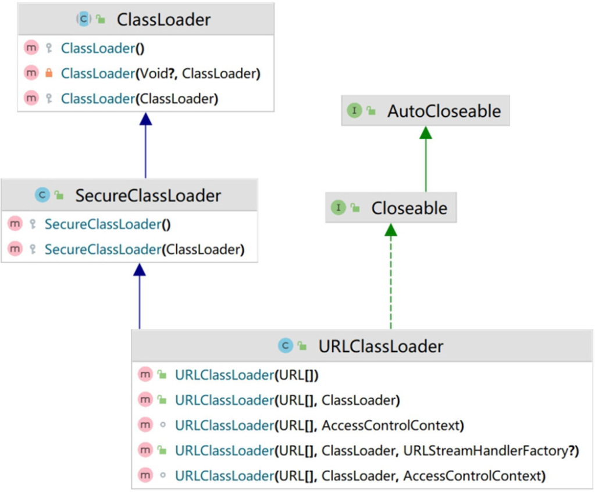


### 20.4.3 ExtClassLoader与AppClassLoader

​	了解完URLClassLoader后接着看剩余的两个类加载器，即拓展类加载器ExtClassLoader和应用程序类加载器AppClassLoader，这两个类都继承自URLClassLoader，是sun.misc.Launcher的静态内部类。sun.misc.Launcher主要被系统用于启动主应用程序，ExtClassLoader和AppClassLoader都是由sun.misc.Launcher创建的，其主要类结构如下图所示。

<div style="text-align:center;font-weight:bold;">ExtClassLoader和AppClassLoader的类结构</div>


​	可以发现ExtClassLoader并没有重写loadClass()方法，这足以说明其遵循双亲委派模式，而AppClassLoader重载了loadClass()方法，但最终调用的还是父类loadClass()方法，因此依然遵守双亲委派模式。本小节没有对这些类的源码进行详细的解析，重点是弄清楚类与类间的关系和常用的方法，同时搞清楚双亲委派模式的实现过程，为编写自定义类加载器做铺垫。

### 20.4.4 Class.forName()与ClassLoader.loadClass()

​	Class.forName()是一个静态方法，最常用的是Class.forName(StringclassName);根据传入的类的全限定名返回一个Class对象。<span style="color:#FF1493;font-weight:bold;">该方法在将class文件加载到内存的同时会执行类的初始化</span>［即调用〈clinit〉()方法］，如Class.forName("com.coding.HelloWorld")。

​	ClassLoader.loadClass()是一个实例方法，需要一个ClassLoader对象来调用该方法。<span style="color:#FF1493;font-weight:bold;">该方法将class文件加载到内存时不会执行类的初始化，直到这个类第一次使用时才进行初始化</span>。该方法因为需要得到一个ClassLoader对象，所以可以根据需要指定使用哪个类加载器，使用格式为“ClassLoadercl=.......;cl.loadClass(“com.coding.HelloWorld”);”。

## 20.5 如何自定义类加载器

​	Java提供了抽象类java.lang.ClassLoader，所有用户自定义的类加载器都应该继承ClassLoader类。前面讲了在自定义ClassLoader子类的时候，常见的有两种做法，即重写loadClass()方法或者重写findClass()方法，重写findClass()方法是比较推荐的方式。

​	这两种方法本质上差不多，毕竟loadClass()也会调用findClass()，但是从逻辑上讲最好不要直接修改loadClass()的内部逻辑，建议的做法是只在findClass()里重写自定义类的加载方法，根据参数指定类的名字，返回对应的Class对象的引用。loadClass()这个方法是实现双亲委派模型逻辑的地方，擅自修改这个方法会导致模型被破坏，容易造成问题。因此最好是在双亲委派模型框架内进行小范围的改动，不破坏原有的稳定结构。同时，也避免了自己重写loadClass()方法的过程中必须写双亲委托的重复代码，从代码的复用性来看，不直接修改这个方法始终是比较好的选择。当编写好自定义类加载器后，便可以在程序中调用loadClass()方法来实现类加载操作。<span style="color:#9400D3;font-weight:bold;">需要注意的是自定义类加载器的父类加载器是应用程序类加载器</span>。

1、创建自定义类加载器MyClassLoader，如下代码所示，重写findClass()方法即可。

<span style="color:#40E0D0;">案例1：自定义类加载器</span>

- 代码

```java
package com.coding.jvm02.hotswap;

import java.io.ByteArrayOutputStream;
import java.io.FileInputStream;
import java.io.IOException;
import java.nio.ByteBuffer;
import java.nio.channels.Channels;
import java.nio.channels.FileChannel;
import java.nio.channels.WritableByteChannel;

public class MyClassLoader extends ClassLoader {
    private String rootDir;

    public MyClassLoader(String rootDir) {
        this.rootDir = rootDir;
    }

    @Override
    protected Class<?> findClass(String className) {
        Class clazz = this.findLoadedClass(className);
        if (null == clazz) {
            // 获取字节码文件的完整路径
            String classFile = getClassFile(className);
            // 获取输入输出流
            try (FileInputStream fis = new FileInputStream(classFile); FileChannel fileChannel = fis.getChannel();
                 ByteArrayOutputStream baos = new ByteArrayOutputStream(); WritableByteChannel outChannel = Channels.newChannel(baos)) {
                ByteBuffer byteBuffer = ByteBuffer.allocateDirect(1024);
                while (true) {
                    int i = fileChannel.read(byteBuffer);
                    if (i == 0 || i == -1) {
                        break;
                    }
                    byteBuffer.flip(); // 修改为读数据模式
                    outChannel.write(byteBuffer);
                    byteBuffer.clear(); // 清空，切换为写模式
                }

                byte[] bytes = baos.toByteArray();
                // 调用defineClass()，将字节数组的数据转换为Class的实例
                clazz = defineClass(null, bytes, 0, bytes.length);
            } catch (IOException e) {
                e.printStackTrace();
            }
        }
        return clazz;
    }

    private String getClassFile(String className) {
        return rootDir + "\\" + className.replace('.', '\\') + ".class";
    }
}
```

​	需要注意的是，自定义类加载器在调用clazz =defineClass(className,bytes,0,bytes.length)方法的过程中，如果传入className类的全路径名称，比如Demo1的全路径名称为com.coding.java1.Demo1，根据双亲委派模型可知，该类会通过sun.misc.Launcher$AppClassLoader类加载器加载。如果想让自定义类加载器加载类Demo1，需要在defineClass(className,bytes,0,bytes.length)方法中的className传入null，并且调用findClass方法的时候传入类名，不需要传入全路径名称，即传入Demo1即可。

​	使用自定义类加载器加载Demo1类，如下代码所示。

<span style="color:#40E0D0;">案例1：自定义类加载器测试代码</span>

- 代码

```java
package com.coding.jvm02.hotswap;

public class MyClassLoaderTest {
    public static void main(String[] args) {
        MyClassLoader myClassLoader = new MyClassLoader("D:");
        try {
            Class<?> clazz = myClassLoader.loadClass("Demo1");
            System.out.println("加载此类的类的加载器为：" + clazz.getClassLoader().getClass().getName());
            System.out.println("加载此类的类加载的父加载器为：" + clazz.getClassLoader().getParent().getClass().getName());
            System.out.println("加载此类的类加载的父加载器的父加载器为：" + clazz.getClassLoader().getParent().getParent().getClass().getName());
        } catch (ClassNotFoundException e) {
            throw new RuntimeException(e);
        }
    }
}
```

​	输出结果如下。

```
加载此类的类的加载器为：com.coding.jvm02.hotswap.MyClassLoader
加载此类的类加载的父加载器为：sun.misc.Launcher$AppClassLoader
加载此类的类加载的父加载器的父加载器为：sun.misc.Launcher$ExtClassLoader
```

## 20.6 双亲委派模型

### 20.6.1 定义与本质

​	类加载器用来把类文件加载到JVM内存中。从JDK1.2版本开始，类的加载过程采用双亲委派模型，这种机制能更好地保证Java平台的安全。

**1 双亲委派定义**

​	如果一个类加载器在接到加载类的请求时，它首先不会自己尝试去加载这个类，而是把这个请求任务委托给父类加载器去完成，依次递归，如果父类加载器可以完成类加载任务，就成功返回。只有父类加载器无法完成此加载任务时，才自己去加载，下图所示。

<div style="text-align:center;font-weight:bold;">双亲委派加载顺序图</div>

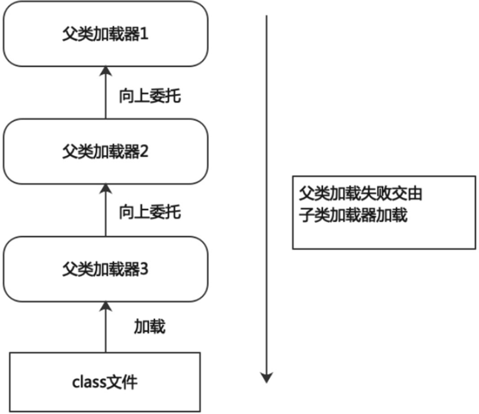

**2 双亲委派本质**

​	规定了类加载的顺序。首先是引导类加载器先加载，若加载不到，由扩展类加载器加载，若还加载不到，才会由应用程序类加载器或自定义的类加载器进行加载，如下图所示。

<div style="text-align:center;font-weight:bold;">双亲委派加载顺序图</div>

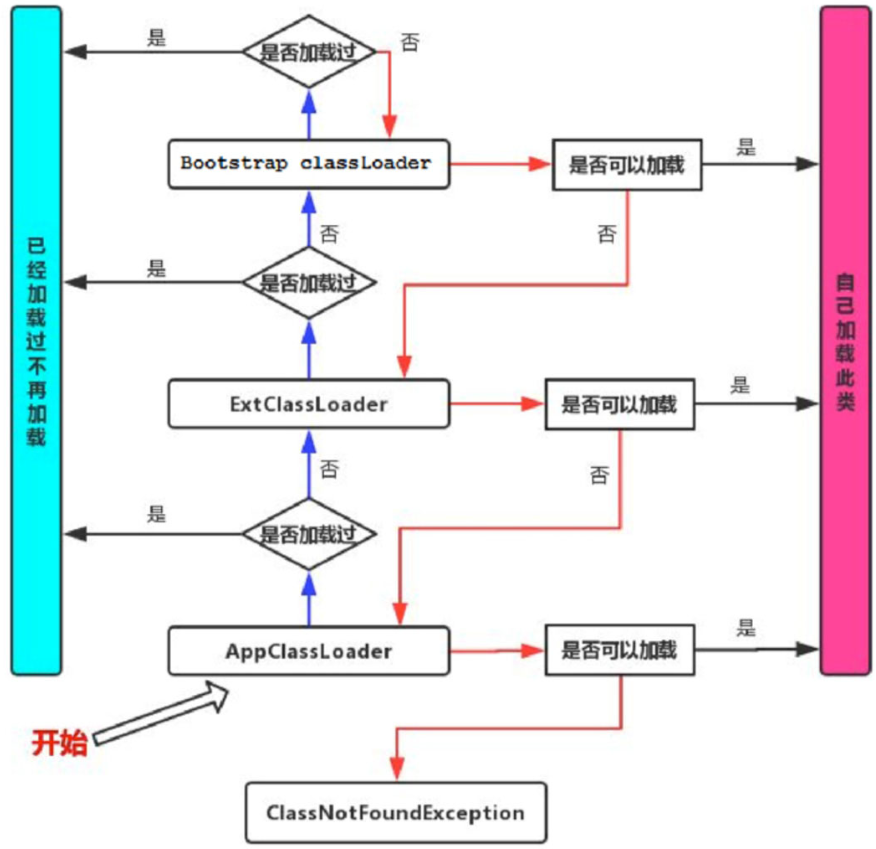

### 20.6.2 双亲委派模型的优势与劣势

​	下面我们谈谈双亲委派模型的优势与劣势。

**1 双亲委派模型优势**

​	避免类的重复加载，确保一个类的全局唯一性，Java类随着它的类加载器一起具备了一种带有优先级的层次关系，通过这种层级关系可以避免类的重复加载，当父类加载器已经加载了该类时，子类加载器就没有必要再加载一次。这样做可以保护程序安全，防止核心API被随意篡改，比如JVM不允许定义一个java.lang.String的类，会出现java.lang.SecurityException，类加载器会做安全检查。

**2 代码支持**

​	双亲委派模型在java.lang.ClassLoader.loadClass(String,boolean)接口中体现。20.4.1节已经详细讲过了，这里再整理一下具体流程。该接口的逻辑如下。

1、在当前加载器的缓存中查找有无目标类，如果有，直接返回。

2、判断当前加载器的父类加载器是否为空，如果不为空，则调用parent.loadClass(name,false)接口进行加载。

3、反之，如果当前加载器的父类加载器为空，则调用findBootstrapClassOrNull(name)接口，让引导类加载器进行加载。

4、如果通过以上3条路径都没能成功加载，则调用findClass(name)接口进行加载。该接口最终会调用java.lang.ClassLoader接口的defineClass系列的native接口加载目标Java类。

​	假设当前加载的是java.lang.Object这个类，很显然，该类属于JDK中核心得不能再核心的一个类，因此一定只能由引导类加载器进行加载。当JVM准备加载java.lang.Object时，JVM默认会使用应用程序类加载器去加载，按照上面4步加载的逻辑，在第1步从系统类的缓存中肯定查找不到该类，于是进入第2步。由于从应用程序类加载器的父类加载器是扩展类加载器，于是扩展类加载器继续从第1步开始重复。由于扩展类加载器的缓存中也一定查找不到该类，因此进入第2步，最终通过引导类加载器进行加载。

​	需要注意的是如果在自定义的类加载器中重写java.lang.ClassLoader#loadClass(String)或java.lang.ClassLoader#loadClass(String,boolean)方法，抹去其中的双亲委派机制，仅保留上面这4步中的第1步与第4步。虽然可以这样操作，但是这样却不能加载核心类库，因为JDK还为核心类库提供了一层保护机制，不管是自定义的类加载器，还是应用程序类加载器抑或扩展类加载器，最终都必须调用java.lang.ClassLoader#defineClass(String,byte[],int,int,ProtectionDomain)方法，该方法会执行java.lang.ClassLoader#preDefineClass()方法，该方法中提供了对JDK核心类库的保护。

**3 双亲委派模型劣势**
	检查类加载的委派过程是否为单向的，这个方式虽然从结构上说比较清晰，使各个类加载器的职责非常明确，但同时会带来一个问题，即顶层的类加载器无法访问底层的类加载器所加载的类。

​	通常情况下，启动类加载器中的类为系统核心类，包括一些重要的系统接口，而在应用类加载器加载的类为应用类。按照这种模式，应用类访问系统类自然是没有问题，但是系统类访问应用类就会出现问题。比如在<span style="color:#FF00FF;font-weight:bold;">系统类中提供了一个接口，该接口需要在应用类中实现，该接口还绑定一个工厂方法，用于创建该接口的实例，而接口和工厂方法都在启动类加载器中。这时，就会出现该工厂方法无法创建由应用类加载器加载的应用实例的问题</span>。所以Java虚拟机规范并没有明确要求类加载器的加载机制一定要使用双亲委派模型，只是建议采用这种方式而已，比如在Tomcat中，类加载器所采用的加载机制就和传统的双亲委派模型有一定区别，当缺省的类加载器接收到一个类的加载任务时，首先会由它自行加载，当它加载失败时，才会将类的加载任务委派给它的超类加载器去执行，这同时也是Servlet规范推荐的一种做法。

### 20.6.3 破坏双亲委派模型

​	双亲委派模型并不是一个具有强制性约束的模型，而是Java设计者推荐给开发者的类加载器实现方式。在Java的世界中大部分的类加载器都遵循这个模型，但也有例外的情况，如下所示，注意破坏双亲委派模型并不一定就是一件坏事，如果有特殊需求，完全可以主动破坏双亲委派模型。

**1 破坏双亲委派机制一**
	重写loadClass()方法破坏双亲委派模型，我们前面讲过双亲委派模型就是通过这个方法实现的，这个方法可以指定类通过什么加载器来加载，所以如果我们改写它的规则，就相当于打破了双亲委派模型。重写这个方法以后就能自己定义使用什么加载器了，也可以自定义加载委派机制。<span style="color:#FF00FF;font-weight:bold;">其实JDK在早期版本中已经发生过一次破坏了，双亲委派模型是在JDK 1.2之后引入的，但是类加载器的概念和抽象类java.lang.ClassLoader在Java的第一个版本中就已经存在</span>，面对已经存在的用户自定义类加载器的代码，Java设计者们引入双亲委派模型时不得不做出一些妥协，为了兼容这些已有代码，无法再以技术手段避免loadClass()被子类覆盖的可能性，只能在JDK1.2之后的java.lang.ClassLoader中添加一个新的protected方法findClass(),findClass()方法就是为了让开发人员在自定义类加载器的时候不要重写loadclass()方法以免破坏双亲委派模型，但是loadClass()方法比双亲委派模型出现得早，有很多程序已经重写了loadClass()方法，这已经是没有办法避免的事情了。

**2 破坏双亲委派机制二**
	双亲委派模型有一定的局限性，父类加载器无法访问子类加载器路径中的类。<span style="color:#FF00FF;font-weight:bold;">双亲委派模型最典型的不适用场景就是SPI的使用，Java中所有涉及SPI的加载动作基本都采用这种方式，例如JNDI、JDBC等。所以提供了一种线程上下文类加载器，能够使父类加载器调用子类加载器进行加载</span>。

​	<span style="color:#9400D3;font-weight:bold;">简单来说就是接口定义在了启动类加载器中，而实现类定义在了其他类加载器中，当启动类加载器需要加载其他子类加载器路径中的类时，需要使用线程上下文类加载器（默认是应用程序类加载器），这样以上下文加载器为中介，使得启动类加载器中的代码也可以访问应用类加载器中的类</span>。比如Java中的核心jar包rt.jar，该包下面的类是由引导类加载器加载的，但是如果rt.jar包想要访问jdbc.jar中的类该怎么办呢？我们知道jdbc.jar是由应用程序类加载器加载的，此时引导类加载器就会委托线程上下文类加载器去加载jdbc.jar，间接访问子类加载器中的类了，如下图所示。

<div style="text-align:center;font-weight:bold;">双亲委派加载顺序图</div>


**3 破坏双亲委派机制三**
	<span style="color:#FF00FF;font-weight:bold;">双亲委派模型的第三次“被破坏”是由于用户对程序动态性的追求而导致的，如代码热替换(Hot Swap)、模块热部署(Hot Deployment)等</span>。

​	IBM公司实现模块化热部署的关键是它自定义的类加载器机制的实现，每一个程序模块（OSGi中称为Bundle）都有一个自己的类加载器，当需要更换一个Bundle时，就把Bundle连同类加载器一起换掉以实现代码的热替换。在OSGi环境下，类加载器不再是双亲委派模型推荐的树状结构，而是进一步发展为更加复杂的网状结构。

### 20.6.4 热替换的实现

​	热替换是指在程序的运行过程中，不停止服务，只通过替换程序文件来修改程序的行为。热替换的关键需求在于服务不能中断，修改必须立即表现正在运行的系统之中。基本上大部分脚本语言都是天生支持热替换的，比如PHP，只要替换了PHP源文件，这种改动就会立即生效，而无须重启Web服务器。

​	但对Java来说，热替换并非天生就支持，如果一个类已经加载到系统中，通过修改类文件，并无法让系统再来加载并重定义这个类。因此，在Java中实现这一功能的一个可行的方法就是灵活运用类加载器。

​	由不同类加载器加载的同名类属于不同的类型，不能相互转换和兼容。即两个不同的类加载器加载同一个类，在虚拟机内部，会认为这两个类是完全不同的。

​	根据这个特点，可以用来模拟热替换的实现，基本思路如下图所示，首先创建自定义的类加载器，在服务不重启的条件下动态替换类文件，这样就可以直接执行新的类文件了。

<div style="text-align:center;font-weight:bold;">热替换流程图</div>

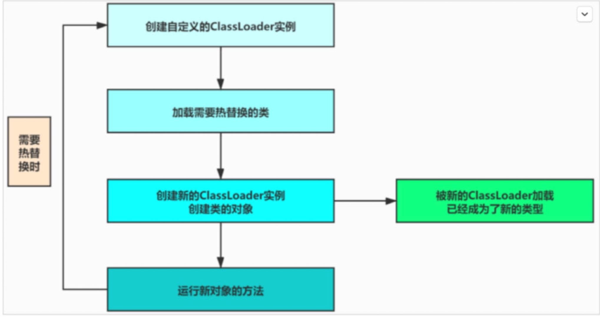

​	根据上面的流程来模拟热替换，代码如下所示。要想实现同一个类的不同版本的共存，那么这些不同版本必须由不同的类加载器进行加载，因此就不能把这些类的加载工作委托给系统类加载器来完成，因为它们只有一份。为了做到这一点，就不能采用系统默认的类加载器委托规则，也就是说定制的类加载器的父类加载器必须设置为null或者重写findClass()方法，加载类的时候调用findClass()方法即可，不去调用loadClass()方法，当通过loadClass()方法进行类的加载时，如果该类没有加载过，会委托给应用程序类加载器进行加载，这样就不会实现热部署了。

1、创建自定义类加载器，如<span style="color:blue;font-weight:bold;">20.5 案例1：自定义类加载器</span>的代码所示。

2、创建需要热替换的类Demo1，实现很简单，仅包含一个方法hot()，如代码清单20-9所示。

<span style="color:#40E0D0;">案例1：Demo1类</span>

- 代码

```java
public class Demo1 {

    public void hot() {
        System.out.println("OldDemo1");
    }
}
```

3、创建测试类LoopRun，把编译好的Demo1.class文件放在当前目录中。接下来要使用我们前面编写的MyClassLoader来实现该类的热替换。具体的做法为写一个死循环，每隔5秒钟执行一次。循环体中会创建新的类加载器实例加载Demo1类，生成实例，并调用hot()方法。接下来修改Demo1类中hot()方法的打印内容，重新编译，并在系统运行的情况下替换掉原来的Demo1.class，会看到系统会打印出更改后的内容，如下代码所示。

<span style="color:#40E0D0;">案例1：测试类LoopRun</span>

- 代码

```java
package com.coding.jvm02.hotswap;

import java.lang.reflect.Method;

public class LoopRun {
    public static void main(String[] args) {
        while (true) {
            try {
                // 1、创建自定义类加载器的实例
                MyClassLoader loader = new MyClassLoader("/Users/wenqiu/IdeaProjects/backend-jvm-learning/jvm-02-classloader/src/main/java");
                // 2、加载指定的类
                Class<?> clazz = loader.findClass("com.coding.jvm02.hotswap.Demo1");
                // 3、创建运行时类的实例
                Object demo = clazz.newInstance();
                // 4、获取运行时类中指定的方法
                Method m = clazz.getMethod("hot");
                // 5、调用指定方法
                m.invoke(demo);
                Thread.sleep(5000);
            } catch (Exception e) {
                System.out.println("not find");
                try {
                    Thread.sleep(5000);
                } catch (InterruptedException exception) {
                    exception.printStackTrace();
                }
            }
        }
    }
}

```

​	没有替换之前输出结果如下。

```bash
OldDemo1
OldDemo1
```

​	修改Demo1类中hot()方法输出内容为OldDemo1→NewDemo1之后，重新编译，程序不重启的情况下，输出结果如下。

```bash
OldDemo1
OldDemo1
OldDemo1 ---> NewDemo1
OldDemo1 ---> NewDemo1
```

## 20.7 沙箱安全机制

​	Java中沙箱安全机制主要是保证程序安全和保护Java原生的JDK代码。Java安全模型的核心就是Java沙箱(Sandbox)。沙箱是一个限制程序运行的环境，沙箱机制就是将Java代码限定在JVM特定的运行范围中，并且严格限制代码对本地系统资源访问。通过这样的措施来保证对代码的有限隔离，防止对本地系统造成破坏。沙箱主要限制系统资源访问，系统资源包括CPU、内存、文件系统、网络。不同级别的沙箱对这些资源访问的限制也可以不一样。所有的Java程序运行都可以指定沙箱，可以定制安全策略。下面我们看看不同的JDK版本中的沙箱机制是什么样的。

### 20.7.1 JDK 1.0时期

​	JDK 1.0安全模型如下图所示。在Java中将执行程序分成本地代码和远程代码两种，本地代码默认视为可信任的，而远程代码则被看作是不被信任的。对于本地代码，可以访问一切本地资源。而远程代码在早期的JDK中实现，程序安全依赖沙箱机制。

<div style="text-align:center;font-weight:bold;">JDK1.0安全模型</div>

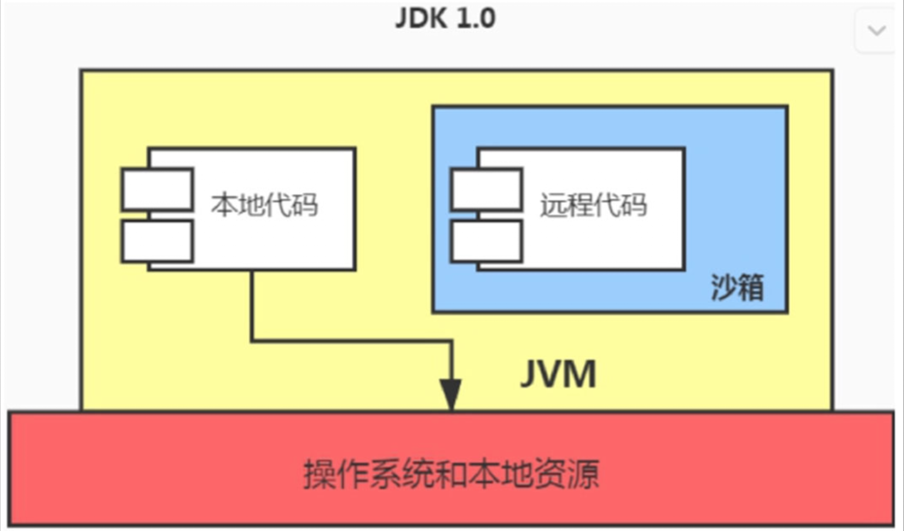

### 20.7.2 JDK 1.1时期

​	JDK 1.0中如此严格的安全机制也给程序的功能扩展带来障碍，比如当用户希望远程代码访问本地系统文件的时候，就无法实现。因此在后续的JDK 1.1版本中，针对安全机制做了改进，增加了安全策略，允许用户指定代码对本地资源的访问权限。JDK 1.1安全模型如下图所示。

<div style="text-align:center;font-weight:bold;">JDK1.1安全模型</div>

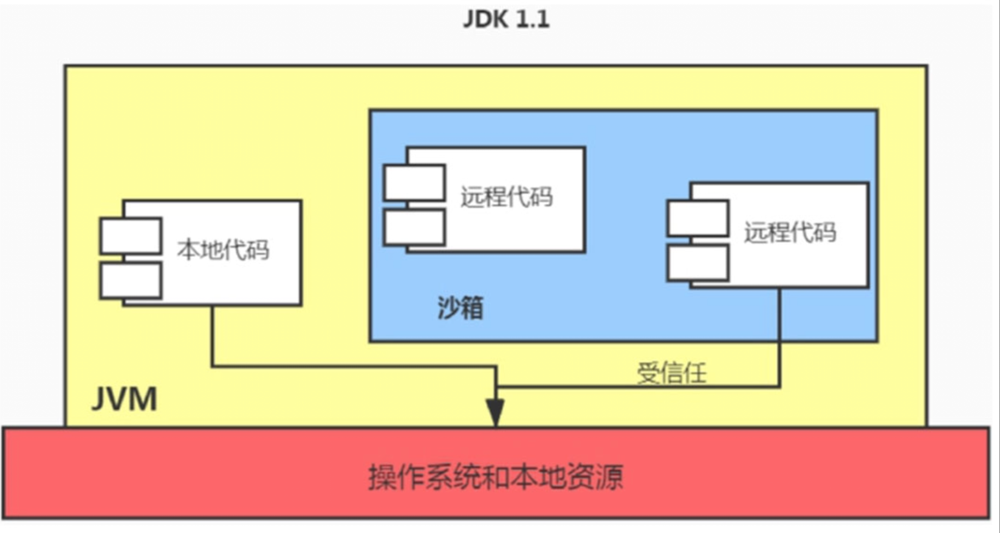

### 20.7.3 JDK 1.2时期

​	在JDK 1.2版本中，再次改进了安全机制，增加了代码签名。不论本地代码或是远程代码，都会按照用户的安全策略设定，由类加载器加载到虚拟机中权限不同的运行空间，来实现差异化的代码执行权限控制。JDK 1.2安全模型如下图所示。

<div style="text-align:center;font-weight:bold;">JDK 1.2安全模型</div>

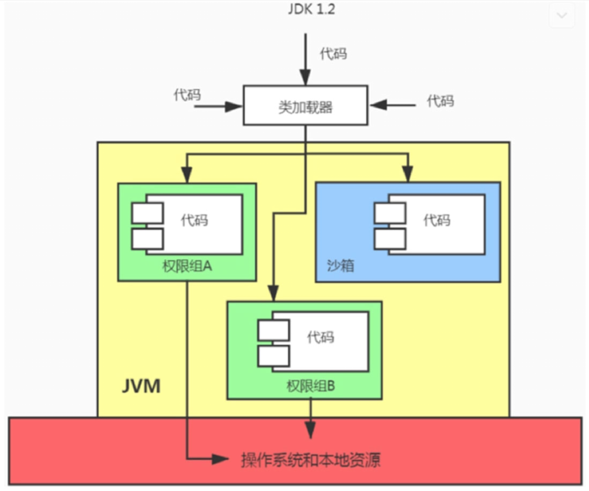

### 20.7.4 JDK 1.6时期

​	当前最新的安全机制实现则引入了域(Domain)的概念。虚拟机会把所有代码加载到不同的系统域和应用域。系统域专门负责与关键资源进行交互，而各个应用域则通过系统域部分代理来对各种需要的资源进行访问。虚拟机中不同的受保护域(Protected Domain)，对应不一样的权限(Permission)。存在于不同域中的类文件就具有了当前域的全部权限，最新的安全模型(JDK 1.6)如下图所示。

<div style="text-align:center;font-weight:bold;">JDK 1.6安全模型</div>

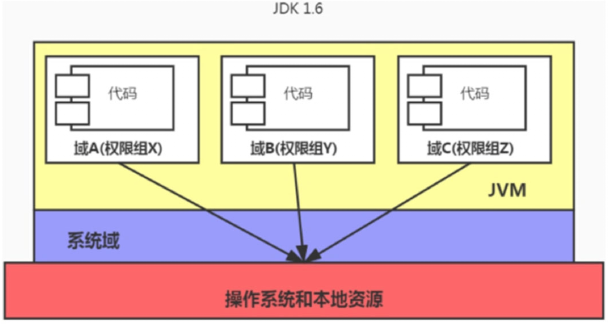

## 20.8 JDK 9新特性

​	为了保证兼容性，JDK 9没有从根本上改变三层类加载器架构和双亲委派模型，但为了模块化系统的顺利运行，仍然发生了一些值得被注意的变动。

​	扩展机制被移除，扩展类加载器由于向后兼容性的原因被保留，不过被重命名为平台类加载器(Platform Class Loader)。可以通过ClassLoader的新方法getPlatformClassLoader()来获取。JDK 9时基于模块化进行构建（原来的rt.jar和tools.jar被拆分成数十个JMOD文件），其中的Java类库就已天然地满足了可扩展的需求，那自然无须再保留<JAVA_HOME>\lib\ext目录，此前使用这个目录或者java.ext.dirs系统变量来扩展JDK功能的机制已经没有继续存在的价值了。

​	平台类加载器和应用程序类加载器都不再继承于java.net.URLClassLoader。启动类加载器、平台类加载器、应用程序类加载器全都继承于jdk.internal.loader.BuiltinClassLoader。如下图所示。

```
JDK1.8及以前：
sun.misc.Launcher$AppClassLoader
sun.misc.Launcher$ExtClassLoader

JDK1.9:
jdk.internal.loader.ClassLoaders$AppClassLoader
jdk.internal.loader.ClassLoaders$PlatformClassLoader
```

<div style="text-align:center;font-weight:bold;">JDK 9类加载器关系图</div>

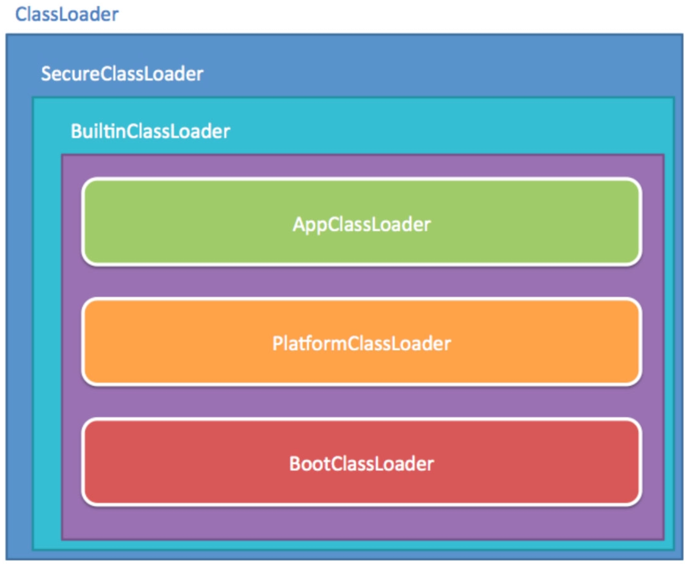

​	如果有程序直接依赖JDK 8之前类加载器的包含关系，或者依赖URLClassLoader类的特定方法，那代码很可能会在JDK 9及更高版本的JDK中崩溃。

​	在JDK 9中，类加载器有了名称。该名称在构造方法中指定，可以通过getName()方法来获取。平台类加载器的名称是Platform，应用类加载器的名称是App。类加载器的名称在调试与类加载器相关的问题时会非常有用。

​	启动类加载器在JDK 9中是由JVM内部和Java类库共同协作实现的类加载器（以前是C++实现），但为了与之前代码兼容，在获取启动类加载器的场景中仍然会返回null，而不会得到BootClassLoader实例。

​	类加载的委派关系也发生了变动。当平台及应用程序类加载器收到类加载请求，在委派给父类加载器加载前，要先判断该类是否能够归属到某一个系统模块中，如果可以找到这样的归属关系，就要优先委派给负责那个模块的加载器完成加载。

​	JDK 9前及JDK 9的双亲委派模式如下图所示。

<div style="text-align:center;font-weight:bold;">JDK 9前及JDK 9的双亲委派模式</div>

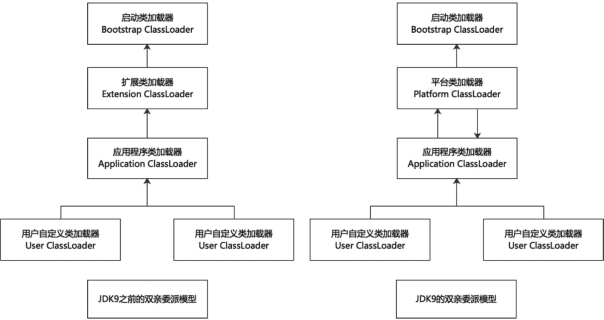


​	在Java模块化系统明确规定了三个类加载器负责各自加载的模块。

- 启动类加载器负责加载的模块

| java.base           | java.security.sasl   |
| ------------------- | -------------------- |
| java.datatransfer   | java.xml             |
| java.desktop        | jdk.httpserver       |
| java.instrument     | jdk.internal.vm.ci   |
| java.logging        | jdk.management       |
| java.management     | jdk.management.agent |
| java.management.rmi | jdk.naming.rmi       |
| java.naming         | jdk.net              |
| java.perfs          | jdk.sctp             |
| java.rmi            | jdk.unsupported      |

- 平台类加载器负责加载的模块

| java.activation*        | jdk.accessibility         |
| ----------------------- | ------------------------- |
| java.compiler*          | jdk.charsets              |
| java.corba*             | jdk.crypto.cryptoki       |
| java.scripting          | jdk.crypto.ec             |
| java.se                 | jdk.dynalink              |
| java.se.ee              | jdk.incubator.httpclient  |
| java.security.jgss      | jdk.internal.vm.compiler* |
| java.smartcardio        | jdk.jsobject              |
| java.sql                | jdk.localedata            |
| java.sql.rowset         | jdk.naming.dns            |
| java.transaction*       | jdk.scripting.nashorn     |
| java.xml.bind*          | jdk.security.auth         |
| java.xml.crypto         | jdk.security.jgss         |
| java.xml.ws*            | jdk.xml.dom               |
| java.xml.ws.annotation* | jdk.zipfs                 |

- 应用程序类加载器负责加载的模块

| jdk.aot                      | jdk.jdeps            |
| ---------------------------- | -------------------- |
| jdk.attach                   | jdk.jdi              |
| jdk.compiler                 | jdk.jdwp.agent       |
| jdk.editpad                  | jdk.jlink            |
| jdk.hotspot.agent            | jdk.jshell           |
| jdk.internal.ed              | jdk.jstatd           |
| jdk.jstatd                   | jdk.internal.jvmstat |
| jdk.pack                     | jdk.internal.le      |
| jdk.policytool               | jdk.internal.opt     |
| jdk.rmic                     | jdk.jartool          |
| jdk.scripting.nashorrn.shell | jdk.javadoc          |
| jdk.xml.bind*                | jdk.jcmd             |
| jdk.xml.ws*                  | jdk.jconsole         |

# 第四篇 性能监控与调优篇

# 第21章 命令行工具

​	性能问题是软件工程师在日常工作中需要经常面对和解决的问题，在用户体验至上的今天，解决好应用的性能问题能带来非常大的收益。工欲善其事，必先利其器，想要解决性能相关问题，必须要有比较好的性能诊断工具。Java作为最流行的编程语言之一，应用的性能诊断一直受到业界广泛关注。造成Java应用出现性能问题的因素非常多，例如线程控制、磁盘读写、数据库访问、网络I/O、垃圾收集等。想要定位这些问题，一款优秀的性能诊断工具必不可少，就好比中医、西医看病，中医讲究的是望、闻、问、切，西医则是借助各种检查仪器。

## 21.1 概述

​	JDK本身已经集成了很多诊断工具。在大家刚接触Java学习的时候，最先了解的两个命令就是javac和java，但是除此之外，还有一些其他工具可以使用，可是并非所有的程序员都了解其他命令行程序的作用，接下来我们一起看看其他命令行程序的作用。进入到安装JDK的bin目录，会发现还有一系列辅助工具。这些辅助工具用来获取目标JVM不同方面、不同层次的信息，帮助开发人员很好地解决Java应用程序的一些疑难杂症。Mac系统bin目录的内容如下图所示。

<div style="text-align:center;font-weight:bold;">Mac系统JDK中的bin目录</div>


​	事实上，它们只是Java程序的一层包装，其真正实现是在tools.jar中，如下图所示。以jps工具为例，在控制台执行jps命令和执行`java -classpath $JAVA_HOME/lib/tools.jar sun.tools.jps.Jps`命令是等价的，即jps命令只是这个命令的一层包装。下面介绍一些常用的命令工具。

```bash
% java -classpath $JAVA_HOME/lib/tools.jar sun.tools.jps.Jps
20065 
60116 Main
72247 Jps
% jps
20065 
60116 Main
72350 Jps
```

<div style="text-align:center;font-weight:bold;">tool.jar内部情况</div>


## 21.2 jps:查看正在运行的Java进程

​	jps(JVM Process Status Tool)命令用于查看系统内所有的JVM进程，可根据参数选项指定是否显示JVM的执行主类［包含main()方法的类］，以及进程的本地JVMID(Local Virtual Machine Identifier)，对于本地JVM进程来说，进程的本地JVMID与操作系统的进程ID是一致的。简单来说，就是Java提供的一个显示当前所有Java进程pid的命令，和Linux系统里的ps命令很相似，ps命令主要是用来显示当前系统的进程情况，比如查看进程列表和进程ID。在日常工作中，此命令也是最常用的命令之一。

​	jps的基本使用语法如下：	

```bash
% jps -help
usage: jps [-help]
       jps [-q] [-mlvV] [<hostid>]

Definitions:
    <hostid>:      <hostname>[:<port>]
```

| 基本语法                |
| ----------------------- |
| jps [options]  [hostid] |

**1 [ options ]选项说明**

​	jps工具[options]主要选项如下表所示。
<div style="text-align:center;font-weight:bold;">jps命令[options]选项说明</div>

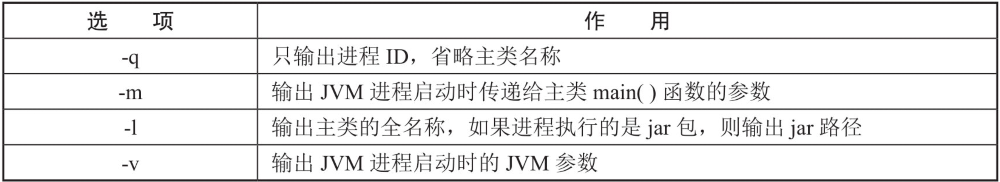

**2 [hostid]说明**

​	hostid表示目标主机的主机名或IP地址，如果省略该参数，则目标主机为本地主机。如果想要远程监控主机上的Java程序，需要安装jstatd（见20.9节）。对于网络安全要求非常严格的场所，需要自定义策略文件来满足对特定的主机或网络的访问，但是这种技术容易受到IP地址欺诈攻击。如果由于安全问题无法通过定制的策略文件处理，那么最安全的操作是在主机本地使用jstat（见21.3节）和jps工具。

**3 使用案例**

​	Mac上启动Tomcat（一种Web应用服务器，通过Homebrew安装），然后使用ps命令查看Tomcat进程ID使用，如下所示。

```bash
% ps -ef|grep tomcat
```

```bash
  501 77188     1   0  2:33下午 ??         0:02.11 /opt/homebrew/opt/openjdk/bin/java -Djava.util.logging.config.file=/opt/homebrew/Cellar/tomcat@8/8.5.100/libexec/conf/logging.properties -Djava.util.logging.manager=org.apache.juli.ClassLoaderLogManager -Djdk.tls.ephemeralDHKeySize=2048 -Djava.protocol.handler.pkgs=org.apache.catalina.webresources -Dorg.apache.catalina.security.SecurityListener.UMASK=0027 -Dignore.endorsed.dirs= -classpath /opt/homebrew/Cellar/tomcat@8/8.5.100/libexec/bin/bootstrap.jar:/opt/homebrew/Cellar/tomcat@8/8.5.100/libexec/bin/tomcat-juli.jar -Dcatalina.base=/opt/homebrew/Cellar/tomcat@8/8.5.100/libexec -Dcatalina.home=/opt/homebrew/Cellar/tomcat@8/8.5.100/libexec -Djava.io.tmpdir=/opt/homebrew/Cellar/tomcat@8/8.5.100/libexec/temp org.apache.catalina.startup.Bootstrap start
  501 77505 41579   0  2:34下午 ttys000    0:00.01 grep tomcat
```

​	可以看到进程ID是77188。使用jps -l命令查看，如下所示。

```bash
% jps -l
20065 
60116 com.intellij.idea.Main
77188 org.apache.catalina.startup.Bootstrap
77965 sun.tools.jps.Jps
```

​	可以查看到Tomcat进程ID也是77188，与ps命令一致。接下来测试jps命令的其他参数选项。

1、-q选项：只输出进程ID，省略主类名称

```bash
% jps -q
20065
78192
60116
77188
```

2、-m选项：输出JVM进程启动时传递给主类main()方法的参数

```bash
% jps -m
20065 
60116 Main
77188 Bootstrap start
78301 Jps -m
```

3、-v选项：查看输出JVM进程启动时的JVM参数

```bash
% jps -v
20065  -Djna.nounpack=true -Djna.nosys=true -Djna.noclasspath=true -Djna.library.path=/Applications/JetBrains Toolbox.app/Contents/MacOS -Djna.boot.library.path=/Applications/JetBrains Toolbox.app/Contents/MacOS -Dskiko.library.path=/Applications/JetBrains Toolbox.app/Contents/MacOS -Duser.dir=/Applications/JetBrains Toolbox.app/Contents/MacOS -Dskiko.metal.gpu.priority=integrated -Xmx160m -Xms8m -Xss384k -XX:+UnlockExperimentalVMOptions -XX:+CreateCoredumpOnCrash -XX:MetaspaceSize=16m -XX:MinMetaspaceFreeRatio=10 -XX:MaxMetaspaceFreeRatio=10 -XX:+UseCompressedOops -XX:+UseCompressedClassPointers -XX:+UseSerialGC -XX:MinHeapFreeRatio=10 -XX:MaxHeapFreeRatio=10 -XX:-ShrinkHeapInSteps --add-opens=java.desktop/sun.awt=ALL-UNNAMED --add-opens=java.desktop/sun.awt.resources=ALL-UNNAMED --add-opens=java.desktop/com.jetbrains.desktop=ALL-UNNAMED vfprintf exit abort -DTOOLBOX_VERSION=2.5.2.35332 -XX:+HeapDumpOnOutOfMemoryError -XX:HeapDumpPath=/Users/wenqiu/Library/Logs/JetBrains/Toolbox/toolbox-oom-20065.hprof -XX:ErrorFil
60116 Main abort vfprintf -XX:ErrorFile=/Users/wenqiu/java_error_in_idea_%p.log -XX:HeapDumpPath=/Users/wenqiu/java_error_in_idea.hprof -Xms128m -Xmx2048m -XX:ReservedCodeCacheSize=512m -XX:+HeapDumpOnOutOfMemoryError -XX:-OmitStackTraceInFastThrow -XX:CICompilerCount=2 -XX:+IgnoreUnrecognizedVMOptions -ea -Dsun.io.useCanonCaches=false -Dsun.java2d.metal=true -Djbr.catch.SIGABRT=true -Djdk.http.auth.tunneling.disabledSchemes="" -Djdk.attach.allowAttachSelf=true -Djdk.module.illegalAccess.silent=true -Djdk.nio.maxCachedBufferSize=2097152 -Djava.util.zip.use.nio.for.zip.file.access=true -Dkotlinx.coroutines.debug=off -XX:+UnlockDiagnosticVMOptions -XX:TieredOldPercentage=100000 -Dapple.awt.application.appearance=system -Xmx2048m -Dide.managed.by.toolbox=/Applications/JetBrains Toolbox.app/Contents/MacOS/jetbrains-toolbox -Dtoolbox.notification.token=a5149d88-e0f9-43f8-9038-51a8f4e05984 -Dtoolbox.notification.portFile=/Users/wenqiu/Library/Caches/JetBrains/Toolbox/ports/8883a081-ad3c-4c00-99bf-7999bcfc74db.port -Djb.vmOpti
77188 Bootstrap --add-opens=java.base/java.lang=ALL-UNNAMED --add-opens=java.base/java.io=ALL-UNNAMED --add-opens=java.base/java.util=ALL-UNNAMED --add-opens=java.base/java.util.concurrent=ALL-UNNAMED --add-opens=java.rmi/sun.rmi.transport=ALL-UNNAMED -Djava.util.logging.config.file=/opt/homebrew/Cellar/tomcat@8/8.5.100/libexec/conf/logging.properties -Djava.util.logging.manager=org.apache.juli.ClassLoaderLogManager -Djdk.tls.ephemeralDHKeySize=2048 -Djava.protocol.handler.pkgs=org.apache.catalina.webresources -Dorg.apache.catalina.security.SecurityListener.UMASK=0027 -Dignore.endorsed.dirs= -Dcatalina.base=/opt/homebrew/Cellar/tomcat@8/8.5.100/libexec -Dcatalina.home=/opt/homebrew/Cellar/tomcat@8/8.5.100/libexec -Djava.io.tmpdir=/opt/homebrew/Cellar/tomcat@8/8.5.100/libexec/temp
78406 Jps -Dapplication.home=/Library/Java/JavaVirtualMachines/jdk-1.8.jdk/Contents/Home -Xms8m
```

## 21.3 jstat：查看JVM统计信息

​	jstat(JVM Statistics Monitoring Tool)用于收集JVM各方面的运行数据，显示本地或远程JVM进程中的类装载、内存、垃圾收集、JIT编译等运行数据。在没有图形用户界面时，只提供了纯文本控制台环境的服务器上，它是运行期定位JVM性能问题的首选工具。常用于检测垃圾回收问题以及内存泄漏问题。它的功能非常强大，可以通过它查看堆信息的详细情况。

​	jstat的基本使用语法如下。

```bash
% jstat -help
Usage: jstat -help|-options
       jstat -<option> [-t] [-h<lines>] <vmid> [<interval> [<count>]]

Definitions:
  <option>      An option reported by the -options option
  <vmid>        Virtual Machine Identifier. A vmid takes the following form:
                     <lvmid>[@<hostname>[:<port>]]
                Where <lvmid> is the local vm identifier for the target
                Java virtual machine, typically a process id; <hostname> is
                the name of the host running the target Java virtual machine;
                and <port> is the port number for the rmiregistry on the
                target host. See the jvmstat documentation for a more complete
                description of the Virtual Machine Identifier.
  <lines>       Number of samples between header lines.
  <interval>    Sampling interval. The following forms are allowed:
                    <n>["ms"|"s"]
                Where <n> is an integer and the suffix specifies the units as 
                milliseconds("ms") or seconds("s"). The default units are "ms".
  <count>       Number of samples to take before terminating.
  -J<flag>      Pass <flag> directly to the runtime system.
```

| 基本语法                                                    |
| ----------------------------------------------------------- |
| jsat -<option>[-t] [-h<lines>] <vmid> [<interval>[<count>]] |

**1 [options]选项说明**

<div style="text-align:center;font-weight:bold;">jstat命令[ options ]选项说明</div>

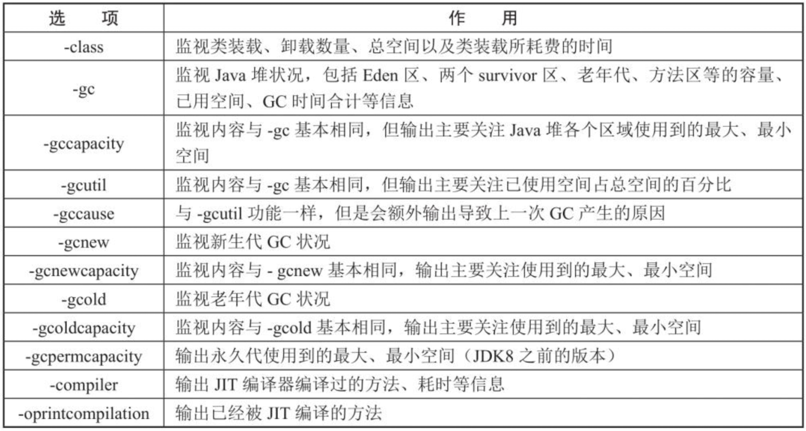

**2 [-t]参数说明**

​	[-t]参数可以在输出信息前加上一个Timestamp列，显示程序的运行时间。可以比较Java进程的启动时间以及总GC时间（GCT列），或者两次测量的间隔时间以及总GC时间的增量，来得出GC时间占运行时间的比例。如果该比例超过20%，则说明目前堆的压力较大；如果该比例超过90%，则说明堆里几乎没有可用空间，随时都可能抛出OOM异常。

**3 [-h&lt;lines&gt;]参数说明**

​	[-h]参数可以在周期性数据输岀时，输出设定的行数的数据后输出一个表头信息。

**4 [interval]参数说明**

​	[interval]参数用于指定输出统计数据的周期，单位为毫秒，简单来说就是查询间隔时间。

**5 [count]参数说明**

​	[count]用于指定查询的总次数。

**6 使用案例**

​	由于jstat参数选项比较多，这里只列举一个启动了Tomcat的Linux服务器案例，查看其监视状态，命令如下所示。

```bash
# 查看进程ID
% jps
# 查看进程GC信息
% jstat -gc 77188
 # 每隔1s打印一次进程信息，打印10次，并且加上时间戳
% jstat -gc -t 77188 1000 10
 # 每隔1s打印一次进程信息，打印10次，并且加上时间戳；且每5行输出一次表头信息
% jstat -gc -t -h5 77188 1000 10
```

​	运行结果如下图所示。

<div style="text-align:center;font-weight:bold;">jstat命令运行结果</div>

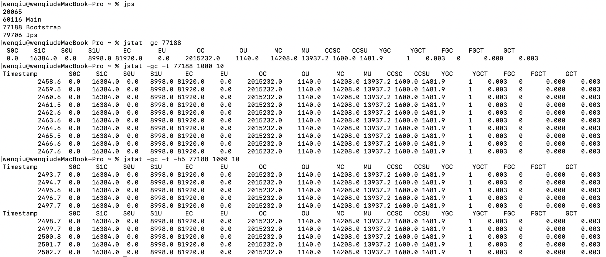

​	运行结果的各列表示的含义如下表所示。

<div style="text-align:center;font-weight:bold;">jstat命令运行结果说明</div>

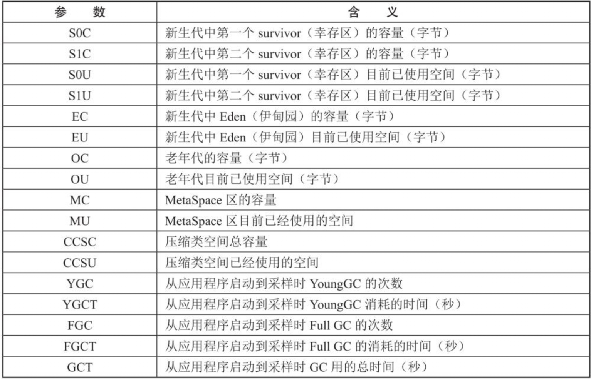

​	jstat还可以用来判断是否出现内存泄漏，步骤如下。

1、在长时间运行的Java程序中，可以运行jstat命令连续获取多行性能数据，并取这几行数据中OU列（即已占用的老年代内存）的最小值。

2、每隔一段较长的时间重复一次上述操作，获得多组OU最小值。如果这些值呈上涨趋势，则说明该Java程序的老年代内存已使用量在不断上涨，这意味着无法回收的对象在不断增加，因此很有可能存在内存泄漏。

## 21.4 jinfo：实时查看和修改JVM配置参数

​	jinfo(Configuration Info for Java)可用于查看和调整JVM的配置参数。在很多情况下，Java应用程序不会指定所有的JVM参数。而此时，开发人员可能不知道某一个具体的JVM参数的默认值。在这种情况下，可能需要通过查找文档获取某个参数的默认值。这个查找过程可能是非常艰难的。但有了jinfo工具，开发人员可以很方便地找到JVM参数的当前值。上面讲解的jps -v命令虽然可以查看JVM启动时显示指定的参数列表，但是如果想要知道未被显式指定的参数的系统默认值，就需要用到jinfo工具了。

​	第二个作用就是在程序运行时修改部分参数，并使之立即生效。并非所有参数都支持动态修改，只有被标记为manageable的参数可以被实时修改。其实，这个修改能力是极其有限的，使用下面的命令查看被标记为manageable的参数。

```bash
% java -XX:+PrintFlagsFinal -version | grep manageable
```

```bash
     intx CMSAbortablePrecleanWaitMillis            = 100                                 {manageable}
     intx CMSTriggerInterval                        = -1                                  {manageable}
     intx CMSWaitDuration                           = 2000                                {manageable}
     bool HeapDumpAfterFullGC                       = false                               {manageable}
     bool HeapDumpBeforeFullGC                      = false                               {manageable}
     bool HeapDumpOnOutOfMemoryError                = false                               {manageable}
    ccstr HeapDumpPath                              =                                     {manageable}
    uintx MaxHeapFreeRatio                          = 100                                 {manageable}
    uintx MinHeapFreeRatio                          = 0                                   {manageable}
     bool PrintClassHistogram                       = false                               {manageable}
     bool PrintClassHistogramAfterFullGC            = false                               {manageable}
     bool PrintClassHistogramBeforeFullGC           = false                               {manageable}
     bool PrintConcurrentLocks                      = false                               {manageable}
     bool PrintGC                                   = false                               {manageable}
     bool PrintGCDateStamps                         = false                               {manageable}
     bool PrintGCDetails                            = false                               {manageable}
     bool PrintGCID                                 = false                               {manageable}
     bool PrintGCTimeStamps                         = false                               {manageable}
java version "1.8.0_421"
Java(TM) SE Runtime Environment (build 1.8.0_421-b09)
Java HotSpot(TM) 64-Bit Server VM (build 25.421-b09, mixed mode)
```

​	jinfo的基本使用语法如下。

```bash
% jinfo -help
Usage:
    jinfo [option] <pid>
        (to connect to running process)
    jinfo [option] <executable <core>
        (to connect to a core file)
    jinfo [option] [server_id@]<remote server IP or hostname>
        (to connect to remote debug server)

where <option> is one of:
    -flag <name>         to print the value of the named VM flag
    -flag [+|-]<name>    to enable or disable the named VM flag
    -flag <name>=<value> to set the named VM flag to the given value
    -flags               to print VM flags
    -sysprops            to print Java system properties
    <no option>          to print both of the above
    -h | -help           to print this help message
```

| 基本语法            |
| ------------------- |
| jinfo [options] pid |

**1 [ options ]选项说明**

​	jinfo工具options主要选项如下表所示。

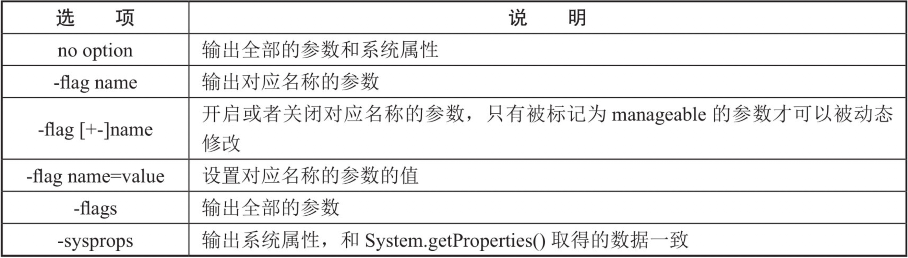

**2 pid说明**

​	Java进程ID，必须要加上。

**3 使用案例**

​	由于jinfo可以查看JVM配置信息，也可用于调整JVM的配置参数，下面分两类案例分别讲解如何使用。

**4 jinfo用于查看JVM配置信息案例**

​	如下代码主要用于启动一个JVM进程，方便通过该进程查看JVM相关配置信息。

<div style="text-align:center;font-weight:bold;">jinfo查看JVM配置参数案例</div>

```java
package com.coding.jvm07.cmd;

import java.util.Scanner;

public class ScannerTest {
    public static void main(String[] args) {
        Scanner scanner = new Scanner(System.in);
        String info = scanner.next();
    }
}
```

​	程序很简单，只需要保证程序在执行状态即可。首先使用jps命令查看进程ID，如下所示。

```bash
# 查看进程ID
% jps -l
86721 jdk.jcmd/sun.tools.jps.Jps
20065 
86172 com.intellij.idea.Main
86510 com.coding.jvm07.cmd.ScannerTest
```

​	上面出现两个结果，ScannerTest程序的进程ID是81928，另外几个进程ID表示jps命令本身的进程以及IDEA开发工具的进程。下面使用jinfo命令来查看JVM配置参数，命令如下。

1、根据进程ID查询全部参数和系统属性。

```bash
# 查看全部参数和系统属性
% jinfo 86510
```

```bash
Java System Properties:
#Thu Dec 05 20:59:18 CST 2024
java.runtime.name=Java(TM) SE Runtime Environment
sun.boot.library.path=/Library/Java/JavaVirtualMachines/jdk-1.8.jdk/Contents/Home/jre/lib
java.vm.version=25.421-b09
gopherProxySet=false
java.vm.vendor=Oracle Corporation
java.vendor.url=http\://java.oracle.com/
path.separator=\:
java.rmi.server.randomIDs=true
java.vm.name=Java HotSpot(TM) 64-Bit Server VM
file.encoding.pkg=sun.io
user.country=CN
sun.java.launcher=SUN_STANDARD
sun.os.patch.level=unknown
java.vm.specification.name=Java Virtual Machine Specification
user.dir=/Users/wenqiu/IdeaProjects/backend-jvm-learning
java.runtime.version=1.8.0_421-b09
java.awt.graphicsenv=sun.awt.CGraphicsEnvironment
java.endorsed.dirs=/Library/Java/JavaVirtualMachines/jdk-1.8.jdk/Contents/Home/jre/lib/endorsed
os.arch=aarch64
java.io.tmpdir=/var/folders/lx/7npzn7997ps3t7g11876yqvw0000gn/T/
line.separator=\n
socksProxyPort=7890
java.vm.specification.vendor=Oracle Corporation
https.proxyHost=127.0.0.1
os.name=Mac OS X
sun.jnu.encoding=UTF-8
java.library.path=/Users/wenqiu/Library/Java/Extensions\:/Library/Java/Extensions\:/Network/Library/Java/Extensions\:/System/Library/Java/Extensions\:/usr/lib/java\:.
http.proxyPort=7890
java.specification.name=Java Platform API Specification
java.class.version=52.0
sun.management.compiler=HotSpot 64-Bit Tiered Compilers
os.version=15.1.1
http.nonProxyHosts=192.168.0.0/16|*.192.168.0.0/16|10.0.0.0/8|*.10.0.0.0/8|172.16.0.0/12|*.172.16.0.0/12|127.0.0.1|localhost|*.localhost|local|*.local|timestamp.apple.com|*.timestamp.apple.com|sequoia.apple.com|*.sequoia.apple.com|seed-sequoia.siri.apple.com|*.seed-sequoia.siri.apple.com
user.home=/Users/wenqiu
user.timezone=Asia/Shanghai
java.awt.printerjob=sun.lwawt.macosx.CPrinterJob
file.encoding=UTF-8
java.specification.version=1.8
java.class.path=/Library/Java/JavaVirtualMachines/jdk-1.8.jdk/Contents/Home/jre/lib/charsets.jar\:/Library/Java/JavaVirtualMachines/jdk-1.8.jdk/Contents/Home/jre/lib/deploy.jar\:/Library/Java/JavaVirtualMachines/jdk-1.8.jdk/Contents/Home/jre/lib/ext/cldrdata.jar\:/Library/Java/JavaVirtualMachines/jdk-1.8.jdk/Contents/Home/jre/lib/ext/dnsns.jar\:/Library/Java/JavaVirtualMachines/jdk-1.8.jdk/Contents/Home/jre/lib/ext/jaccess.jar\:/Library/Java/JavaVirtualMachines/jdk-1.8.jdk/Contents/Home/jre/lib/ext/jfxrt.jar\:/Library/Java/JavaVirtualMachines/jdk-1.8.jdk/Contents/Home/jre/lib/ext/localedata.jar\:/Library/Java/JavaVirtualMachines/jdk-1.8.jdk/Contents/Home/jre/lib/ext/nashorn.jar\:/Library/Java/JavaVirtualMachines/jdk-1.8.jdk/Contents/Home/jre/lib/ext/sunec.jar\:/Library/Java/JavaVirtualMachines/jdk-1.8.jdk/Contents/Home/jre/lib/ext/sunjce_provider.jar\:/Library/Java/JavaVirtualMachines/jdk-1.8.jdk/Contents/Home/jre/lib/ext/sunpkcs11.jar\:/Library/Java/JavaVirtualMachines/jdk-1.8.jdk/Contents/Home/jre/lib/ext/zipfs.jar\:/Library/Java/JavaVirtualMachines/jdk-1.8.jdk/Contents/Home/jre/lib/javaws.jar\:/Library/Java/JavaVirtualMachines/jdk-1.8.jdk/Contents/Home/jre/lib/jce.jar\:/Library/Java/JavaVirtualMachines/jdk-1.8.jdk/Contents/Home/jre/lib/jfr.jar\:/Library/Java/JavaVirtualMachines/jdk-1.8.jdk/Contents/Home/jre/lib/jfxswt.jar\:/Library/Java/JavaVirtualMachines/jdk-1.8.jdk/Contents/Home/jre/lib/jsse.jar\:/Library/Java/JavaVirtualMachines/jdk-1.8.jdk/Contents/Home/jre/lib/management-agent.jar\:/Library/Java/JavaVirtualMachines/jdk-1.8.jdk/Contents/Home/jre/lib/plugin.jar\:/Library/Java/JavaVirtualMachines/jdk-1.8.jdk/Contents/Home/jre/lib/resources.jar\:/Library/Java/JavaVirtualMachines/jdk-1.8.jdk/Contents/Home/jre/lib/rt.jar\:/Users/wenqiu/IdeaProjects/backend-jvm-learning/jvm-07-tools/target/classes\:/Users/wenqiu/.m2/repository/junit/junit/4.6/junit-4.6.jar\:/Users/wenqiu/.m2/repository/org/projectlombok/lombok/1.18.30/lombok-1.18.30.jar\:/Applications/IntelliJ IDEA.app/Contents/lib/idea_rt.jar
user.name=wenqiu
socksProxyHost=127.0.0.1
java.vm.specification.version=1.8
sun.java.command=com.coding.jvm07.cmd.ScannerTest
java.home=/Library/Java/JavaVirtualMachines/jdk-1.8.jdk/Contents/Home/jre
sun.arch.data.model=64
user.language=zh
java.specification.vendor=Oracle Corporation
awt.toolkit=sun.lwawt.macosx.LWCToolkit
java.vm.info=mixed mode
java.version=1.8.0_421
java.ext.dirs=/Users/wenqiu/Library/Java/Extensions\:/Library/Java/JavaVirtualMachines/jdk-1.8.jdk/Contents/Home/jre/lib/ext\:/Library/Java/Extensions\:/Network/Library/Java/Extensions\:/System/Library/Java/Extensions\:/usr/lib/java
sun.boot.class.path=/Library/Java/JavaVirtualMachines/jdk-1.8.jdk/Contents/Home/jre/lib/resources.jar\:/Library/Java/JavaVirtualMachines/jdk-1.8.jdk/Contents/Home/jre/lib/rt.jar\:/Library/Java/JavaVirtualMachines/jdk-1.8.jdk/Contents/Home/jre/lib/jsse.jar\:/Library/Java/JavaVirtualMachines/jdk-1.8.jdk/Contents/Home/jre/lib/jce.jar\:/Library/Java/JavaVirtualMachines/jdk-1.8.jdk/Contents/Home/jre/lib/charsets.jar\:/Library/Java/JavaVirtualMachines/jdk-1.8.jdk/Contents/Home/jre/lib/jfr.jar\:/Library/Java/JavaVirtualMachines/jdk-1.8.jdk/Contents/Home/jre/classes
http.proxyHost=127.0.0.1
java.vendor=Oracle Corporation
java.specification.maintenance.version=5
file.separator=/
java.vendor.url.bug=http\://bugreport.sun.com/bugreport/
sun.io.unicode.encoding=UnicodeBig
sun.cpu.endian=little
https.proxyPort=7890
socksNonProxyHosts=192.168.0.0/16|*.192.168.0.0/16|10.0.0.0/8|*.10.0.0.0/8|172.16.0.0/12|*.172.16.0.0/12|127.0.0.1|localhost|*.localhost|local|*.local|timestamp.apple.com|*.timestamp.apple.com|sequoia.apple.com|*.sequoia.apple.com|seed-sequoia.siri.apple.com|*.seed-sequoia.siri.apple.com
ftp.nonProxyHosts=192.168.0.0/16|*.192.168.0.0/16|10.0.0.0/8|*.10.0.0.0/8|172.16.0.0/12|*.172.16.0.0/12|127.0.0.1|localhost|*.localhost|local|*.local|timestamp.apple.com|*.timestamp.apple.com|sequoia.apple.com|*.sequoia.apple.com|seed-sequoia.siri.apple.com|*.seed-sequoia.siri.apple.com
sun.cpu.isalist=

VM Flags:
-XX:CICompilerCount=12 -XX:InitialHeapSize=2147483648 -XX:MaxHeapSize=32203866112 -XX:MaxNewSize=10734272512 -XX:MinHeapDeltaBytes=524288 -XX:NewSize=715653120 -XX:OldSize=1431830528 -XX:+UseCompressedClassPointers -XX:+UseCompressedOops -XX:+UseParallelGC 

VM Arguments:
jvm_args: -javaagent:/Applications/IntelliJ IDEA.app/Contents/lib/idea_rt.jar=65060:/Applications/IntelliJ IDEA.app/Contents/bin -Dfile.encoding=UTF-8 
java_command: com.coding.jvm07.cmd.ScannerTest
java_class_path (initial): /Library/Java/JavaVirtualMachines/jdk-1.8.jdk/Contents/Home/jre/lib/charsets.jar:/Library/Java/JavaVirtualMachines/jdk-1.8.jdk/Contents/Home/jre/lib/deploy.jar:/Library/Java/JavaVirtualMachines/jdk-1.8.jdk/Contents/Home/jre/lib/ext/cldrdata.jar:/Library/Java/JavaVirtualMachines/jdk-1.8.jdk/Contents/Home/jre/lib/ext/dnsns.jar:/Library/Java/JavaVirtualMachines/jdk-1.8.jdk/Contents/Home/jre/lib/ext/jaccess.jar:/Library/Java/JavaVirtualMachines/jdk-1.8.jdk/Contents/Home/jre/lib/ext/jfxrt.jar:/Library/Java/JavaVirtualMachines/jdk-1.8.jdk/Contents/Home/jre/lib/ext/localedata.jar:/Library/Java/JavaVirtualMachines/jdk-1.8.jdk/Contents/Home/jre/lib/ext/nashorn.jar:/Library/Java/JavaVirtualMachines/jdk-1.8.jdk/Contents/Home/jre/lib/ext/sunec.jar:/Library/Java/JavaVirtualMachines/jdk-1.8.jdk/Contents/Home/jre/lib/ext/sunjce_provider.jar:/Library/Java/JavaVirtualMachines/jdk-1.8.jdk/Contents/Home/jre/lib/ext/sunpkcs11.jar:/Library/Java/JavaVirtualMachines/jdk-1.8.jdk/Contents/Home/jre/lib/ext/zipfs.jar:/Library/Java/JavaVirtualMachines/jdk-1.8.jdk/Contents/Home/jre/lib/javaws.jar:/Library/Java/JavaVirtualMachines/jdk-1.8.jdk/Contents/Home/jre/lib/jce.jar:/Library/Java/JavaVirtualMachines/jdk-1.8.jdk/Contents/Home/jre/lib/jfr.jar:/Library/Java/JavaVirtualMachines/jdk-1.8.jdk/Contents/Home/jre/lib/jfxswt.jar:/Library/Java/JavaVirtualMachines/jdk-1.8.jdk/Contents/Home/jre/lib/jsse.jar:/Library/Java/JavaVirtualMachines/jdk-1.8.jdk/Contents/Home/jre/lib/management-agent.jar:/Library/Java/JavaVirtualMachines/jdk-1.8.jdk/Contents/Home/jre/lib/plugin.jar:/Library/Java/JavaVirtualMachines/jdk-1.8.jdk/Contents/Home/jre/lib/resources.jar:/Library/Java/JavaVirtualMachines/jdk-1.8.jdk/Contents/Home/jre/lib/rt.jar:/Users/wenqiu/IdeaProjects/backend-jvm-learning/jvm-07-tools/target/classes:/Users/wenqiu/.m2/repository/junit/junit/4.6/junit-4.6.jar:/Users/wenqiu/.m2/repository/org/projectlombok/lombok/1.18.30/lombok-1.18.30.jar:/Applications/IntelliJ IDEA.app/Conte
Launcher Type: SUN_STANDARD
```

​	结果中含有Java系统属性(System Properties)和JVM参数(VM Flags)。

2、根据进程ID查询系统属性（选项：-sysprops）命令如下。

```bash
# 查看系统属性
% jinfo -sysprops 86510
```

​	通过Java代码获取系统属性如下代码所示。

<div style="text-align:center;font-weight:bold;">获取系统属性</div>

```java
package com.coding.jvm07.cmd;

import java.util.Properties;

public class SystemProTest {
    public static void main(String[] args) {
        Properties properties = System.getProperties();
        String[] split = properties.toString().split(",");
        for (String str : split) {
            System.out.println(str);
        }
    }
}

```

​	运行结果如下图所示（部分结果）。

<div style="text-align:center;font-weight:bold;">Java代码获取系统属性</div>

```bash
{java.runtime.name=Java(TM) SE Runtime Environment
 sun.boot.library.path=/Library/Java/JavaVirtualMachines/jdk-1.8.jdk/Contents/Home/jre/lib
 java.vm.version=25.421-b09
 gopherProxySet=false
 java.vm.vendor=Oracle Corporation
 java.vendor.url=http://java.oracle.com/
 path.separator=:
 java.vm.name=Java HotSpot(TM) 64-Bit Server VM
 file.encoding.pkg=sun.io
 user.country=CN
 sun.java.launcher=SUN_STANDARD
 sun.os.patch.level=unknown
 java.vm.specification.name=Java Virtual Machine Specification
 user.dir=/Users/wenqiu/IdeaProjects/backend-jvm-learning
 java.runtime.version=1.8.0_421-b09
 java.awt.graphicsenv=sun.awt.CGraphicsEnvironment
 java.endorsed.dirs=/Library/Java/JavaVirtualMachines/jdk-1.8.jdk/Contents/Home/jre/lib/endorsed
 os.arch=aarch64
 java.io.tmpdir=/var/folders/lx/7npzn7997ps3t7g11876yqvw0000gn/T/
 line.separator=

 socksProxyPort=7890
 java.vm.specification.vendor=Oracle Corporation
 https.proxyHost=127.0.0.1
 os.name=Mac OS X
 sun.jnu.encoding=UTF-8
 java.library.path=/Users/wenqiu/Library/Java/Extensions:/Library/Java/Extensions:/Network/Library/Java/Extensions:/System/Library/Java/Extensions:/usr/lib/java:.
 http.proxyPort=7890
 java.specification.name=Java Platform API Specification
 java.class.version=52.0
 sun.management.compiler=HotSpot 64-Bit Tiered Compilers
 os.version=15.1.1
 http.nonProxyHosts=192.168.0.0/16|*.192.168.0.0/16|10.0.0.0/8|*.10.0.0.0/8|172.16.0.0/12|*.172.16.0.0/12|127.0.0.1|localhost|*.localhost|local|*.local|timestamp.apple.com|*.timestamp.apple.com|sequoia.apple.com|*.sequoia.apple.com|seed-sequoia.siri.apple.com|*.seed-sequoia.siri.apple.com
 user.home=/Users/wenqiu
 user.timezone=
 java.awt.printerjob=sun.lwawt.macosx.CPrinterJob
 file.encoding=UTF-8
 java.specification.version=1.8
 java.class.path=/Library/Java/JavaVirtualMachines/jdk-1.8.jdk/Contents/Home/jre/lib/charsets.jar:/Library/Java/JavaVirtualMachines/jdk-1.8.jdk/Contents/Home/jre/lib/deploy.jar:/Library/Java/JavaVirtualMachines/jdk-1.8.jdk/Contents/Home/jre/lib/ext/cldrdata.jar:/Library/Java/JavaVirtualMachines/jdk-1.8.jdk/Contents/Home/jre/lib/ext/dnsns.jar:/Library/Java/JavaVirtualMachines/jdk-1.8.jdk/Contents/Home/jre/lib/ext/jaccess.jar:/Library/Java/JavaVirtualMachines/jdk-1.8.jdk/Contents/Home/jre/lib/ext/jfxrt.jar:/Library/Java/JavaVirtualMachines/jdk-1.8.jdk/Contents/Home/jre/lib/ext/localedata.jar:/Library/Java/JavaVirtualMachines/jdk-1.8.jdk/Contents/Home/jre/lib/ext/nashorn.jar:/Library/Java/JavaVirtualMachines/jdk-1.8.jdk/Contents/Home/jre/lib/ext/sunec.jar:/Library/Java/JavaVirtualMachines/jdk-1.8.jdk/Contents/Home/jre/lib/ext/sunjce_provider.jar:/Library/Java/JavaVirtualMachines/jdk-1.8.jdk/Contents/Home/jre/lib/ext/sunpkcs11.jar:/Library/Java/JavaVirtualMachines/jdk-1.8.jdk/Contents/Home/jre/lib/ext/zipfs.jar:/Library/Java/JavaVirtualMachines/jdk-1.8.jdk/Contents/Home/jre/lib/javaws.jar:/Library/Java/JavaVirtualMachines/jdk-1.8.jdk/Contents/Home/jre/lib/jce.jar:/Library/Java/JavaVirtualMachines/jdk-1.8.jdk/Contents/Home/jre/lib/jfr.jar:/Library/Java/JavaVirtualMachines/jdk-1.8.jdk/Contents/Home/jre/lib/jfxswt.jar:/Library/Java/JavaVirtualMachines/jdk-1.8.jdk/Contents/Home/jre/lib/jsse.jar:/Library/Java/JavaVirtualMachines/jdk-1.8.jdk/Contents/Home/jre/lib/management-agent.jar:/Library/Java/JavaVirtualMachines/jdk-1.8.jdk/Contents/Home/jre/lib/plugin.jar:/Library/Java/JavaVirtualMachines/jdk-1.8.jdk/Contents/Home/jre/lib/resources.jar:/Library/Java/JavaVirtualMachines/jdk-1.8.jdk/Contents/Home/jre/lib/rt.jar:/Users/wenqiu/IdeaProjects/backend-jvm-learning/jvm-07-tools/target/classes:/Users/wenqiu/.m2/repository/junit/junit/4.6/junit-4.6.jar:/Users/wenqiu/.m2/repository/org/projectlombok/lombok/1.18.30/lombok-1.18.30.jar:/Applications/IntelliJ IDEA.app/Contents/lib/idea_rt.jar
 user.name=wenqiu
 socksProxyHost=127.0.0.1
 java.vm.specification.version=1.8
 sun.java.command=com.coding.jvm07.cmd.SystemProTest
 java.home=/Library/Java/JavaVirtualMachines/jdk-1.8.jdk/Contents/Home/jre
 sun.arch.data.model=64
 user.language=zh
 java.specification.vendor=Oracle Corporation
 awt.toolkit=sun.lwawt.macosx.LWCToolkit
 java.vm.info=mixed mode
 java.version=1.8.0_421
 java.ext.dirs=/Users/wenqiu/Library/Java/Extensions:/Library/Java/JavaVirtualMachines/jdk-1.8.jdk/Contents/Home/jre/lib/ext:/Library/Java/Extensions:/Network/Library/Java/Extensions:/System/Library/Java/Extensions:/usr/lib/java
 sun.boot.class.path=/Library/Java/JavaVirtualMachines/jdk-1.8.jdk/Contents/Home/jre/lib/resources.jar:/Library/Java/JavaVirtualMachines/jdk-1.8.jdk/Contents/Home/jre/lib/rt.jar:/Library/Java/JavaVirtualMachines/jdk-1.8.jdk/Contents/Home/jre/lib/jsse.jar:/Library/Java/JavaVirtualMachines/jdk-1.8.jdk/Contents/Home/jre/lib/jce.jar:/Library/Java/JavaVirtualMachines/jdk-1.8.jdk/Contents/Home/jre/lib/charsets.jar:/Library/Java/JavaVirtualMachines/jdk-1.8.jdk/Contents/Home/jre/lib/jfr.jar:/Library/Java/JavaVirtualMachines/jdk-1.8.jdk/Contents/Home/jre/classes
 http.proxyHost=127.0.0.1
 java.vendor=Oracle Corporation
 java.specification.maintenance.version=5
 file.separator=/
 java.vendor.url.bug=http://bugreport.sun.com/bugreport/
 sun.io.unicode.encoding=UnicodeBig
 sun.cpu.endian=little
 https.proxyPort=7890
 socksNonProxyHosts=192.168.0.0/16|*.192.168.0.0/16|10.0.0.0/8|*.10.0.0.0/8|172.16.0.0/12|*.172.16.0.0/12|127.0.0.1|localhost|*.localhost|local|*.local|timestamp.apple.com|*.timestamp.apple.com|sequoia.apple.com|*.sequoia.apple.com|seed-sequoia.siri.apple.com|*.seed-sequoia.siri.apple.com
 ftp.nonProxyHosts=192.168.0.0/16|*.192.168.0.0/16|10.0.0.0/8|*.10.0.0.0/8|172.16.0.0/12|*.172.16.0.0/12|127.0.0.1|localhost|*.localhost|local|*.local|timestamp.apple.com|*.timestamp.apple.com|sequoia.apple.com|*.sequoia.apple.com|seed-sequoia.siri.apple.com|*.seed-sequoia.siri.apple.com
 sun.cpu.isalist=}
```

​	通过比较两者结果一致。

3、查看全部JVM参数配置（选项：-flags），命令如下

```bash
# 查看全部JVM参数配置
% jinfo -flags 86510
```

```bash
VM Flags:
-XX:CICompilerCount=12 -XX:InitialHeapSize=2147483648 -XX:MaxHeapSize=32203866112 -XX:MaxNewSize=10734272512 -XX:MinHeapDeltaBytes=524288 -XX:NewSize=715653120 -XX:OldSize=1431830528 -XX:+UseCompressedClassPointers -XX:+UseCompressedOops -XX:+UseParallelGC 
```

​	可以看到里面包含初始堆大小、最大堆大小等参数配置。

4、查看某个Java进程的具体参数的值（选项：-flag name），命令如下。

```bash
# 查看JVM是否使用了ParallelGC垃圾收集器
% jinfo -flag UseParallelGC 86510
-XX:+UseParallelGC
```

​	可以看到结果为-XX:+UseParallelGC，其中UseParallelGC前面的“+”表示已经使用，如果没有使用的话，用“-”表示。也可以查看某个参数的具体数值，比如查看新生代对象晋升到老年代对象的最大年龄，命令如下。

```bash
# 新生代对象晋升到老年代对象的最大年龄
% jinfo -flag MaxTenuringThreshold 86510
-XX:MaxTenuringThreshold=15
```

​	从结果可知新生代对象晋升到老年代对象的最大年龄是15。

**5 jinfo用于修改JVM配置信息案例**

1、开启或者关闭对应名称的参数(-flag [+-]name)（或者称为修改布尔类型的参数）。

​	首先查看是否开启输出GC日志的参数，如果GC日志参数是开启状态，那么使用jinfo命令关闭；如果GC日志参数是关闭状态，那么使用jinfo命令开启，命令如下。

```bash
# 查看是否有设置输出GC日志
% jinfo -flag PrintGC 86510
-XX:-PrintGC
# 设置开启打印GC日志
% jinfo -flag +PrintGC 86510
# 查看是否开启输出GC日志成功
% jinfo -flag PrintGC 86510 
-XX:+PrintGC
# 设置关闭打印GC日志
% jinfo -flag -PrintGC 86510
# 查看是否关闭输出GC日志成功
% jinfo -flag PrintGC 86510 
-XX:-PrintGC
```

​	对于布尔类型的JVM参数，不仅可以使用-flag [+-]name的形式来进行值的改变，也可以使用-flag name=value的形式修改运行时的JVM参数。但是对value赋值必须是1或者0,1表示“+”，0表示“-”，如下所示。

```bash
# 设置开启打印GC日志
% jinfo -flag PringGC=1 86510
# 设置关闭打印GC日志
% jinfo -flag PringGC=0 86510
```

2、修改对应名称的参数(-flag name=value)（或者称为修改非布尔类型的参数）

​	修改非布尔类型MaxHeapFreeRatio的值，命令如下。

```bash
# 查看是否设置MaxHeapFreeRatio
% jinfo -flag MaxHeapFreeRatio 86510
-XX:MaxHeapFreeRatio=100
# 修改MaxHeapFreeRatio值
% jinfo -flag MaxHeapFreeRatio=80 86510
# 查看修改结果
% jinfo -flag MaxHeapFreeRatio 86510   
-XX:MaxHeapFreeRatio=80
```

​	除了使用jinfo查看JVM配置参数之外，还有如下方式。

```bash
# 查看所有JVM中-XX类型参数启动初始值
% java -XX:+PrintFlagsInitial
# 查看所有JVM中-XX类型参数
% java -XX:+PrintFlagsFinal -version
# 查看已经被用户或者JVM设置过的详细的-XX类型参赛的名称和值
% java -XX:+PrintCommandLineFlags -version
```

​	输出结果中包含五列。第一列表示参数的数据类型，第二列表示参数名称，第四列表示参数的值，第五列表示参数的类别。第三列“=”是参数的默认值，而“:=”表示参数被用户或者JVM赋值了。可以通过“java -XX:+PrintFlagsFinal | grep":="”命令查看哪些参数是被用户或者JVM赋值的。java -XX:+PrintFlagsInitial只展示了第三列为“=”的参数。

​	java -XX:+PrintCommandLineFlags执行结果是java -XX:+PrintFlagsFinal的结果中带有“:=”的部分参数。可以通过该命令快捷地查看修改过的参数。

## 21.5 jmap：导出内存映像文件和内存使用情况

​	jmap(JVM Memory Map)用于生成JVM的内存转储快照，生成heapdump文件且可以查询finalize执行队列，以及Java堆与元空间的一些信息。jmap的作用并不仅仅是为了获取dump文件（堆转储快照文件，二进制文件），它还可以获取目标Java进程的内存相关信息，包括Java堆各区域的使用情况、堆中对象的统计信息、类加载信息等。

​	开发人员可以在控制台中输入命令“jmap -help”，查阅jmap工具的具体使用方式和标准选项配置。

​	jmap的基本使用语法如下。

```bash
% jmap -help
Usage:
    jmap -clstats <pid>
        to connect to running process and print class loader statistics
    jmap -finalizerinfo <pid>
        to connect to running process and print information on objects awaiting finalization
    jmap -histo[:live] <pid>
        to connect to running process and print histogram of java object heap
        if the "live" suboption is specified, only count live objects
    jmap -dump:<dump-options> <pid>
        to connect to running process and dump java heap
    jmap -? -h --help
        to print this help message

    dump-options:
      live         dump only live objects; if not specified,
                   all objects in the heap are dumped.
      format=b     binary format
      file=<file>  dump heap to <file>

    Example: jmap -dump:live,format=b,file=heap.bin <pid>
```

| 基本语法                                                 |
| :------------------------------------------------------- |
| jmap [option] <pid>                                      |
| jmap [option] <executable <core>>                        |
| jmap [option] [server_id@]<remote server ip or hostname> |

**1 [ options ]选项说明**

​	jmap工具[options]主要选项如下表所示。

<div style="text-align:center;font-weight:bold;">jmap命令[options]选项说明</div>

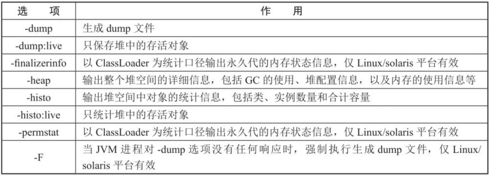

​	这些参数和Linux下输入显示的命令多少会有一些不同，也受JDK版本的影响。其中选项-dump、-heap、-histo是开发人员在工作中使用频率较高的指令。

**2 使用案例**

<span style="color:#1E90FF;font-weight:bold;">1、-dump选项：导出内存映像文件。</span>

​	一般来说，使用jmap指令生成dump文件的操作算得上是最常用的jmap命令之一，将堆中所有存活对象导出至一个文件之中。执行该命令，JVM会将整个Java堆二进制格式转储到指定filename的文件中。live子选项是可选的，如果指定了live子选项，堆中只有存活的对象会被转储。

​	通常在写dump文件前会触发一次Full GC，所以dump文件里保存的都是Full GC后留下的对象信息。由于生成dump文件比较耗时，因此大家需要耐心等待，尤其是大内存镜像生成dump文件需要耗费更长的时间来完成。

​	如果想要浏览dump文件，读者可以使用jhat（Java堆分析工具）读取生成的文件，也可以使用本书第22章介绍的可视化工具进行解读，比如MAT内存分析工具。获取dump文件有手动获取和自动获取两种方式。

​	手动获取的意思是当发现系统需要优化或者需要解决内存问题时，需要开发者主动执行jmap命令，导出dump文件，手动获取命令如下。

```bash
# 手动获取堆内存全部信息
% jmap -dump:format=b,file=<filename.hprof><pid>
# 手动获取堆内存存活对象全部信息
% jmap -dump:live,format=b,file=<filename.hprof><pid>
```

​	如下代码所示，往堆内存中存放数据，然后导出dump文件。

<span style="color:#40E0D0;">案例1：堆中存放对象案例</span>

- 代码

```java
package com.coding.jvm07.cmd;

import java.util.ArrayList;

/**
 * -Xms60m -Xmx60m -XX:SurvivorRatio=8
 */
public class GCTest {
    public static void main(String[] args) {
        ArrayList<byte[]> list = new ArrayList<>();
        for (int i = 0; i < 1000; i++) {
            byte[] arr = new byte[1024 * 100]; // 100KB
            list.add(arr);
            try {
                Thread.sleep(60);
            } catch (InterruptedException e) {
                e.printStackTrace();
            }
        }
    }
}

```

​	运行程序，最终该程序会产生内存溢出，在执行过程中使用上述命令导出dump文件即可，运行结果如下所示。
```bash
% jmap -dump:format=b,file=$HOME/Misc/dump1.hprof 12991
Heap dump file created
```

​	上述命令中，file表示指定文件目录，这里将文件放到$HOME（用户目录），12991表示Java进程ID，结果如下图所示，dump1.hprof就是导出的结果文件。

<div style="text-align:center;font-weight:bold;">dump文件所在目录</div>

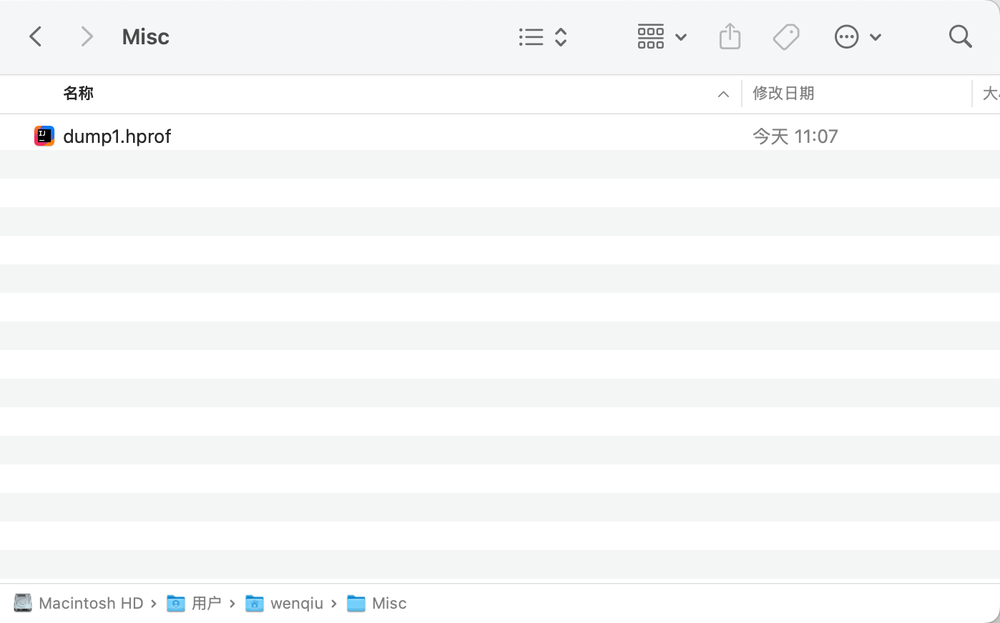

​	当程序发生内存溢出退出系统时，一些瞬时信息都随着程序的终止而消失，而重现OOM问题往往比较困难或者耗时。若能在OOM时，自动导出dump文件就显得非常迫切。可以配置JVM参数“-XX:+HeapDumpOnOutOfMemoryError：”使程序发生OOM时，导出应用程序的当前堆快照。

​	依然使用代码<span style="color:blue;font-weight:bold;">案例1：堆中存放对象案例</span>，在启动程序之前，在idea中添加如下JVM参数配置。

```bash
-Xms60m
-Xmx60m
-XX:SurvivorRatio=8
-XX:+HeapDumpOnOutOfMemoryError
-XX:HeapDumpPath=/Users/wenqiu/Misc/autoDump.hprof
```

​	启动程序，运行结果如下图所示。

<div style="text-align:center;font-weight:bold;">内存溢出运行结果</div>

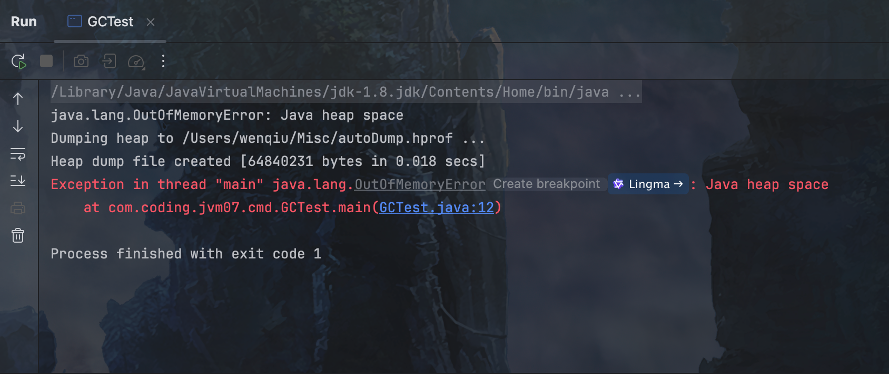

<div style="text-align:center;font-weight:bold;">dump文件所在目录</div>

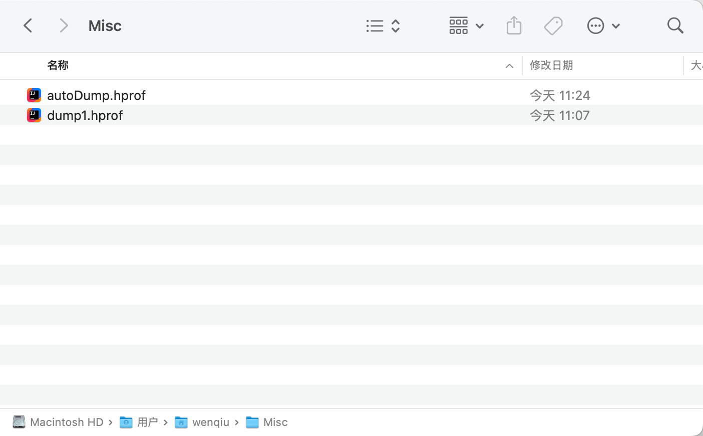

<span style="color:#1E90FF;font-weight:bold;">2、-heap选项：显示堆内存相关信息。</span>

​	命令如下。

```bash
% jmap -heap <pid>
```

​	依然使用代码<span style="color:blue;font-weight:bold;">案例1：堆中存放对象案例</span>，执行命令运行结果如下：

```bash
# 由于SIP开启，无法执行成功
% csrutil status
System Integrity Protection status: enabled.
% jmap -heap 12991
Attaching to process ID 12991, please wait...
ERROR: attach: task_for_pid(12991) failed: '(os/kern) failure' (5)
Error attaching to process: sun.jvm.hotspot.debugger.DebuggerException: Can't attach to the process. Could be caused by an incorrect pid or lack of privileges.
sun.jvm.hotspot.debugger.DebuggerException: sun.jvm.hotspot.debugger.DebuggerException: Can't attach to the process. Could be caused by an incorrect pid or lack of privileges.
```


​	打印heap的概要信息、GC使用的算法、heap的配置和使用情况，可以判断当前堆内存使用情况以及垃圾回收情况。

​	可以看到最大堆大小为60MB，和前面的VM配置信息一致；新生代大小等于Eden区加From区加To的大小，总共为20MB，符合新生代和老年代比例大小为2:1；老年代大小为40MB，老年代使用率达到了99.53%，说明老年代空间是不足的。

<span style="color:#1E90FF;font-weight:bold;">3、-hiso选项：显示堆中对象的统计信息</span>

​	命令如下。

```bash
% jmap -histo 38053

 num     #instances         #bytes  class name
----------------------------------------------
   1:          3622      118247168  [I
   2:          7029        5513136  [B
   3:         25594        2099600  [C
   4:         17710         425040  java.lang.String
   5:          6855         306024  [Ljava.lang.Object;
   6:          1841         209368  java.lang.Class
   7:          2958         165648  jdk.internal.org.objectweb.asm.Item
   8:          1302         114576  java.lang.reflect.Method
   9:          3031          96992  java.util.HashMap$Node
  10:           162          94560  [Ljdk.internal.org.objectweb.asm.Item;
  11:          3829          93936  [Ljava.lang.Class;
```

​	运行结果如下，由于篇幅原因，展示部分结果。

​	上面结果中，instances表示当前的实例数量；bytes表示对象占用的内存大小；classs name表示类名，按照内存大小逆序排列。

<span style="color:#1E90FF;font-weight:bold;">4、-permstat选项</span>

​	该选项主要以ClassLoader为口径输出永久代的内存状态信息，仅对Linux和solaris平台有效。

<span style="color:#1E90FF;font-weight:bold;">5、-finalizerinfo选项</span>

​	该选项主要用来显示F-Queue中等待Finalize线程执行finalize方法的对象，就是说查看堆积在finalizer队列中的对象。仅对Linux和solaris平台有效。

<span style="color:#1E90FF;font-weight:bold;">6、-F选项。</span>

​	该选项用于当JVM进程对-dump选项没有任何响应时，可使用此选项强制执行生成dump文件。仅对Linux和solaris平台有效。

​	由于jmap将访问堆中的所有对象，为了保证在此过程中不被应用线程干扰，jmap需要借助安全点机制，让所有线程不改变堆中数据的状态。也就是说，由jmap导出的堆快照必定是安全点位置的。这可能导致基于该快照的分析结果存在偏差。例如，<span style="color:#FF00FF;font-weight:bold;">假设在编译生成的机器码中，某些对象的生命周期在两个安全点之间，那么：live选项将无法探知到这些对象。另外如果某个线程长时间无法跑到安全点，jmap将一直等待下去。与前面讲的jstat不同，垃圾收集器会主动将jstat所需要的摘要数据保存至固定位置中，而jstat只需要直接读取即可</span>。

## 21.6 jhat:JDK自带堆分析工具

​	jhat(JVM Heap Analysis Tool)命令一般与jmap命令搭配使用，用于分析jmap生成的dump文件（堆转储快照）。jhat内置了一个微型的HTTP/HTML服务器，生成dump文件的分析结果后，用户可以在浏览器中查看分析结果。

​	使用了jhat命令，就启动了一个http服务，端口是7000，即通过访问http://localhost:7000/就可以在浏览器中查看结果。jhat命令在JDK9中已经被删除，官方建议用VisualVM代替。实际工作中一般不会直接在生产服务器使用jhat分析dump文件。

​	jhat的基本使用语法如下。

```bash
% jhat [options] [hostid]
```

**1 [ options ]选项说明**

​	jhat工具[options]主要选项如下表所示。

<div style="text-align:center;font-weight:bold;">jps命令[options]选项说明</div>

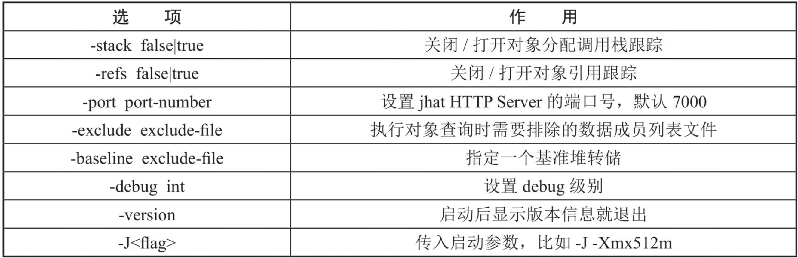

​	下面使用jhat命令分析jmap导出的dump文件，命令如下。

```bash
% jhat /Users/wenqiu/Misc/autoDump.hprof
```

​	运行结果如下所示。

```bash
% jhat /Users/wenqiu/Misc/autoDump.hprof
Reading from /Users/wenqiu/Misc/autoDump.hprof...
Dump file created Fri Dec 06 11:24:16 CST 2024
Snapshot read, resolving...
Resolving 32384 objects...
Chasing references, expect 6 dots......
Eliminating duplicate references......
Snapshot resolved.
Started HTTP server on port 7000
Server is ready.
```

​	当界面出现Server is ready时，就可以在浏览器访问 http://localhost:7000/ 了，如下图所示。

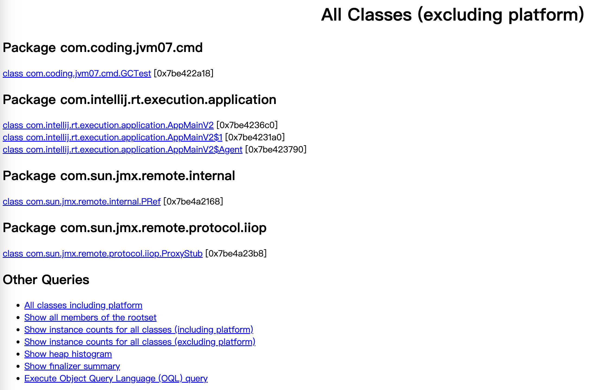

​	分析结果默认以包的形式分组展示，当分析内存溢出或者内存泄漏问题的时候一般会用到“Show heap histogram”功能，它的作用和jmap –histo一样，如下图所示。

<div style="text-align:center;font-weight:bold;">Heap Histogram</div>

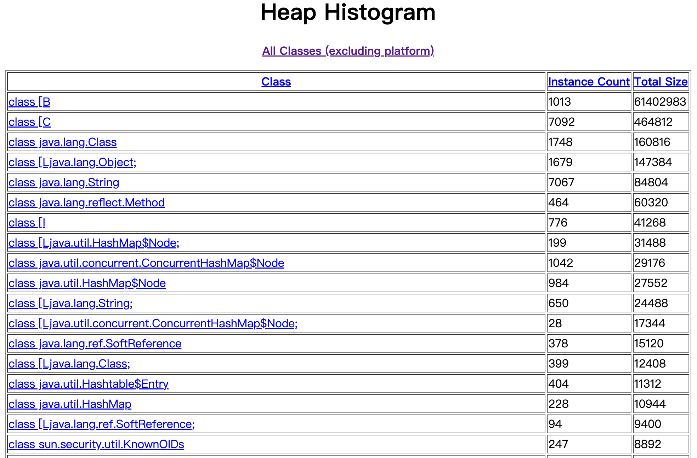

​	在这里可以找到内存中使用空间最大的对象。通常导出的堆快照信息非常大，可能很难通过页面上简单的链接索引找到想要的信息。为此，jhat还支持使用OQL(Object Query Language)语句对堆快照进行查询。执行OQL语言的界面非常简洁。单击“Execute Object Query Language(OQL)query”即可进入OQL查询页面，它是一种类似SQL的语法，可以对内存中的对象进行查询统计，例如代码清单21-4，查询了内存中长度大于500的字符串。

<span style="color:#40E0D0;">案例1：通过OQL语句查询</span>
-  代码

```sql
select s from java.lang.String s where s.value.length > 500
```

​	结果如下图所示。

​	平常使用jhat命令的频率并不高，所以此处也不再过多赘述，各位读者将此作为了解内容即可。

<div style="text-align:center;font-weight:bold;">OQL查询结果集</div>

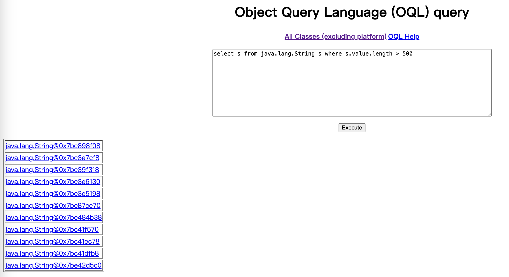

## 21.7 jstack：打印JVM中线程快照

​	jstack(JVM Stack Trace)用于生成JVM指定进程当前时刻的线程快照(Thread Dump)，方便用户跟踪JVM堆栈信息。线程快照就是当前JVM内指定进程的每一条线程正在执行的方法堆栈的集合。

​	生成线程快照的作用是可用于定位线程出现长时间停顿的原因，如线程间死锁、死循环、请求外部资源导致的长时间等待等问题，这些都是导致线程长时间停顿的常见原因。当线程出现停顿时，就可以用jstack显示各个线程调用的堆栈情况。

​	在线程快照中，有下面几种状态，如下表所示。

<div style="text-align:center;font-weight:bold;">线程状态</div>

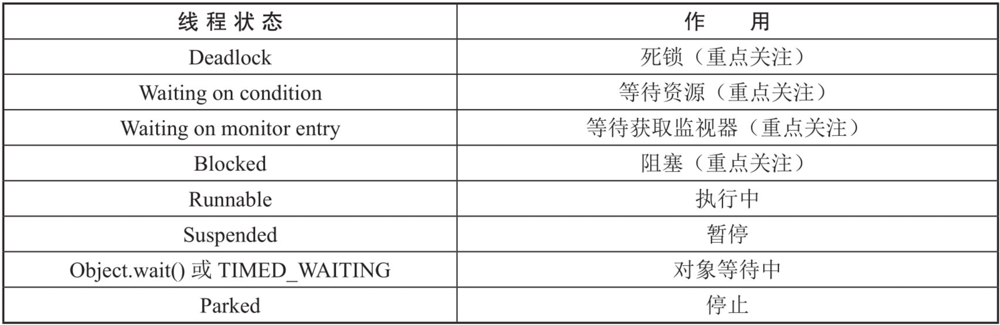

​	其中线程的Deadlock、Waiting on condition、Waiting on monitor entry以及Blocked状态需要在分析线程栈的时候重点关注。

​	jstack的基本使用语法如下。

```bash
% jstack -help
Usage:
    jstack [-l] <pid>
        (to connect to running process)
    jstack -F [-m] [-l] <pid>
        (to connect to a hung process)
    jstack [-m] [-l] <executable> <core>
        (to connect to a core file)
    jstack [-m] [-l] [server_id@]<remote server IP or hostname>
        (to connect to a remote debug server)

Options:
    -F  to force a thread dump. Use when jstack <pid> does not respond (process is hung)
    -m  to print both java and native frames (mixed mode)
    -l  long listing. Prints additional information about locks
    -h or -help to print this help message
```

| 基本语法                |
| ----------------------- |
| jstack [ option ] <pid> |

**1 [ options ]选项说明**

​	jstack工具[options]主要选项如下表所示。

<div style="text-align:center;font-weight:bold;">jps命令[options]选项说明</div>

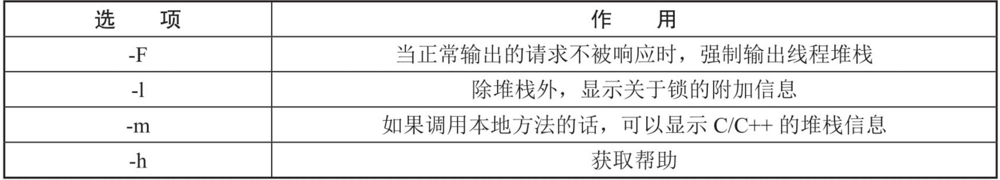

**2 使用案例**

​	如下代码演示了线程死锁，使用jstack命令观察线程状态。

<span style="color:#40E0D0;">案例1：死锁案例</span>

- 代码

```java
package com.coding.jvm07.cmd;

/**
 * 演示线程的死锁问题
 * 互相的 BLOCKED 导致-> Found one Java-level deadlock:
 */
public class ThreadDeadLock {
    public static void main(String[] args) {
        StringBuilder sb1 = new StringBuilder();
        StringBuilder sb2 = new StringBuilder();

        new Thread(() -> {
            synchronized (sb1) {
                sb1.append("a");
                sb2.append("1");

                try {
                    Thread.sleep(100);
                } catch (InterruptedException e) {
                    e.printStackTrace();
                }

                synchronized (sb2) {
                    sb1.append("b");
                    sb2.append("2");

                    System.out.println("sb1 = " + sb1);
                    System.out.println("sb2 = " + sb2);
                }
            }
        }).start();

        new Thread(() -> {
            synchronized (sb2) {
                sb1.append("c");
                sb2.append("3");

                try {
                    Thread.sleep(100);
                } catch (InterruptedException e) {
                    e.printStackTrace();
                }

                synchronized (sb1) {
                    sb1.append("d");
                    sb2.append("4");

                    System.out.println("sb1 = " + sb1);
                    System.out.println("sb2 = " + sb2);
                }
            }
        }).start();

    }
}

```

​	上面例子很简单，启动了两个线程，分别获取对方的资源，如此造成死锁。下面启动程序，使用jstack命令查看线程状态，命令如下，其中1776是程序的进程ID。

```bash
% jstack 26627
```

​	运行结果如下。

<div style="text-align:center;font-weight:bold;">获取所有线程的状态</div>

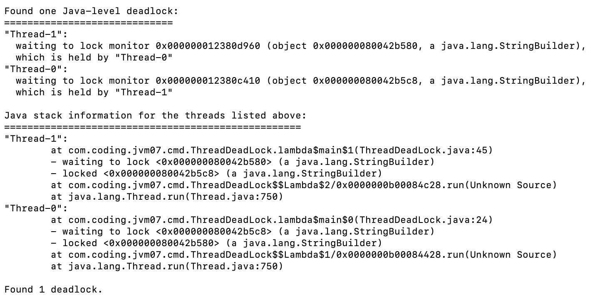

​	从上面结果中可以发现，Thread-1线程和Thread-0线程互相等待对方的资源，问题代码出现“com.coding.jvm07.cmd.ThreadDeadLock.lambda$main$1”行。在死锁情况出现时，可以很方便地帮助定位到问题。也可以通过Thread.getAllStackTraces()方法获取所有线程的状态，如下代码所示。

<span style="color:#40E0D0;">案例2：获取所有线程的状态</span>

- 代码

```bash
package com.coding.jvm07.cmd;

import java.util.Map;
import java.util.Set;

public class AllStackTrace {
    public static void main(String[] args) {
        Map<Thread, StackTraceElement[]> all = Thread.getAllStackTraces();
        Set<Map.Entry<Thread, StackTraceElement[]>> entries = all.entrySet();
        for (Map.Entry<Thread, StackTraceElement[]> entry : entries) {
            Thread t = entry.getKey();
            StackTraceElement[] value = entry.getValue();
            System.out.println("【Thread name is :" + t.getName() + "】");
            for (StackTraceElement stackTraceElement : value) {
                System.out.println("\t" + stackTraceElement.toString());
            }
        }
    }
}

```

​	运行结果如图21-26所示，可以看到各个线程的状态。

<div style="text-align:center;font-weight:bold;">获取所有线程状态</div>

```bash
【Thread name is :Signal Dispatcher】
【Thread name is :Reference Handler】
	java.lang.Object.wait(Native Method)
	java.lang.Object.wait(Object.java:502)
	java.lang.ref.Reference.tryHandlePending(Reference.java:191)
	java.lang.ref.Reference$ReferenceHandler.run(Reference.java:153)
【Thread name is :main】
	java.lang.Thread.dumpThreads(Native Method)
	java.lang.Thread.getAllStackTraces(Thread.java:1615)
	com.coding.jvm07.cmd.AllStackTrace.main(AllStackTrace.java:8)
【Thread name is :Monitor Ctrl-Break】
	java.util.Collections.unmodifiableSet(Collections.java:1120)
	jdk.net.ExtendedSocketOptions.options(ExtendedSocketOptions.java:154)
	jdk.net.ExtendedSocketOptions.<clinit>(ExtendedSocketOptions.java:142)
	java.lang.Class.forName0(Native Method)
	java.lang.Class.forName(Class.java:264)
	sun.net.ExtendedSocketOptions.<clinit>(ExtendedSocketOptions.java:157)
	java.net.AbstractPlainSocketImpl.<clinit>(AbstractPlainSocketImpl.java:348)
	java.net.Socket.setImpl(Socket.java:520)
	java.net.Socket.<init>(Socket.java:441)
	java.net.Socket.<init>(Socket.java:228)
	com.intellij.rt.execution.application.AppMainV2$1.run(AppMainV2.java:52)
【Thread name is :Finalizer】
	java.lang.Object.wait(Native Method)
	java.lang.ref.ReferenceQueue.remove(ReferenceQueue.java:150)
	java.lang.ref.ReferenceQueue.remove(ReferenceQueue.java:171)
	java.lang.ref.Finalizer$FinalizerThread.run(Finalizer.java:188)
```

## 21.8 jcmd：多功能命令行

​	在JDK1.7以后，新增了一个命令行工具jcmd。它是一个多功能的工具，可以用来实现前面除了jstat之外所有命令的功能，比如用它来导出堆、内存使用、查看Java进程、导出线程信息、执行GC、JVM运行时间等。jcmd拥有jmap的大部分功能，并且官方也推荐使用jcmd命令代替jmap命令。

​	至于jstat的功能，虽然jcmd复制了jstat的部分代码，并支持通过PerfCounter.print子命令来打印所有的Performance Counter，但是它没有保留jstat的输出格式，也没有重复打印的功能。

​	jcmd的基本使用语法如下表所示。

<div style="text-align:center;font-weight:bold;">jcmd命令使用语法</div>

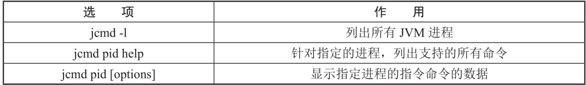

​	命令jcmd可以针对给定的JVM进程执行一条命令。首先来看一下使用jcmd列出当前系统中的所有Java进程，命令如下所示。

```bash
% jcmd -l
```

​	运行结果如下图所示。可以看到当前有5个Java进程，其中包含命令自身。

<div style="text-align:center;font-weight:bold;">jcmd命令查看进程ID</div>

```bash
% jcmd -l
1732 com.intellij.idea.Main
853 
28821 sun.tools.jcmd.JCmd -l
28599 org.jetbrains.jps.cmdline.Launcher /Applications/IntelliJ IDEA.app/Contents/plugins/java/lib/jps-builders.jar:/Applications/IntelliJ IDEA.app/Contents/plugins/java/lib/jps-builders-6.jar:/Applications/IntelliJ IDEA.app/Contents/plugins/java/lib/jps-javac-extension.jar:/Applications/IntelliJ IDEA.app/Contents/lib/util-8.jar:/Applications/IntelliJ IDEA.app/Contents/lib/util_rt.jar:/Applications/IntelliJ IDEA.app/Contents/lib/platform-loader.jar:/Applications/IntelliJ IDEA.app/Contents/lib/annotations.jar:/Applications/IntelliJ IDEA.app/Contents/lib/trove.jar:/Applications/IntelliJ IDEA.app/Contents/plugins/java/lib/jetbrains.kotlinx.metadata.jvm.jar:/Applications/IntelliJ IDEA.app/Contents/plugins/java/lib/netty-codec-protobuf.jar:/Applications/IntelliJ IDEA.app/Contents/lib/protobuf.jar:/Applications/IntelliJ IDEA.app/Contents/lib/jps-model.jar:/Applications/IntelliJ IDEA.app/Contents/plugins/java/lib/javac2.jar:/Applications/IntelliJ IDEA.app/Contents/lib/forms_rt.jar:/Applications/IntelliJ IDEA.app/Contents/
28600 com.coding.jvm07.cmd.ScannerTest
```

1、jcmd pid help选项：针对指定的进程，列出支持的所有命令。

```bash
% jcmd 28600 help
```

​	运行结果如下。

```bash
% jcmd 28600 help
28600:
The following commands are available:
JFR.stop
JFR.start
JFR.dump
JFR.check
VM.native_memory
VM.check_commercial_features
VM.unlock_commercial_features
ManagementAgent.stop
ManagementAgent.start_local
ManagementAgent.start
VM.classloader_stats
GC.rotate_log
Thread.print
JVMTI.data_dump
VM.class_hierarchy
GC.class_stats
GC.class_histogram
GC.heap_dump
GC.finalizer_info
GC.heap_info
GC.run_finalization
GC.run
VM.info
VM.uptime
VM.dynlibs
VM.set_flag
VM.flags
VM.system_properties
VM.command_line
VM.version
help

For more information about a specific command use 'help <command>'.
```

​	上面罗列的是进程号为28600的JVM进程支持的jcmd相关命令操作，jcmd pid [options]中的options就是上面列出的所有命令参数选项。下面介绍常用的几个参数选项。

2、查看JVM启动时间VM.uptime。

```bash
% jcmd 28600 VM.uptime
```

​	运行结果如下所示，当前JVM进程已经运行了387.199秒。

```bash
% jcmd 28600 VM.uptime 
28600:
387.199 s
```

3、打印线程栈信息。

```bash
% jcmd 28600 Thread.print
```

​	运行结果如下所示。

```bash
% jcmd 28600 Thread.print
28600:
2024-12-07 22:36:31
Full thread dump Java HotSpot(TM) 64-Bit Server VM (25.421-b09 mixed mode):

"JMX server connection timeout 24" #24 daemon prio=9 os_prio=31 tid=0x000000011708b000 nid=0x6b03 in Object.wait() [0x000000017457e000]
   java.lang.Thread.State: TIMED_WAITING (on object monitor)
	at java.lang.Object.wait(Native Method)
	at com.sun.jmx.remote.internal.ServerCommunicatorAdmin$Timeout.run(ServerCommunicatorAdmin.java:168)
	- locked <0x0000000805fc33a8> (a [I)
	at java.lang.Thread.run(Thread.java:750)

"RMI Scheduler(0)" #23 daemon prio=9 os_prio=31 tid=0x0000000117067000 nid=0x6903 waiting on condition [0x0000000174372000]
   java.lang.Thread.State: TIMED_WAITING (parking)
	at sun.misc.Unsafe.park(Native Method)
......省略......
```

4、查看系统中类的统计信息

```bash
% jcmd 28600 GC.class_histogram
```

​	运行结果如下所示，篇幅原因，只展示部分结果。

```bash
% jcmd 28600 GC.class_histogram
28600:

 num     #instances         #bytes  class name
----------------------------------------------
   1:          9326         596832  [C
   2:          9300         223200  java.lang.String
   3:          1834         208576  java.lang.Class
   4:           487         190504  [B
   5:          1148         101024  java.lang.reflect.Method
   6:          1796          97552  [Ljava.lang.Object;
   7:          1532          49024  java.util.HashMap$Node
   8:           774          44312  [I
   9:           583          41976  java.lang.reflect.Field
  10:          1160          37120  java.util.concurrent.ConcurrentHashMap$Node
  11:          1349          31760  [Ljava.lang.Class;
  12:           897          28848  [Ljava.lang.String;
  ......省略......
```

5、导出堆信息。

```bash
% jcmd 28600 GC.heap_dump /Users/wenqiu/Misc/jcmd.hprof
```

​	运行结果如图21-31所示，可以直接存储堆文件。

```bash
% jcmd 28600 GC.heap_dump /Users/wenqiu/Misc/jcmd.hprof
28600:
Heap dump file created
```

6、获得系统的Properties内容。

```bash
% jcmd 28600 VM.system_properties
```

​	运行结果如下所示，篇幅原因，只展示部分结果。

```bash
% jcmd 28600 VM.system_properties
28600:
#Sat Dec 07 22:47:06 CST 2024
java.runtime.name=Java(TM) SE Runtime Environment
sun.boot.library.path=/Library/Java/JavaVirtualMachines/jdk-1.8.jdk/Contents/Home/jre/lib
java.vm.version=25.421-b09
gopherProxySet=false
java.vm.vendor=Oracle Corporation
java.vendor.url=http\://java.oracle.com/
path.separator=\:
java.rmi.server.randomIDs=true
java.vm.name=Java HotSpot(TM) 64-Bit Server VM
file.encoding.pkg=sun.io
user.country=CN
sun.java.launcher=SUN_STANDARD
......省略......
```

7、获得启动参数。

```bash
% jcmd 28600 VM.flags
```

​	运行结果如下图所示。

```bash
% jcmd 28600 VM.flags
28600:
-XX:CICompilerCount=12 -XX:InitialHeapSize=2147483648 -XX:MaxHeapSize=32203866112 -XX:MaxNewSize=10734272512 -XX:MinHeapDeltaBytes=524288 -XX:NewSize=715653120 -XX:OldSize=1431830528 -XX:+UseCompressedClassPointers -XX:+UseCompressedOops -XX:+UseParallelGC 
```

## 21.9 jstatd：远程主机信息收集

​	之前的指令只涉及监控本机的Java应用程序，而在这些工具中，一些监控工具也支持对远程计算机的监控（如jps、jstat）。为了启用远程监控，则需要配合使用jstatd工具。

​	命令jstatd是一个RMI服务端程序，它的作用相当于代理服务器，建立本地计算机与远程监控工具的通信。jstatd服务器将本机的Java应用程序信息传递到远程计算机。执行原理如下图所示。

<div style="text-align:center;font-weight:bold;">jstatd执行原理图</div>

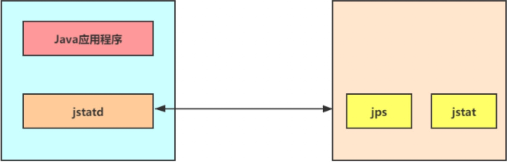

​	直接打开jstatd服务器可能会抛出访问拒绝异常，这是因为jstatd程序没有足够的权限，如图21-35所示。jstatd内容各位读者了解即可。

```bash
% jstatd
Could not create remote object
access denied ("java.util.PropertyPermission" "java.rmi.server.ignoreSubClasses" "write")
java.security.AccessControlException: access denied ("java.util.PropertyPermission" "java.rmi.server.ignoreSubClasses" "write")
	at java.security.AccessControlContext.checkPermission(AccessControlContext.java:472)
	at java.security.AccessController.checkPermission(AccessController.java:886)
	at java.lang.SecurityManager.checkPermission(SecurityManager.java:549)
	at java.lang.System.setProperty(System.java:806)
	at sun.tools.jstatd.Jstatd.main(Jstatd.java:139)
```

# 第22章 JVM监控及诊断工具

​	生产环境中，一旦出现内存泄漏，长期运行下非常容易引发内存溢出(Out Of Memory,OOM)故障。如果没有一个好的工具提供给开发人员定位问题和分析问题，那么这将会是一场噩梦。第21章讲解的命令行工具或命令行工具的组合使用或许能帮助获取目标Java应用性能相关的基础信息，但它们也有局限性，比如展示结果不够直观。本章将会介绍界面化的软件帮助我们诊断JVM相关问题。

## 22.1 概述

​	在工作中，通过命令行工具定位应用的性能问题，存在下列局限。

1、无法获取方法级别的分析数据，如方法间的调用关系、各方法的调用次数和调用时间等（这对定位应用性能瓶颈至关重要）。

2、要求用户登录到目标Java应用所在的宿主机上，使用起来不是很方便。

3、分析数据通过终端输出，结果展示不够直观。

​	基于上面的原因，JDK提供了一些内存泄漏的分析工具，如jconsole、jvisualvm等，用于辅助开发人员定位问题，但是这些工具很多时候并不足以满足快速定位问题的需求。所以本章作者将会介绍更多的实用性工具。我们把这些工具大致分为两种，一种是JDK自带的工具，另一种是第三方工具。

​	JDK自带的工具包含下面3种类型。

1、jconsole:JDK自带的可视化监控工具，位于JDK的bin目录下。用于查看Java应用程序的运行概况、监控堆信息、永久区（或元空间）使用情况、类加载情况等。

2、VisualVM:JDK自带的可视化监视工具，位于JDK的bin目录下。它提供了一个可视界面，用于查看JVM上运行的基于Java技术的应用程序的详细信息。

3、JMC:Java Mission Control，内置Java Flight Recorder。能够以极低的性能开销收集JVM的性能数据。

​	第三方工具包含下面4种类型。

1、MAT(Memory Analyzer Tool)：基于Eclipse的内存分析工具，是一个快速、功能丰富的Java heap分析工具，它可以帮助我们查找内存泄漏和减少内存消耗。

2、JProfiler：商业软件，需要付费使用，功能非常强大。

3、Arthas:Alibaba开源的Java诊断工具，深受开发者喜爱。

4、Btrace:Java运行时追踪工具。可以在不停机的情况下，跟踪指定的方法调用、构造函数调用和系统内存等信息。

## 22.2 jconsole

​	从Java5开始，jconsole就是JDK中自带的Java监控和管理控制台，主要用于对JVM中内存、线程和类等信息的监控，是一个基于JMX(Java Management Extensions)的GUI性能监控工具。jconsole使用JVM的扩展机制获取并展示JVM中运行的应用程序的性能和资源消耗等信息。

​	jconsole可以通过三种方式连接正在运行的JVM，分别是Local、Remote和Advanced。

​	1、Local：使用jconsole连接一个正在本地系统运行的JVM，并且执行程序的用户和运行jconsole的用户必须是同一个系统用户。jconsole使用文件系统的授权通过RMI连接器连接到平台的MBean服务器上。

​	2、Remote：使用下面的URL通过RMI连接器连接到一个JMX代理，service:jmx:rmi:///jndi/rmi://hostName:portNum/jmxrmio hostName填入主机名称，portNum为JMX代理启动时指定的端口。jconsole为建立连接，需要在环境变量中设置mx.remote.credentials来指定用户名和密码，从而进行授权。

​	3、Advanced：使用一个特殊的URL连接JMX代理。一般情况使用自己定制的连接器而不是RMI提供的连接器来连接JMX代理。

​	jconsole工具安装在JDK的bin目录下，启动jconsole后，将自动搜索本机运行的JVM进程，不需要jps命令来查询指定。双击其中一个JVM进程即可开始监控，也可使用“远程进程”来连接远程服务器，如下图所示。

<div style="text-align:center;font-weight:bold;">jconsole启动界面</div>

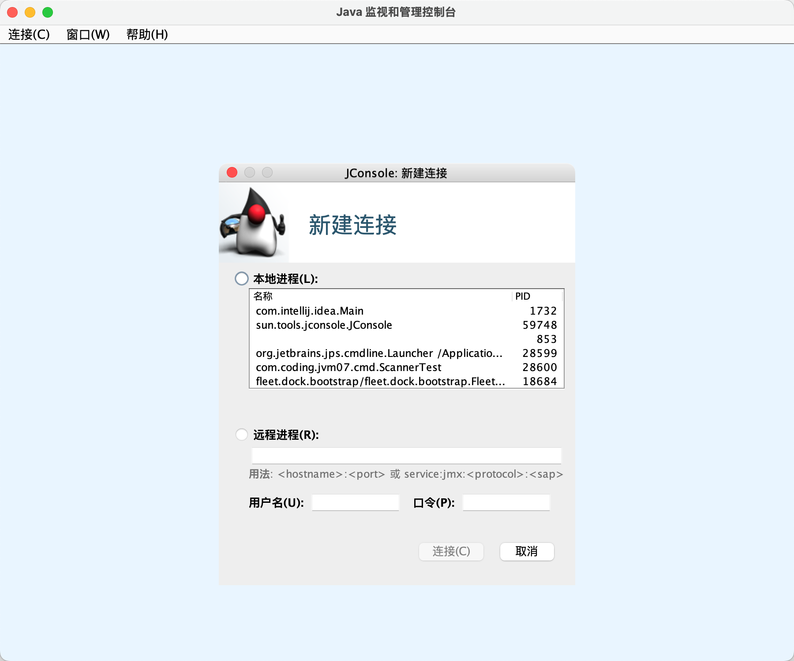

​	设置JVM参数如下，运行如下代码，然后使用jconsole进行监控。

<span style="color:#40E0D0;">案例1：jconsole示例代码</span>

- 代码

```java
package com.coding.jvm07.vmoptions;

import java.util.ArrayList;
import java.util.Random;

/**
 * -Xms600m -Xmx600m -XX:SurvivorRatio=8
 */
public class HeapInstanceTest {
    byte[] buffer = new byte[new Random().nextInt(1024 * 100)];

    public static void main(String[] args) {
        try {
            Thread.sleep(10000);
        } catch (InterruptedException e) {
            e.printStackTrace();
        }

        ArrayList<HeapInstanceTest> list = new ArrayList<>();
        while (true) {
            list.add(new HeapInstanceTest());
            try {
                Thread.sleep(20);
            } catch (InterruptedException e) {
                e.printStackTrace();
            }
        }
    }
}

```

​	选择如上代码的程序进程进入jconsole主界面，有“概览” “内存” “线程” “类” “VM概要” 和 “MBean” 六个选项卡，如下图所示。其中“概览”选项卡显示了关于堆内存使用量、线程、类、JVM进程的CPU占用率的关键监视信息。

<div style="text-align:center;font-weight:bold;">jconsole主界面</div>

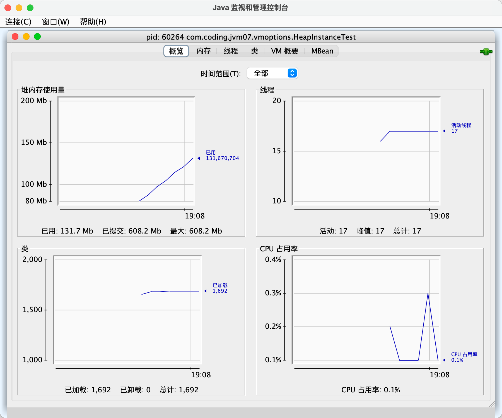

​	“内存”选项卡相当于jstat命令，用于监视收集器管理的JVM内存（Java堆和非堆）变化趋势，还可在“详细信息”选项观察GC执行的时间及次数，如下图所示。

​	“已用”代表当前使用的内存总量。使用的内存总量是指所有的对象占用的内存，包括可达和不可达的对象。

​	“已提交”内存数量会随时间变化而变化。JVM可能将某些内存释放，还给操作系统，所以已提交内存可能比启动时初始分配的内存量要少，但是已提交内存总是大于或等于已使用内存。

​	“最大值”代表内存管理可用的最大内存数量。此值可能改变或者为未定义，如果JVM试图增加使用内存容量超出了提交内存，那么即使使用内存小于或等于最大内存（比如系统虚拟内存较低），内存分配仍可能失败。

<div style="text-align:center;font-weight:bold;">内存选项卡</div>

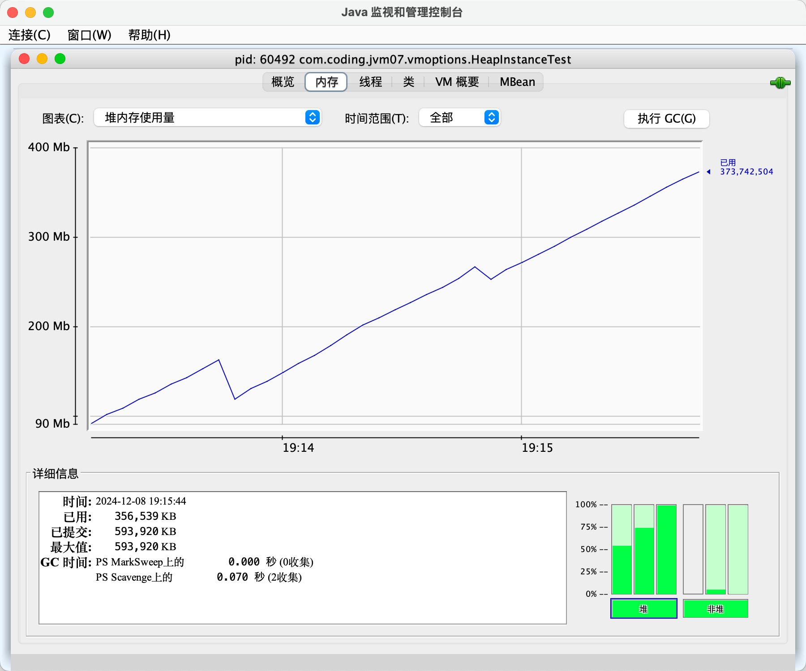

​	“线程”选项卡中活动线程代表当前活动的守护线程和非守护线程数量。峰值代表自JVM启动后，活动线程最高数量。该选项卡可以监控发生死锁的线程，在页面最下面有“检测死锁选项”。代码清单22-2演示了程序发生死锁的情况，使用jconsole检测如图22-4和图22-5所示。

<span style="color:#40E0D0;">案例2：死锁案例</span>

- 代码

```java
package com.coding.jvm07.cmd;

/**
 * 演示线程的死锁问题
 * 互相的 BLOCKED 导致-> Found one Java-level deadlock:
 */
public class ThreadDeadLock {
    public static void main(String[] args) {
        StringBuilder sb1 = new StringBuilder();
        StringBuilder sb2 = new StringBuilder();

        new Thread(() -> {
            synchronized (sb1) {
                sb1.append("a");
                sb2.append("1");

                try {
                    Thread.sleep(100);
                } catch (InterruptedException e) {
                    e.printStackTrace();
                }

                synchronized (sb2) {
                    sb1.append("b");
                    sb2.append("2");

                    System.out.println("sb1 = " + sb1);
                    System.out.println("sb2 = " + sb2);
                }
            }
        }).start();

        new Thread(() -> {
            synchronized (sb2) {
                sb1.append("c");
                sb2.append("3");

                try {
                    Thread.sleep(100);
                } catch (InterruptedException e) {
                    e.printStackTrace();
                }

                synchronized (sb1) {
                    sb1.append("d");
                    sb2.append("4");

                    System.out.println("sb1 = " + sb1);
                    System.out.println("sb2 = " + sb2);
                }
            }
        }).start();

    }
}

```

<div style="text-align:center;font-weight:bold;">“线程”选项卡</div>


<div style="text-align:center;font-weight:bold;">线程死锁检测</div>

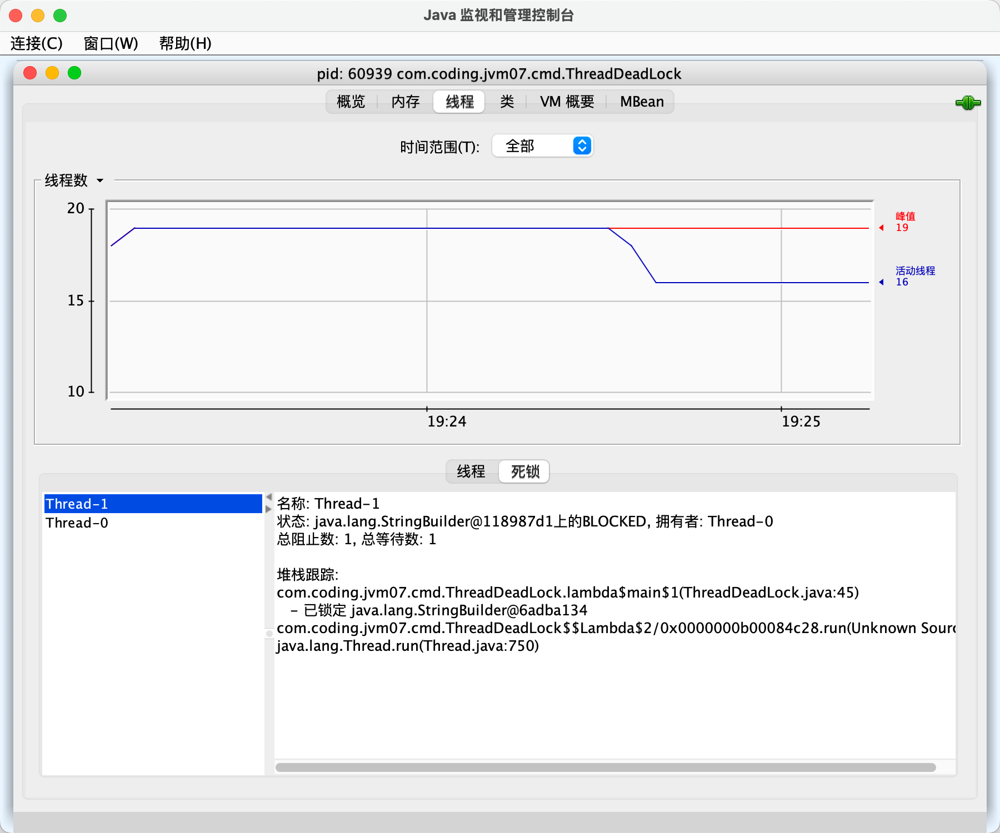

​	从上图可知线程Thread-1在等待一个被线程Thread-0持有StringBuilder对象，单击线程Thread-0则显示它也在等待一个Integer对象，被线程Thread-1持有，这样两个线程就互相卡住，都不存在等到锁释放的希望了，导致死锁。

​	VM概要”选项卡可清楚地显示指定的JVM参数及堆信息，如下图所示。

<div style="text-align:center;font-weight:bold;">VM概要”选项卡</div>

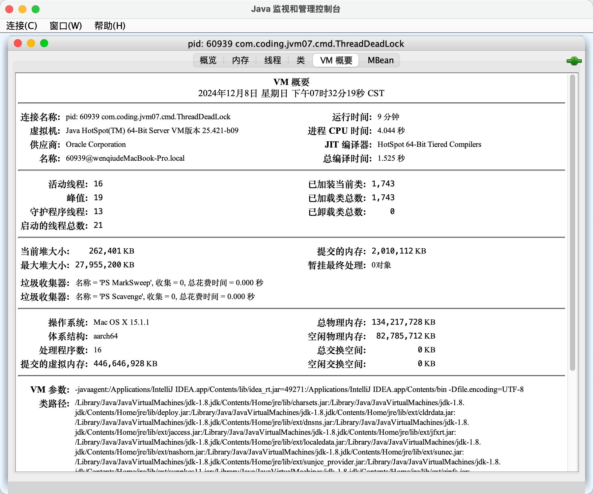

## 22.3 VisualVM

​	VisualVM是一个功能强大的故障诊断和性能监控的可视化工具。它集成了多个JDK命令行工具，使用VisualVM可用于显示JVM进程及进程的配置和环境信息（功能类似jps和jinfo命令），监视应用程序的CPU、GC、堆、方法区和线程的信息（功能类似jstat和jstack命令）等，甚至代替jconsole。在JDK6 Update 7以后，VisualVM便作为JDK的一部分发布（VisualVM在JDK/bin目录下，称为jvisualvm），这也意味着它完全免费。除了作为JDK的一部分发布以外，VisualVM也可以作为独立的软件安装，官网主页如下图所示。

​	VisualVM官网：https://visualvm.github.io/index.html

<div style="text-align:center;font-weight:bold;">VisualVM官网主页</div>


### 22.3.1 插件安装

​	VisualVM的一大特点是支持插件扩展，并且插件安装非常方便。在安装插件之前，需要先启动VisualVM，启动VisualVM有两种方式。VisualVM工具在JDK/bin目录下，双击jvisualvm.exe即可启动VisualVM。也可以直接从IntelliJ IDEA开发工具启动VisualVM监控工具。IntelliJ IDEA开发工具中安装VisualVM步骤如下。

1、点击“File”→“Settings”→“Plugins”，搜索“VisualVM Launcher”，安装重启即可，如下图所示。

<div style="text-align:center;font-weight:bold;">VisualVM Launcher插件安装</div>

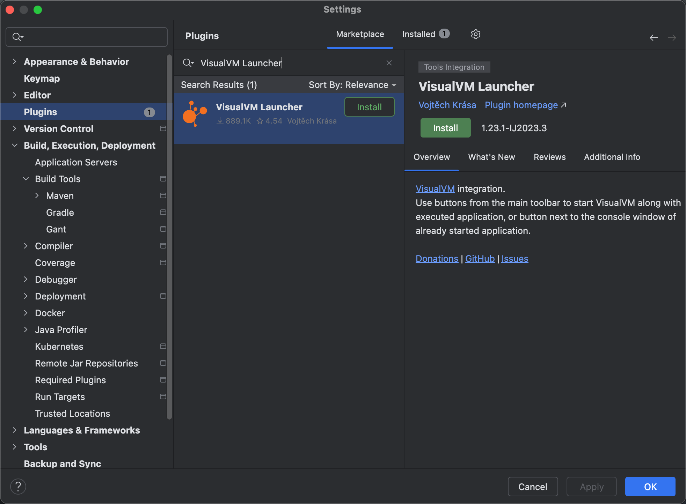

2、配置Idea VisualVM Launcher插件，如下图所示。

​	<span style="color:red;font-weight:bold;">由于Mac下Java没有随带jvisualvm命令，这里安装VisualVM。</span>

​	安装后的命令目录是：/Applications/VisualVM.app/Contents/Resources/visualvm/bin/visualvm

​	安装后的配置目录是：/Applications/VisualVM.app/Contents/Resources/visualvm/etc/visualvm.conf

<div style="text-align:center;font-weight:bold;">配置VisualVM Launcher插件</div>

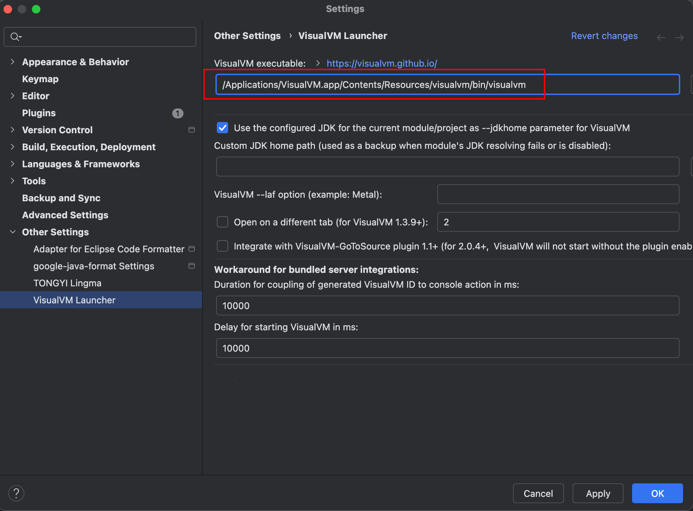

3、通过IntelliJ IDEA中的VisualVM启动应用程序，如下图所示。

<div style="text-align:center;font-weight:bold;">VisualVM Launcher启动应用程序</div>

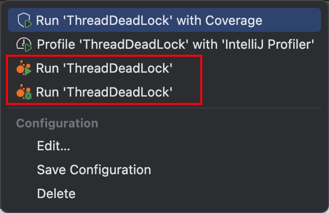

​	启动VisualVM后，可以离线下载插件文件*.nbm，然后在“插件”对话框的“已下载”选项下，添加已下载的插件即可。建议各位读者安装VisualGC插件，该插件可以查看JVM垃圾回收的具体信息，VisualVM插件主页如下图所示。

<div style="text-align:center;font-weight:bold;">VisualVM插件主页</div>

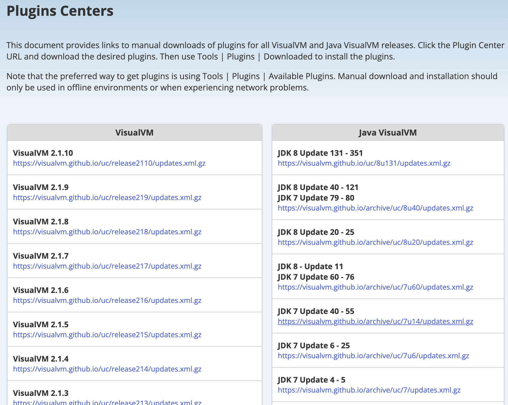

​	除了离线安装插件，也可以选择在线安装。在VisualVM中选择“工具”→“可用插件”，找到Visual GC插件，单击“安装”即可，如下图所

示。

<div style="text-align:center;font-weight:bold;">Visual GC插件在线安装</div>

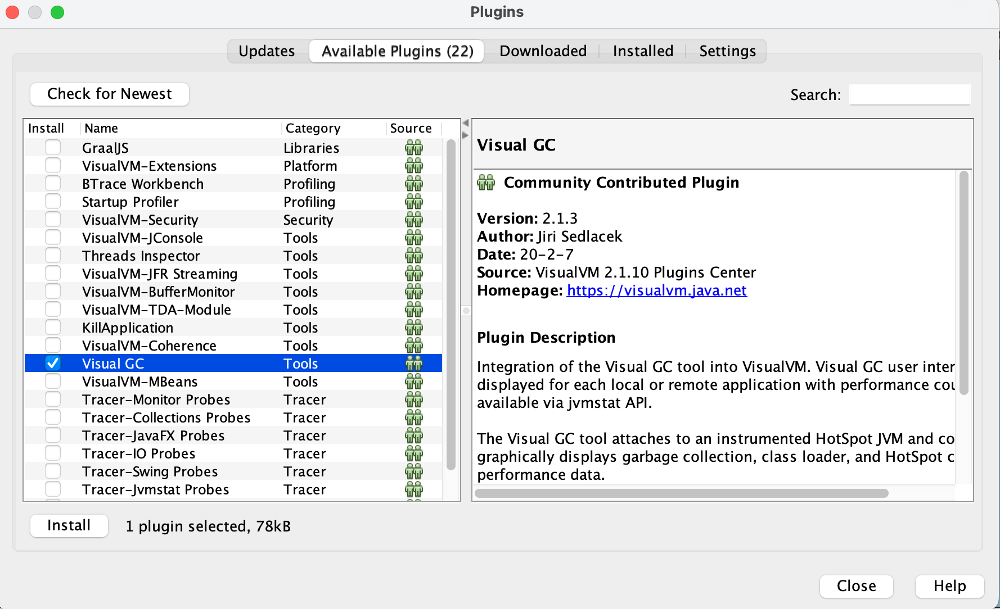


<span style="color:orange;font-weight:bold;">如何为Java VisualVM安装插件？</span>

插件地址：https://visualvm.github.io/pluginscenters.html 拷贝对应JDK版本的插件地址。

比如：

- 查看Java版本

```bash
% java -version
java version "1.8.0_91"
Java(TM) SE Runtime Environment (build 1.8.0_91-b15)
Java HotSpot(TM) 64-Bit Server VM (build 25.91-b15, mixed mode)
```

- 找到对应版本的插件地址

得到JDK 8 Update 40 - 121（包含了版本1.8.0_91）的地址，点击后打开页面 https://visualvm.github.io/archive/uc/8u40/updates.html 上寻找到：

Catalog URL:	https://visualvm.github.io/archive/uc/8u40/updates.xml.gz

打开 `jvisualvm` -> 【工具】 -> 【插件】 -> 【设置】 -> 【编辑】 -> 粘贴拷贝的地址，结果如下：

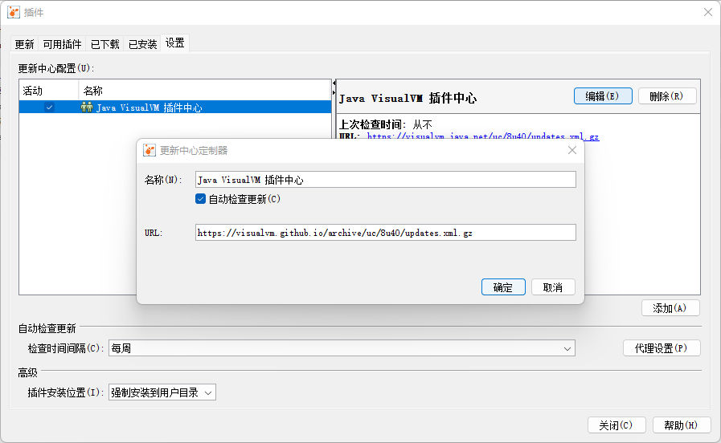

配置之后，点击【可用插件】面板，选择Visual GC 和 BTrace Workbench插件。

其他插件类似。

### 22.3.2 连接方式

​	启动VisualVM工具之后，它将自动搜索本机运行的JVM进程，同样不需要jps命令来查询指定。双击其中一个本地JVM进程即可开始监控，也可使用远程连接来连接远程服务器，如下图所示。

<div style="text-align:center;font-weight:bold;">VisualVM连接应用程序</div>

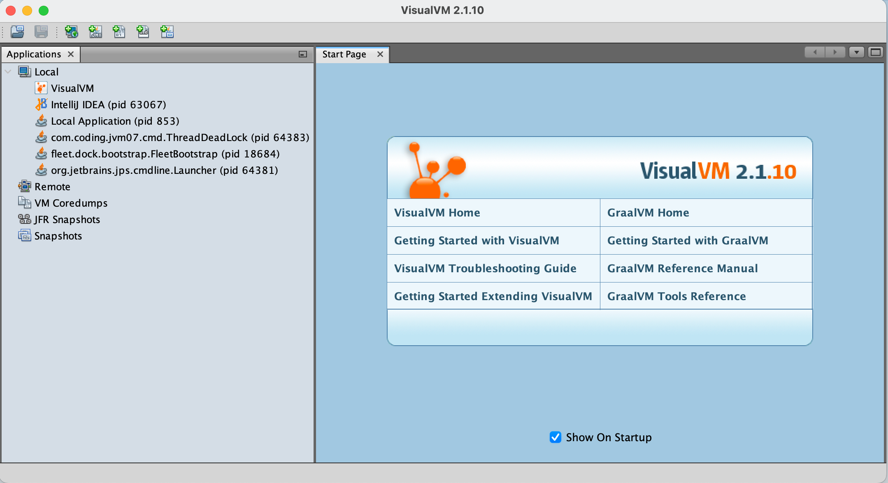

远程连接的时候需要注意以下事项。
(1)确定远程服务器的ip地址。
(2)添加JMX，通过JMX技术监控远端服务器具体是哪个Java进程。
(3)如果连接的服务器是Tomcat，需要修改bin/catalina.sh文件。
(4)在.../conf中添加jmxremote.access和jmxremote.password文件。
(5)如果服务部署在阿里云，需要将服务器地址改为公网ip地址并且设置阿里云安全策略和防火墙策略。
(6)启动tomcat，查看tomcat启动日志和端口监听。
(7)JMX中输入端口号、用户名、密码登录。

### 22.3.3 主要功能

​	下面介绍VisualVM的主要功能，包括使用VisualVM生成内存快照、查看JVM参数、系统属性、查看运行中的JVM进程、生成／读取线程快照和程序资源的实时监控等。

**1 使用VisualVM生成内存快照**

​	VisualVM生成内存快照的方式有两种，如下所示。

1、在“应用程序”窗口中右击应用程序节点，然后选择“堆Dump”，如下图所示。

<div style="text-align:center;font-weight:bold;">VisualVM生成堆快照方式1</div>

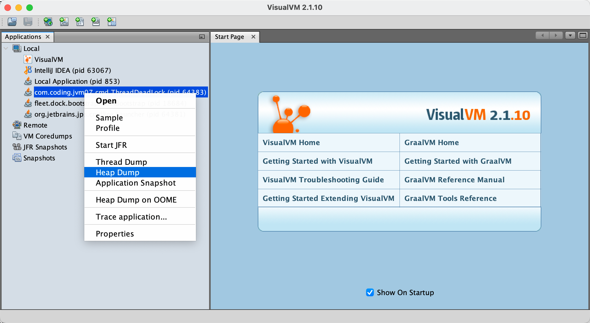

2、在“应用程序”窗口中双击应用程序节点以打开应用程序标签，然后在“监视”标签中单击“堆Dump”，如下图所示。

<div style="text-align:center;font-weight:bold;">VisualVM生成堆快照方式2</div>


​	VisualVM生成内存快照之后，选择内存快照文件，右击“另存为”按钮，即可保存内存快照到本地目录，如下图所示。

<div style="text-align:center;font-weight:bold;">VisualVM保存堆快照</div>

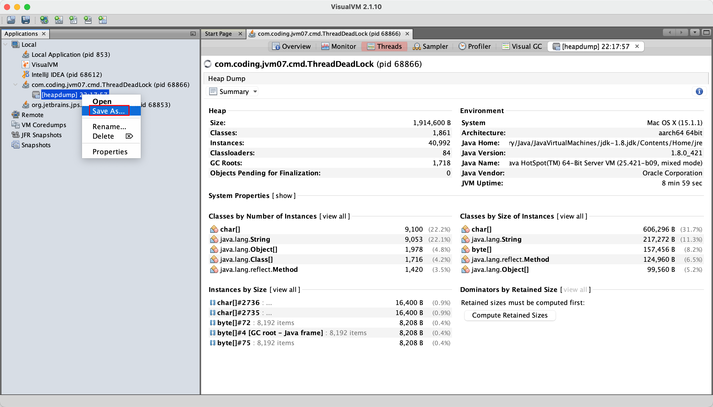

​	VisualVM中单击“文件”→“装入”，在文件类型一栏选择“堆”，选择要分析的dump文件即可打开堆文件，结果如下图所示。

​	单击“堆Dump”工具栏中的“类”，以查看活动类和对应实例的列表。双击某个类名打开“实例”视图以查看实例列表。从列表中选择某个实例查看对该实例的引用。

<div style="text-align:center;font-weight:bold;">VisualVM打开堆快照1</div>

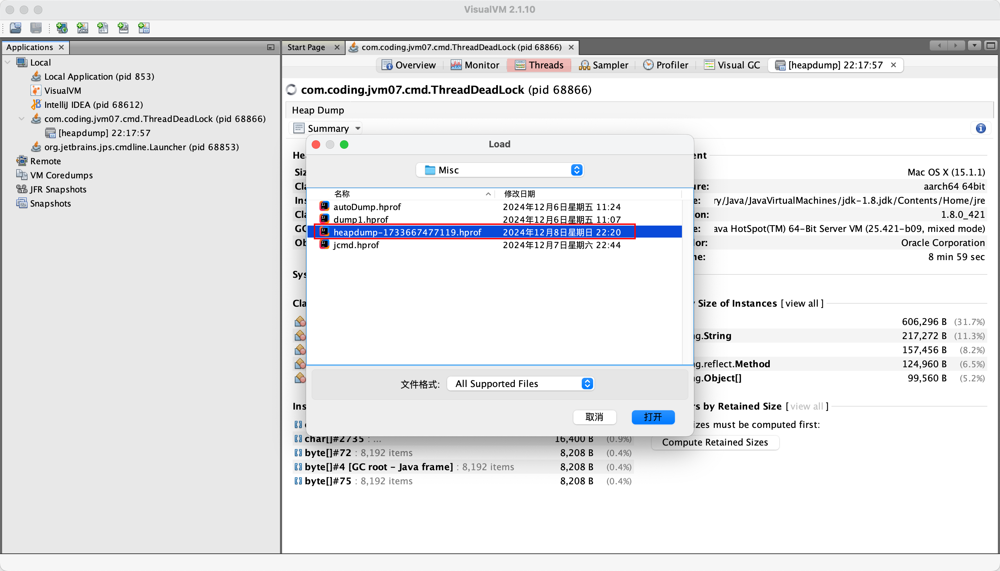

<div style="text-align:center;font-weight:bold;">VisualVM打开堆快照2</div>

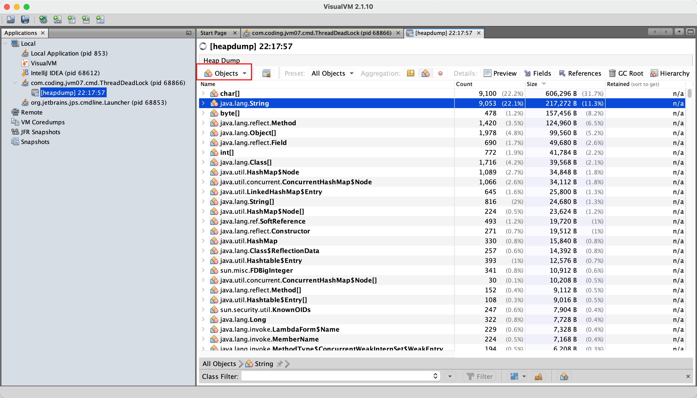

**2 查看JVM参数和系统属性**

​	使用jinfo可以查看的信息，在VisualVM中也可以查看。VisualVM查看JVM配置信息，直接在应用程序打开堆快照文件，在概述栏就可以看到JVM参数和系统属性，如下图所示。

<div style="text-align:center;font-weight:bold;">VisualVM查看JVM参数和系统属性</div>

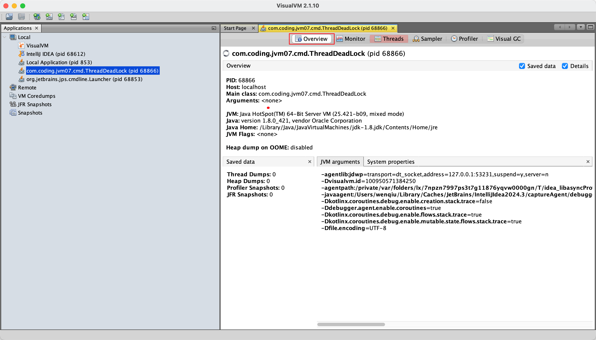

**3 查看运行中的JVM进程**

​	jps命令可以查看JVM进程信息，在VisualVM中也可以查看。VisualVM查看正在运行的JVM进程如下图所示。

<div style="text-align:center;font-weight:bold;">VisualVM查看JVM进程</div>

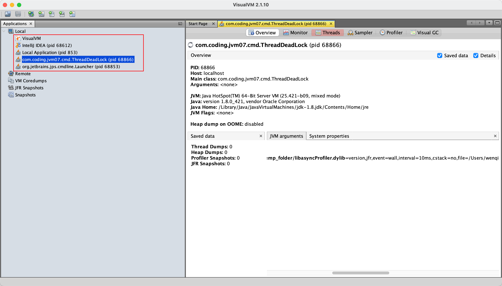

**4 查看线程快照**

​	jstack命令显示JVM当前时刻的线程快照，用来查找运行时死锁等问题的定位。VisualVM也可以生成JVM线程快照，生成线程快照的方式有两种。

1、在“应用程序”窗口中右击应用程序节点，然后选择“线程Dump”，如下图所示。

<div style="text-align:center;font-weight:bold;">VisualVM生成线程dump方式1</div>

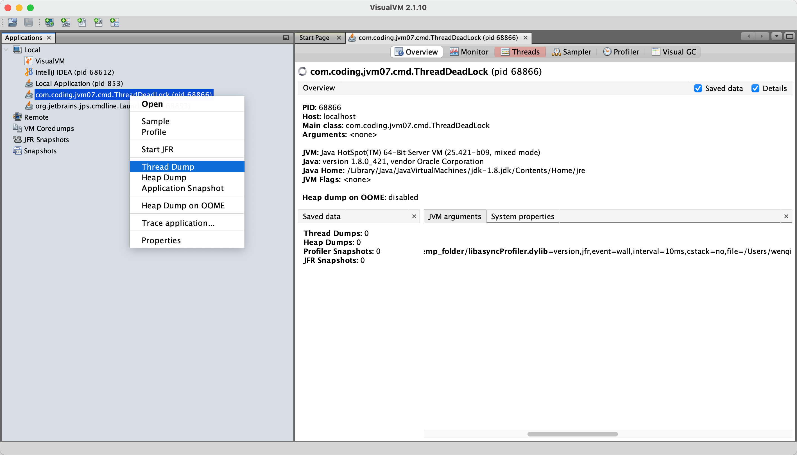

2、在“应用程序”窗口中双击应用程序节点以打开应用程序标签，然后在“线程”标签中单击“线程Dump”，如下图所示。

<div style="text-align:center;font-weight:bold;">VisualVM生成线程dump方式2</div>

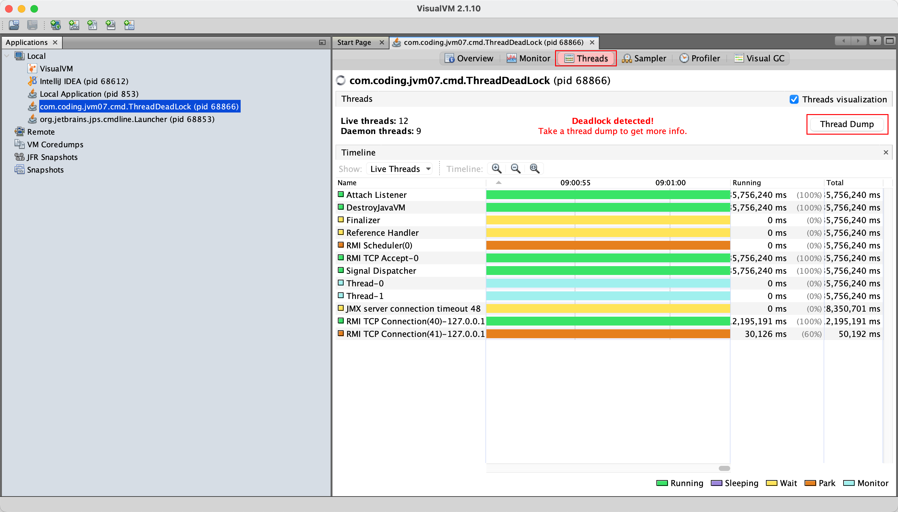

​	VisualVM在线程快照页面，也可以右击保存快照，如下图所示。

<div style="text-align:center;font-weight:bold;">VisualVM保存线程dump</div>

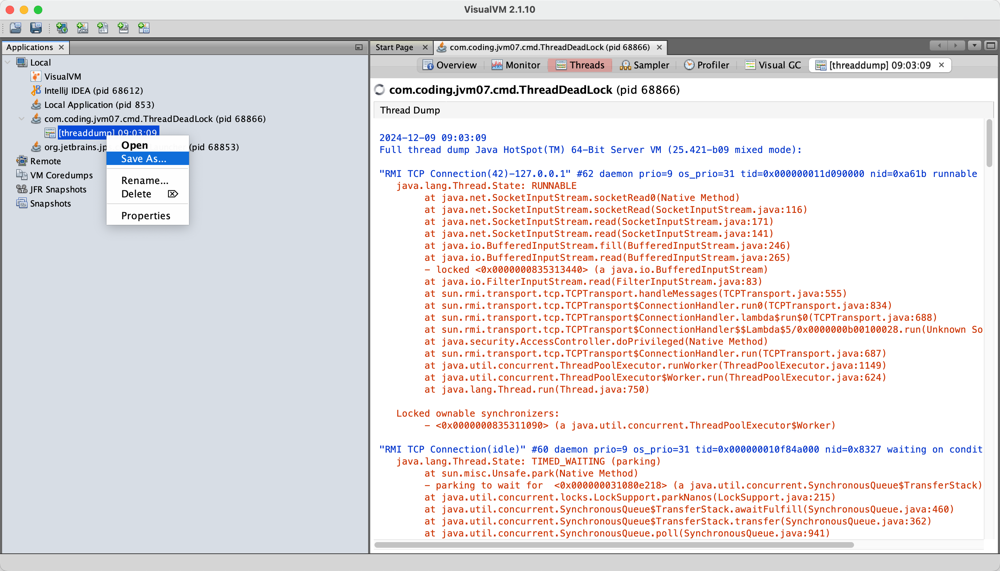

**5 使用VisualVM检测死锁**

​	依然使用代码<span style="color:blue;font-weight:bold;">案例2：死锁案例</span>，单击线程选项卡，如下图**VisualVM检测线程死锁**所示，可以看到提示信息“检测到死锁！”，单击右侧“线程Dump”按钮，即可看到死锁的明确信息，如下图**VisualVM线程dump**所示。

<div style="text-align:center;font-weight:bold;">VisualVM检测线程死锁</div>

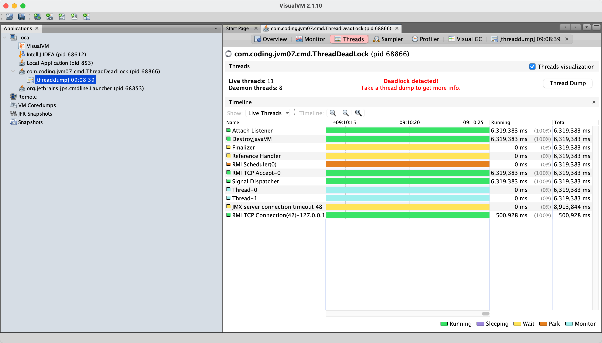

<div style="text-align:center;font-weight:bold;">VisualVM线程dump</div>

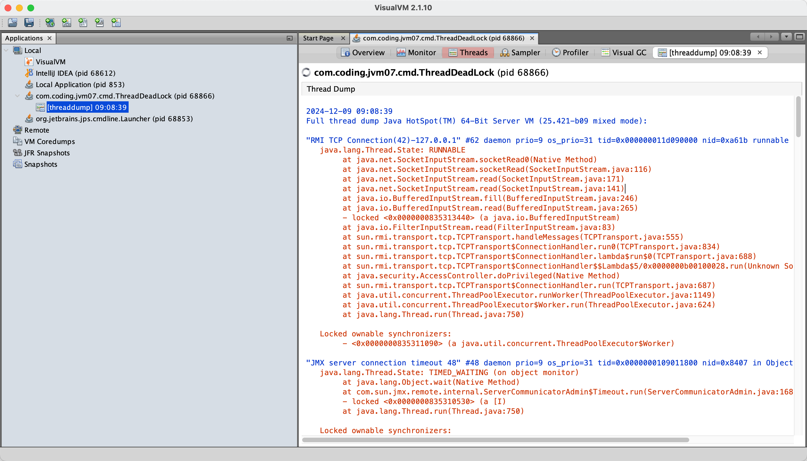

**6 程序资源的实时监控**

​	jstat命令收集HotSpot虚拟机各方面的运行数据，可以对Java应用程序的资源和性能进行实时监控，主要包括GC情况和Heap Size资源使用情况。VisualVM通过“监视”选项卡对程序资源的实时监控，如下图所示。

<div style="text-align:center;font-weight:bold;">VisualVM监视系统资源情况</div>

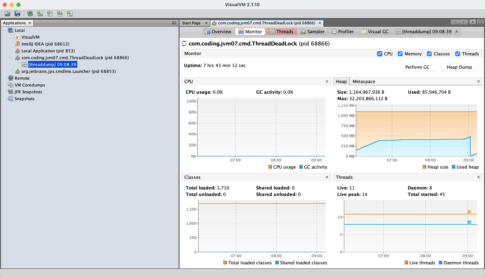

​	通过Visual GC插件查看堆内存使用情况，如下图所示。

<div style="text-align:center;font-weight:bold;">VisualVM监视系统堆内存使用情况</div>

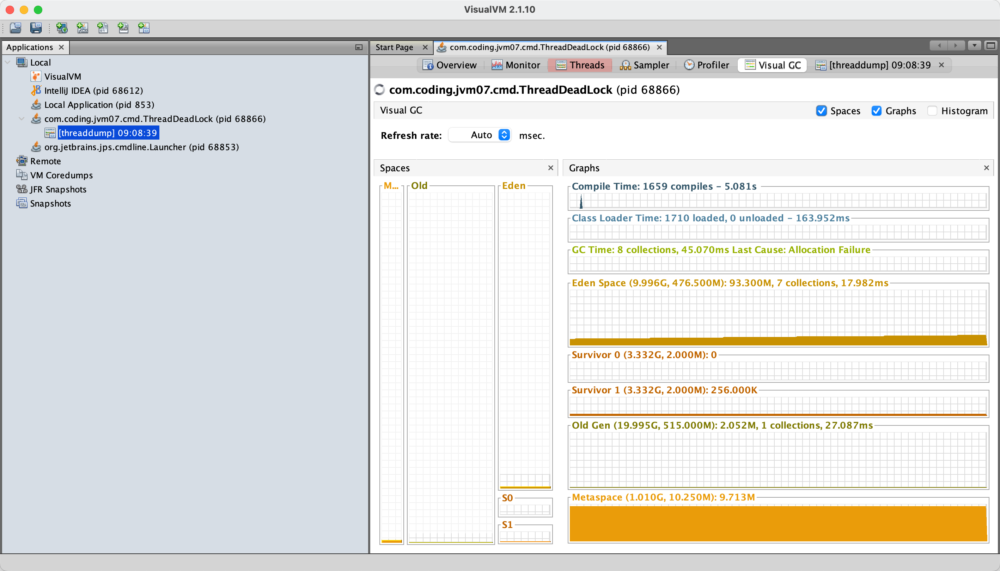

## 22.4 Eclipse MAT

​	MAT(Memory Analyzer Tool)工具是一款功能强大的Java堆内存分析器，用于查找内存泄漏以及查看内存消耗情况。在进行内存分析时，只要获得了反映当前设备内存映像的hprof文件，通过MAT打开就可以直观地看到当前的内存信息。

​	在工作中遇到内存溢出这种灾难性的问题，那么程序肯定存在问题，找出问题至关重要。上文讲过jmap命令的使用方法，但是用jmap导出的文件，如果不使用工具看不到里面的内容，这个时候就可以使用MAT了，MAT工具能够解析这类二进制快照。MAT是基于Eclipse开发的，不仅可以单独使用，还可以作为插件的形式嵌入在Eclipse中使用。MAT是一款免费的性能分析工具，使用起来非常方便。各位读者可以下载并使用MAT，官网下载页面如下图所示。

​	MAT官网地址：https://www.eclipse.org/mat/download

<div style="text-align:center;font-weight:bold;">MAT下载页面</div>

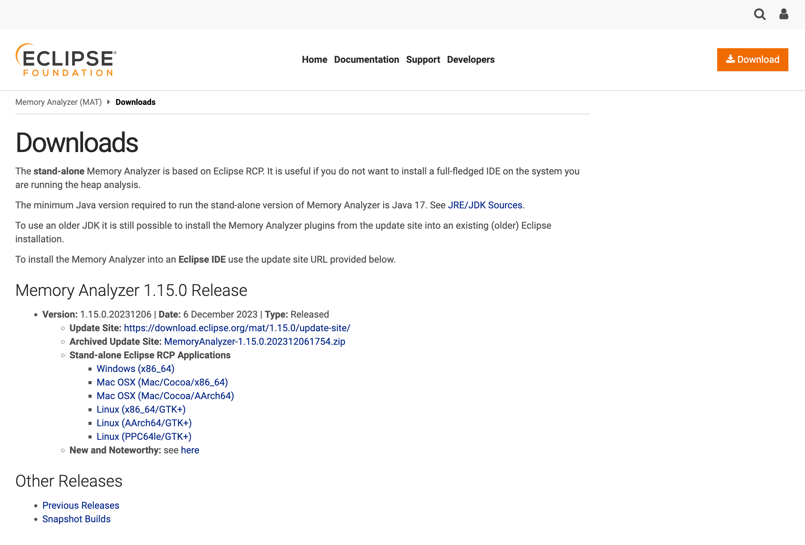

<div style="text-align:center;font-weight:bold;">MAT版本与JDK版本的关系</div>

| MAT版本                        | JDK版本 |
| ------------------------------ | ------- |
| MemoryAnalyzer-1.15.0.20231206 | 17+     |
| MemoryAnalyzer-1.14.0.20230315 | 17+     |
| MemoryAnalyzer-1.13.0.20220615 | 11+     |
| MemoryAnalyzer-1.12.0.20210602 | 11+     |
| MemoryAnalyzer-1.11.0.20201202 | 1.8+    |

​	只要确保机器上装有JDK并配置好相关的环境变量，MAT即可正常启动。也可以在Eclipse中以插件的方式安装。


​	若启动失败？

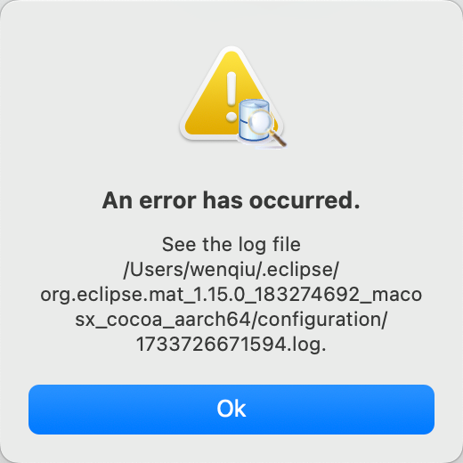

​	调整MAT的配置。

```bash
% vim /Applications/MemoryAnalyzer.app/Contents/Info.plist 
```

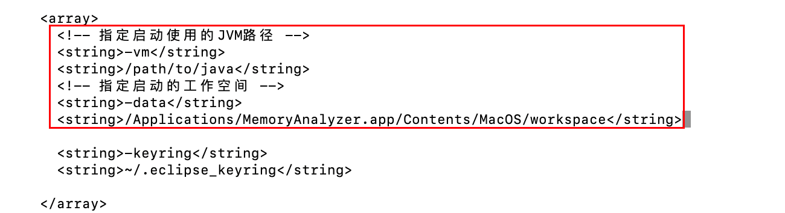

### 22.4.1 获取堆dump文件

​	MAT可以分析堆dump文件。在进行内存分析时，只要获得了反映当前设备内存映像的hprof文件，通过MAT打开就可以直观地看到当前的内存信息。一般来说，这些内存信息内容如下。

(1)所有的对象信息，包括对象实例、成员变量、存储于栈中的基本类型值和存储于堆中的其他对象的引用值。
(2)所有的类信息，包括classloader、类名称、父类、静态变量等。
(3)GCRoot到所有的这些对象的引用路径。
(4)线程信息，包括线程的调用栈及此线程的线程局部变量(TLS)。
	但是MAT不是一个万能工具，它并不能处理所有类型的堆存储文件。但是比较主流的厂家和格式，例如Sun、HP、SAP所采用的HPROF二进制堆存储文件，以及IBM的PHD堆存储文件等都能被很好地解析。
	MAT最吸引人的还是能够快速为开发人员生成内存泄漏报表，方便定位问题和分析问题。虽然MAT有如此强大的功能，但是内存分析也没有简单到一键完成的程度，很多内存问题还是需要我们从MAT展现给我们的信息当中通过经验来判断才能发现，使用MAT打开dump文件时，会弹出向导窗口，保持默认选项，单击“Finish”，就会导向内存泄漏报告(Leak Suspects)页面，如下图所示。

<div style="text-align:center;font-weight:bold;">MAT打开Dump时的界面</div>


​	分析堆内存信息，首先要获取堆dump文件，获取方式有以下几种。

(1)通过第21章介绍的jmap工具生成，可以生成任意一个Java进程的dump文件。
(2)通过配置JVM参数生成，配置参数选项“-XX:+HeapDumpOnOutOfMemoryError -XX:HeapDumpPath”或“-XX:+HeapDumpBeforeFullGC”。选项“-XX:HeapDumpPath”所代表的含义就是当程序出现OutofMemory时，将会在相应的目录下生成一份dump文件。如果不指定选项“-XX:HeapDumpPath”则在当前目录下生成dump文件。考虑到生产环境中几乎不可能在线对系统分析，大都是采用离线分析，因此使用“jmap+MAT工具+配置JVM参数”是最常见的一套组合拳。

(3)使用VisualVM可以导出堆dump文件。

4)使用MAT既可以打开一个已有的堆快照，也可以通过MAT直接从活动Java程序中导出堆快照。该功能将借助jps列出当前正在运行的Java进程，以供选择并获取快照，如下图和所示。

<div style="text-align:center;font-weight:bold;">MAT获取堆dump文件</div>

<div style="dispaly:flex">
  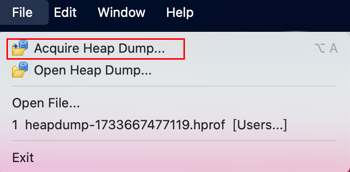
  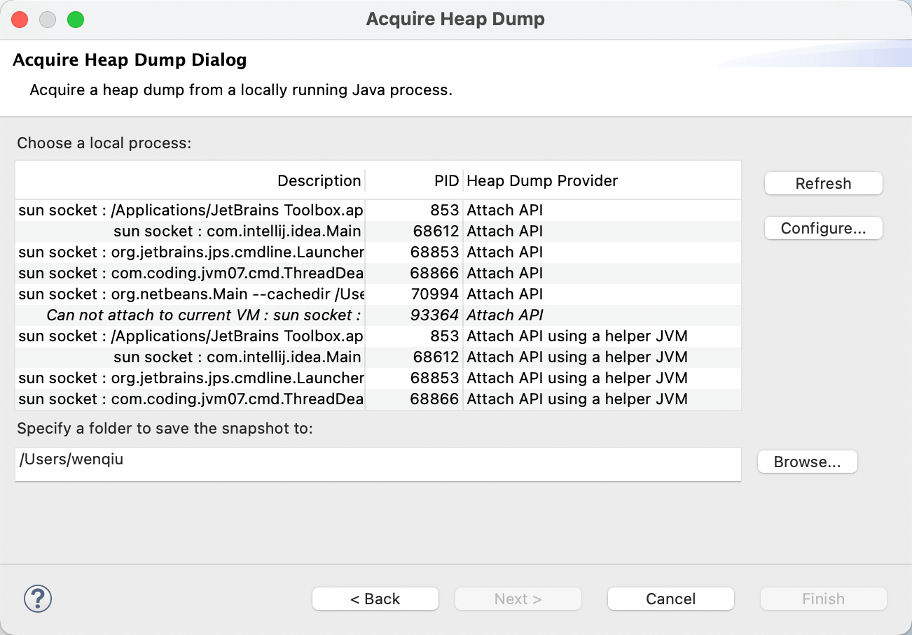
</div>

### 22.4.2 分析堆dump文件

#### Overriew-概述

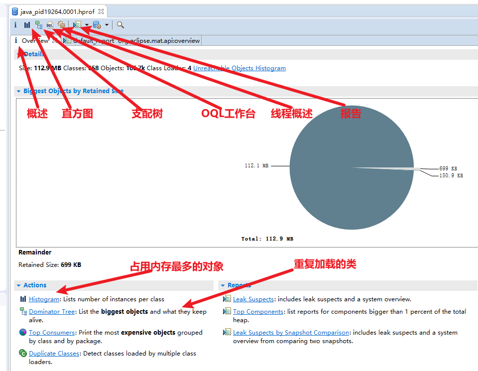

​	下面我们分别看一下MAT展示的各个标签页的含义。

#### Leak Suspects-内存泄露报告

​	打开堆dump文件，进入内存泄漏报告界面，“Leak Suspects”是MAT分析的可能有内存泄漏嫌疑的地方，可以体现出哪些对象被保存在内存中，以及为什么它们没有被垃圾回收器回收，如下图所示。

<div style="text-align:center;font-weight:bold;">内存泄漏报告界面</div>

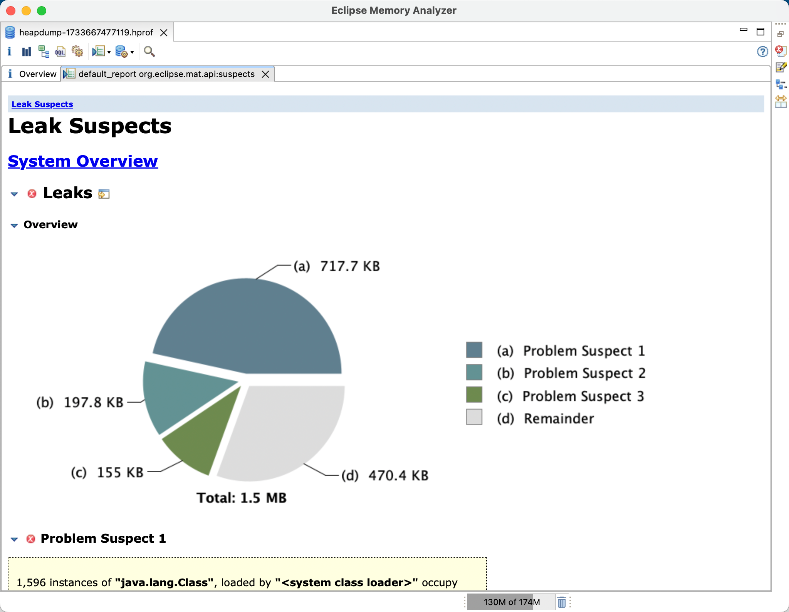

​	如果打开dump时跳过了的话，也可以从其他入口进入。

​	可以在工具栏上单击“Run Expect System Test”→“Leak Suspects”选项，如下图所示。

<div style="text-align:center;font-weight:bold;">内存泄漏报告界面入口(1)</div>

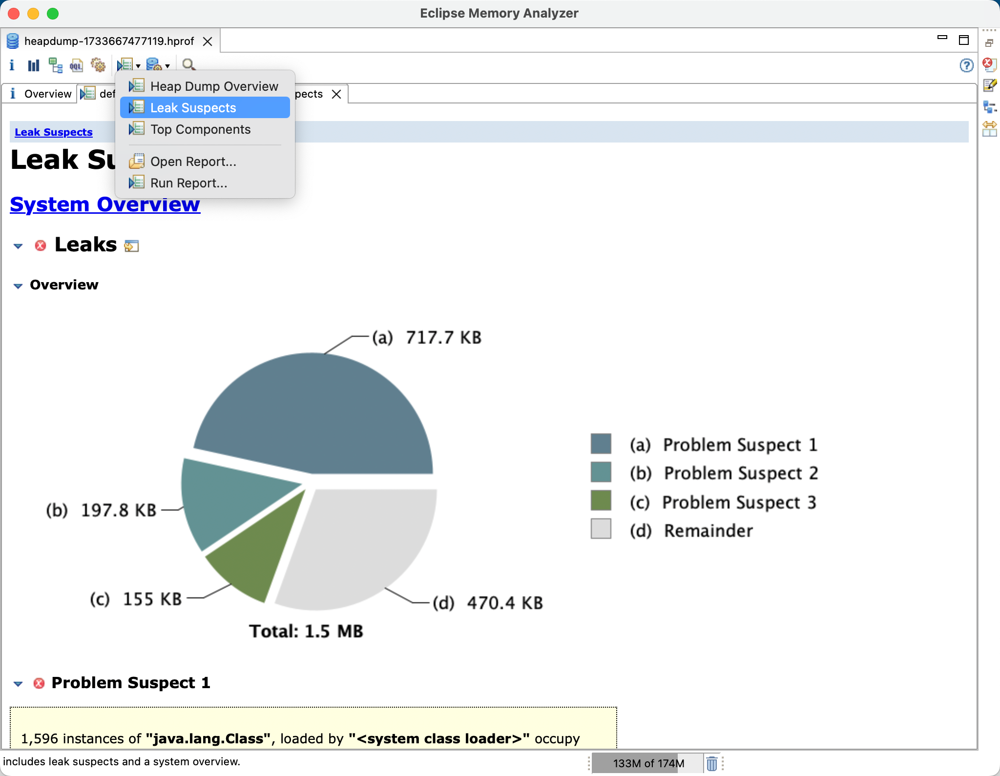

​	也可以从Overview页面的“Reports”选项中的“Leak Suspects”部分进入，如下图所示。

<div style="text-align:center;font-weight:bold;">内存泄漏报告界面入口(2)</div>


#### Histogram-直方图

​	MAT的histogram（直方图）和jmap的-histo子命令一样，都能够展示各个类的实例数目以及这些实例的浅堆(Shallow Heap)或者深堆(Retained Heap)总和。除此之外，MAT的直方图还可以将直方图中的类按照超类、类加载器或者包名分组。

​	单击Overview页面Actions区域内的“Histogram”视图，如下图所示。

<div style="text-align:center;font-weight:bold;">histogram报告界面入口</div>

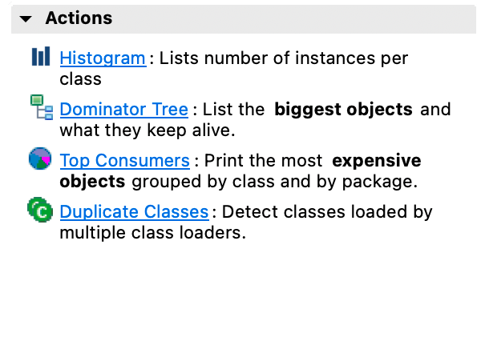

​	histogram视图如下图所示。

<div style="text-align:center;font-weight:bold;">histogram报告界面</div>

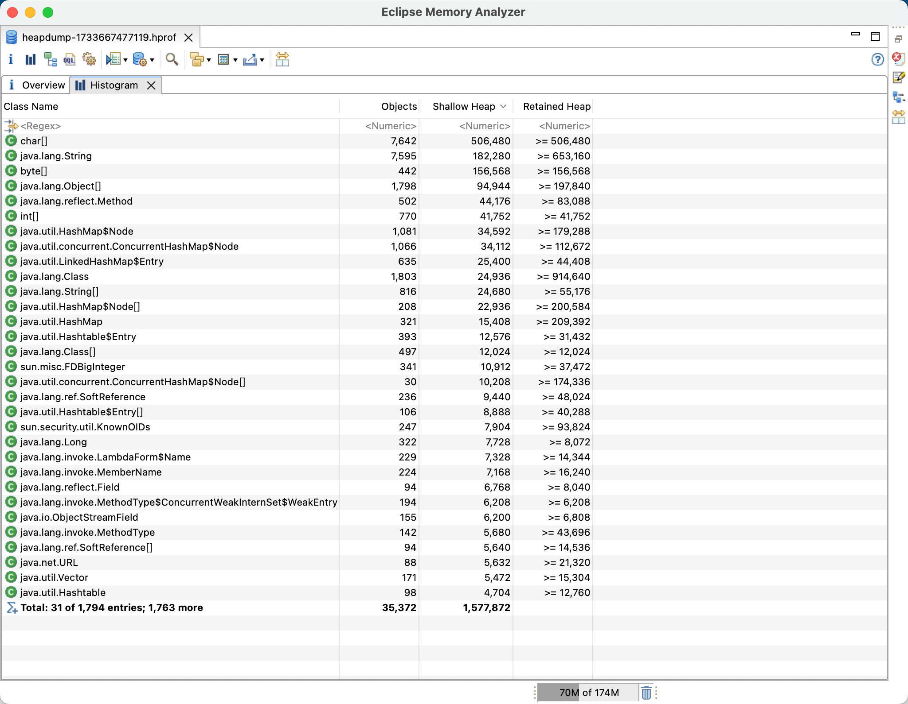

​	视图以类的维度展示每个类的实例存在的个数、占用的浅堆和深堆（见下文）大小，分别排序显示。从histogram视图可以看出，哪个类的对象实例数量比较多，以及占用的内存比较大，浅堆与深堆的区别会在下文说明。不过，多数情况下，在histogram视图看到实例对象数量比较多的类都是一些基础类型，如char[]、String、byte[]，所以仅这些是无法判断出具体导致内存泄漏的类或者方法的，可以使用“List objects”或“Merge Shortest Paths to GC roots”等功能继续分析数据。如果histogram视图展示的数量多的实例对象不是基础类型，是有嫌疑的某个类，如项目代码中自定义对象类型，那么就要重点关注了。

#### 浅堆与深堆

- Shallow Heap ： 浅堆

  <span style="color:red;font-weight:bold;">浅堆指一个对象所消耗的内存。</span>在32位系统中，一个对象引用会占4字节，一个int类型会占4字节，long型变量会占8字节，每个对象头需要占8字节。根据堆快照格式不同，对象的大小可能会向8字节进行对齐。

  以JDK7中的String为例，String类中有2个int类型属性，分别是hash32、hash,2个int值共占8字节，此外String类型的对象引用ref占用4字节，对象头8字节，合计20字节，向8字节对齐，故占24字节，如下表所示。

  | 变量类型 | 变量名 | 变量值                    |
  | -------- | ------ | ------------------------- |
  | int      | hash32 | 0                         |
  | int      | hash   | 0                         |
  | ref      | value  | C:\Users\Administrator... |

  这24字节为String对象的浅堆大小。它与String的value实际取值无关，无论字符串长度如何，浅堆大小始终是24字节。

- Retained Heap ： 深堆

  <span style="background-color:#ffe400;font-weight:bold;">保留集（Retained Set）：</span>

  在理解深堆之前，需要先了解保留集(Retained Set)的概念，<span style="color:#FF00FF;font-weight:bold;">对象A的保留集指当对象A被垃圾回收后，可以被释放的所有的对象集合（包括对象A本身），即对象A的保留集可以被认为是只能通过对象A被直接或间接访问到的所有对象的集合。通俗地说，就是指仅被对象A所持有的对象的集合</span>。

  <span style="background-color:#ffe400;font-weight:bold;">深堆（Retained Heap）：</span>

  <span style="color:red;font-weight:bold;">深堆是指对象的保留集中所有的对象的浅堆大小之和。</span>深堆和浅堆的区别是浅堆指对象本身占用的内存，不包括其内部引用对象的大小。一个对象的深堆指只能通过该对象访问到的（直接或间接）所有对象的浅堆之和，即对象被回收后，可以释放的真实空间。

  注意：浅堆指对象本身占用的内存，不包括其内部引用对象的大小。一个对象的深堆指只能通过该对象访问到的（直接或间接）所有对象的浅堆之和，即对象被回收后，可以释放的真实空间。

- 对象实际大小

  另外一个常用的概念是对象的实际大小。这里，对象的实际大小定义为一个对象所能触及的所有对象的浅堆大小之和，也就是通常意义上我们说的对象大小。与深堆相比，似乎这个在日常开发中更为直观和被人接受，<span style="color:red;font-weight:bold;">但实际上，这个概念和垃圾收集无关</span>

  下图显示了一个简单的对象引用关系图，对象A引用了C和D，对象B引用了C和E。那么对象A的浅堆大小只是A本身，不含C和D，而A的实际大小为A、C、D三者之和。而A的深堆大小为A与D之和，由于对象C还可以通过对象B访问到，因此不在对象A的深堆范围内。


<div style="text-align:center;font-weight:bold;">对象引用关系图</div>

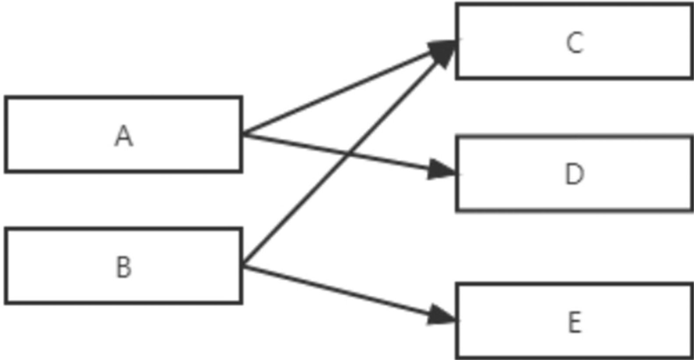

​	通过如下代码，详细了解MAT中深堆大小的计算方式，配置JVM参数，生成nurse.hprof堆文件。

<span style="color:#40E0D0;">案例1：理解深堆大小计算方式</span>

- 代码：NurseTrace类

```java
package com.coding.jvm07.gui.nurse;

import java.util.ArrayList;
import java.util.List;

/**
 * 护士给园区的工作人员注射疫苗
 * <p>
 * VM options：-XX:+HeapDumpBeforeFullGC -XX:HeapDumpPath=/Users/wenqiu/Misc/nurse.hprof
 */
public class NurseTrace {
    static List<People> peopleList = new ArrayList<>();

    /**
     * 创建100个需要打疫苗的人员
     */
    static Integer peopleNum = 100;

    public static void createInjectPeople() {
        for (int i = 0; i < peopleNum; i++) {
            People people = new People();
            people.setAddress("beijingshi" + Integer.toString(i) + "号");
            people.setNum(Integer.toString(i));
            peopleList.add(people);
        }
    }

    public static void main(String[] args) {
        // 创建了100个需要打疫苗的人员
        createInjectPeople();
        // 创建3个护士
        Nurse nurse3 = new Nurse(3, "ZhangSan");
        Nurse nurse5 = new Nurse(5, "LiSi");
        Nurse nurse7 = new Nurse(7, "WangWu");
        for (int i = 0; i < peopleList.size(); i++) {
            if (i % nurse3.getId() == 0) {
                nurse3.inject(peopleList.get(i));
            }
            if (i % nurse5.getId() == 0) {
                nurse5.inject(peopleList.get(i));
            }
            if (i % nurse7.getId() == 0) {
                nurse7.inject(peopleList.get(i));
            }
        }
        peopleList.clear();
        System.gc();
    }
}

```

- 代码：People类

```java
package com.coding.jvm07.gui.nurse;

/**
 * 需要打疫苗的人员
 */
public class People {
    /**
     * 人员信息
     */
    private String address;

    /**
     * 人员年龄
     */
    private String num;

    public String getAddress() {
        return address;
    }

    public void setAddress(String address) {
        this.address = address;
    }

    public String getNum() {
        return num;
    }

    public void setNum(String num) {
        this.num = num;
    }
}

```

- 代码：Nurse类

```java
package com.coding.jvm07.gui.nurse;

import java.util.ArrayList;
import java.util.List;

/**
 * 护士人员
 */
public class Nurse {
    private int id;
    private String name;
    private List<People> history = new ArrayList<>();

    public Nurse(int id, String name) {
        super();
        this.id = id;
        this.name = name;
    }

    public int getId() {
        return id;
    }

    public void setId(int id) {
        this.id = id;
    }

    public String getName() {
        return name;
    }

    public void setName(String name) {
        this.name = name;
    }

    public List<People> getHistory() {
        return history;
    }

    public void setHistory(List<People> history) {
        this.history = history;
    }

    public void inject(People wp) {
        if (wp != null) {
            history.add(wp);
        }
    }
}

```

​	执行后可得到hprof文件，打开堆文件，进入thread_overview页面，如下图所示。

<div style="text-align:center;font-weight:bold;">thread_overview页面</div>

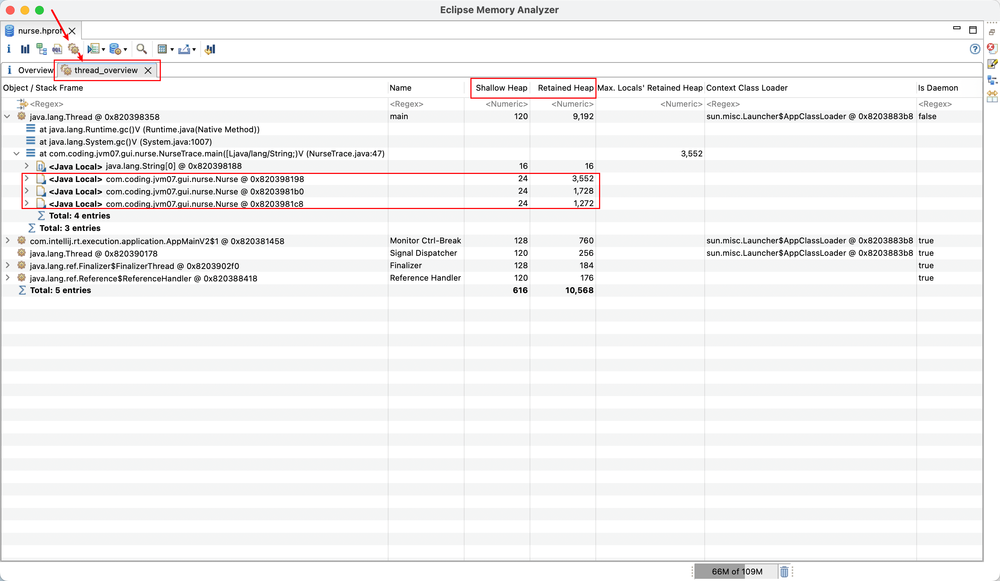

​	找到3名护士的引用，如下图所示，为读者阅读方便，这里已经标出了每个实例的护士名。除了对象名称外，MAT还给出了浅堆大小和深堆大小。可以看到，所有Nurse类的浅堆统一为24字节，和它们持有的内容无关，而深堆大小各不相同，这和每名护士注射的人员多少有关。为了获得WangWu护士注射过的人员，可以在WangWu的记录中通过“外部引用(Outgoing References)”查找，就可以找到由WangWu可以触及的对象，也就是他负责注射过疫苗的人员。

<div style="text-align:center;font-weight:bold;">如何打开WangWu对象的外部引用</div>

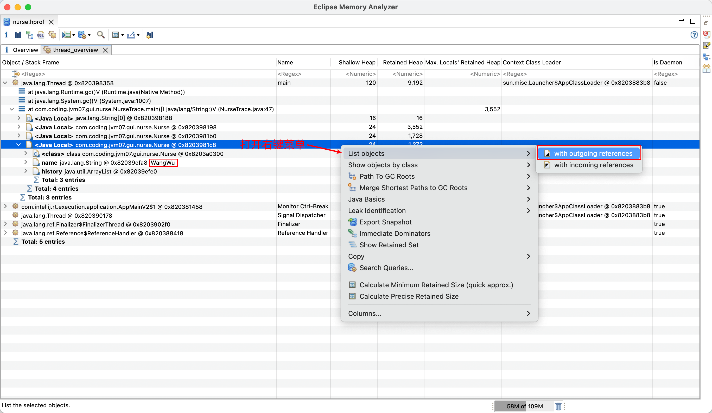

<div style="text-align:center;font-weight:bold;">WangWu对象的外部引用</div>

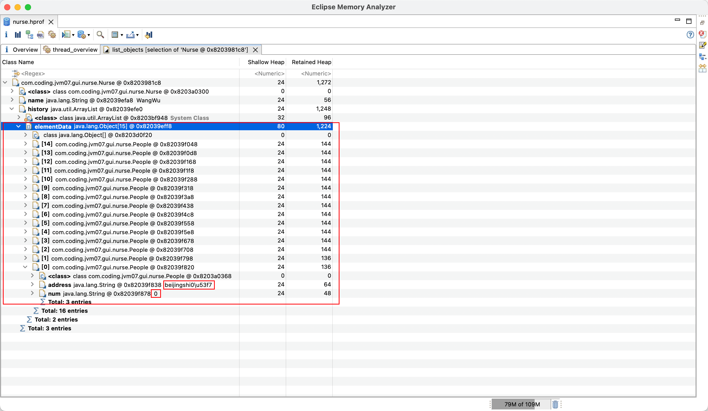

​	可以看到，堆中完整显示了所有WangWu护士的history中的人员（都是编号可以被7整除的人员）。如果现在希望查看哪些护士给“beijingshi0号”的人员注射过疫苗，则可以在对应的人员对象中通过“Incoming References”查找。如下图所示，显然该人员被3名护士都注射过疫苗，这里假如疫苗可以被注射3次。

<div style="text-align:center;font-weight:bold;">如何打开”beijingshi0号“人员的内部引用</div>

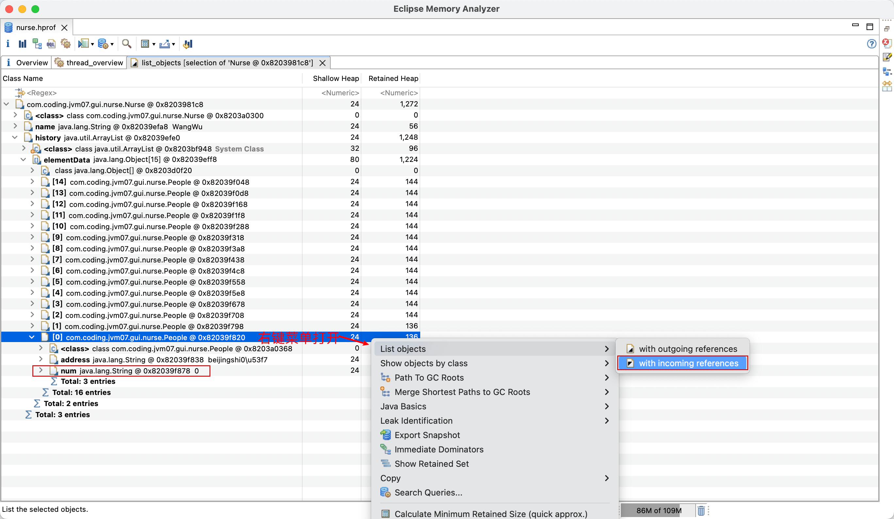

<div style="text-align:center;font-weight:bold;">”beijingshi0号“人员的内部引用</div>

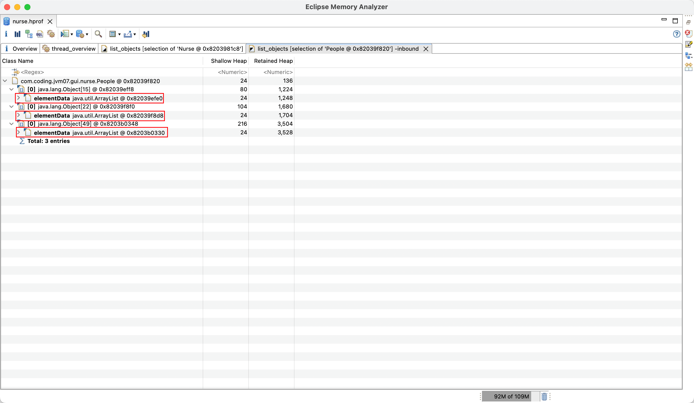

​	在这个实例中，我们再来理解一下深堆的概念，如图<span style="color:blue;font-weight:bold;">WangWu对象的外部引用</span>所示，在护士WangWu注射疫苗的人群中，一共有15条数据，其中13条People占144字节的空间（深堆），2条People占136字节的空间（深堆），之所以会产生不同的字节数，是因为地址长度不一样造成的。而15条数据合计共占13×144+2×136 = 2144字节。而history中的elementData数组实际深堆大小为1224字节。这是因为部分人员People既被WangWu注射疫苗，又被其他护士注射疫苗，因此WangWu并不是唯一可以引用到它们的对象，对于这些对象的大小，自然不应该算在护士WangWu的深堆中。根据程序的规律，只要人员编号(num)被3或者5整除，都不应该计算在内，满足条件的人员编号（能被3和7整除，或者能被5和7整除）有0、21、35、42、63、70、84。它们合计大小为1×136+6×144=1000字节，故WangWu的history对象中的elementData数组的深堆大小为2144-1000+80=1224字节。这里的80字节表示elementData数组的浅堆大小，由于elementData数组长度为15，每个引用占4字节，合计4×15=60字节，数组对象头大小为12字节（Object[] elementData，对象头8字节+引用4字），数组长度占4字节，合计60 + 8 + 4 = 76字节，须向后看齐8字节，对齐填充后最终为80字节。

#### Dominator Tree-支配树

​	支配树(Dominator Tree)的概念源自图论。MAT提供了一个称为支配树的对象图。支配树体现了对象实例间的支配关系。在对象引用图中，所有指向对象B的路径都经过对象A，则认为对象A支配对象B。如果对象A是离对象B最近的一个支配对象，则认为对象A为对象B的直接支配者。支配树是基于对象间的引用图所建立的，它有以下基本性质。

​	对象A的子树（所有被对象A支配的对象集合）表示对象A的保留集(Retained Set)，即深堆。如果对象A支配对象B，那么对象A的直接支配者也支配对象B。支配树的边与对象引用图的边不直接对应。如下图所示，左图表示对象引用图，右图表示左图所对应的支配树。对象A和对象B由根对象直接支配，由于在到对象C的路径中，可以经过对象A，也可以经过对象B，因此对象C的直接支配者也是根对象。对象F与对象D相互引用，因为到对象F的所有路径必然经过对象D，因此，对象D是对象F的直接支配者。而到对象D的所有路径中，必然经过对象C，即使是从对象F到对象D的引用，从根节点出发，也是经过对象C的，所以，对象D的直接支配者为对象C。

<div style="text-align:center;font-weight:bold;">支配树例图</div>

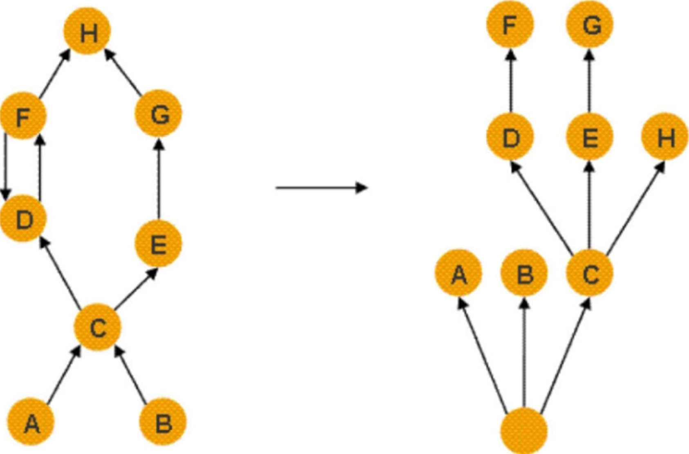

​	同理，对象E支配对象G。到达对象H的可以通过对象D，也可以通过对象E，因此对象D和对象E都不能支配对象H，而经过对象C既可以到达对象D也可以到达对象E，因此对象C为对象H的直接支配者。在MAT中，单击工具栏上的对象支配树按钮，可以打开对象支配树视图，如下图所示。

<div style="text-align:center;font-weight:bold;">MAT支配树</div>


​	下图显示了对象支配树视图的一部分。该截图显示部分WangWu护士的history队列的直接支配对象。即当WangWu对象被回收，也会一并回收的所有对象。显然能被3或者5整除的人员不会出现在该列表中，因为它们同时被另外两名护士对象引用。

<div style="text-align:center;font-weight:bold;">MAT支配树界面</div>

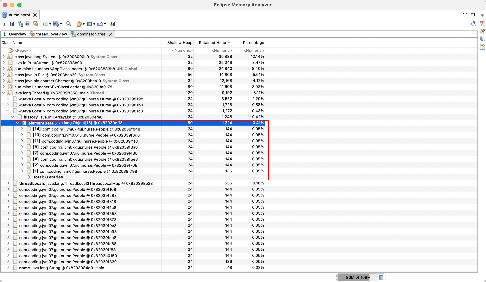

#### Thread Overview-线程概述

​	Thread Overview界面的入口在工具栏上，如下图所示。

<div style="text-align:center;font-weight:bold;">MAT Thread Overview界面入口</div>


​	Thread Overview界面如下图所示。

<div style="text-align:center;font-weight:bold;">MAT Thread Overview界面</div>

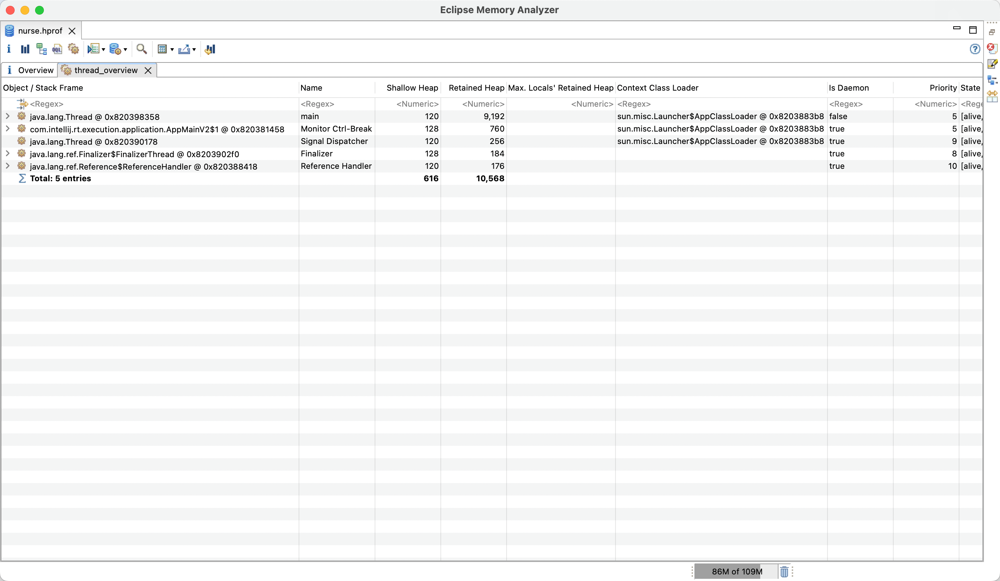

​	在Thread Overview视图可以看到线程对象／线程栈信息、线程名、Shallow Heap、Retained Heap、类加载器、是否Daemon线程等信息。

​	在分析内存Dump的MAT中还可以看到线程栈信息，这本身就是一个强大的功能，类似于jstack命令的效果。而且还能结合内存Dump分析，看到线程栈帧中的本地变量，在左下方的对象属性区域还能看到本地变量的属性。

#### 获得对象相互引用的关系

​	在Histogram或Dominator Tree视图中，想要看某个条目（对象／类）的引用关系图，可以使用“List objects”功能。在某个条目上右击，选择“List object”，如下图所示。

<div style="text-align:center;font-weight:bold;">查看对象引用关系</div>

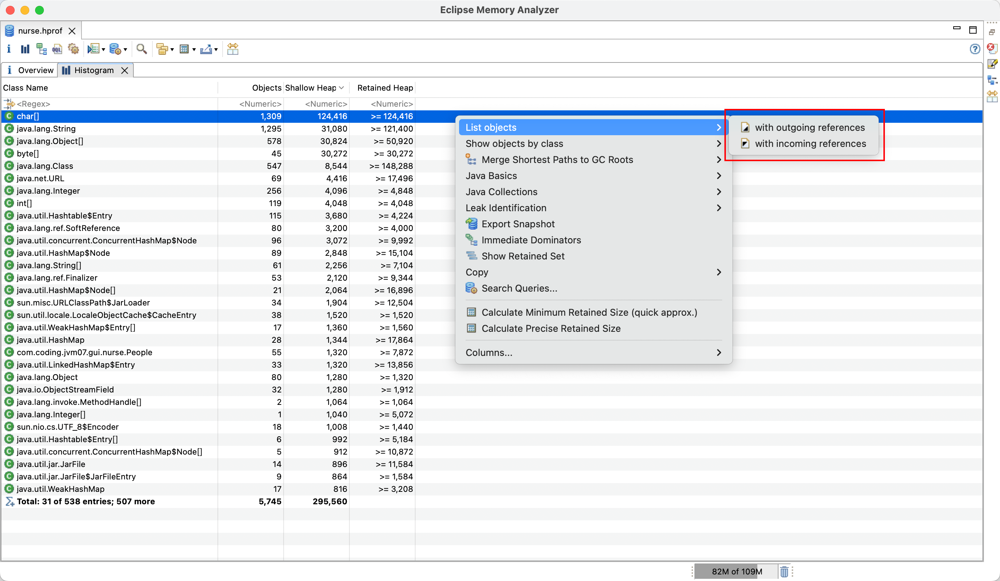

​	“with outgoing references”表示查看当前对象持有的外部对象引用，“with incoming references”表示查看当前对象被哪些外部对象引用。

假设对象A和对象B持有对象C的引用；对象C持有对象D和对象E的引用。

- List Objects
  - with outgoing references ： 对象C引用的所有对象都称为 outgoing references。比如：D和E对象。表示，查看C引用了那些对象。
    - C=>D
    - C=>E
  - with incoming references ： 拥有对象C的引用的所有对象都称为对象C的 incoming references。比如：A和B。表示，查看谁引用了C对象。
    - A=>C
    - B=>C
- Merge Shortest Paths to GC Roots ： 查看对象到GC Roots的最短路径
  - 右键选择 exclude all phantom/wek/soft etc. references 选项

### 22.4.3 支持使用OQL语言查询对象信息

​	MAT支持一种类似于SQL的查询语言OQL(Object Query Language)。OQL使用类SQL语法，可以在堆中进行对象的查找和筛选。

​	Object Query Language界面的入口在工具栏上，如下图所示。


​	Object Query Language界面如下图所示。

<div style="text-align:center;font-weight:bold;">Object Query Language界面</div>

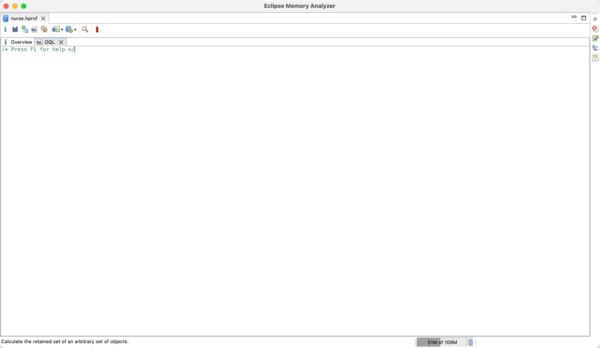

​	录入OQL语句后，点击红色感叹号<span style="color:red;font-weight:bold;font-size:20px;">！</span>或者F5即可执行查询。

#### Select子句

​	在MAT中，Select子句的格式与SQL基本一致，用于指定要显示的列。Select子句中可以使用“*”，查看结果对象的引用实例（相当于outgoing references）。

```sql
select * from java.util.Vector v
```

​	以上查询的输出结果如下图所示，在输出结果中，结果集中的每条记录都可以展开，查看各自的引用对象。

<div style="text-align:center;font-weight:bold;">Select查询结果</div>

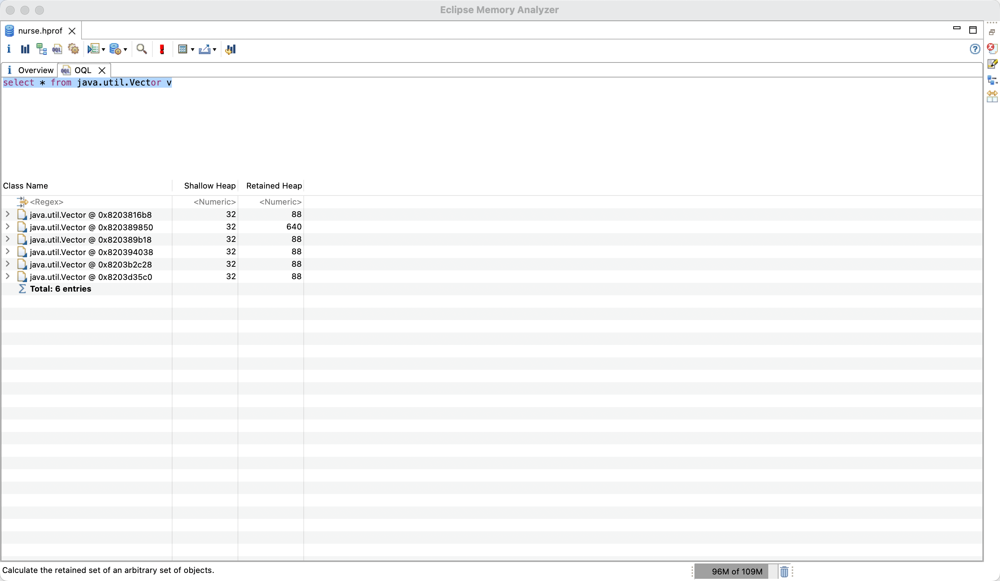

​	使用“OBJECTS”关键字，可以将返回结果集中的项以对象的形式显示，如下所示。

```sql
select objects v.elementData from java.util.Vector v
select objects s.value from java.lang.String s
```

​	结果如下图所示。

<div style="text-align:center;font-weight:bold;">OBJECTS查询结果</div>

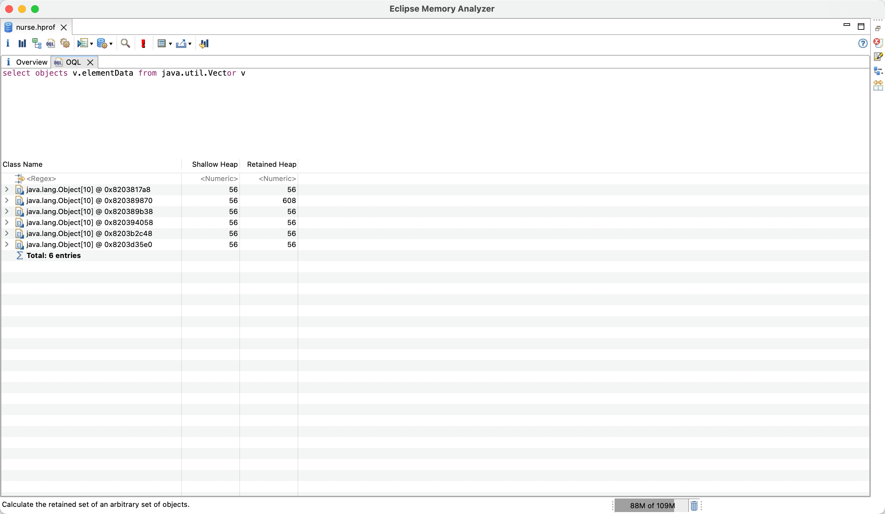

​	Select子句中，使用“AS RETAINED SET”关键字可以得到所得对象的保留集。

```sql
select as retained set * from com.coding.jvm07.gui.nurse.Nurse
```

​	结果如下图所示。

<div style="text-align:center;font-weight:bold;">AS RETAINED SET查询结果</div>


​	“DISTINCT”关键字用于在结果集中去除重复对象。

```sql
select distinct objects classof(s) from java.lang.String s
```

​	结果如下图所示。

<div style="text-align:center;font-weight:bold;">DISTINCT查询结果</div>


#### From子句

​	From子句用于指定查询范围，它可以指定类名、正则表达式或者对象地址。

```sql
select * from java.lang.String s
```

​	结果如下图所示。

<div style="text-align:center;font-weight:bold;">From查询结果</div>

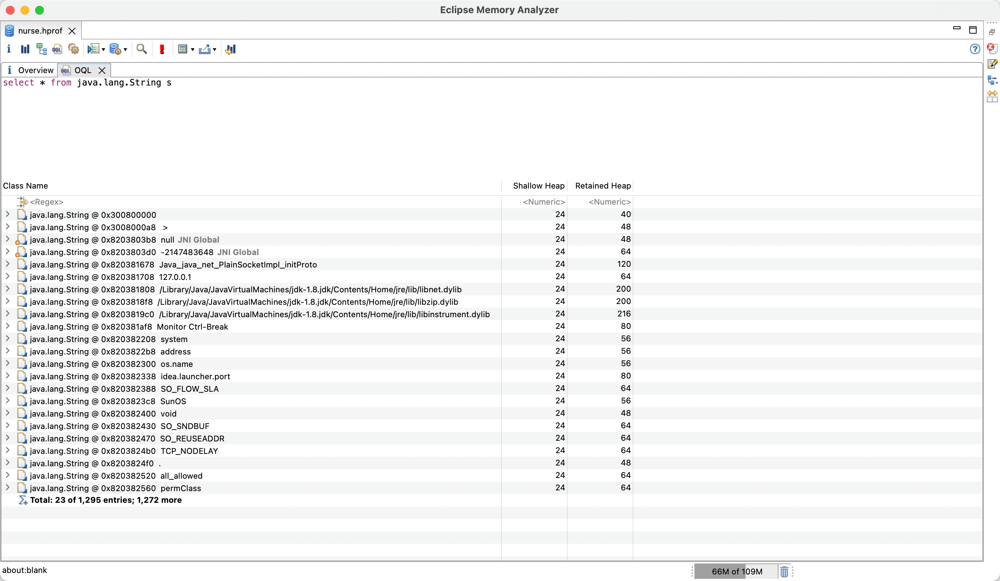

​	下面使用正则表达式限定搜索范围，输出com.coding包下所有类的实例。

```sql
select * from "com.coding..*"
```

<div style="text-align:center;font-weight:bold;">范围查询结果</div>

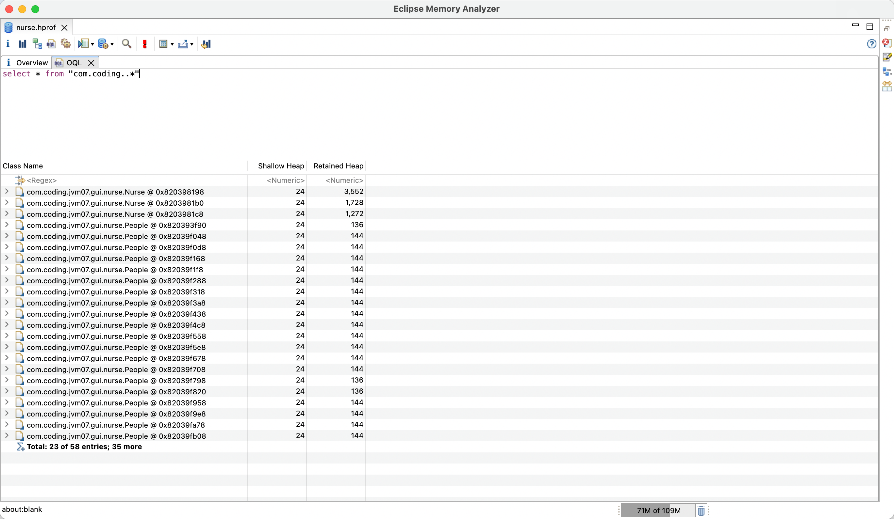

​	也可以直接使用类的地址进行搜索。使用类的地址的好处是可以区分被不同ClassLoader加载的同一种类型。

```sql
select * from 0x8203a0300
```

​	注意：0x8203a0300必须是一个<class>，

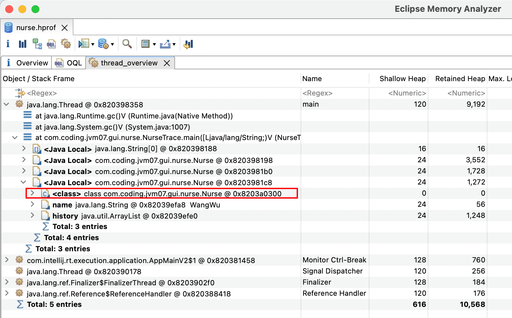

​	否则会提示：

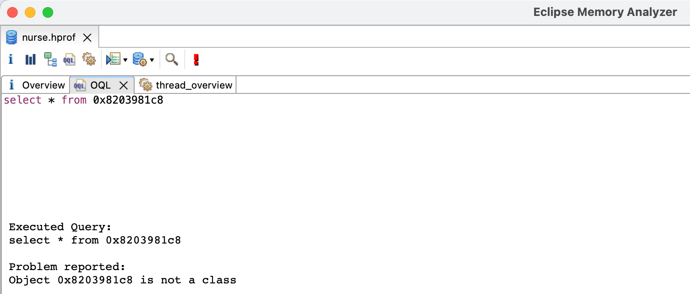

​	结果如下图所示。

<div style="text-align:center;font-weight:bold;">对象地址查询结果</div>

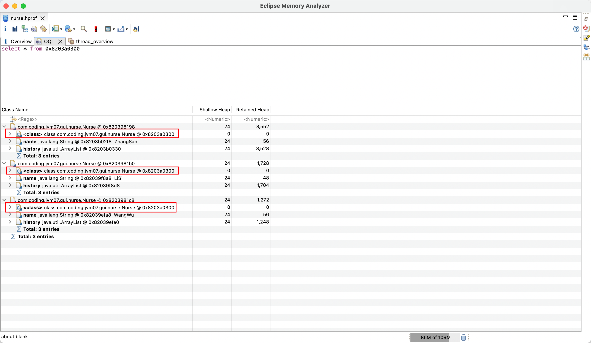

#### Where 子句

​	Where子句用于指定OQL的查询条件。OQL查询将只返回满足Where子句指定条件的对象。Where子句的格式与传统SQL极为相似。

​	下面返回长度大于10的char[]数组。

```sql
select * from char[] s where s.@length>10
```

​	结果如下图所示。

<div style="text-align:center;font-weight:bold;">Where查询结果</div>

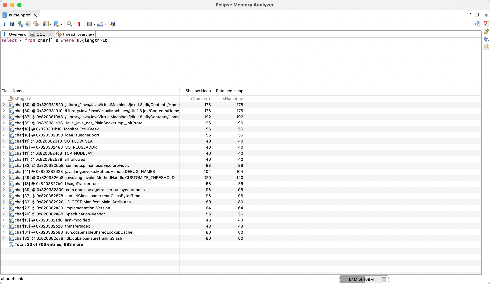

​	下面返回包含“Java”子字符串的所有字符串，使用“LIKE”操作符，“LIKE”操作符的操作参数为正则表达式。

```sql
select * from java.lang.String s where toString(s) like ".*java.*"
```

​	结果如下图所示。

<div style="text-align:center;font-weight:bold;">LIKE查询结果</div>

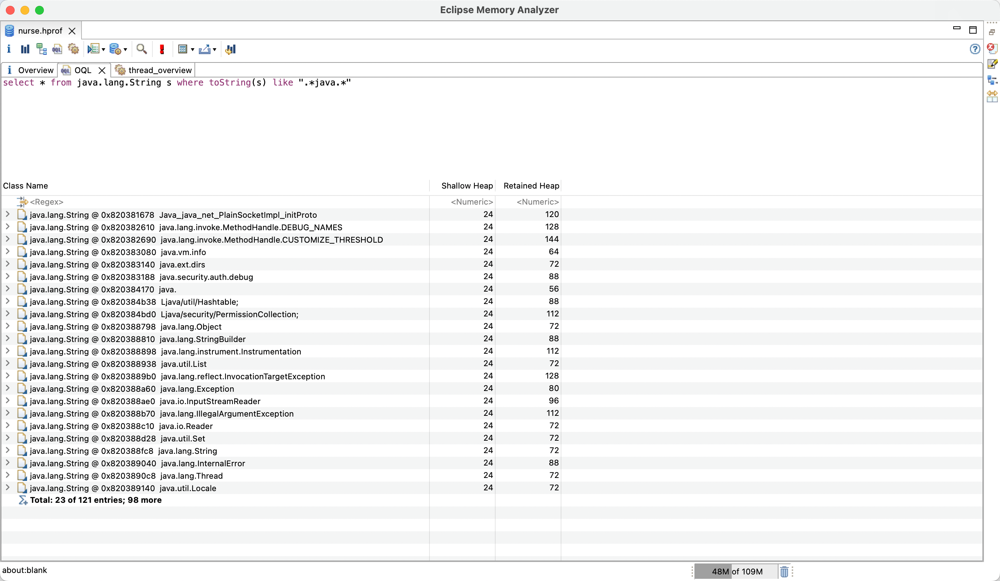

​	下面返回所有value域不为null的字符串，使用“=”操作符。

```sql
select * from java.lang.String s where s.value!=null
```

​	结果如下图所示。

<div style="text-align:center;font-weight:bold;">=”查询结果</div>

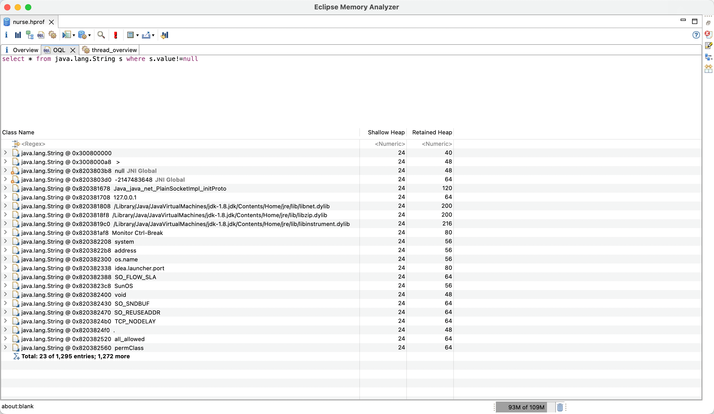

​	Where子句支持多个条件的AND、OR运算。下面返回数组长度大于5，并且深堆大于10字节的所有Vector对象。

```sql
select * from java.util.Vector v where v.elementData.@length>5 and v.@retainedHeapSize>10
```

​	结果如下图所示。

<div style="text-align:center;font-weight:bold;">多条件查询结果</div>

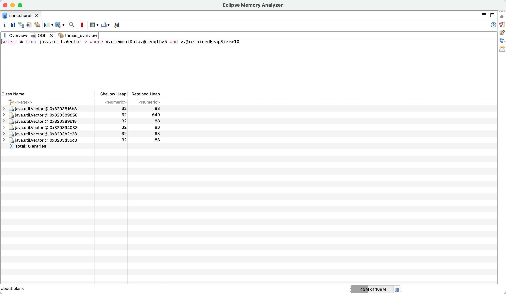

#### 内置对象与方法

​	OQL中可以访问堆内对象的属性，也可以访问堆内代理对象的属性。访问堆内对象的属性时格式如下，其中alias为对象名称。

```sql
[<alias>.] <field>.<field>.<field>
```

​	使用下面的语句可以访问java.io.File对象的path属性，并进一步访问path的value属性。

```sql
SELECT toString(f.path.value)FROM java.io.File f
```

​	下面的语句显示了String对象的内容、objectid和objectAddress。

```sql
SELECT s.toString(),s.@objectId,s.@objectAddress FROM java.lang.String s
```

​	下面的语句显示java.util.Vector内部数组的长度。

```sql
SELECT v.elementData.@length FROM java.util.Vector v
```

​	下面的语句显示了所有的java.util.Vector对象及其子类型。

```sql
select * from INSTANCEOF java.util.Vector
```

### 22.4.4 Tomcat案例分析

​	Tomcat是最常用的Java Servlet容器之一，同时也可以当作单独的Web服务器使用。Tomcat本身使用Java实现，并运行于JVM之上。在大规模请求时，Tomcat有可能会因为无法承受压力而发生内存溢出错误。这里根据一个被压垮的Tomcat的堆快照文件，来分析Tomcat在崩溃时的内部情况。

​	打开Tomcat堆内存文件，如下图所示，显示了Tomcat溢出时的总体信息，可以看到堆的大小为29.7MB。从统计饼图中得知，当前深堆最大的对象为StandardManager，它持有大约16.4MB的对象。

​	一般来说，我们总是会对占用空间最大的对象特别感兴趣，如果可以查看Standard Manager内部究竟引用了哪些对象，对于分析问题可能会起到很大的帮助。因此，在饼图中单击StandardManager所在区域，在弹出菜单中选择“with outgoing references”命令，查看其持有的外部对象引用，如下图所示，这样将会列出被StandardManager引用的所有对象。

<div style="text-align:center;font-weight:bold;">Tomcat堆内存文件</div>


<div style="text-align:center;font-weight:bold;">StandardManager持有的外部对象引用</div>

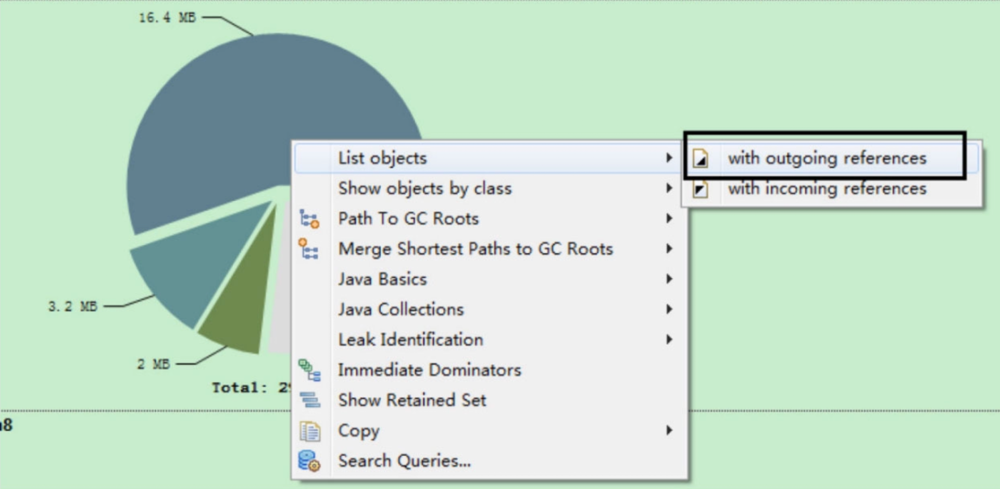

​	外部对象为sessions对象，它占用了约17MB空间，结果如下图所示。

<div style="text-align:center;font-weight:bold;">StandardManager对象的内部引用</div>


​	可以看到sessions对象为ConcurrentHashMap，其内部分为16个Segment。从深堆大小看，每个Segment都比较平均，大约为1MB，合计17MB，如下图所示。

<div style="text-align:center;font-weight:bold;">ConcurrentHashMap对象</div>

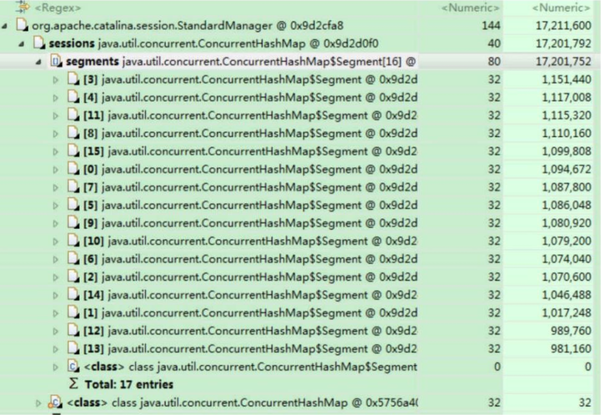

​	单击ConcurrentHashMap可以得到其value为Session对象，如下图所示。

<div style="text-align:center;font-weight:bold;">查找Session对象</div>

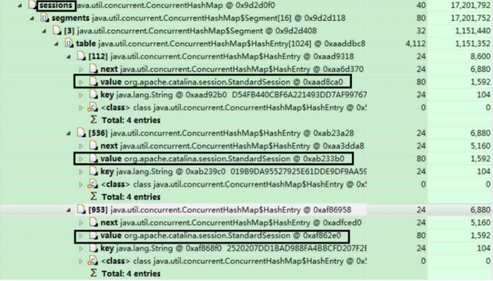

​	通过OQL语句“SELECT OBJECTS s from org.apache.catalina.session.StandardSession s”查找当前堆中session对象的数量，发现其含有9941个session，并且每一个session的深堆为1592字节，合计约15MB，达到当前堆大小的50%。由此可以知道，当前Tomcat发生内存溢出的原因，极可能是由于在短期内接收大量不同客户端的请求，从而创建大量session导致，如下图所示。

<div style="text-align:center;font-weight:bold;">查找所有session对象</div>

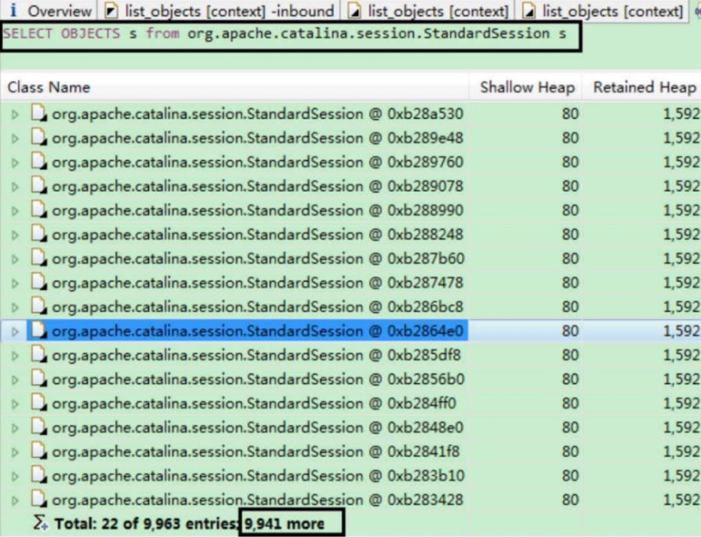

​	单击session对象，如下图所示，在左侧的对象属性表中，可以看到所选中的session的最后访问时间和创建时间。

<div style="text-align:center;font-weight:bold;">session内部数据</div>

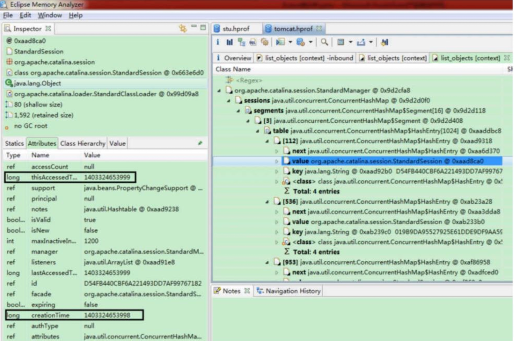

​	通过OQL语句和MAT的排序功能，可以找到当前系统中最早创建的session和最后创建的session，如下图所示。

<div style="text-align:center;font-weight:bold;">最早和最晚创建的session</div>

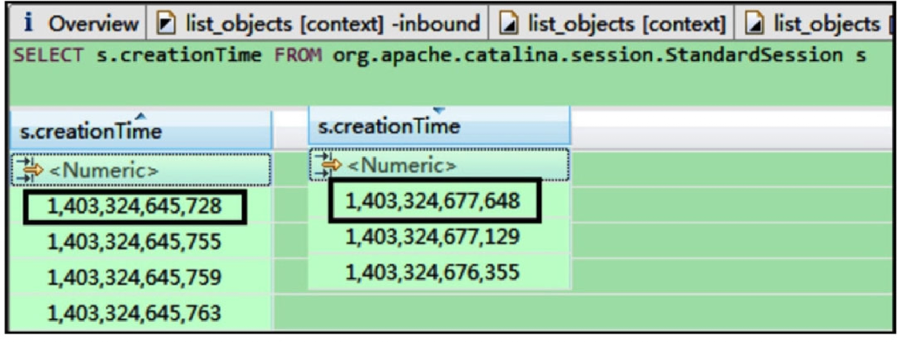

​	根据当前的session总数，可以计算每秒的平均压力为：9941/(1403324677648-1403324645728)×1000=311次／秒。由此推断，在发生Tomcat堆溢出时，Tomcat在连续30秒的时间内，平均每秒接收了约311次不同客户端的请求，创建了合计9941个session。

## 22.5 JProfiler

### 22.5.1 概述

​	如果在运行Java程序的时候想查看内存占用情况，在Eclipse里面有MAT插件可以看，在IntelliJ IDEA中也有类似的插件，就是JProfiler。JProfiler是由ej-technologies公司开发的一款Java应用性能诊断工具。

​	JProfiler使用方便、界面操作友好，对被分析的应用影响小，对系统的CPU、Thread、Memory分析功能尤其强大，支持对jdbc、noSql、jsp、servlet和socket等进行分析，支持多种模式（离线、在线）的分析，支持监控本地、远程的JVM，而且跨平台，拥有多种操作系统的安装版本。

​	主要功能有以下几个方面。

(1)对方法调用的分析可以帮助了解应用程序正在做什么，并找到提高其性能的方法。
(2)通过分析堆上对象，引用链和垃圾收集能帮助修复内存泄漏等问题。
(3)提供多种针对线程和锁的分析视图帮助分析多线程问题。
(4)支持对子系统进行集成分析，例如JDBC的调用，可以帮助找到执行比较慢的SQL语句。

### 22.5.2 安装与配置

​	官网下载页面如下图所示。

​	官网下载地址：https://www.ej-technologies.com/products/jprofiler/overview.html

<div style="text-align:center;font-weight:bold;"> JProfiler下载页面</div>


​	下载安装成功后，点击启动；启动完以后需要在JProfiler配置IntelliJ IDEA开发工具，如下所示。

(1)选择“Session”→“IDE Integration”，如下图所示。

<div style="text-align:center;font-weight:bold;">JProfiler配置IntelliJ IDEA</div>


(2)单击“Integrate”按钮，选择对应的IntelliJ IDEA版本，如下图所示。

<div style="text-align:center;font-weight:bold;">JProfiler配置IntelliJ IDEA</div>

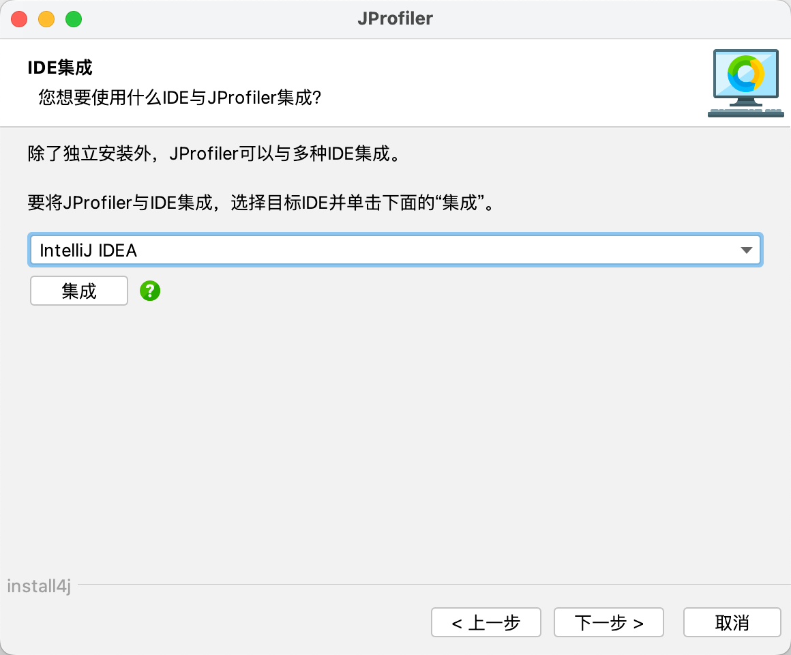

(3)单击“OK”即可，如下图所示。

<div style="text-align:center;font-weight:bold;">JProfiler配置IntelliJ IDEA</div>


​	上面步骤执行完毕后，这里会自动配置完成。

<div style="text-align:center;font-weight:bold;">IntelliJ IDEA上的配置效果1</div>

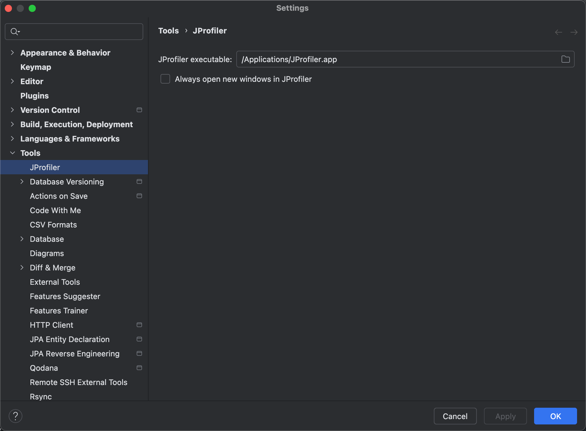

​	若要选择 Profile 'JProfilerTest' with 'IntelliJ Profiler'，会在IDEA中内嵌打开JProfiler效果如下图：

<div style="text-align:center;font-weight:bold;">IntelliJ IDEA上的配置效果2(Profile 'JProfilerTest' with 'IntelliJ Profiler')</div>


​	若要选择 Profile 'JProfilerTest' with JProfiler，会自动打开JProfiler效果如下图：

<div style="text-align:center;font-weight:bold;">IntelliJ IDEA上的配置效果3(Profile 'JProfilerTest' with JProfiler)</div>


<div style="text-align:center;font-weight:bold;">IntelliJ IDEA后台日志</div>

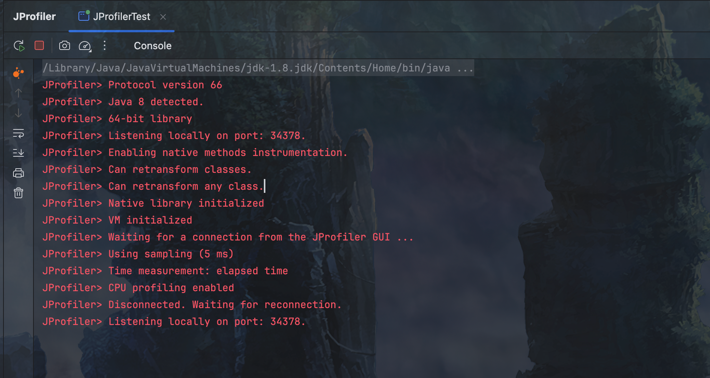

### 22.5.3 具体使用

#### JProfier数据采集方式

​	数据采集方式分为两种，分别是Sampling（样本采集）和Instrumentation（重构模式），打开JProfier的时候进行选择，如下图所示。

<div style="text-align:center;font-weight:bold;">JProfiler数据采集方式界面</div>

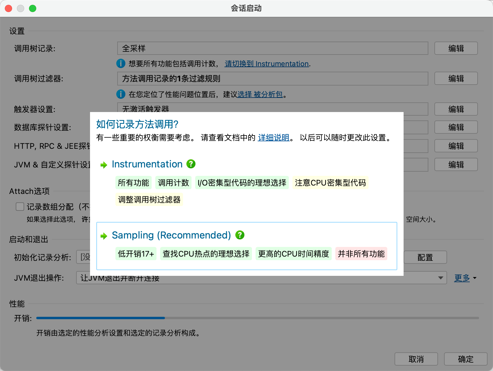

​	1、Instrumentation是JProfiler全功能模式。在加载类之前，JProfier把相关功能代码写入需要分析的class的bytecode中，对正在运行的JVM有一定影响。该方式的优点是功能强大。在此设置中，调用堆栈信息是准确的。缺点是如果要分析的class较多，则对应用的性能影响较大，CPU开销可能很高（取决于Filter的控制）。因此使用此模式一般配合Filter使用，只对特定的类或包进行分析。

​	2、Sampling类似于样本统计，每隔一定时间(5ms)将每个线程栈方法栈中的信息统计出来。该方式的优点是对CPU的开销非常低，对应用影响小。缺点是一些数据／特性不能提供，例如方法的调用次数、执行时间。

​	需要注意的是，JProfiler本身没有指出数据的采集类型，这里的采集类型是针对方法调用的采集类型。因为JProfiler的绝大多数核心功能都依赖方法调用采集的数据，所以可以直接认为是JProfiler的数据采集类型。

#### 遥感监测（Telemetries，查看JVM的运行信息）

​	1、整体视图(Overview)：显示堆内存、CPU、线程以及GC等活动视图，如下图所示。

<div style="text-align:center;font-weight:bold;">JProfiler遥感监测界面</div>

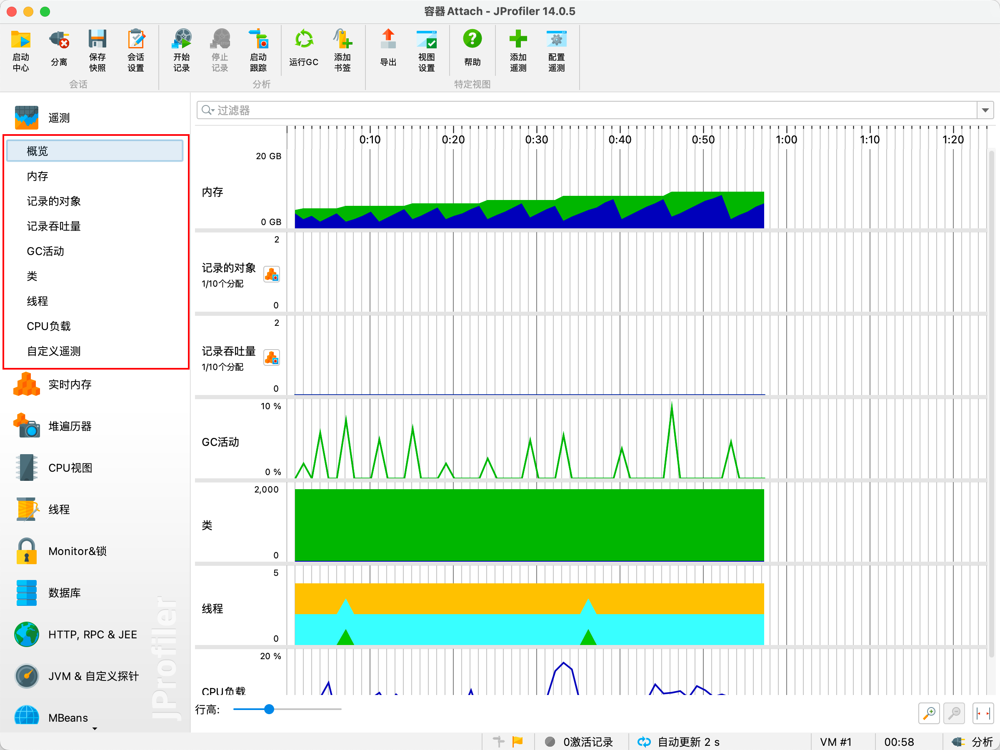

​	2、内存(Memory)：显示一张关于内存变化的活动时间表，如下图所示。

<div style="text-align:center;font-weight:bold;">JProfiler遥感监测之内存界面</div>


​	3、记录的对象(Recorded objects)：显示一张关于活动对象与数组的活动时间表，如下图所示，可以看到，在程序运行16分21秒后，非数组类型(Non-arrays)的活动对象的数量是130个，数组类型(Arrays)的对象是0个。

<div style="text-align:center;font-weight:bold;">JProfiler遥感监测之记录的对象界面</div>

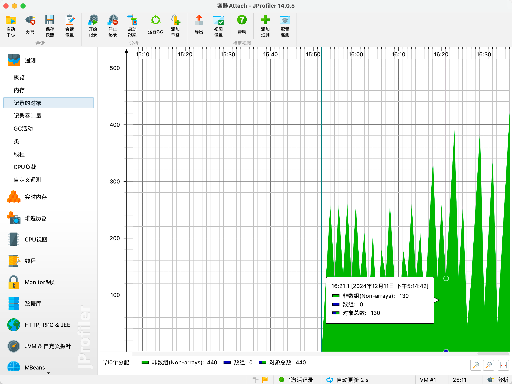

​	4、记录吞吐量(Record Throughput)：对象创建和回收对象记录，记录单位时间间隔内对象创建和回收的数量，如下图所示，在程序运行17分37秒后，JVM此时每秒回收520个对象，每秒创建87个对象。

<div style="text-align:center;font-weight:bold;">JProfiler遥感监测之吞吐量界面</div>

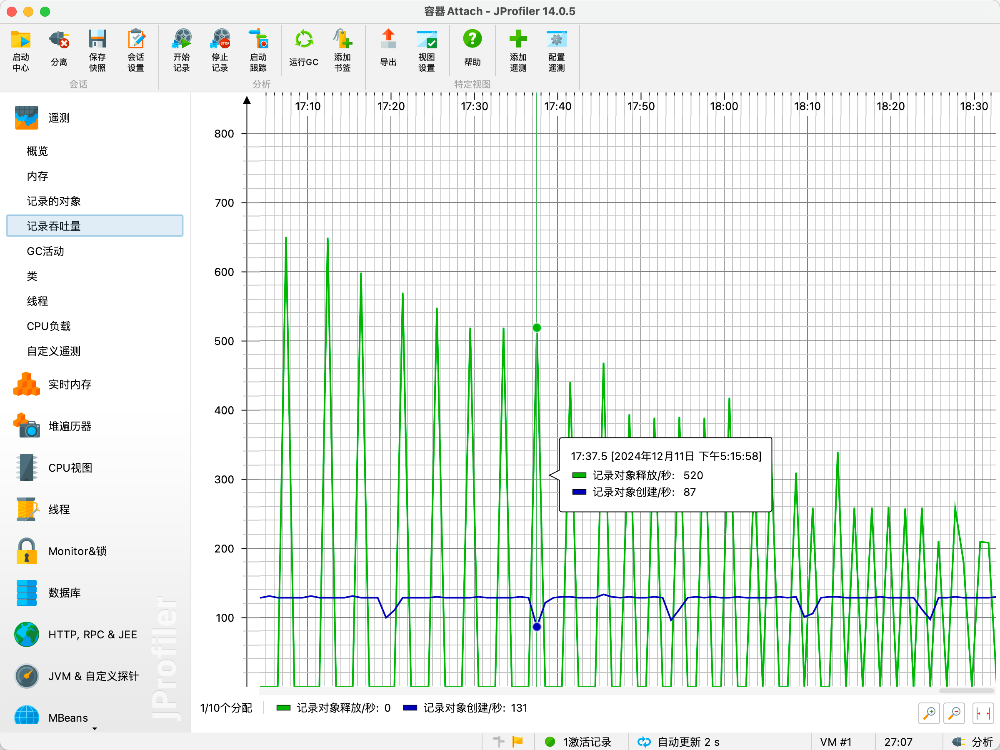

​	5、垃圾收集活动(GC Activity)：显示一张关于垃圾回收活动的活动时间表，如下图所示，可以看到在程序运行22分10秒后，JVM此时回收的内存占比是3.68%。

<div style="text-align:center;font-weight:bold;">JProfiler遥感监测之垃圾收集活动界面</div>

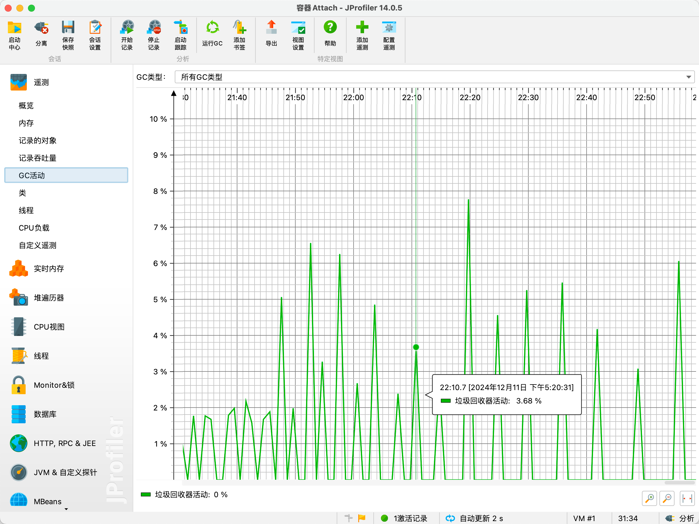

​	6、类(Classes)：显示一个CPU分析和非CPU分析已装载类的活动时间表，非CPU分析的类是Filter设置中未包含的类，对于样本统计，CPU将分析组成样本的类，而不分析JVM中加载的其他类。如下图所示，图中时刻CPU分析了17个类，非CPU分析的类有1895个，全部类的数量为1912个，如果想要改变CPU分析类的数量，通过“Session”→“Session Settings”→“Define Filters”即可在Filter选项中设置。

<div style="text-align:center;font-weight:bold;">JProfiler遥感监测之类界面</div>

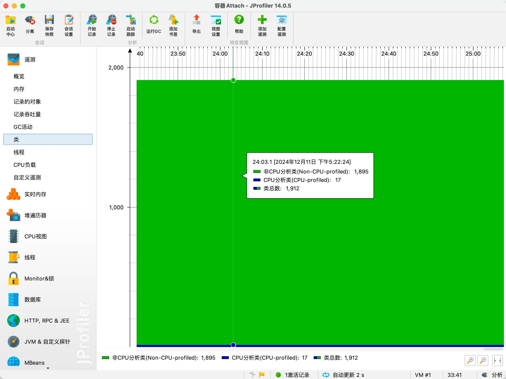

​	7、线程(Threads)：表示线程活动状态的时间表，如下图所示。

<div style="text-align:center;font-weight:bold;">JProfiler遥感监测之线程界面</div>

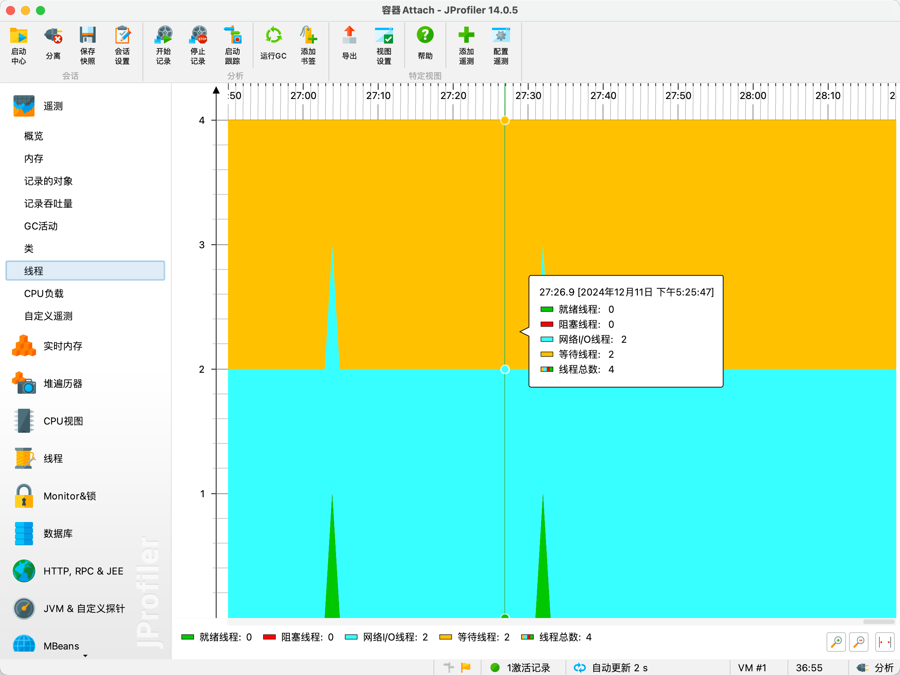

​	8、CPU负载(CPU Load)：显示一段时间中CPU的负载图表，如下图所示。

<div style="text-align:center;font-weight:bold;">JProfiler遥感监测之CPU负载界面</div>

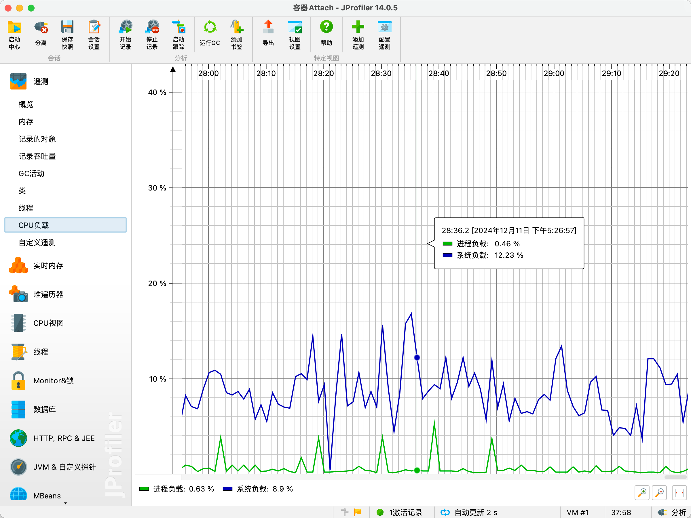

#### 内存视图(Live memory)

​	剖析内存中对象的相关信息。例如查看对象的个数、大小、对象创建的方法执行栈，以及对象创建的热点。

​	1、所有对象(All Objects)：显示所有加载的类的列表和在堆上分配的实例数，如下图所示。

<div style="text-align:center;font-weight:bold;">JProfiler内存界面</div>

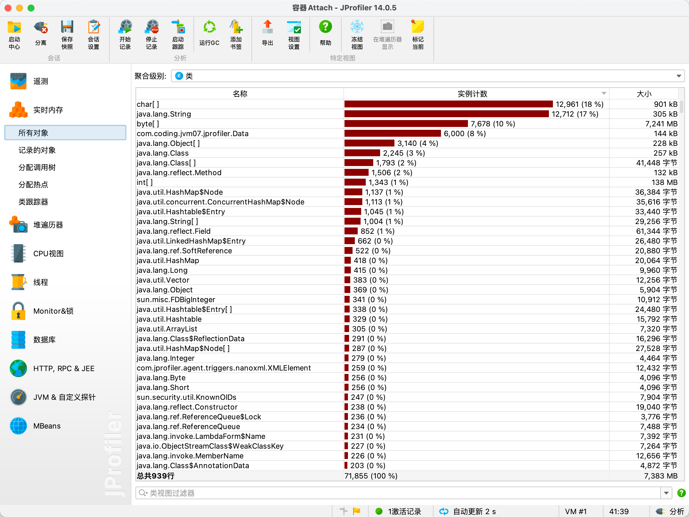

​	2、记录对象(Record Objects)：查看特定时间段对象的分配，并记录分配的调用堆栈。如下图所示，可以看到对象的分配数量等信息，也可以修改对象分配和记录的比例。

<div style="text-align:center;font-weight:bold;">JProfiler记录对象界面</div>

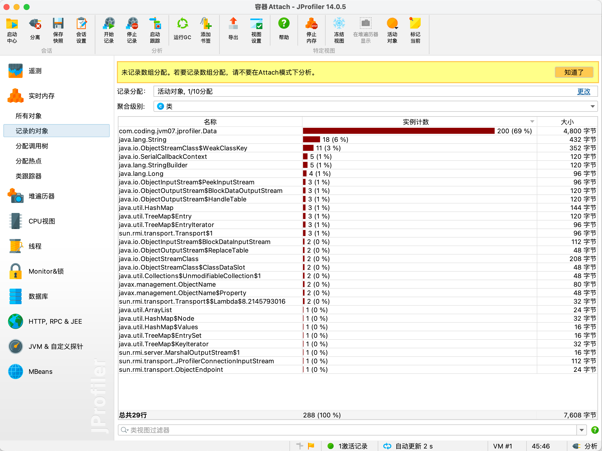

​	3、分配访问树(Allocation Call Tree)：显示一棵请求树，可以根据方法、类、包、组件等信息展示，默认不展示图表，需要手动单击右侧按钮查看，如下图所示。图<span style="color:blue;font-weight:bold;">JProfiler分配访问树界面</span>展示了按照方法展示访问树的图表效果。

<div style="text-align:center;font-weight:bold;">JProfiler分配访问树界面</div>


<div style="text-align:center;font-weight:bold;">JProfiler分配访问树界面</div>

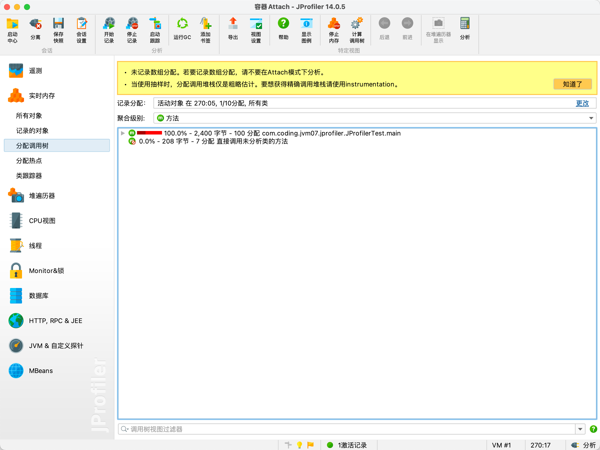

​	4、分配热点(Allocation Hot Spots)：显示一个列表，可以根据方法、类、包或组件展示内存分配的热点信息，对于每个热点都可以显示它的跟踪记录树，不再过多介绍。

<div style="text-align:center;font-weight:bold;">JProfile分配热点界面</div>

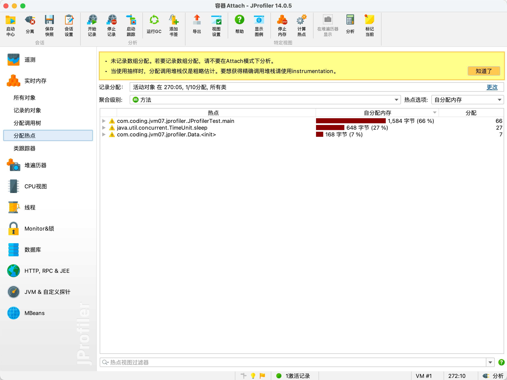

​	5、类追踪器(Class Tracker)：类追踪器视图可以包含任意数量的图表，显示选定的类和包的实例与时间，如下图所示，在程序不断创建对象的过程中，对象数量的变化曲线在逐步增高。

<div style="text-align:center;font-weight:bold;">JProfiler类追踪器界面</div>

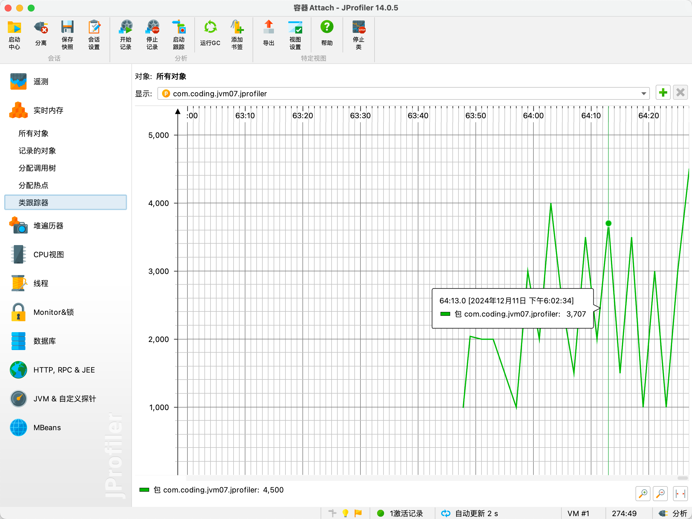

#### 堆遍历(Heap Walker)

​	堆遍历对一定时间内收集的内存对像信息进行静态分析，该模块可以明确查看对象的引用关系，功能强大且使用方便，包含对象的outgoing reference、incoming reference和biggest object等选项。

​	1、类“Classes”：显示所有类和它们的实例，可以右击具体的类“Used Selected Instance”实现进一步跟踪，如下图所示。

<div style="text-align:center;font-weight:bold;">JProfiler类界面</div>


​	2、分配(Allocations)：为所有记录对象显示分配树和分配热点，如下图所示。

<div style="text-align:center;font-weight:bold;">JProfiler对象分配界面</div>

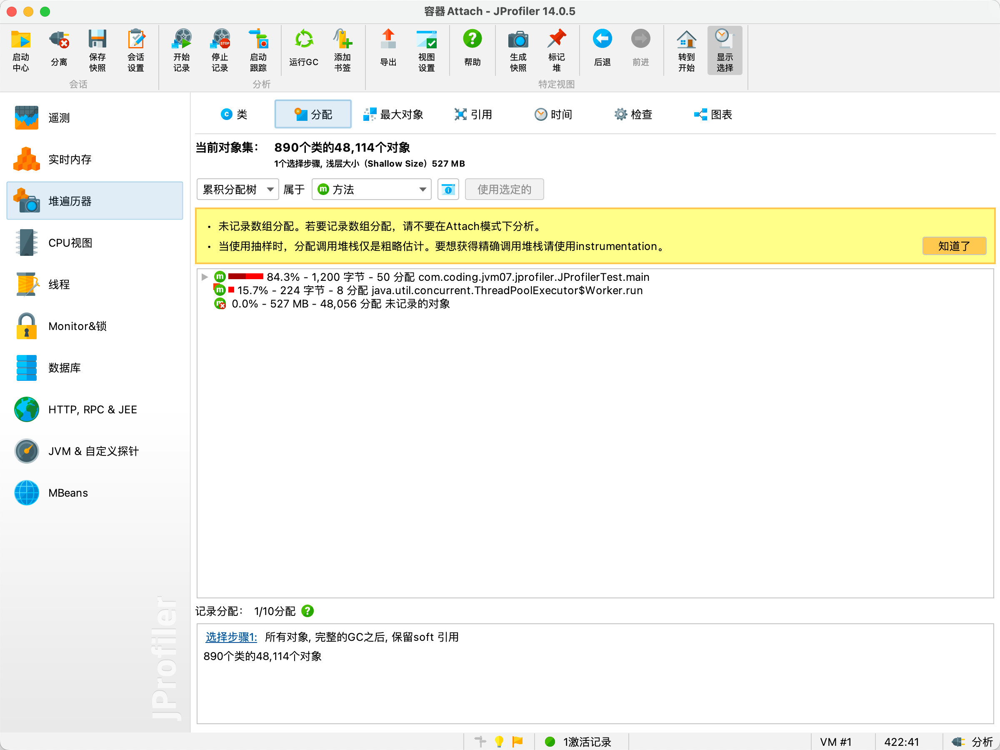

​	3、引用(References)：为单个对象和“显示到垃圾回收根目录的路径”提供索引图的显示功能。还能提供合并输入视图和输出视图的功能，和MAT中的with outgoing references功能一样，如下图所示。

<div style="text-align:center;font-weight:bold;">JProfiler对象引用界面</div>

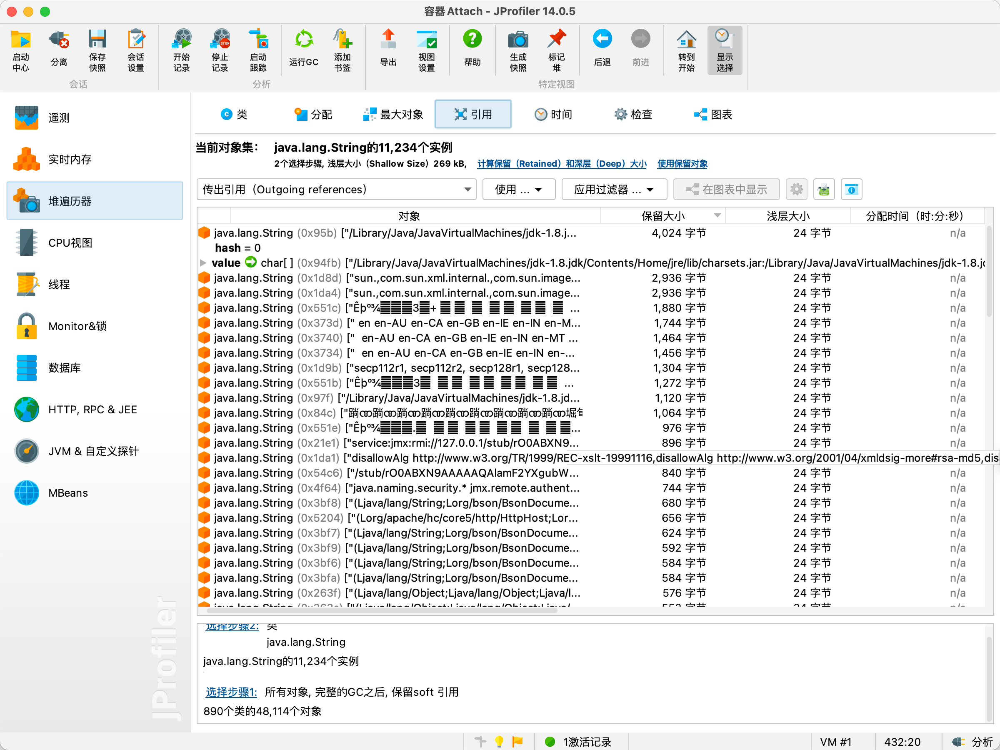

​	4、时间(Time)：显示一个对已记录对象集的分配时间直方图。
​	5、检查(Inspections)：显示一个数量的操作，将分析当前对象集在某种条件下的子集，实质是一个筛选的过程。
​	6、图表(Graph)：需要在references视图和biggest视图手动添加对象到图表，它可以显示对象的传入和传出引用，便于找到垃圾收集器根源。

#### CPU视图(CPU views)

​	JProfiler提供不同的方法来记录访问树以优化性能和细节。线程或者线程组以及线程状况可以被所有的视图选择。所有的视图可以在方法、类、包或组件等不同层面上展示。
​	1、访问树(Call Tree)：显示一个积累的自顶向下的树，以树结构自顶向下显示线程方法调用树以及各个方法对CPU的使用情况，如下图所示。

<div style="text-align:center;font-weight:bold;">JProfilerCPU之访问树界面</div>

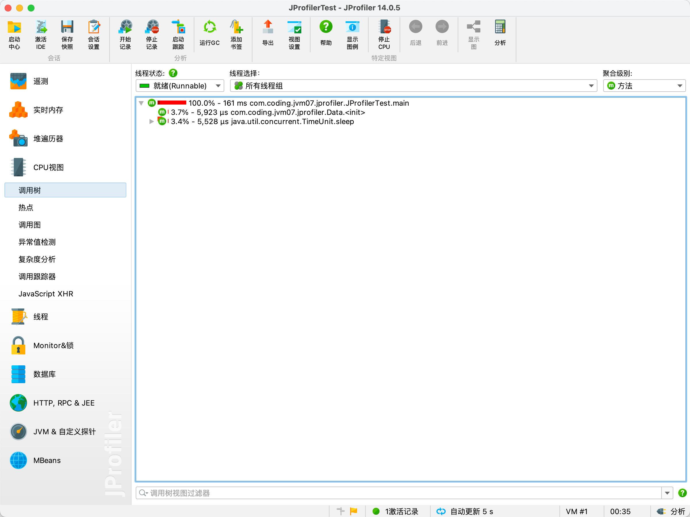

​	2、热点(Hot Spots)：显示消耗时间最多的方法的列表。对每个热点方法都能够显示回溯树，如下图所示。

<div style="text-align:center;font-weight:bold;">JProfilerCPU之热点方法界面</div>

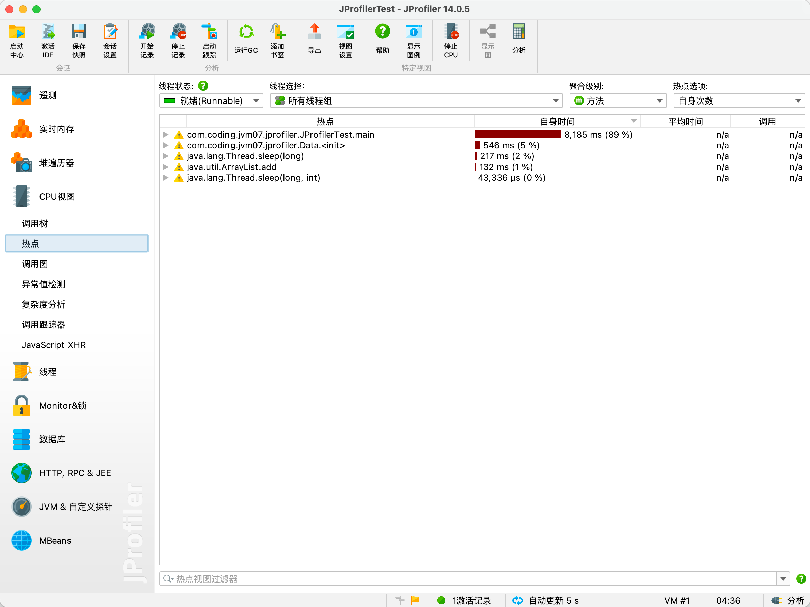

​	3、访问图(Call Graph)：显示一个从已选方法、类、包或J2EE组件开始的访问队列的图，如下图所示。

<div style="text-align:center;font-weight:bold;">JProfilerCPU之访问图界面</div>

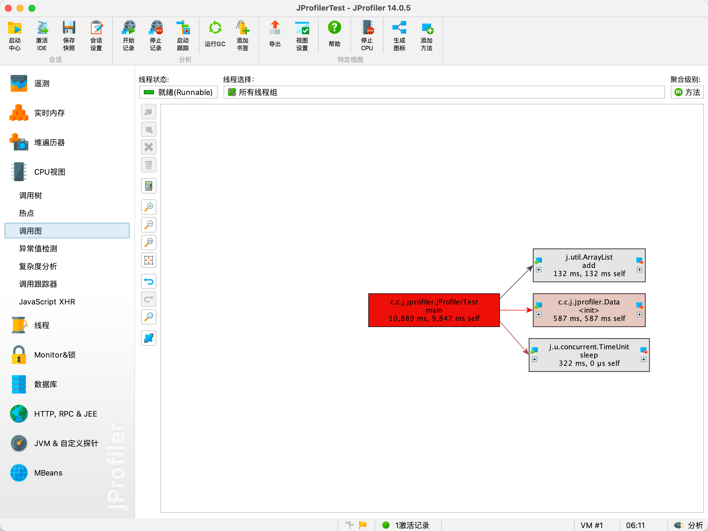

#### 线程视图(Threads)

​	JProfiler通过对线程历史的监控判断其运行状态，并监控是否有线程阻塞产生，还能将一个线程所管理的方法以树状形式呈现。对线程剖析，依旧使用如下代码来进行测试。

<span style="color:#40E0D0;">案例1：死锁案例</span>

- 代码

```java
package com.coding.jvm07.cmd;

/**
 * 演示线程的死锁问题
 * 互相的 BLOCKED 导致-> Found one Java-level deadlock:
 */
public class ThreadDeadLock {
    public static void main(String[] args) {
        StringBuilder sb1 = new StringBuilder();
        StringBuilder sb2 = new StringBuilder();

        new Thread(() -> {
            synchronized (sb1) {
                sb1.append("a");
                sb2.append("1");

                try {
                    Thread.sleep(100);
                } catch (InterruptedException e) {
                    e.printStackTrace();
                }

                synchronized (sb2) {
                    sb1.append("b");
                    sb2.append("2");

                    System.out.println("sb1 = " + sb1);
                    System.out.println("sb2 = " + sb2);
                }
            }
        }).start();

        new Thread(() -> {
            synchronized (sb2) {
                sb1.append("c");
                sb2.append("3");

                try {
                    Thread.sleep(100);
                } catch (InterruptedException e) {
                    e.printStackTrace();
                }

                synchronized (sb1) {
                    sb1.append("d");
                    sb2.append("4");

                    System.out.println("sb1 = " + sb1);
                    System.out.println("sb2 = " + sb2);
                }
            }
        }).start();

    }
}

```

​	1、程历史(Thread History)：显示一个与线程活动和线程状态在一起的活动时间表，如下图中可以看到，两个线程始终处于阻塞状态，红色代表Blocked。

<div style="text-align:center;font-weight:bold;">JProfiler历史线程界面</div>


​	2、线程监控(Thread Monitor)：显示一个列表，包括所有的活动线程以及它们目前的活动状况，如下图所示，目前线程依然是阻塞状态。

<div style="text-align:center;font-weight:bold;">JProfiler线程监控界面</div>

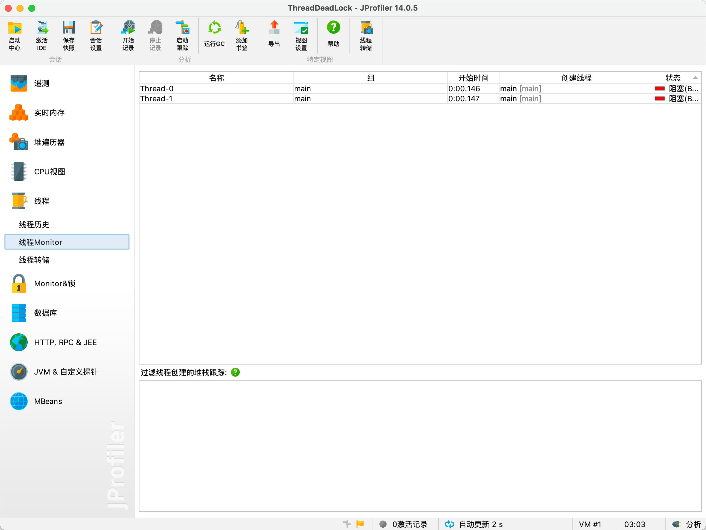

​	3、线程转储(Thread Dumps)：显示所有线程的堆栈跟踪，下图中截取了两个时间段的线程dump。对比图22-100，从而可以查看线程不同时间段的状态。

<div style="text-align:center;font-weight:bold;">JProfiler线程dump界面</div>


<div style="text-align:center;font-weight:bold;">JProfiler线程比对界面</div>

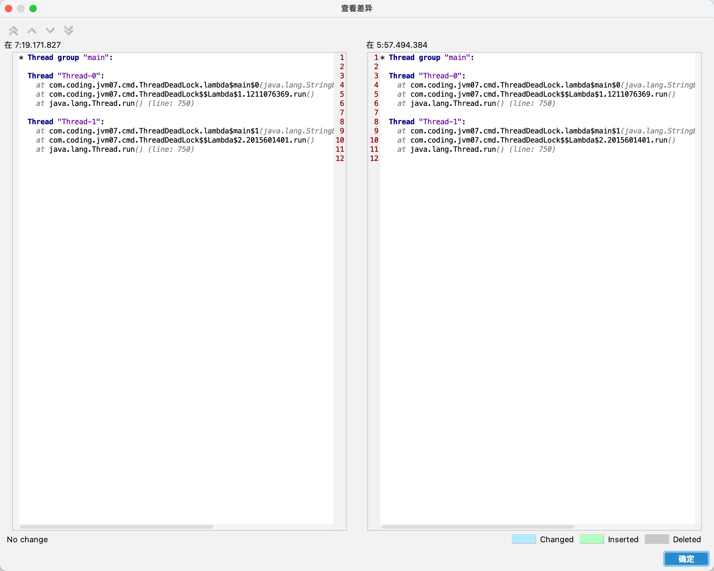

​	线程分析主要关心以下三个方面。

​	1、Web容器的线程最大数，比如Tomcat的线程容量应该略大于最大并发数。
​	2、线程阻塞。
​	3、线程死锁。

#### 监控和锁(Monitors&Locks)

​	所有线程持有锁的情况以及锁的信息，观察JVM的内部线程并查看状态。

​	1、死锁探测图表(Current Locking Graph)：显示JVM中的当前死锁图表，如下图所示。

<div style="text-align:center;font-weight:bold;">JProfiler线程死锁界面</div>

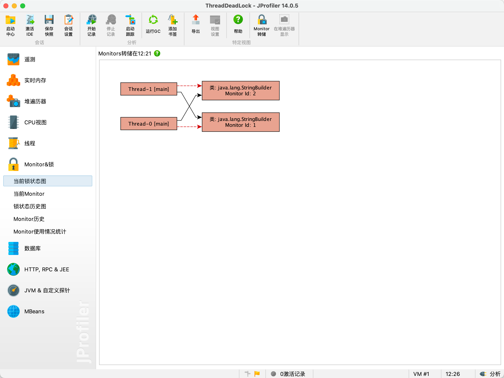

​	2、目前使用的监测器(Current Monitors)：显示目前使用的监测器并且包括它们的关联线程，如下图所示。

<div style="text-align:center;font-weight:bold;">JProfiler线程检测器界面</div>

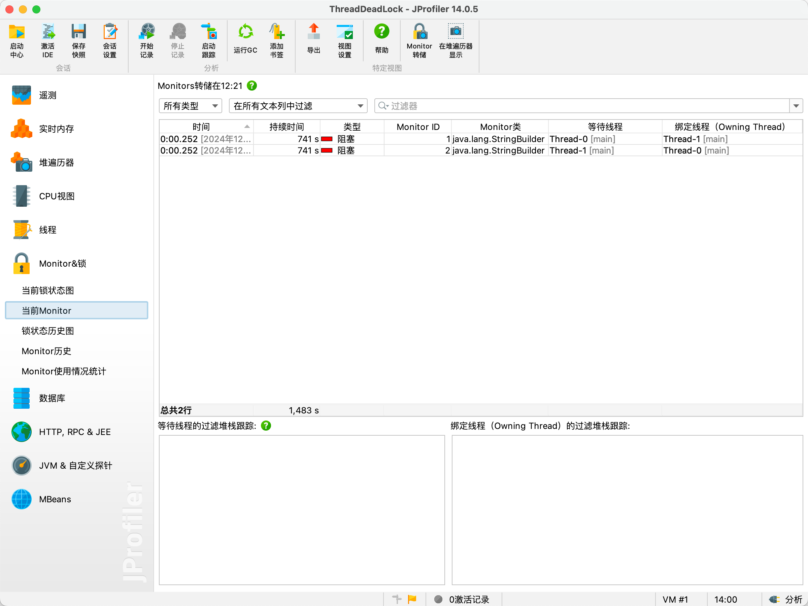

​	3、锁定历史图表(Locking History Graph)：显示记录在JVM中的锁定历史。

​	4、历史检测记录(Monitor History)：显示重大的等待事件和阻塞事件的历史记录。

​	5、监控器使用统计(Monitor Usage Statistics)：显示分组监测，线程和监测类的统计监测数据。

### 22.5.4 案例分析

​	下面我们写一段程序来进行JProfiler分析，如下代码所示。

<span style="color:#40E0D0;">案例1：JProfiler案例</span>

- 代码

```java
package com.coding.jvm07.jprofiler;

import java.util.ArrayList;
import java.util.concurrent.TimeUnit;

/**
 * 功能演示测试：正常程序
 */
public class JProfilerTest {
    public static void main(String[] args) {
        while (true) {
            ArrayList list = new ArrayList();
            for (int i = 0; i < 500; i++) {
                Data data = new Data();
                list.add(data);
            }

            try {
                TimeUnit.MILLISECONDS.sleep(500);
            } catch (InterruptedException e) {
                throw new RuntimeException(e);
            }
        }
    }
}

class Data {
    private int size = 10;
    private byte[] buffer = new byte[1024 * 1024]; // 1mb
    private String info = "hello,world";
}

```

​	通过JProfiler打开该程序，观察内存区域视图，可以发现，当内存使用到一段时间以后，会有一个快速回落的过程，这是由于GC造成的，最终形成一个锯齿的形状，比较平稳，这种一般来说都是比较正常的情况，如下图所示。

<div style="text-align:center;font-weight:bold;">JProfiler内存GC界面</div>

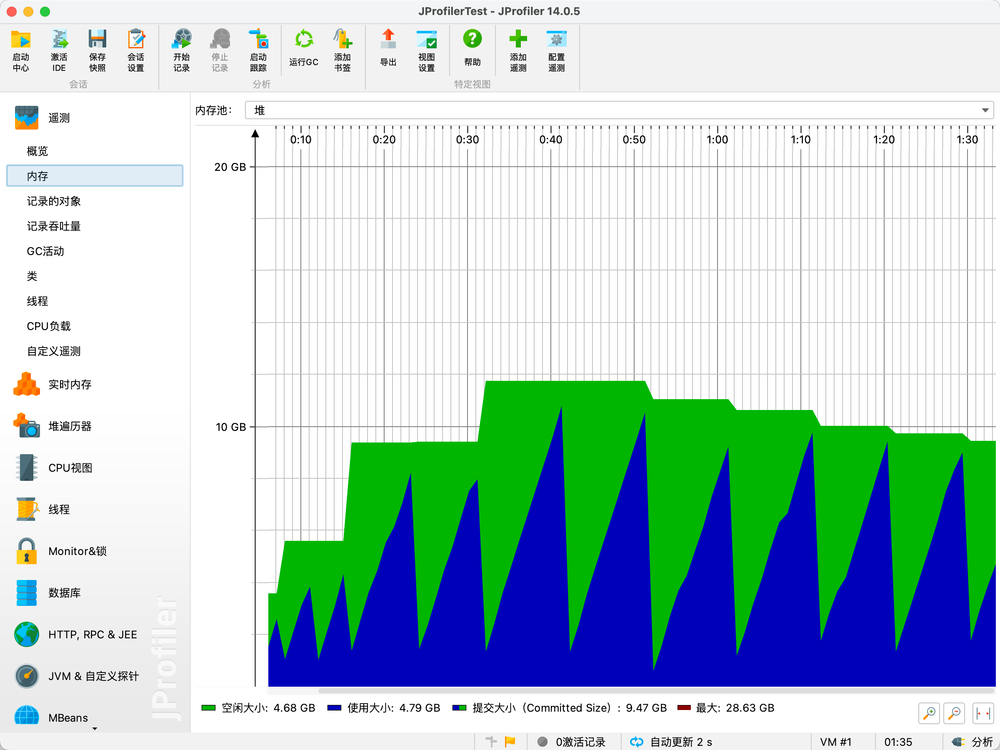

​	观察对象的过程中，也会发现Data对象的数量经过一段时间后就会变少，同样是GC的效果，如下图<span style="color:blue;font-weight:bold;">JProfiler类对象分配界面1</span>和图<span style="color:blue;font-weight:bold;">JProfiler类对象分配界面2</span>所示，前者图中Data对象数量是2000，一段时间后，后者图中Data对象数量减少为1500。

<div style="text-align:center;font-weight:bold;">JProfiler类对象分配界面1</div>

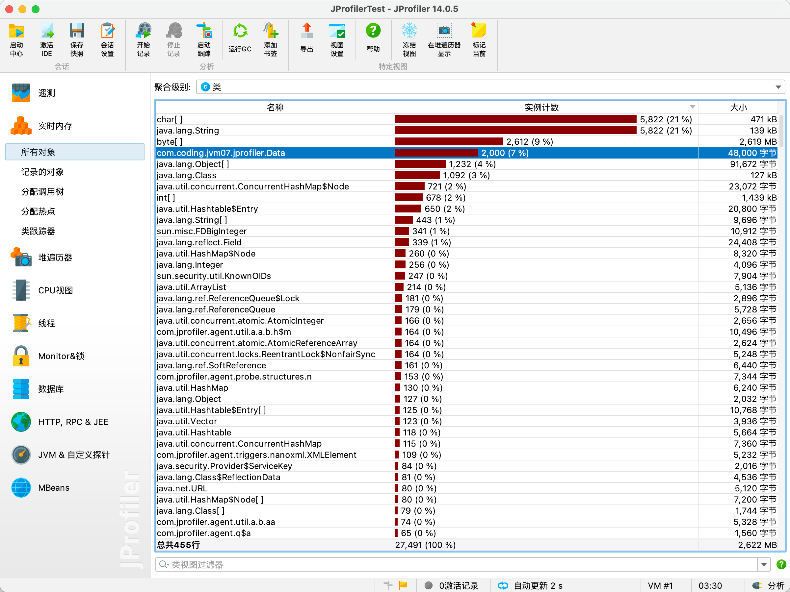

<div style="text-align:center;font-weight:bold;">JProfiler类对象分配界面2</div>

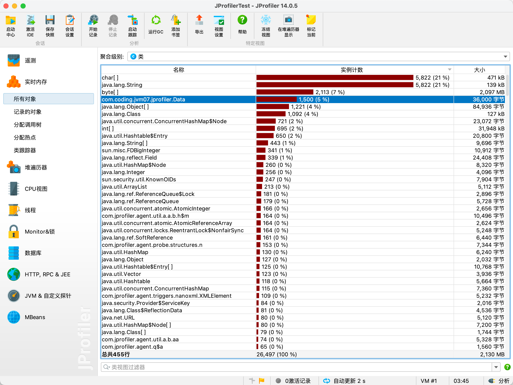

## 22.6 Arthas

### 22.6.1 基本概述

​	前面，我们介绍了JDK自带的VisualVM等免费工具，以及商业化工具JProfiler。这两款工具在业界知名度也比较高，它们的优点是可以在图形界面上看到各维度的性能数据，使用者根据这些数据进行综合分析，然后判断哪里出现了性能问题。

​	但是这两款工具也有个缺点，都必须在服务端项目进程中配置相关的监控参数，然后工具通过远程连接到项目进程，获取相关的数据。这样就会带来一些不便，比如线上环境的网络是隔离的，本地的监控工具根本连不上线上环境。那么有没有一款工具不需要远程连接，也不需要配置监控参数，同时也提供了丰富的性能监控数据呢？下面跟大家介绍一款阿里巴巴开源的性能分析神器Arthas（阿尔萨斯），如下图所示。

<div style="text-align:center;font-weight:bold;">Arthas图标</div>


​	Arthas是Alibaba开源的JVM诊断工具，深受开发者喜爱。开发者在线排查问题，无须项目重启，Arthas会动态跟踪Java程序，实时监控JVM状态。

​	Arthas支持JDK 6+（4.x 版本不再支持 JDK 6 和 JDK 7），支持Linux/Mac/Windows，采用命令行交互模式，同时提供丰富的Tab自动补全功能，进一步方便进行问题的定位和诊断。

​	当各位读者遇到以下类似问题而束手无策时，Arthas可以帮助解决。这个类从哪个jar包加载的？为什么会报各种类相关的Exception？修改的代码为什么没有执行到？遇到问题无法在线上debug，难道只能通过加日志再重新发布吗？线上遇到某个用户的数据处理有问题，但线上同样无法debug，线下无法重现。是否有一个全局视角来查看系统的运行状况？有什么办法可以监控到JVM的实时运行状态？Arthas代码基于Greys二次开发而来，Arthas的命令行实现基于termd开发，文本渲染功能基于crash中的文本渲染功能开发，命令行界面基于vert.x提供的cli库进行开发，等等，集各家所长开发的一款工具。下面作者带大家一起走进Arthas。

### 22.6.2 安装与使用

#### 安装

​	Arthas官方文档地址为https://arthas.aliyun.com/。Arthas有以下两种下载方式。

​	1、可以直接在Linux上通过wget或者curl命令下载，选择GitHub或者尝试国内的码云Gitee下载。

```bash
# GitHub下载
% wget https://alibaba.github.io/arthas/arthas-boot.jar
# Gitee下载
% wget https://arthas.gitee.io/arthas-boot.jar
# curl 下载
% curl -O https://arthas.aliyun.com/arthas-boot.jar
```

​	2、可以在浏览器直接访问https://alibaba.github.io/arthas/arthas-boot.jar，等待下载成功后，上传到Linux服务器。


#### 启动

​	Arthas是一段Java程序打包成的jar包，所以下载完成以后可以直接用java –jar命令运行，如下所示。

```bash
% java -jar arthas-boot.jar 
```

#### 退出

​	如果只是退出当前的连接，可以用`quit`或者`exit`命令。Attach 到目标进程上的 arthas 还会继续运行，端口会保持开放，下次连接时可以直接连接上。

​	如果想完全退出 arthas，可以执行`stop`命令。

#### 卸载

- 在 Linux/Unix/Mac 平台

```bash
% rm -rf ~/.arthas/
% rm -rf ~/logs/arthas
```

- Windows 平台直接删除 user home 下面的`.arthas`和`logs/arthas`目录

#### Arthas工程目录

​	Arthas工程目录如下表所示。

​	Arthas的GitHub地址：https://github.com/alibaba/arthas

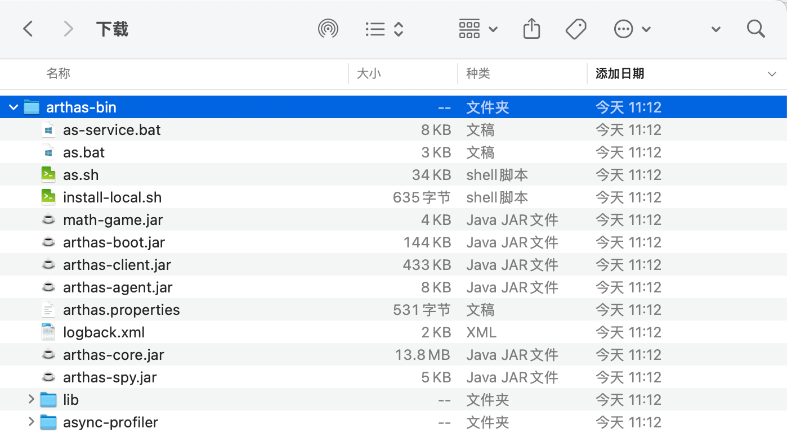

<div style="text-align:center;font-weight:bold;">Arthas工程目录</div>

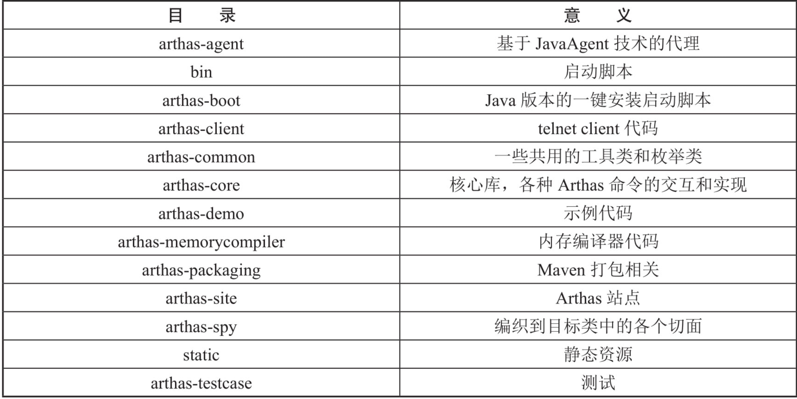

#### 启动使用与Web Console

​	在工作中可以使用java -jar命令启动Arthas，这里可以选择输入对应的Java进程PID，也就可以不输入对应的Java进程PID。执行成功后，Arthas提供了一种命令行方式的交互方式，Arthas会检测当前服务器上的Java进程，并将进程列表展示出来，用户输入对应的编号(1、2、3、4…)进行选择，然后按Enter键。

​	方式1：不添加Java进程PID。

```bash
% java -jar arthas-boot.jar
```

​	运行结果如下。

```bash
[INFO] JAVA_HOME: /Library/Java/JavaVirtualMachines/jdk-17.jdk/Contents/Home
[INFO] arthas-boot version: 4.0.4
[INFO] Found existing java process, please choose one and input the serial number of the process, eg : 1. Then hit ENTER.
* [1]: 51234 com.intellij.idea.Main
  [2]: 62292 org.jetbrains.jps.cmdline.Launcher
  [3]: 853 
  [4]: 81531 math-game.jar
```

​	选择编号，注意输入的是“[]”内编号，不是PID，这里选择编号4，出现如下图所示界面表示Arthas启动成功了。

```bash
4
[INFO] arthas home: /Users/wenqiu/.arthas/lib/4.0.4/arthas
[INFO] Try to attach process 81531
Picked up JAVA_TOOL_OPTIONS: 
[INFO] Attach process 81531 success.
[INFO] arthas-client connect 127.0.0.1 3658
  ,---.  ,------. ,--------.,--.  ,--.  ,---.   ,---.                           
 /  O  \ |  .--. ''--.  .--'|  '--'  | /  O  \ '   .-'                          
|  .-.  ||  '--'.'   |  |   |  .--.  ||  .-.  |`.  `-.                          
|  | |  ||  |\  \    |  |   |  |  |  ||  | |  |.-'    |                         
`--' `--'`--' '--'   `--'   `--'  `--'`--' `--'`-----'                          

wiki       https://arthas.aliyun.com/doc                                        
tutorials  https://arthas.aliyun.com/doc/arthas-tutorials.html                  
version    4.0.4                                                                
main_class demo.MathGame                                                        
pid        81531                                                                
time       2024-12-12 11:32:01.835                                              

[arthas@81531]$ 
```

​	方式2：运行时选择Java进程PID。

```bash
% java -jar arthas-boot.jar [PID]
```

​	查看PID的方式可以通过ps命令，也可以通过JDK提供的jps命令，运行结果如下图所示。

```bash
% jps                       
51234 Main
62292 Launcher
853 
81531 math-game.jar
81567 arthas-boot.jar
81998 Jps
% java -jar arthas-boot.jar 81531
[INFO] JAVA_HOME: /Library/Java/JavaVirtualMachines/jdk-17.jdk/Contents/Home
[INFO] arthas-boot version: 4.0.4
[INFO] Process 81531 already using port 3658
[INFO] Process 81531 already using port 8563
[INFO] arthas home: /Users/wenqiu/.arthas/lib/4.0.4/arthas
[INFO] The target process already listen port 3658, skip attach.
[INFO] arthas-client connect 127.0.0.1 3658
  ,---.  ,------. ,--------.,--.  ,--.  ,---.   ,---.                           
 /  O  \ |  .--. ''--.  .--'|  '--'  | /  O  \ '   .-'                          
|  .-.  ||  '--'.'   |  |   |  .--.  ||  .-.  |`.  `-.                          
|  | |  ||  |\  \    |  |   |  |  |  ||  | |  |.-'    |                         
`--' `--'`--' '--'   `--'   `--'  `--'`--' `--'`-----'                          

wiki       https://arthas.aliyun.com/doc                                        
tutorials  https://arthas.aliyun.com/doc/arthas-tutorials.html                  
version    4.0.4                                                                
main_class demo.MathGame                                                        
pid        81531                                                                
time       2024-12-12 11:32:01.835                                              

[arthas@81531]$ 
```

​	可以通过“java -jar arthas-boot.jar –h”命令来查看启动Arthas的参数选项，如下图所示。

```bash
% java -jar arthas-boot.jar -h
```

​	使用如下命令可以查看Arthas日志。

```bash
% cat ~/logs/arthas/arthas.log
```

​	除了在命令行查看外，Arthas目前还支持Web Console。在成功启动连接进程之后就已经自动启动，可以直接访问http://127.0.0.1:8563/，页面上的操作模式和控制台完全一样，如下图所示。

<div style="text-align:center;font-weight:bold;">Arthas Web Console</div>

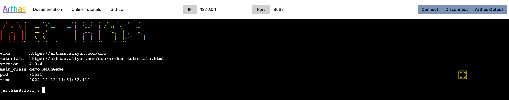

​	使用“quit”或“exit”命令可以退出当前客户端使用。“stop”或“shutdown”命令可以关闭Arthas服务端，并退出所有客户端。

```bash
$ stop
Resetting all enhanced classes ...
Affect(class count: 0 , method count: 0) cost in 0 ms, listenerId: 0
Arthas Server is going to shutdown...
[arthas@81531]$ session (2803ff64-9ffc-47ed-9dc6-11a54d2f1f7e) is closed because server is going to shutdown.
```

### 22.6.3 相关诊断命令

​	进入到客户端之后，需要输入相关的命令，基础命令如下表所示。

<div style="text-align:center;font-weight:bold;">Arthas基础命令</div>

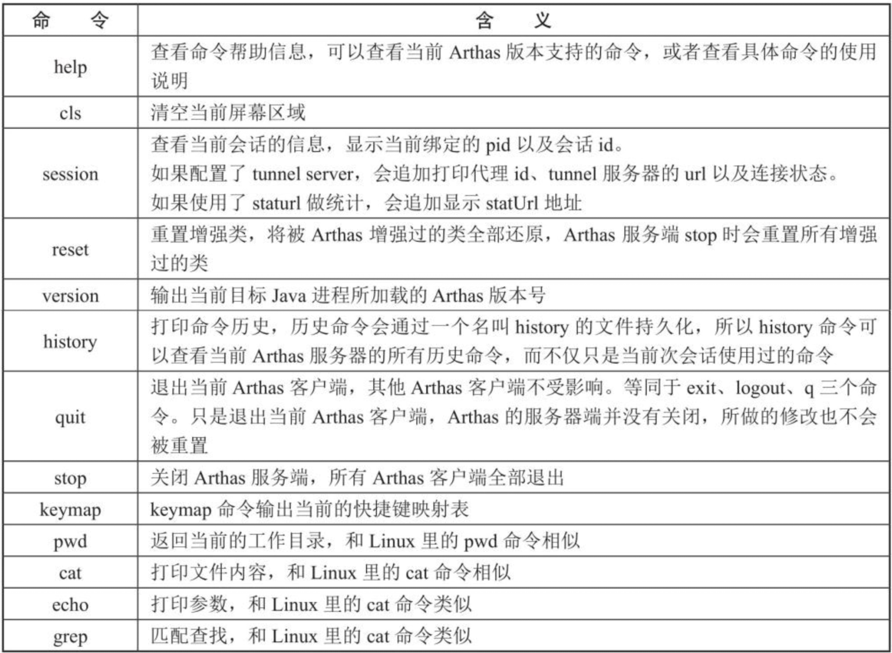

​	例如，在客户端输入help命令，结果如下图所示。

<div style="text-align:center;font-weight:bold;">Arthas Web Console</div>

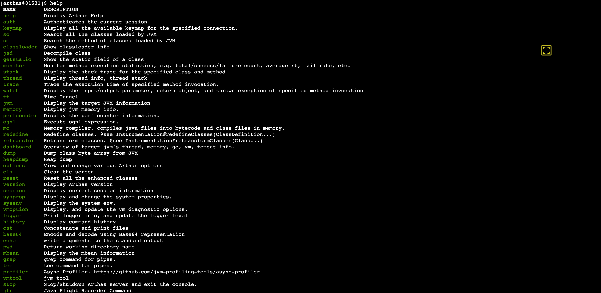

​	命令可以分为JVM相关命令、class/classloader相关命令和monitor/watch/trace相关命令以及其他的命令，下面分别展开讲解。

#### 1 JVM相关命令

##### dashboard命令

​	可以查看当前系统的实时数据面板。展示当前应用的多线程状态、JVM各区域、GC情况等信息，输入“Q”或者按“Ctrl+C”可以退出dashboard命令，如果加入“-n”参数，则在输出指定次数之后，自动退出。dashboard命令参数说明如下表所示。

<div style="text-align:center;font-weight:bold;">dashboard命令参数</div>


​	例如“dashboard -i 1000 -n 2”表示每隔1s输出一次信息，总共输出两次。

​	dashboard命令输出结果如下图所示。

<div style="text-align:center;font-weight:bold;">dashboard命令输出结果</div>

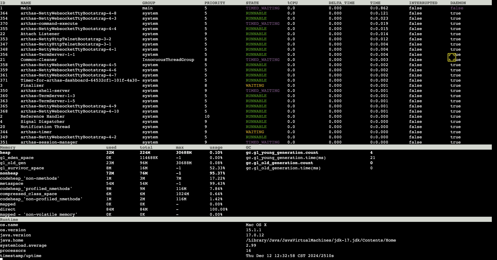

​	可以看到，这里会显示出线程（按照CPU占用百分比倒排）、内存（堆空间实时情况）、GC情况等数据。对上图的内容进行解析，如下表所示。

<div style="text-align:center;font-weight:bold;">dashboard命令结果含义</div>

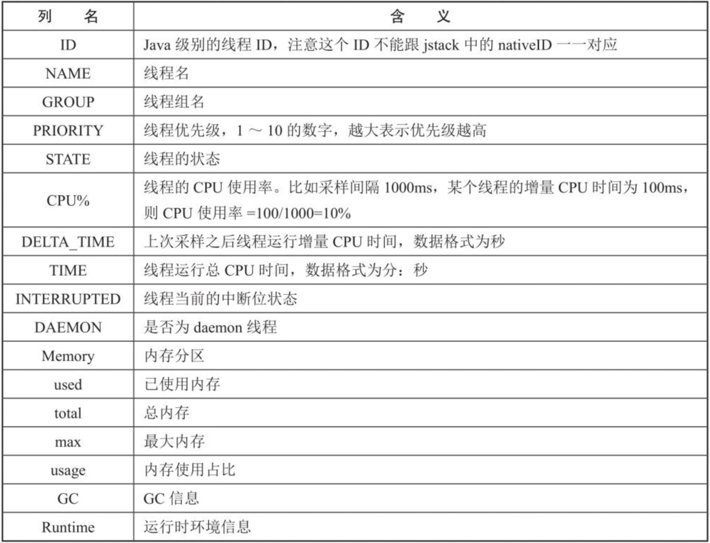

##### thread命令

查看当前JVM的线程堆栈信息。thread命令参数说明如下表所示。

<div style="text-align:center;font-weight:bold;">thread命令参数</div>

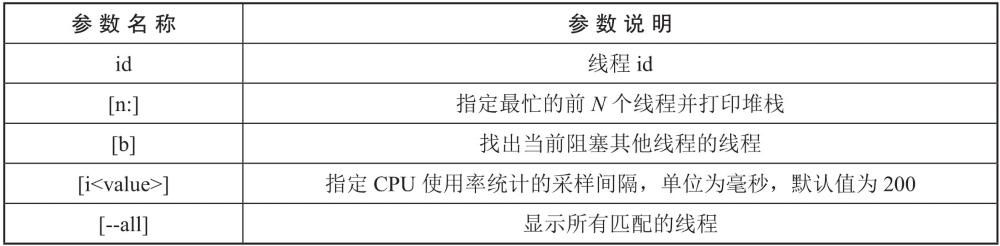

​	例如，有时候发现应用卡住了，通常是由于某个线程拿住了某个锁，并且其他线程都在等待这把锁。为了排查这类问题，Arthas提供了thread –b命令可以一键找出罪魁祸首，如下图所示。

<div style="text-align:center;font-weight:bold;">Arthas thread命令</div>

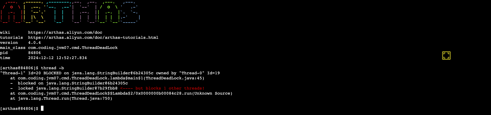

##### JVM命令

​	查看JVM详细的性能数据，由于篇幅原因，只展示部分截图，如下图所示。

<div style="text-align:center;font-weight:bold;">Arthas JVM命令</div>

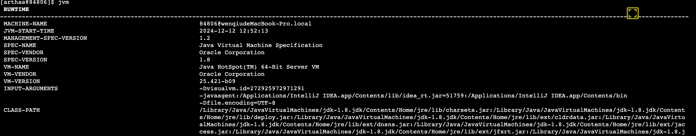

​	Arthas关于JVM相关的命令很多，剩下的命令作者不再一一演示，如下表所示。

<div style="text-align:center;font-weight:bold;">JVM相关命令</div>

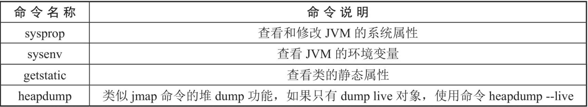

#### 2 class/classloader相关命令

​	与类的字节码文件以及类加载器相关的命令有以下几种，如下表所示。

<div style="text-align:center;font-weight:bold;">字节码相关命令</div>

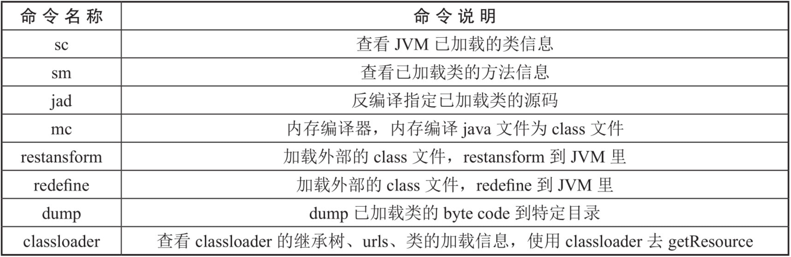

##### sc命令

​	查看JVM已加载的类信息，参数说明如表所示。

<div style="text-align:center;font-weight:bold;">sc命令参数选项</div>

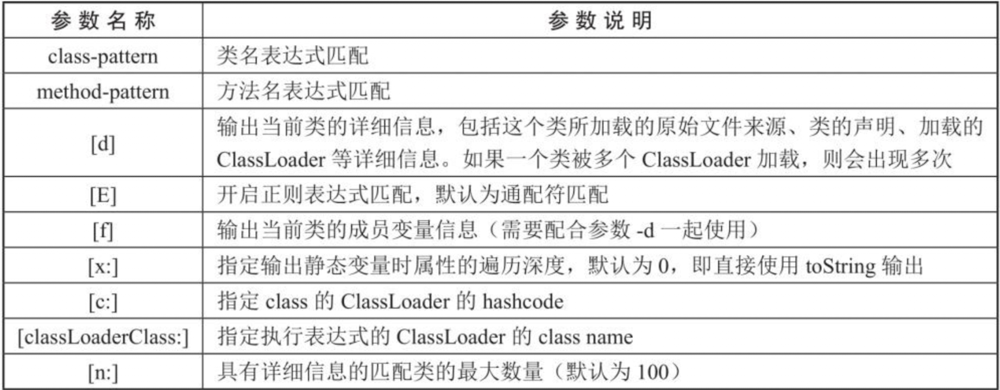

​	class-pattern支持全限定名，如com/test/AAA，也支持com.test.AAA这样的格式，这样从异常堆栈里面把类名复制过来的时候，不需要再手动把“/”替换为“.”了。

​	sc默认开启了子类匹配功能，也就是说所有当前类的子类也会被搜索出来，想要精确地匹配，请打开options disable-sub-class true开关。

​	使用案例如下，模糊查询com.coding.*包下的相关类信息，其中有两个动态类，如下图所示。

<div style="text-align:center;font-weight:bold;">模糊查询类信息</div>


​	打印类的详细信息，如下图所示。

<div style="text-align:center;font-weight:bold;">打印类的详细信息</div>

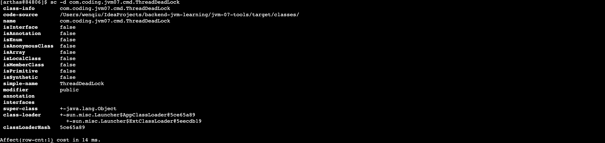

##### sm命令

​	“Search-Method”的简写，这个命令能搜索出所有已经加载了Class信息的方法信息。sm命令只能看到由当前类所声明的方法，父类则无法看到。参数说明如下表所示。

<div style="text-align:center;font-weight:bold;">sm命令参数选项</div>

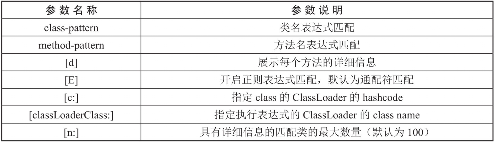

​	使用案例如下，这里注意要写类的全路径，如下图所示。

<div style="text-align:center;font-weight:bold;">打印类的方法信息</div>


##### jad命令

​	反编译指定已加载类的源码，jad命令将JVM中实际运行的类的字节码反编译成Java代码，便于理解业务逻辑。在Arthas Console上，反编译出来的源码是带语法高亮的，阅读更方便。当然，反编译出来的Java代码可能会存在语法错误，但不影响进行阅读理解。参数说明如下表所示。

<div style="text-align:center;font-weight:bold;">jad命令参数选项</div>

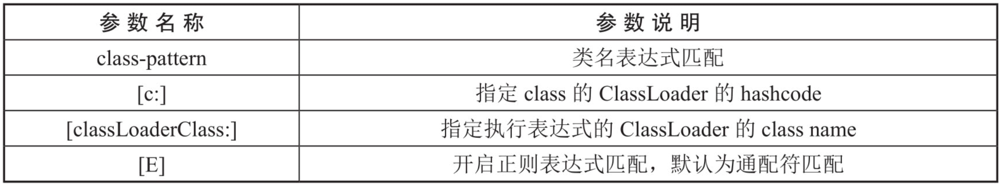

​	下面的案例反编译demo.MathGame，结果如下。

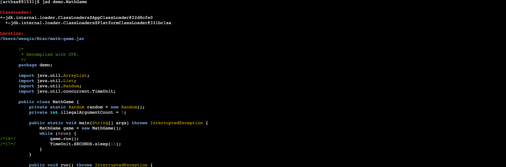

​	反编译时只显示源代码。默认情况下，反编译结果里会带有ClassLoader信息，通过--source-only选项，可以只打印源代码，方便和mc/retransform命令结合使用。

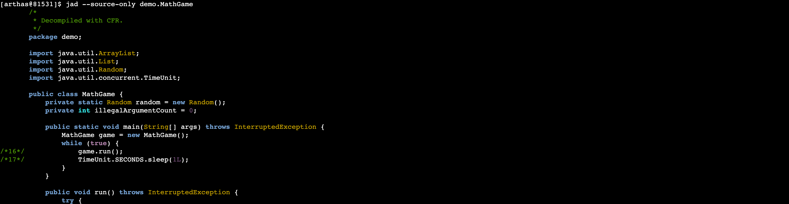

​	反编译指定的方法。

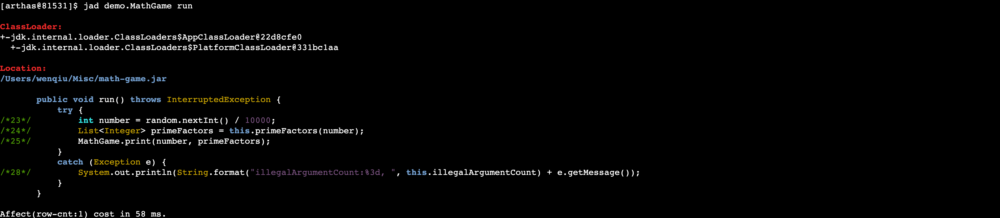

​	反编译时不显示行号(lineNumber)，参数默认值为true，显示指定为false则不打印行号.

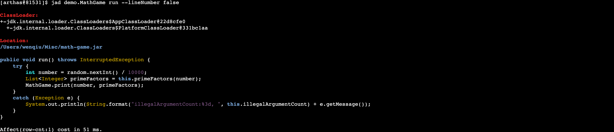

​	反编译时指定ClassLoader，当有多个ClassLoader都加载了这个类时，jad命令会输出对应ClassLoader实例的hashcode，然后只需要重新执行jad命令，并使用参数-c <hashcode>就可以反编译指定ClassLoader加载的那个类了。

​	对于只有唯一实例的ClassLoader，还可以通过--classLoaderClass指定class name，使用起来更加方便。--classLoaderClass的值是ClassLoader的类名，只有匹配到唯一的ClassLoader实例时才能工作，目的是方便输入通用命令，而-c <hashcode>是动态变化的。

##### mc命令

​	Memory Compiler/内存编译器，编译.java文件生成class。

##### redefine命令

​	加载外部的class文件，redefine JVM已加载的类。推荐使用retransform命令代替redefine命令。

##### ClassLoader命令

​	查看ClassLoader的继承树、urls和类加载信息。了解当前系统中有多少类加载器，以及每个加载器加载的类数量，帮助判断是否有类加载器泄漏。可以让指定的ClassLoader去getResources，打印出所有查找到的resources的url，对于ResourceNotFoundException比较有用。参数说明如下表所示。

<div style="text-align:center;font-weight:bold;">ClassLoader命令参数选项</div>

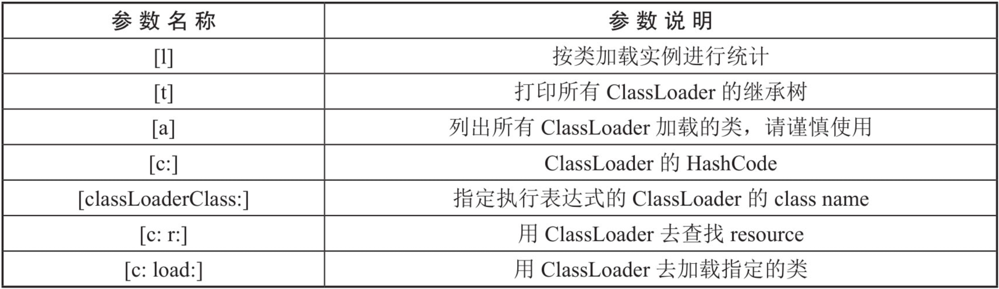

​	使用案例如下，按类加载类型查看统计信息，如下图所示，可以看到AppClassLoader总共加载了4173个类。

<div style="text-align:center;font-weight:bold;">ClassLoader指令</div>

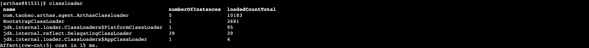

#### 3 monitor/watch/trace相关命令

​	系统监控相关的命令有以下几种，如下表所示。

<div style="text-align:center;font-weight:bold;">系统监控相关命令</div>

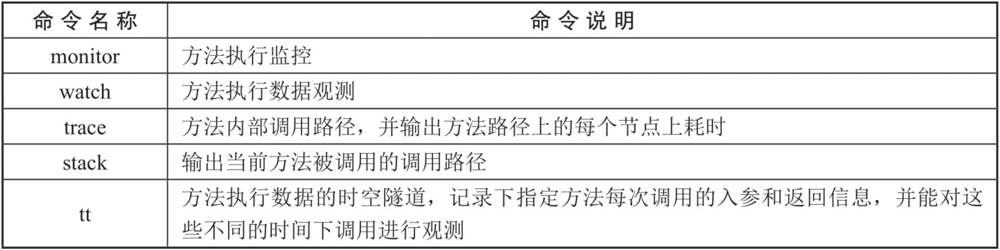

##### monitor命令

​	方法执行监控。对匹配class-pattern/method-pattern的类、方法的调用进行监控，涉及方法的调用次数、执行时间、失败率等。monitor命令是一个非实时返回命令。实时返回命令是输入之后立即返回，而非实时返回的命令，则是不断地等待目标Java进程返回信息，直到用户输入Ctrl+C为止。服务端是以任务的形式在后台跑任务，植入的代码随着任务的中止而不会被执行，所以任务关闭后，不会对原有性能产生太大影响，而且原则上，任何Arthas命令不会引起原有业务逻辑的改变，监控的维度说明如下表所示。

<div style="text-align:center;font-weight:bold;">monitor命令监控项</div>

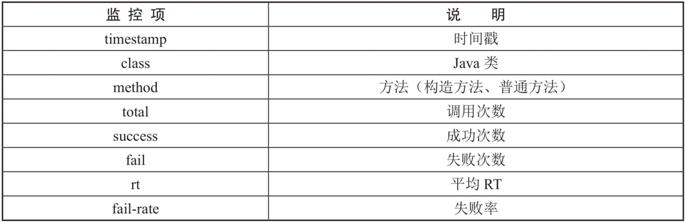

​	参数说明如下表所示，方法拥有一个命名参数[c:]，意思是统计周期(cycle of output)，拥有一个整型的参数值。

<div style="text-align:center;font-weight:bold;">monitor命令参赛选项</div>

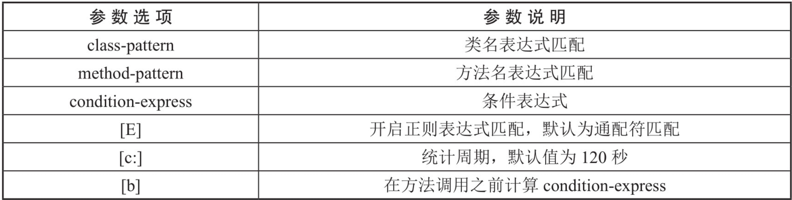

##### watch命令

​	方法执行数据观测，可以方便地观察到指定方法的调用情况。能观察到的范围为返回值、抛出异常、入参，通过编写groovy表达式进行对应变量的查看。watch的参数比较多，主要是因为它能在4个不同的场景观察对象，参数说明如下表所示。

<div style="text-align:center;font-weight:bold;">watch命令参数选项</div>

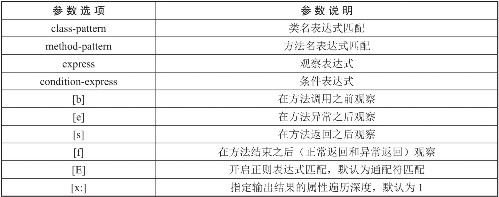

​	这里重点要说明的是观察表达式，观察表达式主要由ognl表达式组成，所以可以这样写“{params,returnObj}”，只要是一个合法的ognl表达式，都能被正常支持。观察的维度也比较多，主要体现在参数advice的数据结构上。Advice参数最主要是封装了通知节点的所有信息。

##### trace命令

​	方法内部调用路径，并输出方法路径上的每个节点上耗时。trace命令能主动搜索class-pattern/method-pattern对应的方法调用路径，渲染和统计整个调用链路上的所有性能开销和追踪调用链路，便于帮助定位和发现因RT高而导致的性能问题缺陷，但其每次只能跟踪一级方法的调用链路。trace在执行的过程中本身是会有一定的性能开销，在统计的报告中并未像JProfiler一样预先减去其自身的统计开销，所以统计出来有些不准，渲染路径上调用的类、方法越多，性能偏差越大，但还是能让各位读者看清一些事情的。参数说明如下表所示。

<div style="text-align:center;font-weight:bold;">trace命令参数选项</div>

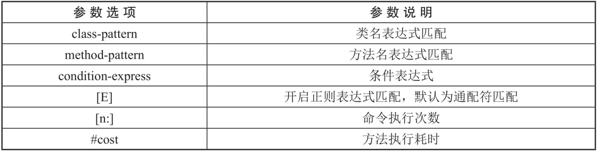

##### stack命令

​	输出当前方法被调用的调用路径。很多时候我们都知道一个方法被执行了，但这个方法被执行的路径非常多，根本不知道这个方法是从哪里被执行了，此时需要的是stack命令。参数说明如下表所示。

<div style="text-align:center;font-weight:bold;">stack命令参数选项</div>

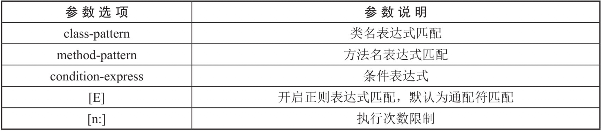

​	使用案例如下，打印run方法的调用栈信息，如下图所示。

<div style="text-align:center;font-weight:bold;">stack命令</div>


##### tt命令

​	TimeTunnel的缩写，方法执行数据的时空隧道，记录下指定方法每次调用的入参和返回信息，并能对这些不同时间下的调用进行观测。watch虽然方便灵活，但需要提前想清楚观察表达式的拼写，这对排查问题而言要求太高，因为很多时候我们并不清楚问题出自何方，只能靠蛛丝马迹进行猜测，这个时候如果能记录下当时方法调用的所有入参和返回值、抛出的异常，会对整个问题的思考与判断非常有帮助。于是，TimeTunnel命令就诞生了。参数说明如下表所示。

<div style="text-align:center;font-weight:bold;">tt命令参数选项</div>


​	如下图所示，打印run方法的每次执行情况。

<div style="text-align:center;font-weight:bold;">tt命令</div>

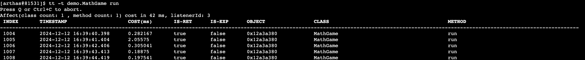

#### 其他命令

​	除了上面作者为大家归类好的一些命令，还有很多其他命令，这里再列举两个供各位读者参考学习。

##### profiler命令

​	支持生成应用热点的火焰图。本质上是通过不断地采样，然后把收集到的采样结果生成火焰图。参数说明如下表所示。

<div style="text-align:center;font-weight:bold;">profiler命令参数选项</div>

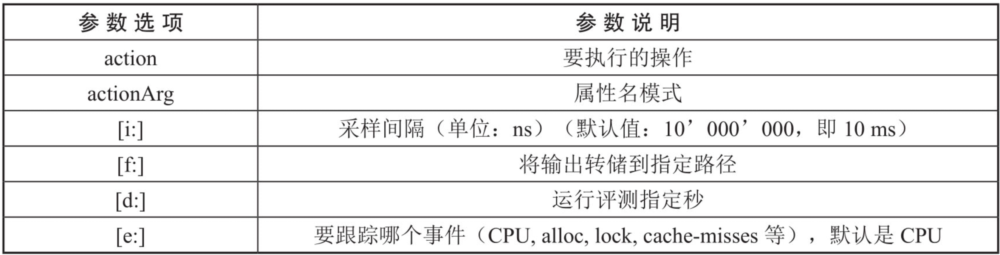

​	案例如下。

①启动profiler，如下所示。

```bash
[arthas@81531]$ profiler start
Profiling started
```

②获取已采集的sample的数量，如下所示。

```bash
[arthas@81531]$ profiler getSamples
4
```

③查看profiler状态

```bash
[arthas@81531]$ profiler status
Profiling is running for 24 seconds
```

④停止profiler，生成svg格式结果，如图22-122所示。

```bash
[arthas@81531]$ profiler stop
OK
profiler output file: /Users/wenqiu/Misc/arthas-output/20241212-164822.html
```

​	默认情况下，生成的结果保存到应用的工作目录下的arthas-output目录。可以通过--file参数来指定输出结果路径。比如，profiler stop --file /tmp/output.svg。可以通过--format来设置生成html格式结果。比如，profiler stop --format html。通过浏览器查看arthas-output下面的profiler结果。

​	默认情况下，Arthas使用3658端口，可以打开http://localhost:3658/arthas-output/查看arthas-output目录下面的profiler结果，如下图所示。

<div style="text-align:center;font-weight:bold;">profiler结果目录</div>


​	单击可以查看具体的结果，如下图所示，这种图称为火焰图。在追求极致性能的场景下，了解程序运行过程中CPU在干什么很重要，火焰图就是一种非常直观的展示CPU在程序整个生命周期过程中时间分配的工具。这个工具可以非常直观地显示出调用栈中的CPU消耗瓶颈，通过x轴横条宽度来度量时间指标，y轴代表线程栈的层次。

<div style="text-align:center;font-weight:bold;">火焰图</div>

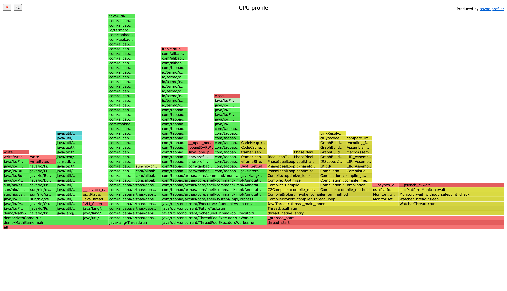

##### options命令

​	全局开关。参数说明如下表所示。

<div style="text-align:center;font-weight:bold;">options命令参数选项</div>

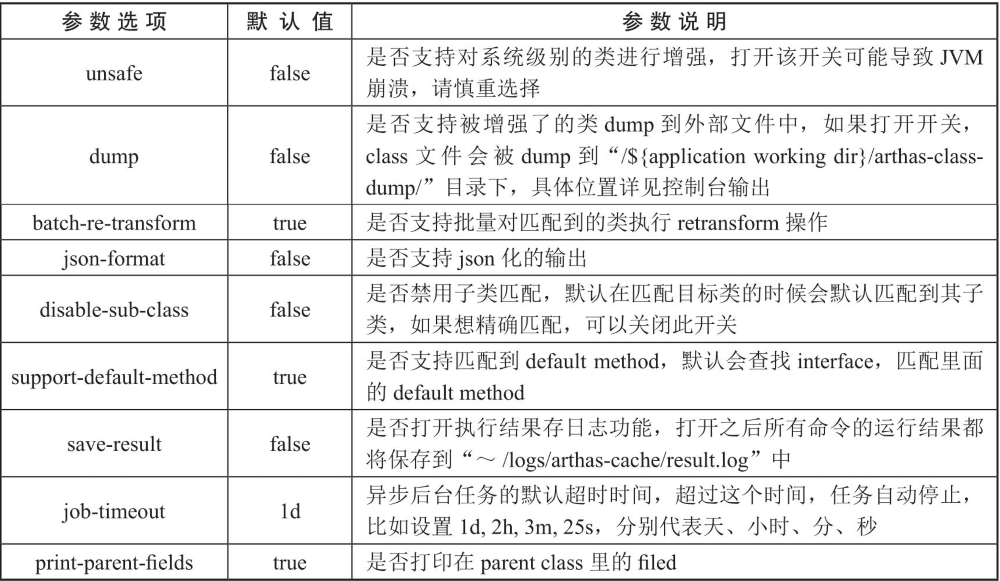

​	案例如下。

①查看所有的options，如下图所示。

<div style="text-align:center;font-weight:bold;">查看所有options</div>

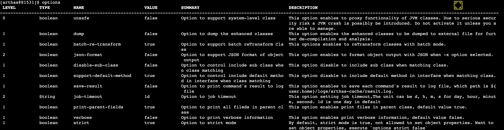

②获取option的值，如下图所示，json-format的值为false。

<div style="text-align:center;font-weight:bold;">获取options的值</div>

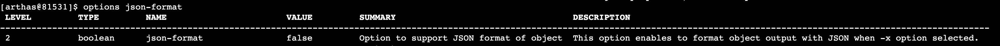

③设置指定的option，例如，打开执行结果存日志功能，输入如下命令即可。


## 22.7 Java Mission Control

### 22.7.1 概述

​	Java Mission Control(JMC)是Java官方提供的性能强劲的工具，它是一个用于对Java应用程序进行管理、监视、概要分析和故障排除的工具套件。它包含一个GUI客户端，以及众多用来收集JVM性能数据的插件，如JMX Console（能够访问用来存放JVM各个子系统运行数据的MXBeans），以及JVM内置的高效profiling工具Java Flight Recorder(JFR)。

​	JMC的另一个优点就是采用取样，而不是传统的代码植入技术，对应用性能的影响非常非常小，完全可以开着JMC来做压测（唯一影响可能是Full GC次数增多）。

​	在Oracle收购Sun之前，Oracle的JRockit虚拟机提供了一款名为JRockit Mission Control的虚拟机诊断工具。在Oracle收购Sun之后，Oracle公司同时拥有了Sun HotSpot和JRockit两款虚拟机。根据Oracle对于Java的战略，在今后的发展中，会将JRockit的优秀特性移植到HotSpot上。其中，一个重要的改进就是在Sun的JDK中加入了JRockit的支持。

### 22.7.2 安装使用

​	Java组件官网：https://docs.oracle.com/en/java/java-components/index.html

​	Java Mission Control官网： https://docs.oracle.com/en/java/java-components/jdk-mission-control/

​	Java Mission Control下载官网：https://www.oracle.com/java/technologies/javase/products-jmc8-downloads.html

​	下载解压完成后，执行包拖入“应用程序”即可。

​	点击打开，如下图所示。

<div style="text-align:center;font-weight:bold;">JMC界面</div>

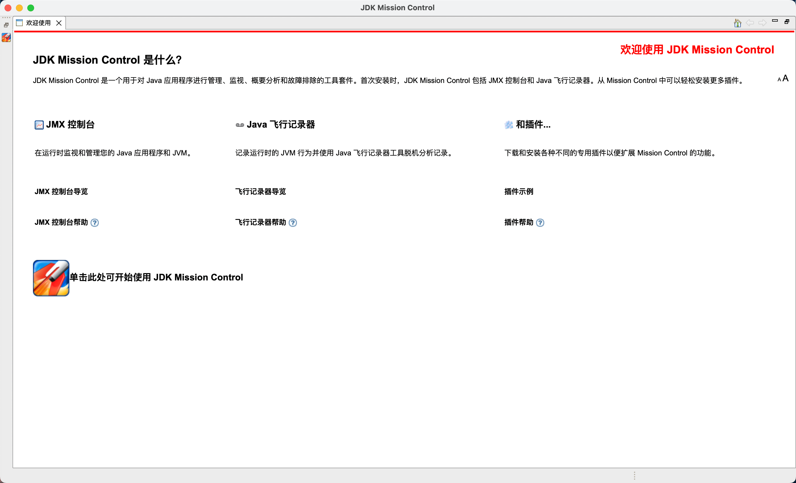

​	如果是远程服务器，使用前要开JMX，使用如下流程即可打开。

​	(1)服务器配置如下。

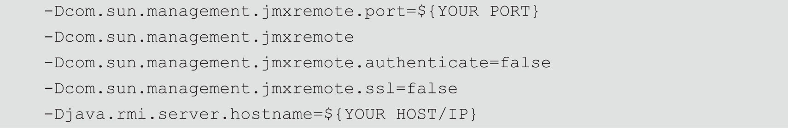

​	(2)客户端单击“文件”→“连接”→“创建新连接”，填入上面JMX参数的host和port。


​	点击”单击此处可开始使用 JDK Mission Control“即可进入主界面，然后右键一个Java进程，选择”启动 JMX 控制台“即可打开控制台。

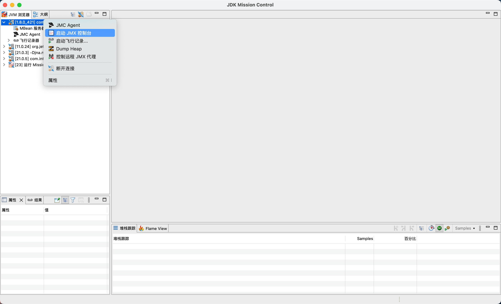

​	“概览”界面如下图所示，Mission Control的界面非常有特色，在默认的界面中，以飞机仪表的视图显示了Java堆使用率、CPU使用率、Live Set和Fragmentation。

<div style="text-align:center;font-weight:bold;">JMC概览界面</div>

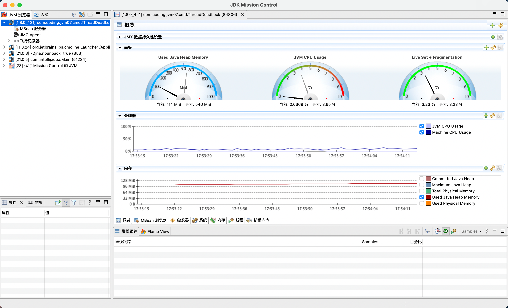

### 22.7.3 功能介绍

​	JMC的一大特点是可以自由设置图表内容。比如，如果希望在飞机仪表面板再增加一个监控项，可以单击右侧的添加按钮“+”，按需添加各种统计图表，如下图所示。

<div style="text-align:center;font-weight:bold;">JMC画板界面</div>


​	例如添加Java堆的空闲内存仪表监控，如下图所示。

<div style="text-align:center;font-weight:bold;">JMC添加仪表监控界面</div>

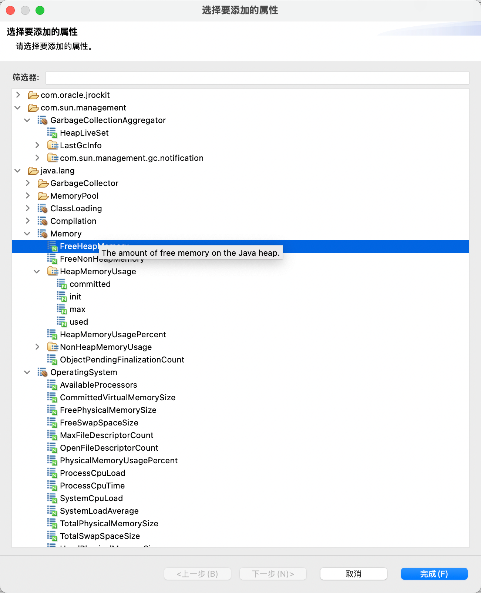

​	单击“完成”按钮，可以看到面板中多了“Free Java Heap Memory”仪表监控，如下图所示。

<div style="text-align:center;font-weight:bold;">JMC添加仪表监控界面</div>


​	JMC概览界面底部选项中的“触发器”选项可以根据CPU、线程等信息，设定一定的阈值来触发报警，如下图所示。

<div style="text-align:center;font-weight:bold;">JMC触发器设置界面</div>

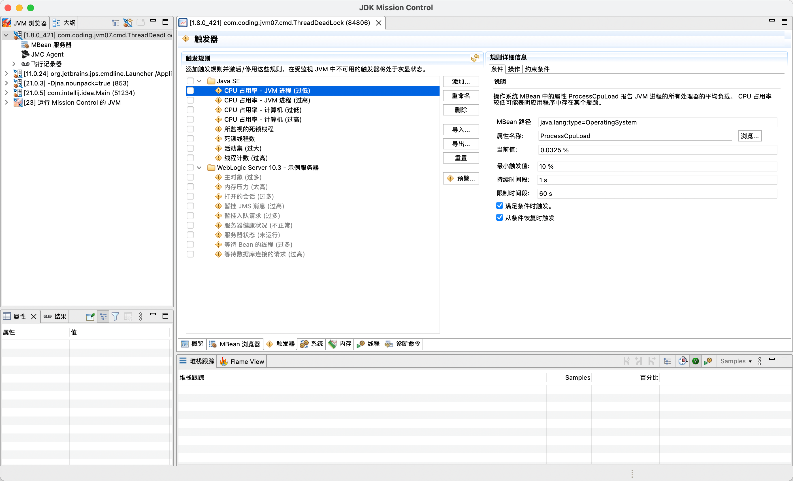

​	“内存”选项提供堆和GC的信息。重点关注GC次数、时间，以及随着GC发生堆的内存变化情况，以此来调整JVM参数，如下图所示。

<div style="text-align:center;font-weight:bold;">JMC内存界面</div>

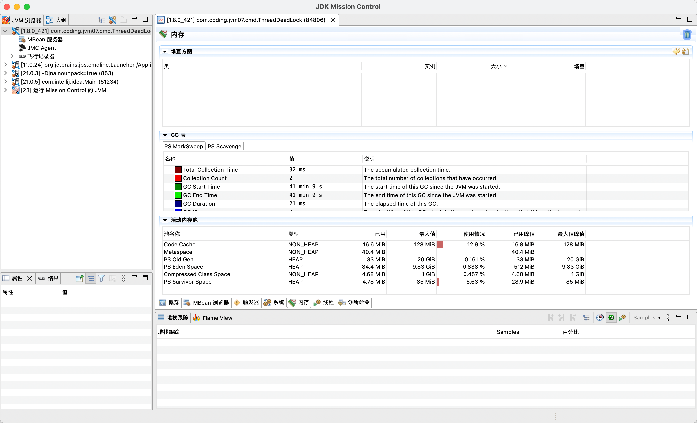

​	“线程”选项可以关注每条线程所占的CPU、死锁情况和线程堆栈信息，如下图所示。

<div style="text-align:center;font-weight:bold;">JMC线程界面</div>

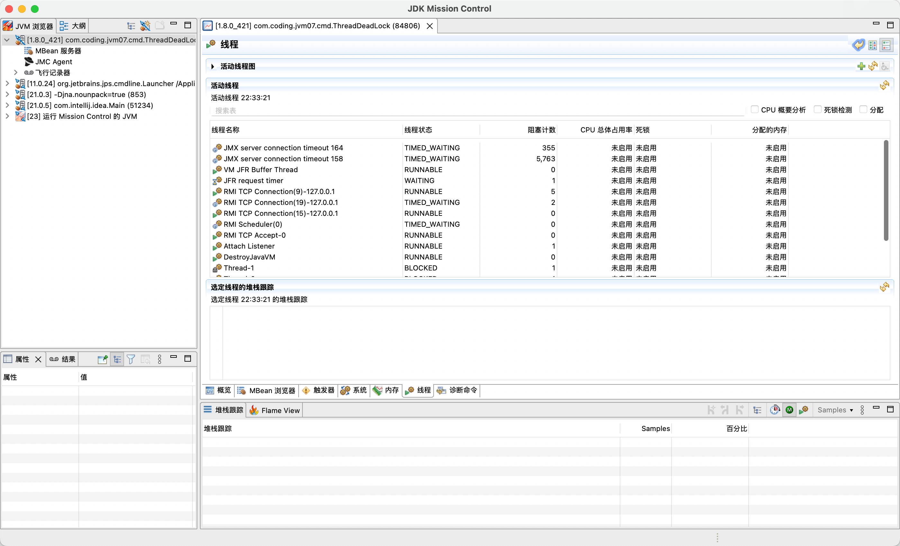

### 22.7.4 Java Flight Recorder介绍

​	Java Flight Recorder(JFR)是JMC的一个组件。JFR能够以极低的性能开销收集JVM的性能数据。自Java11开始，JFR已经开源。但在之前的Java版本，JFR属于商业范畴，需要通过JVM参数-XX:+UnlockCommercialFeatures开启。JFR的性能开销很小，在默认配置下平均低于1%。与其他工具相比，JFR能够直接访问JVM内的数据，并且不会影响JVM的优化。因此，它非常适用于生产环境下满负荷运行的Java程序。

​	JFR和JMC共同创建了一个完整的工具链。JMC可对JFR连续收集低水平和详细的运行时信息进行高效详细的分析。

​	当启用时，JFR将记录运行过程中发生的一系列事件。其中包括Java层面的事件，如线程事件、锁事件，以及JVM内部的事件，如新建对象、垃圾回收和即时编译事件。

​	按照发生时机以及持续时间来划分，JFR的事件共有四种类型。

​	1、瞬时事件(Instant Event)：用户关心的是它们发生与否，例如异常、线程启动事件。

​	2、持续事件(Duration Event)：用户关心的是它们的持续时间，例如垃圾回收事件。

​	3、计时事件(Timed Event)：时长超出指定阈值的持续事件。

​	4、取样事件(Sample Event)：周期性取样的事件。

​	取样事件的其中一个常见例子便是方法抽样(Method Sampling)，即每隔一段时间统计各个线程的栈轨迹。如果在这些抽样取得的栈轨迹中存在一个反复出现的方法，那么就可以推测该方法是否为热点方法。

​	JFR启动方式主要有三种。

​	1、第一种是在运行目标Java程序时添加-XX:StartFlightRecording=参数。

​	比如，下面命令中，JFR将会在JVM启动5s后（对应delay=5s）收集数据，持续20s（对应duration=20s）。当收集完毕后，JFR会将收集得到的数据保存至指定的文件中（对应filename=myrecording.jfr）。settings=profile指定了JFR所收集的事件类型。默认情况下，JFR将加载配置文件JDK/lib/jfr/default.jfc，并识别其中所包含的事件类型。当使用了settings=profile配置时，JFR将加载配置文件JDK/lib/jfr/default.jfc，并识别其中所包含的事件类型。该配置文件所包含的事件类型要多于默认的default.jfc，因此性能开销也要大一些（约为2%）。default.jfc以及profile.jfc均为XML文件。

```bash
-XX:StartFlightRecording=delay=5s,duration=20s,filename=myrecording.jfr,settings=profile
```

​	由于JFR将持续收集数据，如果不加以限制，那么JFR可能会填满硬盘的所有空间。因此，我们有必要对这种模式下所收集的数据进行限制。比如，在这条命令中，maxage=10m指的是仅保留10分钟以内的事件，maxsize=100m指的是仅保留100MB以内的事件。一旦所收集的事件达到其中任意一个限制，JFR便会开始清除不合规格的事件。然而，为了保持较小的性能开销，JFR并不会频繁地校验这两个限制。因此，在实践过程中往往会发现指定文件的大小超出限制，或者文件中所存储事件的时间超出限制。最后一个参数name就是一个标签，当同一进程中存在多个JFR数据收集操作时，可以通过该标签来辨别。

```bash
-XX:StartFlightRecording=maxage=10m,maxsize=100m,name=SomeLabel
```

​	2、通过jcmd来让JFR开始收集数据、停止收集数据，或者保存所收集的数据，对应的子命令分别为JFR.start、JFR.stop，以及JFR.dump。

```bash
$ jcmd <PID>JFR.start settings=profile maxage=10m maxsize=150mname=SomeLabel
```

​	上述命令运行过后，目标进程中的JFR已经开始收集数据。此时，可以通过下述命令来导出已经收集到的数据。

```bash
$ jcmd <PID>JFR.dump name=SomeLabel filename=myrecording.jfr
```

​	最后，可以通过下述命令关闭目标进程中的JFR。

```bash
$ jcmd <PID>JFR.stop name=SomeLabel
```

​	3、通过JMC的JFR组件来启动，如下图所示。

<div style="text-align:center;font-weight:bold;">启动JFR组件界面</div>

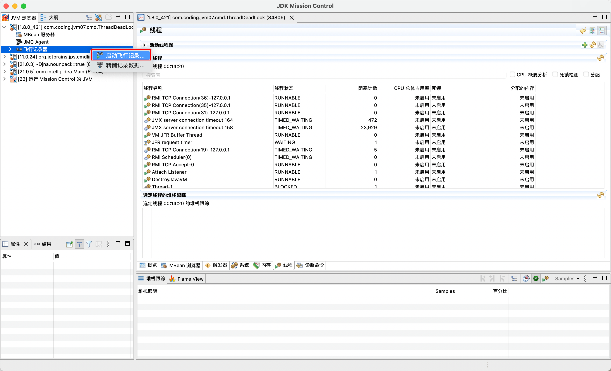

​	通过JFR取样分析需要先在程序运行前添加JVM参数，参数如下。

```bash
# JDK9及更高版本
-XX:+UnlockCommercialFeatures -XX:StartFlightRecording
# JDK7u4及更高版本：
-XX:+UnlockCommercialFeatures -XX:+FlightRecorder -XX:FlightRecorderOptions=defaultrecording=true
```

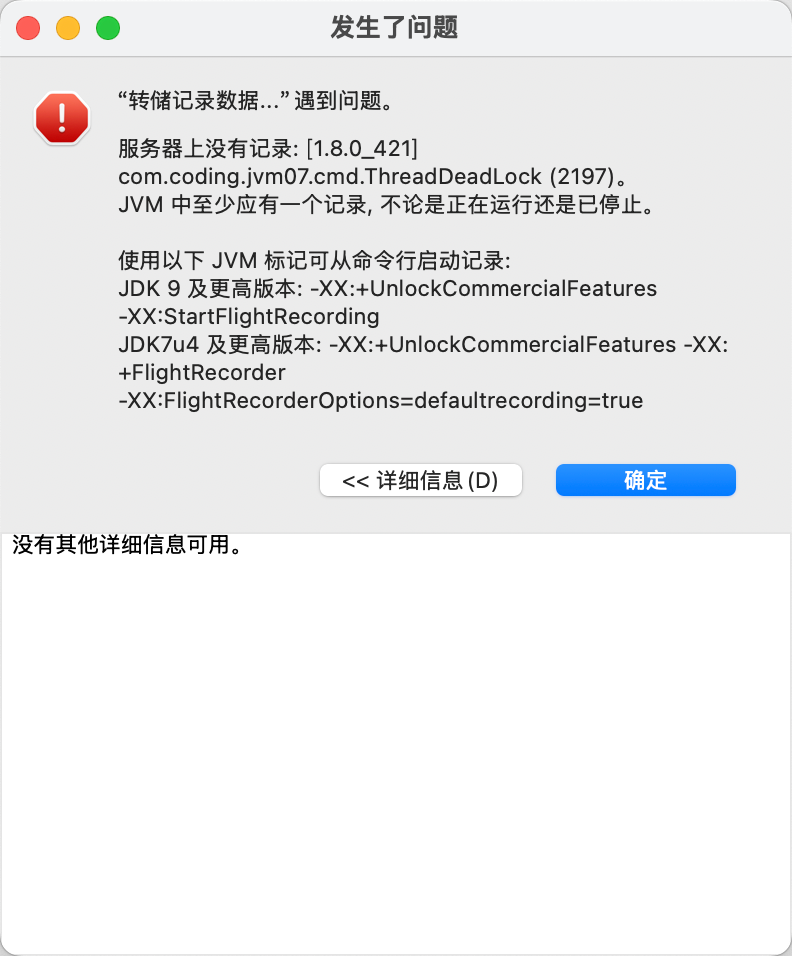

​	否则将会报以下问题，如下图所示。

<div style="text-align:center;font-weight:bold;">问题提示界面</div>


​	当右击选择弹出菜单中的“Start Flight Recording…”或者直接双击，JMC便会弹出另一个窗口，用来配置JFR的启动参数，如下图所示。

<div style="text-align:center;font-weight:bold;">配置JFR的启动参数</div>

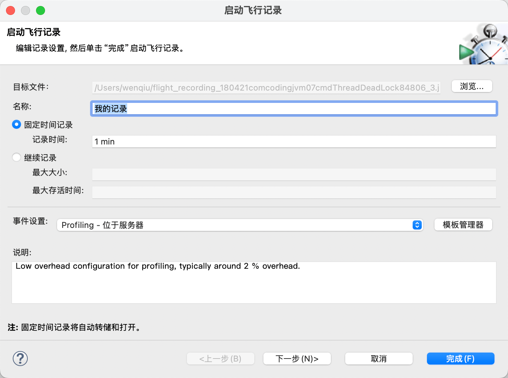

​	这里的配置参数与前两种启动JFR的方式并无二致，同样也包括标签名、收集数据的持续时间、缓存事件的时间及空间限制，以及配置所要监控事件的Event settings（这里对应前两种启动方式的settings=default|profile）。JMC提供了两个选择：Continuous和Profiling，分别对应$JDK/lib/jfr/里的default.jfc和profile.jfc。

​	取样时间默认1分钟，可自行按需调整，事件设置选Profiling，然后可以设置取样Profile哪些信息。比如加上对象数量的统计：“Java Virtual Machine”→“GC”→“Detailed”→“Object Count/Object Count after GC”，如下图所示，勾选右侧“已启用”。

<div style="text-align:center;font-weight:bold;">设置取样指标</div>


​	方法调用采样的间隔从10ms改为1ms，注意不能低于1ms，否则会影响性能。选择“Java Virtual Machine”→“Profiling”→“Method Profiling Sample/Method Sampling Information”选项，如下图所示。

<div style="text-align:center;font-weight:bold;">设置采样间隔时间</div>

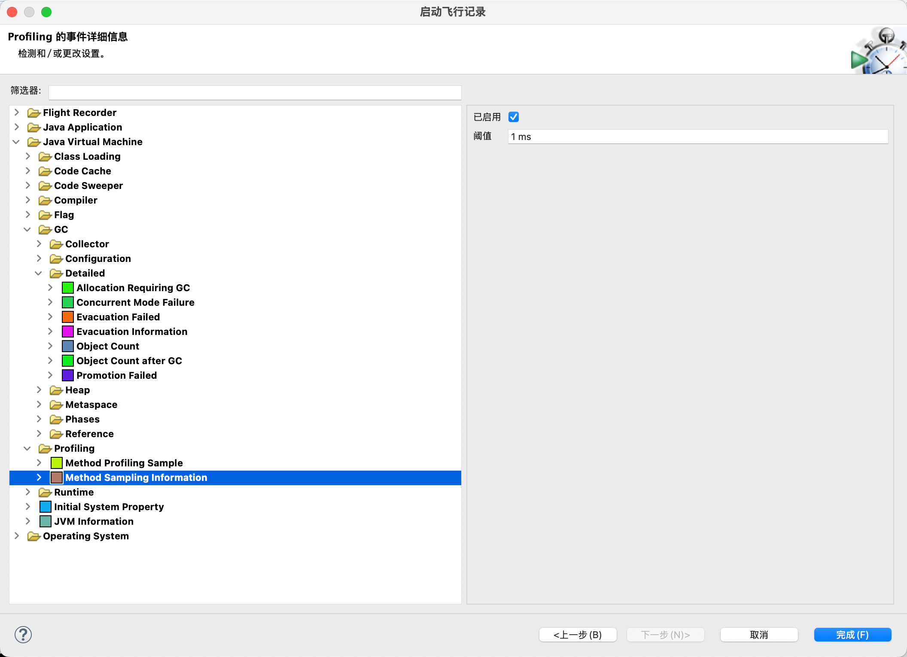

​	然后就开始Profile，到时间后Profile结束，会自动把记录下载回来，在JMC中展示，如下图所示。

<div style="text-align:center;font-weight:bold;">采样记录展示</div>


​	从展示信息中，我们大致可以读到内存、CPU、代码、线程和I/O等比较重要的信息展示。它可以显示系统中的热点方法和占用的时间，下图显示了占用CPU时间最多的方法调用树信息。

## 22.8 其他工具

### 22.8.1 TProfiler

​	TProfiler的下载： https://github.com/alibaba/TProfiler/wiki

​	阿里开源工具TProfiler可以用来定位性能代码，解决GC过于频繁的性能瓶颈，并最终将系统TPS再提升。TProfiler的下载地址可扫码获取。

​	TProfiler配置部署、远程操作、日志阅读都不太复杂，但是其却能够起到一针见血、立竿见影的效果，帮助解决GC过于频繁的性能瓶颈。

​	TProfiler最重要的特性就是能够统计出指定时间段内JVM的top method，这些top method极有可能就是造成JVM性能瓶颈的元凶。这是其他大多数JVM调优工具所不具备的，包括JRockit Mission Control。JRockit开发人员Marcus Hirt曾明确指出JRMC并不支持TOP方法的统计。

### 22.8.2 Java运行时追踪工具BTrace

​	BTrace是SUN Kenai云计算开发平台下的一个开源项目，旨在为Java提供安全可靠的动态跟踪分析工具，是一个Java平台的安全的动态追踪工具，可以用来动态地追踪一个运行的Java程序。BTrace通过动态调整目标应用程序的类，从而注入跟踪代码，我们称这种方法为字节码跟踪。

​	另外还有其他工具可以供各位读者参考使用，例如HouseMD（该项目已经停止开发）、Greys-Anatomy（个人开发）、Byteman（JBoss出品）、YourKit、JProbe，以及Spring Insight等。

# 第23章 JVM运行时参数

​	熟悉JVM参数对于系统调优是非常重要的。比如一个高流量的延迟的电子交易平台，它要求的响应时间都是毫秒级的。要获得适合的参数组合需要大量的分析和不断地尝试，更依赖交易系统的特性。

​	在前面的章节中，多多少少都使用到了JVM参数，比如配置堆的初始化大小、堆空间最大值，以及输出日志信息等参数。但是并没有很详细地介绍JVM运行时参数都有哪些以及它们有哪些分类。本章将主要讲解JVM的运行时参数的分类及其使用方式。

## 23.1 JVM参数选项类型

​	JVM参数总体上来说分为三大类，分别是标准参数选项、非标准参数选项和非稳定参数选项，下面分别详细介绍三大参数类型。

### 23.1.1 标准参数选项

​	所有的JVM都必须实现标准参数的功能，而且向后兼容。标准参数是相对比较稳定的参数，后续版本基本不会发生变化，参数以“-”开头，例如读者常见的“-version”参数就是标准参数。获取标准参数的命令是在终端输入“java”或者“java --help”命令即可，获取结果如下表所示。

<div style="text-align:center;font-weight:bold;">标准化参数选项</div>


​	需要注意的是HotSpot虚拟机的两种模式，分别是Server和Client，分别通过-server和-client模式设置。

​	在32位Windows系统上，默认使用Client类型的JVM。要想使用Server模式，则机器配置至少有2个以上的CPU和2GB以上的物理内存。Client模式适用于对内存要求较小的桌面应用程序，默认使用Serial串行垃圾收集器。

​	64位机器上只支持Server模式的JVM，适用于需要大内存的应用程序，默认使用并行垃圾收集器。

​	关于server和client的官网介绍为：

​	https://docs.oracle.com/javase/8/docs/technotes/guides/vm/server-class.html

### 23.1.2 非标准参数选项

​	我们知道JVM可以有不同的生产厂商，非标准参数的意思是并不保证所有JVM都对非标准参数进行实现，即只能被部分JVM识别且不保证向后兼容，功能相对来说也是比较稳定的，但是后续版本有可能会变更，参数以“-X”开头。可以用java -X来检索非标准参数，不能保证所有参数都可以被检索出来，例如其中就没有-Xcomp。下表列出了常见的非标准参数。

<div style="text-align:center;font-weight:bold;">非标准参数</div>

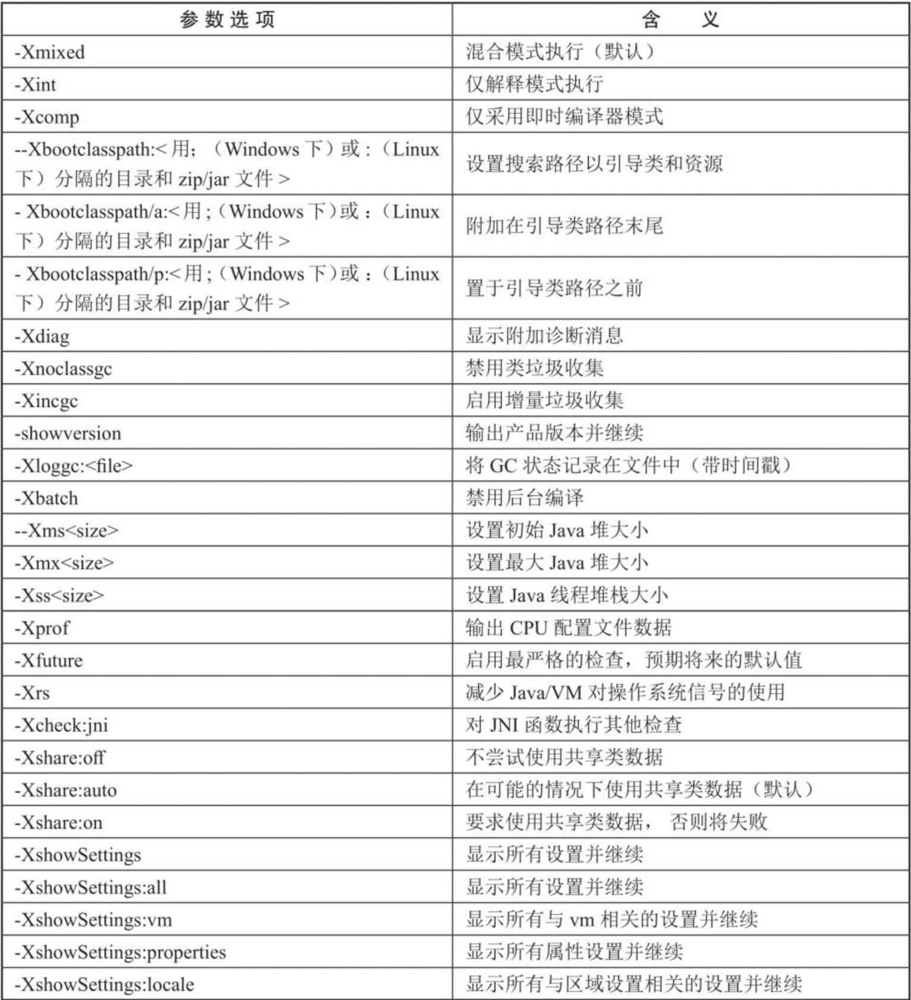

​	特别注意的是-Xint参数表示禁用JIT，所有的字节码都被解释执行，这个模式下系统启动最快，但是执行效率最低。-Xcomp表示JVM采用编译模式，代码执行很快，但是启动会比较慢。-Xmixed表示JVM采用混合模式，启动速度较快，让JIT根据程序运行的情况，对热点代码实行检测和编译。

​	虽然-Xms、-Xmx和-Xss三个参数归属于-X参数选项，但是这三个参数的执行效果分别等同于非稳定参数中的-XX:InitialHeapSize、-XX:MaxHeapSize和-XX:ThreadStackSize。

​	非标准选项：https://docs.oracle.com/javase/8/docs/technotes/tools/unix/java.html#BABHDABI

| 参数选项名                                                   | 含义                                                         |
| ------------------------------------------------------------ | ------------------------------------------------------------ |
| <span style="color:red;font-weight:bold;">-Xmixed</span>     | 混合模式执行 (默认)                                          |
| <span style="color:red;font-weight:bold;">-Xint</span>       | 仅解释模式执行                                               |
| <span style="color:red;font-weight:bold;">-Xcomp</span>      | 仅采用即时编译器模式                                         |
| -Xbootclasspath:<用 ; 分隔的目录和 zip/jar 文件>             | 设置搜索路径以引导类和资源                                   |
| -Xbootclasspath/a:<用 ; 分隔的目录和 zip/jar 文件>           | 附加在引导类路径末尾                                         |
| -Xbootclasspath/p:<用 ; 分隔的目录和 zip/jar 文件>           | 置于引导类路径之前                                           |
| -Xdiag                                                       | 显示附加诊断消息                                             |
| -Xnoclassgc                                                  | 禁用类垃圾收集                                               |
| -Xincgc                                                      | 启用增量垃圾收集                                             |
| -Xloggc:<file>                                               | 将 GC 状态记录在文件中 (带时间戳)                            |
| -Xbatch                                                      | 禁用后台编译                                                 |
| <span style="color:blue;font-weight:bold;">`-Xms<size>`</span> | 设置初始 Java 堆大小，等价于 -XX:InitialHeapSize             |
| <span style="color:blue;font-weight:bold;">`-Xmx<size>`</span> | 设置最大 Java 堆大小，等价于 -XX:MaxHeapSize                 |
| <span style="color:blue;font-weight:bold;">`-Xss<size>`</span> | 设置 Java 线程堆栈大小，等价于 -XX:ThreadStackSize           |
| <span style="color:blue;font-weight:bold;">`-Xmn<size>`</span> | 设置新生代内存，比-XX:NewRatio优先级高，等价于 -XX:NewSize 和 -XX:MaxNewSize |
| -Xprof                                                       | 输出 cpu 配置文件数据                                        |
| -Xfuture                                                     | 启用最严格的检查, 预期将来的默认值                           |
| -Xrs                                                         | 减少 Java/VM 对操作系统信号的使用 (请参阅文档)               |
| -Xcheck:jni                                                  | 对 JNI 函数执行其他检查                                      |
| -Xshare:off                                                  | 不尝试使用共享类数据                                         |
| -Xshare:auto                                                 | 在可能的情况下使用共享类数据 (默认)                          |
| -Xshare:on                                                   | 要求使用共享类数据, 否则将失败。                             |
| -XshowSettings                                               | 显示所有设置并继续                                           |
| -XshowSettings:all                                           | 显示所有设置并继续                                           |
| -XshowSettings:vm                                            | 显示所有与 vm 相关的设置并继续                               |
| -XshowSettings:properties                                    | 显示所有属性设置并继续                                       |
| -XshowSettings:locale                                        | 显示所有与区域设置相关的设置并继续                           |

### 23.1.3 非稳定参数选项

​	非稳定参数选项以-XX开头，也属于非标准参数，相对不稳定，在JVM中是不健壮的，也可能会突然直接取消某项参数，主要用于JVM调优和调试。但是这些参数中有很多参数对于JVM调优很有用处，所以也是使用最多的参数选项。

​	-XX参数又分为布尔类型参数和非布尔类型参数。布尔类型的格式为`-XX:+/-<option>`,`-XX:+<option>`表示启用option,`-XX:-<option>`表示禁用option。例如-XX:+UseParallelGC表示开启ParallelGC垃圾收集器，-XX:-UseParallelGC表示关闭ParallelGC垃圾收集器，有些参数是默认开启的，调优的时候可以考虑关闭某些参数。

​	非布尔类型的参数也可以理解为Key-Value型的参数，可以分为数值类型和非数值类型。数值类型格式为`-XX:<option>=<number>`,number可以带上单位（k、K表示千字节，m、M表示兆，或者使用更大的内存单位g、G），例如-XX:NewSize=1024m表示设置新生代初始大小为1024MB。非数值类型格式为`-XX:<option>=<String>`，例如-XX:HeapDumpPath=/usr/local/heapdump.hprof用来指定heap转存文件的存储路径。

​	通过“java -XX:+PrintFlagsFinal”命令可以查看所有的-XX参数，如下图所示，篇幅原因截取部分截图。

<div style="text-align:center;font-weight:bold;">XX参数选项</div>


​	上图倒数第二列参数的取值有多种，如下所示。

(1)product表示该类型参数是官方支持的，属于JVM内部选项。
(2)rw表示可动态写入。
(3)C1表示Client JIT编译器。
(4)C2表示Server JIT编译器。
(5)pd表示平台独立。
(6)lp64表示仅支持64位JVM。
(7)manageable表示可以运行时修改。
(8)diagnostic表示用于JVM调试。
(9)experimental表示非官方支持的参数。

​	默认不包含diagnostic和experimental两种类型，想要包含该类型的参数可以配合参数-XX:+UnlockDiagnosticVMOptions和-XX:+UnlockExperimentalVMOptions使用，例如java -XX:+PrintFlagsFinal -XX:+UnlockDiagnosticVMOptions命令结果如下（部分结果），包含了diagnostic类型的参数。同理可以添加-XX:+UnlockExperimentalVMOptions参数用于包含experimental类型的参数，不再演示。


- 特点：

  - 非标准化参数
  - <span style="color:red;font-weight:bold;">使用的最多的参数类型</span>
  - 这类选项属于实现性，不稳定
  - <span style="color:red;font-weight:bold;">以 -XX 开头</span>

- 作用：用于开发和调试JVM

- 分类：

  - Boolean类型格式
    - `-XX:+<option>` 表示启用option属性
    - `-XX:-<option>` 表示禁用option属性
    - 说明：因为有的指令默认是开启的，所以可以使用`-`关闭
    - 举例
      - -XX:+UseParallelGC 选择垃圾收集器为并行收集器
      - -XX:+UseG1GC 表示启用G1收集器
      - -XX:+UseAdaptiveSizePolicy 自动选择年轻代区大小和相应的Survivor区比例

  - 非Boolean类型格式（key-value类型）
    - 子类型1：数值型格式`-XX:<option>=<number>`
      - number表示数值，number可以带上单位，比如：'m'、'M'表示兆，'k'、'K'表示KB，'g'、'G'表示g（例如32K跟32768是一样的效果）
      - 例如：
        - -XX:NewSize=1024m 表示设置新生代初识大小为1024兆
        - -XX:MaxGCPauseMillis=500 表示设置GC停顿时间：500毫秒
        - -XX:GCTimeRatio=19 表示设置吞吐量（默认99），表示收集器执行时间占总耗时的1/(1+N)，N默认99.
        - -XX:NewRatio=2 表示新生代与老年代的比例
    - 子类型2：非数值型格式`-XX:<name>=<string>`
      - 例如：
        - -XX:HeapDumpPath=/usr/local/heapdump.hprof 用来指定heap转存文件的存储路径

- 特别地：

  - -XX:+PrintFlagsFinal
    - 输出所有参数的名称和默认值
    - 默认不包括 Diagnostic 和 Experimental 的参数
    - 可以配合 -XX:+UnlockDiagnosticVMOptions 和 -XX:UnlockExperimentalVMOption 使用

## 23.2 添加JVM参数的方式

​	在工作中经常需要配置JVM参数，一般有以下几种方式。

### 23.2.1 Eclipse界面配置

​	单击鼠标右键选中目标工程，选择“Run As”→“Run Configurations”→“Arguments”选项。在VM arguments里面填入需要的JVM参数即可。例如填入-Xmx256m，这样就可以设置运行时最大内存为256MB,Eclipse配置参数如下图所示。

<div style="text-align:center;font-weight:bold;">EclipseJVM参数配置</div>

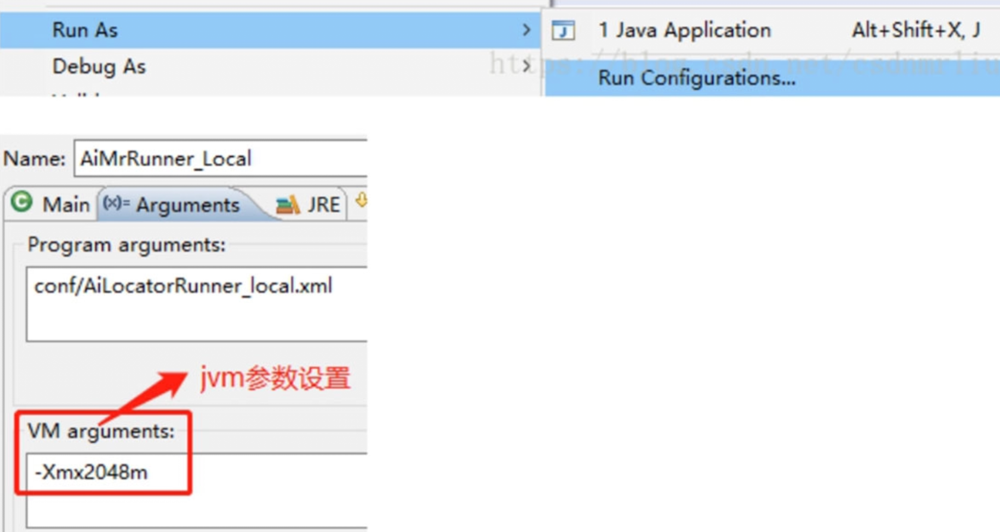

### 23.2.2 IDEA界面配置

​	鼠标右键选中目标工程，选择“Run”→“Edit Configurations”选项，如图23-3所示。选中要添加JVM参数的Application，然后在Configuration里面的VM options中输入想要添加的JVM参数即可，如图23-4所示，例如填入-Xmx256m，这样就可以设置运行时最大内存为256MB。

<div style="text-align:center;font-weight:bold;">IDEA参赛配置1</div>

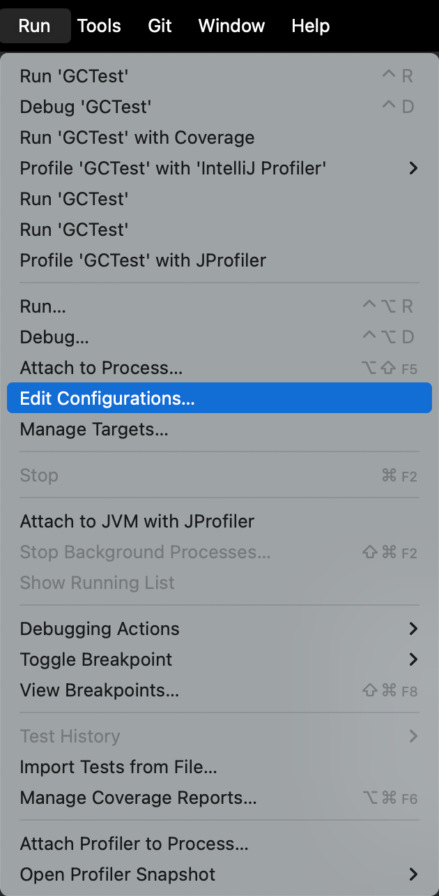

<div style="text-align:center;font-weight:bold;">IDEA参赛配置2</div>

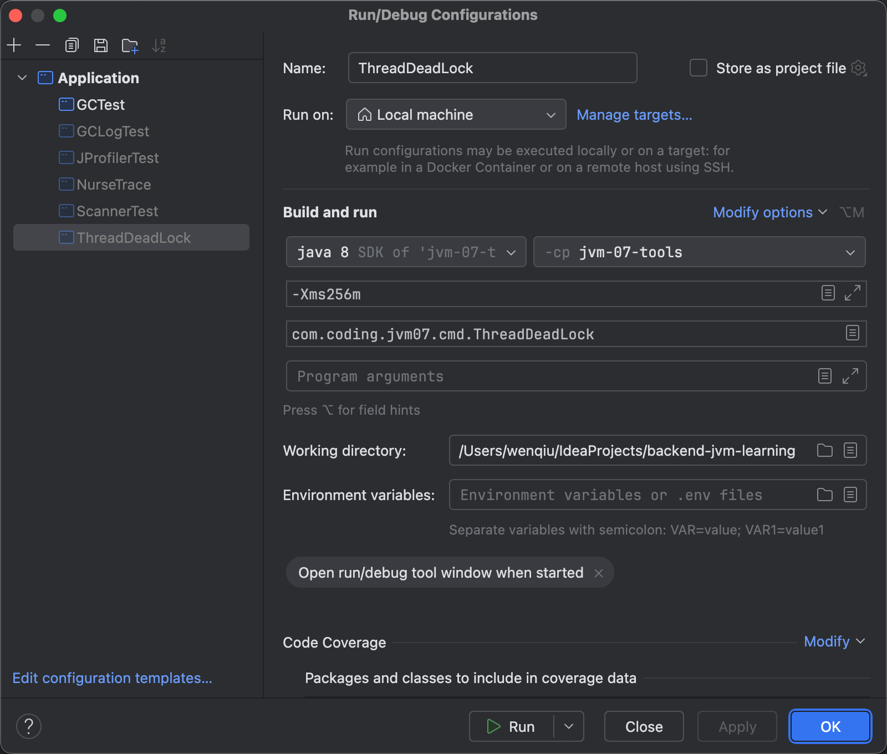

### 23.2.3 通过java命令配置

​	通过java命令运行class或者jar包的时候也可以添加JVM参数，一般多用于工程测试，如下所示。

```bash
# 运行jar包时添加JVM参赛
% java -Xms128m -Xmx256m -jar demo.jar
% java -Xms50m -Xmx50m -XX:+PrintGCDetails -XX:+PrintGCTimeStamps -jar demo.jar
# 运行类的字节码文件时添加JVM参赛
% java -Xms128m -Xmx256m 类名
```

### 23.2.4 通过web服务器配置

​	Linux系统下可以在tomcat/bin/catalina.sh中添加如下JVM配置。

```bash
JAVA_OPTS="-Xms512M -Xmx1024M"
```

​	Windows系统下可以在catalina.bat中添加如下配置。

```bash
set "JAVA_OPTS=-Xms512M -Xmx1024M"
```

### 22.2.5 通过jinfo命令配置

​	jinfo命令在第20章已经详细讲过，这里不再赘述。

## 23.3 常用JVM参数选项

​	JVM参数选项那么多，在工作中有很多参数是很少用到的，这里汇总了几大常用的参数分类，如下所示。

### 23.3.1 打印设置的XX选项及值

​	输出设置的-XX参数以及参数值的参数选项如下表所示。

<div style="text-align:center;font-weight:bold;">输出设置的-XX参数以及参数值的参数选项</div>

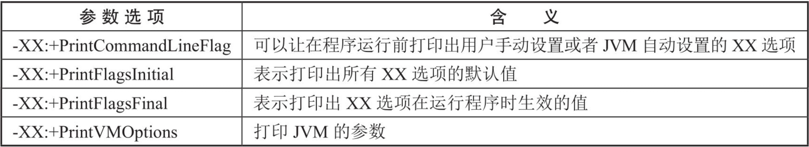

### 23.3.2 堆、栈、方法区等内存大小设置

​	堆、栈、方法区等内存大小设置的参数选项如下表所示。

<div style="text-align:center;font-weight:bold;">堆、栈、方法区等内存大小设置的参数选项</div>

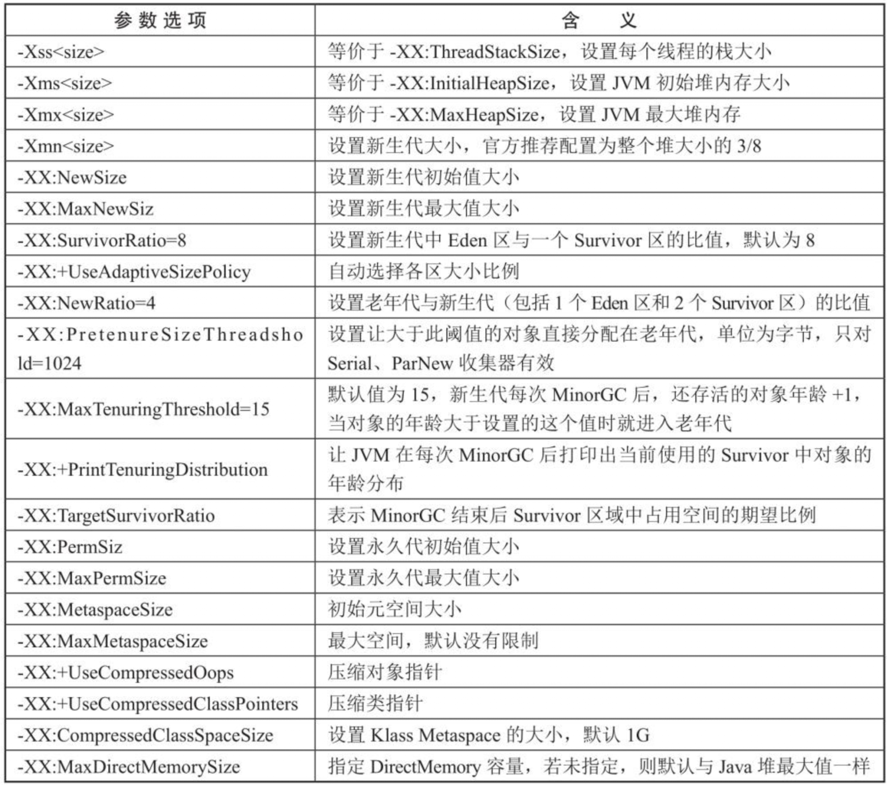

- 堆内存参数

| 参数                            | 作用                                                         |
| ------------------------------- | ------------------------------------------------------------ |
| -Xms3550m                       | 等价于-XX:InitialHeapSize，设置JVM初始堆内存为3550M          |
| -Xmx3550m                       | 等价于-XX:MaxHeapSize，设置JVM最大堆内存为3550M              |
| -Xmn2g                          | 等价于-XX:-XX:NewSize,设置年轻代大小为2G，官方推荐配置为整个堆大小的3/8 |
| -XX:NewSize=1024m               | 设置年轻代初始值为1024M                                      |
| -XX:MaxNewSize=1024m            | 设置年轻代最大值为1024M                                      |
| -XX:SurvivorRatio=8             | 设置年轻代中Eden区与一个Survivor区的比值，默认为8            |
| -XX:+UseAdaptiveSizePolicy      | 自动选择各区大小比例，默认开启的                             |
| -XX:NewRatio=4                  | 设置老年代与年轻代（包括1个Eden和2个Survivor区）的比值；默认值2 |
| -XX:PretenureSizeThreshold=1024 | 设置让大于此阈值的对象直接分配在老年代，单位为字节；<br />仅对Serial、ParNew收集器有效。 |
| -XX:MaxTenuringThreshold=15     | 默认值为15；<br />新生代每次MinorGC后，还存活的对象年龄+1，<br />当对象的年龄大于设置的这个值时就进入老年代。 |
| -XX:+PrintTenuringDistribution  | 让JVM在每次MinorGC后打印出当前使用的Survivor中对象的年龄分布 |
| -XX:TargetSurvivorRatio         | 表示MinorGC结束后Survivor区域中占用空间的期望比例            |

- 栈

| 参数     | 作用                                                   |
| -------- | ------------------------------------------------------ |
| -Xss128k | 设置每个线程的栈大小为128k，等价于 -XX:ThreadStackSize |

- 方法区

  - 永久代

    | 参数                 | 作用                   |
    | -------------------- | ---------------------- |
    | -XX:PermSize=256m    | 设置永久代初始值为256M |
    | -XX:MaxPermSize=256m | 设置永久代最大值为256M |

  - 元空间

    | 参数                            | 作用                              |
    | ------------------------------- | --------------------------------- |
    | -XX:MetaspaceSize               | 初始空间大小                      |
    | -XX:MaxMetaspaceSize            | 最大空间，默认没有限制            |
    | -XX:+UseCompressedOops          | 压缩对象指针                      |
    | -XX:+UseCompressedClassPointers | 压缩类指针                        |
    | -XX:CompressedClassSpaceSize    | 设置Klass Metaspace的大小，默认1G |

  - 直接内存

    | 参数                    | 作用         |
    | ----------------------- | ------------ |
    | -XX:MaxDirectMemorySize | 直接内存大小 |

### 23.3.3 OutOfMemory相关选项

​	OutOfMemory相关的参数选项如下表所示。

<div style="text-align:center;font-weight:bold;">OutOfMemory相关的参数选项</div>


​	XX:OnOutOfMemoryError表示当发生内存溢出的时候，还可以让JVM调用任一个shell脚本。大多数时候，内存溢出并不会导致整个应用都挂掉，但是最好还是把应用重启一下，因为一旦发生了内存溢出，可能会让应用处于一种不稳定的状态，一个不稳定的应用可能会提供错误的响应。例如使用以下命令。

```bash
-XX:OnOutOfMemoryError=/opt/Server/restart.sh
```

​	当给JVM传递上述参数的时候，如果发生了内存溢出，JVM会调用/opt/Server/restart.sh这个脚本，在这个脚本中可以去用优雅的办法来重启应用。restart.sh脚本如下所示。

Linux环境：

```bash
#!/bin/bash
pid=$(ps -ef|grep Server.jar|awk '{if($8=="java"){print $2}}')
kill -9 $pid
cd /opt/Server/;sh run.sh
```

Windows环境：

```bat
echo off
wmic process where Name='java.exe' delete
cd D:\Server
start run.bat
```

### 23.3.4 垃圾收集器相关选项

​	垃圾收集器相关的参数选项因垃圾收集器的不同而不同，关于垃圾收集器的分类以及配合使用，在第16章有详细的讲解。使用-XX:+PrintCommandLineFlags查看命令行相关参数，从中可以查看到当前系统使用的垃圾收集器，也可以使用命令行指令jinfo查看。

​	Serial收集器作为HotSpot中Client模式下的默认新生代垃圾收集器。Serial Old收集器是运行在Client模式下默认的老年代的垃圾收集器。-XX:+UseSerialGC参数可以指定新生代和老年代都使用串行收集器，表示新生代用Serial GC，且老年代用Serial Old收集器。可以获得最高的单线程收集效率。现在已经很少使用Serial收集器了，本书也不再赘述。

​	ParNew收集器可以使用-XX:+UseParNewGC参数指定。它表示新生代使用并行收集器，不影响老年代。

​	Parallel收集器的相关JVM参数选项如下表所示。

<div style="text-align:center;font-weight:bold;">Parallel收集器的相关JVM参数选项</div>

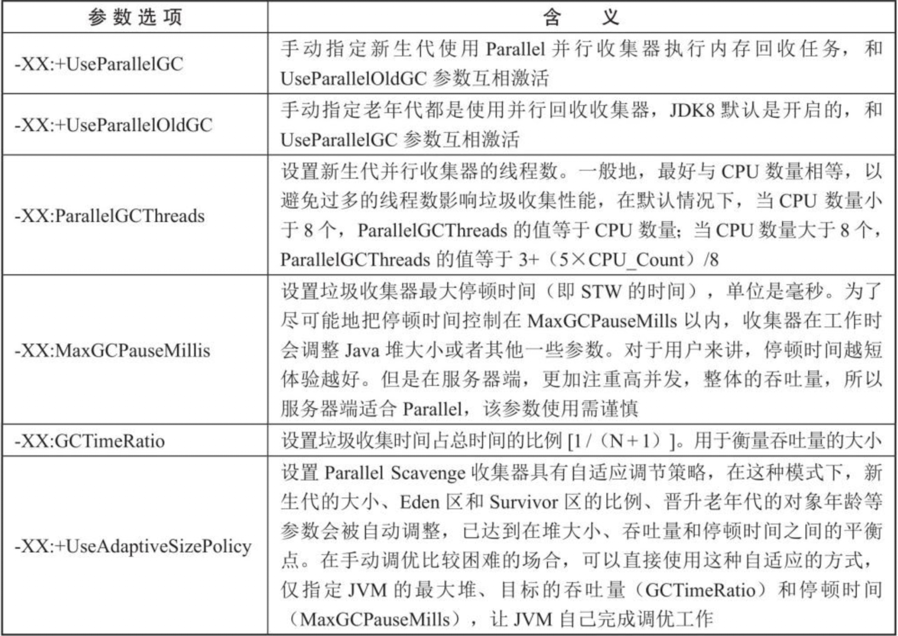

​	CMS收集器的相关JVM参数选项如下表所示。

<div style="text-align:center;font-weight:bold;">CMS收集器的相关JVM参数选项</div>

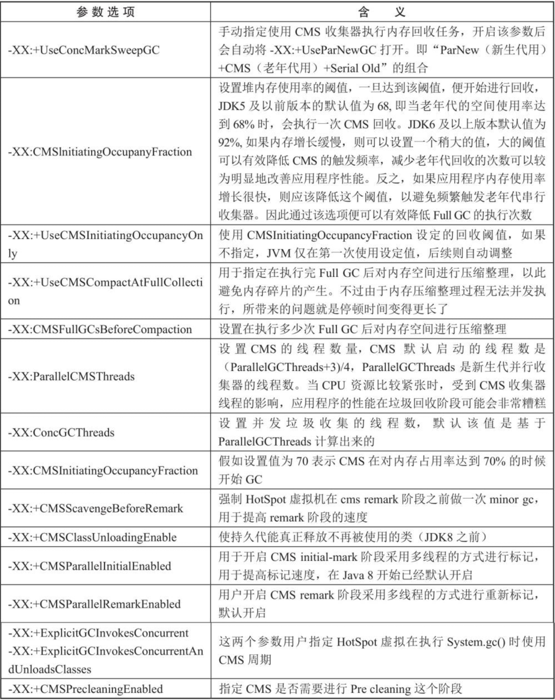

​	需要注意的是JDK 9新特性中CMS被标记为Deprecate了，如果对JDK 9及以上版本的HotSpot虚拟机使用参数-XX:+UseConcMarkSweepGC来开启CMS收集器的话，用户会收到一个警告信息，提示CMS未来将会被废弃。JDK 14新特性中删除了CMS垃圾收集器，如果在JDK 14中使用-XX:+UseConcMarkSweepGC的话，JVM不会报错，只是给出一个warning信息，但是不会exit。JVM会自动回退以默认GC方式启动JVM。

​	G1收集器的相关JVM参数选项如下表所示。

<div style="text-align:center;font-weight:bold;">G1收集器的相关JVM参数选项</div>

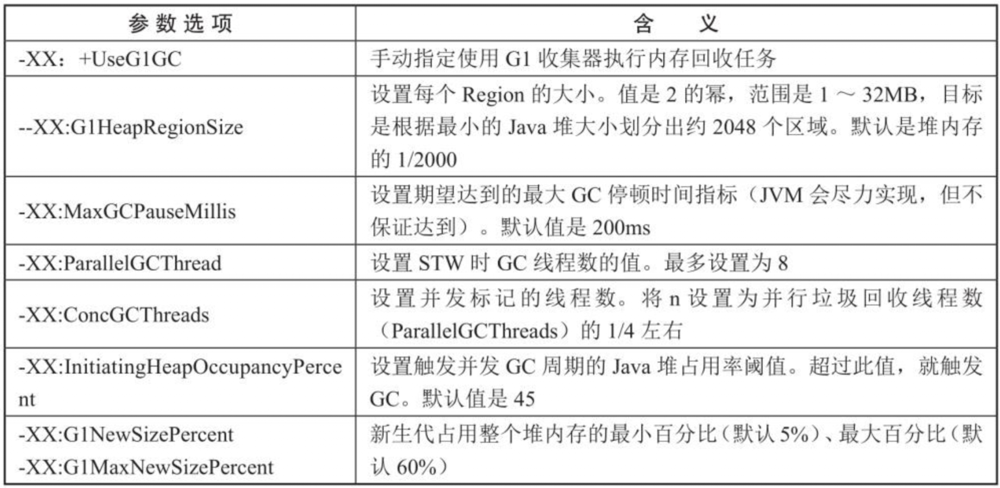

​	G1收集器主要涉及Mixed GC,Mixed GC会回收新生代和部分老年代，G1关于Mixed GC调优常用参数选项如下表所示。

<div style="text-align:center;font-weight:bold;">G1关于Mixed GC调优常用参数选项</div>

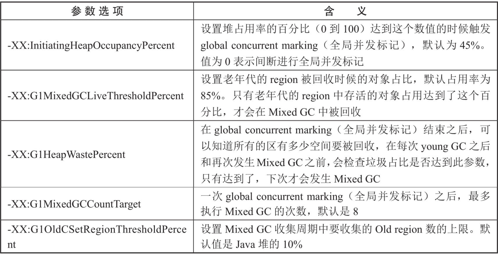


- 查看默认垃圾收集器

  - <span style="color:blue;font-weight:bold;">-XX:+PrintCommandLineFlags</span>：查看命令行相关参数（包含使用的垃圾收集器）

  - 使用命令行指令：**jinfo -flag 相关垃圾回收器参数 进程ID**

    > $ jinfo -flag UseParallelGC 17280
    >
    > $ jinfo -flag UseParallelOldGC 17352

- Serial回收器

  Serial收集器作为HotSpot中Client模式下的默认新生代垃圾收集器。Serial Old是运行在Client模式下默认的老年代的垃圾回收器。

  - <span style="color:blue;font-weight:bold;">-XX:+UseSerialGC</span> ：指定年轻代和老年代都使用串行收集器。等价于新生代用Serial GC，且老年代用Serial Old GC。可以获得最高的单线程收集效率。

- ParNew回收器：  响应速度优先

  - <span style="color:blue;font-weight:bold;">-XX:+UseParNewGC</span> ： 手动指定使用ParNew收集器执行内存回收任务。它表示年轻代使用并行收集器，不影响老年代。
  - <span style="color:blue;font-weight:bold;">-XX:ParallelGCThreads=N</span> ： 限制线程数量，默认开启和CPU数据相同的线程数。

- Parallel回收器：吞吐量优先

  - <span style="color:blue;font-weight:bold;">-XX:+UseParallelGC</span> ： 手动指定年轻代使用Parallel并行收集器执行内存回收任务。
  - <span style="color:blue;font-weight:bold;">-XX:+UseParallelOldGC</span> ： 手动指定老年代都是使用并行回收收集器。
    - 分别适用于新生代和老年代。默认jdk8是开启的。
    - 上面两个参数，默认开启一个，另一个也会被开启。<span style="color:red;font-weight:bold;">（互相激活）</span>
  - <span style="color:blue;font-weight:bold;">-XX:ParallelGCThreads</span> ： 设置年轻代并行收集器的线程数。一般地，最好与CPU数量相等，以避免过多的线程数影响垃圾收集性能。
    - 在默认情况下，当CPU数量小于8个，ParallelGCThreads的值等于CPU数量。
    - 当CPU数量大于8个，ParallelGCThreads的值等于3+[5*CPU_Count]/8]。
  - <span style="color:blue;font-weight:bold;">-XX:MaxGCPauseMillis</span> ： 设置垃圾收集器最大停顿时间（即STW的时间）。单位是毫秒。
    - 为了尽可能地把停顿时间控制在MaxGCPauseMills以内，收集器在工作时会调整Java堆大小或者其他一些参数。
    - 对于用户来讲，停顿时间越短体验越好。但是在服务器端，我们注重高并发，整体的吞吐量。所以服务器端适合Parallel，进行控制。
    - <span style="color:red;font-weight:bold;">该参数使用需谨慎。</span>
  - <span style="color:blue;font-weight:bold;">-XX:GCTimeRatio</span> ： 垃圾收集时间占总时间的比例（=1/(N+1）。用于衡量吞吐量的大小。
    - 取值范围（0,100）。默认值99，也就是垃圾回收时间不超过1%。
    - 与前一个-XX:MaxGCPauseMillis参数有一定矛盾性。暂停时间越长，Radio参数就越容易超过设定的比例。
  - <span style="color:blue;font-weight:bold;">-XX:+UseAdaptiveSizePolicy</span> ： 设置Parallel Scavenge收集器具有**自适应调节策略**。
    - 在这种模式下，年轻代的大小、Eden和Survivor的比例、晋升老年代的对象年龄等参数会被自动调整，已达到在堆大小、吞吐量和停顿时间之间的平衡点。
    - 在手动调优比较困难的场合，可以直接使用这种自适应的方式，仅指定虚拟机的最大堆、目标的吞吐量（GCTimeRatio）和停顿时间（MaxGCPauseMills），让虚拟机自己完成调优工作。

- CMS回收器

  - <span style="color:blue;font-weight:bold;">-XX:+UseConcMarkSweepGC</span> 手动指定使用CMS收集器执行内存回收任务。

    - 开启该参数后会自动将-XX:+UseParNewGC打开。即：ParNew（Young区使用）+CMS（Old区使用）+Serial Old的组合。

  - <span style="color:blue;font-weight:bold;">-XX:CMSInitiatingOccupanyFraction</span> ： 设置堆内存使用率的阈值，一旦达到该阈值，便开始进行回收。

    - JDK5及以前版本的默认值为68，即当老年代的空间使用率达到68%时，会执行一次CMS回收。<span style="color:blue;font-weight:bold;">JDK6及以上版本默认值为92%</span>。
    - 如果内存增长缓慢，则可以设置一个稍微大的值，打的阈值可以有效降低CMS的触发频率，减少老年代回收的次数可以较为明显地改善应用程序性能。反之，如果应用程序内存使用率增长很快，则应该降低这个阈值，以避免频繁触发老年代串行收集器。因此<span style="color:blue;font-weight:bold;">通过该选项便可以有效降低Full GC的执行次数。</span>

  - <span style="color:blue;font-weight:bold;">-XX:+UseCMSCompactAtFullCollection</span> ： 用于指定在执行完Full GC后对内存空间进行压缩整理，以此避免内存碎片的产生。不过由于内存压缩整理过程无法并发执行，所带来的问题就是停顿时间变得更长了。

  - <span style="color:blue;font-weight:bold;">-XX:CMSFullGCsBeforeCompaction</span> ： 设置在执行多少次Full GC后对内存空间进行压缩整理。

  - <span style="color:blue;font-weight:bold;">-XX:ParallelCMSThreads</span> ： 设置CMS的线程数量。

    - CMS默认启动的线程数是（ParallelGCThreads+3）/4，ParallelGCThreads是年轻代并行收集器的线程数。当CPU资源比较紧张时，受到CMS收集器线程的影响，应用程序的性能在垃圾回收阶段可能会非常糟糕。

  - 补充参数

    另外，CMS收集器还有如下常用参数：

    - <span style="color:blue;font-weight:bold;">-XX:ConcGCThreads</span> ： 设置并发垃圾收集的线程数，默认该值是基于ParallelGCThreads计算出来的。
    - <span style="color:blue;font-weight:bold;">-XX:+UseCMSInitiatingOccupancyOnly</span> ： 是否动态可调，用这个参数可以使CMS一直按CMSInitiatingOccupancyFraction设定的值启动。
    - <span style="color:blue;font-weight:bold;">-XX:+CMSScavengeBeforeRemark</span> ： 强制HotSpot虚拟机在CMS remark阶段之前做一次minor gc，用于提高 remark 阶段的速度。
    - <span style="color:blue;font-weight:bold;">-XX:+CMSClassUnloadingEnable</span> ： 如果有的话，启用回收Perm区（JDK8之前）
    - <span style="color:blue;font-weight:bold;">-XX:+CMSParallelInitialEnabled</span> ： 用于开启CMS initial-mark阶段采用多线程的方式进行标记，用于提高标记速度，在Java8开始已经默认开启。
    - <span style="color:blue;font-weight:bold;">-XX:+CMSParallelRemarkEnabled</span> ： 用户开启CMS remark阶段使用多线程的方式进行重新标记，默认开启。
    - <span style="color:blue;font-weight:bold;">-XX:+ExplicitGCInvokesConcurrent、-XX:+ExplicitGCInvokesConcurrentAndUnloadClasses</span> ： 这两个参数用户指定HotSpot虚拟在执行System.gc()时使用CMS周期。
    - <span style="color:blue;font-weight:bold;">-XX:+CMSPrecleaningEnabled</span> ： 指定CMS是否需要进行Pre cleaning这个阶段。

  - 特别说明

    - <span style="color:blue;font-weight:bold;">JDK9新特性：CMS被标记为Deprecate了（JEP291）</span>

      - 如果对JDK9及以上版本的HotSpot虚拟机使用参数-XX:+UseConcMarkSweepGC来开启CMS收集器的话，用户会收到一个警告信息，提示CMS未来将会被废弃。

    - <span style="color:blue;font-weight:bold;">JDK14新特性：删除CMS垃圾回收器（JEP363）</span>

      - 移除了CMS垃圾收集器，如果在JDK14中使用-XX:+UseConcMarkSweepGC的话，JVM不会报错，只是给出一个warning信息，但是不会exit。JVM会自动回退以默认GC方式启动JVM。

      <span style="color:red;font-weight:bold;">OpenJDK 64-Bit Server VM warning: Ignoring option UseConcMarkSweepGC;</span>

      <span style="color:red;font-weight:bold;">support was removed in 14.0</span>

      <span style="color:red;font-weight:bold;">and the VM will continue execution using the default collector.</span>

      

- G1回收器

  - <span style="color:blue;font-weight:bold;">-XX:+UseG1GC</span> ： 手动指定使用G1收集器执行内存回收任务。

  - <span style="color:blue;font-weight:bold;">-XX:G1HeapRegionSize</span> ： 设置每个Region的大小。值是2的幂，范围是1MB到32MB之间，目标是根据最小的Java堆大小划分出约2048个区域。默认是堆内存的1/2000。

  - <span style="color:blue;font-weight:bold;">-XX:MaxGCPauseMillis</span> ： 设置期望达到的最大GC停顿时间指标（JVM会尽力实现，但不保证达到）。默认值是200ms

  - <span style="color:blue;font-weight:bold;">-XX:ParallelGCThreads</span> ： 设置STW时GC线程数的值。最多设置为8。

  - <span style="color:blue;font-weight:bold;">-XX:ConcGCThreads</span> ： 设置并发标记的线程数。将n设置为并行垃圾回收线程数（ParallelGCThreads）的1/4左右。

  - <span style="color:blue;font-weight:bold;">-XX:InitiatingHeapOccupancyPercent</span> ： 设置触发并发GC周期的Java堆占用率阈值。超过此值，就触发GC。默认值是45。

  - <span style="color:blue;font-weight:bold;">-XX:G1NewSizePercent、-XX:G1MaxNewSizePercent</span> ： 新生代占用整个堆内存的最小百分比（默认5%）、最大百分比（默认60%）

  - <span style="color:blue;font-weight:bold;">-XX:G1ReservePercent=10</span> ： 保留内存区域，防止to space（Survivor中的to区）溢出。

  - Mixed GC调优参数

    注意：G1收集器主要涉及到Mixed GC，Mixed GC会回收young区和部分old区。

    G1关于Mixed GC调优常用参数：

    - <span style="color:blue;font-weight:bold;">-XX:InitiatingHeapOccupancyPercent</span> ： 设置堆占用率的百分比（0到100）达到这个数值的时候触发global concurrent marking（全局并发标记），默认为45%。值为0表示间断进行全局并发标记。
    - <span style="color:blue;font-weight:bold;">-XX:G1MixedGCLiveThresholdPercent</span> ： 设置Old区的region被回收的时候的对象占比，默认占用率为85%。只有Old区的region中存活的对象占用达到了这个百分比，才会在Mixed GC中被回收。
    - <span style="color:blue;font-weight:bold;">-XX:G1HeapWastePercent</span> ： 在global concurrent marking（全局并发标记）结束之后，可以知道所有的区有多少空间要被回收，在每次young GC之后再次发生Mixed GC之前，会检查垃圾占比是否达到此参数，只有达到了，下次才会发生Mixed GC。
    - <span style="color:blue;font-weight:bold;">-XX:G1MixedGCCountTarget</span> ： 一次global concurrent marking（全局并发标记）之后，最多执行Mixed GC的次数，默认是8.
    - <span style="color:blue;font-weight:bold;">-XX:G1OldCSetRegionThresholdPercent</span> ： 设置Mixed GC收集周期中药收集的Old region数的上限。默认值是Java堆的10%。

- 怎么选择垃圾回收器

  - 优先调整堆的大小让JVM自适应完成。
  - 如果内存小于100M，使用串行收集器。
  - 如果是单核、单机程序，并且没有停顿时间的要求，串行收集器。
  - 如果是多CPU、需要高吞吐量、允许停顿时间超过1秒，选择并行或者JVM自己选择。
  - r四是多CPU、最求低停顿时间，需要快速响应（比如，延迟不能超过1秒，如互联网应用），使用并发收集器。官方推荐G1，性能高。<span style="color:blue;font-weight:bold;">现在互联网的项目，基本都是使用G1。</span>

  特别说明：

  1. 没有最好的收集器，更没有万能的收集器。
  2. 调优永远是针对特定场景、特定需求，不存在一劳永逸的收集器。

### 23.3.5 GC日志相关选项

​	GC日志相关的参数选项如下表所示。

<div style="text-align:center;font-weight:bold;">GC日志相关的参数选项</div>

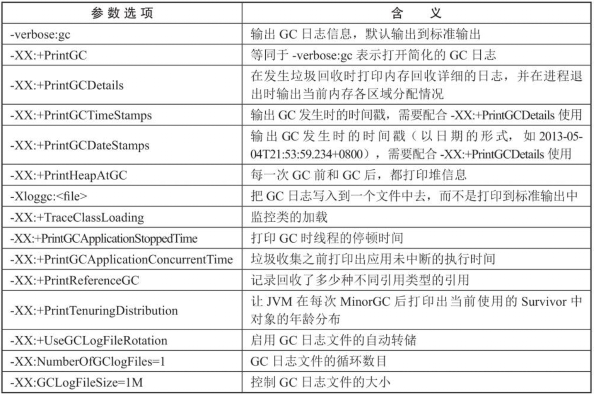


- <span style="color:blue;font-weight:bold;">-verbose:gc</span> ： 输出gc日志信息，默认输出到标准输出。<span style="color:orange;font-weight:bold;">可独立使用</span>
- <span style="color:blue;font-weight:bold;">-XX:+PrintGC</span> 等同于 -verbose:gc ；表示打开简化的GC日志。<span style="color:orange;font-weight:bold;">可独立使用</span>
- <span style="color:blue;font-weight:bold;">-XX:+PrintGCDetails</span> ： 在发生垃圾回收时打印内存回收详细的日志，并在进程退出时输出当前内存各个区域分配情况。<span style="color:orange;font-weight:bold;">可独立使用</span>
- <span style="color:blue;font-weight:bold;">-XX:+PrintGCTimeStamps</span> ： 输出GC发生时的时间戳。<span style="color:orange;font-weight:bold;">需要配合-XX:+PrintGCDetails使用</span>
- <span style="color:blue;font-weight:bold;">-XX:+PrintGCDateStamps</span> ： 输出GC发生时的时间戳（以日期的形式，如2013-05-04T21:53:59.234+0800）。<span style="color:orange;font-weight:bold;">需要配合-XX:+PrintGCDetails使用</span>
- <span style="color:blue;font-weight:bold;">-XX:+PrintHeapAtGC</span> ： 每一次GC前和GC后，都打印堆信息。<span style="color:orange;font-weight:bold;">**可独立使用**</span>
- <span style="color:blue;font-weight:bold;">-Xloggc:<file></span> ： 把GC日志写入到一个文件中去，而不是打印到标准输出中。<span style="color:orange;font-weight:bold;">需要配合-XX:+PrintGCDetails使用</span>


- <span style="color:blue;font-weight:bold;">-XX:+TraceClassLoading</span> ： 监控类的加载
- <span style="color:blue;font-weight:bold;">-XX:+PrintGCApplicationStoppedTime</span> ： 打印GC时线程的停顿时间
- <span style="color:blue;font-weight:bold;">-XX:+PrintGCApplicationConcurrentTime</span> ： 垃圾收集之前打印出应用未中断的执行时间
- <span style="color:blue;font-weight:bold;">-XX:+PrintReferenceGC</span> ： 记录回收了多少种不同引用类型的引用
- <span style="color:blue;font-weight:bold;">-XX:+PrintTenuringDistribution</span> ： 让JVM在每次MinorGC后打印出当前使用的Survivor中对象的年龄分布。
- <span style="color:blue;font-weight:bold;">-XX:+UseGCLogFileRotation</span> ： 启用GC日志文件的自动转储。
- <span style="color:blue;font-weight:bold;">-XX:NumberOfGCLogFiles=1</span> ： GC日志文件的循环数量
- <span style="color:blue;font-weight:bold;">-XX:GCLogFileSize=1M</span> ： 控制GC日志文件的大小

### 23.3.6 其他参数

​	其他常用的参数选项如下表所示。

<div style="text-align:center;font-weight:bold;">其他常用的参数选项</div>

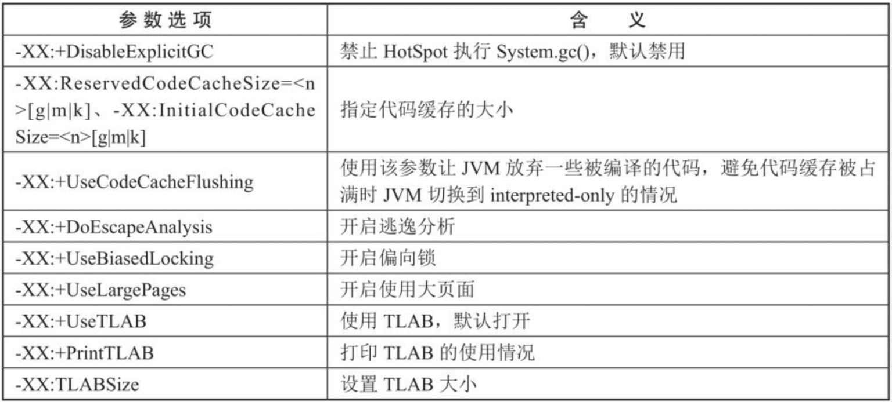


- <span style="color:blue;font-weight:bold;">-XX:+DisableExplicitGC</span> ： 禁止hotspot执行System.gc()，默认禁用。
- <span style="color:blue;font-weight:bold;">-XX:ReservedCodeCacheSize=<n>[g|m|k]、-XX:InitialCodeCacheSize=<n>[g|m|k]</span> ： 指定代码缓存的大小
- <span style="color:blue;font-weight:bold;">-XX:+UseCodeCacheFlushing</span> ： 使用该参数让jvm放弃一些被编译的代码，避免代码缓存被占满时JVM切换到interpreted-only的情况
- <span style="color:blue;font-weight:bold;">-XX:+DoEscapeAnalysis</span> ： 开启逃逸分析
- <span style="color:blue;font-weight:bold;">-XX:+UseBiasedLocking</span> ： 开启偏向锁
- <span style="color:blue;font-weight:bold;">-XX:+UseLargePages</span> ： 开启使用大页面
- <span style="color:blue;font-weight:bold;">-XX:+UseTLAB</span> ： 使用TLAB，默认打开
- <span style="color:blue;font-weight:bold;">-XX:+PrintTLAB</span> ： 打印TLAB的使用情况
- <span style="color:blue;font-weight:bold;">-XX:TLABSize</span> ： 设置TLAB大小

## 23.4 通过Java代码获取JVM参数

​	Java提供了java.lang.management包用于监视和管理JVM和Java运行时中的其他组件，它允许本地和远程监控和管理运行的JVM，会经常使用到其中的ManagementFactory类。另外还有Runtime类也可以获取一些内存、CPU核数等相关的数据。通过这些API可以监控我们的应用服务器的堆内存使用情况，也可以设置一些阈值进行报警等处理，如下代码演示了Java代码获取应用的内存使用情况。

<span style="color:#40E0D0;">案例1：获取JVM内存使用情况</span>

- 代码

```java
package com.coding.jvm07.vmoptions;

import java.lang.management.ManagementFactory;
import java.lang.management.MemoryMXBean;
import java.lang.management.MemoryPoolMXBean;
import java.lang.management.MemoryUsage;

/**
 * 监控我们的应用服务器的堆内存使用情况，设置一些阈值进行报警等处理。
 */
public class MemoryMonitor {

    public static void main(String[] args) {
        System.out.println("\nAuto Information:");
        for (MemoryPoolMXBean memoryPoolMXBean : ManagementFactory.getMemoryPoolMXBeans()) {
            System.out.println(memoryPoolMXBean.getName() + " 已经使用：" + memoryPoolMXBean.getUsage().getUsed() / 1024 / 1024 + "MB" + " 总大小：" +
                    memoryPoolMXBean.getUsage().getCommitted() / 1024 / 1024 + "MB");
        }
        System.out.println("\nSome Information:");
        MemoryMXBean memoryMXBean = ManagementFactory.getMemoryMXBean();
        MemoryUsage usage = memoryMXBean.getHeapMemoryUsage();
        System.out.println("INIT HEAP:" + usage.getInit() / 1024 / 1024 + "m");
        System.out.println("MAX HEAP:" + usage.getMax() / 1024 / 1024 + "m");
        System.out.println("USE HEAP:" + usage.getUsed() / 1024 / 1024 + "m");
        System.out.println("\nFull Information:");
        System.out.println("Heap Memory Usage:" + memoryMXBean.getHeapMemoryUsage());
        System.out.println("Non-Heap Memory Usage:" + memoryMXBean.getNonHeapMemoryUsage());
        System.out.println("\n========================通过Java来获取相关系统状态========================\n");
        System.out.println("当前堆内存大小totalMemory:" + (int) Runtime.getRuntime().totalMemory() / 1024 / 1024 + "m");
        System.out.println("空闲堆内存大小freeMemory:" + (int) Runtime.getRuntime().freeMemory() / 1024 / 1024 + "m");
        System.out.println("最大可用总堆内存maxMemory:" + Runtime.getRuntime().maxMemory() / 1024 / 1024 + "m");
    }
}

```

​	运行结果如下，可以看到堆内存的各项信息。

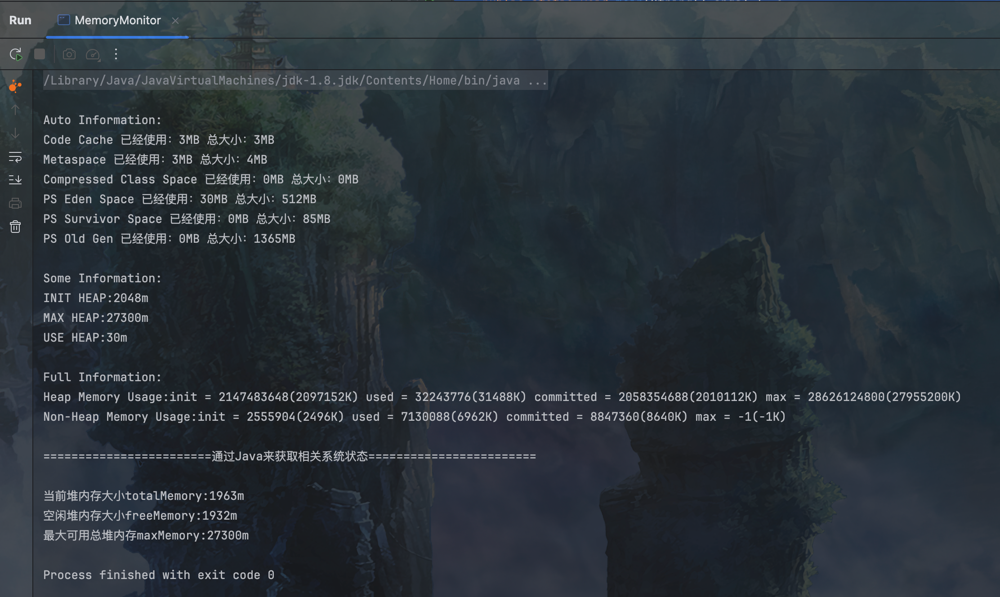


# 第24章 GC日志分析

​	GC日志是JVM产生的一种描述性的文本日志。就像开发Java程序需要输出日志一样，JVM通过GC日志来描述垃圾收集的情况。通过GC日志，我们能直观地看到内存清理的工作过程，了解垃圾收集的行为，比如何时在新生代执行垃圾收集，何时在老年代执行垃圾收集。本章将详细讲解如何分析GC日志。

## 24.1 概述

​	GC日志主要用于快速定位系统潜在的内存故障和性能瓶颈，通过阅读GC日志，我们可以了解JVM的内存分配与回收策略。GC日志根据垃圾收集器分类可以分为Parallel垃圾收集器日志、G1垃圾收集器日志和CMS垃圾收集器日志。第7章讲解堆的时候，垃圾收集分为部分收集和整堆收集，所以也可以把GC日志分为Minor GC日志、Major GC日志和Full GC日志。下面开始解析不同垃圾收集器的GC日志。

## 24.2 生成GC日志

​	解析日志之前，我们需要先生成日志，打印内存分配与垃圾收集日志信息的相关参数如下，更多关于GC日志参数见第23章表<span style="color:blue;font-weight:bold;">GC日志相关的参数选项</span>。

​	1、-XX:+PrintGC

​	该参数表示输出GC日志，和参数-verbose:gc效果一样。

​	2、-XX:+PrintGCDetails

​	该参数表示输出GC的详细日志。

​	3、-XX:+PrintGCTimeStamps

​	该参数表示输出GC的时间戳（以基准时间的形式）

​	4、-XX:+PrintGCDateStamps

​	该参数表示输出GC的时间戳（以日期的形式，如2013-05-04T21:53:59.234+0800）

​	5、-XX:+PrintHeapAtGC

​	该参数表示在进行GC的前后打印出堆的信息。

​	6、-Xloggc:../logs/gc.log

​	该参数表示日志文件的输出路径。

​	使用如下代码演示不同的GC日志参数打印出来的日志效果。

<span style="color:#40E0D0;">案例1：GC日志演示</span>

- 代码

```java
package com.coding.jvm07.vmoptions;

import java.util.ArrayList;

/**
 * -Xms60m -Xmx60m -XX:SurvivorRatio=8 -verbose:gc
 * <p>
 * jdk1.8:
 * -Xms60m -Xmx60m -XX:SurvivorRatio=8 -XX:+PrintGCDetails -XX:+PrintGCTimeStamps -XX:+PrintGCDateStamps -XX:+PrintHeapAtGC -Xloggc:/Users/wenqiu/Misc/gc.log
 * jdk1.8使用G1GC：
 * -Xms60m -Xmx60m -XX:SurvivorRatio=8 -XX:+PrintGCDetails -XX:+PrintGCTimeStamps -XX:+PrintGCDateStamps -XX:+UnlockExperimentalVMOptions -XX:+UseG1GC
 * jdk1.8使用CMS：
 * -Xms60m -Xmx60m -XX:SurvivorRatio=8 -XX:+PrintGCDetails -XX:+PrintGCTimeStamps -XX:+PrintGCDateStamps -XX:+UseConcMarkSweepGC
 * <p>
 * jdk11:
 * -Xlog:gc*:file=/Users/wenqiu/Misc/gc11.log:tags,uptime,time,level
 */
public class GCLogTest {

    public static void main(String[] args) {
        ArrayList<byte[]> list = new ArrayList<>();

        for (int i = 0; i < 600; i++) {
            byte[] arr = new byte[1024 * 100]; // 100KB
            list.add(arr);
            try {
                Thread.sleep(20);
            } catch (InterruptedException e) {
                e.printStackTrace();
            }
        }
    }
}

```

​	配置JVM参数如下。

```bash
-Xms60m -Xmx60m -XX:SurvivorRatio=8
```

​	(1)增加输出GC日志参数如下。

```bash
-verbose:gc
```

​	这个参数只会显示总的GC堆的变化，结果如下。

```bash
[GC (Allocation Failure)  17353K->6841K(63488K), 0.0054519 secs]
[GC (Allocation Failure)  24208K->23716K(63488K), 0.0067550 secs]
[GC (Allocation Failure)  41118K->40566K(63488K), 0.0063732 secs]
[Full GC (Ergonomics)  40566K->40380K(63488K), 0.0179042 secs]
[Full GC (Ergonomics)  57710K->57374K(63488K), 0.0204342 secs]
[Full GC (Ergonomics)  61157K->60606K(63488K), 0.0217548 secs]
```

​	(2)在控制台输出GC日志详情命令如下。

```bash
-verbose:gc
-XX:+PrintGCDetails
```

​	输出日志信息如下。

```bash
[GC (Allocation Failure) [PSYoungGen: 17353K->2032K(19456K)] 17353K->6804K(63488K), 0.0080861 secs] [Times: user=0.01 sys=0.01, real=0.01 secs] 
[GC (Allocation Failure) [PSYoungGen: 19399K->2028K(19456K)] 24172K->23711K(63488K), 0.0057697 secs] [Times: user=0.00 sys=0.01, real=0.01 secs] 
[GC (Allocation Failure) [PSYoungGen: 19430K->2016K(19456K)] 41113K->40506K(63488K), 0.0077306 secs] [Times: user=0.01 sys=0.01, real=0.01 secs] 
[Full GC (Ergonomics) [PSYoungGen: 2016K->0K(19456K)] [ParOldGen: 38489K->40379K(44032K)] 40506K->40379K(63488K), [Metaspace: 8663K->8663K(1056768K)], 0.0215998 secs] [Times: user=0.09 sys=0.01, real=0.02 secs] 
[Full GC (Ergonomics) [PSYoungGen: 17329K->13602K(19456K)] [ParOldGen: 40379K->43772K(44032K)] 57709K->57374K(63488K), [Metaspace: 8672K->8672K(1056768K)], 0.0215331 secs] [Times: user=0.05 sys=0.01, real=0.02 secs] 
[Full GC (Ergonomics) [PSYoungGen: 17323K->17103K(19456K)] [ParOldGen: 43772K->43502K(44032K)] 61096K->60606K(63488K), [Metaspace: 8695K->8644K(1056768K)], 0.0231095 secs] [Times: user=0.06 sys=0.01, real=0.02 secs]
```

​	可以发现较之前的日志信息更加详细了，可以明确看到每个区域的内存变化，这使得对日志的分析更加精确了。

​	(3)增加GC日志打印时间命令如下。

```bash
-verbose:gc
-XX:+PrintGCDetails
-XX:+PrintGCTimeStamps
-XX:+PrintGCDateStamps
```

​	输出日志信息如下。

```bash
2024-12-13T16:55:14.247-0800: 1.198: [GC (Allocation Failure) [PSYoungGen: 17353K->2024K(19456K)] 17353K->6872K(63488K), 0.0071370 secs] [Times: user=0.02 sys=0.01, real=0.01 secs] 
2024-12-13T16:55:18.242-0800: 5.194: [GC (Allocation Failure) [PSYoungGen: 19391K->2024K(19456K)] 24239K->23787K(63488K), 0.0063350 secs] [Times: user=0.01 sys=0.01, real=0.00 secs] 
2024-12-13T16:55:22.309-0800: 9.261: [GC (Allocation Failure) [PSYoungGen: 19365K->2044K(19456K)] 41128K->40606K(63488K), 0.0074474 secs] [Times: user=0.01 sys=0.02, real=0.01 secs] 
2024-12-13T16:55:22.317-0800: 9.268: [Full GC (Ergonomics) [PSYoungGen: 2044K->0K(19456K)] [ParOldGen: 38561K->40382K(44032K)] 40606K->40382K(63488K), [Metaspace: 8663K->8663K(1056768K)], 0.0160206 secs] [Times: user=0.12 sys=0.01, real=0.02 secs] 
2024-12-13T16:55:26.404-0800: 13.356: [Full GC (Ergonomics) [PSYoungGen: 17330K->13602K(19456K)] [ParOldGen: 40382K->43772K(44032K)] 57712K->57374K(63488K), [Metaspace: 8672K->8672K(1056768K)], 0.0232205 secs] [Times: user=0.14 sys=0.02, real=0.02 secs] 
2024-12-13T16:55:27.298-0800: 14.249: [Full GC (Ergonomics) [PSYoungGen: 17384K->17203K(19456K)] [ParOldGen: 43772K->43502K(44032K)] 61157K->60706K(63488K), [Metaspace: 8695K->8644K(1056768K)], 0.0093000 secs] [Times: user=0.08 sys=0.00, real=0.01 secs] 
2024-12-13T16:55:27.357-0800: 14.309: [Full GC (Ergonomics) [PSYoungGen: 17408K->17403K(19456K)] [ParOldGen: 43502K->43502K(44032K)] 60910K->60906K(63488K), [Metaspace: 8646K->8646K(1056768K)], 0.0038409 secs] [Times: user=0.02 sys=0.00, real=0.01 secs]
```

​	可以看到日志信息中带上了日期，方便在生产环境中根据日期去定位GC日志2022-03-25T16:14:53.423-0800表示的日志打印时间，该信息是参数“-XX:+PrintGCDateStamps”起的作用；后面的6.948表示虚拟机启动以来到目前打印日志经历的时间，该信息由参数“-XX:+PrintGCTimeStamps”起作用。

​	(4)在生产环境中，一般都会把日志存放到某个文件中，如果想要达到这一效果可以使用下面的参数。

```bash
-Xloggc:/Users/wenqiu/Misc/gc.log
```

## 24.3 Parallel垃圾收集器日志解析

### 24.3.1 Minor GC

​	下面是一段Parallel垃圾收集器在新生代产生的Minor GC日志，接下来逐步展开解析。

```bash
2024-12-13T23:44:52.839-0800: 1.217: [GC (Allocation Failure) [PSYoungGen: 17353K->2044K(19456K)] 17353K->6868K(63488K), 0.0071326 secs] [Times: user=0.01 sys=0.01, real=0.01 secs] 
```

​	日志解析如下表所示。

<div style="text-align:center;font-weight:bold;">Parallel垃圾收集器Minor GC日志解析</div>

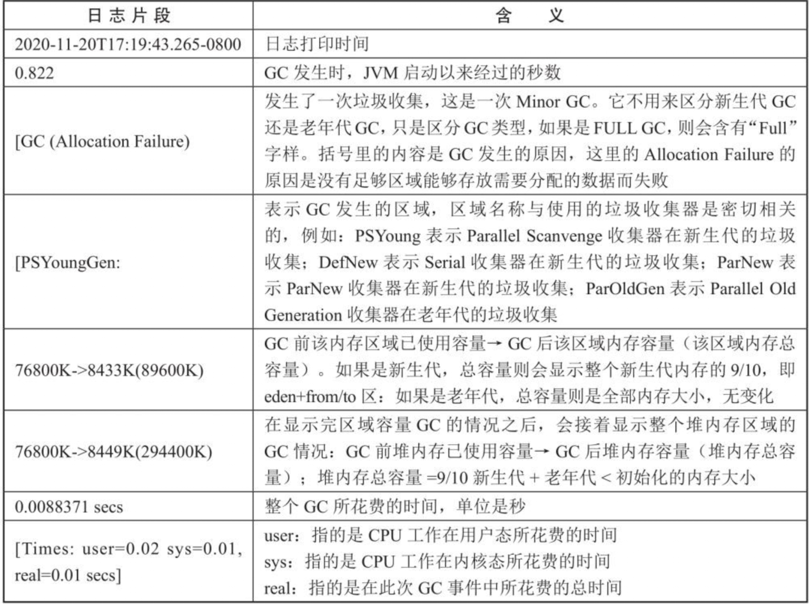

### 24.3.2 FULL GC

​	下面解析一段Parallel垃圾收集器产生的FULL GC日志。

```bash
2024-12-13T23:45:00.855-0800: 9.232: [Full GC (Ergonomics) [PSYoungGen: 2044K->0K(19456K)] [ParOldGen: 38453K->40380K(44032K)] 40498K->40380K(63488K), [Metaspace: 8663K->8663K(1056768K)], 0.0191522 secs] [Times: user=0.14 sys=0.01, real=0.02 secs]
```

​	日志解析如下表所示。

<div style="text-align:center;font-weight:bold;">Parallel垃圾收集器FULL GC日志解析</div>

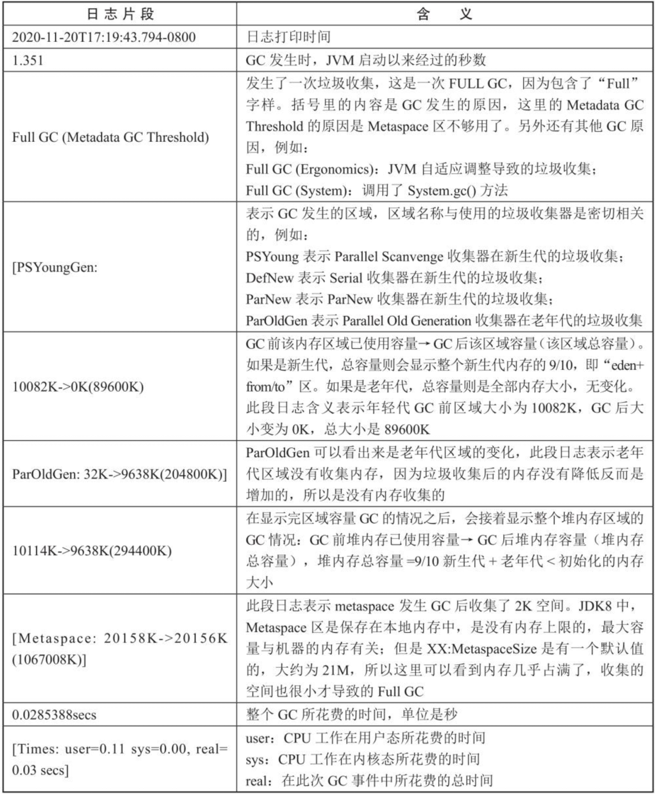

​		通过日志分析可以总结出Parallel垃圾收集器输出日志的规律，如下图所示。

<div style="text-align:center;font-weight:bold;">日志规律</div>


## 24.4 G1垃圾收集器日志解析

​	G1垃圾收集器的垃圾收集过程在前面的章节已经讲过了，它是区域化分代式垃圾收集器。G1垃圾收集器的垃圾收集包含四个环节，分别是Minor GC、并发收集、混合收集(Mixed GC)和Full GC，下面针对每个环节的GC日志进行解析。

### 24.4.1 Minor GC

​	下面解析G1垃圾收集器产生的Minor GC日志。

​	<span style="color:red;font-weight:bold;">JDK1.8使用G1GC，配置：`-XX:+UnlockExperimentalVMOptions -XX:+UseG1GC`</span>

<div style="text-align:center;font-weight:bold;">JDK1.8下UseG1GC日志</div>

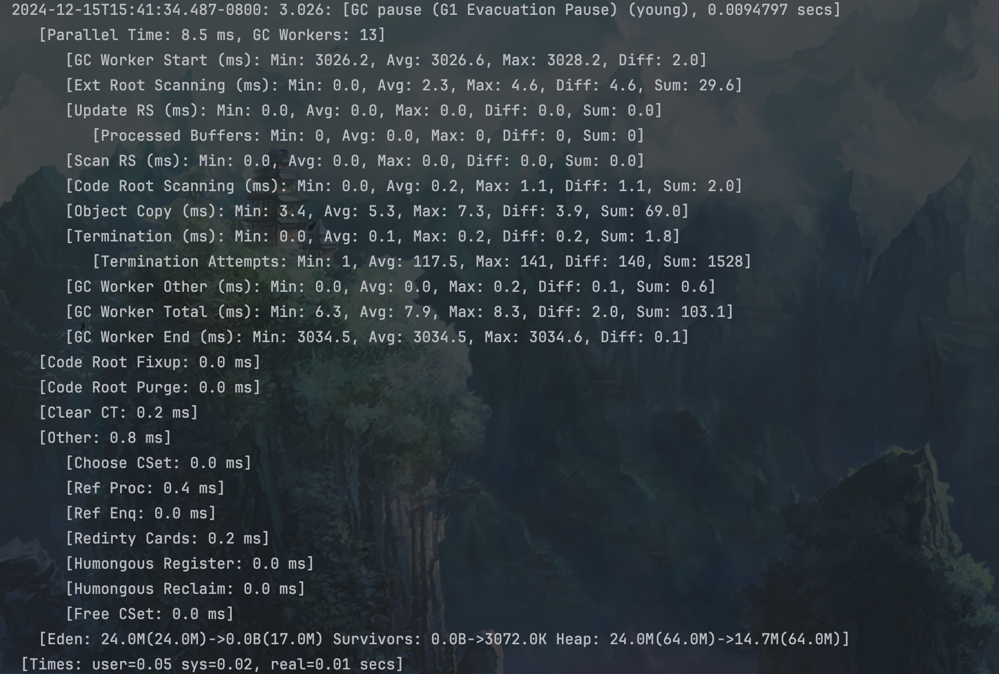

​	日志解析如下表所示。

<div style="text-align:center;font-weight:bold;">G1垃圾收集器Minor GC日志解析</div>

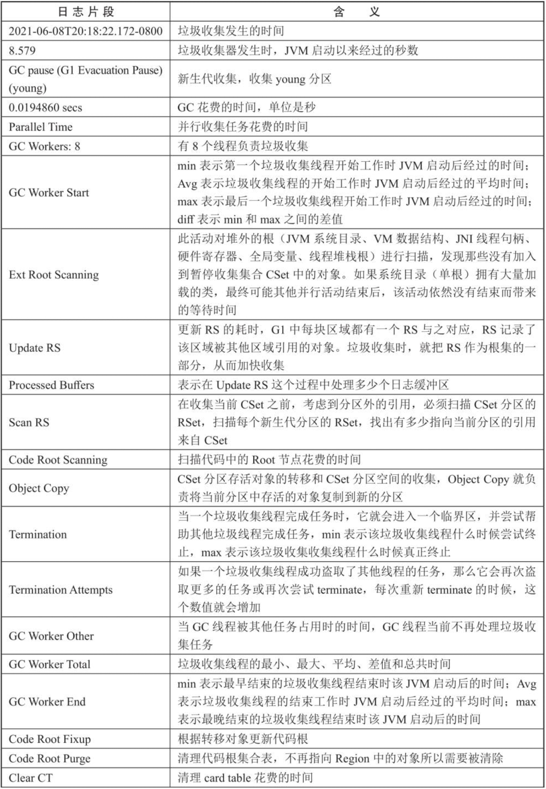

<div style="text-align:center;font-weight:bold;">续表</div>

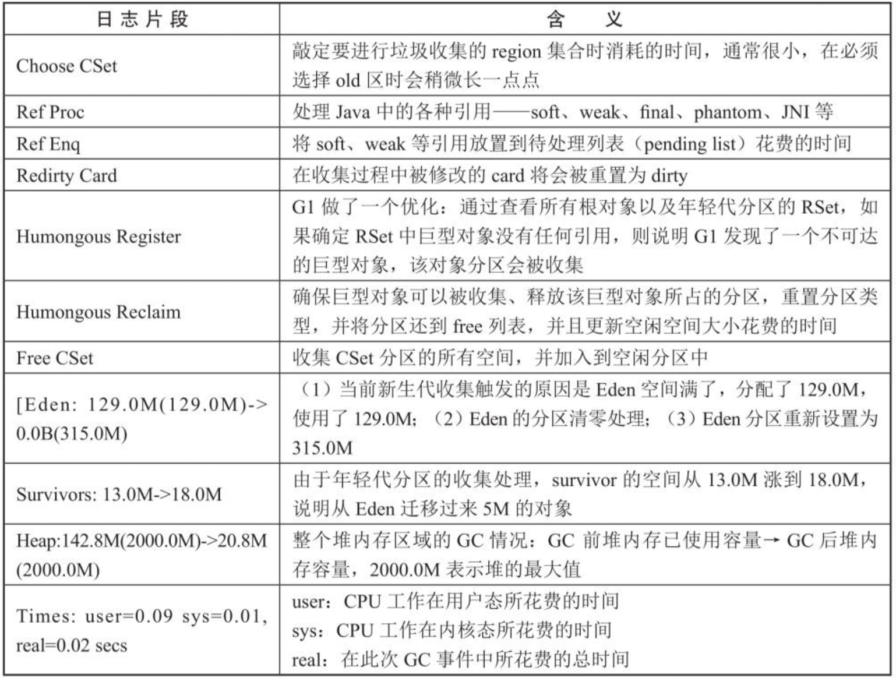

### 24.4.2 并发收集

​	经过Minor GC之后就会来到G1垃圾收集的下一个阶段：并发收集，以下面一段G1垃圾收集器并发收集为案例进行解析。

```bash
2024-12-15T15:41:41.194-0800: 9.734: [GC pause (G1 Evacuation Pause) (young) (initial-mark), 0.0062652 secs]
...这里和Minor GC日志一样，不再展示）...
2024-12-15T15:41:41.201-0800: 9.740: [GC concurrent-root-region-scan-start]
2024-12-15T15:41:41.202-0800: 9.741: [GC concurrent-root-region-scan-end, 0.0005710 secs]
2024-12-15T15:41:41.202-0800: 9.741: [GC concurrent-mark-start]
2024-12-15T15:41:41.203-0800: 9.742: [GC concurrent-mark-end, 0.0013951 secs]
2024-12-15T15:41:41.203-0800: 9.742: [GC remark 2024-12-15T15:41:41.203-0800: 9.742: [Finalize Marking, 0.0004757 secs] 2024-12-15T15:41:41.203-0800: 9.743: [GC ref-proc, 0.0000587 secs] 2024-12-15T15:41:41.204-0800: 9.743: [Unloading, 0.0021112 secs], 0.0029866 secs]
 [Times: user=0.02 sys=0.00, real=0.00 secs] 
2024-12-15T15:41:41.206-0800: 9.745: [GC cleanup 43M->43M(64M), 0.0007060 secs]
 [Times: user=0.00 sys=0.00, real=0.00 secs] 
```

**1 并发垃圾收集阶段的开始**

​	GC pause(G1 Evacuation Pause)(young)(initial-mark)标志着并发垃圾收集阶段的初始标记开始，该阶段会伴随一次Minor GC。

**2 根分区扫描**

​	GC concurrent-root-region-scan-start：根分区扫描开始，根分区扫描主要扫描新的Survivor分区，找到这些分区内的对象指向当前分区的引用，如果发现有引用，则做个记录。

​	GC concurrent-root-region-scan-end：根分区扫描结束，耗时0.0001166 s。

**3 并发标记阶段**

​	GC Concurrent-mark-start：并发标记阶段开始。并发标记阶段的线程是跟应用线程一起运行的，不会STW，所以称为并发，此过程可能被Minor GC中断。在并发标记阶段，若发现区域对象中的所有对象都是垃圾，那这个区域会被立即收集。

​	GC concurrent-mark-reset-for-overflow：表示全局标记栈已满，发生了栈溢出。并发标记检测到该溢出并重置数据结构，之后重新启动标记。

​	GC Concurrent-mark-end：并发标记阶段结束，耗时2.3018752 s。

**4 重新标记阶段**

​	Finalize Marking:Finalizer列表里的Finalizer对象处理，耗时0.0002438 s；

​	GC ref-proc：引用（soft、weak、final、phantom、JNI等）处理，耗时0.0018184 s；

​	Unloading：类卸载，耗时0.0042254 s。

​	除了前面这几个事情，这个阶段最关键的结果是绘制出当前并发周期中整个堆的最后面貌，剩余的SATB缓冲区会在这里被处理，所有存活的对象都会被标记。

**5 清理阶段**

​	[GC cleanup 1912M->1753M(2000M),0.0019143 secs]：清理阶段会发生STW。它遍历所有区域的标记信息，计算每个区域的活跃数据信息，重置标记数据结构，根据垃圾收集效率对区域进行排序。总堆大小是2000M，计算活跃数据之后，发现总活跃数据大小从1912M降到了1753M，耗时0.0019143secs。

**6 并发清理阶段**

​	2021-06-08T20:18:26.024-0800:12.431:[GC concurrent-cleanup-start]：表示并发清理阶段开始，它释放在上一个STW阶段期间被发现为空的regions（不包含任何的活跃数据的区域）。

### 24.4.3 混合收集

​	在并发收集阶段结束后，会看到混合收集阶段的日志。该日志的大部分内容跟之前讨论的新生代收集相同，只有第1部分不一样，即GC pause(G1 Evacuation Pause)(mixed),0.0129474s，这一行表示垃圾混合收集。在混合垃圾收集处理的CSet不仅包括新生代的分区，还包括并发标记阶段标记出来的那些老年代分区。

### 24.4.4 Full GC

​	如果堆内存空间不足以分配新的对象，或者是Metasapce空间使用率达到了设定的阈值，那么就会触发Full GC，在使用G1的时候应该尽量避免这种情况发生，因为G1的Full GC是单线程，会发生STW，代价非常高。Full GC的日志如下所示。

```bash
2024-12-15T15:41:45.745-0800: 14.285: [Full GC (Allocation Failure)  64M->59M(64M), 0.0106176 secs]
   [Eden: 0.0B(3072.0K)->0.0B(3072.0K) Survivors: 0.0B->0.0B Heap: 64.0M(64.0M)->59.5M(64.0M)], [Metaspace: 8788K->8732K(1056768K)]
 [Times: user=0.01 sys=0.00, real=0.01 secs] 
```

​	Full GC(Allocation Failure)，表示Full GC的原因，这里是Allocation Failure，表示空间不足，1852M->1615M(2000M)表示内存区域收集，和之前讲解的含义一样，不再赘述，可以看到GC的原因是由堆内存不足导致的。4.1360525 secs表示Full GC的耗时。Full GC频率不能太快，每隔几天发生一次Full GC暂且可以接受，但是每隔1小时发生一次Full GC则不可接受。

## 24.5 CMS垃圾收集器日志解析

### 24.5.1 Minor GC

​	<span style="color:red;font-weight:bold;">JDK1.8使用CMS，配置：`-XX:+UseConcMarkSweepGC`</span>

​	选择了CMS垃圾收集器之后，新生代默认选择了ParNew垃圾收集器，以下面一段ParNew垃圾收集器GC日志案例进行解析。

```bash
2024-12-15T16:23:56.532-0800: 0.791: [GC (Allocation Failure) 2024-12-15T16:23:56.532-0800: 0.791: [ParNew: 15281K->1855K(17216K), 0.0120883 secs] 15281K->5032K(63680K), 0.0122867 secs] [Times: user=0.04 sys=0.01, real=0.01 secs]
```

​	日志解析如下表所示。

<div style="text-align:center;font-weight:bold;">CMS垃圾收集器Minor日志解析</div>


### 24.5.2 Major GC

​	CMS垃圾收集器主要收集老年代的垃圾，所以产生的日志称为Major GC。CMS垃圾收集器的垃圾收集过程分为7个阶段，分别是初始标记、并发标记、并发预清除、可终止的并发预清理、最终标记、并发清除和并发重置，其中初始标记和最终标记阶段是需要暂停用户线程的，其他阶段垃圾收集线程与用户线程并发执行。下面解析CMS垃圾收集器的GC日志。

```bash
2024-12-15T16:24:05.564-0800: 9.823: [GC (CMS Initial Mark) [1 CMS-initial-mark: 33025K(46464K)] 43389K(63680K), 0.0004636 secs] [Times: user=0.00 sys=0.00, real=0.00 secs] 
2024-12-15T16:24:05.564-0800: 9.824: [CMS-concurrent-mark-start]
2024-12-15T16:24:05.566-0800: 9.825: [CMS-concurrent-mark: 0.001/0.001 secs] [Times: user=0.01 sys=0.00, real=0.00 secs] 
2024-12-15T16:24:05.566-0800: 9.825: [CMS-concurrent-preclean-start]
2024-12-15T16:24:05.566-0800: 9.825: [CMS-concurrent-preclean: 0.000/0.000 secs] [Times: user=0.00 sys=0.00, real=0.00 secs] 
2024-12-15T16:24:05.566-0800: 9.825: [CMS-concurrent-abortable-preclean-start]
2024-12-15T16:24:06.300-0800: 10.560: [CMS-concurrent-abortable-preclean: 0.002/0.734 secs] [Times: user=0.00 sys=0.00, real=0.74 secs] 
2024-12-15T16:24:06.301-0800: 10.560: [GC (CMS Final Remark) [YG occupancy: 13536 K (17216 K)]2024-12-15T16:24:06.301-0800: 10.560: [Rescan (parallel) , 0.0014245 secs]2024-12-15T16:24:06.302-0800: 10.561: [weak refs processing, 0.0000731 secs]2024-12-15T16:24:06.302-0800: 10.561: [class unloading, 0.0032413 secs]2024-12-15T16:24:06.305-0800: 10.565: [scrub symbol table, 0.0028263 secs]2024-12-15T16:24:06.308-0800: 10.568: [scrub string table, 0.0003662 secs][1 CMS-remark: 33025K(46464K)] 46562K(63680K), 0.0080761 secs] [Times: user=0.01 sys=0.00, real=0.00 secs] 
2024-12-15T16:24:06.309-0800: 10.568: [CMS-concurrent-sweep-start]
2024-12-15T16:24:06.310-0800: 10.570: [CMS-concurrent-sweep: 0.001/0.001 secs] [Times: user=0.00 sys=0.00, real=0.01 secs] 
2024-12-15T16:24:06.310-0800: 10.570: [CMS-concurrent-reset-start]
2024-12-15T16:24:06.310-0800: 10.570: [CMS-concurrent-reset: 0.000/0.000 secs] [Times: user=0.00 sys=0.00, real=0.00 secs] 
```

**1 初始标记(Initial Mark)**

```bash
2024-12-15T16:24:05.564-0800: 9.823: [GC (CMS Initial Mark) [1 CMS-initial-mark: 33025K(46464K)] 43389K(63680K), 0.0004636 secs] [Times: user=0.00 sys=0.00, real=0.00 secs] 
```

​	初始标记是CMS中两次STW事件中的一次。它有两个目标，一是标记老年代中所有的GC Roots；二是标记被年轻代中活着的对象引用的对象。各段日志表示的含义如下，前面的日期和上面讲述的是一样的，此处不再赘述。

​	(1)1 CMS-initial-mark：收集阶段，开始收集所有的GC Roots和直接引用到的对象。

​	(2)1366463K(1366464K)：当前老年代的使用情况，括号中表示老年代可用容量。

​	(3)1664869K(1979904K)：当前整个堆的使用情况，括号中表示整个堆的容量，所以新生代容量=整个堆(1979904K)-老年代(1366464K)= 613440K。

**2 并发标记(Concurrent Mark)**

```bash
2024-12-15T16:24:05.564-0800: 9.824: [CMS-concurrent-mark-start]
2024-12-15T16:24:05.566-0800: 9.825: [CMS-concurrent-mark: 0.001/0.001 secs] [Times: user=0.01 sys=0.00, real=0.00 secs] 
```

​	这个阶段会遍历整个老年代并且标记所有存活的对象，从“初始化标记”阶段找到的GC Roots开始。并发标记的特点是和应用程序线程同时运行，并不是老年代的所有存活对象都会被标记，因为标记的同时应用程序会改变一些对象的引用。

​	(1)CMS-concurrent-mark：进入并发收集阶段，这个阶段会遍历老年代并且标记活着的对象。

​	(2)0.014/0.014 secs：该阶段持续的时间。

**3 并发预清除(Concurrent Preclean)**

```bash
2024-12-15T16:24:05.566-0800: 9.825: [CMS-concurrent-preclean-start]
2024-12-15T16:24:05.566-0800: 9.825: [CMS-concurrent-preclean: 0.000/0.000 secs] [Times: user=0.00 sys=0.00, real=0.00 secs] 
```

​	这个阶段也是一个并发的过程，即垃圾收集线程和应用线程并行运行，不会中断应用线程。在并发标记的过程中，一些对象的引用也在发生变化，此时JVM会标记堆的这个区域为Dirty Card（包含被标记但是改变了的对象，被认为“dirty”），这就是Card Marking。

​	在pre-clean阶段，那些能够从Dirty Card对象到达的对象也会被标记，这个标记做完之后，Dirty Card标记就会被清除了。

​	一些必要的清扫工作也会做，还会做一些Final Remark阶段需要的准备工作。

​	CMS-concurrent-preclean在这个阶段负责前一个阶段标记了又发生改变的对象标记。

**4 可终止的并发预清理(Concurrent Abortable Preclean)**

```bash
2024-12-15T16:24:05.566-0800: 9.825: [CMS-concurrent-abortable-preclean-start]
2024-12-15T16:24:06.300-0800: 10.560: [CMS-concurrent-abortable-preclean: 0.002/0.734 secs] [Times: user=0.00 sys=0.00, real=0.74 secs] 
```

​	该阶段依然不会停止应用程序线程。该阶段尝试着去承担STW的Final Remark阶段足够多的工作。这个阶段持续的时间依赖很多因素，由于这个阶段是重复的做相同的事情直到发生aboart的条件（比如重复的次数、多少量的工作、持续的时间等）之一才会停止

​	这个阶段很大程度地影响着即将来临的Final Remark的停顿，有相当一部分重要的configuration options和失败的模式。

**5 最终标记(Final Remark)**

```bash
2024-12-15T16:24:06.301-0800: 10.560: [GC (CMS Final Remark) [YG occupancy: 13536 K (17216 K)]2024-12-15T16:24:06.301-0800: 10.560: [Rescan (parallel) , 0.0014245 secs]2024-12-15T16:24:06.302-0800: 10.561: [weak refs processing, 0.0000731 secs]2024-12-15T16:24:06.302-0800: 10.561: [class unloading, 0.0032413 secs]2024-12-15T16:24:06.305-0800: 10.565: [scrub symbol table, 0.0028263 secs]2024-12-15T16:24:06.308-0800: 10.568: [scrub string table, 0.0003662 secs][1 CMS-remark: 33025K(46464K)] 46562K(63680K), 0.0080761 secs] [Times: user=0.01 sys=0.00, real=0.00 secs] 
```

​	这个阶段是CMS中第二个并且是最后一个STW的阶段。该阶段的任务是完成标记整个老年代的所有的存活对象。由于之前的预处理是并发的，它可能跟不上应用程序改变的速度，这个时候，是很有必要通过STW来完成最终标记阶段。

​	通常CMS运行Final Remark阶段是在年轻代足够干净的时候，目的是消除紧接着的连续的几个STW阶段。CMS Final Remark收集阶段，会标记老年代全部的存活对象，包括那些在并发标记阶段更改的或者新创建的引用对象。

- YG occupancy:298405 K(613440 K)年轻代当前占用的情况和容量；
- Rescan(parallel)：这个阶段在应用停止的阶段完成存活对象的标记工作；
- weak refs processing：第一个子阶段，随着这个阶段的进行处理弱引用；
- class unloading：第二个子阶段，类的卸载；
- scrub symbol table：最后一个子阶段，清理字符引用等；

- [1 CMS-remark:1366463K(1366464K)]：在这个阶段之后老年代占有的内存大小和老年代的容量；

- 1664869K(1979904K)：在这个阶段之后整个堆的内存大小和整个堆的容量。

**6 并发清除(Concurrent Sweep)**

​	通过以上5个阶段的标记，老年代所有存活的对象已经被标记并且清除那些没有标记的对象并且收集空间。该阶段和应用线程同时进行，不需要STW。并发清除阶段的日志如下所示。

```bash
2024-12-15T16:24:06.309-0800: 10.568: [CMS-concurrent-sweep-start]
2024-12-15T16:24:06.310-0800: 10.570: [CMS-concurrent-sweep: 0.001/0.001 secs] [Times: user=0.00 sys=0.00, real=0.01 secs] 
```

**7 并发重置(Concurrent Reset)**

```bash
2024-12-15T16:24:06.310-0800: 10.570: [CMS-concurrent-reset-start]
2024-12-15T16:24:06.310-0800: 10.570: [CMS-concurrent-reset: 0.000/0.000 secs] [Times: user=0.00 sys=0.00, real=0.00 secs] 
```

### 24.5.3 浮动垃圾

​	标记阶段是从GCRoots开始标记可达对象，那么在并发标记阶段可能产生两种变动。

​	(1)本来可达的对象，变得不可达。

​	由于应用线程和垃圾收集线程是同时运行或者交叉运行的，那么在并发标记阶段如果产生新的垃圾对象，CMS将无法对这些垃圾对象进行标记。最终会导致这些新产生的垃圾对象没有被及时收集，从而只能在下一次执行垃圾收集时释放这些之前未被收集的内存空间。这些没有被及时收集的对象称为浮动垃圾。

​	(2)本来不可达的对象，变得可达。

​	如果并发标记阶段应用线程创建了一个对象，而它在初始标记和并发标记中是不能被标记的，也就是遗漏了该对象。如果没有最终标记阶段来将这个对象标记为可达，那么它会在清理阶段被收集，这是很严重的错误。所以这也是为什么需要最终标记阶段的原因。

​	这两种变动相比，浮动垃圾是可容忍的问题，而不是错误。那么为什么最终标记阶段不处理第一种变动呢？由可达变为不可达这样的变化需要重新从GC Roots开始遍历，相当于再完成一次初始标记和并发标记的工作，这样不仅前两个阶段变成多余，造成了开销浪费，还会大大增加重新标记阶段的开销，所带来的暂停时间是追求低延迟的CMS所不能容忍的。

## 24.6 日志解析工具

​	24.5节介绍了如何看懂GC日志，但是GC日志看起来比较麻烦，本节将会介绍GC日志可视化分析工具GCeasy和GCviewer等。通过可视化分析工具，可以很方便地看到JVM的内存使用情况、垃圾收集次数、垃圾收集的原因、垃圾收集占用时间、吞吐量等指标，这些指标在JVM调优的时候非常有用。

### 24.6.1 GCeasy

​	GCeasy是一款非常方便的在线分析GC日志的网站。官网首页如图24-2所示，单击“选择文件”即可上传日志，最后单击“Analyze”按钮便可开始分析日志。

​	GCeasy官网首页：https://www.gceasy.io/

<div style="text-align:center;font-weight:bold;">GCeasy官网首页</div>


<div style="text-align:center;font-weight:bold;">登录后的GCeasy官网首页</div>


​	通过代码<span style="color:blue;font-weight:bold;">案例1：GC日志演示</span>生成日志文件，为了增大效果，我们将其中的循环做如下修改。

```java
    public static void main(String[] args) {
        ArrayList<byte[]> list = new ArrayList<>();

        for (int i = 0; i < 10000; i++) {
            byte[] arr = new byte[1024 * 100]; // 100KB
            list.add(arr);
        }
    }
```

​	JVM参数配置如下，其中log表示在工作目录下的log文件夹，所以首先需要创建log目录，之后执行代码即可生成日志文件gc.log。

```bash
-Xms600m -Xmx600m -XX:SurvivorRatio=8 -XX:+PrintGCDetails -XX:+PrintGCTimeStamps -XX:+PrintGCDateStamps -Xloggc:/Users/wenqiu/Misc/gc.log
```

​	内存的分析报告如下图所示，其中新生代内存大小为180M，最多使用了179.89M。老年代内存大小为400M，最多使用了399.97M。

<div style="text-align:center;font-weight:bold;">GCeasy堆内存分析</div>

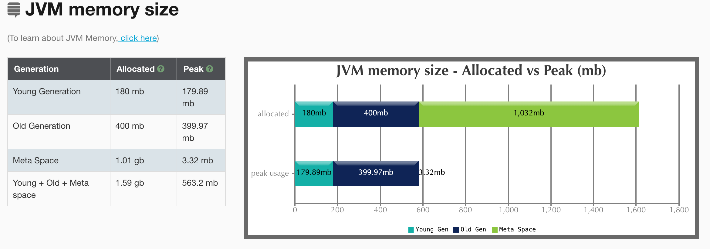

​	吞吐量和停顿时间分析结果如下图所示，其中吞吐量为15.663%，平均停顿时间为7.78ms，最长停顿时间为20.0ms。

<div style="text-align:center;font-weight:bold;">吞吐量和停顿时间报告</div>

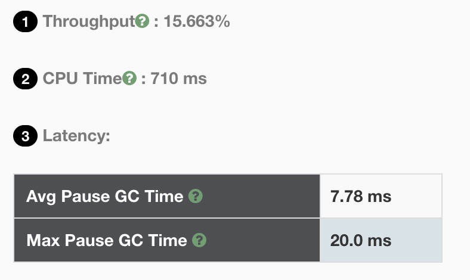

垃圾收集报告如下图所示，可以看到GC的次数、收集的内存空间、总时间、平均时间、最短时间和最长时间等相关信息。

<div style="text-align:center;font-weight:bold;">GC报告
</div>

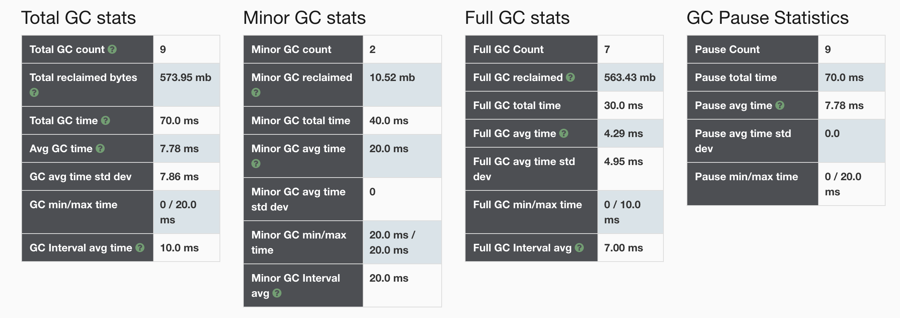

### 24.6.2 GCViewer

​	上面介绍了一款在线的GC日志分析器，下面介绍一款离线版的GCViewer。GCViewer是一个免费的、开源的分析小工具，用于可视化查看由SUN/Oracle、IBM、HP和BEA虚拟机产生的垃圾收集器的日志。

​	GCViewer用于可视化JVM参数-verbose:gc和.NET生成的数据-Xloggc:<file>。它还计算与垃圾收集相关的性能指标，比如吞吐量、累积的暂停、最长的暂停等。当通过更改世代大小或设置初始堆大小来调整特定应用程序的垃圾收集时，此功能非常有用。

**1 下载GCViewer工具**

​	网址：https://github.com/chewiebug/GCViewer

​	下载完成之后执行mvn clean install -Dmaven.test.skip=true命令进行编译，编译完成后在target目录下会看到jar包，打开即可。也可以直接下载运行版本。

**2 运行**

​	通过java命令即可运行该工具，命令如下。

```bash
% java -jar ~/Misc/gcviewer-1.36.jar 
```

​	打开界面如下图所示。

<div style="text-align:center;font-weight:bold;">GCViewer打开界面</div>

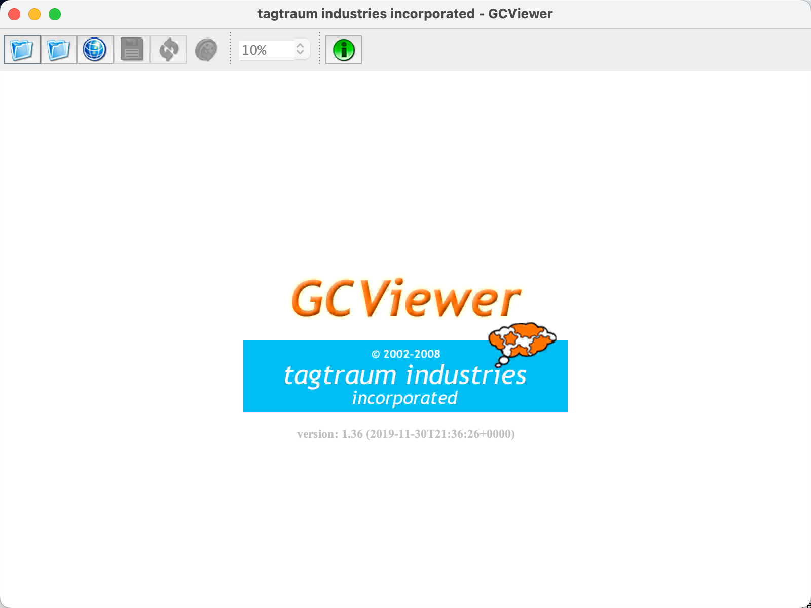

​	打开之后，选择“File”→“Open File”选项，选择GC日志，可以看到下图所示页面，图标是可以放大缩小的，主要内容就是图中标记的部分，里面的内容跟上面的GCeasy比较类似。

<div style="text-align:center;font-weight:bold;">GCViewer报告图表</div>

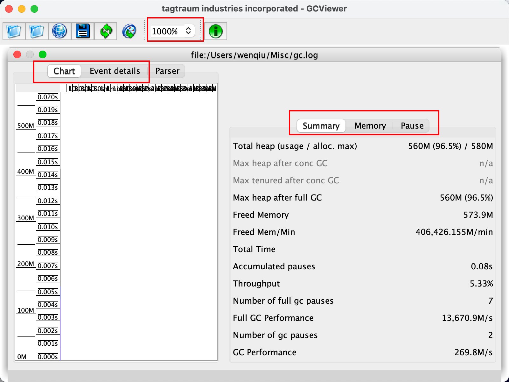

​	Chart图标中各个颜色代表的含义如下图所示。

<div style="text-align:center;font-weight:bold;">GC日志报告图标颜色含义</div>

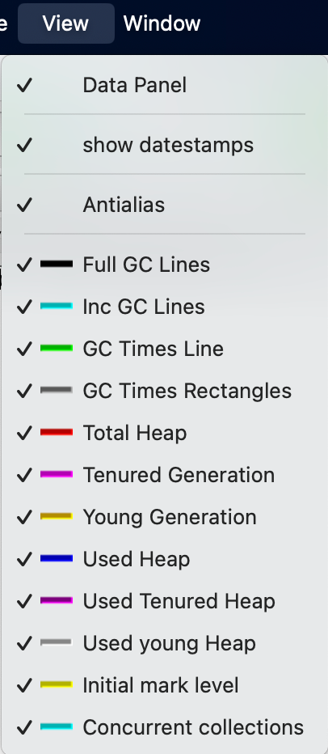

​	Full GC Lines表示Full GC。

​	Inc GC Lines表示增量GC。

​	GC Times Line表示垃圾收集时间。

​	GC Times Rectangles表示垃圾收集器时间区域。

​	Total Heap表示总堆大小。

​	Tenured Generation表示老年代。

​	日志分析报告如下图所示，可以得知其中经过Full GC之后最大堆内存大小为1615.8M，吞吐量是84.29%。

​	内存报告如图24-10所示，可以得知老年代分配内存400M，新生代分配内存180M等信息。

<div style="text-align:center;font-weight:bold;">GC日志报告汇总</div>

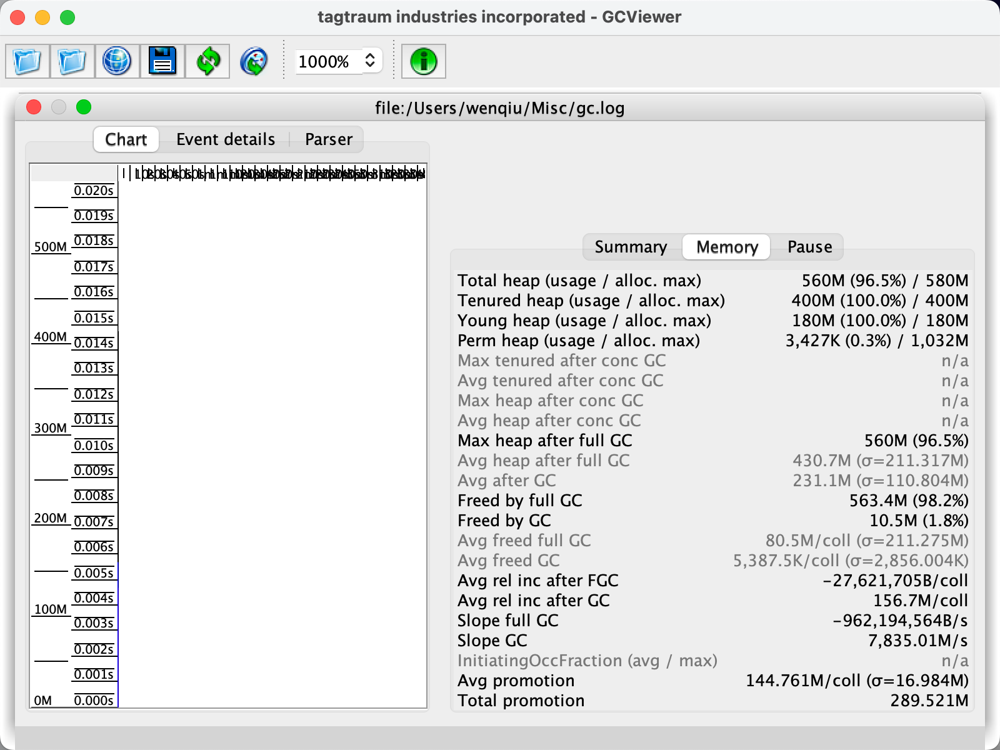

​	停顿时间相关的报告如下图所示，可以得知总的停顿报告和Full GC相关的报告以及GC的停顿报告。停顿总时间为0.08s，停顿次数为9次，Full GC的停顿时间为0.04s，次数为7次。

<div style="text-align:center;font-weight:bold;">GC停顿时间</div>

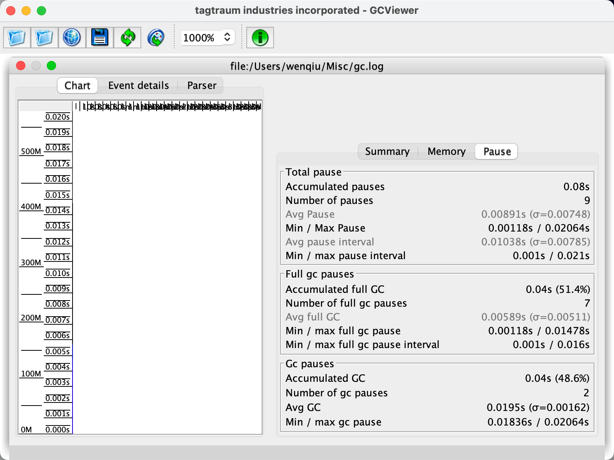

### 24.6.3 其他工具

​	GChisto也是一款专业分析垃圾收集器日志的工具，可以通过垃圾收集器日志来分析Minor GC、Full GC的次数、频率、持续时间等。最后通过列表、报表、图表等不同形式来反映垃圾收集器的情况。

​	另外还有HPjmeter，该工具很强大，但只能打开由-verbose:gc和-Xloggc:gc.log参数生成的GC日志。添加其他参数生成的gc.log无法打开。

## 24.7 根据日志信息解析堆空间数据分配

​	各位读者请看如下代码，运行代码的时候加入以下JVM参数配置，该参数可以使得老年代和新生代的内存分别是10M，垃圾收集器使用Serial GC。首先在JDK7中测试。

```bash
-verbose:gc -Xms20M -Xmx20M -Xmn10M -XX:+PrintGCDetails-XX:SurvivorRatio=8 -XX:+UseSerialGC
```

​	如下代码的意思很简单，分别申请四个数组，前面三个数组的大小分别是2M，最后一个数组大小是5M。

<span style="color:#40E0D0;">案例1：堆内存分配</span>

- 代码

```java
package com.coding.jvm06.collector;

/**
 * 在JDK7 和 JDK8中分别执行
 * -verbose:gc -Xms20M -Xmx20M -Xmn10M -XX:+PrintGCDetails -XX:SurvivorRatio=8 -XX:+UseSerialGC -Xloggc:./logs/gc.log
 */
public class GCLogTest2 {

    private static final int _1MB = 1024 * 1024;

    public static void testAllocation() {
        byte[] allocation1, allocation2, allocation3, allocation4;
        allocation1 = new byte[2 * _1MB];
        allocation2 = new byte[2 * _1MB];
        allocation3 = new byte[2 * _1MB];
        allocation4 = new byte[5 * _1MB];
    }

    public static void main(String[] args) {
        testAllocation();
    }
}

```

​	当堆内存中存储allocation4对象时发现Eden区中的内存不足，S0区和S1区的空间也不足以存下新对象，如下图所示。

<div style="text-align:center;font-weight:bold;">堆空间存放第四个对象之前</div>

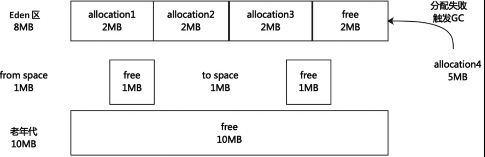

​	这时进行GC把Eden区中的数据转移到老年代，再把新对象的数据存放到Eden区，结果如图24-13所示。Eden区放入对象allocation4，老年代放入另外三个数组对象，内存大小总和为6M，占比60%。

​	其日志输出结果如下图所示。可以看到Eden区占比为65%，老年代占比为60%，正好对应了前面的说法。

<div style="text-align:center;font-weight:bold;">堆空间存放第四个对象之后</div>

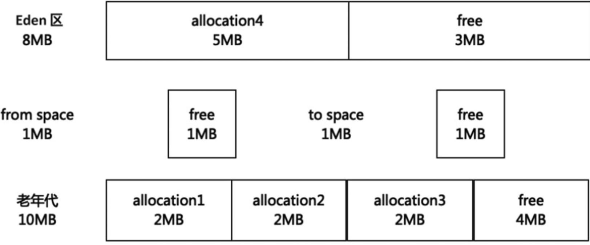

<div style="text-align:center;font-weight:bold;">JDK 7堆内存的分布情况</div>

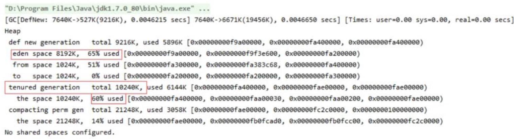

​	需要注意的是在JDK 1.8中，可能出现两种结果，一种是老年代占比为60%，和JDK 1.7中内存分配是一样的，还有一种情况是老年代占比为40%，这是由于JDK 1.8小版本号的不同导致的，这里的40%指的是allocation1和allocation2的内存之和，allocation3并没有转移到老年代，这只是小版本号之间的差异，读者只要能够根据GC日志分析清楚哪些对象在哪个区域即可。

​	如果使用的是ParallelGC，也可能出现直接把allocation4放入老年代的情况，占比为50%，其日志输出结果如下图所示。

<div style="text-align:center;font-weight:bold;">JDK 8堆内存的分布情况</div>

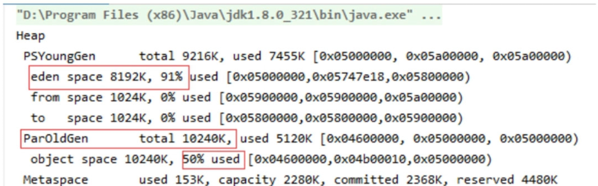


# 第25章 OOM分类及解决方案

​	在工作中会经常遇到内存溢出(Out Of Memory,OOM)异常的情况，每当遇到OOM，总是让人头疼不已，不知如何下手解决。本章汇总了OOM产生的不同场景，从案例出发，模拟产生不同类型的OOM，针对不同类型的OOM给出相应的解决方案。

## 25.1 概述

​	当JVM没有足够的内存来为对象分配空间，并且垃圾回收器也已经没有空间可回收时，就会抛出OOM异常。OOM可以分为四类，分别是堆内存溢出、元空间溢出、GC overhead limit exceeded和线程溢出。

## 25.2 OOM案例1：堆内存溢出

​	堆内存溢出报错信息如下。

```java
java.lang.OutOfMemoryError:Java heap space
```

​	模拟线上环境产生OOM，如下代码所示。

<span style="color:#40E0D0;">案例1：模拟线上环境产生OOM</span>

- 代码

```bash
package com.coding.jvm06.gc;

import java.util.ArrayList;

/**
 * -Xms200M
 * -Xmx200M
 * -XX:MetaspaceSize=64M
 * -XX:+PrintGCDetails
 * -XX:+PrintGCDateStamps
 * -Xloggc:/Users/wenqiu/Misc/gc-oom.log
 * -XX:+HeapDumpOnOutOfMemoryError
 * -XX:HeapDumpPath=/Users/wenqiu/Misc/heapdump.hprof
 */
public class HeapOOM {
    byte[] buffer = new byte[1 * 1024 * 1024]; // 1MB

    public static void main(String[] args) {
        ArrayList<HeapOOM> list = new ArrayList<HeapOOM>();

        int count = 0;
        try {
            while (true) {
                list.add(new HeapOOM());
                count++;
            }
        } catch (Exception e) {
            e.printStackTrace();
        } finally {
            System.out.println("count = " + count);
        }
    }
}

```

​	JVM参赛配置如下：

```bash
-Xms200M
-Xmx200M
-XX:MetaspaceSize=64M
-XX:+PrintGCDetails
-XX:+PrintGCDateStamps
-Xloggc:/Users/wenqiu/Misc/gc-oom.log
-XX:+HeapDumpOnOutOfMemoryError
-XX:HeapDumpPath=/Users/wenqiu/Misc/heapdump.hprof
```

​	运行结果如下所示。

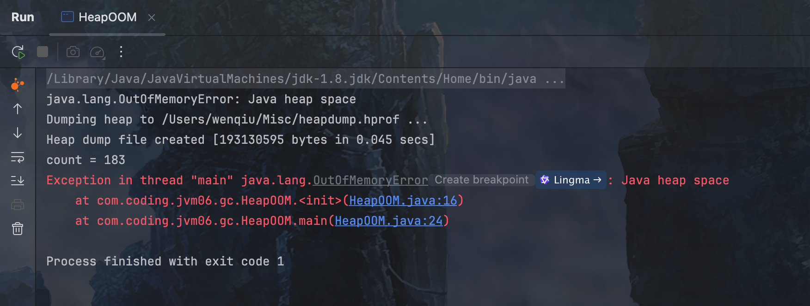

​	运行程序得到heapdump.hprof文件，在设置的heap目录下，如下图所示。

<div style="text-align:center;font-weight:bold;">heapdump.hprof</div>

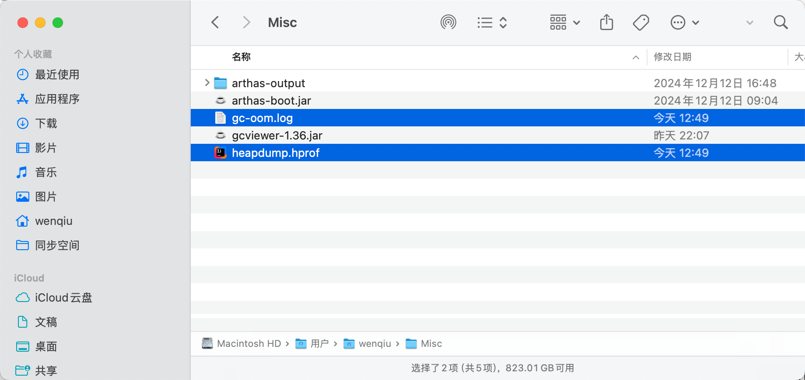

​	由于我们当前设置的内存比较小，所以该文件比较小，但是正常在线上环境，该文件是比较大的，通常以G为单位。

​	下面使用工具分析堆内存文件heapdump.hprof，通过Java VisualVM工具查看哪个类的实例占用内存最多，这样就可以初步定位到问题所在。如下图所示，可以看到在堆内存中存在大量的byte[]对象，占用了99.8%内存，进一步查看得知是HeapOOM实例，基本上就可以定位问题所在了。当然这里的代码比较简单，在工作中，定位问题的思路基本一致。

<div style="text-align:center;font-weight:bold;">Java VisualVM打开heapdump.hprof</div>


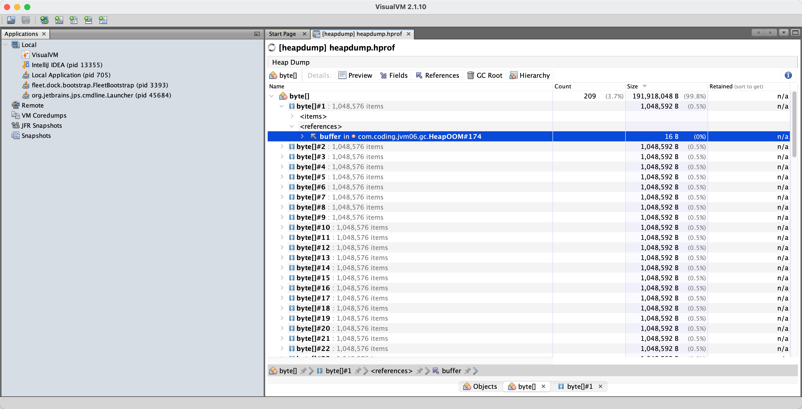

​	内存溢出的原因有很多，比如代码中存在大对象分配，导致没有足够的内存空间存放该对象；再比如应用存在内存泄漏，导致在多次垃圾收集之后，依然无法找到一块足够大的内存容纳当前对象。

​	对于堆溢出的解决方法，这里提供如下思路。

​	(1)检查是否存在大对象的分配，最有可能的是大数组分配。

​	(2)通过jmap命令，把堆内存dump下来，使用内存分析工具分析导出的堆内存文件，检查是否存在内存泄漏的问题。

​	(3)如果没有找到明显的内存泄漏，考虑加大堆内存。

​	(4)检查是否有大量的自定义的Finalizable对象，也有可能是框架内部提供的，考虑其存在的必要性。

## 25.3 OOM案例2：元空间溢出

​	方法区与堆一样，是各个线程共享的内存区域，它用于存储已被JVM加载的类信息、常量、静态变量、即时编译器编译后的代码等数据。JDK 8后，元空间替换了永久代来作为方法区的实现，元空间使用的是本地内存。

​	Java虚拟机规范对方法区的限制非常宽松，除了和堆一样不需要连续的内存和可以选择固定大小或者可扩展外，还可以选择不实现垃圾收集。垃圾收集行为在这个区域是比较少出现的，其内存回收目标主要是针对常量池的回收和对类型的卸载。当元空间无法满足内存分配需求时，将抛出OOM异常。元空间溢出报错信息如下。

```bash
java.lang.OutOfMemoryError:Metaspace
```

​	元空间溢出可能有如下几种原因。

​	(1)运行期间生成了大量的代理类，导致元空间被占满，无法卸载。

​	(2)应用长时间运行，没有重启。

​	(3)元空间内存设置过小。

​	该类型内存溢出解决方法有如下几种。

​	(1)检查是否永久代空间或者元空间设置得过小。

​	(2)检查代码中是否存在大量的反射操作。

​	(3)dump之后通过mat检查是否存在大量由于反射生成的代理类。

​	如下代码所示，代码含义是使用动态代理产生类使得元空间溢出。

<span style="color:#40E0D0;">案例1：元空间溢出</span>

- 代码

```bash
package com.coding.jvm07.gui;

import org.springframework.cglib.proxy.Enhancer;
import org.springframework.cglib.proxy.MethodInterceptor;

import java.lang.management.ClassLoadingMXBean;
import java.lang.management.ManagementFactory;

/**
 * -Xms60M
 * -Xmx60M
 * -Xss512K
 * -XX:SurvivorRatio=8
 * -XX:MetaspaceSize=60M
 * -XX:MaxMetaspaceSize=60M
 * -XX:+PrintGCDetails
 * -XX:+PrintGCDateStamps
 * -Xloggc:/Users/wenqiu/Misc/metaspace-oom.log
 * -XX:+HeapDumpOnOutOfMemoryError
 * -XX:HeapDumpPath=/Users/wenqiu/Misc/metaspacedump.hprof
 * -XX:+TraceClassLoading
 * -XX:+TraceClassUnloading
 */
public class MetaspaceOOM {

    public static void main(String[] args) {
        ClassLoadingMXBean classLoadingMXBean = ManagementFactory.getClassLoadingMXBean();
        while (true) {
            Enhancer enhancer = new Enhancer();
            enhancer.setSuperclass(People.class);
            enhancer.setUseCache(false);
            enhancer.setCallback((MethodInterceptor) (o, method, objects, methodProxy) -> {
                System.out.println("我是加强类哦，输出print之前的加强方法");
                return methodProxy.invokeSuper(o, objects);
            });
            People people = (People) enhancer.create();
            people.print();
            System.out.println(people.getClass());
            System.out.println("totalClass:" + classLoadingMXBean.getTotalLoadedClassCount());
            System.out.println("activeClass:" + classLoadingMXBean.getLoadedClassCount());
            System.out.println("unloadedClass:" + classLoadingMXBean.getUnloadedClassCount());
        }

    }
}

class People {
    public void print() {
        System.out.println("我是 print 本人");
    }
}

```

​	JVM参数配置如下。

```bash
-Xms60M
-Xmx60M
-Xss512K
-XX:SurvivorRatio=8
-XX:MetaspaceSize=60M
-XX:MaxMetaspaceSize=60M
-XX:+PrintGCDetails
-XX:+PrintGCDateStamps
-Xloggc:/Users/wenqiu/Misc/metaspace-oom.log
-XX:+HeapDumpOnOutOfMemoryError
-XX:HeapDumpPath=/Users/wenqiu/Misc/metaspacedump.hprof
-XX:+TraceClassLoading
-XX:+TraceClassUnloading
```

​	运行结果如下所示。

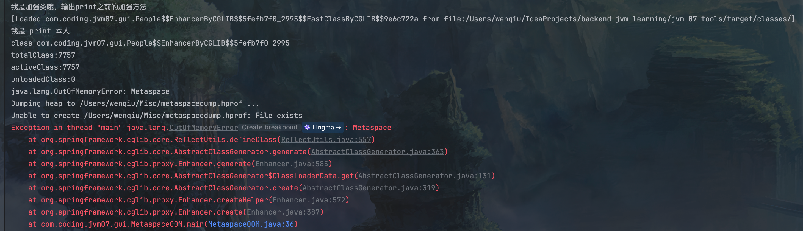

​	查看监控，如下图所示。

<div style="text-align:center;font-weight:bold;">Java VisualVM打开metaspacedump.hprof</div>


​	从上图中可以看到元空间几乎已经被全部占用。查看GC状态，如下图所示。

<div style="text-align:center;font-weight:bold;">查看GC状态</div>

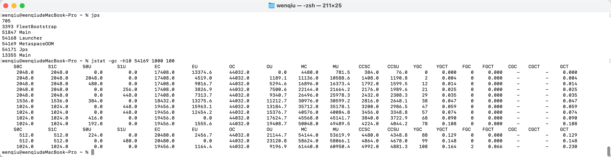

​	可以看到，Full GC非常频繁，而且元空间占用了61440KB即60MB空间，几乎把整个元空间占用。所以得出的结论是方法区空间设置过小，或者存在大量由于反射生成的代理类。查看GC日志如下。

```bash
2024-12-16T17:28:14.446-0800: 1.440: [GC (Allocation Failure) [PSYoungGen: 19744K->256K(20480K)] 43799K->24479K(64512K), 0.0004820 secs] [Times: user=0.00 sys=0.00, real=0.00 secs] 
2024-12-16T17:28:14.456-0800: 1.450: [GC (Allocation Failure) [PSYoungGen: 19712K->320K(20480K)] 43935K->24719K(64512K), 0.0005688 secs] [Times: user=0.00 sys=0.00, real=0.00 secs] 
2024-12-16T17:28:14.459-0800: 1.453: [GC (Metadata GC Threshold) [PSYoungGen: 4600K->160K(20480K)] 28999K->24727K(64512K), 0.0003805 secs] [Times: user=0.00 sys=0.01, real=0.00 secs] 
2024-12-16T17:28:14.459-0800: 1.453: [Full GC (Metadata GC Threshold) [PSYoungGen: 160K->0K(20480K)] [ParOldGen: 24567K->19396K(44032K)] 24727K->19396K(64512K), [Metaspace: 61008K->61008K(110592K)], 0.0417020 secs] [Times: user=0.33 sys=0.02, real=0.05 secs] 
2024-12-16T17:28:14.501-0800: 1.495: [GC (Last ditch collection) [PSYoungGen: 0K->0K(20480K)] 19396K->19396K(64512K), 0.0012258 secs] [Times: user=0.01 sys=0.00, real=0.00 secs] 
2024-12-16T17:28:14.502-0800: 1.496: [Full GC (Last ditch collection) [PSYoungGen: 0K->0K(20480K)] [ParOldGen: 19396K->9199K(44032K)] 19396K->9199K(64512K), [Metaspace: 61008K->60915K(110592K)], 0.0230976 secs] [Times: user=0.14 sys=0.01, real=0.02 secs] 
```

​	可以看到Full GC是由于元空间不足引起的，那么接下来分析到底是什么数据占用了大量的方法区。导出dump文件，使用Java VisualVM分析。

​	首先确定是哪里的代码发生了问题，可以通过线程来确定，因为在实际生产环境中，有时候无法确定是哪块代码引起的OOM，那么就需要先定位问题线程，然后定位代码，如下图所示。

<div style="text-align:center;font-weight:bold;">Java VisualVM打开metaspacedump.hprof</div>

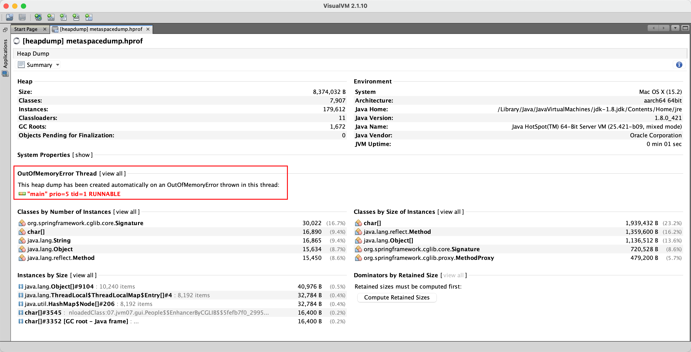

​	定位到问题线程之后，使用MAT工具打开继续分析，如下图所示，先打开线程视图，然后根据线程名称打开对应线程的栈信息，最后找到对应的代码块。

<div style="text-align:center;font-weight:bold;">MAT打开metaspacedump.hprof</div>

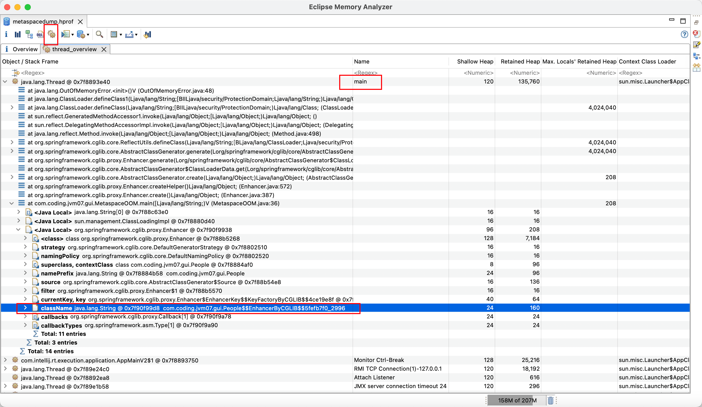

​	定位到代码以后，发现有使用到cglib动态代理，那么猜想问题是由于产生了很多代理类。接下来，可以通过包看一下类加载情况。由于代码是代理的People类，所以直接打开该类所在的包，如下图所示。

<div style="text-align:center;font-weight:bold;">打开类所在的包</div>

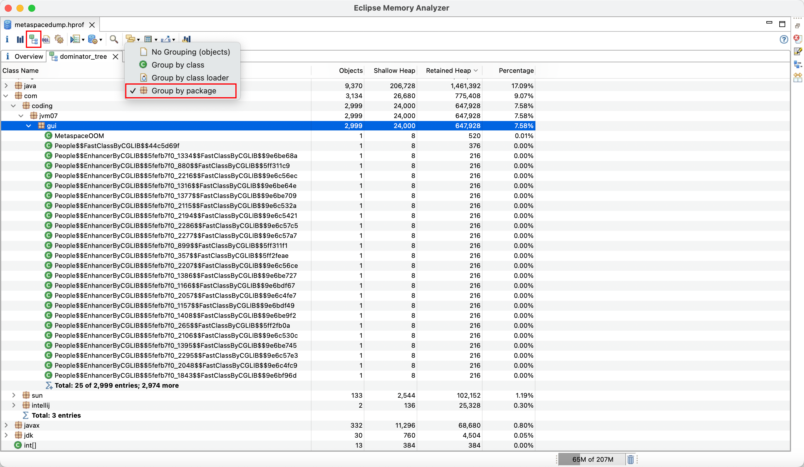

​	可以看到确实加载了很多的代理类，想一下解决方案，是不是可以只加载一个代理类以及控制循环的次数，当然如果业务上确实需要加载很多类的话，就要考虑增大方法区大小和控制循环的次数，所以这里修改代码如下。

```java
enhancer.setUseCache(true);
```

​	修改代码enhancer.setUseCache(false)。当设置为true的话，表示开启cglib静态缓存，这样每次动态代理的结果是生成同一个类。再看程序运行结果如下。


​	可以看到，生成代理类的数量几乎不变，元空间也没有溢出。到此，问题解决。如果需要生成不同的类，调整代码更改循环次数即可。

## 25.4 OOM案例3：GC overhead limit exceeded

​	出现GC overhead limit exceeded这个错误是由于JVM花费太长时间执行GC，且只能回收很少的堆内存。根据Oracle官方文档表述，默认情况下，如果Java进程花费98%以上的时间执行GC，并且每次只有不到2%的堆被恢复，则JVM抛出GC overhead limit exceeded错误。换句话说，这意味着应用程序几乎耗尽了所有可用内存，垃圾收集器花了太长时间试图清理它，并多次失败。这本质是一个预判性的异常，抛出该异常时系统没有真正的内存溢出，GC overhead limit exceeded异常的最终结果是Java heap space。

​	在这种情况下，用户会体验到应用程序响应非常缓慢，通常只需要几毫秒就能完成的某些操作，此时则需要更长的时间来完成，这是因为所有的CPU正在进行垃圾收集，因此无法执行其他任务。使用如下代码演示GC overhead limit exceeded异常。

<span style="color:#40E0D0;">案例1：GC overhead limit exceeded</span>

- 代码

```java
package com.coding.jvm07.gui;

import java.util.ArrayList;
import java.util.List;
import java.util.UUID;

public class TestOOM {
    public static void main(String[] args) {
        test2();
    }

    public static void test1() {
        int i = 0;
        List<String> list = new ArrayList<>();
        try {
            while (true) {
                list.add(UUID.randomUUID().toString().intern());
                i++;
            }
        } catch (Exception e) {
            System.out.println("********i:" + i);
            e.printStackTrace();
            throw new RuntimeException(e);
        }
    }

    public static void test2() {
        Integer i = 0;
        String str = "";
        try {
            while (true) {
                str += UUID.randomUUID();
                i++;
            }
        } catch (Exception e) {
            System.out.println("********i:" + i);
            e.printStackTrace();
            throw new RuntimeException(e);
        }
    }
}

```

​	JVM配置如下所示。

```bash
-Xms10M
-Xmx10M
-XX:+PrintGCDetails
-XX:+PrintGCDateStamps
-Xloggc:/Users/wenqiu/Misc/exceeded-oom.log
-XX:+HeapDumpOnOutOfMemoryError
-XX:HeapDumpPath=/Users/wenqiu/Misc/exceededdump.hprof
```

​	test1()方法的含义是运行期间将内容放入常量池，运行结果是GC overhead limit exceeded错误。test2()方法的含义是不停地追加字符串str，运行结果是Java heap space错误。读者可能会疑惑，看似test1()方法和test2()方法也没有太大的差别，为什么test2()方法没有报GC overhead limit exceeded呢？以上两个方法的区别在于发生Java heap space的test2()方法每次都能回收大部分的对象（中间产生的UUID），只不过有一个对象是无法回收的，慢慢长大，直到内存溢出。发生GC overhead limit exceeded的test1()方法由于每个字符串都在被list引用，所以无法回收，很快就用完内存，触发不断回收的机制。

​	需要注意的是，有些版本的JDK，有可能不会发生GC overhead limit exceeded，各位读者知道即可。该案例报错信息如下。


​	通过查看GC日志可以发现，系统在频繁地做Full GC，但是却没有回收多少空间，那么引起的原因可能是内存不足，也可能是存在内存泄漏的情况，接下来我们要根据堆内存文件具体分析GC overhead limit exceeded的原因。

**1 定位问题代码块**

​	通过线程分析，可以定位发生OOM的代码块，如下图所示。

<div style="text-align:center;font-weight:bold;">定位发生OOM的代码块</div>

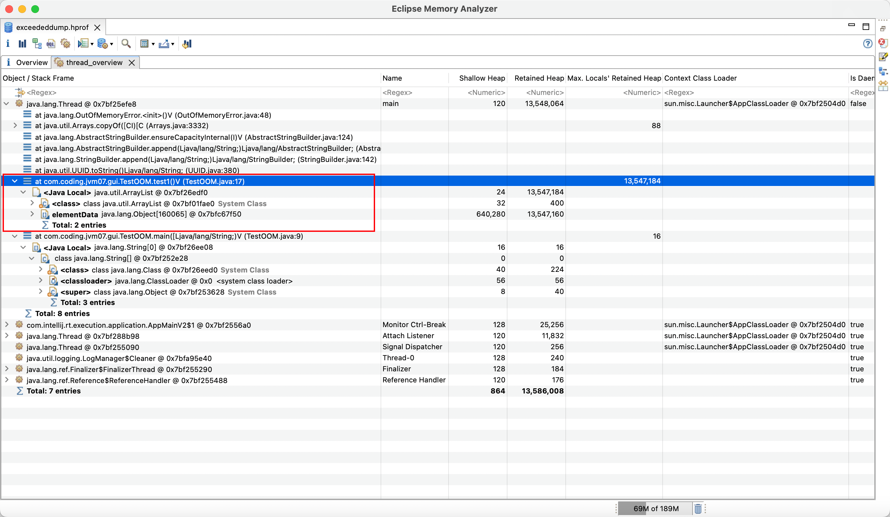

**2 分析堆内存文件**

​	可以看到发生OOM是因为死循环，不停地往ArrayList存放字符串常量，JDK 1.7以后，字符串常量池移到了堆中存储，所以最终导致内存不足发生了OOM。

​	打开“Histogram”选项，如下图所示。可以看到，String类型的字符串占用了大概12M的空间，几乎把堆占满，但是还没有占满，所以这也符合官方对此异常的定义。

<div style="text-align:center;font-weight:bold;">打开“Histogram”选项</div>

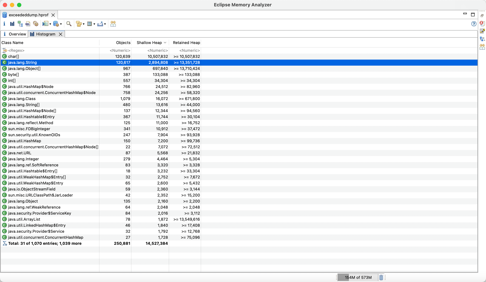

​	右击选择“List objects”，列出上图中对象下面的所有引用对象，如下图所示，可以看到所有String对象。

<div style="text-align:center;font-weight:bold;">列出所有引用对象</div>

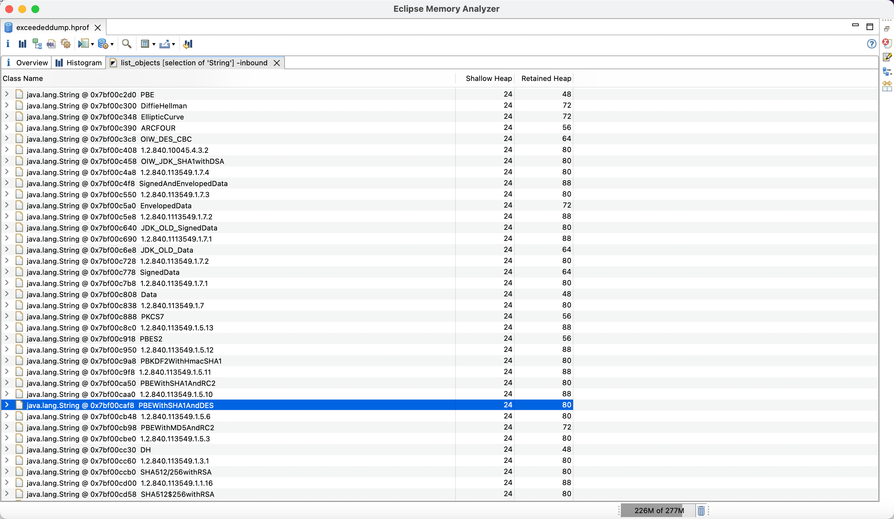

**3 解决方案**

​	这个是JDK 6新加的错误类型，一般都是堆空间不足导致的。针对该问题的解决方法如下。

​	(1)检查项目中是否有大量的死循环或有使用大内存的代码，优化代码。

​	(2)添加JVM参数-XX:-UseGCOverheadLimit禁用这个检查，其实这个参数解决不了内存问题，只是把错误的信息延后，最终出现java.lang.OutOfMemoryError:Java heap space。

​	(3)导出堆内存文件，如果没有发生内存泄漏，加大内存即可。

## 25.5 OOM案例4：线程溢出

​	线程溢出报错信息如下。

```bash
java.lang.OutOfMemoryError :unable to create new native Thread
```

​	线程溢出是因为创建的了大量的线程。出现此种情形之后，可能造成系统崩溃。如下代码模拟了线程溢出。

<div style="text-align:center;font-weight:bold;">线程溢出</div>

<span style="color:#40E0D0;">案例1：线程溢出</span>

- 代码

```java
package com.coding.jvm07.gui;

import java.util.concurrent.CountDownLatch;

public class TestNativeOutOfMemoryError {
    public static void main(String[] args) {
        for (int i = 0; ; i++) {
            System.out.println("i=" + i);
            new Thread(new HoldThread()).start();
        }
    }
}

class HoldThread extends Thread {
    CountDownLatch cd1 = new CountDownLatch(1);

    @Override
    public void run() {
        try {
            cd1.await();
        } catch (InterruptedException e) {
        }
    }
}
```

​	结果如下。

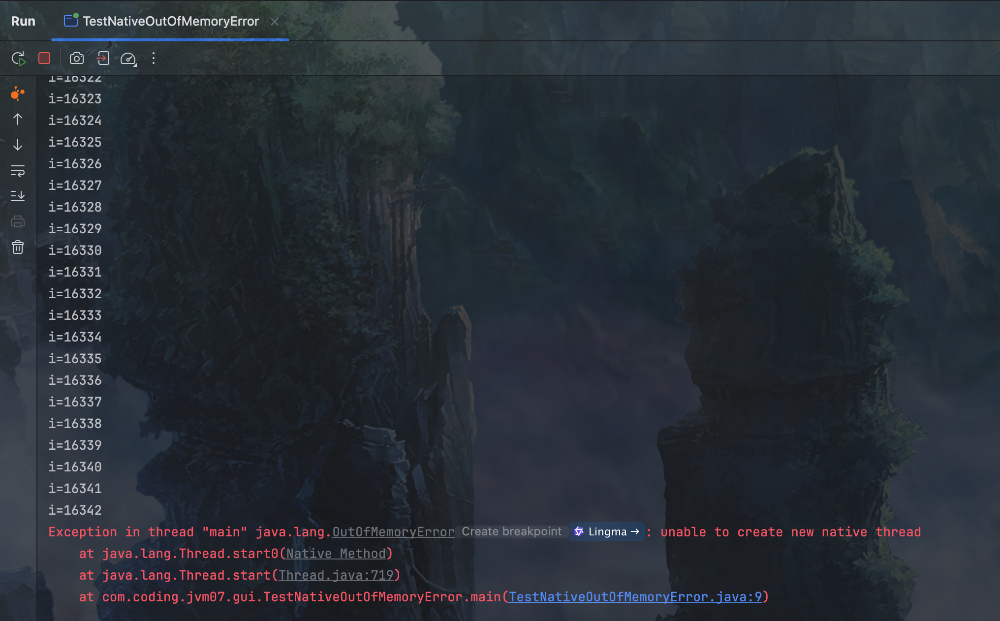

​	JDK 5.0以后栈默认为1MB，以前栈默认为256KB。根据应用的线程所需内存大小进行调整，通过参数-Xss设置栈内存。在相同物理内存下，减小这个值能生成更多的线程。但是操作系统对一个进程内的线程数还是有限制的，不能无限生成，经验值是3000～5000。

​	操作系统能创建的线程数的具体计算公式如下。

```bash
(MaxProcessMemory - JVMMemory - ReservedOsMemory)/(ThreadStackSize) =Number of threads
```

​	其中各项代表含义如下。

​	(1)MaxProcessMemory表示进程可寻址的最大空间。

​	(2)JVMMemory表示JVM内存。

​	(3)ReservedOsMemory表示保留的操作系统内存。	

​	(4)ThreadStackSize表示线程栈的大小。

​	在Java语言里，JVM在创建一个Thread对象的同时创建一个操作系统线程，而这个系统线程的内存用的不是JVMMemory，而是系统中剩下的内存(RemainMemory)，计算公式如下。

```bash
MaxProcessMemory - JVMMemory – ReservedOsMemory = RemainMemory
```

​	由公式得出：JVM分配内存越多，那么能创建的线程越少，越容易发生java.lang.OutOfMemoryError:unable to create new native thread。

​	针对该问题的解决方案如下。

​	(1)如果程序中有bug，导致创建大量不需要的线程或者线程没有及时回收，那么必须解决这个bug，修改参数是不能解决问题的。

​	(2)如果程序确实需要大量的线程，现有的设置不能达到要求，那么可以通过修改MaxProcessMemory、JVMMemory和ThreadStackSize三个因素，来增加能创建的线程数。比如使用64位操作系统可以增大MaxProcessMemory、减少JVMMemory的分配或者减小单个线程的栈大小。

​	在实验过程中，64位操作系统下调整Xss的大小并没有对产生线程的总数产生影响，程序执行到极限的时候，操作系统会死机，无法看出效果。

​	在32位Win7操作系统下测试，发现调整Xss的大小会对线程数量有影响，随着Xss值的变大，线程数量越来越少。如下表所示，其中JDK版本是1.8（适配32位操作系统）。

<div style="text-align:center;font-weight:bold;">32位Win7操作系统Xss值对线程数量的影响结果</div>


​	Xss参数的调整对于64位操作系统的实验结果是不明显的，但是对于32位操作系统的实验结果却是非常明显的，为什么会有这样的区别呢？上面讲到过线程数量的计算公式如下所示。

```bash
(MaxProcessMemory - JVMMemory - ReservedOsMemory)/(ThreadStackSize) =Number of threads
```

​	MaxProcessMemory表示最大寻址空间，在32位系统中，CPU的寻址范围就受到32个二进制位的限制。32位二进制数最大值是11111111 11111111 11111111 11111111,2的32次方=4294967296B = 4194304KB = 4096M =4GB。也就是说32位CPU只能访问4GB的内存。再减去显卡上的显存等内存，可用内存要小于4GB，所以32位操作系统可用线程数量是有限的。

​	64位二进制数的最大值是11111111 11111111 11111111 11111111 11111111 11111111 11111111 11111111,2的64次方=17179869184GB，大家可以看看64位操作的寻址空间大小比32位操作系统多了太多，所以这也是我们总是无法测试出很好效果的原因。

​	综上，在生产环境下如果需要更多的线程数量，建议使用64位操作系统，如果必须使用32位操作系统，可以通过调整Xss的大小来控制线程数量。除此之外，线程总数也受到系统空闲内存和操作系统的限制。

# 第26章 性能优化案例

​	前面我们已经学了很多JVM的相关知识，比如运行时数据区的划分、垃圾收集、字节码文件结构和各种性能分析工具。相信大家对JVM也有了比较深入的了解，正所谓实践出真知，学习完理论知识，接下来就要在Java应用中检验JVM知识的使用。本章将从案例出发，从不同的方面优化应用的性能。

## 26.0 安装JMeter

官网：https://jmeter.apache.org/

下载页面：https://jmeter.apache.org/download_jmeter.cgi

老版本下载页面：https://archive.apache.org/dist/jmeter/binaries/

比如，下载：apache-jmeter-5.6.3.zip

然后，解压安装即可！！！解压，即安装！

- 启动

双击：安装目录/bin/jmeter.bat 

- 配置中文

  - 临时

    Options=>Choose Language=>Chinese(Simplified)

  - 永久

  打开安装目录/bin/jmeter.properties，找到`#language=en`，并添加如下内容：

  ```properties
  #language=en
  language=zh_CN
  ```


## 26.1 概述

​	JVM性能调优的目标就是减少GC的频率和Full GC的次数，使用较小的内存占用来获得较高的吞吐量或者较低的延迟。程序在运行过程中多多少少会出现一些与JVM相关的问题，比如CPU负载过高、请求延迟过长、tps降低等。更甚至系统会出现内存泄漏、内存溢出等问题进而导致系统崩溃，因此需要对JVM进行调优，使得程序在正常运行的前提下，用户可以获得更好的使用体验。一般来说，针对JVM调优有以下几个比较重要的指标。

​	(1)内存占用：程序正常运行需要的内存大小。

​	(2)延迟：由于垃圾收集而引起的程序停顿时间。

​	(3)吞吐量：用户程序运行时间占用户程序和垃圾收集占用总时间的比值，这里针对的是JVM层面的吞吐量，需要区别于后面讲到的Apache JMeter的吞吐量，JMeter中的吞吐量表示服务器每秒处理的请求数量。

​	当然，调优时所考虑的方向也不同，在调优之前，必须要结合实际场景，有明确的优化目标，找到性能瓶颈，对瓶颈有针对性的优化，最后测试优化后的结果，通过各种监控工具确认调优后的结果是否符合目标。

​	调优监控的依据有哪些？

- 运行日志
- 异常堆栈
- GC日志
- 线程快照
- 堆转储快照

​	性能优化的步骤？

- 熟悉业务场景
- 发现问题：性能监控
  - GC频繁
  - CPU load过高
  - OOM
  - 内存泄露
  - 死锁
  - 程序响应时间过长
- 排查问题：性能分析
  - 打印GC日志，通过GCViewer或GCeasy来分析日志信息
  - 灵活运用命令行工具 jstack、jmap、jinfo等
  - dump出堆文件，使用内存分析工具分析文件
  - 使用阿里Arthas或jconsole、JVisualVM来实时查看JVM状态
  - jstack查看堆栈信息
- 解决问题：性能调优
  - 适当增加内存，根据业务背景选择垃圾回收器
  - 优化代码，控制内存使用
  - 增加机器，分散节点压力
  - 合理设置线程池线程数量
  - 使用中间件提高程序效率，比如缓存、消息队列等
  - 其他......

## 26.2 性能测试工具：Apache JMeter

​	Apache JMeter（简称JMeter）是Apache组织开发的基于Java的压力测试工具，用于对软件做压力测试。它最初用于Web应用测试，后来也扩展到其他测试领域。JMeter可以用于对服务器、网络或对象模拟巨大的负载，来自不同压力类别下测试它们的强度和分析整体性能。本章使用JMeter测试不同的虚拟机配置对性能的影响结果，下面介绍JMeter的基本使用流程。

(1)启动JMeter后一般会默认生成一个测试计划，如下图所示。

<div style="text-align:center;font-weight:bold;">JMeter主界面</div>

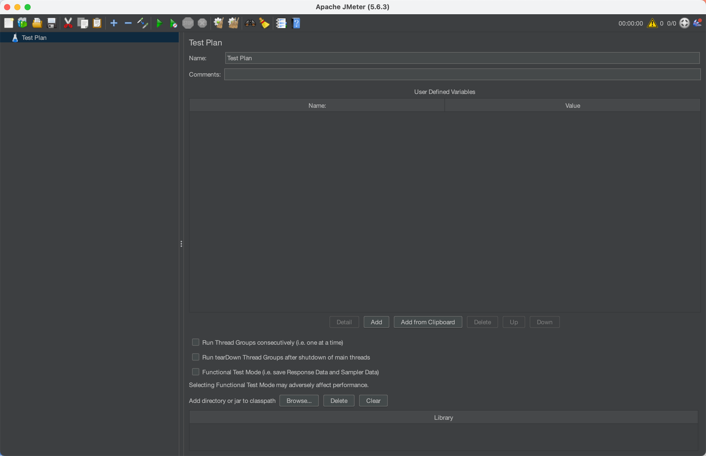

(2)在测试计划下添加线程组。线程组有以下几种重要的参数。

- 线程数：虚拟用户数，用于并发测试。
- Ramp-Up时间（秒）：这个参数表示准备时长，即设置的虚拟用户数需要多长时间全部启动。如果线程数为10，准备时长为2，那么需要2秒启动10个线程，也就是每秒启动5个线程。
- 循环次数：每个线程发送请求的次数。如果线程数为10，循环次数为1000，那么每个线程发送1000次请求。总请求数为10×1000=10000。如果勾选了“永远”，那么所有线程会一直发送请求，直到选择停止运行脚本，如下图所示。

​	对测试计划添加线程组：右键测试计划=>Add=>Threads(Users)=>ThreadGroup

<div style="text-align:center;font-weight:bold;">JMeter添加线程组</div>

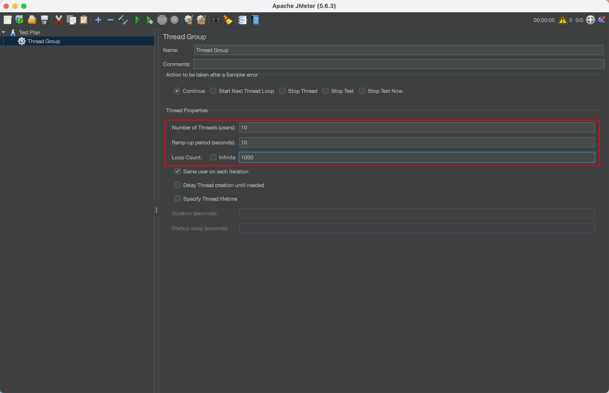

(3)新增HTTP采样器。

​	采样器用于对具体的请求进行性能数据的采样，如下图所示，本章案例添加HTTP请求的采样。

​	添加完HTTP采样器之后需要对请求的具体目标进行设置，比如目标服务器地址，端口号，路径等信息，具体含义如下。

- 协议：向目标服务器发送HTTP请求协议，可以是HTTP或HTTPS，默认为HTTP。
- 服务器名称或IP:HTTP请求发送的目标服务器名称或IP。
- 端口号：目标服务器的端口号，默认值为80。
- 方法：发送HTTP请求的方法，包括GET、POST、HEAD、PUT、OPTIONS、TRACE、DELETE等。
- 路径：目标URL路径（URL中去掉服务器地址、端口及参数后剩余部分）。
- 内容编码：编码方式，默认为ISO-8859-1编码，这里配置为utf-8。

​	JMeter会按照设置对目标进行批量的请求。

​	对线程组添加采样器：右键线程组=>Add=>Sampler=>Http Request

<div style="text-align:center;font-weight:bold;">JMeter添加HTTP采样器</div>

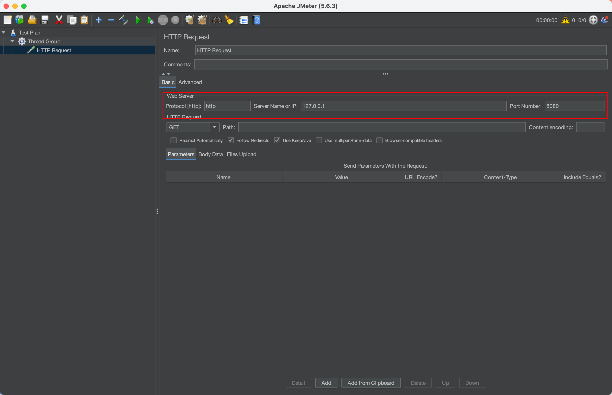

(4)添加监听器。

​	对于批量请求的访问结果，JMeter会以报告的形式展现出来，在监听器中，添加聚合报告，如下图所示。

​	对线程组添加采样器：右键线程组=>Add=>Listener=>Aggregate Report

<div style="text-align:center;font-weight:bold;">添加监听器</div>

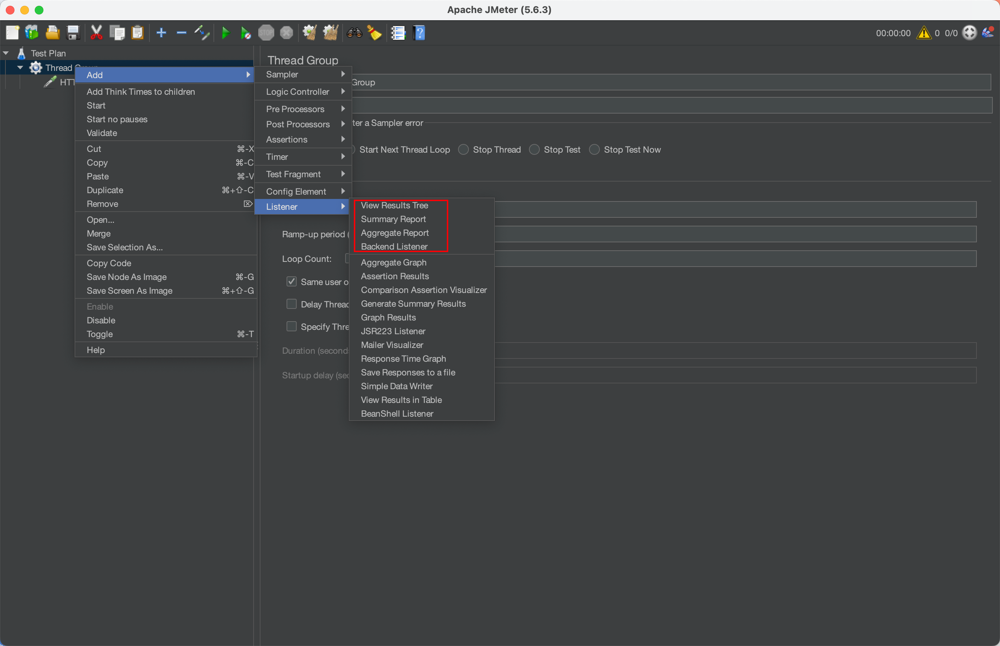

​	调试运行，分析指标数据、挖掘性能瓶颈、评估系统性能状态，主要查看聚合报告的结果，聚合报告中各个指标详解如下。

- Label：每个JMeter的元素（例如HTTP Request）都有一个Name属性，这里显示的就是Name属性的值。
- #Samples：这次测试中一共发出了多少个请求，如果模拟10个用户，每个用户迭代10次，那么这里显示100。
- Average：平均响应时间。默认情况下是单个请求的平均响应时间(ms)，当使用Transaction Controller时，以Transaction为单位显示平均响应时间。
- Median：中位数，也就是50%用户的响应时间。
- 90% Line:90%用户的响应时间。
- Min：最小响应时间。
- Max：最大响应时间。
- Error%：错误率，即错误请求数／请求总数。
- throughput：吞吐量。默认情况下表示每秒完成的请求数(Request per Second)。
- KB/Sec：每秒从服务器端接收到的数据量。

## 26.3 性能优化案例1：调整堆大小提高服务的吞吐量

​	案例创建Spring Boot项目，以便可以通过Web访问。这里使用JMeter模拟批量请求，如下代码所示。

<span style="color:#40E0D0;">案例1：Web服务</span>

- 代码之People

```java
package com.coding.jvm08.tuning01;

import lombok.Data;

@Data
public class People {
    private Integer id;
    private String name;
    private Integer age;
    private String sex;
    private String job;
}

```

- 代码之PeopleMapper

```java
package com.coding.jvm08.tuning01;

import java.util.List;

public interface PeopleMapper {

    List<People> getPeopleList();
}

```

- 代码之PeopleMapper.xml

```xml
<?xml version="1.0" encoding="UTF-8" ?>
<!DOCTYPE mapper PUBLIC "-//mybatis.org//DTD Mapper 3.0//EN" "http://mybatis.org/dtd/mybatis-3-mapper.dtd" >
<mapper namespace="com.coding.jvm08.tuning01.PeopleMapper">
    <select id="getPeopleList" resultType="com.coding.jvm08.tuning01.People">
        select id, name, age, sex, job
        from people;
    </select>
</mapper>
```

- 代码之PeopleService

```java
package com.coding.jvm08.tuning01;

import lombok.RequiredArgsConstructor;
import org.springframework.stereotype.Service;

import java.util.List;

@Service
@RequiredArgsConstructor
public class PeopleService {
    private final PeopleMapper peopleMapper;

    public List<People> getPeopleList() {
        return peopleMapper.getPeopleList();
    }
}

```

- 代码之Tuning01Controller

```java
package com.coding.jvm08.tuning01;

import lombok.RequiredArgsConstructor;
import org.springframework.beans.factory.annotation.Autowired;
import org.springframework.web.bind.annotation.RequestMapping;
import org.springframework.web.bind.annotation.RestController;

import java.util.List;

@RestController
@RequiredArgsConstructor
public class Tuning01Controller {

    private final PeopleService peopleService;

    @RequestMapping("/visit")
    public List<People> visit() {
        List<People> peopleList = peopleService.getPeopleList();
        return peopleList;
    }
}

```

- 代码之Application

```java
package com.coding.jvm08.tuning01;

import org.mybatis.spring.annotation.MapperScan;
import org.mybatis.spring.annotation.MapperScans;
import org.springframework.boot.SpringApplication;
import org.springframework.boot.autoconfigure.SpringBootApplication;

@MapperScan(value = {"com.coding.jvm08.tuning01"})
@SpringBootApplication
public class Application {

    public static void main(String[] args) {
        SpringApplication.run(Application.class, args);
    }

}
```

- 代码之application.properties

```properties
spring.datasource.username=root
spring.datasource.password=root123
spring.datasource.url=jdbc:mysql://localhost:3306/jvmdb?characterEncoding=utf-8&useSSL=false&serverTimezone=Asia/Shanghai
spring.datasource.driver-class-name=com.mysql.cj.jdbc.Driver
mybatis-plus.mapper-locations=classpath:mapper/**/*.xml
mybatis-plus.global-config.db-config.id-type=auto
```

- 数据库与初始化语句

```sql
-- 创建数据库
CREATE DATABASE IF NOT EXISTS jvmdb DEFAULT CHARACTER SET utf8mb4 COLLATE utf8mb4_unicode_ci;
-- 使用数据库
use jvmdb;

-- 创建数据表
DROP TABLE IF EXISTS people;
CREATE TABLE people
(
    `id`   INT AUTO_INCREMENT COMMENT '',
    `name` VARCHAR(255) COMMENT '',
    `age`  INT COMMENT '',
    `sex`  VARCHAR(255) COMMENT '',
    `job`  VARCHAR(255) COMMENT '',
    PRIMARY KEY (id)
) COMMENT = '';
-- 初始化数据：建议配置为500条
INSERT INTO jvmdb.people (name,age,sex,job) VALUES
                                                ('张三','18','男','待定岗'),
                                                ('张三','18','男','待定岗');

```

​	采用定量分析法，线程组配置保持不变，配置如下。

<div style="text-align:center;font-weight:bold;">JMeter线程组配置</div>

| 线程数 | Ramp-Up时间（秒） | 循环次数 |
| :----: | :---------------: | :------: |
|   30   |        10         |   1000   |

​	JVM配置如下。

```bash
-Xms30M
-Xmx30M
-XX:MetaspaceSize=64M
-XX:+PrintGCDetails
-XX:+PrintGCDateStamps
-Xloggc:/Users/wenqiu/Misc/tuning01_gc.log
```

​	启动Spring Boot工程，运行JMeter，查看JMeter吞吐量，如下表所示，这里测试三次数据，最后取平均值。

<div style="text-align:center;font-weight:bold;">JMeter吞吐量</div>

| 第一轮 | 第二轮 | 第三轮 | 平均值 |
| :----: | :----: | :----: | :----: |
| 1331.1 | 1319.3 | 1324.6 | 1325.0 |

<div style="text-align:center;font-weight:bold;">jstat查看GC情况</div>

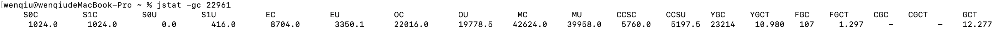

​	修改JVM配置，增加初始化内存和最大内存配置，如下所示。

```bash
-Xms60M
-Xmx60M
-XX:MetaspaceSize=64M
-XX:+PrintGCDetails
-XX:+PrintGCDateStamps
-Xloggc:/Users/wenqiu/Misc/tuning01_gc.log
```

​	重启Spring Boot工程，运行JMeter，查看JMeter吞吐量，如下表所示。

<div style="text-align:center;font-weight:bold;">JMeter吞吐量</div>

| 第一轮 | 第二轮 | 第三轮 | 平均值 |
| :----: | :----: | :----: | :----: |
| 2306.8 | 2236.1 | 2115.7 | 2219.5 |

<div style="text-align:center;font-weight:bold;">jstat查看GC情况</div>

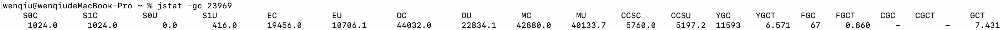

​	通过两次JMeter吞吐量的对比发现，在增大内存之后，吞吐量明显增强。通过jstat命令查看GC状态，展示了增大内存之前的GC状态，其中Full GC次数高达107次，Full GC时间为12.277s。增大内存之后的Full GC状态，其中Full GC次数为67次，GC时间为7.431s。发现增大内存之后，Full GC的次数明显减少，这样系统暂停时间就会减少，所以每秒处理的请求数量就会增多。

​	通过上面的对比发现，在增大内存之后，吞吐量明显增强。<span style="color:red;font-weight:bold;">提高内存后，GC变少，吞吐量增加。</span>

## 26.4 性能优化案例2：调整垃圾收集器提高服务的吞吐量

​	前面的章节讲解了不同的垃圾收集器，下文将测试不同的垃圾收集器对系统服务性能的影响。

​	依旧使用代码<span style="color:blue;font-weight:bold;">案例1：Web服务</span>。

<div style="text-align:center;font-weight:bold;">JMeter线程组配置</div>

| 线程数 | Ramp-Up时间（秒） | 循环次数 |
| :----: | :---------------: | :------: |
|   30   |        10         |   1000   |

​	使用串行垃圾收集器，服务器JVM配置如下。

```bash
-Xms30M
-Xmx30M
-XX:SurvivorRatio=8
-XX:MetaspaceSize=64M
-XX:+UseSerialGC
-XX:+PrintGCDetails
-XX:+PrintGCDateStamps
-Xloggc:/Users/wenqiu/Misc/tuning01_gc.log
```

​	重启Spring Boot工程，运行JMeter，查看JMeter吞吐量如下表所示，这里测试三次数据，最后取平均值。

| 第一轮 | 第二轮 | 第三轮 | 平均值 |
| :----: | :----: | :----: | :----: |
| 516.7  | 497.1  | 486.9  | 500.2  |

​		修改JVM配置，调整垃圾收集器，如下所示。

```bash
-Xms30M
-Xmx30M
-XX:SurvivorRatio=8
-XX:MetaspaceSize=64M
-XX:+UseParallelGC
-XX:+UseParallelOldGC
-XX:ParallelGCThreads=4
-XX:+PrintGCDetails
-XX:+PrintGCDateStamps
-Xloggc:/Users/wenqiu/Misc/tuning01_gc.log
```

​	重启Spring Boot工程，运行JMeter，查看JMeter吞吐量，如下表所示。

| 第一轮 | 第二轮 | 第三轮 | 平均值 |
| :----: | :----: | :----: | :----: |
| 791.1  | 735.7  | 729.8  | 752.2  |

​	通过上面两表的对比发现，在改为并行垃圾收集器之后，吞吐量明显增强。这是因为并行垃圾收集器在串行垃圾收集器的基础上做了优化，垃圾收集由单线程变成了多线程，这样可以缩短垃圾收集的时间。虽然并行垃圾收集器在收集过程中也会暂停应用程序，但是多线程并行执行速度更快，暂停时间也就更短，系统的吞吐量随之提升。

​	接下来我们改为G1收集器看看效果，修改JVM参数配置，将垃圾收集器改为G1，配置参数如下。

```bash
-Xms30M
-Xmx30M
-XX:SurvivorRatio=8
-XX:MetaspaceSize=64M
-XX:+UnlockExperimentalVMOptions
-XX:+UseG1GC
-XX:ConcGCThreads=4
-XX:+PrintGCDetails
-XX:+PrintGCDateStamps
-Xloggc:/Users/wenqiu/Misc/tuning01_gc.log
```

​	重启Spring Boot工程，运行JMeter，查看JMeter吞吐量，如下表所示。

| 第一轮 | 第二轮 | 第三轮 | 平均值 |
| :----: | :----: | :----: | :----: |
| 452.2  | 424.3  | 455.0  | 443.8  |

​	查看压测效果，吞吐量比并行收集器效果差一些，<span style="color:red;font-weight:bold;">看来G1GC尚在实验性阶段，效果并不好</span>。

​	综上，当各位读者在工作中如果服务器的垃圾收集时间较长，或者对请求的处理性能没有达到目标要求的时候，可以考虑使用不同的垃圾收集器来做优化。

## 26.5 性能优化案例3：JIT优化

​	前面章节讲了OOM和垃圾收集器的选择优化。下文从JVM的执行机制层面来优化JVM。

​	第12章讲过Java为了提高JVM的执行效率，提出了一种叫作即时编译(JIT)的技术。即时编译的目的是避免函数被解释执行，而是将整个函数体编译成机器码，每次函数执行时，只执行编译后的机器码即可，这种方式可以使执行效率大幅度提升。根据二八定律（百分之二十的代码占据百分之八十的系统资源），对于大部分不常用的代码，我们无须耗时将之编译为机器码，而是采用解释执行的方式，用到就去逐条解释运行。对于一些仅占据较少系统资源的热点代码（可认为是反复执行的重要代码），则可将之翻译为符合机器的机器码高效执行，提高程序的执行效率。

**1 即时编译的时间开销**

​	通常说JIT比解释快，其实说的是“执行编译后的代码”比“解释器解释执行”要快，并不是说“编译”这个动作比“解释”这个动作快。JIT编译再怎么快，至少也比解释执行一次略慢一些，而要得到最后的执行结果还得再经过一个“执行编译后的代码”的过程。所以，对“只执行一次”的代码而言，解释执行其实总是比JIT编译执行要快。只有频繁执行的代码（热点代码），JIT编译才能保证有正面的收益。

**2 即时编译的空间开销**

​	对一般的Java方法而言，编译后代码的大小相对于字节码的大小，膨胀比达到10倍是很正常的。同上面说的时间开销一样，这里的空间开销也是，只有执行频繁的代码才值得编译，如果把所有代码都编译则会显著增加代码所占空间，导致代码爆炸。这也就解释了为什么有些JVM会选择不总是做JIT编译，而是选择用解释器和JIT编译器的混合执行引擎。

​	具体的即时编译案例在第7章讲解堆的时候已经详细描述过了，这里不再做具体的案例分析，各位读者在工作中可以考虑在代码层面进行优化。

## 26.6 性能优化案例4：G1并发执行的线程数对性能的影响

​	依然使用代码<span style="color:blue;font-weight:bold;">案例1：Web服务</span>，初始化内存和最大内存调整小一些，目的是让程序发生Full GC，关注点是GC次数、GC时间，以及JMeter的平均响应时间。

<div style="text-align:center;font-weight:bold;">JMeter线程组配置</div>

| 线程数 | Ramp-Up时间（秒） | 循环次数 |
| :----: | :---------------: | :------: |
|   30   |        10         |   1000   |

​	JVM配置如下，并发线程数量为2。

```bash
-Xms40M
-Xmx40M
-XX:SurvivorRatio=8
-XX:MetaspaceSize=64M
-XX:+UnlockExperimentalVMOptions
-XX:+UseG1GC
-XX:ConcGCThreads=2
-XX:+PrintGCDetails
-XX:+PrintGCDateStamps
-Xloggc:/Users/wenqiu/Misc/tuning01_gc.log
```

​	重启Spring Boot工程，运行JMeter，查看JMeter吞吐量，如下表所示。

<div style="text-align:center;font-weight:bold;">jstat查看GC情况</div>

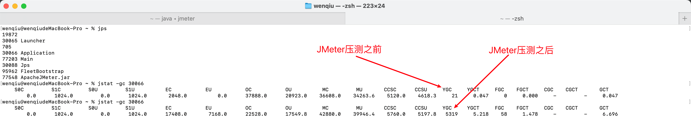

​	由此可以计算出压测过程中，发生的GC次数和GC时间差。

```bash
YGC:youngGC次数是 5319 - 21 = 5298
FGC:Full GC次数是 58 - 0 = 58
GCT:GC总时间是 6.696 - 0.047 = 6.649
```

​	压测结果如下图所示。

<div style="text-align:center;font-weight:bold;">JMeter聚合报告</div>


​	从上图中可以看到95%的请求响应时间为14ms,99%的请求响应时间为43ms。

​	下面我们设置并发线程数量为1，如下所示。

```bash
-Xms40M
-Xmx40M
-XX:SurvivorRatio=8
-XX:MetaspaceSize=64M
-XX:+UnlockExperimentalVMOptions
-XX:+UseG1GC
-XX:ConcGCThreads=1
-XX:+PrintGCDetails
-XX:+PrintGCDateStamps
-Xloggc:/Users/wenqiu/Misc/tuning01_gc.log
```

​	重启Spring Boot工程，运行JMeter，查看JMeter吞吐量，如下表所示。

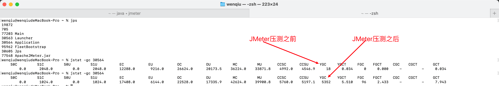

​	由此可以计算出压测过程中，发生的GC次数和GC时间差。

```bash
YGC:youngGC次数是 5352 - 18 = 5334
FGC:Full GC次数是 96 - 0 = 96
GCT:GC总时间是 7.943 - 0.034 = 7.929
```

​	压测结果如下图所示。

<div style="text-align:center;font-weight:bold;">JMeter聚合报告</div>


​	图上图可知，95%的请求响应时间为35ms,99%的请求响应时间为45ms。通过对比发现设置线程数为1之后，服务请求的平均响应时间和GC时间都有一个明显的增加。仅从效果上来看，这次的优化是有一定效果的。大家在工作中对于线上项目进行优化的时候，可以考虑到这方面的优化。

## 26.7 性能优化案例5：合理配置堆内存

​	在案例1中我们讲到了增加内存可以提高系统的性能而且效果显著，那么随之带来的一个问题就是，增加多少内存比较合适？如果内存过大，那么产生Full GC的时候，GC时间会相对比较长；如果内存较小，那么就会频繁的触发GC，在这种情况下，我们该如何合理配置堆内存大小呢？可以根据Java Performance里面的推荐公式来进行设置，如下图所示。

​	公式的意思是Java中整个堆大小设置原则是Xmx和Xms设置为老年代存活对象的3～4倍，即Full GC之后堆内存是老年代内存的3～4倍。方法区（永久代PermSize和MaxPermSize）设置为老年代存活对象的1.2～1.5倍。新生代Xmn的设置为老年代存活对象的1～1.5倍。老年代的内存大小设置为老年代存活对象的2～3倍。

<div style="text-align:center;font-weight:bold;">Java Performance</div>

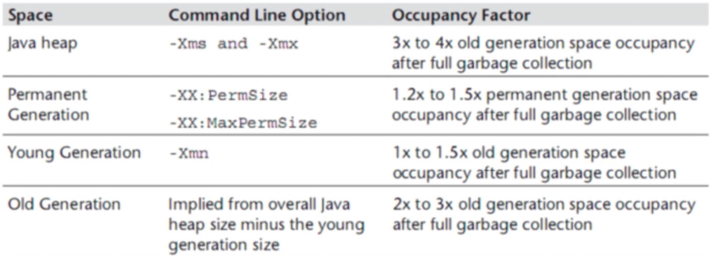

​	但是，上面的说法也不是绝对的，也就是说这给的是一个参考值，根据多次调优之后得出的一个结论，大家可以根据这个值来设置初始化内存。在保证程序正常运行的情况下，我们还要去查看GC的回收率，GC停顿耗时，内存里的实际数据来判断，Full GC是基本上不能太频繁的，如果频繁就要做内存分析，然后再去做一个合理的内存分配。还要注意到一点就是，老年代存活对象怎么去判定。计算老年代存活对象的方式有以下2种。

​	方式1:JVM参数中添加GC日志，GC日志中会记录每次Full GC之后各代的内存大小，观察老年代GC之后的空间大小。可观察一段时间内（比如2天）的Full GC之后的内存情况，根据多次的Full GC之后的老年代的空间大小数据来预估Full GC之后老年代的存活对象大小（可根据多次Full GC之后的内存大小取平均值）。

​	方式2：方式1的方案虽然可行，但需要更改JVM参数，并分析日志。同时，在使用CMS收集器的时候，有可能无法触发Full GC（只发生CMS GC），所以日志中并没有记录Full GC的日志，在分析的时候就比较难处理。所以，有时候需要强制触发一次Full GC，来观察Full GC之后的老年代存活对象大小。需要注意的是强制触发Full GC，会造成线上服务停顿(STW)，要谨慎。我们建议在强制Full GC前先把服务节点摘除，Full GC之后再将服务挂回可用节点，使之对外提供服务。在不同时间段触发Full GC，根据多次Full GC之后的老年代内存情况来预估Full GC之后的老年代存活对象大小，触发Full GC的方式有下面三种。

​	(1)使用如下命令将当前的存活对象dump到文件，此时会触发Full GC。

```bash
jmap -dump:live,format=b,file=heap.bin <pid>
```

​	(2)使用如下命令打印每个class的实例数目、内存占用和类全名信息，此时会触发Full GC。

```bash
jmap -histo:live <pid>
```

​	(3)在性能测试环境，可以通过Java监控工具来触发Full GC，比如使用VisualVM和JConsole，这些工具在最新的JDK的bin目录下可以找到。VisualVM或者JConsole上面有一个触发GC的按钮，在第21章有讲过，此处不再赘述。


​	依旧使用代码<span style="color:blue;font-weight:bold;">案例1：Web服务</span>。

<div style="text-align:center;font-weight:bold;">JMeter线程组配置</div>

| 线程数 | Ramp-Up时间（秒） | 循环次数 |
| :----: | :---------------: | :------: |
|   30   |        10         |   1000   |

​	最开始可以将内存设置得大一些，比如设置为4GB。当然也可以根据业务系统估算，比如从数据库获取一条数据占用128字节，每次需要获取1000条数据，那么一次读取到内存的大小就是(128/1024/1024)×1000=0.122MB，程序可能需要并发读取，比如每秒读取1000次，那么内存占用就是0.122×1000=12MB，如果堆内存设置为1GB，新生代大小大约就是333MB，那么每333/12=27.75s就会把新生代内存填满，也就是说我们的程序几乎每分钟进行两次Young GC。

​	现在我们通过IDEA启动Spring Boot工程，将内存初始化为1024MB。这里就从1024MB的内存开始分析系统的GC日志，根据上面的一些知识来进行一个合理的内存设置。

​	JVM设置如下。

```bash
-Xms1024M
-Xmx1024M
-Xss512K
-XX:SurvivorRatio=8
-XX:MetaspaceSize=64M
-XX:+PrintGCDetails
-XX:+PrintGCDateStamps
-Xloggc:/Users/wenqiu/Misc/tuning01_gc.log
-XX:+HeapDumpOnOutOfMemoryError
-XX:HeapDumpPath=/Users/wenqiu/Misc/tuning01_dump.hprof
```

​	通过JMeter访问一段时间后，主要是看项目是否可以正常运行，使用下面的命令查看JVM统计信息状态。

​	JVM统计信息如下图所示。

<div style="text-align:center;font-weight:bold;">JVM统计信息</div>

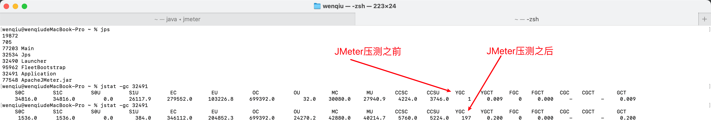

​	从上图中可以得出如下信息。

```bash
YGC平均耗时: (0.200 - 0.009) * 1000 / (197 - 1) = 0.97ms
FGC未产生
```

<div style="text-align:center;font-weight:bold;">JMeter聚合报告</div>

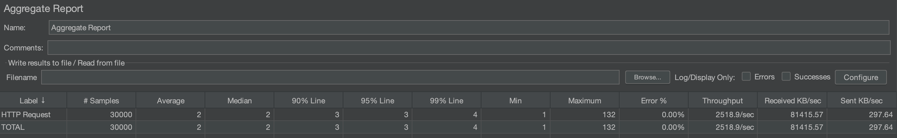

​	看起来似乎不错，YGC触发的频率不高，FGC也没有产生，但这样的内存设置是否还可以继续优化呢？是不是有一些空间是浪费的呢？

​	为了快速看数据，我们使用了方式2，通过命令 jmap -histo:live pid 产生几次Full GC,Full GC之后，使用jmap -heap来查看当前的堆内存情况。

​	通过VisualVM观察老年代存活对象大小。

<div style="text-align:center;font-weight:bold;">内存空间分配</div>


​	可以看到老年代存活对象占用内存空间大概为16.101MB，老年代的内存分配为683MB左右。按照整个堆大小是老年代Full GC之后的3～4倍计算的话，设置堆内存在Xmx=17×3 = 51MB至17×4 = 68MB之间。

​	我们修改堆内存大小为70MB,JVM参数设置如下所示。

```bash
-Xms70M
-Xmx70M
-Xss512K
-XX:SurvivorRatio=8
-XX:MetaspaceSize=64M
-XX:+PrintGCDetails
-XX:+PrintGCDateStamps
-Xloggc:/Users/wenqiu/Misc/tuning01_gc.log
-XX:+HeapDumpOnOutOfMemoryError
-XX:HeapDumpPath=/Users/wenqiu/Misc/tuning01_dump.hprof
```

​	修改完之后，查看JVM统计信息，如下图所示。

<div style="text-align:center;font-weight:bold;">JVM统计信息</div>

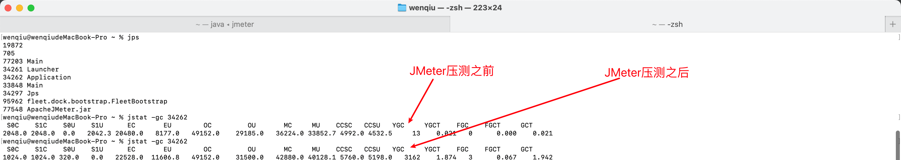

​	从上图中可以得出如下信息。

```bash
YGC平均耗时: (1.874 - 0.021) * 1000 / (3162 - 13) = 0.59ms
FGC平均耗时: (0.067 - 0.000) * 1000 / (3 - 0) = 22.33ms
```

<div style="text-align:center;font-weight:bold;">JMeter聚合报告</div>

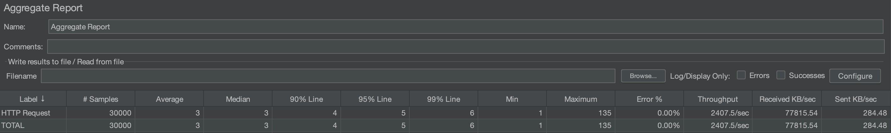

​	观察到，产生了FGC，需要再扩大点内存容量，比如：100MB。

<div style="text-align:center;font-weight:bold;">JVM统计信息</div>

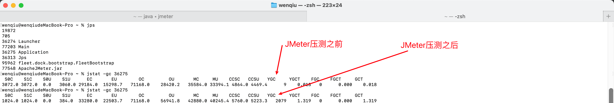

​	从上图中可以得出如下信息。

```bash
YGC平均耗时: (1.319 - 0.016) * 1000 / (2079 - 9) = 0.63ms
FGC未产生
```

<div style="text-align:center;font-weight:bold;">JMeter聚合报告</div>

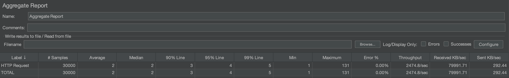

​	修改完之后YGC平均耗时为0.63ms，没有产生Full GC。整体的GC耗时减少。但GC频率比之前的1024M时要多一些。依然未产生Full GC，所以我们内存设置为100MB也是比较合理的，相对之前节省了很大一块内存空间，所以本次内存调整是比较合理的。

​	再次手动触发Full GC，查看堆内存结构，如下图所示，可以发现堆内存足够使用。

<div style="text-align:center;font-weight:bold;">内存空间分配</div>

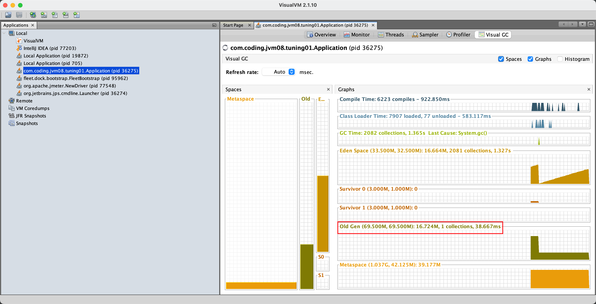

​	从以上试验得知在内存相对紧张的情况下，可以按照上述的方式来进行内存的调优，找到一个在GC频率和GC耗时上都可接受的内存设置，用较小的内存满足当前的服务需要。

​	但当内存相对宽裕的时候，可以相对给服务多增加一点内存，减少GC的频率。一般要求低延时的可以考虑多设置一点内存，对延时要求不高的，可以按照上述方式设置较小内存。

​	如果在垃圾收集日志中观察到堆内存发生OOM，尝试把堆内存扩大到物理内存的80%～90%。在扩大了内存之后，再检查垃圾收集日志，直到没有OOM为止。如果应用运行在稳定状态下没有OOM就可以进入下一步了，计算活动对象的大小。

## 26.8 性能优化案例6：CPU占用很高排查方案【未完待续】

​	当系统出现卡顿或者应用程序的响应速度非常慢，就可能要考虑到服务器上排查一番，作为应用负责人，都希望自己负责的应用能够在线上环境运行顺畅，不出任何错误，也不产生任何告警，当然这是最理想的结果。可实际上应用总会在不经意间发生一些意外的情况，例如CPU偏高、内存占用偏高、应用没有响应、应用自动挂掉等。这里分享的案例是关于如何排查CPU偏高的问题。代码清单26-2用于模拟应用CPU占用偏高。大家都知道，如果某个线程一直对这个CPU的占用不释放，会把这个CPU给占满，其他线程无法使用，如果机器核数比较低，那么就会感觉到明显的卡顿。

## 26.9 性能优化案例7：日均百万级订单交易系统设置JVM参数

​	每天百万级订单绝对是现在顶尖电商公司的交易量级。百万级订单一般在4小时内产生，我们计算一下每秒产生多少订单：3000000/4/3600 = 208单/s，为了方便计算，我们按照每秒300单来计算。

​	这种系统一般至少需要三四台机器去支撑，假设我们部署了三台机器，也就是每台机器每秒大概处理100单，也就是每秒大概有100个订单对象在堆空间的新生代内生成，一个订单对象的大小跟里面的字段多少及类型有关，比如int类型的订单id和用户id等字段，double类型的订单金额等，int类型占用4字节，double类型占用8字节，粗略估计一个订单对象大概是1KB，也就是说每秒会有100KB的订单对象分配在新生代内，如下图所示。

<div style="text-align:center;font-weight:bold;">每秒产生订单对象大小</div>

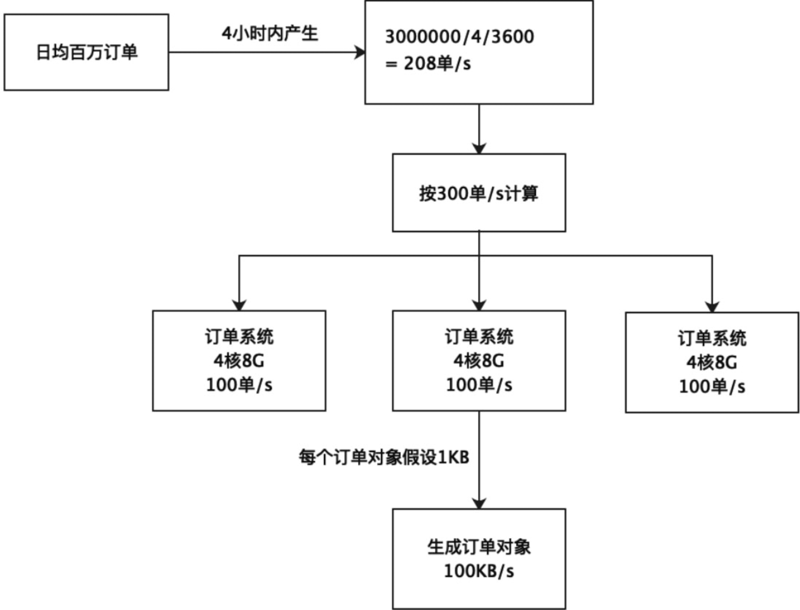

​	真实的订单交易系统肯定还有大量的其他业务对象，比如购物车、优惠券、积分、用户信息、物流信息等，实际每秒分配在新生代内的对象大小应该要再扩大几十倍，假设是20倍，也就是每秒订单系统会往新生代内分配近2MB的对象数据，这些数据在订单提交的操作做完之后，基本都会成为垃圾对象，如下图所示。

<div style="text-align:center;font-weight:bold;">模拟实际交易场景每秒产生订单对象大小</div>

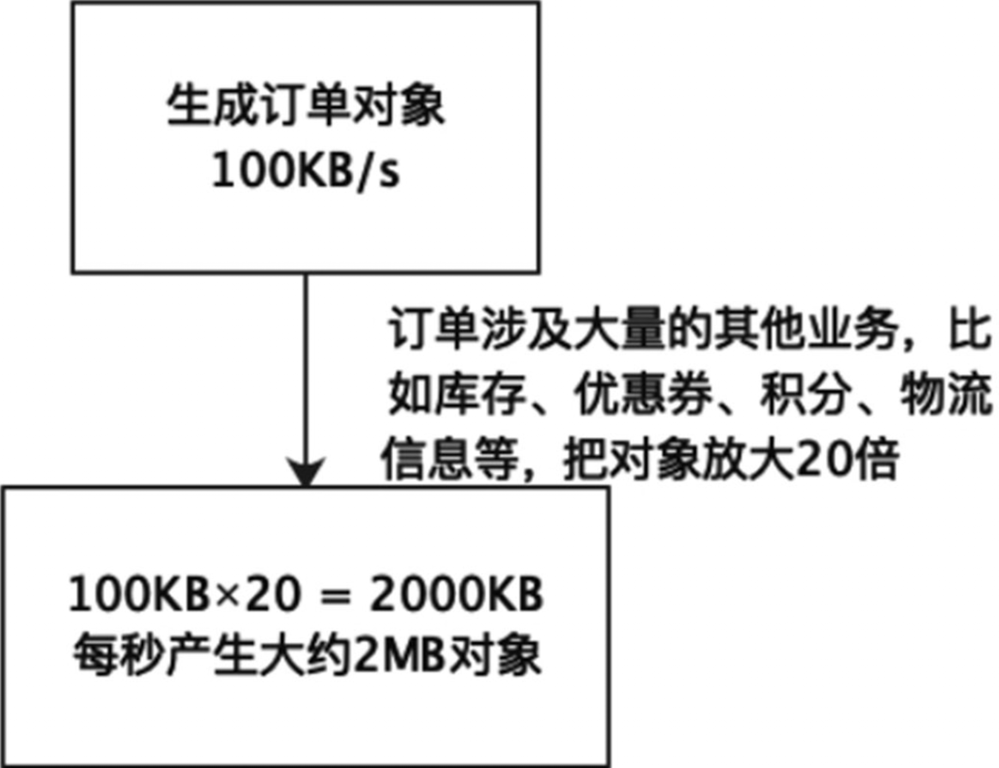

​	假设我们选择4核8G的服务器，JVM堆内存分到4GB左右，于是给新生代至少分配1GB，这样差不多需要650秒可以把新生代占满，进而触发Minor GC，这样的GC频率是可以接受的，如下图所示。另外，也可以继续调整新生代大小，新生代和老年代比例不一定必须是1:2，这样也可以降低GC频率，进入老年代的对象也会降低，减少Full GC频率。

<div style="text-align:center;font-weight:bold;">内存分配和内存回收频率</div>


​	如果系统业务量继续增长，那么可以水平扩容增加更多的机器，比如5台甚至10台机器，这样每台机器的JVM处理请求可以保证在合适范围，不致因压力过大导致大量的GC。

​	假设业务量暴增几十倍，在不增加机器的前提下，整个系统每秒要生成几千个订单，之前每秒往新生代里分配的2MB对象数据可能增长到几十兆，而且因为系统压力骤增，一个订单的生成不一定能在1秒内完成，可能要几秒甚至几十秒，那么就有很多对象会在新生代里存活几十秒之后才会变为垃圾对象，如果新生代只分配了几百兆，意味着一二十秒就会触发一次Minor GC，那么很有可能部分对象就会被挪到老年代，这些对象到了老年代后因为对应的业务操作执行完毕，马上又变为了垃圾对象，随着系统不断运行，被挪到老年代的对象会越来越多，最终可能又会导致Full GC，如下图所示。

<div style="text-align:center;font-weight:bold;">JVM参数设置流程</div>

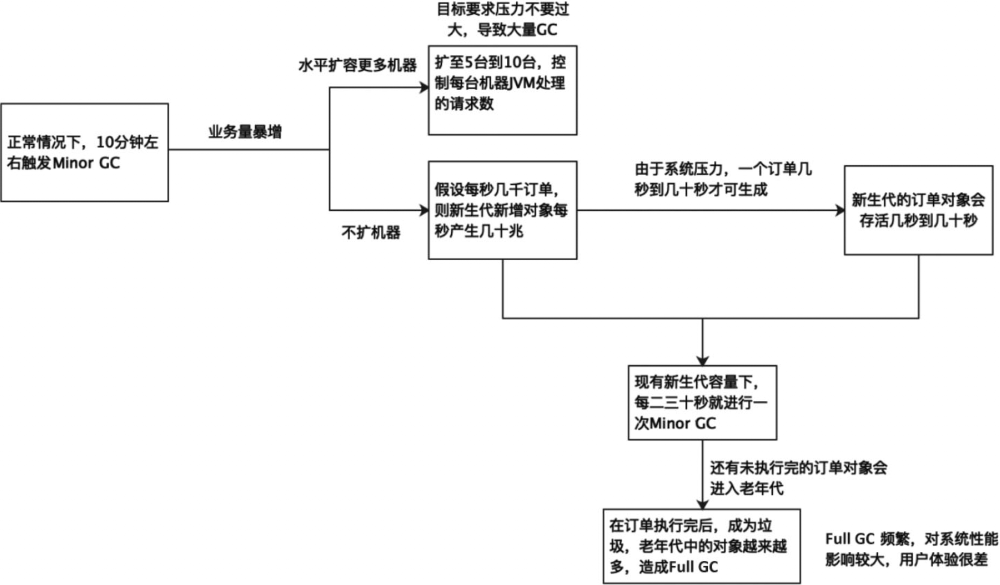

## 26.10 性能优化案例8：综合性能优化【未完待续】

​	本案例将模拟生产环境中出现的高占用CPU和OOM问题的出现对系统进行优化，程序如下代码所示。

<span style="color:#40E0D0;">案例1：综合性能优化案例</span>

- 代码

```java
package com.coding.jvm08.tuning02;

import lombok.RequiredArgsConstructor;
import org.springframework.scheduling.concurrent.CustomizableThreadFactory;
import org.springframework.web.bind.annotation.RequestMapping;
import org.springframework.web.bind.annotation.RestController;

import java.util.List;
import java.util.concurrent.*;

@RestController
@RequiredArgsConstructor
public class Tuning02Controller {

    @RequestMapping("/getData")
    public Void visit() {
        // 1、创建线程池
        int count = 7;
        ThreadFactory builder = new CustomizableThreadFactory("BizThreadPool-%d");
        ExecutorService executorService = new ThreadPoolExecutor(count, count, 2, TimeUnit.HOURS, new ArrayBlockingQueue<>(10), builder);

        // 模拟获取商品信息
        CompletableFuture<Object> productList =
                CompletableFuture.supplyAsync(
                        () -> {
                            while (true) {
                            }
                        },
                        executorService);

        // 模拟获取商品价格
        CompletableFuture<Object> productPrice = CompletableFuture.supplyAsync(
                () -> {
                    for (int i = 0; i < Long.MAX_VALUE; i++) {
                        System.out.println("商品价格为： " + 10 + " 元");
                        try {
                            // 模拟 I/O 等待、切换
                            Thread.sleep(20);
                        } catch (InterruptedException e) {
                            e.printStackTrace();
                        }
                    }
                    return null;
                },
                executorService);

        // 模拟获取商品分类信息
        CompletableFuture<Object> productClassify = CompletableFuture.supplyAsync(() -> {
            for (int i = 0; i < Integer.MAX_VALUE; i++) {
            }
            System.out.println("商品分类为：电子商品");
            return null;
        }, executorService);

        CompletableFuture.anyOf(productList, productPrice, productClassify).join();
        return null;
    }
}

```

​	案例中模拟一个Web网站请求后台数据的接口，当用户访问一个页面时，后台有可能调用多个服务，比如请求商品详情页面，需要调用商品信息、商品价格，以及商品分类等信息。如果在该服务中，对上面几个服务进行串行调用，无疑会增加服务的响应时间，造成用户体验非常差，所以这里采用了异步编排技术(CompletableFuture)和线程池来对各个服务进行异步调用，这样可以最大程度提升系统响应时间。

​	代码中，“模拟获取商品信息服务”使用了死循环代码，这里只是为了模拟在服务调用过程中出现的线程长时间占用CPU的情况，和前面讲到的案例6一样。模拟“获取商品价格服务”中线程每次休眠20 ms，是用于模拟I/O等待、切换。模拟“获取商品分类信息”服务中使用了有限的循环次数，这样做是为了保证服务最终可以被正常调用，不会出现请求一直等待的状态。

​	启动SpringBoot服务，JVM配置如下。

```bash
-Xms600M
-Xmx600M
-XX:SurvivorRatio=8
-XX:MetaspaceSize=64M
-XX:+UnlockExperimentalVMOptions
-XX:+UseG1GC
-XX:+PrintGCDetails
-XX:+PrintGCDateStamps
-Xloggc:/Users/wenqiu/Misc/tuning02_gc.log
-XX:+HeapDumpOnOutOfMemoryError
-XX:HeapDumpPath=/Users/wenqiu/Misc/tuning02_dump.hprof
```

​	通过top命令查看机器状态，机器负载以及CPU占用率均正常，如下图所示。

<div style="text-align:center;font-weight:bold;">top命令查看机器状态(1)</div>


​	可以看到此时机器运行状态无异常，通过请求访问服务，浏览器输入以下地址 http://localhost:8080/getData 。再次通过top命令查看机器状态，如下图所示。

<div style="text-align:center;font-weight:bold;">top命令查看机器状态(2)</div>


​	各位读者可以发现，其中只有Cpu1处于100%的状态，但是如果“获取商品价格服务”中线程删除每次休眠50 ms，不再用于模拟I/O等待、切换，那么此时就会有两个CPU处于100%的状态，为了验证“获取商品价格服务”一直处于运行状态，可以查看日志信息，如下所示。

```bash
商品价格为：10元
商品价格为：10元
商品价格为：10元
商品价格为：10元
商品价格为：10元
商品价格为：10元
商品价格为：10元
商品价格为：10元
商品价格为：10元
商品价格为：10元
商品价格为：10元
商品价格为：10元
```

​	可以发现，日志一直处于打印状态，说明线程一直在运行。这两段代码说明了一个问题，一个满载运行的线程（不停执行“计算”型操作时）可以把单个核心的利用率全部占用，多核心CPU最多只能同时执行等于核心数的满载线程数，在本机器中，最多只能同时执行4个线程。当项目中存在I/O等暂停类操作时，CPU处于空闲状态，操作系统调度CPU执行其他线程，可以提高CPU利用率，同时执行更多的线程。本案例使用线程休眠来模拟该操作，其他的I/O操作例如在项目中需要大量数据插入数据库，或者打印了大量的日志信息等操作（注意，如果打印日志信息过多，会造成服务运行时间加长，但是机器的负载不会增加，工作中还是要尽量打印简洁明了的日志信息）。

​	进行多次请求，此时再通过top命令查看机器性能，每多一次请求，就多一个CPU核心利用率被占满，如下图所示。

<div style="text-align:center;font-weight:bold;">top命令查看机器状态(3)</div>


​	使用案例6中的解决方案进行问题定位。

# 分割线========================


### 堆（Heap）

#### 栈上分配、TLAB、PLAB

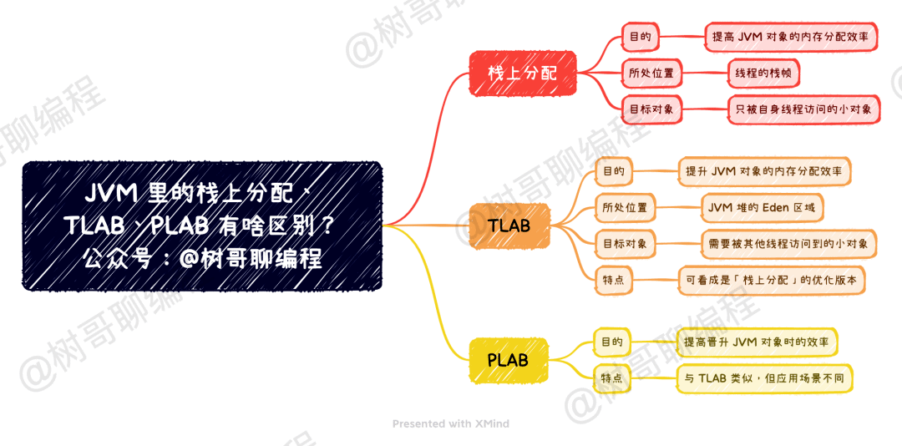

## 2、性能优化案例

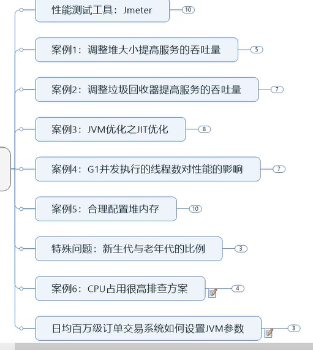

## 3、Java代码层以及其它层面调优


延迟满足

遵守时间的价值

保有好奇心


