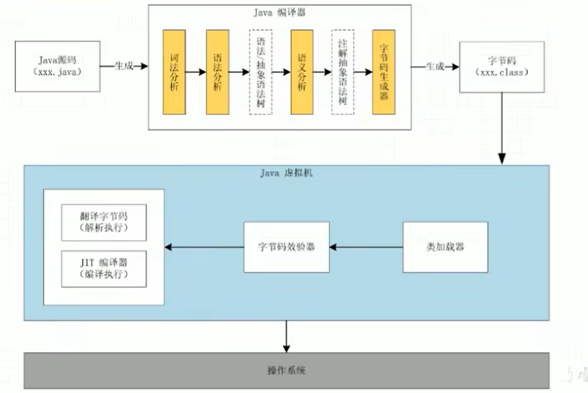

# backend-jvm-learning

[TOC]

JVM：

https://www.bilibili.com/video/BV1PJ411n7xZ?p=14&spm_id_from=pageDriver&vd_source=b850b3a29a70c8eb888ce7dff776a5d1

JDK8文档：

https://docs.oracle.com/javase/8/docs

# 一、开始

## JVM的位置

## JVM的整体结构

## Java代码执行流程

## JVM的架构模型

Java 编译器输入的指令流基本上是一种**基于栈的指令集架构**，另外一种指令集架构则是**基于寄存器的指令集架构**。

具体来说，这两种架构之间的区别：

- 基于栈式架构的特点
  - 设计和实现更简单，适用于资源受限的系统；
  - 避开了寄存器的分配难题：使用零地址指令方式分配；
  - 指令流中的指令大部分是零地址指令，其执行过程依赖于操作栈。指令集更小，编译器容易实现；
  - 不需要硬件支持，可移植性更好，更好实现跨平台。
- 基于寄存器架构的特点
  - 典型的应用是 x86 的二进制指令集：比如传统的PC以及Android的Davlik虚拟机；
  - 指令集架构则完全依赖硬件，可移植性差；
  - 性能优秀和执行更高效；
  - 花费更少的指令去完成一项操作；
  - 在大部分情况下，基于寄存器架构的指令集往往都以一地址指令、二地址指令和三地址指令为主，而基于栈式架构的指令集却是以零地址指令为主。

总结：由于跨平台性的设计，Java的指令都是根据栈来设计的。不同平台CPU架构不同，所以不能设计为基于寄存器的。优点是跨平台，指令集小，编译器容易实现，缺点是性能下降，实现同样的功能需要更多的指令。

栈：跨平台性、指令集小、指令多；执行性能比寄存器差。

## JVM的声明周期

