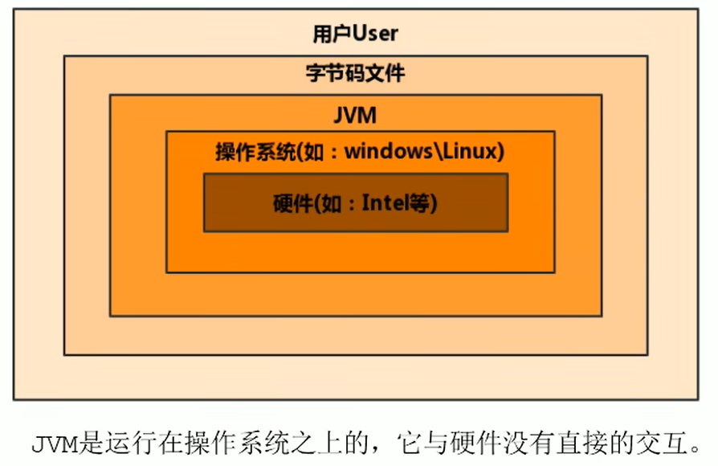
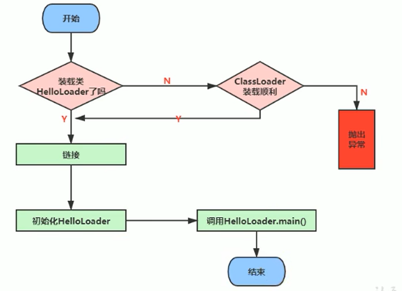

# backend-jvm-learning

[TOC]

JVM：

https://www.bilibili.com/video/BV1PJ411n7xZ?p=34&spm_id_from=pageDriver&vd_source=b850b3a29a70c8eb888ce7dff776a5d1

JDK8文档：

https://docs.oracle.com/javase/8/docs

# 一、JVM与Java体系结构

## JVM发展历程

### Sun Classic VM

- 早在1996年Java1.0版本的时候，Sun公司发布了一款名为Sun Classic VM的Java虚拟机，它同时也是**世界上第一款商用Java虚拟机**，JDK1.4时完全被淘汰。
- 这块虚拟机内部只提供解释器。
- 如果使用JIT编译器，就需要进行外挂。但是一旦使用了JIT编译器，JIT就会接管虚拟机的执行系统。解释器就不再工作。解释器和编译器不能配合工作。

- 现在HotSpot内置了此虚拟机。

### Exact VM

- 为了解决上一个虚拟机问题，JDK1.2时，Sun提出了此虚拟机。
- Exact Memory Management：准确式内存管理
  - 也可以叫Non-Conservative/Accurate Memory Management
  - 虚拟机可以知道内存中某个位置的数据具体是什么类型。
- 具备现代高性能虚拟机的雏形
  - 热点探测
  - 编译器与解释器混合工作模式
- 只在Solaris平台短暂使用，其他平台上还是Classic VM
  - 英雄气短，最终被Hotspot虚拟机替换

### Sun HotSpot VM

- HotSpot历史

  - 最初由一家名为“Longview Technologies”的小公司设计
  - 1997年，此公司被Sun收购；2009年，Sun公司被甲骨文收购
  - JDK1.3时，HotSpot VM成为默认虚拟机

- 目前**HotSpot占有绝对的市场地址，称霸武林。**

  - 不管是现在仍在广泛使用的JDK6，还是使用比例比较多的JDK8中，默认的虚拟机都是HotSpot
  - Sun/Oracle JDK和OpenJDK的默认虚拟机
  - 因此，本文默认介绍的都是HotSpot，相关机制也主要是指HotSpot的GC机制。（比如，**其他两个商用虚拟机都没有方法区**的概念）

- 从服务器、桌面到移动端、嵌入式都有应用。

- 名称中的HotSpot指的就是它的热点代码探测技术

  - 通过计数器找到最具编译价值的代码，触发即时编译或者栈上替换

  - 通过编译器与解释器协同工作，在最优化的程序响应时间与最佳执行性能中取得平衡

### BEA JRockit VM的介绍（也被Oracle收购）

- **专注于服务器端应用**
  - 它可以不太关注程序启动速度，因此**JRockit内部不包含解析器实现**，全部代码都靠即时编译器编译后执行。
- 大量的行业基准测试显示，**JRockit JVM是世界上最快的JVM。**
  - 使用JRockit产品，客户已经体验到了显著的性能提高（一些超过了70%）和硬件成本的减少（达50%）。
- 优势：全面的Java运行时解决方案组合
  - JRockit面向延迟敏感型应用的解决方案JRockit Real Time提供以毫秒或微妙级的JVM响应时间，适合财务、军事指挥、电信网络的需要。
  - MissionControl服务套件，它是一组以极低的开销来监控、管理和分析生产环境中的应用程序的工具。
- 2008年，BEA被Oracle收购。
- Oracle表达了整合两大优秀虚拟机的工作，大致在JDK8中完成。整合的方式是在HotSpot的基础上，移植JRockit的优秀特性。

### IBM J9 VM的介绍

- 全称：IBM Technology for Java Virtual Machine，简称IT4J，内部代号：J9
- 市场定位与HotSpot接近，服务器端、桌面应用、嵌入式等多用途VM
- 广泛用于IBM的各种Java产品。
- 目前，**有影响力的三大商用虚拟机之一**，也号称是世界上最快的Java虚拟机。
- 2017年左右，IBM发布了开源J9 VM，命名为OpenJ9，交给Eclipse基金会管理，也称为Eclipse OpenJ9。

### KVM和CDC/CLDC HotSpot

- Oracle在Java ME产品线上的两款虚拟机为：CDC/CLDC HotSpot Implementation VM
- KVM（Kilobyte）是CLDC-HI早起产品
- 目前移动领域地位尴尬，智能手机被Android和IOS二分天下
- KVM简单、轻量、高度可移植，面向更低端的设备上还维持自己的一片市场
  - 智能控制器、传感器
  - 老人手机、经济欠发达地区的功能手机
- 所有的虚拟机的原则：一次编译，到处运行。

### Azul VM

- 前面三大“高性能Java虚拟机”使用在通用硬件平台上
- 这里Azul VM和BEA Liquid VM是**与特定硬件平台绑定、软硬件配合的专有虚拟机**
  - 高性能Java虚拟机中的战斗机。

- Azul VM是Auzl Systems公司在HotSpot基础上进行大量改进，运行于Azul Systems公司的专有硬件Vega系统上的Java虚拟机。
- **每个Azul VM实例都可以管理至少数十个CPU和数百GB内存的硬件资源，并提供在巨大内存范围内实现可控的GC时间的垃圾收集器、专有硬件优化的线程调度等优秀特性。**
- 2010年，Azul Systems公司开始从硬件转向软件，发布了自己的Zing JVM，可以在通用X86平台上提供接近于Vega系统的特性。

### Liquid VM

- 高性能Java虚拟机中的战斗机。
- BEA公司开发的，直接运行在自家Hypervisor系统上
- Liquid VM即是现在的JRockit VE（Virtual Edition），**Liquid VM不需要操作系统的支持，或者说它自己本身实现了一个专用操作系统的必要功能，如线程调度、文件系统、网络支持等**。
- 随着JRockit虚拟机终止开发，Liquid VM项目也停止了。

### Apache Harmony

- Apache也曾经推出过与JDK1.5和JDK1.6兼容的Java运行平台Apache Harmony。
- 它是IBM和Intel李安和开发的开源JVM，受到同样开源的OpenJDK的压制，Sun坚决不让Harmony获得JCP认证，最终于2011年退役，IBM转而参与OpenJDK。
- 虽然目前并没有Apache Harmony被大规模商用的案例，但是它的Java类库代码吸纳进了Android SDK。

### Microsoft JVM

- 微软为了在IE3浏览器中支持Java Applets，开发了Microsoft JVM。
- 只能在Windows平台下运行。但却是当时Windows下性能最好的Java VM。
- 1997年，Sun以侵犯商标、不正当竞争罪名指控微软成功，赔了Sun很多钱。微软在WindowsXP SP3中抹掉了其VM。现在Windows上安装的JDK都是HotSpot。

### Taobao JVM

- 由AliJVM团队发布。阿里，国内使用Java最强大的公司，覆盖云计算、金融、物流、电商等众多领域，需要解决高并发、高可用、分布式的复合问题。有大量的开源产品。
- **基于OpenJDK开发了自己的定制版AlibabaJDK**、简称AJDK。是整个阿里Java体系的基石。
- 基于OpenJDK HotSpot VM发布的国内第一个优化、**深度定制且开源的高性能服务器版Java虚拟机**。
  - 创新的GCIH（GC invisible heap）技术实现了off-heap，**即将生命周期较长的Java对象从heap中移动到heap之外，并且GC不能管理GCIH内部的Java对象，依次达到降低GC的回收频率和提升GC的回收效率的目的**。
  - GCIH中的**对象还能够在多个Java虚拟机进程中实现共享**。
  - 使用crc32指令实现JVM intrinsic降低JNI的调用开销
  - PMU hardware的Java profiling tool和诊断协助功能
  - 针对大数据场景的ZenGC
- taobao vm应用在阿里产品上性能高，硬件严重依赖intel的cpu，损失了兼容性，但提高了性能
  - 目前已经在淘宝、天猫上线，把Oracle官方JVM版本全部替换了。

### Dalvik VM

- 谷歌开发的，应用于Android系统，并在Android2.2中提供了JIT，发展迅猛。
- **Dalvik VM只能称作虚拟机，而不能称作“Java虚拟机”**，它没有遵循Java虚拟机规范。
- 不能直接执行Java的Class文件
- 基于寄存器架构，而不是JVM的栈架构
- 执行的是编译以后的dex（Dalvik Executable）文件。执行效率比较高。
  - 它执行的dex（Dalvik Executable）文件可以通过Class文件转化而来，使用Java语法编写应用程序，可以直接使用大部分的Java API等。
- Android5.0使用支持提前编译（Ahead Of Time Compilation，AOT）的ART VM替换Dalvik VM.

### 其他JVM

Java Card VM、Squawk VM、JavaInJava、Maxine VM、Jikes RVM、IKVM.NET、Jam VM、Cacao VM、Sable VM、Kaffe、Jelatine JVM、Nano VM、MRP、Moxie JVM

**具体JVM的内存结构，其实取决于其实现，不同厂商的JVM，或者同一个厂商发布的不同版本，都有可能存在差异。**

### Graal VM

- 2018年4月，Oracle Labs公开了Graal VM，号称**“Run Programs Faster Anywhere”**，勃勃野心。与1995年Java的“write once，run anywhere”遥相呼应。
- Graal VM在HotSpot VM基础上增强而成的**跨语言全栈虚拟机，可以作为“任何语言”的运行平台使用**。语言包括：Java、Scala、Groovy、Kotlin；C、C++、JavaScript、Ruby、Python、R等。
- 支持不同语言中混用调用对方的接口和对象，支持这些语言使用已经编写好的本地库文件
- 工作原理是将这些语言的源代码或者源代码编译后的中间格式，通过解释器转换为能被Graal VM接受的中间表示。Graal VM提供Truffle工具集快速构建面向一种新语言的解释器。在运行时还能进行即时编译优化，获得比原生编译器更优秀的执行效率。
- **如果说HotSpot有一天真的被取代，Graal VM希望最大。**但是Java的软件生态没有丝毫变化。

## JVM的位置

## JVM内存结构概述

### 简图

### 详细图

### 详细图2

### 类加载子系统

- 类加载子系统负责从文件系统或者网络中加载Class文件，Class文件在文件开头有特定的文件标识。
- ClassLoader只负责Class文件的加载，至于它是否可以运行，则由Execution Engine决定。
- 加载的类信息存放于一块称为方法区的内存空间。除了类的信息外，方法区中还会存放运行时常量池信息，可能还包括字符串字面量和数字常量（这部分常量信息是Class文件中常量池部分的内存映射）。

#### 类加载器ClassLoader角色

1）class file存在于本地硬盘上，可以理解为设计师画在纸上的模板，而最终这个模板在执行的时候是要加载到JVM当中来根据这个文件实例化出n个一模一样的实例。

2）class file加载到JVM中，被称为DNA元数据模板，放在**方法区**。

3）在.class文件->JVM->最终成为元数据模板，此过程就要一个运输工具（类装载器Class Loader），扮演一个快递员的角色。

#### 类的加载过程

**加载：**

1）通过一个类的全限定名获取定义此类的二进制字节流；

2）将这个字节流所代表的静态存储结构转化为方法区的运行时数据结构；

3）**在内存中生成一个代表这个类的java.lang.Class对象**，作为方法区这个类的各种数据的访问入口。

**补充：加载.class文件的方式**

- 从本地系统中直接加载

- 通过网络获取，典型场景：Web Applet
- 从zip压缩包中读取，成为日后jar、war格式的基础
- 运行时计算生成，使用最多的是：动态代理技术
- 由其他文件生成，典型场景：JSP应用
- 从专有数据库中提取.class文件，比较少见
- 从加密文件中获取，典型的防止Class文件被反编译的保护措施

**验证（Verify）：**

- 目的在于确保Class文件的字节流中包含信息符合当前虚拟机要求，保证被加载类的正确性，不会危害虚拟机自身安全；
- 主要包括四种验证：文件格式验证、元数据验证、字节码验证、符号引用验证；

**准备（Prepare）：**

- 为类变量分配内存并且设置该类变量的默认初始值，即零值；
- **这里不包含用final修饰的static，因为final在编译的时候就会分配了，准备阶段会显式初始化；**
- **这里不会为实例变量分配初始化**，类变量会分配在方法区中，而实例变量是会随着对象一起分配到Java堆中。

**解析（Resolve）：**

- 将常量池内的符号引用转换为直接引用的过程；
- 事实上，解析操作往往会伴随着JVM在执行完初始化之后再执行；
- 符号引用就是一组符号来描述所引用的目标。符号引用的字面量形式明确定义在《Java虚拟机规范》的Class文件格式中。直接引用就是直接指向目标的指针、相对偏移量或一个间接定位到目标的句柄。
- 解析动作主要针对类或接口、字段、类方法、接口方法、方法类型等。对应常量池中的CONSTANT_Class_info、CONSTANT_Fieldref_info、CONSTANT_Methodref_info等。

**初始化：**

- **初始化阶段就是指向类构造器方法`<clinit>()`的过程；**（可通过jclasslib查看方法中的clinit）
- 此方法不需定义，是javac编译器自动收集类中的所有**类变量**的赋值动作和**静态代码块**中的语法合并而来；如果类中没有如上两项，则不会生成`<clinit>()`方法。
- 构造器方法中指令按语句在源文件中出现的顺序执行；
- **`<clinit>()`不同于类的构造器。**（关联：构造器是虚拟机视角下的`<init>()`）
- 若该类具有父类，JVM会保证子类的`<clinit>()`执行前，父类的`<clinit>()`已经执行完毕。
- 虚拟机必须保证一个类的`<clinit>()`方法在多线程下被同步加锁。

#### 类加载器分类

- JVM支持两种类型的类加载器，分别为**引导类加载器（Bootstrap ClassLoader）**和**自定义类加载器（User-Defined ClassLoader）**。
- 从概念上来讲，自定义类加载器一般指的是程序中由开发人员自定义的一类类加载器，但是Java虚拟机规范却没有这么定义，而是**将所有派生于抽象类ClassLoader的类加载器都划分为自定义类加载器**。
- 无论类加载器的类型如何划分，在程序中我们最常见的类加载器始终只有3个，如下所示：
- sun.misc.Launcher 虚拟机入口应用

#### 虚拟机自带的加载器

- 启动类加载器（引导类加载器，Bootstrap ClassLoader）
  - 这个类加载器使用**C/C++语言实现的**，嵌套在JVM内部；
  - 它用来加载Java的核心库（JAVA_HOME/jre/lib/rt.jar、resources.jar或sun.boot.class.path路径下的内容），用于提供JVM自身需要的类；
  - 并不继承自java.lang.ClassLoader，没有父加载器；
  - 加载**扩展类和应用程序类加载器**，并指定为他们的父类加载器；
  - 处于安全考虑，Bootstrap启动类加载器只加载包名为java、javax、sun等开头的类。
- 扩展类加载器（Extension ClassLoader）
  - **Java语言编写**，又sun.misc.Launcher$ExtClassLoader实现；
  - **派生于ClassLoader类；**
  - 父类加载器为启动类加载器
  - 从java.ext.dirs系统属性所指定的目录中加载类库，或从JDK的安装目录的jre/lib/ext子目录（扩展目录）下加载类库。**如果用户创建的JAR放在此目录下，也会自动由扩展类加载器加载。**
- 应用程序类加载器（系统类加载器，AppClassLoader）
  - java语言编写，由sun.misc.Launcher$AppClassLoader实现
  - 派生于ClassLoader类
  - 父类加载器为扩展类加载器
  - 它负责加载环境变量classpath或系统属性java.class.path指定路径下的类库
  - **该类加载是程序中默认的类加载器**，一般来说，Java应用的类都是由它来完成加载
  - 通过`ClassLoader#getSystemClassLoader()`方法可以获取 到该类加载器

- 用户自定义类加载器
  - 在Java的日常应用程序开发中，类的加载几乎是由上述三种类加载器相互配合执行的，在必要时，我们还可以自定义类加载器，来定制类的加载方式。

- 为什么要自定义类加载器？
  - 隔离加载类
  - 修改类加载的方式
  - 扩展加载源
  - 防止源码泄露

#### 用户自定义类加载器实现步骤

1）开发人员可以通过继承抽象类`java.lang.ClassLoader`类的方式，实现自己的类加载器，以满足一些特殊的需求；

2）在JDK1.2之前，在自定义类加载亲时，总会去继承ClassLoader类并重写loadClass()方法，从而实现自定义的类加载类，但是在JDK1.2之后已不再建议用户去覆盖loadClass()方法，而是建议把自定义的类加载逻辑写在findClass()方法中；

3）在编写自定义类加载器时，如果没有太过于复杂的需求，可以直接继承URLClassLoader类，这样就可以避免自己去编写findClass()方法及其获取字节码流的方式，使自定义类加载器编写更加简洁。

#### 关于ClassLoader

ClassLoader类，它是一个抽象类，其后所有的类加载器都继承自ClassLoader（不包括启动类加载器）。

| 方法名称                                          | 描述                                                         |
| ------------------------------------------------- | ------------------------------------------------------------ |
| getParent()                                       | 返回该类加载器的超类加载器                                   |
| loadClass(String name)                            | 加载名称为name的类，返回结果为java.lang.Class类的实例        |
| findClass(String name)                            | 查找名称为name的类，返回结果为java.lang.Class类的实例        |
| findLoadedClass(String name)                      | 查找名称name的已经被加载过的类，返回结果为java.lang.Class类的实例 |
| defineClass(String name,byte[] b,int off,int len) | 把字节数组b中的内容转换为一个Java类，返回结果为java.lang.Class类的实例 |
| resolveClass(Class<?> c)                          | 连接指定的一个Java类                                         |

#### 获取ClassLoader的途径

方式一：获取当前类的ClassLoader

clazz.getClassLoader()

方式二：获取当前线程上下文的ClassLoader

Thread.currentThread().getContextClassLoader()

方式三：获取系统的ClassLoader

ClassLoader.getSystemClassLoader()

方法四：获取调用者的ClassLoader

DriverManager.getCallerClassLoader()

## JVM的架构模型

Java 编译器输入的指令流基本上是一种**基于栈的指令集架构**，另外一种指令集架构则是**基于寄存器的指令集架构**。

具体来说，这两种架构之间的区别：

- 基于栈式架构的特点
  - 设计和实现更简单，适用于资源受限的系统；
  - 避开了寄存器的分配难题：使用零地址指令方式分配；
  - 指令流中的指令大部分是零地址指令，其执行过程依赖于操作栈。指令集更小，编译器容易实现；
  - 不需要硬件支持，可移植性更好，更好实现跨平台。
- 基于寄存器架构的特点
  - 典型的应用是 x86 的二进制指令集：比如传统的PC以及Android的Davlik虚拟机；
  - 指令集架构则完全依赖硬件，可移植性差；
  - 性能优秀和执行更高效；
  - 花费更少的指令去完成一项操作；
  - 在大部分情况下，基于寄存器架构的指令集往往都以一地址指令、二地址指令和三地址指令为主，而基于栈式架构的指令集却是以零地址指令为主。

总结：由于跨平台性的设计，Java的指令都是根据栈来设计的。不同平台CPU架构不同，所以不能设计为基于寄存器的。优点是跨平台，指令集小，编译器容易实现，缺点是性能下降，实现同样的功能需要更多的指令。

栈：跨平台性、指令集小、指令多；执行性能比寄存器差。

## JVM的生命周期

**虚拟机的启动**

Java虚拟机的启动是通过引导类加载器（bootstrap class loader）创建一个初始类（initial class）来完成的，这个类是由虚拟机的具体实现指定的。

**虚拟机的执行**

- 一个运行中的Java虚拟机有着一个清晰的任务：执行Java程序；
- 程序开始执行时他才运行，程序结束时他就停止；
- 执行一个所谓的Java程序的时候，真真正正在执行的是一个叫做Java虚拟机的进程。

**虚拟机的退出**

有如下的几种情况：

- 程序正常执行结束
- 程序在执行过程中遇到了异常或错误而异常终止
- 由于操作系统出现错误而导致Java虚拟机进程终止
- 某线程调用Runtime类或者System类的exit方法，或Runtime类的halt方法，并且Java安全管理器也允许这次exit或halt操作
- 除此之外，JNI（Java Native Interface）规范描述了用JNI Invocation API来加载或卸载Java虚拟机时，Java虚拟机的退出情况。

## Java代码执行流程

